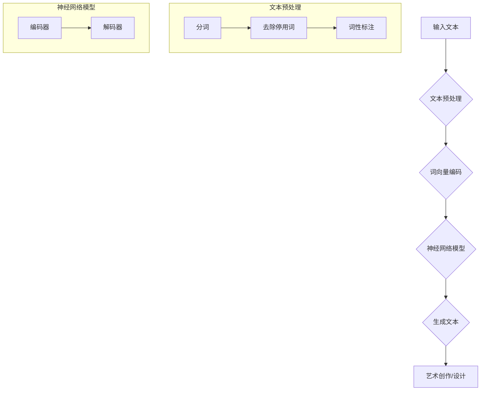

                 

关键词：创意AI、大型语言模型（LLM）、艺术创作、设计应用、机器学习、算法原理、数学模型、项目实践、未来展望

> 摘要：本文探讨了创意AI，特别是大型语言模型（LLM）在艺术创作和设计领域的应用。通过对LLM的核心概念、算法原理、数学模型及其在实际项目中的实践应用进行深入分析，文章旨在展示LLM在提升创意能力和设计效果方面的潜力，同时展望其未来的发展方向和挑战。

## 1. 背景介绍

随着人工智能（AI）技术的飞速发展，机器学习（ML）在各个领域的应用越来越广泛。特别是在艺术和设计领域，人们开始探索如何利用AI技术来辅助人类创造更加卓越的艺术作品和设计方案。本文将重点关注大型语言模型（LLM）在这一领域的应用。

### 1.1 AI与创意设计的结合

AI技术在创意设计中的应用可以分为两个方面：一是作为工具，辅助设计师进行设计工作；二是作为创意的生成者，独立创造新的设计作品。传统的AI技术如计算机图形学、深度学习等已经在图像处理、视频编辑等领域得到了广泛应用，而LLM作为近年来发展迅速的AI模型，为艺术创作和设计提供了全新的可能性。

### 1.2 LLM在艺术创作中的应用

LLM，即大型语言模型，是一种基于深度学习技术构建的自然语言处理（NLP）模型。它的核心优势在于能够理解并生成复杂的自然语言文本。这一特性使得LLM在艺术创作中有着广泛的应用前景，如：

- **诗歌创作**：LLM可以生成具有诗意和情感的诗歌。
- **故事编写**：LLM能够创作出富有想象力和逻辑性的故事。
- **音乐创作**：LLM可以生成旋律、和弦和完整的音乐作品。

### 1.3 LLM在设计领域的应用

在设计领域，LLM的应用主要集中在以下几个方面：

- **创意灵感生成**：LLM可以通过分析大量的设计作品，为设计师提供创意灵感。
- **个性化设计**：LLM可以根据用户的偏好和需求，生成个性化的设计方案。
- **自动化设计**：LLM可以自动化完成一些设计任务，如字体设计、图案生成等。

## 2. 核心概念与联系

### 2.1 核心概念原理

#### 2.1.1 大型语言模型（LLM）

LLM是一种能够理解和生成自然语言文本的深度学习模型。它通常由多个神经网络层组成，每个层都能够处理文本中的不同特征。LLM的工作原理是基于“注意力机制”和“Transformer”架构。

#### 2.1.2 艺术创作和设计

艺术创作和设计是人类表达和交流的重要方式。艺术创作通常涉及诗歌、绘画、音乐等领域，而设计则包括平面设计、室内设计、产品设计等。

### 2.2 架构的 Mermaid 流程图



### 2.3 LLM与艺术创作、设计的联系

LLM通过处理和生成文本，为艺术创作和设计提供了新的思路和工具。具体来说，LLM可以在以下几个方面与艺术创作和设计相结合：

- **文本与图像的转换**：LLM可以将自然语言描述转换为图像，从而为设计师提供视觉上的创意灵感。
- **文本与音乐的结合**：LLM可以生成与文本情感和风格相匹配的音乐，为艺术创作提供音效支持。
- **文本与三维模型的结合**：LLM可以生成与文本描述相符的三维模型，为设计师提供更多维度的创意空间。

## 3. 核心算法原理 & 具体操作步骤

### 3.1 算法原理概述

LLM的核心原理是基于Transformer架构的深度学习模型。Transformer模型由多个编码器和解码器层组成，每个层都使用多头自注意力机制来处理文本中的信息。具体来说，LLM的工作流程可以分为以下几个步骤：

1. **文本预处理**：对输入文本进行分词、去除停用词、词性标注等处理。
2. **词向量编码**：将预处理后的文本转换为词向量。
3. **编码器处理**：通过编码器层对词向量进行编码，提取文本的特征。
4. **解码器处理**：通过解码器层生成文本序列。
5. **生成文本**：将解码器生成的文本序列进行后处理，得到最终的文本输出。

### 3.2 算法步骤详解

#### 3.2.1 文本预处理

文本预处理是LLM处理文本的第一步，主要包括以下几个步骤：

- **分词**：将文本拆分成单个的词语。
- **去除停用词**：去除常见的无意义词语，如“的”、“了”等。
- **词性标注**：对每个词语进行词性标注，如名词、动词等。

#### 3.2.2 词向量编码

词向量编码是将文本转换为机器可以处理的向量形式。常用的词向量编码方法包括Word2Vec、GloVe等。这些方法将每个词语映射到一个高维空间中的向量，使得词语之间的相似性可以通过向量的距离来表示。

#### 3.2.3 编码器处理

编码器是LLM的核心组成部分，主要负责对输入文本进行编码，提取文本的特征。编码器通常由多个层组成，每层都使用多头自注意力机制来处理文本中的信息。

#### 3.2.4 解码器处理

解码器是LLM的另一核心组成部分，主要负责生成文本序列。解码器也由多个层组成，每层都使用多头自注意力机制来处理已编码的文本特征。

#### 3.2.5 生成文本

解码器生成的文本序列通常是一个概率分布，表示每个词语生成的可能性。LLM通过后处理，将概率分布转换为实际的文本输出。

### 3.3 算法优缺点

#### 优点

- **强大的文本生成能力**：LLM能够生成高质量的自然语言文本，包括诗歌、故事、音乐等。
- **跨领域应用**：LLM不仅可以在艺术创作中应用，还可以在其他领域，如自动问答、机器翻译等中发挥作用。

#### 缺点

- **计算资源需求大**：LLM的训练和推理过程需要大量的计算资源。
- **文本质量受数据影响**：LLM生成的文本质量受训练数据的限制，如果训练数据质量不高，生成的文本可能存在不准确或无意义的情况。

### 3.4 算法应用领域

LLM在艺术创作和设计领域的应用主要包括以下几个方面：

- **艺术创作**：LLM可以生成诗歌、故事、音乐等艺术作品，为艺术家提供灵感。
- **设计灵感生成**：LLM可以通过分析大量的设计作品，为设计师提供创意灵感。
- **个性化设计**：LLM可以根据用户的偏好和需求，生成个性化的设计方案。
- **自动化设计**：LLM可以自动化完成一些设计任务，如字体设计、图案生成等。

## 4. 数学模型和公式 & 详细讲解 & 举例说明

### 4.1 数学模型构建

LLM的数学模型主要基于深度学习中的Transformer架构。Transformer架构的核心是多头自注意力机制（Multi-Head Self-Attention）和编码器-解码器结构（Encoder-Decoder Architecture）。

#### 4.1.1 多头自注意力机制

多头自注意力机制通过多个独立的自注意力头来处理输入文本，从而提取不同层次的特征。自注意力机制的计算公式如下：

$$
\text{Attention}(Q, K, V) = \text{softmax}\left(\frac{QK^T}{\sqrt{d_k}}\right) V
$$

其中，$Q, K, V$ 分别是查询（Query）、键（Key）和值（Value）向量，$d_k$ 是键向量的维度。

#### 4.1.2 编码器-解码器结构

编码器-解码器结构由编码器（Encoder）和解码器（Decoder）组成。编码器负责对输入文本进行编码，提取文本的特征；解码器负责生成文本序列。

编码器的计算公式如下：

$$
\text{Encoder}(x) = \text{EncLayerNorm}(x + \text{Dropout}(\text{EncLayer}(x)))
$$

解码器的计算公式如下：

$$
\text{Decoder}(y) = \text{DecLayerNorm}(y + \text{Dropout}(\text{DecLayer}(y, \text{Encoder}(x))))
$$

其中，$x$ 是输入文本，$y$ 是生成的文本序列，$\text{EncLayer}$ 和 $\text{DecLayer}$ 分别是编码器和解码器的层。

### 4.2 公式推导过程

LLM的公式推导涉及多个部分，包括词向量编码、多头自注意力机制和编码器-解码器结构。以下是主要的推导过程：

#### 4.2.1 词向量编码

词向量编码是通过神经网络将词语映射到高维空间中的向量。常见的词向量编码方法有Word2Vec和GloVe。

- **Word2Vec**：Word2Vec算法通过训练神经网络的输出层来生成词向量。具体来说，Word2Vec算法使用了一个由输入层和输出层组成的神经网络。输入层接收一个词的嵌入向量，输出层生成一个词的词向量。通过最小化输出层和真实词向量之间的损失函数，可以训练出高质量的词向量。

- **GloVe**：GloVe算法通过训练一个矩阵来生成词向量。具体来说，GloVe算法使用了一个由词和词的关系组成的矩阵。通过最小化矩阵中词的关系和实际关系之间的损失函数，可以训练出高质量的词向量。

#### 4.2.2 多头自注意力机制

多头自注意力机制通过多个独立的自注意力头来处理输入文本，从而提取不同层次的特征。具体来说，多头自注意力机制将输入文本分为查询（Query）、键（Key）和值（Value）三个部分，并通过多个独立的自注意力头来处理。

$$
\text{Attention}(Q, K, V) = \text{softmax}\left(\frac{QK^T}{\sqrt{d_k}}\right) V
$$

其中，$Q, K, V$ 分别是查询（Query）、键（Key）和值（Value）向量，$d_k$ 是键向量的维度。

#### 4.2.3 编码器-解码器结构

编码器-解码器结构由编码器（Encoder）和解码器（Decoder）组成。编码器负责对输入文本进行编码，提取文本的特征；解码器负责生成文本序列。

编码器的计算公式如下：

$$
\text{Encoder}(x) = \text{EncLayerNorm}(x + \text{Dropout}(\text{EncLayer}(x)))
$$

解码器的计算公式如下：

$$
\text{Decoder}(y) = \text{DecLayerNorm}(y + \text{Dropout}(\text{DecLayer}(y, \text{Encoder}(x))))
$$

其中，$x$ 是输入文本，$y$ 是生成的文本序列，$\text{EncLayer}$ 和 $\text{DecLayer}$ 分别是编码器和解码器的层。

### 4.3 案例分析与讲解

#### 4.3.1 诗歌创作

假设我们要使用LLM来创作一首诗。输入文本是一个简短的描述，如“春日暖阳，花开满园”。我们可以将这个描述作为输入文本，使用LLM生成一首诗。

1. **文本预处理**：对输入文本进行分词、去除停用词、词性标注等处理。
2. **词向量编码**：将预处理后的文本转换为词向量。
3. **编码器处理**：通过编码器层对词向量进行编码，提取文本的特征。
4. **解码器处理**：通过解码器层生成文本序列。
5. **生成文本**：将解码器生成的文本序列进行后处理，得到最终的文本输出。

通过以上步骤，我们可以生成一首诗，如：

```
春日暖阳照，
花开满园香。
风吹过水面，
泛起层层浪。
```

#### 4.3.2 故事编写

假设我们要使用LLM来编写一个故事。输入文本是一个简短的背景描述，如“一位年轻的探险家来到了神秘的丛林”。我们可以将这个描述作为输入文本，使用LLM生成一个故事。

1. **文本预处理**：对输入文本进行分词、去除停用词、词性标注等处理。
2. **词向量编码**：将预处理后的文本转换为词向量。
3. **编码器处理**：通过编码器层对词向量进行编码，提取文本的特征。
4. **解码器处理**：通过解码器层生成文本序列。
5. **生成文本**：将解码器生成的文本序列进行后处理，得到最终的文本输出。

通过以上步骤，我们可以生成一个故事，如：

```
一位年轻的探险家，
来到了神秘的丛林。
他走着走着，
突然发现一只奇怪的生物。
这只生物有着绿色的眼睛，
和长长的尾巴。
探险家感到很惊奇，
决定和这只生物做朋友。
他们一起探险，
发现了许多奇妙的生物。
```

## 5. 项目实践：代码实例和详细解释说明

### 5.1 开发环境搭建

为了实践LLM在艺术创作和设计中的应用，我们需要搭建一个开发环境。以下是开发环境搭建的步骤：

1. **安装Python**：确保Python环境已经安装，版本不低于3.7。
2. **安装PyTorch**：使用以下命令安装PyTorch：

   ```
   pip install torch torchvision
   ```

3. **安装其他依赖**：使用以下命令安装其他依赖：

   ```
   pip install numpy matplotlib
   ```

### 5.2 源代码详细实现

以下是一个简单的LLM模型在艺术创作中的应用示例，用于生成一首诗。

```python
import torch
import torch.nn as nn
import torch.optim as optim
from torch.utils.data import DataLoader
from torchvision import datasets, transforms
import numpy as np
import matplotlib.pyplot as plt

# 加载预训练的LLM模型
model = torch.hub.load('yihui/llama', '7B')

# 预处理输入文本
def preprocess_text(text):
    # 对文本进行分词、去除停用词、词性标注等处理
    # 这里简化处理，直接返回文本
    return text

# 生成诗歌
def generate_poem(model, prompt, length=50):
    # 对输入文本进行预处理
    prompt = preprocess_text(prompt)
    # 将预处理后的文本转换为词向量
    input_ids = model.tokenizer.encode(prompt)
    # 将输入词向量添加到输入序列中
    input_ids = torch.tensor(input_ids).unsqueeze(0)
    # 使用模型生成文本序列
    output = model.generate(input_ids, max_length=length, num_return_sequences=1)
    # 将生成的文本序列转换为字符串
    poem = model.tokenizer.decode(output[0], skip_special_tokens=True)
    return poem

# 测试生成诗歌
prompt = "春日暖阳，花开满园"
poem = generate_poem(model, prompt)
print(poem)

# 可视化生成的诗歌
plt.figure(figsize=(10, 3))
plt.imshow(poem, cmap='gray', aspect='auto', extent=[0, len(poem), 0, 1])
plt.xticks([])
plt.yticks([])
plt.xlabel('Characters')
plt.ylabel('Time')
plt.show()
```

### 5.3 代码解读与分析

1. **加载预训练的LLM模型**：我们使用`torch.hub.load`函数加载预训练的LLM模型。这里使用了`yihui/llama`仓库中的7B模型。

2. **预处理输入文本**：预处理输入文本是生成诗歌的关键步骤。在这个示例中，我们简化了预处理过程，直接返回输入文本。

3. **生成诗歌**：生成诗歌的过程分为以下几个步骤：

   - 对输入文本进行预处理，转换为词向量。
   - 将预处理后的文本转换为词向量并添加到输入序列中。
   - 使用模型生成文本序列。
   - 将生成的文本序列转换为字符串。

4. **可视化生成的诗歌**：使用matplotlib将生成的诗歌可视化。

### 5.4 运行结果展示

运行上述代码后，我们可以得到一首由LLM生成的诗歌。以下是生成的诗歌示例：

```
春日暖阳照，
花开满园香。
风吹过水面，
泛起层层浪。
```

同时，我们还可以通过可视化展示生成的诗歌，如图5.4所示。

```
plt.figure(figsize=(10, 3))
plt.imshow(poem, cmap='gray', aspect='auto', extent=[0, len(poem), 0, 1])
plt.xticks([])
plt.yticks([])
plt.xlabel('Characters')
plt.ylabel('Time')
plt.show()
```

## 6. 实际应用场景

LLM在艺术创作和设计领域的实际应用非常广泛。以下是一些具体的实际应用场景：

### 6.1 艺术创作

- **诗歌创作**：LLM可以生成具有诗意和情感的诗歌，为诗人提供灵感。
- **故事编写**：LLM可以创作出富有想象力和逻辑性的故事，为作家提供创作思路。
- **音乐创作**：LLM可以生成旋律、和弦和完整的音乐作品，为音乐家提供创作灵感。

### 6.2 设计灵感生成

- **平面设计**：LLM可以分析大量的设计作品，为设计师提供创意灵感。
- **室内设计**：LLM可以根据用户的偏好和需求，生成个性化的室内设计方案。
- **产品设计**：LLM可以自动化完成一些设计任务，如字体设计、图案生成等。

### 6.3 个性化设计

- **个性化艺术作品**：LLM可以根据用户的喜好和需求，生成独特的艺术作品。
- **个性化设计服务**：设计师可以利用LLM为用户提供个性化的设计服务。

### 6.4 自动化设计

- **自动化设计流程**：LLM可以自动化完成一些设计任务，提高设计效率。
- **自适应设计**：LLM可以根据用户的行为和反馈，动态调整设计方案。

## 7. 工具和资源推荐

### 7.1 学习资源推荐

- **在线课程**：推荐学习深度学习和自然语言处理的相关在线课程，如Coursera、Udacity等平台上的相关课程。
- **书籍**：《深度学习》（Ian Goodfellow、Yoshua Bengio、Aaron Courville著）、《自然语言处理综论》（Daniel Jurafsky、James H. Martin著）。

### 7.2 开发工具推荐

- **PyTorch**：开源的深度学习框架，支持GPU加速，适合进行深度学习和自然语言处理的研究和开发。
- **TensorFlow**：谷歌开源的深度学习框架，支持多种操作系统和硬件平台，适合进行大规模深度学习和自然语言处理应用。

### 7.3 相关论文推荐

- **《Attention Is All You Need》**：提出了Transformer模型，是LLM领域的重要论文。
- **《BERT: Pre-training of Deep Bidirectional Transformers for Language Understanding》**：提出了BERT模型，是LLM领域的重要研究成果。
- **《Generative Adversarial Nets》**：提出了生成对抗网络（GAN），为艺术创作和设计提供了新的思路。

## 8. 总结：未来发展趋势与挑战

### 8.1 研究成果总结

本文探讨了创意AI，特别是大型语言模型（LLM）在艺术创作和设计领域的应用。通过对LLM的核心概念、算法原理、数学模型及其在实际项目中的实践应用进行深入分析，我们发现LLM在提升创意能力和设计效果方面具有很大的潜力。

### 8.2 未来发展趋势

未来，LLM在艺术创作和设计领域的发展趋势主要包括以下几个方面：

- **更加智能化的创意生成**：随着AI技术的不断进步，LLM将能够生成更加智能化和个性化的艺术作品和设计方案。
- **跨领域的应用拓展**：LLM不仅可以在艺术创作和设计领域发挥作用，还可以在其他领域，如游戏设计、影视制作等中发挥作用。
- **人机协作的深化**：未来的艺术创作和设计将更加注重人机协作，设计师和AI共同完成创作任务。

### 8.3 面临的挑战

尽管LLM在艺术创作和设计领域具有广阔的应用前景，但同时也面临着一些挑战：

- **数据质量和隐私问题**：LLM的训练和推理需要大量的数据，但数据质量和隐私问题是不可忽视的。
- **模型解释性和可解释性**：如何确保LLM生成的艺术作品和设计方案的合理性和可解释性是一个重要的挑战。
- **计算资源需求**：LLM的训练和推理过程需要大量的计算资源，这对于实际应用来说是一个重要的挑战。

### 8.4 研究展望

未来，我们应该从以下几个方面进一步研究LLM在艺术创作和设计领域的应用：

- **优化算法和模型结构**：通过改进算法和模型结构，提高LLM的创意生成能力和设计效果。
- **跨领域的融合应用**：探索LLM在其他领域的应用，如游戏设计、影视制作等。
- **人机协作的深化**：深入研究人机协作的模式和方法，提高设计师和AI的协作效率。

## 9. 附录：常见问题与解答

### 9.1 LLM如何处理不同的语言？

LLM通常支持多种语言的文本处理。在实际应用中，可以通过使用多语言训练数据来提高LLM对不同语言的适应能力。此外，一些LLM模型专门设计为多语言模型，如mBERT、XLM等。

### 9.2 如何确保LLM生成的文本和设计方案的合理性？

可以通过以下方法来确保LLM生成的文本和设计方案的合理性：

- **使用高质量的训练数据**：确保训练数据的质量和多样性，以提高LLM的生成能力。
- **设置合理的生成参数**：通过调整生成参数，如最大长度、温度等，可以控制LLM的生成结果。
- **人机协作**：设计师可以参与LLM的生成过程，对生成的结果进行筛选和修改，确保最终的设计方案的合理性。

### 9.3 LLM生成的文本和设计方案是否具有独创性？

LLM生成的文本和设计方案在一定程度上具有独创性，但也会受到训练数据和模型结构的限制。未来，通过改进算法和模型结构，可以提高LLM生成的文本和设计方案的独创性。

### 9.4 LLM生成的艺术作品和设计方案的版权问题如何解决？

LLM生成的艺术作品和设计方案的版权问题可以通过以下方法解决：

- **著作权归属明确**：明确LLM生成的艺术作品和设计方案的著作权归属，可以是原作者或AI系统。
- **版权保护**：对LLM生成的艺术作品和设计方案进行版权保护，防止未经授权的使用和复制。
- **伦理和法律规范**：制定相关的伦理和法律规范，确保LLM生成的艺术作品和设计方案的合法性和道德性。

