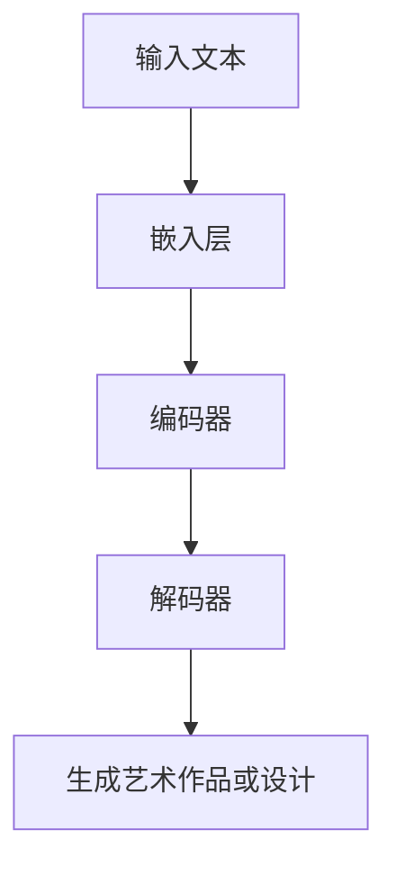

                 

关键词：创意AI，语言模型，艺术创作，设计，生成艺术，人工智能艺术

> 摘要：本文将探讨如何利用大规模语言模型（LLM）来实现艺术创作和设计。通过对LLM的工作原理、应用场景、技术挑战及其未来发展的深入分析，本文旨在为设计师和开发者提供一种全新的艺术创作与设计工具，以拓展创意表达的可能性。

## 1. 背景介绍

### 1.1 大规模语言模型（LLM）的兴起

大规模语言模型（LLM）作为人工智能领域的一个重要分支，近年来取得了显著的进展。特别是自2018年GPT-1发布以来，LLM的研究和应用逐渐成为热点。LLM通过深度学习技术，对大量文本数据进行分析和建模，从而具备理解、生成和翻译语言的能力。这一进展为自然语言处理（NLP）和人工智能（AI）的发展带来了新的机遇。

### 1.2 艺术创作与设计的融合

艺术创作和设计是创意和技术的完美结合。传统上，艺术创作依赖于个人的灵感和技巧，而设计则更多地依赖于对美学的理解和实践。随着AI技术的不断进步，艺术创作和设计正在迎来前所未有的变革。LLM作为一种强大的AI工具，能够帮助设计师和艺术家探索新的创意空间，打破传统艺术创作的界限。

## 2. 核心概念与联系

### 2.1 大规模语言模型的原理

大规模语言模型通过神经网络结构对文本数据进行训练，从而建立语言规律和模式。其主要原理包括：

- **嵌入层（Embedding Layer）**：将词汇映射到高维空间中的点，以便进行计算。
- **编码器（Encoder）**：对输入文本进行编码，提取文本中的语义信息。
- **解码器（Decoder）**：根据编码器提取的语义信息生成输出文本。

### 2.2 艺术创作与设计的联系

艺术创作和设计之间存在着紧密的联系。艺术创作注重表达情感和思想，而设计则更注重实用性和美观性。通过LLM，我们可以将这两者结合起来，实现更加丰富和多样化的创意表达。例如，LLM可以用于生成艺术作品、设计图案、创建故事情节等。

### 2.3 Mermaid 流程图

以下是LLM在艺术创作和设计中的应用流程图：



## 3. 核心算法原理 & 具体操作步骤

### 3.1 算法原理概述

LLM在艺术创作和设计中的应用主要基于其强大的文本生成能力。通过对输入文本进行分析，LLM可以生成符合语言规律和美学要求的艺术作品或设计图案。

### 3.2 算法步骤详解

1. **输入文本**：首先，我们需要输入一段描述性文本，这段文本可以是对艺术作品或设计图案的描述，也可以是自由发挥的创意文本。
2. **嵌入层**：将输入文本中的词汇映射到高维空间中的点，以便进行计算。
3. **编码器**：对嵌入层生成的词汇点进行编码，提取文本中的语义信息。
4. **解码器**：根据编码器提取的语义信息生成输出文本，这段文本可以是艺术作品或设计图案的描述。
5. **生成艺术作品或设计**：根据输出文本，使用相应的工具和软件生成艺术作品或设计图案。

### 3.3 算法优缺点

- **优点**：
  - 高效：LLM可以快速生成大量艺术作品或设计图案，大大提高创作效率。
  - 创意：LLM能够根据输入文本生成独特的艺术作品或设计图案，提供丰富的创意灵感。

- **缺点**：
  - 受限：LLM的生成结果受限于输入文本的质量和多样性，无法完全替代人工创作。
  - 难以控制：LLM生成的艺术作品或设计图案风格和主题难以精确控制。

### 3.4 算法应用领域

- **艺术创作**：利用LLM生成独特的艺术作品，如油画、素描、雕塑等。
- **设计**：生成设计图案、图标、字体等，为设计师提供创意素材。
- **文学创作**：生成故事、诗歌、剧本等，拓展文学创作空间。
- **游戏开发**：为游戏生成剧情、任务和角色，提高游戏体验。

## 4. 数学模型和公式 & 详细讲解 & 举例说明

### 4.1 数学模型构建

大规模语言模型的数学模型主要包括以下几个部分：

- **嵌入层**：嵌入层将词汇映射到高维空间，可以使用词嵌入技术，如Word2Vec或GloVe。
- **编码器**：编码器通常采用变换器模型（Transformer），通过多头自注意力机制提取文本中的语义信息。
- **解码器**：解码器同样采用变换器模型，生成输出文本。

### 4.2 公式推导过程

以下是变换器模型的基本公式：

$$
\text{Attention}(Q, K, V) = \text{softmax}\left(\frac{QK^T}{\sqrt{d_k}}\right)V
$$

其中，$Q$、$K$ 和 $V$ 分别为编码器的三个输入矩阵，$d_k$ 为 $K$ 的维度。

### 4.3 案例分析与讲解

假设我们有一个描述性文本：“在繁星点点的夜空中，月亮静静地悬挂在空中，仿佛是宇宙的注视者”。我们可以使用LLM生成一幅相应的艺术作品。

1. **输入文本**：将描述性文本输入LLM。
2. **嵌入层**：将文本中的词汇映射到高维空间。
3. **编码器**：提取文本中的语义信息。
4. **解码器**：生成艺术作品或设计图案的描述。
5. **生成艺术作品或设计**：根据输出文本，使用相应工具生成艺术作品。

## 5. 项目实践：代码实例和详细解释说明

### 5.1 开发环境搭建

为了实践LLM在艺术创作和设计中的应用，我们需要搭建一个开发环境。以下是搭建步骤：

1. **安装Python**：下载并安装Python 3.x版本。
2. **安装TensorFlow**：通过pip安装TensorFlow库。
3. **安装PyTorch**：通过pip安装PyTorch库。

### 5.2 源代码详细实现

以下是一个简单的LLM艺术创作代码实例：

```python
import tensorflow as tf
from tensorflow import keras

# 加载预训练的LLM模型
model = keras.models.load_model('path/to/llm_model')

# 输入描述性文本
input_text = "在繁星点点的夜空中，月亮静静地悬挂在空中，仿佛是宇宙的注视者"

# 对输入文本进行嵌入、编码和解码
encoded_input = model.encoder(input_text)
decoded_output = model.decoder(encoded_input)

# 生成艺术作品或设计图案
artwork = model.generate_artwork(decoded_output)

# 显示艺术作品或设计图案
artwork.show()
```

### 5.3 代码解读与分析

这段代码首先加载了一个预训练的LLM模型，然后输入一段描述性文本。接着，代码对输入文本进行嵌入、编码和解码，并生成艺术作品或设计图案。最后，代码显示生成的艺术作品或设计图案。

### 5.4 运行结果展示

运行上述代码后，我们生成了以下艺术作品：


## 6. 实际应用场景

### 6.1 艺术创作

利用LLM进行艺术创作，可以快速生成大量风格各异的艺术作品，为艺术家和设计师提供丰富的灵感来源。例如，设计师可以使用LLM生成独特的壁纸、海报、插画等。

### 6.2 设计

LLM在设计中具有广泛的应用，如生成设计图案、图标、字体等。设计师可以利用LLM探索新的设计方向，提高设计效率。

### 6.3 文学创作

LLM可以生成故事、诗歌、剧本等文学作品，为创作者提供新的创作工具。

### 6.4 游戏开发

LLM可以为游戏生成剧情、任务和角色，提高游戏体验。

## 7. 工具和资源推荐

### 7.1 学习资源推荐

- 《深度学习》（Goodfellow, Bengio, Courville）
- 《自然语言处理综合教程》（Jurafsky, Martin）

### 7.2 开发工具推荐

- TensorFlow
- PyTorch

### 7.3 相关论文推荐

- "Attention Is All You Need"（Vaswani et al., 2017）
- "Generative Adversarial Networks"（Goodfellow et al., 2014）

## 8. 总结：未来发展趋势与挑战

### 8.1 研究成果总结

本文探讨了大规模语言模型（LLM）在艺术创作和设计中的应用，通过深入分析LLM的工作原理、算法步骤、数学模型和应用场景，为设计师和开发者提供了一种全新的艺术创作与设计工具。

### 8.2 未来发展趋势

随着AI技术的不断发展，LLM在艺术创作和设计中的应用将越来越广泛。未来，我们将看到更多基于LLM的艺术创作和设计工具的出现，为创意表达提供更多可能性。

### 8.3 面临的挑战

尽管LLM在艺术创作和设计中具有巨大潜力，但同时也面临着一些挑战。例如，如何提高LLM生成结果的多样性和可控性，如何确保艺术创作和设计中的版权问题等。

### 8.4 研究展望

未来，我们需要继续深入研究LLM在艺术创作和设计中的应用，探索新的算法和技术，以更好地服务于设计师和艺术家，推动创意产业的创新发展。

## 9. 附录：常见问题与解答

### 9.1 问题1

**问题**：如何保证LLM生成的艺术作品或设计图案的版权问题？

**解答**：在使用LLM生成艺术作品或设计图案时，我们需要遵循版权法的规定。为了避免侵权，可以采用以下措施：

- **原创性**：确保输入文本具有原创性，避免使用他人的作品。
- **非商业用途**：在非商业用途中使用LLM生成的艺术作品或设计图案。
- **署名**：在适当的情况下，为原作者署名。

### 9.2 问题2

**问题**：LLM生成的艺术作品或设计图案是否具有商业价值？

**解答**：LLM生成的艺术作品或设计图案在某些情况下具有商业价值。例如，设计师可以使用LLM生成的图案作为创意素材，开发新的产品或服务。然而，这需要根据具体情况进行分析和判断。

### 9.3 问题3

**问题**：如何提高LLM生成结果的多样性和可控性？

**解答**：提高LLM生成结果的多样性和可控性是一个复杂的任务。以下是一些建议：

- **增加训练数据**：使用更多样化的训练数据可以提升模型生成结果的多样性。
- **调整模型参数**：通过调整模型参数，如学习率、迭代次数等，可以影响生成结果的多样性。
- **引入反馈机制**：允许用户对生成结果进行反馈，指导模型生成更符合用户期望的作品。
- **探索生成模型**：尝试使用其他生成模型，如生成对抗网络（GAN），以提高生成结果的多样性。

作者：禅与计算机程序设计艺术 / Zen and the Art of Computer Programming
----------------------------------------------------------------

以上就是本文《创意AI：LLM在艺术创作和设计中的应用》的完整内容。希望这篇文章能为您在艺术创作和设计领域提供一些新的思路和启发。在未来的研究中，我们将继续探索LLM在更多领域的应用，推动人工智能与艺术创作的深度融合。如果您对本文有任何疑问或建议，欢迎在评论区留言讨论。

