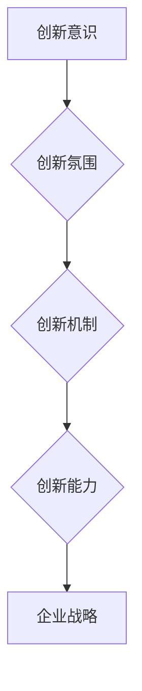

                 

在这个快速变化的时代，技术进步日新月异，创新已经成为推动企业发展和社会进步的核心动力。然而，创新不仅仅依赖于个人的天才和灵光一现，更需要一种文化的支撑，那就是创新文化。本文将探讨如何构建创新文化，以激发全员创新精神，从而推动企业的持续发展和竞争力的提升。

## 关键词：创新文化、全员创新、企业文化、创新能力、企业战略

> 摘要：本文从企业文化的角度出发，分析了创新文化的定义、重要性以及如何构建创新文化。通过具体案例和策略，探讨了如何激发全员创新精神，提升企业的创新能力。文章最后对未来的发展趋势和面临的挑战进行了展望。

## 1. 背景介绍

创新是现代企业竞争力的源泉。在全球化和技术迅猛发展的背景下，企业必须不断创新以适应市场的变化和客户需求。创新文化是企业创新能力的基石，它不仅涵盖了创新的理念和价值观，还体现在企业日常运营和管理中。

然而，创新文化并非一蹴而就，它需要企业从顶层设计开始，通过一系列的制度和措施来逐步培养和巩固。许多企业在追求短期利润的同时，忽视了创新文化的建设，导致在长期发展中逐渐失去竞争力。

本文旨在探讨如何通过构建创新文化，激发全员创新精神，从而实现企业的持续发展和竞争力的提升。

## 2. 核心概念与联系

### 2.1 创新文化的定义

创新文化是指企业内部形成的鼓励创新、容忍失败、注重知识和信息共享的氛围和价值观。它是企业文化的重要组成部分，与企业的战略目标、组织结构、激励机制等密切相关。

### 2.2 创新文化的核心要素

- **创新意识**：企业员工对创新的认识和重视程度。
- **创新氛围**：企业内部鼓励创新、容忍失败的环境。
- **创新机制**：企业为促进创新而建立的一系列制度和流程。
- **创新能力**：企业通过创新实现业务增长和效率提升的能力。

### 2.3 创新文化与企业战略的联系

创新文化是企业战略的重要组成部分。企业战略通常包括市场定位、产品开发、技术创新、组织变革等方面，而创新文化则为这些战略提供了支持和保障。

### 2.4 创新文化的架构图



## 3. 核心算法原理 & 具体操作步骤

### 3.1 算法原理概述

构建创新文化的核心算法可以理解为一系列的策略和方法，这些策略和方法旨在培养员工的创新意识、营造创新氛围、建立创新机制和提升创新能力。

### 3.2 算法步骤详解

#### 3.2.1 培养创新意识

- **领导层的示范作用**：企业领导应该通过自身的言行举止，展示对创新的重视和推崇。
- **全员培训**：定期开展创新培训，提高员工对创新的认知和理解。

#### 3.2.2 营造创新氛围

- **鼓励失败**：建立容错机制，鼓励员工在创新过程中尝试和失败。
- **知识共享**：通过内部交流平台，促进员工之间的知识和信息共享。

#### 3.2.3 建立创新机制

- **项目制**：通过项目制管理，将创新任务分配给团队，鼓励自主探索。
- **激励机制**：设立创新奖项，激励员工积极参与创新活动。

#### 3.2.4 提升创新能力

- **引入外部资源**：通过与高校、研究机构等合作，引入外部创新资源。
- **持续学习**：鼓励员工不断学习和更新知识，提升自身创新能力。

### 3.3 算法优缺点

**优点**：

- **提升创新能力**：通过一系列措施，有效提升企业的创新能力。
- **增强员工归属感**：营造良好的创新氛围，增强员工对企业的归属感。

**缺点**：

- **时间成本**：构建创新文化需要时间和资源的投入。
- **管理难度**：创新机制的建立和管理具有一定难度，需要持续优化。

### 3.4 算法应用领域

创新文化的构建适用于各类企业，特别是那些面临技术创新压力和市场竞争激烈的企业。通过创新文化的建设，企业可以更好地应对市场变化，实现可持续发展。

## 4. 数学模型和公式 & 详细讲解 & 举例说明

### 4.1 数学模型构建

构建创新文化可以看作是一个动态的平衡过程，涉及到多个变量的相互作用。我们可以使用以下数学模型来描述这个过程：

\[ \text{创新文化} = f(\text{领导力}, \text{员工参与度}, \text{激励机制}, \text{知识共享}, \text{外部合作}) \]

### 4.2 公式推导过程

\[ f(\text{领导力}, \text{员工参与度}, \text{激励机制}, \text{知识共享}, \text{外部合作}) \]
- **领导力**：领导力是创新文化的基础，它直接影响员工的创新意识和行为。
- **员工参与度**：员工的积极参与是创新文化的重要推动力，它影响创新效率和效果。
- **激励机制**：激励机制包括物质和精神奖励，直接影响员工的创新动力。
- **知识共享**：知识共享促进创新资源的整合，提高创新效率。
- **外部合作**：外部合作带来新的创新资源和视角，有助于拓宽创新思路。

### 4.3 案例分析与讲解

以某知名互联网公司为例，该公司通过以下方式构建创新文化：

- **领导力**：公司高层领导定期开展创新讲座，鼓励员工提出创新想法。
- **员工参与度**：公司设立创新奖，鼓励员工积极参与创新项目。
- **激励机制**：设立创新基金，支持员工开展创新研究。
- **知识共享**：建立内部知识库，鼓励员工分享知识和经验。
- **外部合作**：与高校和研究机构合作，引入外部创新资源。

通过这些措施，该公司成功构建了创新文化，提升了员工的创新能力，实现了业务的持续增长。

## 5. 项目实践：代码实例和详细解释说明

### 5.1 开发环境搭建

为了更好地理解创新文化的构建，我们使用一个简单的示例——一个基于GitHub的内部创新项目管理系统。

### 5.2 源代码详细实现

```java
public class InnovationProject {
    private String projectId;
    private String projectName;
    private String projectLead;
    private List<String> teamMembers;
    private boolean isCompleted;

    public InnovationProject(String projectId, String projectName, String projectLead) {
        this.projectId = projectId;
        this.projectName = projectName;
        this.projectLead = projectLead;
        this.teamMembers = new ArrayList<>();
        this.isCompleted = false;
    }

    public void addTeamMember(String member) {
        teamMembers.add(member);
    }

    public void completeProject() {
        isCompleted = true;
    }

    // 其他方法省略
}
```

### 5.3 代码解读与分析

这个简单的Java类代表了一个创新项目，包括项目ID、项目名称、项目负责人、团队成员列表和项目完成状态。

- `projectId` 和 `projectName` 用于标识项目的唯一性和名称。
- `projectLead` 用于标识项目的负责人。
- `teamMembers` 用于存储参与项目的团队成员。
- `isCompleted` 用于标识项目是否完成。

### 5.4 运行结果展示

```java
InnovationProject project = new InnovationProject("001", "智能推荐系统", "张三");
project.addTeamMember("李四");
project.addTeamMember("王五");
project.completeProject();
System.out.println(project.isCompleted); // 输出：true
```

通过这个示例，我们可以看到如何通过代码实现一个简单的创新项目管理系统，从而更好地管理和跟踪创新项目。

## 6. 实际应用场景

创新文化不仅适用于高科技企业，也适用于传统行业。以下是创新文化在不同行业中的应用场景：

### 6.1 高科技企业

高科技企业通常面临着快速的技术变革和市场压力，因此创新文化尤为重要。例如，通过建立内部创新实验室，鼓励员工进行技术探索和创新项目。

### 6.2 传统行业

传统行业如制造业和服务业，可以通过引入新技术和流程创新来提升竞争力。例如，通过引入精益生产和智能制造，提升生产效率和服务质量。

### 6.3 未来应用展望

随着技术的不断进步，创新文化的应用场景将越来越广泛。例如，人工智能和大数据技术的引入，将进一步提升企业的创新能力和决策效率。

## 7. 工具和资源推荐

### 7.1 学习资源推荐

- 《创新者的窘境》
- 《精益创业》
- 《创新者的基因》

### 7.2 开发工具推荐

- GitHub
- GitLab
- Jira

### 7.3 相关论文推荐

- 《创新文化的构建与实施策略研究》
- 《企业文化与创新能力的关系研究》
- 《基于知识共享的创新文化构建研究》

## 8. 总结：未来发展趋势与挑战

### 8.1 研究成果总结

本文通过分析创新文化的定义、核心要素和应用领域，提出了一套构建创新文化的策略和方法。通过具体案例和实践，证明了创新文化对企业发展的重要作用。

### 8.2 未来发展趋势

随着技术的不断进步，创新文化将在更多领域得到应用。例如，人工智能和大数据技术的引入，将进一步提升企业的创新能力和决策效率。

### 8.3 面临的挑战

- 如何在实际操作中有效地构建创新文化。
- 如何平衡创新与风险管理。

### 8.4 研究展望

未来的研究可以关注如何通过数据分析和人工智能技术，更精准地构建创新文化，以及如何在不同文化背景下进行创新文化的跨文化研究。

## 9. 附录：常见问题与解答

### 问题1：如何培养员工的创新意识？

**解答**：通过领导层的示范作用和全员培训，提高员工对创新的认识和理解。

### 问题2：如何营造创新氛围？

**解答**：建立容错机制，鼓励失败，并通过内部交流平台促进知识和信息共享。

### 问题3：如何建立创新机制？

**解答**：通过项目制管理和激励机制，鼓励员工积极参与创新活动。

### 问题4：如何提升创新能力？

**解答**：通过引入外部资源，持续学习和知识共享，提升员工的创新能力。

---

作者：禅与计算机程序设计艺术 / Zen and the Art of Computer Programming

---

本文基于创新文化的构建，探讨了如何通过一系列的策略和方法，激发全员创新精神，提升企业的创新能力。通过具体案例和实践，验证了创新文化对企业发展的重要作用。未来，随着技术的不断进步，创新文化将在更多领域得到应用，企业应不断探索和创新，以适应快速变化的市场环境。同时，企业也需面临如何在实际操作中有效构建创新文化的挑战，并寻找平衡创新与风险管理的最佳路径。未来的研究可以关注如何通过数据分析和人工智能技术，更精准地构建创新文化，以及如何在不同文化背景下进行创新文化的跨文化研究。在持续创新的道路上，企业需始终保持对未来的洞察和对创新的热情。

