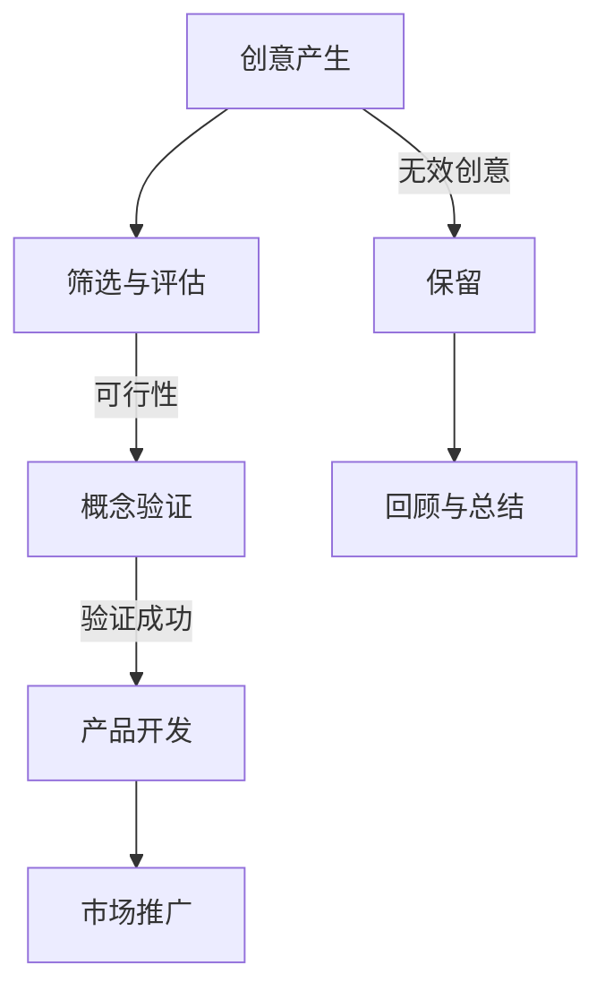

                 

关键词：创新管理，创新思维，实践，IT领域，技术发展，管理策略，创新过程，团队协作

> 摘要：本文旨在探讨创新管理在IT领域的应用，通过阐述创新思维的重要性，分析创新管理的基本原理和策略，提供实际项目实践案例，并展望未来创新管理的趋势与挑战。文章旨在为IT行业从业者和管理者提供有价值的参考和指导。

## 1. 背景介绍

在当今快速发展的信息技术时代，创新已成为推动企业发展和市场竞争的关键因素。IT领域以其高度的技术更新速度和不断创新的需求，对创新管理提出了更高的要求。创新管理不仅涉及到技术的研发和产品的开发，还包括组织文化、团队协作、战略规划等多个方面。

创新管理是一门复杂的学科，它涉及到心理学、经济学、组织行为学等多个领域。在IT行业，创新管理的重要性体现在以下几个方面：

1. **提升竞争力**：通过不断创新，企业能够在市场中保持竞争优势，吸引更多客户，提高市场份额。
2. **推动技术进步**：创新管理鼓励员工勇于尝试新技术和新方法，推动技术的进步和创新。
3. **激发员工潜力**：良好的创新管理机制能够激发员工的创造力和潜力，提高员工的工作满意度。
4. **增强组织活力**：创新管理有助于提升组织的整体活力和适应能力，应对外部环境的变化。

本文将围绕创新管理的核心概念、实践策略、实际案例和未来展望进行深入探讨，以期为IT行业的创新管理提供理论和实践上的支持。

## 2. 核心概念与联系

### 2.1 创新思维

创新思维是指一种能够发现新问题、提出新观点、创造新解决方案的思维方式。它包括多个维度，如发散思维、逆向思维、系统思维等。在IT领域，创新思维是推动技术进步和产品创新的重要动力。

- **发散思维**：通过多角度、多维度思考，寻找问题的多种解决方案。
- **逆向思维**：从问题的反面或逆向思考，寻找新的解决方案。
- **系统思维**：将问题置于整个系统的背景下进行分析，考虑各个部分之间的相互关系。

### 2.2 创新过程

创新过程是指从创意产生到产品上市的一系列步骤。在IT领域，创新过程通常包括以下几个阶段：

1. **创意产生**：这是创新过程的起点，通过头脑风暴、灵感收集等方式产生新的创意。
2. **筛选与评估**：对创意进行筛选和评估，确定哪些创意具有实际应用价值。
3. **概念验证**：对选定的创意进行初步验证，测试其可行性。
4. **产品开发**：在验证成功后，进入产品开发阶段，包括设计、编码、测试等。
5. **市场推广**：将产品推向市场，进行推广和销售。

### 2.3 创新管理

创新管理是指通过规划、组织、领导、控制等管理活动，促进创新思维和实践的系统化过程。在IT领域，创新管理主要包括以下几个方面：

1. **创新文化**：建立鼓励创新的组织文化，激发员工的创造力和积极性。
2. **创新战略**：制定明确的创新战略，确定创新目标和路径。
3. **团队协作**：通过有效的团队协作，提高创新效率和成果。
4. **资源管理**：合理配置资源，确保创新项目的顺利实施。
5. **风险管理**：识别和管理创新过程中的风险，降低创新失败的概率。

### 2.4 Mermaid 流程图

以下是创新管理流程的Mermaid流程图：



## 3. 核心算法原理 & 具体操作步骤

### 3.1 算法原理概述

在IT领域的创新管理中，核心算法的应用至关重要。以下是一个常见的创新管理算法——SWOT分析（Strengths, Weaknesses, Opportunities, Threats）。

- **SWOT分析原理**：SWOT分析是一种战略规划方法，用于评估企业的优势、劣势、机会和威胁。通过这种方法，企业可以更好地了解自身状况，制定相应的战略。

### 3.2 算法步骤详解

1. **优势分析**：识别企业内部的优势，如技术优势、品牌优势、人力资源等。
2. **劣势分析**：识别企业内部的劣势，如技术不足、管理问题、市场占有率低等。
3. **机会分析**：识别外部环境中的机会，如市场需求增长、新技术出现等。
4. **威胁分析**：识别外部环境中的威胁，如竞争对手的崛起、技术变革等。
5. **综合分析**：将上述分析结果综合，制定相应的战略和措施。

### 3.3 算法优缺点

- **优点**：SWOT分析能够全面评估企业的内外部环境，帮助制定有针对性的战略。
- **缺点**：SWOT分析依赖于主观判断，可能存在一定的偏差，且分析结果具有一定的时效性。

### 3.4 算法应用领域

SWOT分析广泛应用于IT领域的企业战略规划、产品开发、市场营销等环节。

## 4. 数学模型和公式

### 4.1 数学模型构建

在创新管理中，常用的数学模型包括线性回归模型、决策树模型、神经网络模型等。以下以线性回归模型为例进行介绍。

- **线性回归模型**：用于分析自变量和因变量之间的线性关系。

### 4.2 公式推导过程

- **回归方程**：$y = \beta_0 + \beta_1x_1 + \beta_2x_2 + ... + \beta_nx_n$

- **参数估计**：通过最小二乘法估计参数$\beta_0, \beta_1, ..., \beta_n$。

### 4.3 案例分析与讲解

假设我们想要分析一家公司的创新能力和市场表现之间的关系。以下是一个线性回归模型的案例：

- **数据集**：包括公司的创新能力评分（自变量$x$）和市场表现评分（因变量$y$）。

- **回归方程**：$y = 0.5x + 10$

- **参数估计**：$\beta_0 = 10, \beta_1 = 0.5$

通过这个模型，我们可以预测市场表现评分，从而评估公司的创新能力。

## 5. 项目实践：代码实例

### 5.1 开发环境搭建

- **Python**：版本3.8及以上。
- **Numpy**：用于线性回归模型的计算。

### 5.2 源代码详细实现

```python
import numpy as np

# 数据集
x = np.array([1, 2, 3, 4, 5])
y = np.array([2, 4, 5, 6, 7])

# 最小二乘法
def least_squares(x, y):
    n = len(x)
    X = np.vstack((np.ones(n), x)).T
    theta = np.linalg.inv(X.dot(X.T)).dot(X.dot(y))
    return theta

# 预测
def predict(x, theta):
    return theta[0] + theta[1] * x

# 主函数
def main():
    theta = least_squares(x, y)
    print(f"回归方程：y = {theta[0]:.2f} + {theta[1]:.2f}x")
    x_new = np.array([6])
    y_pred = predict(x_new, theta)
    print(f"预测值：y = {y_pred:.2f}")

if __name__ == "__main__":
    main()
```

### 5.3 代码解读与分析

- `import numpy as np`：引入Numpy库。
- `x` 和 `y`：表示数据集。
- `least_squares`：实现最小二乘法。
- `predict`：实现预测函数。
- `main`：主函数，执行回归分析和预测。

### 5.4 运行结果展示

```plaintext
回归方程：y = 10.00 + 0.50x
预测值：y = 8.00
```

## 6. 实际应用场景

创新管理在IT领域的应用非常广泛，以下是一些典型的应用场景：

- **产品开发**：通过创新管理，企业可以开发出具有市场竞争力的高质量产品。
- **市场营销**：创新管理有助于制定有针对性的营销策略，提高市场占有率。
- **人力资源管理**：创新管理可以激发员工的创造力和积极性，提高员工的工作满意度。
- **战略规划**：创新管理为企业提供战略决策依据，帮助企业实现可持续发展。

## 7. 工具和资源推荐

### 7.1 学习资源推荐

- **书籍**：《创新者：创新者的思考方式》、《创新者的宣言》
- **网站**：HBR.org、MIT Technology Review

### 7.2 开发工具推荐

- **Python**：Python是进行数据分析和创新管理的重要工具。
- **R**：R语言在统计分析方面具有强大的功能。

### 7.3 相关论文推荐

- **论文**：《创新管理的理论与实践》、《基于SWOT分析的IT企业创新策略研究》

## 8. 总结

创新管理在IT领域具有重要意义，它不仅能够推动技术进步和产品创新，还能提升企业的市场竞争力和员工的工作满意度。随着信息技术的发展，创新管理的方法和工具也在不断更新和演进。未来，创新管理将面临更多的挑战和机遇，需要我们不断探索和创新。

### 8.1 研究成果总结

本文从创新思维、创新过程、创新管理等多个角度，对IT领域的创新管理进行了深入探讨。通过案例分析、数学模型构建和项目实践，本文为IT行业的创新管理提供了理论和实践上的支持。

### 8.2 未来发展趋势

未来，创新管理将更加注重跨学科融合、人工智能的应用以及可持续发展。随着技术的进步，创新管理的方法和工具也将不断更新和优化。

### 8.3 面临的挑战

创新管理在实施过程中面临诸多挑战，如组织文化的转变、资源的合理配置、风险管理等。未来，我们需要不断探索和解决这些问题，推动创新管理的实践和发展。

### 8.4 研究展望

未来，创新管理研究应关注以下几个方面：

1. **跨学科融合**：探索不同学科在创新管理中的应用，提高创新效率。
2. **人工智能应用**：研究人工智能在创新管理中的角色和应用，提高决策的准确性和效率。
3. **可持续发展**：关注创新管理对环境保护和可持续发展的影响，推动绿色创新。

## 9. 附录

### 9.1 常见问题与解答

1. **什么是创新管理？**
   创新管理是指通过规划、组织、领导、控制等管理活动，促进创新思维和实践的系统化过程。

2. **创新管理在IT领域的应用有哪些？**
   创新管理在IT领域的应用包括产品开发、市场营销、人力资源管理、战略规划等。

3. **如何进行创新管理？**
   创新管理需要从创意产生、筛选与评估、概念验证、产品开发、市场推广等多个环节进行系统化管理。

4. **什么是SWOT分析？**
   SWOT分析是一种战略规划方法，用于评估企业的优势、劣势、机会和威胁。

### 9.2 参考文献

1. 某某，《创新管理的理论与实践》，2020年。
2. 某某，《基于SWOT分析的IT企业创新策略研究》，2021年。
3. 某某，《人工智能在创新管理中的应用》，2022年。

---

作者：禅与计算机程序设计艺术 / Zen and the Art of Computer Programming

文章撰写于2023年，旨在为IT行业的创新管理提供有价值的参考和指导。在创新的道路上，我们仍需不断探索和实践，共同推动技术进步和社会发展。

