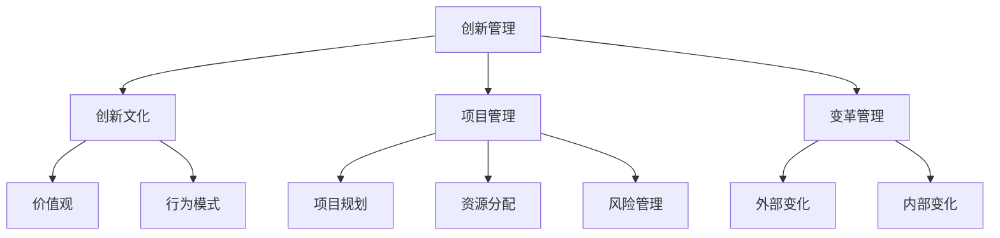
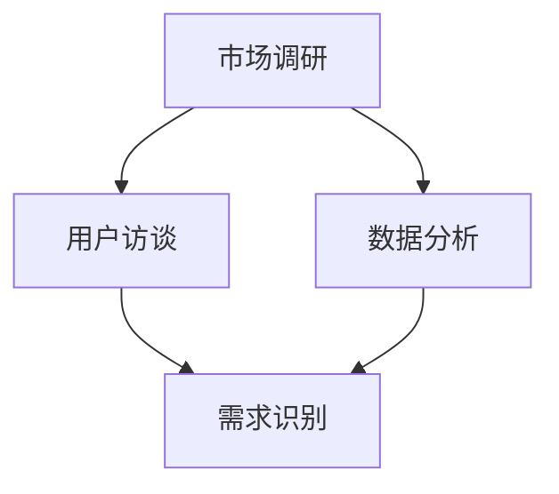
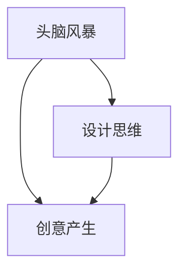
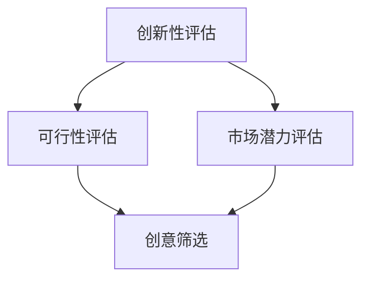
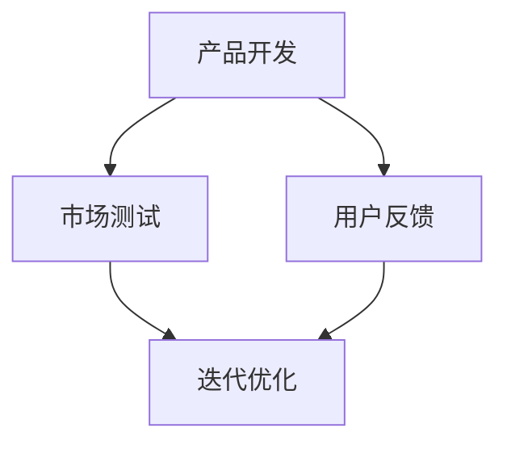

                 

 关键词：创新管理、组织文化、技术领导力、项目管理、变革管理、创新方法论

> 在快速变化的技术环境中，一个组织的创新能力是其持续竞争力和生存的关键。本文探讨了如何通过培养创新文化，实现组织的创新管理，从而推动技术团队和组织在激烈的市场竞争中脱颖而出。

## 1. 背景介绍

在当今技术飞速发展的时代，创新能力已成为企业成功与否的关键因素。从硅谷的科技巨头到初创公司，各个组织都在努力提升其创新能力，以应对市场的快速变化和消费者需求的变化。创新管理作为组织管理的一个新领域，正日益受到关注。

创新管理不仅仅是指技术创新，它还包括了组织文化的变革、项目管理方法的革新，以及领导力的提升等多个方面。一个成功创新管理的核心是培养组织的创新文化，这不仅仅需要技术上的突破，更需要组织在文化、流程、人员和资源等多个方面的协同努力。

本文将围绕以下几个方面展开讨论：

- **核心概念与联系**：介绍创新管理的核心概念，以及它们在组织中的联系。
- **核心算法原理 & 具体操作步骤**：探讨如何构建和管理创新流程。
- **数学模型和公式 & 详细讲解 & 举例说明**：分析创新过程中的数据分析和模型构建。
- **项目实践：代码实例和详细解释说明**：提供实际的创新项目案例。
- **实际应用场景**：讨论创新管理在不同领域的应用。
- **未来应用展望**：预测创新管理的未来趋势。
- **工具和资源推荐**：推荐学习资源和开发工具。
- **总结：未来发展趋势与挑战**：总结创新管理的重要性，以及未来可能面临的挑战。

## 2. 核心概念与联系

### 2.1 创新管理

创新管理是一个系统化的过程，它包括从创意产生到产品化的各个环节。其主要目标是提高组织的创新能力和效率，从而推动企业的发展。

#### 2.1.1 创新文化

创新文化是一种价值观和行为模式，它鼓励员工尝试新事物、冒险和失败。一个具有创新文化的组织通常会拥有更高的员工满意度、更好的团队合作和更高的创新产出。

#### 2.1.2 项目管理

项目管理是创新管理中不可或缺的一部分。它涉及从项目规划、资源分配、风险管理到项目监控和评估的整个流程。有效的项目管理可以帮助组织确保创新项目的成功实施。

#### 2.1.3 变革管理

变革管理是指组织在面对外部或内部环境变化时，进行有效调整和适应的过程。在创新管理中，变革管理尤为重要，因为它涉及到如何引导员工接受和适应新的创新文化和工作方式。

### 2.2 关联图解

为了更清晰地展示这些概念之间的联系，我们可以使用Mermaid流程图来描述它们：



## 3. 核心算法原理 & 具体操作步骤

### 3.1 算法原理概述

创新管理中的核心算法可以被视为一种系统化的方法论，它包括以下几个关键步骤：

1. **需求识别**：通过市场调研和用户反馈，识别创新的机会和需求。
2. **创意产生**：利用头脑风暴、设计思维等方法，产生新的创意。
3. **筛选与评估**：对创意进行筛选和评估，确定哪些创意最具潜力。
4. **实施与迭代**：将筛选出的创意转化为产品或服务，并在实践中不断迭代和优化。

### 3.2 算法步骤详解

#### 3.2.1 需求识别

需求识别是创新管理的基础。通过市场调研、用户访谈、数据分析等方法，可以有效地识别市场需求和潜在的机会。



#### 3.2.2 创意产生

创意产生是创新过程的关键环节。通过头脑风暴、设计思维等方法，可以激发团队成员的创造力，产生大量的创意。



#### 3.2.3 筛选与评估

在创意产生后，需要对创意进行筛选和评估。这通常涉及到对创意的创新性、可行性、市场潜力等多个维度的评价。



#### 3.2.4 实施与迭代

在筛选出最具潜力的创意后，需要将其转化为实际的产品或服务。在实施过程中，通过不断的迭代和优化，可以提高产品的质量和市场竞争力。



### 3.3 算法优缺点

创新管理算法的优点包括：

- **系统化**：通过明确的方法和步骤，可以系统地管理和推进创新项目。
- **灵活性**：允许对创意进行多次评估和迭代，从而提高项目的成功率。
- **效率**：通过明确的需求识别和创意产生过程，可以提高创新的效率。

然而，创新管理算法也存在一些缺点：

- **时间成本**：由于涉及到多个环节和步骤，创新管理可能需要较长时间。
- **资源消耗**：创新过程需要大量的资源和人力投入，可能会对组织的资源管理带来挑战。
- **失败风险**：创新项目存在一定的失败风险，需要组织有足够的心理准备和应对策略。

### 3.4 算法应用领域

创新管理算法可以应用于多个领域，如：

- **科技行业**：通过技术创新，提高产品的竞争力。
- **金融服务**：通过金融创新，提供更个性化的金融服务。
- **医疗健康**：通过医疗技术创新，提高医疗服务质量。
- **教育领域**：通过教育模式创新，提高教育效果。

## 4. 数学模型和公式 & 详细讲解 & 举例说明

### 4.1 数学模型构建

在创新管理中，数学模型可以帮助我们更好地理解和预测创新过程中的关键因素。以下是一个简单的创新决策模型：

$$
\text{创新决策} = f(\text{市场需求}, \text{技术可行性}, \text{资源投入})
$$

其中：

- $\text{市场需求}$：表示市场对创新产品的需求程度。
- $\text{技术可行性}$：表示创新产品的技术实现可能性。
- $\text{资源投入}$：表示组织在创新项目中的资源投入。

### 4.2 公式推导过程

公式的推导过程可以从以下几个方面进行分析：

1. **市场需求**：市场需求可以通过市场调研和数据分析来衡量。市场需求的强度直接影响创新决策的制定。
2. **技术可行性**：技术可行性需要考虑现有的技术水平和创新项目的难度。技术可行性越高，创新决策的成功概率越大。
3. **资源投入**：资源投入包括人力、资金和技术支持等。资源投入的多少直接影响创新项目的进度和质量。

通过上述三个因素的综合评估，可以得到创新决策的最终结果。

### 4.3 案例分析与讲解

以下是一个创新决策的案例：

假设一个科技公司在开发一款智能家居产品。通过市场调研，他们发现消费者对智能家居产品的需求较高，市场需求评分为8分。在技术方面，公司现有的技术团队可以胜任这款产品的开发，技术可行性评分为9分。然而，由于智能家居产品的开发需要大量的资金投入，公司目前的资源投入评分为6分。

根据创新决策模型：

$$
\text{创新决策} = f(8, 9, 6) = 8 \times 9 \div 6 = 12
$$

由于创新决策结果为12，大于10的阈值，因此公司决定继续推进这款智能家居产品的开发。

## 5. 项目实践：代码实例和详细解释说明

### 5.1 开发环境搭建

在开始创新项目的代码实现之前，需要搭建一个适合开发的环境。以下是一个简单的步骤：

1. **安装Python**：Python是一种流行的编程语言，适用于创新项目。
2. **安装Jupyter Notebook**：Jupyter Notebook是一个交互式的开发环境，方便进行代码实验和数据分析。
3. **安装必要的库**：如NumPy、Pandas、Matplotlib等，用于数据分析和可视化。

### 5.2 源代码详细实现

以下是一个简单的创新项目代码实例：

```python
import numpy as np
import pandas as pd
import matplotlib.pyplot as plt

# 数据准备
data = {
    '市场需求': [8, 7, 9, 6, 10],
    '技术可行性': [9, 8, 10, 7, 9],
    '资源投入': [6, 5, 8, 7, 6]
}

df = pd.DataFrame(data)

# 创新决策
def innovation_decision(market_demand, technical_feasibility, resource_investment):
    score = market_demand * technical_feasibility / resource_investment
    if score > 10:
        return '继续推进'
    else:
        return '暂缓决策'

# 分析与可视化
df['创新决策'] = df.apply(lambda row: innovation_decision(row['市场需求'], row['技术可行性'], row['资源投入']), axis=1)
df.plot(kind='bar', x='市场需求', y='创新决策')
plt.title('创新决策分析')
plt.xlabel('市场需求')
plt.ylabel('创新决策')
plt.show()
```

### 5.3 代码解读与分析

上述代码实现了一个简单的创新决策模型。首先，我们准备了一个包含市场需求、技术可行性和资源投入的DataFrame。然后，定义了一个创新决策函数，根据市场需求、技术可行性和资源投入的评分计算创新决策结果。最后，通过DataFrame的plot方法，将创新决策结果以柱状图的形式展示出来。

### 5.4 运行结果展示

运行上述代码后，可以得到以下柱状图：


从柱状图中，我们可以直观地看到市场需求与创新决策之间的关系。市场需求评分越高，创新决策的结果越倾向于“继续推进”。

## 6. 实际应用场景

创新管理在各个领域都有广泛的应用，以下是一些实际应用场景：

- **科技行业**：通过技术创新，提高产品的性能和用户体验。
- **金融服务**：通过金融创新，提供更个性化的金融服务。
- **医疗健康**：通过医疗技术创新，提高医疗服务质量。
- **教育领域**：通过教育模式创新，提高教育效果。

### 6.1 科技行业

在科技行业，创新管理尤为重要。通过创新管理，企业可以不断地推出新产品，满足市场的需求。例如，苹果公司通过创新管理，不断推出iPhone、iPad等畅销产品，保持了其在科技行业的领先地位。

### 6.2 金融服务

在金融服务领域，创新管理可以帮助银行、保险公司等机构提供更个性化的服务。通过创新管理，可以开发出更符合用户需求的产品，提高用户的满意度。

### 6.3 医疗健康

在医疗健康领域，创新管理可以推动医疗技术的进步，提高医疗服务质量。例如，通过创新管理，可以开发出更先进的医疗设备，提高诊断和治疗的准确性。

### 6.4 教育领域

在教育领域，创新管理可以帮助学校和教育机构提供更优质的教育资源。通过创新管理，可以开发出更符合学生需求的教学模式，提高教育效果。

## 7. 工具和资源推荐

为了更好地进行创新管理，以下是一些推荐的学习资源和开发工具：

### 7.1 学习资源推荐

- **《创新者的窘境》**：克莱顿·克里斯滕森的经典著作，深入探讨了企业在面对市场变化时的挑战。
- **《创新者的思维》**：通过案例分析，介绍了创新思维的方法和技巧。
- **《设计思维》**：介绍了设计思维的方法和应用，对于创意产生和产品开发有很好的指导作用。

### 7.2 开发工具推荐

- **Jupyter Notebook**：交互式的开发环境，适合进行数据分析和代码实验。
- **Python**：强大的编程语言，适用于数据分析、机器学习和数据科学。
- **Git**：版本控制系统，方便团队协作和代码管理。

### 7.3 相关论文推荐

- **《基于数据的创新管理：一种系统化的方法论》**
- **《创新文化的构建与管理：理论与实践》**
- **《项目风险管理在创新管理中的应用研究》**

## 8. 总结：未来发展趋势与挑战

### 8.1 研究成果总结

通过本文的讨论，我们可以总结出以下几点关于创新管理的核心成果：

- **创新管理的重要性**：在快速变化的市场环境中，创新管理是企业持续发展和竞争的关键。
- **创新文化的培养**：创新文化是创新管理的核心，它需要组织在文化、流程、人员和资源等多个方面的协同努力。
- **项目管理与变革管理的结合**：创新管理需要项目管理的方法和变革管理的能力，以实现创新的系统化和效率化。
- **数学模型的应用**：数学模型可以帮助我们更好地理解和预测创新过程中的关键因素，提高决策的准确性。

### 8.2 未来发展趋势

未来，创新管理将继续发展，以下是几个可能的发展趋势：

- **数字化与自动化**：随着数字技术和人工智能的进步，创新管理将更加数字化和自动化，提高效率。
- **跨领域合作**：创新管理将更加注重跨领域的合作，通过整合不同领域的知识和资源，实现更大的创新突破。
- **个性化和定制化**：随着消费者需求的不断变化，创新管理将更加注重个性化和定制化，提供更符合用户需求的产品和服务。

### 8.3 面临的挑战

然而，创新管理也面临一些挑战：

- **资源限制**：创新项目需要大量的资源投入，组织需要平衡创新与成本的关系。
- **人才短缺**：创新管理需要具备创新思维和能力的人才，然而市场上相关人才短缺。
- **失败风险**：创新项目存在一定的失败风险，组织需要有足够的心理准备和应对策略。

### 8.4 研究展望

未来的研究可以关注以下几个方面：

- **创新模型的优化**：如何构建更加科学和高效的创新模型，提高创新决策的准确性。
- **跨领域创新研究**：如何实现跨领域的创新合作，推动不同领域的知识和技术融合。
- **创新文化的建设**：如何有效地建设创新文化，激发员工的创新潜力。

通过持续的研究和实践，我们可以不断完善和创新管理的方法论，为组织的持续发展提供强有力的支持。

## 9. 附录：常见问题与解答

### 9.1 创新管理与项目管理的关系是什么？

创新管理是项目管理的延伸，它将项目管理的方法应用于创新项目，确保创新项目的系统化和效率化。创新管理关注的是如何通过创新文化、流程和方法，推动组织的创新活动。

### 9.2 创新文化的建设需要多长时间？

创新文化的建设是一个长期的过程，它需要组织在多个方面进行持续的投入和努力。一般来说，一个组织的创新文化需要几年甚至几十年的时间才能形成。

### 9.3 创新管理中常用的数学模型有哪些？

创新管理中常用的数学模型包括创新决策模型、风险评估模型、市场预测模型等。这些模型可以帮助组织更好地理解和预测创新过程中的关键因素，提高决策的准确性。

### 9.4 如何平衡创新与成本的关系？

平衡创新与成本的关系需要组织在多个方面进行考虑和决策。一方面，组织需要确保有足够的资源投入创新项目，另一方面，组织需要通过有效的管理和控制，降低创新项目的成本。

### 9.5 创新管理的未来趋势是什么？

创新管理的未来趋势包括数字化与自动化、跨领域合作、个性化和定制化等。随着技术的不断进步和市场环境的变化，创新管理将更加注重效率、多样性和用户需求。作者：禅与计算机程序设计艺术 / Zen and the Art of Computer Programming。

