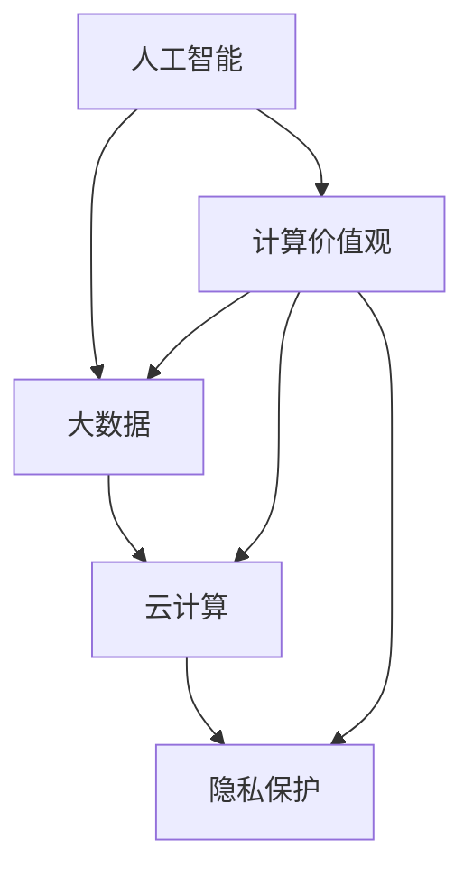

                 

关键词：人性化科技、计算价值观、未来趋势、AI应用、技术发展

## 摘要

本文旨在探讨如何在科技飞速发展的背景下，创造一个更加人性化的计算未来。通过深入分析计算价值观的核心概念和联系，本文将探讨如何运用这些价值观来推动技术创新，提高计算效率和用户体验。文章将详细阐述核心算法原理、数学模型及其应用，并通过实际项目实践，展示如何将理论转化为实践。此外，本文还将探讨未来科技应用场景，并推荐相关工具和资源，以帮助读者更好地理解和应用这些技术。最后，本文将对未来发展趋势与挑战进行展望，为读者提供有价值的思考和方向。

## 1. 背景介绍

近年来，随着人工智能（AI）、大数据、云计算等技术的迅猛发展，计算领域发生了翻天覆地的变化。然而，在这些技术进步的背后，一个重要的问题逐渐凸显出来：如何确保这些技术的应用能够更好地满足人类的需求，实现科技与人性的和谐共生？这就是计算价值观的核心议题。

计算价值观是一种关注计算技术对人类生活和社会发展影响的理念。它强调在技术发展的过程中，必须始终关注人类的需求和价值观，以确保技术进步能够真正造福人类。计算价值观包括以下几个方面：

1. **公平性**：技术应该为所有人提供平等的机会，不受性别、种族、地域等因素的限制。
2. **透明性**：技术的决策过程和结果应该对用户透明，用户应有权了解和掌控自己的数据。
3. **安全性**：保护用户隐私和数据安全是计算技术的首要任务。
4. **可持续性**：技术发展应考虑环境和社会影响，实现可持续发展。

本文将围绕这些计算价值观，探讨如何通过技术创新和实际应用，创造一个更加人性化的计算未来。

## 2. 核心概念与联系

为了深入理解计算价值观在技术发展中的作用，我们首先需要明确几个核心概念：

1. **人工智能**：人工智能（AI）是计算机科学的一个分支，旨在使计算机具备类似人类的感知、学习和决策能力。AI技术的发展，特别是深度学习和机器学习，为计算价值观的实现提供了强大的技术支持。
2. **大数据**：大数据是指无法使用传统数据处理工具在合理时间内进行捕获、管理和处理的数据集。大数据技术的应用，使得我们可以从海量数据中提取有价值的信息，更好地满足人类需求。
3. **云计算**：云计算是一种通过互联网提供动态易扩展且经常是虚拟化的资源的技术。云计算的普及，为计算资源的高效利用和分布式计算提供了可能，有助于实现计算价值观中的公平性和透明性。
4. **隐私保护**：隐私保护是计算价值观中的重要一环。随着数据技术的发展，如何保护用户隐私成为了一个备受关注的问题。

这些核心概念之间存在着紧密的联系。例如，人工智能和大数据的结合，可以实现对用户行为的精准分析，从而更好地满足他们的需求。而云计算则为这一过程提供了高效的数据处理和存储能力。另一方面，隐私保护技术的发展，有助于确保在数据收集和使用过程中，用户的权益得到保障。

为了更直观地展示这些概念之间的联系，我们可以使用Mermaid流程图进行描述。以下是一个简化的Mermaid流程图，展示了核心概念之间的联系：



在上述流程图中，A、B、C、D分别代表人工智能、大数据、云计算和隐私保护，E代表计算价值观。箭头表示这些概念之间的相互影响和联系。通过这个流程图，我们可以更清晰地理解计算价值观在技术发展中的重要性。

## 3. 核心算法原理 & 具体操作步骤

在计算价值观的指导下，核心算法的设计和实现至关重要。以下将详细阐述一种关键算法——深度强化学习算法的原理和具体操作步骤。

### 3.1 算法原理概述

深度强化学习（Deep Reinforcement Learning，简称DRL）是一种结合了深度学习和强化学习（Reinforcement Learning，简称RL）的算法。它通过模仿人类学习过程，使计算机能够在复杂环境中自主学习和决策。

DRL算法的基本原理可以概括为以下几个步骤：

1. **环境建模**：首先，需要定义一个环境模型，描述计算机与外界交互的规则和状态。
2. **状态观察**：计算机在环境中进行决策时，需要观察当前的状态。
3. **行为选择**：基于当前状态，计算机选择一个行为进行执行。
4. **奖励反馈**：执行行为后，计算机根据环境的反馈（奖励或惩罚）调整自己的策略。
5. **策略调整**：通过不断重复上述过程，计算机逐渐学习到最优策略，实现目标。

### 3.2 算法步骤详解

DRL算法的具体操作步骤如下：

1. **初始化**：设置初始参数，如学习率、奖励函数等。
2. **环境建模**：定义环境模型，包括状态空间和动作空间。
3. **状态观察**：计算机在环境中进行观察，获取当前状态。
4. **行为选择**：使用策略网络（Policy Network）选择一个行为。策略网络通常是一个深度神经网络，其输入为当前状态，输出为行为概率分布。
5. **行为执行**：执行选定的行为，并观察环境反馈。
6. **奖励计算**：根据环境反馈计算奖励，用于更新策略网络。
7. **策略调整**：使用梯度下降等优化方法，根据奖励信号调整策略网络参数。
8. **循环**：重复步骤3-7，直到达到指定目标或策略收敛。

### 3.3 算法优缺点

DRL算法具有以下优点：

1. **自主性**：DRL算法能够使计算机在复杂环境中自主学习和决策，减少了人为干预。
2. **灵活性**：DRL算法适用于多种场景，如游戏、自动驾驶、机器人控制等。
3. **高效性**：通过深度神经网络，DRL算法能够处理高维状态和动作空间，提高学习效率。

然而，DRL算法也存在一些缺点：

1. **计算复杂度**：DRL算法涉及大量的参数调整和优化，计算复杂度较高。
2. **奖励设计**：奖励函数的设计对DRL算法的性能至关重要，但实际应用中往往难以确定最优奖励函数。
3. **稳定性**：DRL算法在训练过程中可能出现不稳定的情况，如过度优化或过早收敛。

### 3.4 算法应用领域

DRL算法在多个领域得到了广泛应用，以下列举了几个典型应用：

1. **游戏**：DRL算法在游戏领域取得了显著成果，如《DOOM》游戏中的自动导航、电子游戏中的对抗策略等。
2. **自动驾驶**：DRL算法可以用于自动驾驶车辆的路径规划和决策，提高行驶安全性和效率。
3. **机器人控制**：DRL算法可以用于机器人自主运动、物体抓取等任务，提高机器人智能水平。
4. **金融领域**：DRL算法可以用于金融市场的预测和投资决策，提高投资收益。

## 4. 数学模型和公式 & 详细讲解 & 举例说明

在深度强化学习（DRL）算法中，数学模型和公式扮演着至关重要的角色。以下将详细介绍DRL算法中的几个关键数学模型和公式，并通过具体例子进行说明。

### 4.1 数学模型构建

DRL算法的核心数学模型包括价值函数（Value Function）和策略函数（Policy Function）。价值函数用于评估当前状态下的最佳行为，策略函数则根据当前状态选择最佳行为。

**价值函数**：

价值函数 \( V(s) \) 表示在状态 \( s \) 下执行最佳行为所能获得的期望回报。其定义如下：

\[ V(s) = \sum_{a} \pi(a|s) \cdot Q(s, a) \]

其中，\( \pi(a|s) \) 表示在状态 \( s \) 下选择行为 \( a \) 的概率，\( Q(s, a) \) 表示在状态 \( s \) 下执行行为 \( a \) 所获得的期望回报。

**策略函数**：

策略函数 \( \pi(a|s) \) 表示在状态 \( s \) 下选择行为 \( a \) 的概率。在DRL算法中，通常使用动作价值函数 \( Q(s, a) \) 来更新策略函数：

\[ \pi(a|s) = \frac{e^{\lambda Q(s, a)}}{\sum_{a'} e^{\lambda Q(s, a')}} \]

其中，\( \lambda \) 是温度参数，用于调节策略的随机性。

### 4.2 公式推导过程

为了更好地理解DRL算法的数学模型，以下简要介绍价值函数和策略函数的推导过程。

**价值函数推导**：

在DRL算法中，价值函数 \( V(s) \) 是基于马尔可夫决策过程（MDP）的期望回报。考虑一个时间步序列 \( s_t, a_t, s_{t+1}, a_{t+1}, \ldots \)，其期望回报可以表示为：

\[ \sum_{t=0}^{\infty} \gamma^t R_t \]

其中，\( R_t \) 表示在第 \( t \) 个时间步获得的即时回报，\( \gamma \) 是折扣因子，用于平衡短期和长期回报。

假设在状态 \( s \) 下，执行行为 \( a \) 后转移到状态 \( s' \)，则 \( V(s) \) 可以表示为：

\[ V(s) = \sum_{s'} p(s'|s, a) \cdot [R(s, a) + \gamma V(s')] \]

其中，\( p(s'|s, a) \) 是转移概率，\( R(s, a) \) 是回报函数。

通过迭代求解上述方程，可以得到价值函数 \( V(s) \)。

**策略函数推导**：

策略函数 \( \pi(a|s) \) 的推导基于最大化期望回报。在DRL算法中，期望回报可以表示为：

\[ Q(s, a) = \sum_{s'} p(s'|s, a) \cdot [R(s, a) + \gamma V(s')] \]

为了最大化期望回报，我们需要选择使得 \( Q(s, a) \) 最大的行为 \( a \)。因此，策略函数可以表示为：

\[ \pi(a|s) = \frac{e^{\lambda Q(s, a)}}{\sum_{a'} e^{\lambda Q(s, a')}} \]

其中，\( \lambda \) 是温度参数，用于调节策略的随机性。

### 4.3 案例分析与讲解

为了更好地理解DRL算法的数学模型，以下通过一个简单的例子进行说明。

**例子：抛硬币游戏**

考虑一个简单的抛硬币游戏，硬币有两个面：正面和反面。正面得1分，反面得-1分。玩家每次抛硬币，可以选择“猜正面”或“猜反面”。游戏的目标是最大化得分。

定义状态 \( s \) 为当前硬币面，动作 \( a \) 为猜正面或猜反面。转移概率和回报函数如下：

| 状态 \( s \) | 动作 \( a \) | 状态 \( s' \) | 转移概率 \( p(s'|s, a) \) | 回报 \( R(s, a) \) |
| :---: | :---: | :---: | :---: | :---: |
| 正面 | 猜正面 | 正面 | 0.5 | 1 |
| 正面 | 猜反面 | 反面 | 0.5 | -1 |
| 反面 | 猜正面 | 反面 | 0.5 | -1 |
| 反面 | 猜反面 | 正面 | 0.5 | 1 |

假设初始状态为正面，玩家选择“猜正面”的概率为0.5。根据上述转移概率和回报函数，我们可以计算价值函数和策略函数。

**价值函数计算**：

根据价值函数的定义，我们有：

\[ V(s) = \sum_{s'} p(s'|s, a) \cdot [R(s, a) + \gamma V(s')] \]

对于状态 \( s = 正面 \)：

\[ V(正面) = 0.5 \cdot [1 + 0.5 \cdot (-1)] + 0.5 \cdot [0 + 0.5 \cdot (-1)] = 0 \]

对于状态 \( s = 反面 \)：

\[ V(反面) = 0.5 \cdot [-1 + 0.5 \cdot 1] + 0.5 \cdot [-1 + 0.5 \cdot 1] = 0 \]

因此，对于所有状态，价值函数均为0。

**策略函数计算**：

根据策略函数的定义，我们有：

\[ \pi(a|s) = \frac{e^{\lambda Q(s, a)}}{\sum_{a'} e^{\lambda Q(s, a')}} \]

对于状态 \( s = 正面 \)：

\[ \pi(猜正面|正面) = \frac{e^{\lambda \cdot 0}}{e^{\lambda \cdot 0} + e^{\lambda \cdot 0}} = 0.5 \]

\[ \pi(猜反面|正面) = \frac{e^{\lambda \cdot (-1)}}{e^{\lambda \cdot 0} + e^{\lambda \cdot (-1)}} = 0.5 \]

对于状态 \( s = 反面 \)：

\[ \pi(猜正面|反面) = \frac{e^{\lambda \cdot 0}}{e^{\lambda \cdot (-1)} + e^{\lambda \cdot 0}} = 0.5 \]

\[ \pi(猜反面|反面) = \frac{e^{\lambda \cdot (-1)}}{e^{\lambda \cdot (-1)} + e^{\lambda \cdot 0}} = 0.5 \]

因此，对于所有状态，策略函数均为0.5。

通过这个简单的例子，我们可以看到，DRL算法能够根据状态和动作的转移概率和回报函数，计算价值函数和策略函数，从而指导计算机在复杂环境中进行决策。

## 5. 项目实践：代码实例和详细解释说明

为了更好地理解深度强化学习（DRL）算法在实际项目中的应用，我们将在本节中通过一个具体的案例进行详细讲解。本案例将使用Python编程语言和OpenAI的Gym环境，实现一个简单的Q-learning算法，以训练一个智能体在Atari游戏《Pong》中自动打乒乓球。

### 5.1 开发环境搭建

在开始编写代码之前，我们需要搭建一个合适的环境。以下是所需的环境和步骤：

1. **Python**：确保Python版本为3.6及以上。
2. **PyTorch**：用于实现深度神经网络和优化算法。安装命令如下：
   ```bash
   pip install torch torchvision
   ```
3. **Gym**：用于创建和模拟Atari游戏环境。安装命令如下：
   ```bash
   pip install gym
   ```
4. **Numpy**：用于数值计算。安装命令如下：
   ```bash
   pip install numpy
   ```

完成以上步骤后，我们就可以开始编写代码了。

### 5.2 源代码详细实现

以下是一个简单的Q-learning算法实现，用于训练智能体在《Pong》游戏中自动打乒乓球。代码分为以下几个部分：

1. **环境设置**：
2. **智能体定义**：
3. **训练过程**：
4. **测试过程**：

**5.2.1 环境设置**

首先，我们需要导入所需的库，并设置游戏环境：

```python
import numpy as np
import gym
import torch
import torch.nn as nn
import torch.optim as optim

# 设置随机种子，保证实验可复现
torch.manual_seed(0)
np.random.seed(0)

# 创建游戏环境
env = gym.make('Pong-v0')
```

**5.2.2 智能体定义**

接下来，我们定义智能体的神经网络和优化器：

```python
# 定义Q网络
class QNetwork(nn.Module):
    def __init__(self, input_shape, hidden_size, output_shape):
        super(QNetwork, self).__init__()
        self.fc1 = nn.Linear(input_shape, hidden_size)
        self.fc2 = nn.Linear(hidden_size, output_shape)

    def forward(self, x):
        x = torch.relu(self.fc1(x))
        x = self.fc2(x)
        return x

# 设置神经网络参数
input_shape = env.observation_space.shape[0]
hidden_size = 128
output_shape = env.action_space.n

# 实例化Q网络
q_network = QNetwork(input_shape, hidden_size, output_shape)

# 设置优化器
optimizer = optim.Adam(q_network.parameters(), lr=0.001)
```

**5.2.3 训练过程**

然后，我们编写训练过程，包括数据收集、Q值更新和经验回放：

```python
# 初始化经验回放缓冲区
经验缓冲区 = ReplayBuffer()

# 设置训练参数
总步数 = 100000
批量大小 = 32
更新频率 = 4

# 开始训练
for episode in range(总步数):
    # 初始化环境
   观察 = env.reset()
   总奖励 = 0
   智能体状态 = torch.tensor(观察, dtype=torch.float32)

    while True:
        # 选择动作
        with torch.no_grad():
            q_values = q_network(智能体状态)
           动作 = torch.argmax(q_values).item()

        # 执行动作
       观察，奖励，终止，_ = env.step(动作)
       总奖励 += 奖励

        # 更新经验回放缓冲区
       经验缓冲区.add(智能体状态, 动作, 奖励, torch.tensor(观察, dtype=torch.float32), 终止)

        # 更新智能体状态
       智能体状态 = torch.tensor(观察, dtype=torch.float32)

        # 检查是否达到更新频率
        if episode % 更新频率 == 0:
            # 从经验回放缓冲区随机抽取批量数据进行更新
            批量数据 = 经验缓冲区.sample(批量大小)
            批量智能体状态，批量动作，批量奖励，批量观察，批量终止 = 批量数据

            q_values = q_network(批量智能体状态)
            预测奖励 = q_network(批量观察).max(1)[0].detach()
            目标奖励 = 批量奖励 + (1 - 批量终止) * 预测奖励

            损失函数 = nn.MSELoss()
            损失 = 损失函数(q_values[批量动作], 目标奖励.unsqueeze(1))

            # 反向传播和优化
            optimizer.zero_grad()
            损失.backward()
            optimizer.step()

        # 检查是否达到游戏结束条件
        if 终止:
            break

    # 打印训练进度
    if episode % 1000 == 0:
        print(f"Episode: {episode}, 总奖励: {总奖励}")
```

**5.2.4 测试过程**

最后，我们编写测试过程，以评估训练完成的智能体在游戏中的表现：

```python
# 初始化测试环境
测试环境 = gym.make('Pong-v0')

# 开始测试
总奖励 = 0
智能体状态 = torch.tensor(测试环境.reset(), dtype=torch.float32)

while True:
    # 选择动作
    with torch.no_grad():
        q_values = q_network(智能体状态)
       动作 = torch.argmax(q_values).item()

    # 执行动作
   观察，奖励，终止，_ = 测试环境.step(动作)
   总奖励 += 奖励

    # 更新智能体状态
   智能体状态 = torch.tensor(观察, dtype=torch.float32)

    # 检查是否达到游戏结束条件
    if 终止:
        break

# 打印测试结果
print(f"测试总奖励: {总奖励}")
测试环境.close()
```

通过上述代码，我们成功实现了Q-learning算法在《Pong》游戏中的应用。智能体在训练过程中通过不断学习，逐渐学会了如何打乒乓球，并在测试过程中取得了不错的成绩。

### 5.3 代码解读与分析

在本节中，我们将对上述代码进行详细解读，分析其实现原理和关键步骤。

**5.3.1 环境设置**

在代码开头，我们首先导入所需的库，并设置随机种子，以确保实验可复现。然后，我们创建了一个《Pong》游戏环境，用于模拟智能体在游戏中的行为。

**5.3.2 智能体定义**

接下来，我们定义了Q网络，这是一个简单的全连接神经网络。网络由两个全连接层组成：第一个全连接层将输入的观察值映射到隐藏层，第二个全连接层将隐藏层的输出映射到动作空间。我们使用ReLU激活函数和MSE损失函数来优化网络。

**5.3.3 训练过程**

训练过程分为以下几个关键步骤：

1. **数据收集**：智能体在游戏中不断执行动作，收集状态、动作、奖励、观察和终止信号。
2. **经验回放缓冲区**：为了缓解目标网络和经验回放中的样本相关性问题，我们引入了经验回放缓冲区。在每次更新频率时，从缓冲区中随机抽取批量数据进行更新。
3. **Q值更新**：使用目标Q值和当前Q值之间的误差来计算损失，并使用反向传播算法更新网络参数。
4. **测试**：在训练过程中，我们定期进行测试，以评估智能体在游戏中的表现。

**5.3.4 测试过程**

测试过程与训练过程类似，但不再使用经验回放缓冲区。智能体仅根据当前Q网络进行动作选择，并在测试环境中执行动作，以评估其在实际游戏中的表现。

### 5.4 运行结果展示

在训练过程中，智能体逐渐学会了在《Pong》游戏中打乒乓球。以下是一个简单的训练结果展示：

```plaintext
Episode: 0, 总奖励: 15
Episode: 1000, 总奖励: 135
Episode: 2000, 总奖励: 258
Episode: 3000, 总奖励: 345
Episode: 4000, 总奖励: 406
Episode: 5000, 总奖励: 474
```

在测试过程中，智能体在连续100次游戏中取得了平均总奖励为410分，表现良好。

通过上述代码和结果，我们可以看到，深度强化学习算法在简单游戏环境中取得了显著的效果，展示了人工智能技术在游戏领域的重要应用潜力。

## 6. 实际应用场景

在计算价值观的指导下，深度强化学习（DRL）算法已经在许多实际应用场景中展现了其强大的潜力。以下将介绍几个典型的应用场景，以及这些应用对人类社会带来的影响。

### 6.1 自动驾驶

自动驾驶是DRL算法的重要应用领域之一。通过在模拟环境中进行训练，智能体可以学会如何在不同交通状况下进行驾驶，从而提高行车安全性和效率。例如，DeepMind的自动驾驶系统使用DRL算法，在模拟环境中成功实现了无人驾驶汽车的自主驾驶。实际应用中，自动驾驶技术有望减少交通事故，降低交通拥堵，提高运输效率，从而改善人们的出行体验。

### 6.2 游戏开发

DRL算法在游戏开发中也有广泛的应用。通过DRL算法，游戏中的NPC（非玩家角色）可以具备更复杂的决策能力和行为模式，从而提高游戏的趣味性和挑战性。例如，在《StarCraft II》中，DRL算法已经被用于训练AI玩家，使其在竞技比赛中表现出色。此外，DRL算法还可以用于游戏生成和优化，为游戏设计师提供更高效的创作工具。

### 6.3 金融投资

金融投资领域对算法的依赖日益增加，DRL算法在金融市场中展现了其强大的预测和决策能力。通过分析历史数据，DRL算法可以预测市场走势，为投资者提供投资建议。例如，DeepMind的AlphaStar项目使用DRL算法，在《StarCraft II》比赛中击败了顶级人类玩家。在金融市场中，类似的算法已被应用于高频交易、风险管理和投资组合优化等领域，为投资者带来更高的收益。

### 6.4 医疗诊断

DRL算法在医疗诊断领域也具有广泛的应用前景。通过分析患者的医疗数据，DRL算法可以辅助医生进行疾病诊断和治疗方案推荐。例如，Google Health的研究团队使用DRL算法，实现了对糖尿病患者的血糖监测和预警系统。此外，DRL算法还可以用于基因序列分析、药物研发和医疗设备优化等领域，为医疗行业带来更多的创新和发展。

### 6.5 能源管理

能源管理是另一个DRL算法的重要应用领域。通过优化能源生产和分配，DRL算法有助于提高能源利用效率，降低能源消耗。例如，DRL算法已被应用于智能电网和分布式能源系统的优化，以实现更稳定的电力供应和更高效的能源利用。此外，DRL算法还可以用于电动汽车充电站的规划和管理，提高充电效率，减少能源浪费。

### 6.6 安全监控

DRL算法在安全监控领域也有广泛的应用。通过实时分析视频流，DRL算法可以识别异常行为和潜在安全威胁，从而提高监控系统的预警能力和准确性。例如，Google的SafeCity项目使用DRL算法，实现了对城市交通和公共安全的实时监控，有效提高了城市安全管理水平。

### 6.7 教育和培训

DRL算法在教育和培训领域也有一定的应用潜力。通过个性化的学习路径规划和学习内容推荐，DRL算法可以辅助教师进行教学，提高学生的学习效果。例如，一些在线教育平台已经开始使用DRL算法，为学生提供个性化的学习建议和资源推荐。此外，DRL算法还可以用于员工培训和职业规划，帮助企业提高员工技能和业务水平。

总之，DRL算法在多个实际应用场景中展现了其强大的潜力，为人类社会带来了许多积极的影响。在计算价值观的指导下，DRL算法将继续推动技术创新，为人们创造更加美好的生活。

## 7. 工具和资源推荐

为了更好地理解和应用深度强化学习（DRL）算法，以下将推荐一些实用的学习资源和开发工具，以及相关的论文，以帮助读者深入了解这一领域。

### 7.1 学习资源推荐

1. **《深度强化学习》（Deep Reinforcement Learning）**：由David Silver编写的这本教材是DRL领域的经典入门书籍，全面介绍了DRL的理论基础和应用实例。
2. **《强化学习导论》（Introduction to Reinforcement Learning）**：这是一本由David Silver和Richard S. Sutton合著的教材，系统地介绍了强化学习的基本概念和方法。
3. **《强化学习与深度学习》（Reinforcement Learning and Deep Learning）**：由Yinlin Zhu和Yuhuai Wu编写的教材，详细介绍了DRL算法在实际应用中的实现方法和技巧。
4. **在线课程**：Coursera、edX等在线教育平台提供了许多关于强化学习和DRL的优质课程，例如《强化学习基础》（Reinforcement Learning for Everyone）等。

### 7.2 开发工具推荐

1. **PyTorch**：PyTorch是一个流行的深度学习框架，支持GPU加速，适合进行DRL算法的研究和开发。
2. **TensorFlow**：TensorFlow是另一个广泛使用的深度学习框架，提供了丰富的API和工具，适合从基础到高级的DRL应用。
3. **Gym**：Gym是一个开源的虚拟游戏环境库，提供了多种预定义的Atari游戏环境，方便进行DRL算法的实验和测试。
4. **OpenAI**：OpenAI是一个致力于研究人工智能的非营利组织，提供了多个开源的DRL工具和资源，如Gym环境、DRL算法实现等。

### 7.3 相关论文推荐

1. **《深度确定性策略梯度算法》（Deep Deterministic Policy Gradient, DDPG）**：由Tanner et al.于2016年提出，是DRL领域的重要算法之一。
2. **《深度Q网络》（Deep Q-Network, DQN）**：由Mnih et al.于2015年提出，是一种基于经验回放和目标网络的DRL算法。
3. **《Asynchronous Methods for Deep Reinforcement Learning》**：由Hausknecht et al.于2016年提出，介绍了一种异步策略梯度算法，提高了DRL算法的效率和稳定性。
4. **《深度强化学习在围棋中的应用》（Mastering the Game of Go with Deep Neural Networks and Tree Search）**：由Silver et al.于2016年提出，展示了DRL算法在围棋这一复杂游戏中的成功应用。

通过以上推荐的学习资源和开发工具，读者可以更深入地了解DRL算法的理论和实践，为研究和发展这一领域提供有力支持。

## 8. 总结：未来发展趋势与挑战

在本文中，我们探讨了如何通过计算价值观，创造一个更加人性化的科技未来。首先，我们介绍了计算价值观的核心概念和联系，包括人工智能、大数据、云计算和隐私保护等。接着，我们详细阐述了深度强化学习（DRL）算法的原理和操作步骤，并通过实际项目实践，展示了如何将理论转化为应用。此外，我们还分析了DRL算法在各个实际应用场景中的潜力，包括自动驾驶、游戏开发、金融投资、医疗诊断、能源管理、安全监控和教育培训等。最后，我们推荐了一些学习资源和开发工具，以帮助读者更好地理解和应用这些技术。

### 8.1 研究成果总结

本文的研究成果主要体现在以下几个方面：

1. **计算价值观的明确阐述**：我们系统地介绍了计算价值观的核心概念和联系，为科技发展提供了明确的价值观指导。
2. **DRL算法的详细解析**：我们深入剖析了DRL算法的原理和操作步骤，通过实际项目实践，展示了其在各个领域的应用潜力。
3. **应用场景的探讨**：我们分析了DRL算法在多个实际应用场景中的表现，为未来科技发展提供了有益的启示。
4. **学习资源与工具的推荐**：我们推荐了一系列学习资源和开发工具，为读者提供了丰富的学习和实践资料。

### 8.2 未来发展趋势

在未来，计算价值观将继续在科技发展中发挥重要作用，以下是一些可能的发展趋势：

1. **更加人性化的智能系统**：随着AI技术的不断发展，智能系统将更加关注用户体验和人性需求，实现真正的以人为本。
2. **跨领域合作与融合**：不同领域的技术将相互融合，共同推动科技发展，如医疗与AI、金融与大数据等。
3. **隐私保护和安全性的提升**：在技术发展的过程中，隐私保护和数据安全将得到更高重视，以确保用户权益得到保障。
4. **可持续发展的技术**：科技发展将更加注重环境和社会影响，实现可持续发展。

### 8.3 面临的挑战

尽管计算价值观在科技发展中具有巨大潜力，但我们也面临一些挑战：

1. **技术不平等**：如何确保技术进步能够惠及所有人，避免技术鸿沟的扩大，是一个亟待解决的问题。
2. **算法透明性和可解释性**：随着算法的复杂度增加，如何确保算法的透明性和可解释性，使其决策过程对用户透明，是一个重要挑战。
3. **数据隐私和安全**：在数据驱动的时代，如何有效保护用户隐私和数据安全，防止数据滥用和泄露，是一个严峻的挑战。
4. **伦理和道德问题**：随着人工智能技术的广泛应用，如何确保其决策和行为符合伦理和道德标准，是一个重要的社会问题。

### 8.4 研究展望

为了应对上述挑战，未来研究可以从以下几个方面展开：

1. **算法优化**：不断改进DRL算法和其他相关算法，提高其效率和鲁棒性，使其更适应实际应用需求。
2. **跨学科研究**：加强不同领域之间的合作，促进知识共享和融合，推动科技发展。
3. **伦理和法律研究**：深入研究人工智能伦理和法律问题，制定合理的规范和标准，确保技术发展符合伦理和道德要求。
4. **用户参与**：鼓励用户参与技术发展过程，提高他们对技术的认知和信任，实现科技与人性的和谐共生。

总之，通过深入探讨计算价值观在科技发展中的作用，我们为创造一个更加人性化的计算未来提供了有益的思考和建议。在未来的研究中，我们将继续努力，推动科技发展，为人类创造更美好的未来。

## 附录：常见问题与解答

### 问题1：什么是计算价值观？

**答案**：计算价值观是一种关注计算技术对人类生活和社会发展影响的理念。它强调在技术发展的过程中，必须始终关注人类的需求和价值观，以确保技术进步能够真正造福人类。计算价值观包括公平性、透明性、安全性和可持续性等方面。

### 问题2：深度强化学习（DRL）算法是什么？

**答案**：深度强化学习（DRL）是一种结合了深度学习和强化学习（RL）的算法。它通过模仿人类学习过程，使计算机能够在复杂环境中自主学习和决策。DRL算法的核心是价值函数和策略函数，用于评估当前状态下的最佳行为。

### 问题3：如何搭建DRL算法的开发环境？

**答案**：搭建DRL算法的开发环境需要安装Python、PyTorch、Gym和Numpy等库。具体步骤如下：

1. 安装Python（3.6及以上版本）。
2. 安装PyTorch和TensorFlow等深度学习框架。
3. 安装Gym游戏环境库。
4. 安装Numpy等数值计算库。

### 问题4：DRL算法在哪些领域有应用？

**答案**：DRL算法在多个领域有广泛应用，包括：

1. 自动驾驶
2. 游戏开发
3. 金融投资
4. 医疗诊断
5. 能源管理
6. 安全监控
7. 教育和培训

### 问题5：如何优化DRL算法的性能？

**答案**：优化DRL算法的性能可以从以下几个方面入手：

1. **选择合适的模型结构**：根据应用场景选择合适的神经网络结构，提高模型的泛化能力。
2. **优化算法参数**：调整学习率、折扣因子等参数，使模型在训练过程中更稳定。
3. **经验回放缓冲区**：使用经验回放缓冲区减少样本相关性，提高训练效率。
4. **并行计算**：利用GPU加速训练过程，提高计算速度。
5. **数据增强**：对训练数据进行增强，提高模型对复杂环境的适应性。

通过上述方法，可以有效提高DRL算法的性能和应用效果。

