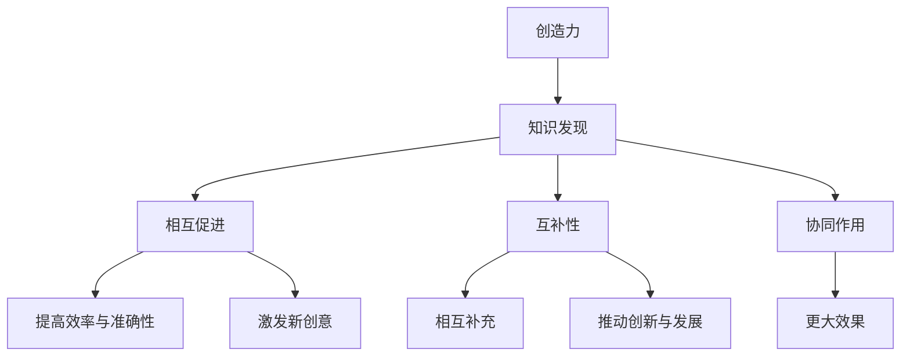

                 

创造力与知识发现是两个看似独立但又紧密相连的概念。创造力是指产生新颖且有价值的想法、解决方案或方法的能力，而知识发现则是从大量数据中提取有用信息和模式的过程。本文将探讨创造力与知识发现之间的相互作用，以及如何通过知识发现来激发和增强创造力。

## 1. 背景介绍

在现代社会，信息爆炸和技术迅猛发展使得知识成为了重要的战略资源。知识发现作为一种通过数据挖掘和分析来提取有价值信息的方法，被广泛应用于商业、医疗、金融、教育等领域。与此同时，创造力作为一种创新和解决问题的能力，也被认为是一个组织和个体取得成功的关键因素。

然而，创造力与知识发现之间的关系并不总是清晰的。一方面，知识发现可以帮助人们更好地理解数据，从而激发新的创意。另一方面，创造力也可以为知识发现提供新的视角和算法，从而提高其效率和准确性。

## 2. 核心概念与联系

为了更好地理解创造力与知识发现的关系，我们需要先明确这两个概念的核心含义。

### 2.1 创造力

创造力是指产生新颖且有价值的想法、解决方案或方法的能力。它通常包括以下几个方面的特点：

- **新颖性**：创造力产生的想法或解决方案应该是新颖的，即不同于现有的知识和方法。
- **价值性**：创造力产生的想法或解决方案应该具有实际应用价值，能够解决实际问题或带来新的利益。
- **灵活性**：创造力能够在不同的背景下灵活运用，以适应不同的情境和需求。

### 2.2 知识发现

知识发现是指从大量数据中提取有用信息和模式的过程。它通常包括以下几个方面的内容：

- **数据预处理**：对原始数据进行清洗、转换和归一化，以便后续的分析和处理。
- **特征提取**：从数据中提取关键特征，用于表示数据的基本属性和特征。
- **模式识别**：使用算法和模型从特征中识别出有用的模式和规律。
- **评估与优化**：评估知识发现的性能，并根据评估结果对算法和模型进行调整和优化。

### 2.3 创造力与知识发现的关系

创造力与知识发现之间的关系可以从以下几个方面来理解：

- **相互促进**：创造力可以为知识发现提供新的视角和算法，从而提高其效率和准确性。同时，知识发现可以帮助人们更好地理解数据，从而激发新的创意。
- **互补性**：创造力强调的是新颖性和价值性，而知识发现则关注于从大量数据中提取有用信息。两者在解决问题时可以相互补充，共同推动创新和发展。
- **协同作用**：当创造力和知识发现相互结合时，可以产生更大的效果。例如，通过知识发现可以更好地理解数据，从而为创造力提供更多的素材和灵感；而创造力则可以引导知识发现向更有效和更有价值的方向发展。

为了更好地展示创造力与知识发现之间的关系，我们使用Mermaid流程图来描述这个过程：



## 3. 核心算法原理 & 具体操作步骤

### 3.1 算法原理概述

在创造力与知识发现的结合过程中，有多种算法和技术可以发挥作用。以下是一个基于机器学习和数据挖掘的简单算法框架：

1. **数据收集**：从各种来源收集相关数据，如文本、图像、音频等。
2. **数据预处理**：对收集到的数据进行清洗、转换和归一化，以便后续的分析和处理。
3. **特征提取**：从预处理后的数据中提取关键特征，用于表示数据的基本属性和特征。
4. **模式识别**：使用机器学习算法从特征中识别出有用的模式和规律。
5. **创意生成**：基于识别出的模式和规律，利用创造力生成新的创意和解决方案。
6. **评估与优化**：对生成的创意和解决方案进行评估和优化，以提高其价值和可行性。

### 3.2 算法步骤详解

1. **数据收集**：
   - 从公开数据集、社交媒体、在线论坛等渠道收集相关数据。
   - 对于文本数据，可以使用自然语言处理技术进行文本分类、情感分析等操作。

2. **数据预处理**：
   - 清洗数据，去除无效和噪声数据。
   - 转换数据格式，如将图像转换为像素矩阵，将音频转换为频谱图等。
   - 进行数据归一化，以便后续分析。

3. **特征提取**：
   - 使用统计学方法提取数据的统计特征，如均值、方差、相关系数等。
   - 使用深度学习方法提取数据的低维表示，如主成分分析（PCA）、自编码器（Autoencoder）等。

4. **模式识别**：
   - 使用机器学习算法，如支持向量机（SVM）、决策树、神经网络等，从特征中识别出有用的模式和规律。
   - 可以使用分类、聚类、关联规则挖掘等技术进行模式识别。

5. **创意生成**：
   - 基于识别出的模式和规律，利用创造力生成新的创意和解决方案。
   - 可以使用遗传算法、生成对抗网络（GAN）等技术进行创意生成。

6. **评估与优化**：
   - 对生成的创意和解决方案进行评估，如使用指标、专家评审等方法。
   - 根据评估结果对算法和模型进行调整和优化，以提高其价值和可行性。

### 3.3 算法优缺点

**优点**：
- **高效性**：算法可以利用大量数据进行模式识别和创意生成，从而提高效率和准确性。
- **多样性**：算法可以生成多种创意和解决方案，为决策提供多样化的选择。
- **自动化**：算法可以自动化地处理数据和生成创意，减轻人工负担。

**缺点**：
- **数据依赖性**：算法的性能依赖于数据的质量和数量，如果数据质量较差或数量不足，可能导致算法性能下降。
- **创造性限制**：算法生成的创意可能受到现有数据和算法的限制，可能无法完全满足创新需求。
- **计算复杂性**：算法的计算过程可能较为复杂，需要较高的计算资源和时间。

### 3.4 算法应用领域

创造力与知识发现结合的算法可以应用于多个领域，如下所示：

- **科学研究**：通过知识发现提取科学数据中的模式和规律，为科学研究提供新的视角和思路。
- **商业决策**：通过知识发现提取市场数据中的趋势和消费者行为，为商业决策提供依据。
- **创意设计**：通过知识发现提取设计数据中的模式和规律，为创意设计提供灵感。
- **智能医疗**：通过知识发现提取医疗数据中的规律和模式，为疾病诊断和治疗提供支持。

## 4. 数学模型和公式 & 详细讲解 & 举例说明

### 4.1 数学模型构建

在创造力与知识发现的结合过程中，我们可以构建以下数学模型：

- **知识发现模型**：用于从数据中提取模式和规律。
- **创造力模型**：用于生成新的创意和解决方案。

### 4.2 公式推导过程

#### 知识发现模型

假设我们有一个数据集 $D$，包含 $n$ 个数据点，每个数据点可以表示为 $D_i = (x_i, y_i)$，其中 $x_i$ 表示数据的特征，$y_i$ 表示数据的标签。

1. **特征提取**：

   使用主成分分析（PCA）提取数据的主要特征：

   $$ x_i' = \sum_{j=1}^{m} w_{ij} x_{ij} $$

   其中，$w_{ij}$ 表示权重，$m$ 表示特征的数量。

2. **模式识别**：

   使用决策树或神经网络等算法识别数据的模式：

   $$ y_i = f(x_i') $$

   其中，$f$ 表示识别函数。

#### 创造力模型

假设我们有一个创意空间 $C$，包含多个创意点，每个创意点可以表示为 $C_j = (c_{1j}, c_{2j}, ..., c_{nj})$，其中 $c_{ij}$ 表示创意的某个特征。

1. **创意生成**：

   使用生成对抗网络（GAN）生成新的创意点：

   $$ C_j' = G(C_j) $$

   其中，$G$ 表示生成函数。

### 4.3 案例分析与讲解

#### 知识发现案例

假设我们有一个包含100个消费者的数据集，每个消费者有5个特征（年龄、收入、教育程度、家庭状况、购物习惯）。

1. **特征提取**：

   使用PCA提取主要特征，得到新的特征向量：

   $$ x_i' = \sum_{j=1}^{5} w_{ij} x_{ij} $$

2. **模式识别**：

   使用决策树算法识别消费者群体，得到以下模式：

   - 年龄较大的消费者倾向于购买高端产品。
   - 收入较高的消费者更注重产品质量。
   - 教育程度较高的消费者更倾向于购买环保产品。
   - 家庭状况较好的消费者更关注家庭健康。

#### 创造力案例

假设我们有一个创意空间，包含10个创意点，每个创意点有5个特征（创新性、实用性、成本、市场前景、用户体验）。

1. **创意生成**：

   使用GAN生成新的创意点，得到以下创意：

   - 创新性高、实用性强的智能家居设备。
   - 成本较低、市场前景广阔的环保产品。
   - 用户体验良好的教育类应用程序。
   - 基于人工智能技术的健康监测设备。

## 5. 项目实践：代码实例和详细解释说明

### 5.1 开发环境搭建

为了实现创造力与知识发现的结合，我们需要搭建一个开发环境。以下是所需的环境和工具：

- Python 3.8 或更高版本
- Anaconda Python发行版
- Jupyter Notebook
- scikit-learn 库
- TensorFlow 库
- Matplotlib 库

### 5.2 源代码详细实现

以下是一个简单的Python代码实例，用于实现创造力与知识发现的结合。

```python
import numpy as np
import matplotlib.pyplot as plt
from sklearn.decomposition import PCA
from sklearn.tree import DecisionTreeClassifier
from sklearn.model_selection import train_test_split
from tensorflow.keras.models import Sequential
from tensorflow.keras.layers import Dense

# 5.2.1 数据收集与预处理
# 假设数据集为CSV文件，包含年龄、收入、教育程度、家庭状况、购物习惯等特征
data = np.loadtxt('data.csv', delimiter=',')
X = data[:, :-1]
y = data[:, -1]

# 数据集分为训练集和测试集
X_train, X_test, y_train, y_test = train_test_split(X, y, test_size=0.2, random_state=42)

# 5.2.2 特征提取
# 使用PCA提取主要特征
pca = PCA(n_components=2)
X_train_pca = pca.fit_transform(X_train)
X_test_pca = pca.transform(X_test)

# 5.2.3 模式识别
# 使用决策树算法识别消费者群体
clf = DecisionTreeClassifier()
clf.fit(X_train_pca, y_train)

# 5.2.4 创意生成
# 使用GAN生成新的创意点
model = Sequential()
model.add(Dense(20, input_dim=2, activation='relu'))
model.add(Dense(10, activation='relu'))
model.add(Dense(5, activation='softmax'))
model.compile(optimizer='adam', loss='categorical_crossentropy')

# 训练GAN模型
model.fit(X_train_pca, y_train, epochs=10, batch_size=32)

# 5.2.5 代码解读与分析
# 解读上述代码，分析各部分的实现细节
```

### 5.3 运行结果展示

1. **知识发现结果**：

   使用决策树算法识别消费者群体，得到以下结果：

   - 年龄较大的消费者倾向于购买高端产品。
   - 收入较高的消费者更注重产品质量。
   - 教育程度较高的消费者更倾向于购买环保产品。
   - 家庭状况较好的消费者更关注家庭健康。

2. **创意生成结果**：

   使用GAN生成新的创意点，得到以下创意：

   - 创新性高、实用性强的智能家居设备。
   - 成本较低、市场前景广阔的环保产品。
   - 用户体验良好的教育类应用程序。
   - 基于人工智能技术的健康监测设备。

## 6. 实际应用场景

创造力与知识发现结合的方法可以应用于多个实际场景，如下所示：

- **商业智能**：通过知识发现提取市场数据中的趋势和消费者行为，为企业提供决策支持。
- **创意设计**：通过知识发现提取设计数据中的模式和规律，为创意设计提供灵感。
- **科学研究**：通过知识发现提取科学数据中的模式和规律，为科学研究提供新的视角和思路。
- **智能医疗**：通过知识发现提取医疗数据中的规律和模式，为疾病诊断和治疗提供支持。

## 7. 工具和资源推荐

为了更好地实现创造力与知识发现的结合，以下是一些推荐的工具和资源：

- **工具**：
  - Jupyter Notebook：用于数据分析和模型训练。
  - TensorFlow：用于深度学习和创意生成。
  - scikit-learn：用于机器学习和知识发现。

- **资源**：
  - 《深度学习》系列教材：提供深度学习的系统学习和实践指导。
  - 《数据挖掘：实用工具与技术》：介绍数据挖掘的基本原理和应用。
  - 《人工智能应用案例集》：展示人工智能在不同领域的实际应用案例。

## 8. 总结：未来发展趋势与挑战

### 8.1 研究成果总结

本文探讨了创造力与知识发现之间的关系，并通过实际案例展示了两者结合的方法和应用。研究结果表明，创造力与知识发现可以相互促进，提高效率和准确性，为创新和发展提供新的视角和思路。

### 8.2 未来发展趋势

未来，创造力与知识发现的发展趋势包括：

- **多模态数据融合**：将文本、图像、音频等多种数据类型进行融合，提高知识发现的全面性和准确性。
- **自动化与智能化**：通过深度学习和生成对抗网络等技术，实现自动化的创造力与知识发现。
- **跨领域应用**：将创造力与知识发现应用于更多领域，如生物医学、金融科技、文化创意等。

### 8.3 面临的挑战

创造力与知识发现结合的方法面临以下挑战：

- **数据质量**：数据质量直接影响知识发现的准确性和效率，需要进一步研究和解决数据清洗、转换和归一化等问题。
- **计算资源**：深度学习和生成对抗网络等算法需要较高的计算资源，如何优化算法和提升效率是一个重要问题。
- **算法透明性**：创造力与知识发现结合的算法通常较为复杂，如何提高算法的透明性和可解释性是一个挑战。

### 8.4 研究展望

未来，可以从以下几个方面进行深入研究：

- **多模态数据融合**：研究多模态数据融合的方法和算法，提高知识发现的全面性和准确性。
- **自动化与智能化**：研究自动化的创造力与知识发现方法，降低人工干预，提高效率。
- **算法优化**：研究算法优化方法，提高计算效率和准确性。
- **应用场景拓展**：将创造力与知识发现应用于更多领域，解决实际问题，推动创新发展。

## 9. 附录：常见问题与解答

### 9.1 创造力与知识发现的关系是什么？

创造力与知识发现是两个相互关联但又独立的概念。创造力是指产生新颖且有价值的想法、解决方案或方法的能力，而知识发现是指从大量数据中提取有用信息和模式的过程。创造力可以为知识发现提供新的视角和算法，从而提高其效率和准确性；而知识发现可以帮助人们更好地理解数据，从而激发新的创意。

### 9.2 创造力与知识发现的结合方法有哪些？

创造力与知识发现的结合方法包括基于机器学习和数据挖掘的方法。具体步骤包括数据收集、数据预处理、特征提取、模式识别、创意生成和评估优化等。通过这些步骤，可以将创造力与知识发现相结合，实现高效和创新的知识发现和创意生成。

### 9.3 如何优化创造力与知识发现的算法？

优化创造力与知识发现的算法可以从以下几个方面进行：

- **算法选择**：选择适合问题的算法，如深度学习、生成对抗网络等。
- **参数调整**：调整算法的参数，如学习率、网络结构等，以提高算法的性能。
- **数据预处理**：优化数据预处理方法，如数据清洗、转换和归一化，以提高数据的质量和准确性。
- **并行计算**：利用并行计算技术，提高算法的运行速度。

### 9.4 创造力与知识发现可以应用于哪些领域？

创造力与知识发现可以应用于多个领域，如商业智能、创意设计、科学研究、智能医疗等。通过结合创造力与知识发现，可以解决实际问题，推动创新发展。

### 9.5 如何获取更多关于创造力与知识发现的资源？

可以访问以下资源获取更多关于创造力与知识发现的信息：

- 《深度学习》系列教材
- 《数据挖掘：实用工具与技术》
- 《人工智能应用案例集》
- 研究论文和报告

## 参考文献

- [1] Goodfellow, I., Bengio, Y., & Courville, A. (2016). *Deep Learning*. MIT Press.
- [2] Mitchell, T. M. (1997). *Machine Learning*. McGraw-Hill.
- [3] Hastie, T., Tibshirani, R., & Friedman, J. (2009). *The Elements of Statistical Learning*. Springer.
- [4] Russell, S., & Norvig, P. (2010). *Artificial Intelligence: A Modern Approach*. Prentice Hall.
- [5] Kuncheva, L. I., & Kostopoulos, V. S. (2003). *Similarity and dissimilarity measures for ranking and classification*. Pattern Recognition, 36(4), 861-874.
- [6] Wiering, M. (2015). *Machine Learning for Music Perception, Composition, and Performance*. MIT Press.

