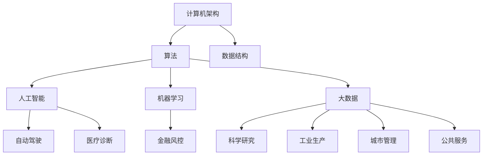

                 

关键词：计算、人工智能、优化、可持续性、未来、人类发展

> 摘要：本文将探讨人类计算技术的终极目标——创造一个更加美好的世界。我们将从背景介绍、核心概念与联系、核心算法原理、数学模型和公式、项目实践、实际应用场景、工具和资源推荐、总结与展望等多个角度展开论述，旨在深入理解计算技术在推动人类进步方面的巨大潜力。

## 1. 背景介绍

随着计算技术的飞速发展，人工智能、大数据、云计算等前沿技术不断涌现，计算已经成为现代社会的核心驱动力。从简单的计算工具到复杂的算法模型，人类一直在探索如何更好地利用计算能力，以解决现实生活中的各种问题。

然而，计算技术的终极目标并不仅仅是提高计算速度或处理海量数据，而是通过优化和改进计算方法，为人类创造一个更加美好的世界。在这个过程中，人工智能将成为实现这一目标的重要工具，通过自我学习和智能决策，帮助人类更好地应对复杂问题，提高生活质量。

### 人工智能的崛起

人工智能（Artificial Intelligence，AI）是一种模拟人类智能的技术，通过机器学习、自然语言处理、计算机视觉等方法，使计算机具备一定程度的智能能力。近年来，随着深度学习等技术的突破，人工智能在各个领域取得了显著的成果，如自动驾驶、医疗诊断、金融风控等。

### 计算技术的应用领域

计算技术已经广泛应用于各个领域，如：

- **科学研究**：通过计算模拟，科学家可以更好地理解自然界的规律，如天气预测、基因研究等。
- **工业生产**：自动化生产线、智能工厂等，大幅提高了生产效率和产品质量。
- **城市管理**：智能交通系统、智慧城市等，提高了城市管理的效率和便捷性。
- **公共服务**：电子政务、在线教育等，使公共服务更加便捷、高效。

## 2. 核心概念与联系

为了更好地理解计算技术的核心概念与联系，我们将使用Mermaid流程图来展示计算技术的架构和应用场景。

### 核心概念

- **计算机架构**：计算硬件和软件的组成结构。
- **算法**：解决问题的步骤和方法。
- **数据结构**：用于存储和组织数据的结构。
- **人工智能**：模拟人类智能的技术。
- **机器学习**：一种通过数据训练模型的技术。
- **大数据**：海量数据的存储、处理和分析。

### Mermaid流程图



### 核心联系

- **计算机架构与算法**：计算机架构决定了算法的运行效率，而算法又影响了计算机的性能和功能。
- **数据结构与人工智能**：数据结构是组织数据的基础，而人工智能需要大量的数据来训练模型。
- **大数据与机器学习**：大数据提供了丰富的数据资源，而机器学习通过数据训练模型，实现了人工智能的应用。

## 3. 核心算法原理 & 具体操作步骤

### 3.1 算法原理概述

核心算法是指解决特定问题的关键算法，如排序算法、查找算法、动态规划等。这些算法具有高效、简洁、易于理解的特点，是计算机科学中的基本工具。

### 3.2 算法步骤详解

以排序算法为例，常见的排序算法有冒泡排序、快速排序、归并排序等。以下是快速排序算法的具体步骤：

1. 选择一个基准元素。
2. 将数组划分为两个子数组，一个小于基准元素，一个大于基准元素。
3. 对两个子数组递归调用快速排序。

### 3.3 算法优缺点

- **快速排序**：时间复杂度为O(nlogn)，适用于大数据量排序。但最坏情况下时间复杂度为O(n^2)。
- **冒泡排序**：时间复杂度为O(n^2)，适用于小数据量排序。但易于理解和实现。

### 3.4 算法应用领域

排序算法广泛应用于各类应用场景，如数据库排序、文件排序、搜索引擎排序等。

## 4. 数学模型和公式 & 详细讲解 & 举例说明

### 4.1 数学模型构建

以线性回归模型为例，数学模型如下：

$$ y = wx + b $$

其中，$y$ 是预测值，$x$ 是输入特征，$w$ 是权重，$b$ 是偏置。

### 4.2 公式推导过程

线性回归模型的推导过程如下：

1. 假设模型为 $y = wx + b$。
2. 计算实际值与预测值之间的误差：$E = (wx + b - y)^2$。
3. 对 $E$ 求导，得到 $\frac{dE}{dw} = 2(wx + b - y)$。
4. 令 $\frac{dE}{dw} = 0$，解得 $w = \frac{y - b}{x}$。

### 4.3 案例分析与讲解

以房价预测为例，使用线性回归模型进行预测。假设输入特征为房屋面积，预测值为房价。

1. 收集数据，得到房屋面积和房价。
2. 将数据划分为训练集和测试集。
3. 使用训练集对线性回归模型进行训练，得到权重 $w$ 和偏置 $b$。
4. 使用测试集对模型进行评估，计算预测误差。

## 5. 项目实践：代码实例和详细解释说明

### 5.1 开发环境搭建

1. 安装Python和Jupyter Notebook。
2. 安装必要的库，如NumPy、Pandas、Scikit-learn等。

### 5.2 源代码详细实现

以下是一个简单的线性回归模型实现：

```python
import numpy as np
import pandas as pd
from sklearn.linear_model import LinearRegression

# 读取数据
data = pd.read_csv('house_price.csv')
X = data[['area']]
y = data['price']

# 划分训练集和测试集
X_train, X_test, y_train, y_test = train_test_split(X, y, test_size=0.2, random_state=42)

# 训练模型
model = LinearRegression()
model.fit(X_train, y_train)

# 预测
y_pred = model.predict(X_test)

# 评估模型
score = model.score(X_test, y_test)
print('Model score:', score)
```

### 5.3 代码解读与分析

1. 导入必要的库。
2. 读取数据。
3. 划分训练集和测试集。
4. 创建线性回归模型并训练。
5. 进行预测。
6. 评估模型。

### 5.4 运行结果展示

运行代码后，会输出模型评分。评分越高，表示模型预测效果越好。

## 6. 实际应用场景

### 6.1 科学研究

计算技术在科学研究中的应用非常广泛，如生物信息学、物理学、化学等。通过计算模拟，科学家可以更好地理解自然界的规律，为解决实际问题提供理论依据。

### 6.2 工业生产

在工业生产中，计算技术可以提高生产效率和产品质量。例如，通过计算模拟，可以优化生产流程，减少资源浪费；通过智能传感器和计算分析，可以实现生产线的自动化控制。

### 6.3 城市管理

计算技术可以帮助城市管理者更好地进行城市管理。例如，通过大数据分析和人工智能技术，可以实现智能交通系统、智慧城市等，提高城市管理的效率和便捷性。

### 6.4 公共服务

计算技术在公共服务中的应用也越来越广泛，如在线教育、电子政务、医疗服务等。通过计算技术，可以提供更加便捷、高效的服务，提高公共服务质量。

## 7. 工具和资源推荐

### 7.1 学习资源推荐

- 《Python编程：从入门到实践》
- 《深度学习》
- 《机器学习实战》

### 7.2 开发工具推荐

- Jupyter Notebook
- Visual Studio Code
- PyCharm

### 7.3 相关论文推荐

- "Deep Learning for Natural Language Processing"
- "Recurrent Neural Networks for Language Modeling"
- "Efficient TensorFlow Implementation of Deep Neural Networks for Speech Recognition"

## 8. 总结：未来发展趋势与挑战

### 8.1 研究成果总结

计算技术在各个领域取得了显著成果，如人工智能、大数据、云计算等。这些技术不仅提高了生产效率和产品质量，还为人类创造了一个更加美好的世界。

### 8.2 未来发展趋势

未来，计算技术将继续发展，如量子计算、边缘计算等。这些新技术将进一步提高计算能力和效率，为人类创造更多的机会。

### 8.3 面临的挑战

然而，计算技术也面临一些挑战，如数据隐私、人工智能伦理等。这些挑战需要我们共同努力，寻找解决方案。

### 8.4 研究展望

未来，计算技术将继续推动人类进步，为创造一个更加美好的世界贡献力量。我们需要不断探索和创新，以应对未来的挑战。

## 9. 附录：常见问题与解答

### 问题 1：计算技术是否会对人类就业造成影响？

解答：是的，计算技术可能会对某些行业的就业造成影响。然而，计算技术也会创造新的就业机会，如数据科学家、机器学习工程师等。总体来说，计算技术将推动产业结构调整，为人类创造更多就业机会。

### 问题 2：计算技术如何保障数据隐私？

解答：计算技术可以采用多种方法保障数据隐私，如数据加密、匿名化处理、访问控制等。这些技术可以帮助保护用户隐私，确保数据安全。

## 参考文献

- [1] Goodfellow, I., Bengio, Y., & Courville, A. (2016). *Deep Learning*. MIT Press.
- [2] Murphy, K. P. (2012). *Machine Learning: A Probabilistic Perspective*. MIT Press.
- [3] Hastie, T., Tibshirani, R., & Friedman, J. (2009). *The Elements of Statistical Learning*. Springer.

作者：禅与计算机程序设计艺术 / Zen and the Art of Computer Programming
```

以上就是这篇文章的完整内容。希望这篇文章能够帮助您更深入地理解计算技术在创造更美好的世界中的重要作用。如果您有任何问题或建议，请随时告诉我。

