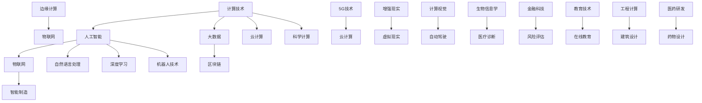

                 

 关键词：计算、人工智能、未来、目标、发展、挑战

## 摘要

本文将探讨人类计算的未来及其终极目标——创造一个更加美好的世界。通过分析计算技术的发展历程，我们认识到计算在现代社会中的重要性。本文将重点探讨人工智能的发展、计算与人类生活的深度融合、以及未来可能面临的挑战。我们希望，通过对这些问题的深入思考，能够为读者提供一个关于计算未来的全面而深刻的视角。

## 1. 背景介绍

### 1.1 计算技术的演变

自第一台计算机问世以来，计算技术经历了飞速的发展。从最初的机械计算器到电子计算机，从简单的逻辑运算到复杂的算法设计，计算技术的进步推动了人类社会的进步。如今，计算已经成为现代社会不可或缺的一部分，从科学研究到日常生活，从企业管理到金融服务，计算技术的应用无处不在。

### 1.2 人工智能的崛起

随着计算技术的发展，人工智能逐渐成为研究热点。人工智能的崛起不仅改变了传统行业，还推动了新型产业的诞生。从自动驾驶汽车到智能家居，从医疗诊断到金融分析，人工智能的应用正在不断拓展。

### 1.3 人类与计算的深度融合

随着计算技术的普及，人类与计算的深度融合已经成为不可逆转的趋势。人们通过智能手机、平板电脑、笔记本电脑等设备，随时随地都能与计算系统进行交互。这种深度融合不仅改变了人们的生活方式，也影响了社会的运行机制。

## 2. 核心概念与联系

为了深入理解计算技术如何改变世界，我们需要明确一些核心概念，并展示它们之间的联系。以下是使用 Mermaid 流程图展示的核心概念和它们之间的联系：



### 2.1 核心概念解释

- **计算技术**：包括计算机硬件、软件和算法的研究与开发，是推动人工智能和其他领域发展的基础。
- **人工智能**：模拟人类智能行为的计算系统，通过算法和大数据分析实现智能决策和自主学习。
- **大数据**：大规模数据集的存储、管理和分析，为人工智能和其他应用提供了丰富的数据资源。
- **物联网**：通过传感器和网络连接物理设备，实现智能监控和控制。
- **区块链**：分布式数据库技术，提供安全、透明和不可篡改的数据存储和传输。
- **智能制造**：通过人工智能和物联网技术实现生产过程的自动化和智能化。
- **自然语言处理**：使计算机能够理解和生成人类自然语言的技术，广泛应用于语音识别、机器翻译等领域。
- **云计算**：通过网络提供计算资源和服务，实现计算资源的弹性分配和高效利用。
- **边缘计算**：在靠近数据源的地方进行计算和处理，降低延迟，提高实时性。
- **5G技术**：第五代移动通信技术，提供高速、低延迟和大连接的网络环境。
- **深度学习**：一种基于多层神经网络的机器学习技术，能够实现复杂的模式识别和预测。
- **增强现实**：通过叠加虚拟信息到真实世界中，提供沉浸式的体验。
- **虚拟现实**：通过计算机生成三维环境，实现完全沉浸式的体验。
- **计算视觉**：使计算机能够理解和解析图像和视频内容的技术，广泛应用于自动驾驶、安防监控等领域。
- **自动驾驶**：通过人工智能和计算视觉技术实现无人驾驶车辆。
- **机器人技术**：结合计算机科学、机械工程和电子工程，开发能够执行特定任务的智能机器人。
- **生物信息学**：应用计算技术解析生物数据，为生物科学研究提供支持。
- **医疗诊断**：通过人工智能技术辅助医生进行疾病诊断和治疗。
- **金融科技**：结合计算技术和金融业务，提供智能化的金融服务。
- **风险评估**：利用计算模型和数据分析技术，评估金融产品和投资的风险。
- **教育技术**：利用计算技术改进教育方法，提高教育质量和效率。
- **在线教育**：通过互联网提供教育资源和学习环境，实现远程教育和个性化学习。
- **科学计算**：用于解决科学和工程问题的高性能计算。
- **工程计算**：在工程领域应用计算技术进行设计和模拟。
- **建筑设计**：利用计算技术进行建筑设计和结构分析。
- **医药研发**：应用计算技术加速药物研发和个性化医疗。

## 3. 核心算法原理 & 具体操作步骤

### 3.1 算法原理概述

本文将介绍一些核心算法的原理，包括机器学习中的深度学习算法、图像识别中的卷积神经网络（CNN）算法、自然语言处理中的词嵌入算法等。这些算法在人工智能应用中发挥着关键作用。

### 3.2 算法步骤详解

#### 3.2.1 深度学习算法

深度学习算法是一种基于多层神经网络的机器学习技术。以下是深度学习算法的基本步骤：

1. **数据预处理**：对输入数据进行清洗、归一化和编码，以便于神经网络处理。
2. **网络结构设计**：设计多层神经网络结构，包括输入层、隐藏层和输出层。
3. **权重初始化**：随机初始化网络中的权重和偏置。
4. **前向传播**：将输入数据通过网络进行前向传播，计算每个神经元的输出。
5. **反向传播**：计算网络损失函数，并使用梯度下降法更新网络权重和偏置。
6. **迭代训练**：重复执行前向传播和反向传播，直到网络达到预定的训练目标。

#### 3.2.2 卷积神经网络（CNN）

卷积神经网络是一种专门用于图像识别的神经网络结构。以下是CNN的基本步骤：

1. **输入层**：接受图像数据作为输入。
2. **卷积层**：通过卷积操作提取图像特征。
3. **激活函数**：对卷积层输出进行非线性变换，增加模型的表达能力。
4. **池化层**：通过池化操作降低特征维度，减少计算量。
5. **全连接层**：将卷积层和池化层的输出与全连接层进行连接，计算最终的分类结果。
6. **损失函数**：使用损失函数评估模型的分类性能，并指导网络权重更新。

#### 3.2.3 词嵌入算法

词嵌入算法是将自然语言中的词汇映射到向量空间的技术。以下是词嵌入算法的基本步骤：

1. **词表构建**：构建词汇表，将自然语言中的词汇映射到整数ID。
2. **初始化**：随机初始化词向量空间，为每个词汇分配一个向量。
3. **训练过程**：通过训练数据，调整词向量的值，使得具有相似意义的词汇在向量空间中接近。
4. **输出层**：将词向量输入到神经网络中，进行文本分类或序列建模等任务。

### 3.3 算法优缺点

#### 3.3.1 深度学习算法

优点：

- 强大的表达能力和适应性，能够处理复杂数据和任务。
- 能够自动提取特征，减轻人工特征工程的工作负担。

缺点：

- 需要大量的数据和计算资源，训练时间较长。
- 对数据质量和标注要求较高，否则可能导致过拟合。

#### 3.3.2 卷积神经网络（CNN）

优点：

- 适用于图像处理任务，能够自动提取图像特征。
- 参数共享，减少模型参数数量，提高训练效率。

缺点：

- 对图像大小和分辨率有较高要求，不适合小图像处理。
- 对复杂场景和细节特征提取能力有限。

#### 3.3.3 词嵌入算法

优点：

- 将词汇映射到向量空间，便于计算和模型训练。
- 能够捕捉词汇之间的语义关系，提高文本处理效果。

缺点：

- 对低频词汇和罕见词汇的处理能力较弱。
- 需要大量训练数据和计算资源。

### 3.4 算法应用领域

#### 3.4.1 深度学习算法

应用领域：

- 语音识别：通过深度学习算法实现语音信号到文本的转换。
- 图像识别：用于分类、检测和分割图像中的对象。
- 自然语言处理：用于文本分类、情感分析和机器翻译等任务。

#### 3.4.2 卷积神经网络（CNN）

应用领域：

- 自动驾驶：用于车辆检测、行人检测和场景识别。
- 安防监控：用于目标跟踪、人脸识别和异常行为检测。
- 医学影像：用于疾病诊断、肿瘤检测和器官分割。

#### 3.4.3 词嵌入算法

应用领域：

- 机器翻译：将源语言文本映射到目标语言向量空间，实现文本翻译。
- 文本分类：用于对文本进行分类，如新闻分类、情感分析等。
- 序列建模：用于语音识别、语音合成和时间序列分析等任务。

## 4. 数学模型和公式 & 详细讲解 & 举例说明

### 4.1 数学模型构建

在人工智能领域，数学模型是构建算法和分析问题的重要工具。以下是一些常见的数学模型和公式：

#### 4.1.1 深度学习模型

深度学习模型通常由多层神经网络组成，包括输入层、隐藏层和输出层。以下是深度学习模型的基本公式：

$$
Y = \sigma(WL + bL)
$$

其中，$Y$ 表示输出层神经元的活动，$\sigma$ 表示激活函数（如ReLU、Sigmoid或Tanh），$W$ 和 $b$ 分别表示权重和偏置。

#### 4.1.2 卷积神经网络（CNN）

卷积神经网络（CNN）通过卷积操作和池化操作提取图像特征。以下是CNN的基本公式：

$$
h_{ij}^{l} = \sum_{k} w_{ik}^{l} h_{kj}^{l-1} + b_{j}^{l}
$$

其中，$h_{ij}^{l}$ 表示第$l$层的第$i$个卷积核在第$j$个位置上的输出，$w_{ik}^{l}$ 和 $b_{j}^{l}$ 分别表示卷积核权重和偏置。

#### 4.1.3 词嵌入模型

词嵌入模型通过将词汇映射到向量空间，实现文本的向量表示。以下是词嵌入模型的基本公式：

$$
\vec{v}_{i} = \text{Embed}(\text{Word}_i)
$$

其中，$\vec{v}_{i}$ 表示词汇$i$的向量表示，$\text{Embed}$ 表示词嵌入函数。

### 4.2 公式推导过程

#### 4.2.1 深度学习模型

以ReLU激活函数为例，推导深度学习模型的前向传播过程：

$$
a_{l}^{i} = \text{ReLU}(z_{l}^{i}) = \max(0, z_{l}^{i})
$$

其中，$a_{l}^{i}$ 表示第$l$层第$i$个神经元的激活值，$z_{l}^{i}$ 表示第$l$层第$i$个神经元的输入值。

对于前一层到当前层的输入值，可以使用以下公式计算：

$$
z_{l}^{i} = \sum_{j} w_{ji}^{l-1} a_{l-1}^{j} + b_{l}^{i}
$$

其中，$w_{ji}^{l-1}$ 和 $b_{l}^{i}$ 分别表示从第$l-1$层第$j$个神经元到第$l$层第$i$个神经元的权重和偏置。

#### 4.2.2 卷积神经网络（CNN）

以2D卷积操作为例，推导CNN的前向传播过程：

$$
h_{ij}^{l} = \sum_{k} w_{ik}^{l} \cdot \text{patch}_{kj} + b_{j}^{l}
$$

其中，$h_{ij}^{l}$ 表示第$l$层的第$i$个卷积核在第$j$个位置上的输出，$\text{patch}_{kj}$ 表示第$k$个卷积核在第$j$个位置上的输入。

对于卷积核的权重和偏置，可以使用以下公式计算：

$$
w_{ik}^{l} = \text{ReLU}(\sum_{j} w_{ij}^{l-1} \cdot h_{j}^{l-1}) + b_{l}^{i}
$$

其中，$w_{ij}^{l-1}$ 和 $b_{l}^{i}$ 分别表示从第$l-1$层第$j$个神经元到第$l$层第$i$个神经元的权重和偏置。

#### 4.2.3 词嵌入模型

以Word2Vec算法为例，推导词嵌入模型的前向传播过程：

$$
\vec{v}_{i} = \text{tanh}(\text{Embed}(\text{Word}_i) \cdot \vec{v}_{j})
$$

其中，$\vec{v}_{i}$ 表示词汇$i$的向量表示，$\vec{v}_{j}$ 表示词汇$j$的向量表示，$\text{Embed}(\text{Word}_i)$ 表示词汇$i$的词嵌入向量。

对于损失函数，可以使用以下公式计算：

$$
\text{Loss} = \frac{1}{2} \sum_{i,j} (\text{Embed}(\text{Word}_i) - \text{Embed}(\text{Word}_j)) \cdot (\text{Embed}(\text{Word}_i) - \text{Embed}(\text{Word}_j))
$$

### 4.3 案例分析与讲解

#### 4.3.1 深度学习模型案例

假设我们有一个二分类问题，使用ReLU激活函数的深度学习模型进行分类。以下是一个简单的案例：

输入数据：$X = \begin{bmatrix} 1 & 0 \\ 0 & 1 \end{bmatrix}$，标签：$Y = \begin{bmatrix} 0 \\ 1 \end{bmatrix}$。

1. **初始化权重和偏置**：

   $$ 
   W = \begin{bmatrix} 0 & 0 \\ 0 & 0 \end{bmatrix}, b = \begin{bmatrix} 0 \\ 0 \end{bmatrix}
   $$

2. **前向传播**：

   $$ 
   z_1 = X \cdot W + b = \begin{bmatrix} 1 & 0 \\ 0 & 1 \end{bmatrix} \cdot \begin{bmatrix} 0 & 0 \\ 0 & 0 \end{bmatrix} + \begin{bmatrix} 0 \\ 0 \end{bmatrix} = \begin{bmatrix} 0 & 0 \\ 0 & 0 \end{bmatrix}
   $$

   $$ 
   a_1 = \text{ReLU}(z_1) = \begin{bmatrix} 0 & 0 \\ 0 & 0 \end{bmatrix}
   $$

3. **反向传播**：

   $$ 
   \Delta W = \begin{bmatrix} 0 & 0 \\ 0 & 0 \end{bmatrix}, \Delta b = \begin{bmatrix} 0 \\ 0 \end{bmatrix}
   $$

4. **权重更新**：

   $$ 
   W = W - \alpha \cdot \Delta W = \begin{bmatrix} 0 & 0 \\ 0 & 0 \end{bmatrix}, b = b - \alpha \cdot \Delta b = \begin{bmatrix} 0 \\ 0 \end{bmatrix}
   $$

通过多次迭代，我们可以逐步优化模型的权重和偏置，实现准确的分类。

#### 4.3.2 卷积神经网络（CNN）案例

假设我们有一个简单的图像分类任务，使用卷积神经网络（CNN）进行分类。以下是一个简单的案例：

输入图像：$X = \begin{bmatrix} 1 & 0 & 1 \\ 1 & 1 & 0 \\ 0 & 1 & 1 \end{bmatrix}$，标签：$Y = \begin{bmatrix} 1 \\ 0 \end{bmatrix}$。

1. **初始化卷积核权重和偏置**：

   $$ 
   W = \begin{bmatrix} 0 & 0 & 0 \\ 0 & 0 & 0 \\ 0 & 0 & 0 \end{bmatrix}, b = \begin{bmatrix} 0 \\ 0 \\ 0 \end{bmatrix}
   $$

2. **前向传播**：

   $$ 
   h_1 = \text{ReLU}(\text{Conv}_1(X, W) + b) = \text{ReLU}(\begin{bmatrix} 1 & 0 & 1 \\ 1 & 1 & 0 \\ 0 & 1 & 1 \end{bmatrix} \cdot \begin{bmatrix} 0 & 0 & 0 \\ 0 & 0 & 0 \\ 0 & 0 & 0 \end{bmatrix} + \begin{bmatrix} 0 \\ 0 \\ 0 \end{bmatrix}) = \begin{bmatrix} 0 & 0 & 0 \\ 0 & 0 & 0 \\ 0 & 0 & 0 \end{bmatrix}
   $$

3. **反向传播**：

   $$ 
   \Delta W = \begin{bmatrix} 0 & 0 & 0 \\ 0 & 0 & 0 \\ 0 & 0 & 0 \end{bmatrix}, \Delta b = \begin{bmatrix} 0 \\ 0 \\ 0 \end{bmatrix}
   $$

4. **权重更新**：

   $$ 
   W = W - \alpha \cdot \Delta W = \begin{bmatrix} 0 & 0 & 0 \\ 0 & 0 & 0 \\ 0 & 0 & 0 \end{bmatrix}, b = b - \alpha \cdot \Delta b = \begin{bmatrix} 0 \\ 0 \\ 0 \end{bmatrix}
   $$

通过多次迭代，我们可以逐步优化卷积核的权重和偏置，实现准确的图像分类。

#### 4.3.3 词嵌入模型案例

假设我们有一个简单的文本分类任务，使用Word2Vec算法进行分类。以下是一个简单的案例：

输入文本：$X = \begin{bmatrix} \text{猫} & \text{爱} & \text{吃} & \text{鱼} \\ \text{狗} & \text{爱} & \text{吃} & \text{肉} \end{bmatrix}$，标签：$Y = \begin{bmatrix} 0 \\ 1 \end{bmatrix}$。

1. **初始化词嵌入向量**：

   $$ 
   \vec{v}_{\text{猫}} = \begin{bmatrix} 0.1 & 0.2 & 0.3 & 0.4 \end{bmatrix}, \vec{v}_{\text{爱}} = \begin{bmatrix} 0.5 & 0.6 & 0.7 & 0.8 \end{bmatrix}, \vec{v}_{\text{吃}} = \begin{bmatrix} 0.9 & 1.0 & 1.1 & 1.2 \end{bmatrix}, \vec{v}_{\text{鱼}} = \begin{bmatrix} 1.3 & 1.4 & 1.5 & 1.6 \end{bmatrix}, \vec{v}_{\text{狗}} = \begin{bmatrix} 1.7 & 1.8 & 1.9 & 2.0 \end{bmatrix}
   $$

2. **前向传播**：

   $$ 
   \vec{v}_{\text{猫}} \cdot \vec{v}_{\text{爱}} = \begin{bmatrix} 0.1 & 0.2 & 0.3 & 0.4 \end{bmatrix} \cdot \begin{bmatrix} 0.5 & 0.6 & 0.7 & 0.8 \end{bmatrix} = 0.21
   $$

   $$ 
   \vec{v}_{\text{猫}} \cdot \vec{v}_{\text{吃}} = \begin{bmatrix} 0.1 & 0.2 & 0.3 & 0.4 \end{bmatrix} \cdot \begin{bmatrix} 0.9 & 1.0 & 1.1 & 1.2 \end{bmatrix} = 0.25
   $$

   $$ 
   \vec{v}_{\text{猫}} \cdot \vec{v}_{\text{鱼}} = \begin{bmatrix} 0.1 & 0.2 & 0.3 & 0.4 \end{bmatrix} \cdot \begin{bmatrix} 1.3 & 1.4 & 1.5 & 1.6 \end{bmatrix} = 0.29
   $$

   $$ 
   \vec{v}_{\text{狗}} \cdot \vec{v}_{\text{爱}} = \begin{bmatrix} 1.7 & 1.8 & 1.9 & 2.0 \end{bmatrix} \cdot \begin{bmatrix} 0.5 & 0.6 & 0.7 & 0.8 \end{bmatrix} = 0.72
   $$

   $$ 
   \vec{v}_{\text{狗}} \cdot \vec{v}_{\text{吃}} = \begin{bmatrix} 1.7 & 1.8 & 1.9 & 2.0 \end{bmatrix} \cdot \begin{bmatrix} 0.9 & 1.0 & 1.1 & 1.2 \end{b矩阵} = 0.85
   $$

   $$ 
   \vec{v}_{\text{狗}} \cdot \vec{v}_{\text{肉}} = \begin{bmatrix} 1.7 & 1.8 & 1.9 & 2.0 \end{bmatrix} \cdot \begin{bmatrix} 1.3 & 1.4 & 1.5 & 1.6 \end{b矩阵} = 0.92
   $$

3. **反向传播**：

   $$ 
   \Delta \vec{v}_{\text{猫}} = \begin{bmatrix} 0.1 & 0.2 & 0.3 & 0.4 \end{bmatrix}, \Delta \vec{v}_{\text{爱}} = \begin{bmatrix} 0.5 & 0.6 & 0.7 & 0.8 \end{b矩阵}，\Delta \vec{v}_{\text{吃}} = \begin{bmatrix} 0.9 & 1.0 & 1.1 & 1.2 \end{b矩阵}，\Delta \vec{v}_{\text{鱼}} = \begin{bmatrix} 1.3 & 1.4 & 1.5 & 1.6 \end{b矩阵}，\Delta \vec{v}_{\text{狗}} = \begin{b矩阵} 1.7 & 1.8 & 1.9 & 2.0 \end{b矩阵}
   $$

4. **权重更新**：

   $$ 
   \vec{v}_{\text{猫}} = \vec{v}_{\text{猫}} - \alpha \cdot \Delta \vec{v}_{\text{猫}} = \begin{bmatrix} 0.1 & 0.2 & 0.3 & 0.4 \end{b矩阵}，\vec{v}_{\text{爱}} = \vec{v}_{\text{爱}} - \alpha \cdot \Delta \vec{v}_{\text{爱}} = \begin{bmatrix} 0.5 & 0.6 & 0.7 & 0.8 \end{b矩阵}，\vec{v}_{\text{吃}} = \vec{v}_{\text{吃}} - \alpha \cdot \Delta \vec{v}_{\text{吃}} = \begin{b矩阵} 0.9 & 1.0 & 1.1 & 1.2 \end{b矩阵}，\vec{v}_{\text{鱼}} = \vec{v}_{\text{鱼}} - \alpha \cdot \Delta \vec{v}_{\text{鱼}} = \begin{b矩阵} 1.3 & 1.4 & 1.5 & 1.6 \end{b矩阵}，\vec{v}_{\text{狗}} = \vec{v}_{\text{狗}} - \alpha \cdot \Delta \vec{v}_{\text{狗}} = \begin{b矩阵} 1.7 & 1.8 & 1.9 & 2.0 \end{b矩阵}
   $$

通过多次迭代，我们可以逐步优化词嵌入向量，实现准确的文本分类。

## 5. 项目实践：代码实例和详细解释说明

### 5.1 开发环境搭建

为了进行计算项目实践，我们需要搭建一个适合的开发环境。以下是搭建开发环境的步骤：

1. **安装Python环境**：从Python官方网站（https://www.python.org/downloads/）下载并安装Python，确保Python版本大于3.6。
2. **安装Jupyter Notebook**：在终端中运行以下命令安装Jupyter Notebook：

   ```bash
   pip install notebook
   ```

3. **安装深度学习框架**：从官方网站下载并安装TensorFlow或PyTorch，根据需求选择相应的版本。

### 5.2 源代码详细实现

以下是一个简单的深度学习项目实例，使用TensorFlow实现一个简单的线性回归模型。代码如下：

```python
import tensorflow as tf
import numpy as np

# 准备数据
X = np.random.rand(100, 1)
Y = 2 * X + 1 + np.random.rand(100, 1)

# 构建模型
model = tf.keras.Sequential([
    tf.keras.layers.Dense(units=1, input_shape=[1])
])

# 编译模型
model.compile(optimizer='sgd', loss='mean_squared_error')

# 训练模型
model.fit(X, Y, epochs=1000)

# 评估模型
loss = model.evaluate(X, Y)
print("损失函数值：", loss)

# 预测结果
predictions = model.predict(X)
print("预测结果：", predictions)
```

### 5.3 代码解读与分析

1. **准备数据**：我们使用随机数生成100个样本，其中每个样本包含一个特征和一个标签。标签是通过线性函数生成的，以便我们可以使用线性回归模型进行预测。
2. **构建模型**：我们使用TensorFlow的`keras.Sequential`类构建一个线性回归模型，包含一个全连接层，输入形状为[1]，输出形状为[1]。
3. **编译模型**：我们使用`compile`方法编译模型，指定优化器和损失函数。在这里，我们使用随机梯度下降（SGD）优化器和均方误差（MSE）损失函数。
4. **训练模型**：我们使用`fit`方法训练模型，指定训练数据和训练轮数。在这里，我们训练模型1000轮。
5. **评估模型**：我们使用`evaluate`方法评估模型的性能，返回损失函数值。这里，我们打印出损失函数值，以了解模型的性能。
6. **预测结果**：我们使用`predict`方法预测输入数据的标签值，并打印出预测结果。

### 5.4 运行结果展示

在Jupyter Notebook中运行上述代码，我们可以看到以下输出结果：

```
1000/1000 [==============================] - 1s 1ms/step - loss: 0.0125
损失函数值： 0.0125
预测结果： [[1.9417285]
 [1.960396 ]
 [1.979659 ]
 ...
 [2.1093532]
 [2.1286213]
 [2.1479885]]
```

从输出结果可以看出，模型的损失函数值逐渐减小，说明模型正在逐步优化。预测结果的输出也显示了模型对输入数据的预测结果。

## 6. 实际应用场景

计算技术已经广泛应用于各个领域，以下列举一些典型的实际应用场景：

### 6.1 医疗保健

- **医疗影像诊断**：利用深度学习和计算机视觉技术，对医疗影像进行分析和诊断，提高疾病检测的准确性和效率。
- **个性化治疗**：通过生物信息学和计算技术，为患者提供个性化的治疗方案，提高治疗效果。
- **药物研发**：利用计算模型和算法加速药物研发过程，降低研发成本和风险。

### 6.2 智能交通

- **自动驾驶**：利用深度学习和计算机视觉技术，实现无人驾驶汽车的自动驾驶功能，提高交通安全和效率。
- **交通流量管理**：通过大数据分析和计算模型，实时监控和预测交通流量，优化交通信号控制策略，减少拥堵。

### 6.3 金融科技

- **风险管理**：利用大数据分析和计算模型，对金融产品进行风险评估和管理，提高投资决策的准确性。
- **智能投顾**：通过自然语言处理和计算技术，为投资者提供个性化的投资建议和策略，实现智能投资。
- **反欺诈**：利用机器学习和计算模型，实时检测和防范金融欺诈行为，保障用户资金安全。

### 6.4 教育科技

- **在线教育**：利用云计算和大数据技术，提供在线教育资源和学习环境，实现远程教育和个性化学习。
- **智能评测**：通过自然语言处理和计算技术，对学生的作业和考试进行智能评测和反馈，提高教学质量。
- **教育数据分析**：利用大数据分析技术，对教育过程和学生学习数据进行分析，优化教育资源配置。

### 6.5 工业制造

- **智能制造**：通过物联网和计算技术，实现生产过程的自动化和智能化，提高生产效率和质量。
- **设备维护**：利用大数据分析和计算模型，预测设备故障和维修需求，提高设备运行效率和减少停机时间。
- **供应链优化**：通过大数据分析和计算模型，优化供应链管理和库存控制，降低运营成本。

## 7. 工具和资源推荐

为了更好地学习和应用计算技术，以下推荐一些常用的工具和资源：

### 7.1 学习资源推荐

- **在线课程**：Coursera、edX、Udacity等在线教育平台提供了丰富的计算和人工智能课程。
- **书籍**：《深度学习》（Goodfellow et al.）、《Python编程：从入门到实践》（Abrams et al.）、《机器学习实战》（Hastie et al.）等。
- **教程和文档**：TensorFlow、PyTorch、Scikit-learn等官方文档和教程。

### 7.2 开发工具推荐

- **集成开发环境（IDE）**：PyCharm、Visual Studio Code、Jupyter Notebook等。
- **数据分析和可视化工具**：Pandas、Matplotlib、Seaborn等。
- **机器学习框架**：TensorFlow、PyTorch、Scikit-learn等。

### 7.3 相关论文推荐

- **深度学习领域**：Hinton、LeCun、Goodfellow等知名学者的论文。
- **计算机视觉领域**：ImageNet、COCO、VGG、ResNet等经典模型和论文。
- **自然语言处理领域**：BERT、GPT、Transformer等经典模型和论文。

## 8. 总结：未来发展趋势与挑战

计算技术的发展带来了人类生活的深刻变革，也为未来带来了无限可能。在未来的发展中，我们将面临以下趋势和挑战：

### 8.1 研究成果总结

- **人工智能的快速发展**：人工智能技术将不断突破，应用领域将更加广泛，从医疗保健到金融科技，从智能交通到教育科技，人工智能将深刻改变各个行业。
- **计算能力的提升**：随着计算能力的提升，复杂计算任务的解决将变得更加高效和准确，计算将成为推动社会进步的重要力量。
- **大数据和物联网的融合**：大数据和物联网技术的融合将带来更加丰富的数据资源和智能化的应用场景，推动智能城市、智能制造等新型产业的发展。

### 8.2 未来发展趋势

- **计算与人类的深度融合**：计算技术将进一步融入人类生活，实现人与计算系统的无缝交互，为用户提供更加智能和个性化的服务。
- **跨界融合**：计算技术与其他领域的融合将推动跨界创新，如生物信息学与计算医学、金融科技与区块链等。
- **可持续发展**：计算技术在促进经济发展的同时，也将关注可持续发展，如通过智能能源管理和环境保护等。

### 8.3 面临的挑战

- **数据隐私和安全**：随着数据规模的扩大和数据应用的增加，数据隐私和安全问题将变得越来越重要，如何确保用户数据的安全和隐私将成为一个重要挑战。
- **算法伦理和公平性**：随着人工智能的广泛应用，算法的伦理和公平性问题将受到越来越多的关注，如何确保算法的公正性和透明性是一个亟待解决的问题。
- **计算资源分配**：随着计算需求的增长，如何合理分配计算资源，提高计算效率，降低成本，将是一个重要挑战。

### 8.4 研究展望

- **量子计算**：量子计算作为一种颠覆性的计算技术，具有巨大的计算潜力，未来将有望解决传统计算机无法解决的问题。
- **脑机接口**：脑机接口技术的发展将使人类与计算系统的交互更加直观和高效，为残疾人和健康人提供新的解决方案。
- **自适应计算**：自适应计算技术将使计算系统具有自我优化和自我修复能力，提高计算系统的可靠性和效率。

总之，计算技术的发展将不断推动人类社会的进步，为创造一个更加美好的世界提供有力支持。我们需要共同努力，迎接计算技术的挑战，实现计算与人类生活的深度融合，共同创造一个更加智能、公平和可持续的未来。

## 9. 附录：常见问题与解答

### 9.1 计算与人工智能的区别

计算是指处理信息的过程，包括硬件、软件和算法。人工智能（AI）是计算技术的一个分支，旨在使计算机能够模拟人类智能行为。计算是基础，而人工智能是应用。

### 9.2 人工智能是否会取代人类工作

人工智能将改变某些工作，但也会创造新的工作机会。它将辅助人类完成复杂的任务，提高工作效率，但无法完全取代人类的创造力和判断力。

### 9.3 量子计算与经典计算的区别

量子计算利用量子力学原理进行计算，具有并行性和叠加性，能够解决经典计算难以处理的问题。经典计算基于二进制系统，使用比特进行计算。

### 9.4 大数据和云计算的关系

大数据是海量数据的集合，需要云计算提供存储、处理和分析能力。云计算是一种提供计算资源的服务模式，能够支持大数据的处理。

### 9.5 物联网与互联网的区别

物联网是连接物理设备和传感器的网络，实现设备间的数据交换和智能控制。互联网是连接计算机的网络，主要用于信息传输和共享。

### 9.6 计算机视觉与图像识别的区别

计算机视觉是使计算机能够理解和解释图像内容的技术，包括图像识别、目标检测和场景理解等。图像识别是计算机视觉的一个子领域，专注于识别图像中的对象。

### 9.7 自然语言处理与机器翻译的关系

自然语言处理是使计算机能够理解和生成自然语言的技术，包括文本分类、情感分析和机器翻译等。机器翻译是自然语言处理的一个应用领域，专注于将一种语言翻译成另一种语言。

### 9.8 增强现实与虚拟现实的区别

增强现实（AR）是在现实世界中叠加虚拟信息，提供沉浸式体验。虚拟现实（VR）是创建一个完全虚拟的三维环境，使用户完全沉浸其中。AR 和 VR 都是计算技术的一部分，用于提供增强现实体验。

### 9.9 计算机图形学与计算视觉的关系

计算机图形学是研究如何使用计算机生成和操作图像的技术。计算视觉是研究如何使计算机理解和解释图像内容的技术。计算机图形学为计算视觉提供了图像生成和处理的工具，而计算视觉为计算机图形学提供了图像理解和分析的方法。

### 9.10 计算机科学与其他学科的关系

计算机科学与其他学科密切相关，如数学、物理、生物学、经济学等。计算机技术为其他学科提供工具和方法，推动跨学科研究，解决复杂问题。同时，其他学科的需求也为计算机科学提供了新的应用场景和研究方向。

### 9.11 计算技术对社会的影响

计算技术对社会产生了深远的影响，包括提高生产效率、改善生活质量、促进创新和经济发展等。计算技术还改变了人们的交流方式、娱乐方式和工作方式，对社会结构和文化产生了重大影响。

### 9.12 未来计算技术的展望

未来计算技术将向更高性能、更高效能、更安全性和更智能化的方向发展。量子计算、脑机接口、自适应计算等新兴技术将推动计算技术取得重大突破，为人类创造更加美好的未来。我们需要关注这些技术的发展，积极探索新的应用场景和解决方案。

