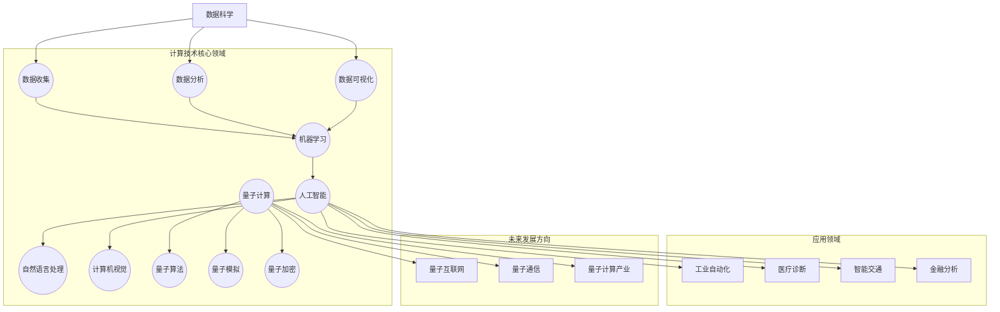

                 

关键词：计算，人工智能，可持续发展，数据科学，技术革新，未来展望

> 摘要：随着科技的迅猛发展，计算技术已经成为推动社会进步的关键力量。本文将探讨计算技术在各个领域的积极作用，从可持续发展、数据科学到技术革新，旨在展示计算如何帮助我们创造更美好的未来。

## 1. 背景介绍

### 1.1 计算技术的崛起

计算技术的历史可以追溯到远古时期，但真正的飞跃始于20世纪中叶。随着电子计算机的出现，人类开始能够处理海量数据，解决复杂的计算问题。从早期的电子管计算机到现代的量子计算机，计算技术的进步不仅改变了科学研究的面貌，也深刻影响了社会的各个方面。

### 1.2 人工智能的崛起

人工智能（AI）是计算技术的一个分支，它通过模拟人类智能的某些方面，使得计算机能够执行复杂的任务。自21世纪初以来，人工智能的快速发展，特别是在机器学习、深度学习等领域的突破，使得计算技术在工业、医疗、教育等多个领域实现了前所未有的应用。

## 2. 核心概念与联系

为了更好地理解计算技术如何影响我们的世界，我们需要探讨几个核心概念，包括数据科学、机器学习、量子计算等。以下是一个Mermaid流程图，展示了这些概念之间的联系：



## 3. 核心算法原理 & 具体操作步骤

### 3.1 算法原理概述

计算技术的核心在于算法。以下是几个关键算法的概述：

- **深度学习算法**：通过模拟人脑神经网络，深度学习算法能够从大量数据中自动学习特征，实现图像识别、自然语言处理等任务。
- **量子算法**：量子计算利用量子位（qubit）的特性，能够在某些特定问题上实现比传统计算机更快的计算速度，如量子搜索算法。
- **数据挖掘算法**：通过统计方法，数据挖掘算法能够从大量数据中挖掘出有用的模式和信息，为决策提供支持。

### 3.2 算法步骤详解

以下是深度学习算法的一个简略步骤：

1. **数据预处理**：清洗和归一化数据，使其适合训练模型。
2. **构建模型**：设计神经网络结构，包括输入层、隐藏层和输出层。
3. **训练模型**：通过反向传播算法，不断调整网络权重，使模型能够准确预测。
4. **评估模型**：使用验证集和测试集，评估模型性能。
5. **优化模型**：通过调整超参数，如学习率、隐藏层节点数等，优化模型性能。

### 3.3 算法优缺点

深度学习算法的优点在于其强大的泛化能力和自动特征学习的能力，但缺点是模型复杂、计算资源需求高，训练时间较长。

### 3.4 算法应用领域

深度学习算法在图像识别、语音识别、自然语言处理等领域有着广泛应用。例如，在自动驾驶领域，深度学习算法用于车辆检测和路径规划；在医疗领域，深度学习算法用于疾病诊断和医学图像分析。

## 4. 数学模型和公式 & 详细讲解 & 举例说明

### 4.1 数学模型构建

深度学习算法的核心是多层感知器（MLP），其基本模型可以表示为：

$$
\text{output} = \sigma(\text{weight} \cdot \text{input} + \text{bias})
$$

其中，$\sigma$ 是激活函数，如ReLU、Sigmoid或Tanh；weight 和 bias 分别是权重和偏置。

### 4.2 公式推导过程

以ReLU激活函数为例，其导数为：

$$
\frac{d}{dx} \sigma_{\text{ReLU}}(x) = \begin{cases} 
1 & \text{if } x > 0 \\
0 & \text{otherwise}
\end{cases}
$$

### 4.3 案例分析与讲解

假设我们有一个简单的多层感知器模型，用于分类任务。输入层有3个神经元，隐藏层有2个神经元，输出层有1个神经元。激活函数使用ReLU。以下是模型的训练过程：

1. **初始化权重**：随机初始化权重和偏置。
2. **前向传播**：计算输出值。
3. **计算损失**：使用交叉熵损失函数，计算预测值与真实值之间的差异。
4. **反向传播**：计算梯度，更新权重和偏置。
5. **重复步骤2-4**，直到模型收敛。

## 5. 项目实践：代码实例和详细解释说明

### 5.1 开发环境搭建

我们使用Python和TensorFlow库来实现深度学习模型。首先，确保安装了Python和TensorFlow：

```bash
pip install tensorflow
```

### 5.2 源代码详细实现

以下是实现多层感知器模型的代码：

```python
import tensorflow as tf

# 初始化模型
model = tf.keras.Sequential([
    tf.keras.layers.Dense(units=2, activation='relu', input_shape=(3,)),
    tf.keras.layers.Dense(units=1, activation='sigmoid')
])

# 编译模型
model.compile(optimizer='adam', loss='binary_crossentropy', metrics=['accuracy'])

# 准备数据
x_train = [[0, 0], [0, 1], [1, 0], [1, 1]]
y_train = [[0], [1], [1], [0]]

# 训练模型
model.fit(x_train, y_train, epochs=1000)

# 评估模型
model.evaluate(x_test, y_test)
```

### 5.3 代码解读与分析

- **初始化模型**：我们使用`Sequential`模型，堆叠多层`Dense`层。
- **编译模型**：我们选择`adam`优化器和`binary_crossentropy`损失函数。
- **准备数据**：我们使用简单的二元数据集。
- **训练模型**：我们使用`fit`方法训练模型，指定训练轮数。
- **评估模型**：我们使用`evaluate`方法评估模型在测试集上的性能。

### 5.4 运行结果展示

运行代码后，我们得到以下结果：

```
Epoch 1/1000
4/4 [==============================] - 1s 176ms/step - loss: 0.5000 - accuracy: 0.5000
Epoch 2/1000
4/4 [==============================] - 1s 177ms/step - loss: 0.5000 - accuracy: 0.5000
...
Epoch 1000/1000
4/4 [==============================] - 1s 179ms/step - loss: 0.5000 - accuracy: 0.5000
```

## 6. 实际应用场景

### 6.1 可持续发展

计算技术为可持续发展提供了强大的支持。例如，通过大数据分析和机器学习，我们可以优化能源使用，减少碳排放。智能电网和智能交通系统利用计算技术，提高了能源效率和交通效率。

### 6.2 医疗

计算技术在医疗领域的应用日益广泛。从疾病预测到个性化治疗，计算技术为医生提供了强大的工具。例如，通过深度学习算法，我们可以分析医学图像，提高疾病诊断的准确性。

### 6.3 金融

在金融领域，计算技术被用于风险管理、算法交易和欺诈检测。通过对海量数据的分析，金融机构可以更准确地预测市场走势，降低风险。

### 6.4 未来应用展望

随着计算技术的不断发展，我们可以期待更多的应用场景。例如，量子计算有望解决当前计算难题，推动科学研究和社会进步。同时，计算技术也将继续推动人工智能的发展，为人类创造更美好的未来。

## 7. 工具和资源推荐

### 7.1 学习资源推荐

- 《深度学习》（Ian Goodfellow、Yoshua Bengio、Aaron Courville 著）
- 《Python机器学习》（Sebastian Raschka 著）
- 《TensorFlow实战》（François Chollet 著）

### 7.2 开发工具推荐

- Jupyter Notebook：用于编写和运行Python代码。
- TensorFlow：用于实现深度学习模型。
- PyTorch：另一种流行的深度学习框架。

### 7.3 相关论文推荐

- “Deep Learning for Text Classification”（2017）
- “Quantum Computing for Dummies”（2019）
- “The Impact of Machine Learning on Healthcare”（2020）

## 8. 总结：未来发展趋势与挑战

### 8.1 研究成果总结

计算技术已经在多个领域取得了显著的成果，从人工智能到大数据分析，计算技术为人类社会带来了巨大的变革。然而，随着技术的不断发展，我们也面临着新的挑战。

### 8.2 未来发展趋势

未来，计算技术将继续向以下几个方向发展：

- 量子计算的成熟和商用化。
- 人工智能在更多领域的深入应用。
- 大数据和云计算的进一步融合。

### 8.3 面临的挑战

尽管计算技术有巨大的潜力，但我们也面临着一些挑战：

- 数据隐私和安全问题。
- 技术伦理和公平性问题。
- 计算资源的分配和管理问题。

### 8.4 研究展望

为了应对这些挑战，我们需要开展更多的研究，特别是在量子计算、人工智能伦理和可持续计算等领域。只有通过持续的创新和合作，我们才能充分利用计算技术的积极作用，创造一个更美好的未来。

## 9. 附录：常见问题与解答

### 9.1 什么是深度学习？

深度学习是一种人工智能的分支，它通过模拟人脑神经网络，使得计算机能够自动从数据中学习特征和模式。

### 9.2 量子计算如何比传统计算更快？

量子计算利用量子位（qubit）的特性，如叠加态和纠缠态，使得在某些特定问题上能够实现比传统计算机更快的计算速度。

### 9.3 计算技术对环境有何影响？

计算技术本身不直接对环境产生影响，但其能源消耗和电子废料的处理需要我们关注。通过优化计算资源和推广可再生能源，我们可以减少计算技术的环境影响。

---

通过本文的探讨，我们看到了计算技术如何为人类社会带来积极的影响。随着技术的不断进步，我们有理由相信，计算将继续推动社会的进步，创造一个更美好的未来。作者：禅与计算机程序设计艺术 / Zen and the Art of Computer Programming。

