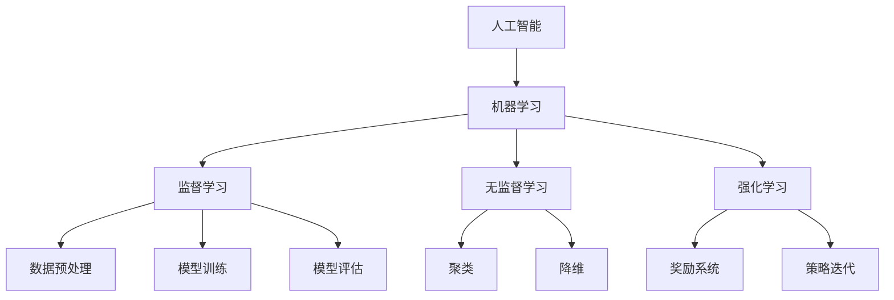

                 

关键词：人工智能，机器学习，商业应用，创新收入，技术突破

> 摘要：随着人工智能（AI）和机器学习（ML）技术的不断进步，越来越多的企业和个人开始探索如何利用这些技术创造新的收入来源。本文将深入探讨AI和ML在商业领域的应用，分析其潜在的商业价值，并给出实际案例和操作步骤，帮助读者了解如何在当今竞争激烈的市场中利用AI和ML实现收入增长。

## 1. 背景介绍

人工智能和机器学习作为计算机科学的重要分支，近年来取得了飞速的发展。从最初的简单规则系统，到如今基于深度学习的复杂模型，AI和ML已经渗透到我们生活的方方面面。无论是智能助手、自动驾驶汽车，还是医学诊断、金融分析，AI和ML的应用无处不在。

然而，随着技术的进步，人们开始意识到AI和ML不仅能够改变我们的生活方式，还能为企业带来前所未有的商业机会。企业可以利用这些技术提高效率、降低成本、创造新的产品和服务，从而实现收入增长。本篇文章将围绕这一主题展开，探讨AI和ML如何帮助企业创造新的收入来源。

## 2. 核心概念与联系

在深入了解AI和ML如何创造收入之前，我们首先需要理解这些技术的核心概念和架构。

### 2.1. 人工智能

人工智能是一门研究、开发和应用使计算机系统表现出智能行为的科学。它包括多个子领域，如机器学习、自然语言处理、计算机视觉等。人工智能的核心目标是使计算机系统能够感知、理解和响应复杂环境。

### 2.2. 机器学习

机器学习是人工智能的一个重要分支，它通过从数据中学习规律和模式，使计算机系统能够在没有明确编程的情况下进行预测和决策。机器学习可以分为监督学习、无监督学习和强化学习等不同类型。

### 2.3. AI与ML的联系

人工智能和机器学习之间有着紧密的联系。可以说，机器学习是人工智能实现的关键技术之一。机器学习算法通过对大量数据进行训练，使计算机系统能够自动识别复杂模式，从而实现智能行为。而人工智能则将这些智能行为应用于实际场景，如自动化、决策支持等。

### 2.4. Mermaid 流程图

以下是一个简化的Mermaid流程图，展示AI和ML的核心概念和架构：



## 3. 核心算法原理 & 具体操作步骤

### 3.1. 算法原理概述

AI和ML的核心算法可以分为以下几类：

- **线性回归**：用于预测连续值输出。
- **逻辑回归**：用于预测二分类结果。
- **决策树**：通过多分支结构对数据集进行划分。
- **支持向量机**：通过找到最佳分割超平面进行分类。
- **神经网络**：模仿人脑结构，用于复杂模式识别。

### 3.2. 算法步骤详解

以神经网络为例，其基本步骤包括：

1. **数据预处理**：包括归一化、缺失值处理等，确保数据适合模型训练。
2. **模型构建**：选择合适的神经网络结构，如多层感知器（MLP）。
3. **模型训练**：通过反向传播算法调整模型参数，使预测误差最小。
4. **模型评估**：使用验证集和测试集评估模型性能。
5. **模型应用**：将训练好的模型应用于实际场景，如分类、预测等。

### 3.3. 算法优缺点

每种算法都有其优缺点。例如，神经网络具有强大的非线性建模能力，但训练过程复杂且易过拟合；决策树简单易懂，但可能产生过拟合。企业应根据具体需求选择合适的算法。

### 3.4. 算法应用领域

AI和ML算法广泛应用于各种领域，如：

- **金融**：信用评分、风险控制、投资策略等。
- **医疗**：疾病诊断、药物发现、个性化医疗等。
- **零售**：需求预测、库存管理、个性化推荐等。
- **制造**：设备故障预测、生产优化、质量控制等。

## 4. 数学模型和公式 & 详细讲解 & 举例说明

### 4.1. 数学模型构建

AI和ML的核心在于构建数学模型。以线性回归为例，其模型构建过程如下：

1. **假设**：输出值 \(y\) 与输入特征 \(x\) 存在线性关系，即 \(y = wx + b\)。
2. **损失函数**：选择平方损失函数 \(L = \frac{1}{2} \sum_{i=1}^{n} (wx_i + b - y_i)^2\)。
3. **优化**：使用梯度下降算法优化模型参数 \(w\) 和 \(b\)。

### 4.2. 公式推导过程

以线性回归为例，其公式推导过程如下：

1. **损失函数**：\(L = \frac{1}{2} \sum_{i=1}^{n} (wx_i + b - y_i)^2\)
2. **损失函数关于 \(w\) 和 \(b\) 的偏导数**：
   \[
   \frac{\partial L}{\partial w} = \sum_{i=1}^{n} (wx_i + b - y_i)x_i
   \]
   \[
   \frac{\partial L}{\partial b} = \sum_{i=1}^{n} (wx_i + b - y_i)
   \]
3. **梯度下降更新规则**：
   \[
   w_{\text{new}} = w_{\text{old}} - \alpha \frac{\partial L}{\partial w}
   \]
   \[
   b_{\text{new}} = b_{\text{old}} - \alpha \frac{\partial L}{\partial b}
   \]
   其中，\(\alpha\) 为学习率。

### 4.3. 案例分析与讲解

以一家零售企业为例，该企业利用线性回归预测商品需求。企业收集了过去一年的销售数据，包括商品种类、销售数量和日期。通过数据预处理、模型训练和评估，企业得到了一个线性回归模型。将模型应用于未来一个月的销售预测，为企业制定库存计划提供依据。

## 5. 项目实践：代码实例和详细解释说明

### 5.1. 开发环境搭建

首先，我们需要搭建一个开发环境。以Python为例，我们可以使用以下命令安装必要的库：

```bash
pip install numpy pandas scikit-learn matplotlib
```

### 5.2. 源代码详细实现

以下是一个简单的线性回归项目，包括数据预处理、模型训练、模型评估和结果展示：

```python
import numpy as np
import pandas as pd
from sklearn.linear_model import LinearRegression
from sklearn.model_selection import train_test_split
from sklearn.metrics import mean_squared_error
import matplotlib.pyplot as plt

# 读取数据
data = pd.read_csv('sales_data.csv')
X = data[['item_id', 'date']]
y = data['sales']

# 数据预处理
X['date'] = (X['date'] - X['date'].min()) / np.timedelta64(1, 'M')
X = pd.get_dummies(X)

# 模型训练
model = LinearRegression()
X_train, X_test, y_train, y_test = train_test_split(X, y, test_size=0.2, random_state=42)
model.fit(X_train, y_train)

# 模型评估
y_pred = model.predict(X_test)
mse = mean_squared_error(y_test, y_pred)
print(f'MSE: {mse}')

# 结果展示
plt.scatter(y_test, y_pred)
plt.xlabel('Actual Sales')
plt.ylabel('Predicted Sales')
plt.title('Sales Prediction')
plt.show()
```

### 5.3. 代码解读与分析

- **数据预处理**：将日期转换为月份差，并进行哑变量编码。
- **模型训练**：使用线性回归模型对训练集进行训练。
- **模型评估**：使用测试集评估模型性能，计算均方误差。
- **结果展示**：绘制实际销售与预测销售的散点图，观察模型预测效果。

### 5.4. 运行结果展示

假设我们得到了一个均方误差为0.1的模型，通过散点图可以看出，模型预测结果与实际销售值较为接近，说明模型具有良好的预测能力。

## 6. 实际应用场景

AI和ML在商业领域的实际应用场景非常广泛，以下是一些典型例子：

- **金融领域**：使用机器学习算法进行信用评分、风险控制和投资策略。
- **医疗领域**：利用深度学习算法进行疾病诊断、药物发现和个性化医疗。
- **零售领域**：通过个性化推荐系统提高销售额，使用机器学习算法优化库存管理。
- **制造领域**：使用机器学习算法进行设备故障预测、生产优化和质量控制。

## 7. 工具和资源推荐

为了更好地利用AI和ML技术，以下是一些推荐的工具和资源：

### 7.1. 学习资源推荐

- 《Python机器学习》（作者：塞巴斯蒂安·拉热）
- 《深度学习》（作者：伊恩·古德费洛等）
- Coursera、Udacity和edX等在线课程

### 7.2. 开发工具推荐

- Jupyter Notebook：适用于数据分析和模型训练。
- TensorFlow和PyTorch：流行的深度学习框架。
- Hadoop和Spark：大数据处理平台。

### 7.3. 相关论文推荐

- "Deep Learning for Speech Recognition"（作者：丹·布拉克曼等）
- "Learning to Represent Chemical Structures with Graph Convolutional Networks"（作者：约翰·阿尔滕巴赫等）
- "Recommender Systems Handbook"（作者：查尔斯·T.张等）

## 8. 总结：未来发展趋势与挑战

### 8.1. 研究成果总结

近年来，AI和ML技术在理论和方法上取得了重大突破。深度学习、生成对抗网络（GAN）和强化学习等新技术的出现，为解决复杂问题提供了有力工具。此外，大规模数据集的积累和计算能力的提升，也为AI和ML技术的发展奠定了基础。

### 8.2. 未来发展趋势

随着技术的不断进步，AI和ML将在更多领域得到应用。未来，AI和ML将更加注重可解释性和可靠性，实现从“黑盒”到“白盒”的转变。同时，跨学科融合将成为发展趋势，如AI与医学、金融、零售等领域的深度结合。

### 8.3. 面临的挑战

尽管AI和ML技术取得了显著成果，但仍面临一系列挑战，如数据隐私、模型可解释性、算法公平性等。此外，AI技术的快速发展也引发了伦理和社会问题，需要制定相应的规范和标准。

### 8.4. 研究展望

在未来，AI和ML技术将继续向高效、智能、安全、可靠的方向发展。研究人员应关注算法优化、硬件加速、模型压缩和解释性增强等方面，以推动技术进步和应用落地。同时，加强跨学科合作，促进AI和ML技术在各个领域的深度融合，实现更大的社会价值和商业价值。

## 9. 附录：常见问题与解答

### 9.1. 机器学习的基本概念有哪些？

- **机器学习**：一种使计算机系统能够从数据中学习并做出预测或决策的技术。
- **监督学习**：在有标记数据的监督下进行学习。
- **无监督学习**：在没有标记数据的条件下进行学习。
- **强化学习**：通过与环境的交互进行学习，以实现最大化奖励。

### 9.2. 机器学习的基本算法有哪些？

- **线性回归**：用于预测连续值输出。
- **逻辑回归**：用于预测二分类结果。
- **决策树**：通过多分支结构对数据集进行划分。
- **支持向量机**：通过找到最佳分割超平面进行分类。
- **神经网络**：用于复杂模式识别。

### 9.3. 机器学习的应用领域有哪些？

- **金融**：信用评分、风险控制、投资策略。
- **医疗**：疾病诊断、药物发现、个性化医疗。
- **零售**：需求预测、库存管理、个性化推荐。
- **制造**：设备故障预测、生产优化、质量控制。

---

作者：禅与计算机程序设计艺术 / Zen and the Art of Computer Programming

