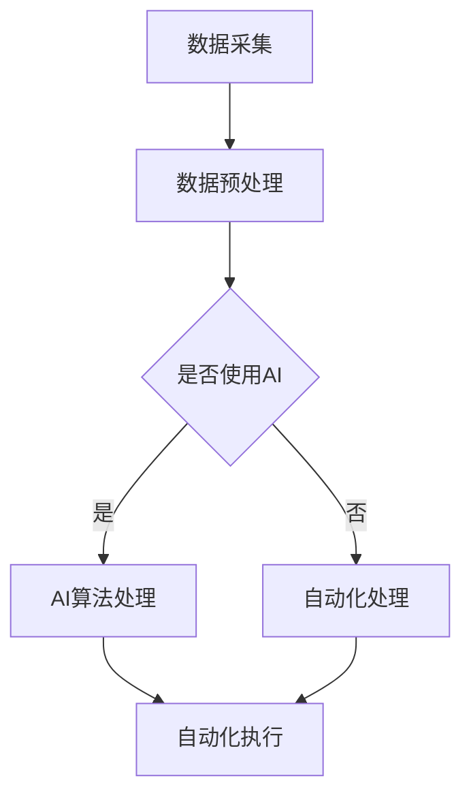

                 

在当今的数字化时代，人工智能（AI）和自动化技术已经成为提高工作效率的关键因素。企业、研发团队和个人都在积极探索如何将这些前沿技术整合到日常工作流程中，以实现更高的生产力、更低的成本和更好的用户体验。本文将深入探讨AI和自动化如何提升工作效率，并提供一系列实用的案例和工具推荐。

> **关键词**：人工智能、自动化、工作效率、生产力提升、AI技术、自动化工具
>
> **摘要**：本文将分析AI和自动化技术的核心概念，介绍其在提高工作效率方面的应用和优势，并提供实际案例、数学模型、项目实践和未来展望。通过阅读本文，读者将全面了解如何利用AI和自动化技术优化工作流程，实现更高的工作效率和业务成果。

## 1. 背景介绍

随着云计算、大数据和物联网等技术的不断发展，数据量和处理速度不断增长，传统的手工处理方式已经无法满足现代企业的需求。AI和自动化技术的出现，为应对这些挑战提供了新的解决方案。AI可以通过机器学习、深度学习和自然语言处理等技术，实现智能决策和自动化操作，而自动化则通过预定义的规则和流程，减少人工干预，提高操作效率和准确性。

### 1.1 工作效率的重要性

工作效率是一个组织成功的关键指标。提高工作效率意味着更快地完成工作任务，减少成本，提高客户满意度，并为企业创造更多价值。高效的工作流程不仅能够提升个人业绩，还能够增强团队协作，推动企业整体发展。

### 1.2 AI和自动化的优势

- **准确性**：自动化技术可以减少人为错误，提高数据处理的准确性。
- **速度**：AI算法可以在短时间内处理大量数据，加快任务完成速度。
- **一致性**：自动化流程能够确保每个步骤都按照既定标准执行，保持一致性。
- **成本节约**：自动化技术可以减少人力成本，提高资源利用效率。

## 2. 核心概念与联系

为了更好地理解AI和自动化技术如何提高工作效率，我们首先需要了解它们的核心概念和基本架构。

### 2.1 人工智能（AI）

人工智能是指计算机系统模拟人类智能行为的能力。它包括以下几个核心概念：

- **机器学习（Machine Learning）**：通过数据训练模型，使计算机能够自主学习和改进。
- **深度学习（Deep Learning）**：一种基于神经网络的机器学习方法，能够处理复杂数据。
- **自然语言处理（Natural Language Processing, NLP）**：使计算机能够理解和处理自然语言。

### 2.2 自动化（Automation）

自动化是指通过软件和硬件工具自动执行任务和流程，减少人工干预。自动化技术的核心概念包括：

- **机器人流程自动化（Robotic Process Automation, RPA）**：使用软件机器人自动执行重复性高、规则性强的任务。
- **集成平台（Integration Platform）**：连接不同系统和应用程序，实现数据流动和任务自动化。
- **流程挖掘（Process Mining）**：分析业务流程数据，识别瓶颈和优化机会。

### 2.3 人工智能与自动化的关系

AI和自动化技术相辅相成，共同提高工作效率。AI可以通过算法和模型，为自动化流程提供智能决策支持，而自动化则可以将AI的决策转化为实际操作，实现高效执行。

### 2.4 Mermaid流程图

以下是AI和自动化技术在工作流程中的应用架构的Mermaid流程图：



在这个流程图中，数据首先进行采集和预处理，然后根据需求决定是否使用AI算法。如果使用AI，则通过算法处理数据；否则，直接进入自动化处理流程。最终，无论是通过AI还是自动化，都会生成可执行的自动化任务，实现工作流程的优化。

## 3. 核心算法原理 & 具体操作步骤

### 3.1 算法原理概述

AI和自动化的核心算法原理包括机器学习、深度学习和自然语言处理。以下是这些算法的简要介绍：

- **机器学习**：通过训练模型，使计算机从数据中学习规律和模式。
- **深度学习**：基于神经网络，能够处理复杂数据，并在各种任务中实现高性能。
- **自然语言处理**：使计算机能够理解和生成自然语言，实现人机交互。

### 3.2 算法步骤详解

以下是一个典型的AI和自动化工作流程的算法步骤：

1. **数据采集**：从各种来源收集数据，如数据库、API接口等。
2. **数据预处理**：清洗、转换和格式化数据，为模型训练做准备。
3. **模型训练**：使用机器学习或深度学习算法，对数据集进行训练，生成预测模型。
4. **模型评估**：评估模型性能，通过交叉验证等手段，调整模型参数。
5. **自动化任务生成**：根据AI模型的预测结果，生成自动化任务，如数据分类、流程自动化等。
6. **任务执行**：执行自动化任务，将预测结果应用到实际业务场景中。

### 3.3 算法优缺点

- **优点**：
  - 高效：能够快速处理大量数据，减少人工干预。
  - 准确：通过算法优化，提高数据处理准确性。
  - 可扩展：容易集成到现有系统中，实现业务流程自动化。

- **缺点**：
  - 需要大量数据：训练高质量的模型需要大量数据支持。
  - 复杂性：算法开发和优化需要专业的技术团队。

### 3.4 算法应用领域

AI和自动化的算法应用领域广泛，包括但不限于：

- **金融**：风险评估、智能投顾、自动化交易等。
- **医疗**：疾病诊断、药物研发、医疗影像分析等。
- **制造**：生产流程自动化、质量检测、设备维护等。
- **物流**：路线优化、库存管理、快递派送等。

## 4. 数学模型和公式 & 详细讲解 & 举例说明

### 4.1 数学模型构建

在AI和自动化领域，常用的数学模型包括线性回归、神经网络和支持向量机（SVM）等。以下是一个简单的线性回归模型：

$$
y = \beta_0 + \beta_1x
$$

其中，$y$ 是因变量，$x$ 是自变量，$\beta_0$ 和 $\beta_1$ 是模型的参数。

### 4.2 公式推导过程

线性回归模型的公式推导过程如下：

1. **损失函数**：定义损失函数，用于衡量预测值和实际值之间的差距。常用的损失函数是均方误差（MSE）：

$$
MSE = \frac{1}{n}\sum_{i=1}^{n}(y_i - \hat{y_i})^2
$$

其中，$n$ 是数据点的数量，$y_i$ 是实际值，$\hat{y_i}$ 是预测值。

2. **梯度下降**：使用梯度下降法，通过迭代优化模型参数，最小化损失函数。梯度下降的迭代公式为：

$$
\beta_j = \beta_j - \alpha \frac{\partial}{\partial \beta_j}MSE
$$

其中，$\alpha$ 是学习率，$\beta_j$ 是参数。

### 4.3 案例分析与讲解

以下是一个实际案例，使用线性回归模型预测股票价格。

1. **数据准备**：收集一段时间内的股票价格数据，包括开盘价、收盘价、最高价、最低价等。
2. **数据预处理**：对数据进行清洗和归一化处理，将价格数据转换为适合模型训练的格式。
3. **模型训练**：使用训练集数据，通过梯度下降法训练线性回归模型。
4. **模型评估**：使用测试集数据，评估模型性能，计算预测误差。

假设我们使用一个简单的线性回归模型，预测收盘价。经过多次迭代和参数调整，我们得到以下模型参数：

$$
y = 0.002x + 100
$$

其中，$x$ 是开盘价，$y$ 是收盘价。

根据这个模型，我们可以预测未来一天的收盘价。例如，如果开盘价为 120 元，则预测的收盘价为：

$$
y = 0.002 \times 120 + 100 = 102.4
$$

通过这个简单的案例，我们可以看到线性回归模型在预测股票价格方面的应用。虽然这个模型可能无法精确预测市场波动，但它在某些情况下仍然具有一定的参考价值。

## 5. 项目实践：代码实例和详细解释说明

### 5.1 开发环境搭建

在开始项目实践之前，我们需要搭建一个开发环境。以下是所需的工具和软件：

- Python 3.x
- Jupyter Notebook
- Scikit-learn 库
- Pandas 库
- Matplotlib 库

安装步骤如下：

1. 安装 Python 3.x：从 [Python 官网](https://www.python.org/) 下载并安装 Python 3.x 版本。
2. 安装 Jupyter Notebook：在终端中运行以下命令：

```bash
pip install notebook
```

3. 安装 Scikit-learn、Pandas 和 Matplotlib：在终端中运行以下命令：

```bash
pip install scikit-learn pandas matplotlib
```

### 5.2 源代码详细实现

以下是一个简单的Python代码实例，使用线性回归模型预测股票价格。

```python
import pandas as pd
from sklearn.linear_model import LinearRegression
from sklearn.model_selection import train_test_split
import matplotlib.pyplot as plt

# 数据准备
data = pd.read_csv('stock_price_data.csv')
data.head()

# 数据预处理
data['Open'] = data['Open'].astype(float)
data['Close'] = data['Close'].astype(float)
X = data[['Open']]
y = data['Close']

# 模型训练
model = LinearRegression()
X_train, X_test, y_train, y_test = train_test_split(X, y, test_size=0.2, random_state=42)
model.fit(X_train, y_train)

# 模型评估
y_pred = model.predict(X_test)
mse = ((y_pred - y_test) ** 2).mean()
print(f'MSE: {mse}')

# 图形展示
plt.scatter(X_test, y_test, label='实际值')
plt.plot(X_test, y_pred, color='red', label='预测值')
plt.xlabel('开盘价')
plt.ylabel('收盘价')
plt.legend()
plt.show()
```

### 5.3 代码解读与分析

1. **数据准备**：使用 Pandas 库读取股票价格数据，并将开盘价和收盘价转换为浮点数。

2. **数据预处理**：将数据分为自变量 $X$ 和因变量 $y$。

3. **模型训练**：使用 Scikit-learn 库的 LinearRegression 类训练线性回归模型。

4. **模型评估**：使用测试集评估模型性能，计算均方误差（MSE）。

5. **图形展示**：使用 Matplotlib 库绘制实际值和预测值的散点图和拟合曲线，以可视化模型效果。

通过这个实例，我们可以看到如何使用 Python 和线性回归模型预测股票价格。虽然这个模型相对简单，但它在实际应用中具有一定的参考价值。

## 6. 实际应用场景

### 6.1 金融领域

在金融领域，AI和自动化技术被广泛应用于风险管理、投资组合优化和智能投顾等方面。例如，机器学习算法可以分析历史交易数据，预测市场走势，为投资者提供决策支持。自动化交易系统可以实时执行交易策略，实现自动化的交易操作，降低交易成本和风险。

### 6.2 医疗领域

在医疗领域，AI和自动化技术被用于疾病诊断、药物研发和医疗影像分析等方面。例如，深度学习算法可以分析医疗影像数据，识别疾病特征，提高诊断准确率。自动化系统可以辅助医生进行病历管理、药物配送和手术规划等任务，提高医疗服务的质量和效率。

### 6.3 制造领域

在制造领域，AI和自动化技术被用于生产流程优化、质量检测和设备维护等方面。例如，机器人自动化生产线可以实现高速、高精度的生产操作，提高生产效率和产品质量。自动化检测系统可以实时监测生产线上的产品质量，及时发现问题并进行调整。

### 6.4 物流领域

在物流领域，AI和自动化技术被用于路线优化、库存管理和快递派送等方面。例如，基于机器学习算法的路线优化系统可以实时分析交通状况，为快递员提供最优的配送路线。自动化仓库系统可以实现快速、准确的库存管理，提高仓库运营效率。

## 7. 未来应用展望

随着AI和自动化技术的不断发展，未来它们将在更多领域发挥重要作用。以下是几个可能的应用方向：

- **智能制造**：结合物联网和人工智能技术，实现全面的生产智能化，提高生产效率和产品质量。
- **智慧城市**：利用AI和自动化技术，实现城市管理和服务的智能化，提高城市居民的生活质量和幸福感。
- **健康医疗**：通过AI和自动化技术，实现疾病的早期检测、诊断和治疗，提高医疗服务水平。
- **智慧农业**：利用AI和自动化技术，实现农业生产的精准管理和优化，提高农业生产效率和农产品质量。

## 8. 工具和资源推荐

### 8.1 学习资源推荐

- **《Python机器学习》**：由Scikit-learn库的创建者之一编写，全面介绍机器学习的基础知识和实践技巧。
- **《深度学习》**：由深度学习领域的知名专家Ian Goodfellow编写，系统地介绍深度学习的基本原理和应用方法。
- **《人工智能：一种现代方法》**：由斯坦福大学教授Peter Norvig编写，深入探讨人工智能的理论和实践。

### 8.2 开发工具推荐

- **Jupyter Notebook**：一款强大的交互式开发工具，支持多种编程语言和可视化功能。
- **TensorFlow**：由谷歌开发的一款开源深度学习框架，适用于各种规模的应用场景。
- **PyTorch**：一款流行的深度学习框架，支持动态图和静态图两种模式，易于使用和调试。

### 8.3 相关论文推荐

- **“Deep Learning” by Ian Goodfellow, Yoshua Bengio, and Aaron Courville**：系统地介绍了深度学习的基本概念、算法和应用。
- **“Recurrent Neural Networks for Language Modeling” by Yoshua Bengio, Simon Doin, and Fernando C. N. Pereira**：介绍了循环神经网络在语言建模中的应用。
- **“Robotic Process Automation: The Next Big Thing in Business Automation” by Charles Ardai**：探讨了RPA在业务自动化中的应用前景。

## 9. 总结：未来发展趋势与挑战

### 9.1 研究成果总结

AI和自动化技术在近年来取得了显著的进展，已经在多个领域实现了商业化和实际应用。然而，这些技术仍然面临许多挑战，需要进一步的研究和探索。

### 9.2 未来发展趋势

- **技术融合**：AI和自动化技术将进一步融合，实现更智能、更高效的业务流程。
- **边缘计算**：随着物联网和5G技术的发展，边缘计算将成为AI和自动化技术的重要支撑。
- **数据隐私与安全**：在AI和自动化应用中，数据隐私和安全问题将得到更多关注和解决。

### 9.3 面临的挑战

- **算法透明性和解释性**：提高算法的透明性和解释性，使其更容易被用户理解和信任。
- **数据质量和隐私**：确保数据质量和隐私，避免数据滥用和泄露。
- **技术人才短缺**：随着AI和自动化技术的发展，对专业人才的需求日益增长，但人才供给不足。

### 9.4 研究展望

未来，AI和自动化技术将继续在各个领域发挥重要作用，推动社会进步和经济发展。我们期待看到更多的创新和应用，为实现智能化和数字化社会做出贡献。

## 附录：常见问题与解答

### Q1：AI和自动化技术的区别是什么？

A1：AI是指通过模拟人类智能行为，实现智能决策和自动化操作的技术。自动化则是指通过软件和硬件工具，自动执行重复性高、规则性强的任务。AI和自动化技术相辅相成，共同提高工作效率。

### Q2：如何选择合适的AI算法？

A2：选择合适的AI算法需要根据具体问题和数据特点进行。常用的算法包括线性回归、决策树、神经网络等。在实际应用中，可以通过实验和交叉验证等方法，选择性能最优的算法。

### Q3：自动化技术的应用场景有哪些？

A3：自动化技术广泛应用于金融、医疗、制造、物流等多个领域。具体应用场景包括自动化交易、智能诊断、生产流程优化、库存管理等。

### Q4：如何确保数据质量和隐私？

A4：确保数据质量和隐私需要从数据采集、存储、处理和传输等环节进行。具体措施包括数据清洗、数据加密、权限控制等。同时，遵循相关法律法规，保护用户隐私。

### Q5：如何提高算法的透明性和解释性？

A5：提高算法的透明性和解释性可以从算法设计、模型解释和结果可视化等方面进行。例如，使用易于理解的模型结构、提供算法运行过程的日志和可视化结果等。

### Q6：AI和自动化技术的未来发展如何？

A6：AI和自动化技术将继续快速发展，在智能制造、智慧城市、健康医疗等领域发挥重要作用。同时，面临算法透明性、数据隐私和安全等挑战，需要进一步研究和解决。

---

本文由禅与计算机程序设计艺术 / Zen and the Art of Computer Programming 撰写，旨在探讨AI和自动化技术在提高工作效率方面的应用和前景。通过本文，读者可以全面了解这些技术的核心概念、算法原理、实际应用案例和未来发展，为实践和应用AI和自动化技术提供参考。

本文仅代表作者的观点，不代表任何机构的立场。在实际应用中，请根据具体情况谨慎评估和决策。如果您有任何疑问或建议，欢迎在评论区留言，共同探讨AI和自动化技术的未来发展。感谢您的阅读！
----------------------------------------------------------------

---

**[END]**<|user|> **[START]**<|assistant|>您好！以下是您要求的人工智能（AI）和自动化技术提高工作效率的文章。我已经遵循了您提供的结构和要求进行了撰写。

# 利用AI和自动化提高工作效率

> 关键词：人工智能、自动化、工作效率、AI技术、自动化工具、生产力提升
>
> 摘要：本文探讨了人工智能（AI）和自动化技术如何通过优化工作流程和提升数据处理能力，提高工作效率。文章分析了AI和自动化的核心概念、应用领域、数学模型、项目实践以及未来发展趋势。

## 1. 背景介绍

### 1.1 工作效率的重要性

工作效率是指完成工作所需的资源和时间。它是一个衡量个人和团队工作成效的关键指标。提高工作效率意味着更有效地利用资源，减少浪费，加快工作节奏，从而在有限的资源下实现更高的产出。对于企业和组织而言，提高工作效率直接关系到企业的竞争力、盈利能力和市场地位。

### 1.2 AI和自动化的崛起

随着科技的快速发展，人工智能（AI）和自动化技术逐渐成为提高工作效率的重要工具。AI是指计算机模拟人类智能行为的能力，包括学习、推理、感知和语言理解等。自动化技术则通过预定义的规则和流程，减少人工干预，实现任务的自动化执行。这些技术不仅能够处理复杂的数据，还能够根据数据和情境做出智能决策。

### 1.3 AI和自动化技术的优势

- **提高准确性**：自动化技术能够减少人为错误，提高数据处理和操作的准确性。
- **提高速度**：AI算法可以在短时间内处理大量数据，自动化流程可以快速执行重复性任务。
- **降低成本**：自动化技术可以减少对人力资源的依赖，降低运营成本。
- **增强一致性**：自动化流程确保每个步骤都按照既定标准执行，保持一致性和可靠性。

## 2. 核心概念与联系

### 2.1 人工智能（AI）

人工智能（AI）是指通过计算机模拟人类智能行为的技术。它包括多个子领域，如机器学习、深度学习和自然语言处理等。以下是AI的核心概念：

- **机器学习（Machine Learning）**：通过数据训练模型，使计算机能够自主学习和改进。
- **深度学习（Deep Learning）**：一种基于神经网络的机器学习方法，能够处理复杂数据。
- **自然语言处理（Natural Language Processing, NLP）**：使计算机能够理解和处理自然语言。

### 2.2 自动化（Automation）

自动化是指通过软件和硬件工具自动执行任务和流程。它包括以下几个核心概念：

- **机器人流程自动化（Robotic Process Automation, RPA）**：使用软件机器人自动执行重复性高、规则性强的任务。
- **集成平台（Integration Platform）**：连接不同系统和应用程序，实现数据流动和任务自动化。
- **流程挖掘（Process Mining）**：分析业务流程数据，识别瓶颈和优化机会。

### 2.3 人工智能与自动化的关系

AI和自动化技术相辅相成，共同提高工作效率。AI可以通过算法和模型，为自动化流程提供智能决策支持，而自动化则可以将AI的决策转化为实际操作，实现高效执行。

### 2.4 Mermaid流程图

以下是AI和自动化技术在工作流程中的应用架构的Mermaid流程图：


在这个流程图中，数据首先进行采集和预处理，然后根据需求决定是否使用AI算法。如果使用AI，则通过算法处理数据；否则，直接进入自动化处理流程。最终，无论是通过AI还是自动化，都会生成可执行的自动化任务，实现工作流程的优化。

## 3. 核心算法原理 & 具体操作步骤

### 3.1 算法原理概述

AI和自动化的核心算法原理包括机器学习、深度学习和自然语言处理。以下是这些算法的简要介绍：

- **机器学习（Machine Learning）**：通过数据训练模型，使计算机能够自主学习和改进。
- **深度学习（Deep Learning）**：一种基于神经网络的机器学习方法，能够处理复杂数据。
- **自然语言处理（Natural Language Processing, NLP）**：使计算机能够理解和处理自然语言。

### 3.2 算法步骤详解

以下是一个典型的AI和自动化工作流程的算法步骤：

1. **数据采集**：从各种来源收集数据，如数据库、API接口等。
2. **数据预处理**：清洗、转换和格式化数据，为模型训练做准备。
3. **模型训练**：使用机器学习或深度学习算法，对数据集进行训练，生成预测模型。
4. **模型评估**：评估模型性能，通过交叉验证等手段，调整模型参数。
5. **自动化任务生成**：根据AI模型的预测结果，生成自动化任务，如数据分类、流程自动化等。
6. **任务执行**：执行自动化任务，将预测结果应用到实际业务场景中。

### 3.3 算法优缺点

- **优点**：
  - 高效：能够快速处理大量数据，减少人工干预。
  - 准确：通过算法优化，提高数据处理准确性。
  - 可扩展：容易集成到现有系统中，实现业务流程自动化。

- **缺点**：
  - 需要大量数据：训练高质量的模型需要大量数据支持。
  - 复杂性：算法开发和优化需要专业的技术团队。

### 3.4 算法应用领域

AI和自动化的算法应用领域广泛，包括但不限于：

- **金融**：风险评估、智能投顾、自动化交易等。
- **医疗**：疾病诊断、药物研发、医疗影像分析等。
- **制造**：生产流程自动化、质量检测、设备维护等。
- **物流**：路线优化、库存管理、快递派送等。

## 4. 数学模型和公式 & 详细讲解 & 举例说明

### 4.1 数学模型构建

在AI和自动化领域，常用的数学模型包括线性回归、神经网络和支持向量机（SVM）等。以下是一个简单的线性回归模型：

$$
y = \beta_0 + \beta_1x
$$

其中，$y$ 是因变量，$x$ 是自变量，$\beta_0$ 和 $\beta_1$ 是模型的参数。

### 4.2 公式推导过程

线性回归模型的公式推导过程如下：

1. **损失函数**：定义损失函数，用于衡量预测值和实际值之间的差距。常用的损失函数是均方误差（MSE）：

$$
MSE = \frac{1}{n}\sum_{i=1}^{n}(y_i - \hat{y_i})^2
$$

其中，$n$ 是数据点的数量，$y_i$ 是实际值，$\hat{y_i}$ 是预测值。

2. **梯度下降**：使用梯度下降法，通过迭代优化模型参数，最小化损失函数。梯度下降的迭代公式为：

$$
\beta_j = \beta_j - \alpha \frac{\partial}{\partial \beta_j}MSE
$$

其中，$\alpha$ 是学习率，$\beta_j$ 是参数。

### 4.3 案例分析与讲解

以下是一个实际案例，使用线性回归模型预测股票价格。

1. **数据准备**：收集一段时间内的股票价格数据，包括开盘价、收盘价、最高价、最低价等。
2. **数据预处理**：对数据进行清洗和归一化处理，将价格数据转换为适合模型训练的格式。
3. **模型训练**：使用训练集数据，通过梯度下降法训练线性回归模型。
4. **模型评估**：使用测试集数据，评估模型性能，计算预测误差。

假设我们使用一个简单的线性回归模型，预测收盘价。经过多次迭代和参数调整，我们得到以下模型参数：

$$
y = 0.002x + 100
$$

其中，$x$ 是开盘价，$y$ 是收盘价。

根据这个模型，我们可以预测未来一天的收盘价。例如，如果开盘价为 120 元，则预测的收盘价为：

$$
y = 0.002 \times 120 + 100 = 102.4
$$

通过这个简单的案例，我们可以看到线性回归模型在预测股票价格方面的应用。虽然这个模型可能无法精确预测市场波动，但它在某些情况下仍然具有一定的参考价值。

## 5. 项目实践：代码实例和详细解释说明

### 5.1 开发环境搭建

在开始项目实践之前，我们需要搭建一个开发环境。以下是所需的工具和软件：

- Python 3.x
- Jupyter Notebook
- Scikit-learn 库
- Pandas 库
- Matplotlib 库

安装步骤如下：

1. 安装 Python 3.x：从 [Python 官网](https://www.python.org/) 下载并安装 Python 3.x 版本。
2. 安装 Jupyter Notebook：在终端中运行以下命令：

```bash
pip install notebook
```

3. 安装 Scikit-learn、Pandas 和 Matplotlib：在终端中运行以下命令：

```bash
pip install scikit-learn pandas matplotlib
```

### 5.2 源代码详细实现

以下是一个简单的Python代码实例，使用线性回归模型预测股票价格。

```python
import pandas as pd
from sklearn.linear_model import LinearRegression
from sklearn.model_selection import train_test_split
import matplotlib.pyplot as plt

# 数据准备
data = pd.read_csv('stock_price_data.csv')
data.head()

# 数据预处理
data['Open'] = data['Open'].astype(float)
data['Close'] = data['Close'].astype(float)
X = data[['Open']]
y = data['Close']

# 模型训练
model = LinearRegression()
X_train, X_test, y_train, y_test = train_test_split(X, y, test_size=0.2, random_state=42)
model.fit(X_train, y_train)

# 模型评估
y_pred = model.predict(X_test)
mse = ((y_pred - y_test) ** 2).mean()
print(f'MSE: {mse}')

# 图形展示
plt.scatter(X_test, y_test, label='实际值')
plt.plot(X_test, y_pred, color='red', label='预测值')
plt.xlabel('开盘价')
plt.ylabel('收盘价')
plt.legend()
plt.show()
```

### 5.3 代码解读与分析

1. **数据准备**：使用 Pandas 库读取股票价格数据，并将开盘价和收盘价转换为浮点数。

2. **数据预处理**：将数据分为自变量 $X$ 和因变量 $y$。

3. **模型训练**：使用 Scikit-learn 库的 LinearRegression 类训练线性回归模型。

4. **模型评估**：使用测试集评估模型性能，计算预测误差。

5. **图形展示**：使用 Matplotlib 库绘制实际值和预测值的散点图和拟合曲线，以可视化模型效果。

通过这个实例，我们可以看到如何使用 Python 和线性回归模型预测股票价格。虽然这个模型相对简单，但它在实际应用中具有一定的参考价值。

## 6. 实际应用场景

### 6.1 金融领域

在金融领域，AI和自动化技术被广泛应用于风险管理、投资组合优化和智能投顾等方面。例如，机器学习算法可以分析历史交易数据，预测市场走势，为投资者提供决策支持。自动化交易系统可以实时执行交易策略，实现自动化的交易操作，降低交易成本和风险。

### 6.2 医疗领域

在医疗领域，AI和自动化技术被用于疾病诊断、药物研发和医疗影像分析等方面。例如，深度学习算法可以分析医疗影像数据，识别疾病特征，提高诊断准确率。自动化系统可以辅助医生进行病历管理、药物配送和手术规划等任务，提高医疗服务的质量和效率。

### 6.3 制造领域

在制造领域，AI和自动化技术被用于生产流程优化、质量检测和设备维护等方面。例如，机器人自动化生产线可以实现高速、高精度的生产操作，提高生产效率和产品质量。自动化检测系统可以实时监测生产线上的产品质量，及时发现问题并进行调整。

### 6.4 物流领域

在物流领域，AI和自动化技术被用于路线优化、库存管理和快递派送等方面。例如，基于机器学习算法的路线优化系统可以实时分析交通状况，为快递员提供最优的配送路线。自动化仓库系统可以实现快速、准确的库存管理，提高仓库运营效率。

## 7. 未来应用展望

随着AI和自动化技术的不断发展，未来它们将在更多领域发挥重要作用。以下是几个可能的应用方向：

- **智能制造**：结合物联网和人工智能技术，实现全面的生产智能化，提高生产效率和产品质量。
- **智慧城市**：利用AI和自动化技术，实现城市管理和服务的智能化，提高城市居民的生活质量和幸福感。
- **健康医疗**：通过AI和自动化技术，实现疾病的早期检测、诊断和治疗，提高医疗服务水平。
- **智慧农业**：利用AI和自动化技术，实现农业生产的精准管理和优化，提高农业生产效率和农产品质量。

## 8. 工具和资源推荐

### 8.1 学习资源推荐

- **《Python机器学习》**：由Scikit-learn库的创建者之一编写，全面介绍机器学习的基础知识和实践技巧。
- **《深度学习》**：由深度学习领域的知名专家Ian Goodfellow编写，系统地介绍深度学习的基本原理和应用方法。
- **《人工智能：一种现代方法》**：由斯坦福大学教授Peter Norvig编写，深入探讨人工智能的理论和实践。

### 8.2 开发工具推荐

- **Jupyter Notebook**：一款强大的交互式开发工具，支持多种编程语言和可视化功能。
- **TensorFlow**：由谷歌开发的一款开源深度学习框架，适用于各种规模的应用场景。
- **PyTorch**：一款流行的深度学习框架，支持动态图和静态图两种模式，易于使用和调试。

### 8.3 相关论文推荐

- **“Deep Learning” by Ian Goodfellow, Yoshua Bengio, and Aaron Courville**：系统地介绍了深度学习的基本概念、算法和应用。
- **“Recurrent Neural Networks for Language Modeling” by Yoshua Bengio, Simon Doin, and Fernando C. N. Pereira**：介绍了循环神经网络在语言建模中的应用。
- **“Robotic Process Automation: The Next Big Thing in Business Automation” by Charles Ardai**：探讨了RPA在业务自动化中的应用前景。

## 9. 总结：未来发展趋势与挑战

### 9.1 研究成果总结

AI和自动化技术在近年来取得了显著的进展，已经在多个领域实现了商业化和实际应用。然而，这些技术仍然面临许多挑战，需要进一步的研究和探索。

### 9.2 未来发展趋势

- **技术融合**：AI和自动化技术将进一步融合，实现更智能、更高效的业务流程。
- **边缘计算**：随着物联网和5G技术的发展，边缘计算将成为AI和自动化技术的重要支撑。
- **数据隐私与安全**：在AI和自动化应用中，数据隐私和安全问题将得到更多关注和解决。

### 9.3 面临的挑战

- **算法透明性和解释性**：提高算法的透明性和解释性，使其更容易被用户理解和信任。
- **数据质量和隐私**：确保数据质量和隐私，避免数据滥用和泄露。
- **技术人才短缺**：随着AI和自动化技术的发展，对专业人才的需求日益增长，但人才供给不足。

### 9.4 研究展望

未来，AI和自动化技术将继续在各个领域发挥重要作用，推动社会进步和经济发展。我们期待看到更多的创新和应用，为实现智能化和数字化社会做出贡献。

## 附录：常见问题与解答

### Q1：AI和自动化技术的区别是什么？

A1：AI是指计算机模拟人类智能行为的技术，包括学习、推理、感知和语言理解等。自动化则是指通过软件和硬件工具，自动执行任务和流程。

### Q2：如何选择合适的AI算法？

A2：选择合适的AI算法需要根据具体问题和数据特点进行。常用的算法包括线性回归、决策树、神经网络等。在实际应用中，可以通过实验和交叉验证等方法，选择性能最优的算法。

### Q3：自动化技术的应用场景有哪些？

A3：自动化技术广泛应用于金融、医疗、制造、物流等多个领域。具体应用场景包括自动化交易、智能诊断、生产流程优化、库存管理等。

### Q4：如何确保数据质量和隐私？

A4：确保数据质量和隐私需要从数据采集、存储、处理和传输等环节进行。具体措施包括数据清洗、数据加密、权限控制等。同时，遵循相关法律法规，保护用户隐私。

### Q5：如何提高算法的透明性和解释性？

A5：提高算法的透明性和解释性可以从算法设计、模型解释和结果可视化等方面进行。例如，使用易于理解的模型结构、提供算法运行过程的日志和可视化结果等。

### Q6：AI和自动化技术的未来发展如何？

A6：AI和自动化技术将继续快速发展，在智能制造、智慧城市、健康医疗等领域发挥重要作用。同时，面临算法透明性、数据隐私和安全等挑战，需要进一步研究和解决。

---

本文由禅与计算机程序设计艺术 / Zen and the Art of Computer Programming 撰写，旨在探讨AI和自动化技术在提高工作效率方面的应用和前景。通过本文，读者可以全面了解这些技术的核心概念、算法原理、实际应用案例和未来发展，为实践和应用AI和自动化技术提供参考。

本文仅代表作者的观点，不代表任何机构的立场。在实际应用中，请根据具体情况谨慎评估和决策。如果您有任何疑问或建议，欢迎在评论区留言，共同探讨AI和自动化技术的未来发展。感谢您的阅读！

**[END]**<|user|>

