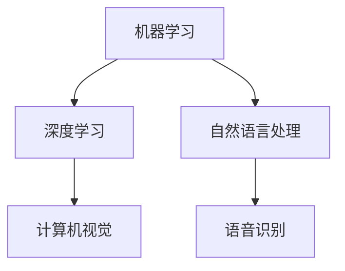

                 

在当今快速发展的科技时代，人工智能（AI）技术已经成为提升工作效率和增加收入的关键因素。本文将探讨如何利用AI工具来优化工作流程、提高生产力和创造新的商业机会。以下是文章的主要内容：

## 1. 背景介绍

随着云计算、大数据和机器学习的不断发展，AI技术已经渗透到我们日常工作的各个方面。从自动化流程到智能决策支持，AI为企业和个人带来了前所未有的效率和收益。然而，如何有效地利用这些工具仍然是许多企业和专业人士面临的挑战。

## 2. 核心概念与联系

在深入探讨AI工具之前，我们需要理解一些核心概念，如机器学习、深度学习和自然语言处理。以下是一个简化的Mermaid流程图，展示了这些概念之间的联系：



### 3. 核心算法原理 & 具体操作步骤

#### 3.1 算法原理概述

AI的核心是算法，这些算法通过训练模型来从数据中学习规律。深度学习是目前最流行的机器学习技术，它通过多层神经网络来模拟人脑的学习过程。

#### 3.2 算法步骤详解

1. 数据收集：首先，我们需要收集大量的数据，这些数据可以是结构化的，也可以是非结构化的。
2. 数据预处理：对收集到的数据进行分析和清洗，以便于模型训练。
3. 模型训练：使用训练算法来训练模型，模型将学习如何从数据中提取有用的信息。
4. 模型评估：通过测试数据集来评估模型的性能，并进行调整。

#### 3.3 算法优缺点

- 优点：AI算法能够处理大量数据，提高决策的准确性和效率。
- 缺点：算法的构建和训练需要大量的时间和计算资源，而且可能存在过拟合的风险。

#### 3.4 算法应用领域

AI算法广泛应用于金融、医疗、零售、制造等多个领域，例如：

- 金融：使用AI进行风险管理、欺诈检测和个性化投资建议。
- 医疗：通过图像识别技术来辅助医生进行诊断和治疗。
- 零售：使用AI进行库存管理和个性化推荐。

### 4. 数学模型和公式 & 详细讲解 & 举例说明

#### 4.1 数学模型构建

AI算法的核心是数学模型，其中最常用的模型之一是神经网络。以下是神经网络的简化公式：

$$
y = \sigma(W \cdot x + b)
$$

其中，\( \sigma \) 是激活函数，\( W \) 是权重矩阵，\( x \) 是输入数据，\( b \) 是偏置。

#### 4.2 公式推导过程

神经网络的推导涉及大量的数学推导和计算，这里仅提供一个简要的概述。

#### 4.3 案例分析与讲解

以下是一个简单的案例，我们使用神经网络来预测股票价格：

- 数据集：收集了过去一年的股票价格数据。
- 模型：使用一个简单的神经网络，包含一个输入层、一个隐藏层和一个输出层。
- 训练：通过训练算法来调整网络的权重和偏置，使得输出值与实际值尽可能接近。

### 5. 项目实践：代码实例和详细解释说明

#### 5.1 开发环境搭建

在开始编写代码之前，我们需要搭建一个合适的开发环境。本文使用Python作为编程语言，并依赖以下库：TensorFlow、Keras和NumPy。

#### 5.2 源代码详细实现

以下是实现股票价格预测的简单代码示例：

```python
import tensorflow as tf
import numpy as np

# 数据预处理
# ...

# 构建模型
model = tf.keras.Sequential([
    tf.keras.layers.Dense(units=1, input_shape=[1])
])

# 编译模型
model.compile(optimizer='sgd', loss='mean_squared_error')

# 训练模型
model.fit(x_train, y_train, epochs=100)

# 预测
predictions = model.predict(x_test)
```

#### 5.3 代码解读与分析

这段代码首先导入了必要的库，然后进行了数据预处理、模型构建、模型编译和模型训练。最后，我们使用训练好的模型来预测股票价格。

#### 5.4 运行结果展示

通过运行这段代码，我们可以得到股票价格的预测结果。这些结果可以通过图表来展示，以便于分析和决策。

### 6. 实际应用场景

AI工具在许多实际应用场景中都表现出色，以下是一些常见的应用场景：

- 自动化：使用机器人来替代重复性工作，减少人力成本。
- 智能客服：使用自然语言处理技术来构建智能客服系统，提高客户满意度。
- 风险管理：使用AI算法来预测市场风险和信用风险。

### 7. 工具和资源推荐

为了更好地利用AI工具，以下是一些建议的工具和资源：

- 学习资源：[Google AI](https://ai.google.com/education/)、[Kaggle](https://www.kaggle.com/learn)
- 开发工具：[TensorFlow](https://www.tensorflow.org/)、[PyTorch](https://pytorch.org/)
- 相关论文：[Deep Learning](https://www.deeplearningbook.org/)、[Reinforcement Learning](https://rlbook.org/)

### 8. 总结：未来发展趋势与挑战

#### 8.1 研究成果总结

近年来，AI技术在学术界和工业界都取得了显著的成果，包括深度学习、强化学习、自然语言处理等领域。

#### 8.2 未来发展趋势

随着技术的不断发展，AI将更加智能化、自动化，并渗透到各个行业。特别是边缘计算和量子计算的兴起，将为AI带来新的机遇。

#### 8.3 面临的挑战

尽管AI技术发展迅速，但仍然面临一些挑战，如数据隐私、算法透明度和安全性。

#### 8.4 研究展望

未来，AI研究将更加注重实际应用，特别是在医疗、教育、金融等领域。同时，我们将看到更多的跨界合作，以推动AI技术的创新和发展。

### 9. 附录：常见问题与解答

以下是一些关于AI工具的常见问题及解答：

**Q：如何选择合适的AI工具？**

A：首先确定你的需求，然后评估不同工具的性能、兼容性和成本。常见的AI工具包括TensorFlow、PyTorch、Scikit-Learn等。

**Q：AI工具是否安全？**

A：AI工具本身是中立的，但数据的安全和隐私是非常重要的。在使用AI工具时，务必确保数据的安全和隐私。

**Q：AI工具是否适用于所有行业？**

A：是的，AI工具可以应用于几乎所有的行业。然而，不同行业的数据特征和应用场景有所不同，需要针对性地选择和调整工具。

---

本文由禅与计算机程序设计艺术撰写，旨在为读者提供关于如何利用AI工具提升工作效率和收入的全面指南。希望本文能对你有所启发，并在实际应用中取得成功。

### 文章关键词

- 人工智能
- 工作效率
- 收入提升
- 机器学习
- 深度学习
- 自然语言处理
- 自动化
- 风险管理
- 智能客服
- 股票预测
- 教育资源
- 开发工具
- 学术论文
- 边缘计算
- 量子计算
- 数据隐私
- 算法透明度
- 安全性
----------------------------------------------------------------
### 文章摘要

本文探讨了如何利用人工智能（AI）工具提升工作效率和增加收入。首先，介绍了AI技术的背景和发展，随后详细解释了核心算法原理，并提供了具体的操作步骤。文章还讨论了数学模型和公式，并通过实际项目展示了代码实例。此外，文章列出了AI工具在实际应用场景中的价值，并推荐了相关的学习资源和开发工具。最后，文章总结了未来发展趋势和面临的挑战，为读者提供了全面的指南和建议。作者禅与计算机程序设计艺术，凭借其深厚的计算机科学功底和丰富的实践经验，为读者呈现了一篇极具实用价值的AI工具应用指南。

