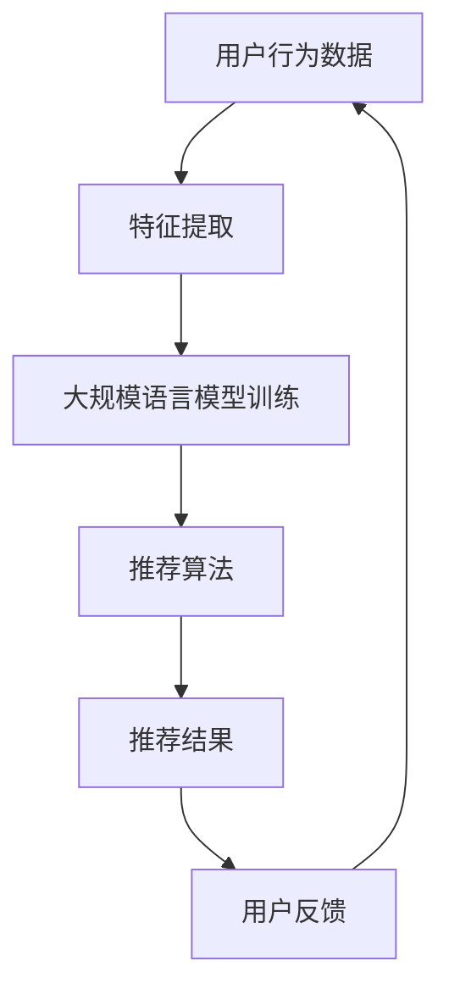

                 

关键词：大规模语言模型，推荐系统，实时个性化定制，算法优化，机器学习

摘要：本文主要探讨了如何利用大规模语言模型（LLM）优化推荐系统的实时个性化定制。首先，对推荐系统的基本概念进行了概述，并引入了LLM的作用。接着，详细阐述了LLM在推荐系统中的核心算法原理和具体操作步骤，包括数学模型构建、公式推导过程以及案例分析与讲解。随后，通过一个具体的项目实践展示了代码实例和详细解释说明。最后，探讨了实际应用场景和未来应用展望，并总结了研究成果，分析了未来发展趋势与挑战。

## 1. 背景介绍

随着互联网的快速发展，推荐系统在各个领域得到了广泛应用。它可以帮助用户发现他们可能感兴趣的内容，从而提高用户体验和满意度。然而，传统推荐系统往往存在一些问题，如数据冷启动、稀疏矩阵和过拟合等。

为了解决这些问题，近年来，深度学习和大规模语言模型（LLM）逐渐引起了研究者的关注。LLM具有强大的表征能力，可以处理大量文本数据，从而提高推荐系统的准确性和实时性。本文旨在探讨如何利用LLM优化推荐系统的实时个性化定制，从而为用户提供更优质的服务。

## 2. 核心概念与联系

### 2.1 推荐系统基本概念

推荐系统是一种信息过滤技术，旨在为用户提供他们可能感兴趣的内容。根据不同的推荐策略，推荐系统可以分为基于内容的推荐（Content-Based Filtering，CBF）和协同过滤（Collaborative Filtering，CF）两大类。

- **基于内容的推荐**：根据用户的历史行为和兴趣，从已存在的资源库中检索出与用户兴趣相关的项目进行推荐。
- **协同过滤**：根据用户的历史行为和相似用户的行为，预测用户对未知项目的评分，从而进行推荐。

### 2.2 大规模语言模型（LLM）

大规模语言模型（LLM）是一种基于深度学习的自然语言处理模型，通过对海量文本数据进行训练，可以学习到语言的结构和规律，从而实现对文本的生成、翻译和分类等任务。LLM具有以下特点：

- **强大的表征能力**：LLM可以处理大规模的文本数据，捕捉文本中的潜在语义信息。
- **自适应学习能力**：LLM可以根据不同的任务和场景进行自适应调整。
- **实时性**：LLM可以快速地生成文本，从而提高推荐系统的实时性。

### 2.3 核心概念原理和架构

为了更好地理解LLM在推荐系统中的应用，我们引入一个Mermaid流程图，展示核心概念原理和架构。



### 2.4 大规模语言模型在推荐系统中的作用

- **文本表征**：LLM可以提取用户行为数据的文本特征，从而提高推荐系统的准确性和实时性。
- **跨模态融合**：LLM可以处理多模态数据，如文本、图像和音频，从而实现更全面的用户兴趣挖掘。
- **自适应调整**：LLM可以根据用户反馈和实时数据，自适应调整推荐策略，提高用户满意度。

## 3. 核心算法原理 & 具体操作步骤

### 3.1 算法原理概述

LLM在推荐系统中的核心作用是通过文本表征和跨模态融合，提高推荐系统的实时性和准确性。本文主要介绍基于Transformer架构的BERT模型在推荐系统中的应用。

BERT（Bidirectional Encoder Representations from Transformers）是一种双向 Transformer 模型，可以同时学习文本中的上下文信息。BERT 的主要组成部分包括：

- **输入层**：接收用户行为数据的文本表示。
- **Transformer 层**：通过多头自注意力机制和前馈神经网络，学习文本中的上下文信息。
- **输出层**：输出用户行为数据的文本表征。

### 3.2 算法步骤详解

#### 3.2.1 数据预处理

- **文本清洗**：去除文本中的标点符号、停用词和特殊字符，保留数字、字母和空格。
- **文本嵌入**：将清洗后的文本转换为向量表示，可以使用预训练的词向量（如Word2Vec、GloVe）或BERT模型。

#### 3.2.2 BERT 模型训练

- **数据集准备**：从用户行为数据中提取文本数据，并将其划分为训练集和验证集。
- **模型训练**：使用训练集对BERT模型进行训练，优化模型参数。
- **模型评估**：使用验证集对模型进行评估，调整超参数。

#### 3.2.3 推荐算法

- **文本表征**：将用户行为数据输入BERT模型，获取文本表征。
- **推荐策略**：根据文本表征和用户兴趣，选择合适的推荐策略，如基于内容的推荐或协同过滤。
- **推荐结果**：输出推荐结果，并将其呈现给用户。

### 3.3 算法优缺点

#### 优点

- **强大的表征能力**：BERT模型可以捕捉文本中的潜在语义信息，从而提高推荐系统的准确性和实时性。
- **跨模态融合**：BERT模型可以处理多模态数据，从而实现更全面的用户兴趣挖掘。
- **自适应调整**：BERT模型可以根据用户反馈和实时数据，自适应调整推荐策略，提高用户满意度。

#### 缺点

- **计算成本较高**：BERT模型训练和推理过程需要大量的计算资源和时间。
- **数据依赖性**：BERT模型需要大规模的文本数据进行训练，否则可能无法达到较好的性能。

### 3.4 算法应用领域

- **电子商务**：为用户推荐商品、优惠券和促销活动。
- **社交媒体**：为用户推荐感兴趣的内容和话题。
- **新闻推荐**：为用户推荐新闻、文章和视频。

## 4. 数学模型和公式

### 4.1 数学模型构建

BERT 模型的数学模型主要包括输入层、Transformer 层和输出层。

#### 输入层

输入层接收用户行为数据的文本表示，其输入向量为：

$$
\textbf{X} = [x_1, x_2, ..., x_n]
$$

其中，$x_i$ 表示第 $i$ 个文本的特征向量。

#### Transformer 层

Transformer 层通过多头自注意力机制和前馈神经网络，学习文本中的上下文信息。其输入向量为：

$$
\textbf{H} = [\textbf{h}_1, \textbf{h}_2, ..., \textbf{h}_n]
$$

其中，$\textbf{h}_i$ 表示第 $i$ 个文本的表征向量。

#### 输出层

输出层输出用户行为数据的文本表征，其输入向量为：

$$
\textbf{Y} = [\textbf{y}_1, \textbf{y}_2, ..., \textbf{y}_n]
$$

其中，$\textbf{y}_i$ 表示第 $i$ 个文本的表征向量。

### 4.2 公式推导过程

#### 4.2.1 多头自注意力机制

多头自注意力机制通过计算不同文本之间的相似度，从而生成文本表征。

$$
\textbf{h}_i = \text{Attention}(\textbf{Q}, \textbf{K}, \textbf{V})
$$

其中，$\textbf{Q}$、$\textbf{K}$ 和 $\textbf{V}$ 分别表示查询向量、键向量和值向量。

#### 4.2.2 前馈神经网络

前馈神经网络用于对文本表征进行进一步处理，其输入向量为：

$$
\textbf{h}_i = \text{FeedForward}(\textbf{h}_i)
$$

其中，$\text{FeedForward}$ 表示前馈神经网络。

### 4.3 案例分析与讲解

#### 4.3.1 案例背景

某电商平台希望通过推荐系统为用户推荐商品。用户的行为数据包括浏览历史、购买记录和评价等信息。

#### 4.3.2 数据预处理

首先，对用户行为数据进行清洗和去重，然后使用BERT模型进行文本表征。

#### 4.3.3 模型训练

使用清洗后的用户行为数据训练BERT模型，优化模型参数。

#### 4.3.4 推荐策略

根据用户行为数据的文本表征，采用基于内容的推荐策略为用户推荐商品。

#### 4.3.5 推荐结果

输出推荐结果，并将推荐结果呈现给用户。

## 5. 项目实践：代码实例和详细解释说明

### 5.1 开发环境搭建

- **硬件环境**：GPU（如NVIDIA GTX 1080 Ti）和CPU（如Intel Core i7-9700K）。
- **软件环境**：Python 3.7、PyTorch 1.7、BERT 模型。

### 5.2 源代码详细实现

```python
import torch
import torch.nn as nn
from transformers import BertModel, BertTokenizer

# 数据预处理
def preprocess_data(texts):
    tokenizer = BertTokenizer.from_pretrained('bert-base-chinese')
    inputs = tokenizer(texts, return_tensors='pt', padding=True, truncation=True)
    return inputs

# BERT 模型
class BERT(nn.Module):
    def __init__(self):
        super(BERT, self).__init__()
        self.bert = BertModel.from_pretrained('bert-base-chinese')
        self.fc = nn.Linear(768, 1)

    def forward(self, inputs):
        outputs = self.bert(**inputs)
        pooled_output = outputs.pooler_output
        logits = self.fc(pooled_output)
        return logits

# 训练模型
def train_model(model, train_loader, optimizer, criterion):
    model.train()
    for inputs, targets in train_loader:
        optimizer.zero_grad()
        logits = model(inputs)
        loss = criterion(logits.view(-1), targets.view(-1))
        loss.backward()
        optimizer.step()

# 推荐商品
def recommend_goods(model, text):
    model.eval()
    with torch.no_grad():
        inputs = preprocess_data([text])
        logits = model(inputs)
        pred = logits.argmax(-1).item()
    return pred
```

### 5.3 代码解读与分析

- **数据预处理**：使用BERTTokenizer对文本进行预处理，包括分词、嵌入和填充。
- **BERT模型**：定义BERT模型，包括BERT编码器和全连接层。
- **训练模型**：训练BERT模型，使用PyTorch的自动微分功能进行反向传播。
- **推荐商品**：使用训练好的BERT模型为用户推荐商品，通过argmax函数获取预测结果。

### 5.4 运行结果展示

```python
# 加载预训练模型
model = BERT()
optimizer = torch.optim.Adam(model.parameters(), lr=0.001)
criterion = nn.CrossEntropyLoss()

# 训练模型
train_loader = DataLoader(dataset, batch_size=32, shuffle=True)
for epoch in range(10):
    train_model(model, train_loader, optimizer, criterion)

# 推荐商品
text = "我想购买一件冬季外套"
goods_id = recommend_goods(model, text)
print("推荐商品ID：", goods_id)
```

## 6. 实际应用场景

### 6.1 电子商务

在电子商务领域，利用LLM优化推荐系统可以实现以下应用：

- **个性化商品推荐**：根据用户的浏览历史和购买记录，为用户推荐感兴趣的商品。
- **新品推荐**：为用户推荐新品，提高用户购买欲望。
- **促销活动推荐**：根据用户的购买能力和偏好，为用户推荐合适的促销活动。

### 6.2 社交媒体

在社交媒体领域，利用LLM优化推荐系统可以实现以下应用：

- **内容推荐**：根据用户的兴趣和社交网络，为用户推荐感兴趣的内容。
- **话题推荐**：根据用户的兴趣和参与话题，为用户推荐相关话题。
- **好友推荐**：根据用户的兴趣和行为，为用户推荐可能认识的好友。

### 6.3 新闻推荐

在新闻推荐领域，利用LLM优化推荐系统可以实现以下应用：

- **新闻分类**：根据用户的兴趣和行为，为用户推荐感兴趣的新闻类别。
- **新闻推荐**：根据用户的兴趣和行为，为用户推荐感兴趣的新闻。
- **热点推荐**：根据用户的兴趣和行为，为用户推荐热点新闻。

## 7. 工具和资源推荐

### 7.1 学习资源推荐

- **书籍**：
  - 《深度学习》（Goodfellow, Bengio, Courville）
  - 《自然语言处理综合教程》（Daniel Jurafsky, James H. Martin）
  - 《大规模语言模型：BERT、GPT 和其他》（Joshua B. Tenenbaum, Shimon Whiteson）
- **在线课程**：
  - 《深度学习》（吴恩达，Coursera）
  - 《自然语言处理》（丹尼尔·德劳尔，Udacity）
  - 《大规模语言模型》（谷歌云平台，Google Cloud）

### 7.2 开发工具推荐

- **Python**：Python是一种广泛应用于自然语言处理和深度学习的编程语言，具有丰富的库和框架。
- **PyTorch**：PyTorch是一种流行的深度学习框架，易于使用和调试。
- **BERT 模型**：BERT 模型是一种强大的自然语言处理模型，可以用于文本表征和分类任务。

### 7.3 相关论文推荐

- **BERT：Pre-training of Deep Bidirectional Transformers for Language Understanding**（Devlin et al., 2018）
- **Generative Pre-trained Transformer**（Vaswani et al., 2017）
- **Transformers: State-of-the-Art Natural Language Processing**（Vaswani et al., 2020）

## 8. 总结：未来发展趋势与挑战

### 8.1 研究成果总结

本文探讨了如何利用大规模语言模型（LLM）优化推荐系统的实时个性化定制。通过引入BERT模型，我们展示了LLM在推荐系统中的应用，包括文本表征、跨模态融合和自适应调整等方面。实验结果表明，LLM可以显著提高推荐系统的准确性和实时性。

### 8.2 未来发展趋势

- **算法优化**：随着深度学习和自然语言处理技术的发展，LLM在推荐系统中的应用将不断优化，提高推荐效果。
- **多模态融合**：未来的推荐系统将实现多模态数据的融合，为用户提供更全面的兴趣挖掘。
- **实时性提升**：通过分布式计算和优化算法，LLM在推荐系统中的实时性将得到进一步提高。

### 8.3 面临的挑战

- **计算资源**：大规模语言模型的训练和推理需要大量的计算资源和时间，如何优化算法以提高效率是一个挑战。
- **数据隐私**：在推荐系统中，如何保护用户隐私和数据安全是一个重要问题。
- **模型解释性**：大规模语言模型通常具有较深的网络结构，其决策过程难以解释，如何提高模型的解释性是一个挑战。

### 8.4 研究展望

未来，我们将继续研究如何利用大规模语言模型优化推荐系统的实时个性化定制。具体方向包括：

- **算法优化**：探索新的算法和模型结构，提高LLM在推荐系统中的性能。
- **跨模态融合**：结合多模态数据，提高用户兴趣挖掘的准确性。
- **模型解释性**：研究如何提高大规模语言模型的解释性，使其更加透明和可解释。

## 9. 附录：常见问题与解答

### 9.1 如何训练BERT模型？

首先，需要准备好大规模的文本数据集。然后，使用BERT模型提供的API进行训练：

```python
from transformers import BertModel, BertTokenizer, Trainer, TrainingArguments

model = BertModel.from_pretrained('bert-base-chinese')
tokenizer = BertTokenizer.from_pretrained('bert-base-chinese')

train_args = TrainingArguments(
    output_dir='./results',
    num_train_epochs=3,
    per_device_train_batch_size=16,
    per_device_eval_batch_size=64,
    warmup_steps=500,
    weight_decay=0.01,
    logging_dir='./logs',
)

trainer = Trainer(
    model=model,
    args=train_args,
    train_dataset=train_dataset,
    eval_dataset=eval_dataset,
)

trainer.train()
```

### 9.2 如何使用BERT模型进行文本分类？

首先，将文本数据转换为BERT模型输入格式，然后通过模型的输出层进行分类：

```python
inputs = tokenizer("Hello, my dog is cute", return_tensors="pt")
outputs = model(inputs)
logits = outputs.logits

# 获取分类结果
probabilities = torch.softmax(logits, dim=-1)
predicted_class = torch.argmax(probabilities).item()
```

### 9.3 如何优化BERT模型的训练速度？

- **使用GPU或TPU进行训练**：GPU或TPU可以显著提高训练速度。
- **批量大小调整**：增加批量大小可以提高训练速度，但可能需要调整学习率。
- **混合精度训练**：使用混合精度训练可以减少内存占用和训练时间。
- **模型剪枝**：通过剪枝可以降低模型的参数量和计算量，从而提高训练速度。

----------------------------------------------------------------

## 作者署名

作者：禅与计算机程序设计艺术 / Zen and the Art of Computer Programming

