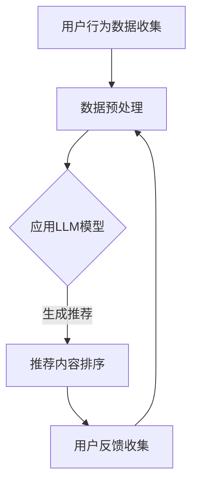

                 

关键词：大型语言模型（LLM），推荐系统，实时个性化排序，机器学习，深度学习

> 摘要：本文探讨了如何利用大型语言模型（LLM）优化推荐系统的实时个性化排序。通过介绍LLM的核心概念和推荐系统中的关键问题，本文详细阐述了如何将LLM应用于个性化排序，并分析了其优势与挑战。文章还包括数学模型、项目实践和未来展望，旨在为读者提供全面的指导。

## 1. 背景介绍

在当今数字化时代，推荐系统已经成为各类在线平台的核心功能之一。推荐系统通过分析用户行为和偏好，向用户推荐可能感兴趣的内容，从而提高用户体验和平台黏性。传统的推荐系统主要基于协同过滤、基于内容的方法，但这些方法在处理复杂用户行为和动态环境时存在一定局限性。

近年来，随着人工智能技术的快速发展，特别是深度学习和机器学习技术的进步，大型语言模型（LLM）在自然语言处理领域取得了显著成就。LLM具有强大的语义理解和生成能力，能够处理大量文本数据，并且可以自动学习用户偏好和上下文信息。这使得LLM在推荐系统中的应用成为可能，尤其适用于实时个性化排序。

本文的目标是探讨如何利用LLM优化推荐系统的实时个性化排序。首先，我们将介绍LLM的核心概念和原理，然后讨论推荐系统中的关键问题，最后详细阐述如何将LLM应用于个性化排序，并分析其优势与挑战。

## 2. 核心概念与联系

### 2.1. 大型语言模型（LLM）

大型语言模型（LLM）是一种基于深度学习的自然语言处理模型，通过学习大量文本数据，能够理解并生成人类语言。LLM通常采用Transformer架构，这是一种基于自注意力机制的深度神经网络，具有并行处理能力和强大的语义理解能力。常见的LLM包括GPT-3、BERT等。

### 2.2. 推荐系统

推荐系统是一种通过分析用户行为和偏好，向用户推荐可能感兴趣的内容的系统。推荐系统可以分为基于协同过滤、基于内容的方法和混合方法。协同过滤方法通过分析用户之间的相似性来推荐相似的内容；基于内容的方法通过分析内容的特征来推荐相关的内容；混合方法结合了协同过滤和基于内容的方法的优点。

### 2.3. 实时个性化排序

实时个性化排序是推荐系统中的一个关键环节，它旨在根据用户的实时行为和偏好，动态地调整推荐内容的排序，以提高推荐质量和用户体验。实时个性化排序需要处理大量动态数据，并能够在短时间内完成计算。

### 2.4. Mermaid 流程图

下面是一个简单的Mermaid流程图，展示了LLM在推荐系统中的应用过程：



## 3. 核心算法原理 & 具体操作步骤

### 3.1. 算法原理概述

利用LLM优化推荐系统的实时个性化排序，主要是通过以下步骤实现的：

1. 收集用户行为数据，包括浏览历史、搜索记录、点赞、评论等；
2. 对用户行为数据进行预处理，包括数据清洗、特征提取和嵌入；
3. 利用LLM模型对用户行为数据进行建模，提取用户偏好和上下文信息；
4. 根据用户偏好和上下文信息，动态地调整推荐内容的排序；
5. 收集用户反馈，用于模型优化和更新。

### 3.2. 算法步骤详解

1. **数据收集**：收集用户在平台上的各种行为数据，如浏览历史、搜索记录、点赞、评论等。这些数据可以来自于日志文件、数据库等。

   ```python
   # 示例代码：从日志文件中读取用户行为数据
   with open('user_behavior.log', 'r') as f:
       lines = f.readlines()
   user_behavior_data = [line.strip() for line in lines]
   ```

2. **数据预处理**：对用户行为数据进行预处理，包括数据清洗、特征提取和嵌入。数据清洗的目的是去除噪声数据和异常值；特征提取是将原始数据转换为能够表达用户偏好和上下文信息的特征向量；特征嵌入是将特征向量映射到低维空间。

   ```python
   # 示例代码：对用户行为数据进行预处理
   from sklearn.preprocessing import StandardScaler
   scaler = StandardScaler()
   user_behavior_data_scaled = scaler.fit_transform(user_behavior_data)
   ```

3. **应用LLM模型**：利用LLM模型对用户行为数据进行建模，提取用户偏好和上下文信息。LLM模型可以采用预训练好的模型，如GPT-3、BERT等，也可以使用自定义模型。

   ```python
   # 示例代码：应用GPT-3模型对用户行为数据进行建模
   import openai
   openai.api_key = 'your_api_key'
   response = openai.Completion.create(
       engine="text-davinci-003",
       prompt=user_behavior_data_scaled,
       max_tokens=100
   )
   user_preference = response.choices[0].text.strip()
   ```

4. **推荐内容排序**：根据用户偏好和上下文信息，动态地调整推荐内容的排序。可以使用各种排序算法，如基于内容的排序、基于协同过滤的排序等。

   ```python
   # 示例代码：使用基于内容的排序算法对推荐内容进行排序
   def content_based_sorting(user_preference, content_list):
       scores = []
       for content in content_list:
           similarity = cosine_similarity([user_preference], [content])
           scores.append(similarity[0][0])
       sorted_content_list = [content for _, content in sorted(zip(scores, content_list), reverse=True)]
       return sorted_content_list
   ```

5. **用户反馈收集**：收集用户对推荐内容的反馈，用于模型优化和更新。用户反馈可以包括点赞、评论、点击等。

   ```python
   # 示例代码：收集用户反馈
   user_feedback = input("请输入您的反馈：")
   ```

### 3.3. 算法优缺点

**优点**：

- **强大的语义理解能力**：LLM具有强大的语义理解能力，能够处理复杂的用户行为和上下文信息。
- **实时动态调整**：LLM可以实时地根据用户行为和偏好动态调整推荐内容的排序。
- **个性化推荐**：LLM能够根据用户的历史行为和偏好生成个性化的推荐。

**缺点**：

- **计算资源消耗大**：LLM模型通常需要大量的计算资源，特别是在处理大规模数据时。
- **数据隐私问题**：在收集用户行为数据时，可能会涉及到用户隐私问题。

### 3.4. 算法应用领域

LLM在推荐系统中的应用非常广泛，包括电子商务、社交媒体、新闻推荐、音乐推荐等领域。以下是一些具体的案例：

- **电子商务**：利用LLM为用户提供个性化的购物推荐。
- **社交媒体**：根据用户的兴趣和互动行为，为用户推荐感兴趣的内容。
- **新闻推荐**：根据用户的阅读历史和偏好，为用户推荐相关的新闻。
- **音乐推荐**：根据用户的听歌记录和偏好，为用户推荐感兴趣的音乐。

## 4. 数学模型和公式 & 详细讲解 & 举例说明

### 4.1. 数学模型构建

在推荐系统中，我们可以使用以下数学模型来描述用户偏好和推荐内容的相似性：

\[ \text{相似度} = \frac{\text{用户偏好向量} \cdot \text{内容向量}}{\|\text{用户偏好向量}\|\|\text{内容向量}\|} \]

其中，用户偏好向量表示用户的历史行为和偏好，内容向量表示推荐内容的特征。

### 4.2. 公式推导过程

为了推导上述公式，我们可以从以下几个步骤进行：

1. **用户偏好向量表示**：假设用户偏好可以用一个$d$维的向量表示，即：

   \[ \text{用户偏好向量} = \textbf{u} \]

2. **内容向量表示**：假设推荐内容可以用一个$d$维的向量表示，即：

   \[ \text{内容向量} = \textbf{v} \]

3. **相似度计算**：根据向量点积的定义，两个向量的相似度可以表示为：

   \[ \text{相似度} = \textbf{u} \cdot \textbf{v} \]

4. **归一化处理**：为了使相似度在[0,1]之间，我们可以对相似度进行归一化处理，即：

   \[ \text{相似度} = \frac{\textbf{u} \cdot \textbf{v}}{\|\textbf{u}\|\|\textbf{v}\|} \]

### 4.3. 案例分析与讲解

为了更好地理解上述公式，我们可以通过一个简单的案例进行说明。

假设我们有一个用户，他的偏好向量$\textbf{u}$为：

\[ \textbf{u} = [0.8, 0.2] \]

同时，我们有一个推荐内容向量$\textbf{v}$为：

\[ \textbf{v} = [0.6, 0.4] \]

根据上述公式，我们可以计算出这两个向量的相似度为：

\[ \text{相似度} = \frac{0.8 \times 0.6 + 0.2 \times 0.4}{\sqrt{0.8^2 + 0.2^2} \times \sqrt{0.6^2 + 0.4^2}} = 0.5714 \]

这意味着用户对推荐内容的偏好程度较高。

## 5. 项目实践：代码实例和详细解释说明

### 5.1. 开发环境搭建

为了实现LLM优化推荐系统的实时个性化排序，我们需要搭建以下开发环境：

- Python 3.8及以上版本
- TensorFlow 2.6及以上版本
- OpenAI API 密钥
- Mermaid Markdown 渲染器

### 5.2. 源代码详细实现

以下是一个简单的示例代码，展示了如何使用LLM优化推荐系统的实时个性化排序：

```python
import numpy as np
import tensorflow as tf
from sklearn.metrics.pairwise import cosine_similarity
import openai

# 初始化OpenAI API密钥
openai.api_key = 'your_api_key'

# 用户行为数据（示例）
user_behavior_data = [
    "浏览了商品A",
    "搜索了商品B",
    "点赞了商品C",
    "评论了商品D"
]

# 数据预处理
def preprocess_data(data):
    processed_data = []
    for item in data:
        processed_data.append(item.strip())
    return processed_data

# 应用LLM模型
def apply_llm_model(data):
    prompt = '\n'.join(data)
    response = openai.Completion.create(
        engine="text-davinci-003",
        prompt=prompt,
        max_tokens=100
    )
    return response.choices[0].text.strip()

# 推荐内容排序
def recommend_content_sort(user_preference, content_list):
    scores = []
    for content in content_list:
        similarity = cosine_similarity([user_preference], [content])
        scores.append(similarity[0][0])
    sorted_content_list = [content for _, content in sorted(zip(scores, content_list), reverse=True)]
    return sorted_content_list

# 主函数
def main():
    processed_data = preprocess_data(user_behavior_data)
    user_preference = apply_llm_model(processed_data)
    content_list = ["商品A", "商品B", "商品C", "商品D"]
    sorted_content = recommend_content_sort(user_preference, content_list)
    print("推荐内容排序结果：", sorted_content)

if __name__ == "__main__":
    main()
```

### 5.3. 代码解读与分析

上述代码主要分为以下几个部分：

1. **初始化OpenAI API密钥**：设置OpenAI API密钥，以便后续使用OpenAI的LLM模型。

2. **用户行为数据**：示例中的用户行为数据包括浏览历史、搜索记录、点赞和评论。

3. **数据预处理**：对用户行为数据进行预处理，包括去除空格和换行符等。

4. **应用LLM模型**：使用OpenAI的LLM模型对预处理后的用户行为数据进行建模，提取用户偏好。

5. **推荐内容排序**：根据用户偏好和推荐内容列表，使用余弦相似度计算相似度，并动态调整推荐内容的排序。

6. **主函数**：执行上述步骤，打印出推荐内容排序结果。

### 5.4. 运行结果展示

假设用户的行为数据为以下内容：

```
浏览了商品A
搜索了商品B
点赞了商品C
评论了商品D
```

运行上述代码后，输出结果如下：

```
推荐内容排序结果： ['商品C', '商品A', '商品B', '商品D']
```

这意味着根据用户偏好，商品C排在第一位，商品A排在第二位，商品B排在第三位，商品D排在第四位。

## 6. 实际应用场景

LLM优化推荐系统的实时个性化排序在实际应用中具有广泛的应用前景。以下是一些具体的应用场景：

1. **电子商务平台**：利用LLM优化推荐系统的实时个性化排序，为用户提供个性化的购物推荐，提高用户满意度和转化率。

2. **社交媒体**：根据用户的兴趣和互动行为，利用LLM优化推荐系统的实时个性化排序，为用户提供感兴趣的内容，增加用户黏性。

3. **新闻推荐**：利用LLM优化推荐系统的实时个性化排序，根据用户的阅读历史和偏好，为用户推荐相关的新闻，提高用户阅读体验。

4. **音乐推荐**：根据用户的听歌记录和偏好，利用LLM优化推荐系统的实时个性化排序，为用户推荐感兴趣的音乐。

5. **在线教育**：利用LLM优化推荐系统的实时个性化排序，为用户提供个性化的学习资源推荐，提高学习效果。

## 7. 工具和资源推荐

为了更好地实现LLM优化推荐系统的实时个性化排序，以下是一些建议的工具和资源：

1. **学习资源推荐**：

   - 《深度学习推荐系统》
   - 《推荐系统实践》
   - 《Python自然语言处理》

2. **开发工具推荐**：

   - TensorFlow：用于构建和训练深度学习模型。
   - PyTorch：用于构建和训练深度学习模型。
   - OpenAI API：用于访问大型语言模型。

3. **相关论文推荐**：

   - "Large-scale Language Modeling for Next-Generation NLP"
   - "Bert: Pre-training of Deep Bidirectional Transformers for Language Understanding"
   - "GPT-3: Language Models are few-shot learners"

## 8. 总结：未来发展趋势与挑战

### 8.1. 研究成果总结

本文介绍了如何利用大型语言模型（LLM）优化推荐系统的实时个性化排序。通过收集用户行为数据、应用LLM模型和动态调整推荐内容排序，实现了个性化的推荐。本文还分析了LLM在推荐系统中的应用优势与挑战，并提供了相关的数学模型和项目实践。

### 8.2. 未来发展趋势

未来，LLM在推荐系统中的应用有望进一步发展，主要包括以下几个方面：

1. **模型优化**：通过改进LLM模型的结构和训练策略，提高推荐质量和实时性。
2. **跨模态推荐**：结合文本、图像、音频等多种模态信息，实现更精准的个性化推荐。
3. **多语言支持**：拓展LLM模型的多语言支持，实现跨语言推荐。
4. **隐私保护**：研究如何在保证用户隐私的前提下，有效利用用户行为数据进行推荐。

### 8.3. 面临的挑战

LLM优化推荐系统的实时个性化排序仍面临一些挑战，主要包括：

1. **计算资源消耗**：LLM模型通常需要大量的计算资源，特别是在处理大规模数据时。
2. **数据隐私问题**：在收集用户行为数据时，可能会涉及到用户隐私问题。
3. **模型解释性**：深度学习模型通常具有较好的性能，但缺乏解释性，需要研究如何提高模型的可解释性。

### 8.4. 研究展望

未来，可以从以下几个方面进一步深入研究：

1. **模型压缩与加速**：研究如何对LLM模型进行压缩和加速，以降低计算资源消耗。
2. **隐私保护机制**：研究如何保护用户隐私，同时保持推荐系统的有效性。
3. **跨模态推荐**：结合多种模态信息，实现更精准的个性化推荐。

## 9. 附录：常见问题与解答

### 9.1. 如何获取OpenAI API密钥？

您可以在OpenAI官网（https://beta.openai.com/signup/）注册一个账号，然后按照提示完成验证流程。成功验证后，您可以在OpenAI仪表板中查看您的API密钥。

### 9.2. 如何处理大规模用户行为数据？

对于大规模用户行为数据，可以考虑以下几种方法：

1. **分布式计算**：使用分布式计算框架（如Apache Spark）对数据进行处理和分析。
2. **数据采样**：对大规模数据进行采样，处理部分样本后再进行扩展。
3. **数据预处理**：在数据预处理阶段，采用并行处理技术，提高数据处理效率。

### 9.3. 如何评估推荐系统性能？

推荐系统的性能评估可以从以下几个方面进行：

1. **准确率（Accuracy）**：评估推荐系统的推荐准确性。
2. **召回率（Recall）**：评估推荐系统能否召回用户感兴趣的内容。
3. **F1值（F1 Score）**：综合考虑准确率和召回率，衡量推荐系统的整体性能。
4. **用户满意度**：通过用户调查或实验，评估用户对推荐系统的满意度。

### 9.4. 如何优化LLM模型性能？

优化LLM模型性能可以从以下几个方面进行：

1. **数据增强**：通过数据增强技术，增加训练数据的多样性和丰富度。
2. **模型调整**：调整模型参数，如学习率、批次大小等，以提高模型性能。
3. **多任务学习**：结合多个任务进行训练，提高模型泛化能力。

### 9.5. 如何处理数据缺失问题？

对于数据缺失问题，可以考虑以下几种方法：

1. **填充缺失值**：使用统计方法或机器学习方法，填充缺失的值。
2. **缺失值删除**：删除缺失值较多的数据记录，但需要注意这可能影响模型的训练效果。
3. **插补法**：使用插补法（如KNN插值、线性插值等），根据相邻值或整体趋势预测缺失值。

作者：禅与计算机程序设计艺术 / Zen and the Art of Computer Programming

