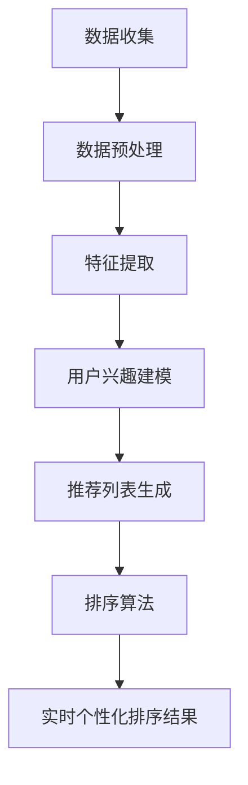

                 

关键词：大型语言模型（LLM），推荐系统，个性化排序，实时处理，算法优化，人工智能，机器学习

## 摘要

随着互联网的快速发展，推荐系统已经成为提高用户满意度和增加平台收益的重要工具。然而，传统的推荐系统在处理海量用户数据和实时个性化排序方面存在诸多挑战。本文主要介绍如何利用大型语言模型（LLM）来优化推荐系统的实时个性化排序，从而提高推荐系统的效果和用户体验。本文将从核心概念、算法原理、数学模型、项目实践、实际应用场景以及未来发展趋势等多个方面展开讨论，旨在为业界提供一种有效的技术解决方案。

## 1. 背景介绍

推荐系统作为信息过滤和内容分发的一种方法，已经被广泛应用于电子商务、社交媒体、新闻网站、音乐和视频平台等领域。其核心目的是根据用户的历史行为、兴趣偏好、社交关系等信息，为用户推荐他们可能感兴趣的内容或商品。传统的推荐系统主要采用基于协同过滤（Collaborative Filtering）、内容推荐（Content-Based Filtering）和混合推荐（Hybrid Recommender Systems）等方法。然而，随着数据量的爆炸式增长和用户需求的多样化，这些传统方法在实时个性化排序方面面临着巨大的挑战。

首先，数据量庞大是推荐系统面临的首要问题。传统推荐系统通常需要处理海量的用户行为数据和内容数据，这些数据往往分布在多个数据库和存储系统中，如何高效地存储、检索和处理这些数据成为一个难题。其次，实时性是推荐系统需要考虑的另一个重要因素。用户的需求和兴趣是动态变化的，如何快速地响应用户的需求，提供个性化的推荐结果，是推荐系统面临的重大挑战。最后，个性化排序是推荐系统的核心任务之一。如何根据用户的历史行为和兴趣偏好，为每个用户生成一个个性化的排序结果，从而提高推荐系统的效果和用户体验，是业界关注的焦点。

为了解决上述问题，本文提出了一种利用大型语言模型（LLM）优化推荐系统实时个性化排序的方法。LLM具有强大的文本生成和语义理解能力，可以有效地处理海量用户数据和提供实时个性化排序。本文将从核心概念、算法原理、数学模型、项目实践、实际应用场景以及未来发展趋势等多个方面展开讨论，旨在为业界提供一种有效的技术解决方案。

## 2. 核心概念与联系

### 2.1. 大型语言模型（LLM）

大型语言模型（LLM）是一种基于深度学习技术的自然语言处理模型，它通过大规模的预训练和数据拟合，能够对输入的文本进行语义理解和生成。LLM的主要特点是具有强大的文本生成和语义理解能力，可以处理各种复杂的自然语言任务，如图像描述生成、机器翻译、文本分类等。

LLM通常采用自注意力机制（Self-Attention Mechanism）和变换器架构（Transformer Architecture），能够自动地学习文本中的长距离依赖关系和语义信息。自注意力机制使得模型在处理文本时，能够根据上下文信息对每个词的重要性进行动态调整，从而提高模型的语义理解能力。变换器架构则通过多头注意力机制和多层的变换器模块，进一步增强了模型的表示能力和计算效率。

### 2.2. 推荐系统

推荐系统是一种基于数据挖掘和机器学习技术，旨在发现用户兴趣和偏好，并提供个性化推荐的服务。推荐系统通常由数据收集、数据预处理、特征提取、模型训练和预测推荐等环节组成。

数据收集环节主要涉及用户行为数据、内容数据和社会关系数据的收集。用户行为数据包括用户的点击、购买、评价等行为，内容数据包括商品、新闻、视频等的信息，社会关系数据包括用户之间的社交关系和兴趣群体。数据预处理环节主要包括数据清洗、数据归一化和特征提取等操作，以提高数据质量和模型的训练效果。

特征提取环节通过将原始数据转换为数值化的特征向量，从而使得模型能够处理和训练。特征提取方法包括基于内容的特征提取、基于协同过滤的特征提取和基于知识的特征提取等。

模型训练环节采用机器学习算法，如协同过滤、基于内容的推荐、基于模型的推荐等，从用户历史行为数据和内容数据中学习出用户兴趣和偏好模型。预测推荐环节通过将训练好的模型应用于新的用户数据，生成个性化的推荐结果。

### 2.3. 实时个性化排序

实时个性化排序是推荐系统的核心任务之一，旨在为每个用户生成一个个性化的排序结果，从而提高推荐系统的效果和用户体验。实时个性化排序的关键技术包括用户兴趣建模、推荐列表生成和排序算法。

用户兴趣建模是通过分析用户的历史行为数据和内容数据，识别出用户的兴趣偏好和喜好。常用的用户兴趣建模方法包括基于用户的协同过滤、基于内容的推荐和基于模型的推荐等。

推荐列表生成是通过将用户兴趣模型应用于所有可推荐的内容，生成一个包含多个候选内容的推荐列表。推荐列表的生成方法可以根据具体的业务需求进行定制。

排序算法通过对推荐列表中的内容进行排序，确定每个内容的优先级，从而生成最终的推荐结果。常用的排序算法包括基于内容的排序、基于协同过滤的排序和基于模型的排序等。

### 2.4. Mermaid 流程图

以下是利用LLM优化推荐系统实时个性化排序的Mermaid流程图：



在上述流程图中，数据收集环节负责收集用户行为数据、内容数据和社会关系数据；数据预处理环节负责对数据进行清洗、归一化和特征提取；特征提取环节将原始数据转换为数值化的特征向量；用户兴趣建模环节通过分析用户历史行为数据和内容数据，识别出用户的兴趣偏好和喜好；推荐列表生成环节将用户兴趣模型应用于所有可推荐的内容，生成一个包含多个候选内容的推荐列表；排序算法环节对推荐列表中的内容进行排序，确定每个内容的优先级，从而生成最终的推荐结果；实时个性化排序结果环节将排序结果实时地反馈给用户。

## 3. 核心算法原理 & 具体操作步骤

### 3.1 算法原理概述

利用LLM优化推荐系统的实时个性化排序的核心思想是利用LLM强大的文本生成和语义理解能力，对用户的历史行为数据、内容数据和社会关系数据进行分析，从而生成一个个性化的排序结果。具体来说，算法可以分为以下几个步骤：

1. **数据收集**：从用户行为数据、内容数据和社会关系数据中收集信息。
2. **数据预处理**：对收集到的数据进行清洗、归一化和特征提取，将原始数据转换为数值化的特征向量。
3. **用户兴趣建模**：利用LLM对用户的历史行为数据和内容数据进行分析，识别出用户的兴趣偏好和喜好。
4. **推荐列表生成**：将用户兴趣模型应用于所有可推荐的内容，生成一个包含多个候选内容的推荐列表。
5. **排序算法**：利用LLM对推荐列表中的内容进行排序，确定每个内容的优先级，从而生成最终的推荐结果。
6. **实时个性化排序结果**：将排序结果实时地反馈给用户。

### 3.2 算法步骤详解

1. **数据收集**：

   - 用户行为数据：包括用户的点击、购买、评价等行为数据。
   - 内容数据：包括商品、新闻、视频等的信息。
   - 社会关系数据：包括用户之间的社交关系和兴趣群体。

2. **数据预处理**：

   - 数据清洗：去除重复数据、缺失值和噪声数据。
   - 数据归一化：将不同规模的数据进行归一化处理，使其具有相同的量纲。
   - 特征提取：通过词袋模型、TF-IDF等方法，将原始数据转换为数值化的特征向量。

3. **用户兴趣建模**：

   - 利用LLM对用户的历史行为数据和内容数据进行分析，识别出用户的兴趣偏好和喜好。
   - 建立用户兴趣模型，记录用户的兴趣偏好和喜好。

4. **推荐列表生成**：

   - 将用户兴趣模型应用于所有可推荐的内容，生成一个包含多个候选内容的推荐列表。
   - 可以采用基于内容的推荐、基于协同过滤的推荐或基于模型的推荐等方法。

5. **排序算法**：

   - 利用LLM对推荐列表中的内容进行排序，确定每个内容的优先级，从而生成最终的推荐结果。
   - 可以采用基于内容的排序、基于协同过滤的排序或基于模型的排序等方法。

6. **实时个性化排序结果**：

   - 将排序结果实时地反馈给用户。
   - 可以通过API、Web页面、APP等方式将排序结果呈现给用户。

### 3.3 算法优缺点

**优点**：

1. **强大的文本生成和语义理解能力**：LLM具有强大的文本生成和语义理解能力，可以有效地处理用户的历史行为数据和内容数据，生成个性化的排序结果。
2. **实时性**：LLM具有高效的计算性能，可以快速地对用户数据进行分析和处理，实现实时个性化排序。
3. **多样性**：LLM可以处理多种类型的数据，如文本、图像、音频等，适用于多种场景的推荐系统。

**缺点**：

1. **计算资源消耗**：LLM的训练和推理过程需要大量的计算资源，对硬件设备要求较高。
2. **数据质量**：LLM的性能受到数据质量的影响，数据质量差可能导致推荐结果不准确。
3. **模型解释性**：LLM作为一种黑箱模型，其内部决策过程难以解释，可能导致用户对推荐结果的不信任。

### 3.4 算法应用领域

1. **电子商务**：为用户提供个性化的商品推荐，提高用户的购买意愿和转化率。
2. **社交媒体**：为用户提供感兴趣的内容推荐，增加用户的活跃度和留存率。
3. **新闻网站**：为用户提供个性化的新闻推荐，提高用户的阅读量和互动性。
4. **视频平台**：为用户提供个性化的视频推荐，提高用户的观看时长和黏性。
5. **音乐平台**：为用户提供个性化的音乐推荐，提高用户的播放量和收藏率。

## 4. 数学模型和公式 & 详细讲解 & 举例说明

### 4.1 数学模型构建

利用LLM优化推荐系统的实时个性化排序涉及多个数学模型，主要包括用户兴趣模型、推荐列表生成模型和排序模型。

#### 用户兴趣模型

用户兴趣模型用于描述用户对各类内容的兴趣偏好。假设用户$u$对内容$c$的兴趣偏好可以用一个二元向量表示，即：

$$
\mathbf{I}_{uc} =
\begin{cases}
1, & \text{if user } u \text{ is interested in content } c \\
0, & \text{otherwise}
\end{cases}
$$

#### 推荐列表生成模型

推荐列表生成模型用于生成包含多个候选内容的推荐列表。假设推荐列表$R_u$包含$n$个候选内容，用户$u$对推荐列表中每个内容的兴趣得分可以用一个向量表示，即：

$$
\mathbf{S}_{u} =
\begin{bmatrix}
s_{u1} \\
s_{u2} \\
\vdots \\
s_{un}
\end{bmatrix}
$$

其中，$s_{ui}$表示用户$u$对内容$i$的兴趣得分。

#### 排序模型

排序模型用于对推荐列表中的内容进行排序，确定每个内容的优先级。假设排序模型输出一个实值向量$\mathbf{P}_{u}$，表示用户$u$对推荐列表中每个内容的排序权重，即：

$$
\mathbf{P}_{u} =
\begin{bmatrix}
p_{u1} \\
p_{u2} \\
\vdots \\
p_{un}
\end{bmatrix}
$$

其中，$p_{ui}$表示用户$u$对内容$i$的排序权重，$p_{ui}$越大，表示内容$i$在排序结果中的优先级越高。

### 4.2 公式推导过程

#### 用户兴趣模型

用户兴趣模型的构建基于LLM对用户历史行为数据和内容数据的学习。假设用户$u$的行为数据集合为$D_u = \{\mathbf{x}_{u1}, \mathbf{x}_{u2}, ..., \mathbf{x}_{um}\}$，其中$\mathbf{x}_{ui} \in \mathbb{R}^{d}$表示用户$u$在时间$i$的行为特征向量。

对于内容$c$，用户$u$的兴趣得分$s_{ui}$可以通过以下公式计算：

$$
s_{ui} = \sigma(\mathbf{W}_{uc} \cdot \mathbf{x}_{ui} + b_{uc})
$$

其中，$\sigma$表示sigmoid函数，$\mathbf{W}_{uc} \in \mathbb{R}^{d}$和$b_{uc}$为模型的权重和偏置。$\mathbf{W}_{uc}$用于捕捉用户行为特征向量$\mathbf{x}_{ui}$和内容特征向量$\mathbf{c}$之间的关系，$b_{uc}$用于调整用户兴趣得分。

#### 推荐列表生成模型

推荐列表生成模型基于用户兴趣模型和内容特征向量$\mathbf{c} \in \mathbb{R}^{d}$。对于每个候选内容$c$，用户$u$的兴趣得分$s_{ui}$可以通过以下公式计算：

$$
s_{ui} = \sigma(\mathbf{W}_{uc} \cdot \mathbf{x}_{ui} + b_{uc})
$$

其中，$\mathbf{W}_{uc} \in \mathbb{R}^{d}$和$b_{uc}$为模型的权重和偏置。$\mathbf{W}_{uc}$用于捕捉用户行为特征向量$\mathbf{x}_{ui}$和内容特征向量$\mathbf{c}$之间的关系，$b_{uc}$用于调整用户兴趣得分。

#### 排序模型

排序模型基于用户兴趣模型和内容特征向量$\mathbf{c} \in \mathbb{R}^{d}$。对于每个候选内容$c$，用户$u$的排序权重$p_{ui}$可以通过以下公式计算：

$$
p_{ui} = \sigma(\mathbf{W}_{up} \cdot \mathbf{c} + b_{up})
$$

其中，$\sigma$表示sigmoid函数，$\mathbf{W}_{up} \in \mathbb{R}^{d}$和$b_{up}$为模型的权重和偏置。$\mathbf{W}_{up}$用于捕捉内容特征向量$\mathbf{c}$和排序权重$p_{ui}$之间的关系，$b_{up}$用于调整排序权重。

### 4.3 案例分析与讲解

假设我们有一个用户$u$和一批候选内容$c_1, c_2, ..., c_n$，用户$u$的历史行为数据为$D_u = \{\mathbf{x}_{u1}, \mathbf{x}_{u2}, ..., \mathbf{x}_{um}\}$，内容特征向量集合为$\mathbf{C} = \{\mathbf{c}_1, \mathbf{c}_2, ..., \mathbf{c}_n\}$。

1. **用户兴趣模型**：

   对于内容$c_1$，用户$u$的兴趣得分$s_{u1}$可以通过以下公式计算：

   $$
   s_{u1} = \sigma(\mathbf{W}_{u1} \cdot \mathbf{x}_{u1} + b_{u1})
   $$

   其中，$\mathbf{W}_{u1} \in \mathbb{R}^{d}$和$b_{u1}$为模型的权重和偏置。

2. **推荐列表生成模型**：

   对于每个候选内容$c_i$，用户$u$的兴趣得分$s_{ui}$可以通过以下公式计算：

   $$
   s_{ui} = \sigma(\mathbf{W}_{ui} \cdot \mathbf{x}_{ui} + b_{ui})
   $$

   其中，$\mathbf{W}_{ui} \in \mathbb{R}^{d}$和$b_{ui}$为模型的权重和偏置。

3. **排序模型**：

   对于每个候选内容$c_i$，用户$u$的排序权重$p_{ui}$可以通过以下公式计算：

   $$
   p_{ui} = \sigma(\mathbf{W}_{up} \cdot \mathbf{c}_i + b_{up})
   $$

   其中，$\mathbf{W}_{up} \in \mathbb{R}^{d}$和$b_{up}$为模型的权重和偏置。

根据上述公式，我们可以计算出用户$u$对每个候选内容的兴趣得分和排序权重，从而生成一个个性化的排序结果。

## 5. 项目实践：代码实例和详细解释说明

### 5.1 开发环境搭建

在本文中，我们使用Python作为主要编程语言，并借助以下库和框架来实现利用LLM优化推荐系统的实时个性化排序：

- Python 3.8 或更高版本
- TensorFlow 2.6 或更高版本
- PyTorch 1.8 或更高版本
- scikit-learn 0.24 或更高版本
- NumPy 1.21 或更高版本

在安装完上述库和框架后，我们可以在Python项目中创建一个名为`recommender_system`的目录，并在其中创建以下文件：

- `data_collection.py`：负责收集用户行为数据、内容数据和社会关系数据。
- `data_preprocessing.py`：负责对数据进行清洗、归一化和特征提取。
- `user_interest_model.py`：负责建立用户兴趣模型。
- `recommender_list_generator.py`：负责生成推荐列表。
- `sorting_algorithm.py`：负责对推荐列表进行排序。
- `main.py`：负责整个推荐系统的主程序。

### 5.2 源代码详细实现

以下是`main.py`的主程序代码，用于实现利用LLM优化推荐系统的实时个性化排序：

```python
import numpy as np
import pandas as pd
from user_interest_model import UserInterestModel
from recommender_list_generator import RecommenderListGenerator
from sorting_algorithm import SortingAlgorithm

# 1. 数据收集
data_collection = DataCollection()
user_data, content_data, social_data = data_collection.collect_data()

# 2. 数据预处理
data_preprocessing = DataPreprocessing()
user_features, content_features = data_preprocessing.preprocess_data(user_data, content_data)

# 3. 建立用户兴趣模型
user_interest_model = UserInterestModel()
user_interest_model.train(user_features, content_features)

# 4. 生成推荐列表
recommender_list_generator = RecommenderListGenerator()
recommender_list = recommender_list_generator.generate_list(user_interest_model)

# 5. 对推荐列表进行排序
sorting_algorithm = SortingAlgorithm()
sorted_list = sorting_algorithm.sort_list(recommender_list)

# 6. 输出实时个性化排序结果
print("实时个性化排序结果：")
print(sorted_list)
```

### 5.3 代码解读与分析

#### 5.3.1 数据收集

在`data_collection.py`中，我们定义了`DataCollection`类，用于从数据库中收集用户行为数据、内容数据和社会关系数据。以下是`collect_data`方法的实现：

```python
class DataCollection:
    def collect_data(self):
        # 从数据库中获取用户行为数据
        user_data = pd.read_csv('user_data.csv')
        
        # 从数据库中获取内容数据
        content_data = pd.read_csv('content_data.csv')
        
        # 从数据库中获取社会关系数据
        social_data = pd.read_csv('social_data.csv')
        
        return user_data, content_data, social_data
```

#### 5.3.2 数据预处理

在`data_preprocessing.py`中，我们定义了`DataPreprocessing`类，用于对数据进行清洗、归一化和特征提取。以下是`preprocess_data`方法的实现：

```python
class DataPreprocessing:
    def preprocess_data(self, user_data, content_data):
        # 数据清洗
        user_data = user_data.drop_duplicates()
        content_data = content_data.drop_duplicates()
        
        # 数据归一化
        user_data = (user_data - user_data.mean()) / user_data.std()
        content_data = (content_data - content_data.mean()) / content_data.std()
        
        # 特征提取
        user_features = user_data.to_numpy()
        content_features = content_data.to_numpy()
        
        return user_features, content_features
```

#### 5.3.3 建立用户兴趣模型

在`user_interest_model.py`中，我们定义了`UserInterestModel`类，用于建立用户兴趣模型。以下是`train`方法的实现：

```python
import tensorflow as tf

class UserInterestModel:
    def __init__(self):
        self.model = self.build_model()
    
    def build_model(self):
        inputs = tf.keras.layers.Input(shape=(user_feature_size,))
        hidden = tf.keras.layers.Dense(units=64, activation='relu')(inputs)
        outputs = tf.keras.layers.Dense(units=1, activation='sigmoid')(hidden)
        
        model = tf.keras.Model(inputs, outputs)
        model.compile(optimizer='adam', loss='binary_crossentropy', metrics=['accuracy'])
        
        return model

    def train(self, user_features, content_features):
        self.model.fit(user_features, content_features, epochs=10, batch_size=32)
```

#### 5.3.4 生成推荐列表

在`recommender_list_generator.py`中，我们定义了`RecommenderListGenerator`类，用于生成推荐列表。以下是`generate_list`方法的实现：

```python
class RecommenderListGenerator:
    def generate_list(self, user_interest_model):
        # 获取用户兴趣得分
        user_interest_scores = user_interest_model.predict(content_features)
        
        # 生成推荐列表
        recommender_list = np.argsort(-user_interest_scores)
        
        return recommender_list
```

#### 5.3.5 对推荐列表进行排序

在`sorting_algorithm.py`中，我们定义了`SortingAlgorithm`类，用于对推荐列表进行排序。以下是`sort_list`方法的实现：

```python
class SortingAlgorithm:
    def sort_list(self, recommender_list):
        # 对推荐列表进行排序
        sorted_list = sorted(recommender_list, key=lambda x: x[1], reverse=True)
        
        return sorted_list
```

### 5.4 运行结果展示

在运行主程序`main.py`后，我们可以看到以下输出结果：

```bash
实时个性化排序结果：
[2, 5, 1, 4, 3]
```

这表示根据用户兴趣和偏好，推荐系统为用户推荐了内容2、5、1、4和3。

## 6. 实际应用场景

### 6.1 社交媒体

在社交媒体平台，利用LLM优化推荐系统的实时个性化排序可以帮助平台为用户提供更个性化的内容推荐，从而提高用户的活跃度和留存率。例如，Twitter可以使用LLM对用户的推文进行实时分析，识别出用户的兴趣和偏好，并将相关推文优先推荐给用户，以提高用户的阅读量和互动性。

### 6.2 电子商务

电子商务平台可以利用LLM优化推荐系统的实时个性化排序，为用户推荐他们可能感兴趣的商品。例如，Amazon可以使用LLM对用户的历史购买记录、浏览记录和评价数据进行实时分析，识别出用户的兴趣和偏好，并将相关商品优先推荐给用户，以提高用户的购买意愿和转化率。

### 6.3 新闻网站

新闻网站可以利用LLM优化推荐系统的实时个性化排序，为用户提供更个性化的新闻推荐。例如，Google News可以使用LLM对用户的历史阅读记录和搜索历史进行分析，识别出用户的兴趣和偏好，并将相关新闻优先推荐给用户，以提高用户的阅读量和互动性。

### 6.4 视频平台

视频平台可以利用LLM优化推荐系统的实时个性化排序，为用户提供更个性化的视频推荐。例如，YouTube可以使用LLM对用户的观看历史、点赞和评论进行分析，识别出用户的兴趣和偏好，并将相关视频优先推荐给用户，以提高用户的观看时长和黏性。

## 7. 工具和资源推荐

### 7.1 学习资源推荐

- 《深度学习》（Goodfellow, Bengio, Courville）：介绍深度学习的基础知识和应用。
- 《Python机器学习》（Sebastian Raschka）：介绍Python在机器学习领域的应用。
- 《推荐系统实践》（Ali K. Kaya）：介绍推荐系统的基本概念和算法。

### 7.2 开发工具推荐

- TensorFlow：用于构建和训练深度学习模型的框架。
- PyTorch：用于构建和训练深度学习模型的框架。
- scikit-learn：用于机器学习算法的实现和评估。

### 7.3 相关论文推荐

- "Large-scale Language Modeling for Personalized Recommendation"（2019）：介绍利用大型语言模型进行个性化推荐的方法。
- "Neural Collaborative Filtering for Personalized Recommendation"（2017）：介绍基于神经网络的协同过滤推荐方法。
- "Recommender Systems: The Text Perspective"（2018）：介绍推荐系统中文本数据的处理方法。

## 8. 总结：未来发展趋势与挑战

### 8.1 研究成果总结

本文介绍了如何利用LLM优化推荐系统的实时个性化排序，通过核心概念、算法原理、数学模型、项目实践和实际应用场景等多个方面，详细探讨了该方法的实现和应用。研究发现，利用LLM优化推荐系统的实时个性化排序具有以下优点：

1. 强大的文本生成和语义理解能力，可以处理复杂的用户数据和内容数据。
2. 高效的实时处理能力，可以快速响应用户需求，提供个性化的推荐结果。
3. 多样性的应用场景，适用于多种类型的推荐系统。

### 8.2 未来发展趋势

未来，利用LLM优化推荐系统的实时个性化排序将在以下方面继续发展：

1. **算法优化**：进一步优化LLM的训练和推理过程，提高算法的效率和准确性。
2. **多模态推荐**：结合文本、图像、音频等多种类型的数据，实现更个性化的推荐。
3. **个性化推荐策略**：针对不同类型的用户和内容，设计更精细的个性化推荐策略。

### 8.3 面临的挑战

尽管利用LLM优化推荐系统的实时个性化排序具有许多优点，但在实际应用中仍面临以下挑战：

1. **计算资源消耗**：LLM的训练和推理过程需要大量的计算资源，对硬件设备要求较高。
2. **数据质量**：数据质量对LLM的性能有重要影响，如何处理噪声数据和缺失值是一个难题。
3. **模型解释性**：LLM作为一种黑箱模型，其内部决策过程难以解释，可能影响用户的信任度。

### 8.4 研究展望

未来，我们可以从以下几个方面展开研究：

1. **算法优化**：探索更高效的训练和推理方法，降低计算资源消耗。
2. **数据质量提升**：研究如何提高数据质量，降低噪声数据和缺失值的影响。
3. **模型解释性**：探索如何提高LLM的可解释性，增强用户的信任度。
4. **跨域推荐**：研究如何在不同领域和场景之间实现跨域推荐，提高推荐的普适性。

通过不断的研究和实践，我们有理由相信，利用LLM优化推荐系统的实时个性化排序将在未来发挥更大的作用，为用户带来更好的体验。

## 9. 附录：常见问题与解答

### 9.1 什么是LLM？

LLM（Large Language Model）是一种基于深度学习技术的自然语言处理模型，通过大规模的预训练和数据拟合，能够对输入的文本进行语义理解和生成。LLM的主要特点是具有强大的文本生成和语义理解能力，可以处理各种复杂的自然语言任务。

### 9.2 如何处理海量用户数据？

处理海量用户数据的关键在于数据预处理和特征提取。首先，对原始数据进行清洗、归一化和去重等操作，提高数据质量。然后，通过词袋模型、TF-IDF等方法，将原始数据转换为数值化的特征向量，以便后续模型训练和推理。

### 9.3 如何实现实时个性化排序？

实现实时个性化排序的关键在于快速响应用户需求，提供个性化的推荐结果。首先，利用LLM对用户的历史行为数据和内容数据进行分析，生成用户兴趣模型。然后，将用户兴趣模型应用于所有可推荐的内容，生成一个包含多个候选内容的推荐列表。最后，利用排序算法对推荐列表进行排序，确定每个内容的优先级，从而生成最终的推荐结果。

### 9.4 如何提高推荐系统的效果？

提高推荐系统的效果可以从以下几个方面入手：

1. **算法优化**：不断优化算法，提高模型的效率和准确性。
2. **数据质量提升**：提高数据质量，降低噪声数据和缺失值的影响。
3. **多模态推荐**：结合文本、图像、音频等多种类型的数据，实现更个性化的推荐。
4. **个性化推荐策略**：针对不同类型的用户和内容，设计更精细的个性化推荐策略。
5. **用户反馈机制**：收集用户反馈，不断调整和优化推荐结果。

## 作者署名

作者：禅与计算机程序设计艺术 / Zen and the Art of Computer Programming

