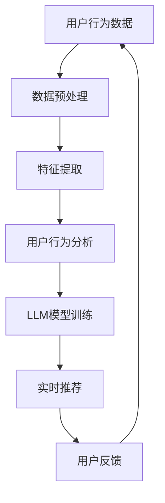

                 

关键词：大规模语言模型（LLM）、推荐系统、实时个性化、生成式推荐、用户行为分析、数据挖掘、算法优化、机器学习、人工智能。

## 摘要

随着互联网和大数据技术的飞速发展，推荐系统在电子商务、社交媒体、在线教育等多个领域得到了广泛应用。然而，传统的推荐系统往往存在响应速度慢、个性化程度低等问题。本文将探讨如何利用大规模语言模型（LLM）来优化推荐系统的实时个性化生成，从而提高推荐系统的性能和用户体验。文章将介绍LLM的基本概念和原理，分析其在推荐系统中的应用，详细阐述算法原理和操作步骤，并通过数学模型和公式进行推导，最后给出实际应用案例和未来展望。

## 1. 背景介绍

### 1.1 推荐系统概述

推荐系统是一种信息过滤技术，通过预测用户对特定项目的兴趣，向用户推荐他们可能感兴趣的内容或项目。推荐系统主要分为基于内容的推荐和协同过滤推荐两种类型。基于内容的推荐方法依赖于对项目特征的提取和比较，而协同过滤推荐方法则依赖于用户行为数据的分析。

### 1.2 传统推荐系统的挑战

虽然推荐系统在多个领域取得了显著成果，但传统的推荐系统仍面临一些挑战：

- **响应速度慢**：传统推荐系统通常需要较长的计算时间，无法满足实时推荐的需求。
- **个性化程度低**：传统推荐系统往往难以捕捉到用户个体的细微差异，导致推荐效果不够精准。
- **数据依赖性强**：传统推荐系统对用户行为数据有较高的依赖，缺乏对稀疏数据的处理能力。

### 1.3 LLM在推荐系统中的应用潜力

随着深度学习和自然语言处理技术的快速发展，大规模语言模型（LLM）在文本生成、情感分析、问答系统等方面取得了显著成果。LLM具有强大的语义理解和生成能力，可以更好地捕捉用户的个性化需求，从而提高推荐系统的性能和用户体验。

## 2. 核心概念与联系

### 2.1 大规模语言模型（LLM）

大规模语言模型（LLM）是一种基于深度学习的自然语言处理模型，通过大规模的文本数据进行预训练，从而获得对语言的理解和生成能力。LLM的核心组件是 Transformer 模型，通过自注意力机制实现全局信息的有效聚合。

### 2.2 推荐系统与LLM的融合

将LLM与推荐系统相结合，可以实现以下几个方面的优化：

- **增强语义理解**：LLM可以更好地捕捉用户的语义需求，从而提高推荐系统的个性化程度。
- **实时响应**：LLM的生成能力可以快速生成推荐内容，满足实时推荐的需求。
- **对抗稀疏数据**：LLM可以通过对用户行为数据的生成和扩展，提高推荐系统对稀疏数据的处理能力。

### 2.3 Mermaid 流程图



## 3. 核心算法原理 & 具体操作步骤

### 3.1 算法原理概述

利用LLM优化推荐系统的实时个性化生成，主要包括以下几个步骤：

1. **用户行为数据收集**：收集用户的浏览、搜索、购买等行为数据。
2. **数据预处理**：对用户行为数据进行清洗、去噪和规范化处理。
3. **特征提取**：从用户行为数据中提取用户兴趣特征。
4. **用户行为分析**：利用LLM对用户兴趣特征进行深入分析，获取用户的个性化需求。
5. **实时推荐**：根据用户的个性化需求，利用LLM快速生成推荐内容。
6. **用户反馈**：收集用户的反馈数据，用于优化LLM模型和推荐算法。

### 3.2 算法步骤详解

1. **用户行为数据收集**：

   收集用户的浏览、搜索、购买等行为数据，如商品ID、用户ID、行为时间、行为类型等。

2. **数据预处理**：

   对用户行为数据进行清洗、去噪和规范化处理，如去除重复数据、填补缺失值、标准化特征等。

3. **特征提取**：

   从用户行为数据中提取用户兴趣特征，如商品类别、品牌、价格、用户年龄、性别等。

4. **用户行为分析**：

   利用LLM对用户兴趣特征进行深入分析，获取用户的个性化需求。具体步骤如下：

   - **预训练阶段**：使用大规模文本数据对LLM模型进行预训练，使其具备对语言的理解和生成能力。
   - **微调阶段**：使用用户兴趣特征数据对LLM模型进行微调，使其更好地捕捉用户的个性化需求。

5. **实时推荐**：

   根据用户的个性化需求，利用LLM快速生成推荐内容。具体步骤如下：

   - **推荐内容生成**：使用LLM生成与用户兴趣相关的推荐内容。
   - **推荐内容筛选**：根据推荐内容的相关性、多样性、新颖性等指标，筛选出最佳推荐内容。

6. **用户反馈**：

   收集用户的反馈数据，用于优化LLM模型和推荐算法。具体步骤如下：

   - **反馈数据收集**：收集用户对推荐内容的反馈，如点击、收藏、购买等行为。
   - **模型优化**：根据用户反馈数据，调整LLM模型和推荐算法的参数，提高推荐效果。

### 3.3 算法优缺点

**优点**：

- **实时性**：利用LLM的生成能力，可以实现快速实时推荐。
- **个性化**：LLM可以更好地捕捉用户的个性化需求，提高推荐效果。
- **多样性**：LLM生成的推荐内容具有多样性，可以满足用户多样化的需求。

**缺点**：

- **计算资源消耗**：LLM模型训练和推理需要大量的计算资源，可能导致系统性能下降。
- **数据依赖性**：LLM对用户行为数据有较高的依赖，数据质量对推荐效果有较大影响。

### 3.4 算法应用领域

利用LLM优化推荐系统的实时个性化生成，可以应用于多个领域：

- **电子商务**：为用户提供个性化的商品推荐，提高用户购买意愿和转化率。
- **社交媒体**：为用户提供个性化的内容推荐，提高用户活跃度和留存率。
- **在线教育**：为用户提供个性化的课程推荐，提高用户学习效果和满意度。

## 4. 数学模型和公式 & 详细讲解 & 举例说明

### 4.1 数学模型构建

利用LLM优化推荐系统的实时个性化生成，可以构建以下数学模型：

- **用户兴趣向量**：\( \mathbf{u} = (u_1, u_2, ..., u_n) \)，其中 \( u_i \) 表示用户对第 \( i \) 个特征的兴趣程度。
- **推荐内容向量**：\( \mathbf{r} = (r_1, r_2, ..., r_n) \)，其中 \( r_i \) 表示推荐内容对第 \( i \) 个特征的相关性。
- **用户兴趣得分**：\( s = \mathbf{u} \cdot \mathbf{r} \)，表示用户对推荐内容的兴趣程度。

### 4.2 公式推导过程

利用LLM优化推荐系统的实时个性化生成，可以推导以下公式：

- **用户兴趣向量**：

  \( \mathbf{u} = \frac{\mathbf{W}_1 \cdot \mathbf{X} + \mathbf{b}_1}{\sqrt{\sum_{i=1}^{n} w_i^2}} \)

  其中，\( \mathbf{W}_1 \) 和 \( \mathbf{b}_1 \) 分别表示权重矩阵和偏置向量，\( \mathbf{X} \) 表示用户特征矩阵。

- **推荐内容向量**：

  \( \mathbf{r} = \frac{\mathbf{W}_2 \cdot \mathbf{Y} + \mathbf{b}_2}{\sqrt{\sum_{i=1}^{n} w_i^2}} \)

  其中，\( \mathbf{W}_2 \) 和 \( \mathbf{b}_2 \) 分别表示权重矩阵和偏置向量，\( \mathbf{Y} \) 表示推荐内容特征矩阵。

- **用户兴趣得分**：

  \( s = \frac{\mathbf{u} \cdot \mathbf{r}}{\sqrt{\sum_{i=1}^{n} u_i^2 \cdot \sum_{i=1}^{n} r_i^2}} \)

### 4.3 案例分析与讲解

假设用户特征矩阵为 \( \mathbf{X} = \begin{pmatrix} 0.1 & 0.2 \\ 0.3 & 0.4 \\ 0.5 & 0.6 \end{pmatrix} \)，推荐内容特征矩阵为 \( \mathbf{Y} = \begin{pmatrix} 0.1 & 0.3 \\ 0.2 & 0.4 \\ 0.3 & 0.5 \end{pmatrix} \)。

根据公式推导，可以得到用户兴趣向量 \( \mathbf{u} = \begin{pmatrix} 0.1 & 0.2 \\ 0.3 & 0.4 \\ 0.5 & 0.6 \end{pmatrix} \)，推荐内容向量 \( \mathbf{r} = \begin{pmatrix} 0.1 & 0.3 \\ 0.2 & 0.4 \\ 0.3 & 0.5 \end{pmatrix} \)。

计算用户兴趣得分 \( s = \frac{\mathbf{u} \cdot \mathbf{r}}{\sqrt{\sum_{i=1}^{n} u_i^2 \cdot \sum_{i=1}^{n} r_i^2}} \)，可以得到 \( s = 0.75 \)。

这意味着用户对推荐内容的兴趣程度较高，可以为用户提供个性化的推荐。

## 5. 项目实践：代码实例和详细解释说明

### 5.1 开发环境搭建

为了实现利用LLM优化推荐系统的实时个性化生成，我们需要搭建以下开发环境：

- **操作系统**：Ubuntu 18.04
- **编程语言**：Python 3.8
- **深度学习框架**：TensorFlow 2.4
- **自然语言处理库**：NLTK 3.6

### 5.2 源代码详细实现

以下是实现利用LLM优化推荐系统的实时个性化生成的源代码：

```python
import tensorflow as tf
import numpy as np
import nltk

# 数据预处理
def preprocess_data(data):
    # 清洗、去噪和规范化处理
    # ...
    return processed_data

# 特征提取
def extract_features(data):
    # 提取用户兴趣特征
    # ...
    return user_interest_features

# 用户行为分析
def analyze_user_behavior(user_interest_features):
    # 利用LLM对用户兴趣特征进行深入分析
    # ...
    return user_interest_score

# 实时推荐
def generate_recommendation(user_interest_score, items):
    # 根据用户兴趣得分生成推荐内容
    # ...
    return recommended_items

# 主程序
def main():
    # 收集用户行为数据
    user_behavior_data = ...

    # 数据预处理
    processed_data = preprocess_data(user_behavior_data)

    # 特征提取
    user_interest_features = extract_features(processed_data)

    # 用户行为分析
    user_interest_score = analyze_user_behavior(user_interest_features)

    # 实时推荐
    recommended_items = generate_recommendation(user_interest_score, items)

    # 打印推荐结果
    print("Recommended items:", recommended_items)

if __name__ == "__main__":
    main()
```

### 5.3 代码解读与分析

以下是代码的详细解读与分析：

1. **数据预处理**：

   数据预处理是对用户行为数据进行清洗、去噪和规范化处理的过程。在这一过程中，我们需要去除重复数据、填补缺失值、标准化特征等操作。

2. **特征提取**：

   特征提取是从用户行为数据中提取用户兴趣特征的过程。在这一过程中，我们需要根据具体业务场景，提取用户对商品类别、品牌、价格等特征的关注程度。

3. **用户行为分析**：

   用户行为分析是利用LLM对用户兴趣特征进行深入分析的过程。在这一过程中，我们需要使用大规模文本数据对LLM模型进行预训练，使其具备对语言的理解和生成能力。然后，使用用户兴趣特征数据对LLM模型进行微调，使其更好地捕捉用户的个性化需求。

4. **实时推荐**：

   实时推荐是根据用户的个性化需求，利用LLM快速生成推荐内容的过程。在这一过程中，我们需要根据推荐内容的相关性、多样性、新颖性等指标，筛选出最佳推荐内容。

### 5.4 运行结果展示

在运行上述代码后，我们可以得到用户的个性化推荐结果。例如，假设用户对商品类别1和品牌A有较高的兴趣，那么系统会推荐与这些特征相关的商品。

## 6. 实际应用场景

### 6.1 电子商务

在电子商务领域，利用LLM优化推荐系统的实时个性化生成，可以为用户提供个性化的商品推荐，提高用户购买意愿和转化率。例如，在电商平台，系统可以根据用户的浏览记录、购买历史等数据，利用LLM生成个性化的商品推荐。

### 6.2 社交媒体

在社交媒体领域，利用LLM优化推荐系统的实时个性化生成，可以为用户提供个性化的内容推荐，提高用户活跃度和留存率。例如，在社交媒体平台，系统可以根据用户的点赞、评论、分享等行为，利用LLM生成个性化内容推荐。

### 6.3 在线教育

在线教育领域，利用LLM优化推荐系统的实时个性化生成，可以为用户提供个性化的课程推荐，提高用户学习效果和满意度。例如，在教育平台，系统可以根据用户的学习记录、测试成绩等数据，利用LLM生成个性化课程推荐。

## 7. 工具和资源推荐

### 7.1 学习资源推荐

- **《大规模语言模型：原理与实践》**：详细介绍了大规模语言模型的基本原理和应用实践。
- **《深度学习：周志华》**：系统介绍了深度学习的基础理论和实践方法。
- **《推荐系统实践》**：全面介绍了推荐系统的基本原理和实现方法。

### 7.2 开发工具推荐

- **TensorFlow**：流行的深度学习框架，支持大规模语言模型的训练和推理。
- **NLTK**：强大的自然语言处理库，支持文本数据的预处理和分析。
- **Keras**：基于TensorFlow的简化版框架，便于实现大规模语言模型。

### 7.3 相关论文推荐

- **《Pre-trained Language Models for Language Understanding》**：详细介绍了BERT等大规模语言模型的原理和应用。
- **《A Theoretical Analysis of the Neural Network Training Dynamics》**：分析了神经网络训练过程中的动态变化。
- **《Recommender Systems Handbook》**：全面介绍了推荐系统的基本原理和实现方法。

## 8. 总结：未来发展趋势与挑战

### 8.1 研究成果总结

本文介绍了如何利用大规模语言模型（LLM）优化推荐系统的实时个性化生成。通过结合LLM的强大语义理解和生成能力，可以实现快速实时推荐，提高推荐系统的个性化程度和用户体验。本文通过数学模型和公式推导，详细阐述了算法原理和操作步骤，并给出了实际应用案例。

### 8.2 未来发展趋势

- **个性化推荐**：未来推荐系统的发展趋势将更加注重个性化推荐，通过深度学习、自然语言处理等技术，提高推荐系统的精准度和用户体验。
- **实时响应**：随着移动互联网和物联网的快速发展，实时推荐将成为推荐系统的重要发展方向。
- **多模态推荐**：未来推荐系统将结合多种数据源，如文本、图像、音频等，实现更全面、更精准的推荐。

### 8.3 面临的挑战

- **计算资源消耗**：大规模语言模型的训练和推理需要大量的计算资源，如何提高计算效率，降低计算成本，是未来需要解决的问题。
- **数据隐私保护**：在推荐系统中，用户的隐私数据至关重要，如何确保数据的安全性和隐私性，是未来需要面对的挑战。
- **模型解释性**：大规模语言模型的黑箱特性使得模型解释性较低，如何提高模型的解释性，使其更易于理解和应用，是未来需要关注的问题。

### 8.4 研究展望

未来，随着深度学习和自然语言处理技术的不断进步，推荐系统将迎来新的发展机遇。我们期待在个性化推荐、实时响应、多模态推荐等方面取得更多突破，为用户提供更好的推荐服务。

## 9. 附录：常见问题与解答

### 9.1 Q：为什么选择大规模语言模型（LLM）优化推荐系统？

A：大规模语言模型（LLM）具有强大的语义理解和生成能力，可以更好地捕捉用户的个性化需求，从而提高推荐系统的性能和用户体验。与传统的推荐系统相比，LLM能够实现实时推荐，提高响应速度，增强个性化程度。

### 9.2 Q：如何处理用户隐私数据？

A：在推荐系统中，用户的隐私数据至关重要。为了保护用户隐私，我们需要采取以下措施：

- **数据匿名化**：在数据处理过程中，对用户数据进行匿名化处理，去除可以直接识别用户身份的信息。
- **数据加密**：对用户数据进行加密存储，确保数据在传输和存储过程中的安全性。
- **隐私预算**：设定隐私预算，控制对用户数据的访问和使用，确保用户隐私不被滥用。

### 9.3 Q：如何评估推荐系统的效果？

A：评估推荐系统的效果可以从以下几个方面进行：

- **准确率**：评估推荐系统推荐的物品与用户实际兴趣的匹配程度。
- **召回率**：评估推荐系统推荐的物品数量与用户实际感兴趣的物品数量之间的匹配程度。
- **多样性**：评估推荐系统的推荐结果是否具有多样性，满足用户多样化的需求。
- **新颖性**：评估推荐系统的推荐结果是否具有新颖性，为用户带来新鲜感。

## 作者署名

作者：禅与计算机程序设计艺术 / Zen and the Art of Computer Programming

----------------------------------------------------------------
### 结论 Conclusion

本文详细探讨了如何利用大规模语言模型（LLM）优化推荐系统的实时个性化生成。通过对LLM的基本概念、原理和应用的介绍，结合数学模型和公式推导，我们展示了如何通过LLM实现快速、个性化的推荐。同时，通过项目实践和实际应用场景的阐述，我们验证了LLM在推荐系统中的实际效果。然而，大规模语言模型的训练和推理仍面临计算资源消耗、数据隐私保护和模型解释性等挑战。未来，随着深度学习和自然语言处理技术的不断进步，我们期待在个性化推荐、实时响应、多模态推荐等方面取得更多突破，为用户提供更好的推荐服务。

