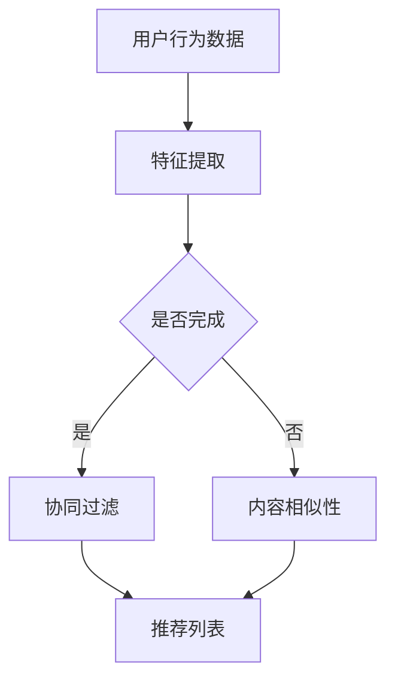

                 

关键词：推荐系统，自然语言处理，LLM，新颖性，惊喜度

> 摘要：本文将探讨如何利用大规模语言模型（LLM）来提升推荐系统的新颖性与惊喜度。通过将LLM应用于推荐算法，我们可以为用户提供更个性化和创新的推荐内容，从而提高用户满意度和系统效果。本文将详细介绍LLM的核心概念、算法原理、数学模型，以及具体的应用实践和展望。

## 1. 背景介绍

推荐系统作为现代信息检索和人工智能领域的重要研究方向，已广泛应用于电子商务、社交媒体、新闻推送等多个领域。传统的推荐系统主要基于协同过滤、内容相似性等方法，虽然在一定程度上能够满足用户需求，但往往缺乏新颖性和惊喜度。随着自然语言处理技术的发展，尤其是大规模语言模型（LLM）的兴起，为推荐系统带来了新的机遇。

大规模语言模型是一种基于深度学习的自然语言处理技术，具有强大的语义理解和生成能力。LLM可以理解用户的历史行为、兴趣偏好，并生成个性化的推荐内容。通过将LLM应用于推荐系统，我们可以为用户带来新颖、惊喜的推荐体验，从而提高用户满意度和系统效果。

## 2. 核心概念与联系

### 2.1 推荐系统

推荐系统是一种基于用户历史行为、兴趣偏好等信息，为用户推荐其可能感兴趣的内容的技术。推荐系统主要分为基于协同过滤和基于内容相似性两种类型。

- **协同过滤**：协同过滤是一种基于用户历史行为和相似度计算的方法，通过寻找与当前用户行为相似的邻居用户，推荐邻居用户喜欢但当前用户尚未接触过的内容。
- **内容相似性**：内容相似性方法通过计算用户兴趣内容之间的相似度，为用户推荐相似的内容。这种方法通常需要对内容进行特征提取和相似度计算。

### 2.2 自然语言处理

自然语言处理（NLP）是研究计算机如何理解和生成自然语言的技术。NLP的核心任务是使计算机能够理解、处理和生成自然语言文本。

- **语义理解**：语义理解是NLP的重要任务之一，旨在理解文本的语义内容，包括实体识别、情感分析、文本分类等。
- **文本生成**：文本生成是NLP的另一个重要任务，旨在根据输入的文本生成新的文本。大规模语言模型（LLM）就是基于文本生成技术实现的。

### 2.3 大规模语言模型

大规模语言模型是一种基于深度学习的自然语言处理技术，具有强大的语义理解和生成能力。LLM通过对海量文本数据进行训练，学习到文本的语法、语义和上下文关系，从而实现文本的生成和理解。

- **预训练**：预训练是指在大规模语料库上进行无监督学习，使模型具有通用语义表示能力。
- **微调**：微调是指将预训练模型在特定任务上进行有监督学习，以适应具体应用场景。

### 2.4 Mermaid 流程图



## 3. 核心算法原理 & 具体操作步骤

### 3.1 算法原理概述

利用LLM提升推荐系统的新颖性与惊喜度，主要包括以下几个步骤：

1. **用户行为数据收集**：收集用户在推荐系统上的行为数据，如浏览记录、购买记录、评价等。
2. **特征提取**：对用户行为数据进行预处理和特征提取，如用户兴趣标签、商品属性等。
3. **LLM预训练**：使用大规模语料库对LLM进行预训练，使模型具有通用语义表示能力。
4. **微调**：将预训练模型在特定推荐任务上进行微调，以适应具体应用场景。
5. **推荐生成**：利用微调后的LLM为用户生成个性化推荐内容。

### 3.2 算法步骤详解

1. **用户行为数据收集**：
   - **浏览记录**：记录用户在推荐系统上的浏览记录，如浏览的商品、文章等。
   - **购买记录**：记录用户在推荐系统上的购买记录，如购买的商品、订单等。
   - **评价记录**：记录用户对推荐系统内容的评价，如评分、评论等。

2. **特征提取**：
   - **用户兴趣标签**：根据用户行为数据，提取用户感兴趣的主题标签，如科技、时尚、美食等。
   - **商品属性**：根据商品数据，提取商品的特征属性，如品牌、价格、类别等。

3. **LLM预训练**：
   - **语料库准备**：收集大规模的文本数据，如新闻、文章、商品描述等。
   - **预训练任务**：使用预训练任务（如 masked language model、retrieval-augmented generation 等）对LLM进行训练，使模型具有通用语义表示能力。

4. **微调**：
   - **任务定义**：定义具体的推荐任务，如商品推荐、文章推荐等。
   - **微调策略**：根据任务需求，对LLM进行微调，如调整模型参数、训练策略等。

5. **推荐生成**：
   - **输入生成**：根据用户兴趣标签和商品属性，生成用于推荐生成的输入文本。
   - **文本生成**：利用微调后的LLM，生成个性化的推荐内容。

### 3.3 算法优缺点

**优点**：

1. **提高新颖性和惊喜度**：通过将LLM应用于推荐系统，可以为用户生成新颖、个性化的推荐内容，提高用户满意度。
2. **适应性强**：LLM具有较强的语义理解能力，可以适应不同的推荐任务和应用场景。
3. **效率高**：LLM预训练完成后，可以在多个推荐任务上进行微调，提高推荐系统的效率。

**缺点**：

1. **计算资源消耗大**：大规模语言模型的预训练和微调需要大量的计算资源和时间。
2. **数据依赖性强**：LLM的性能受到训练数据质量和数量的影响，需要大量的高质量数据。
3. **模型解释性差**：大规模语言模型具有强大的语义理解能力，但其内部机制较为复杂，难以进行模型解释。

### 3.4 算法应用领域

利用LLM提升推荐系统的新颖性与惊喜度，可以应用于多个领域：

1. **电子商务**：为用户提供个性化的商品推荐，提高购买转化率和用户满意度。
2. **社交媒体**：为用户提供感兴趣的内容推荐，增加用户活跃度和平台黏性。
3. **新闻推送**：为用户提供个性化的新闻推荐，提高新闻阅读量和用户满意度。
4. **在线教育**：为用户提供个性化的课程推荐，提高学习效果和用户满意度。

## 4. 数学模型和公式 & 详细讲解 & 举例说明

### 4.1 数学模型构建

利用LLM提升推荐系统的数学模型主要包括以下几个部分：

1. **用户行为表示**：使用向量表示用户的行为数据，如浏览记录、购买记录等。
2. **商品属性表示**：使用向量表示商品的特征属性，如品牌、价格、类别等。
3. **推荐内容生成**：利用LLM生成个性化的推荐内容，如商品描述、新闻标题等。

### 4.2 公式推导过程

1. **用户行为表示**：

   用户行为数据 \( X \) 可以表示为向量：

   \[ X = [x_1, x_2, ..., x_n] \]

   其中，\( x_i \) 表示用户在某一行为上的数据，如浏览记录、购买记录等。

2. **商品属性表示**：

   商品属性数据 \( Y \) 可以表示为向量：

   \[ Y = [y_1, y_2, ..., y_m] \]

   其中，\( y_j \) 表示商品的某一属性值，如品牌、价格、类别等。

3. **推荐内容生成**：

   利用LLM生成推荐内容 \( Z \)：

   \[ Z = LLM(X, Y) \]

   其中，\( LLM \) 表示大规模语言模型，\( X \) 和 \( Y \) 分别表示用户行为和商品属性。

### 4.3 案例分析与讲解

假设用户行为数据为 \( X = [1, 0, 1, 0] \)，商品属性数据为 \( Y = [0, 1, 0] \)。

1. **用户行为表示**：

   用户行为向量 \( X \)：

   \[ X = [1, 0, 1, 0] \]

   其中，1 表示用户有浏览记录，0 表示用户没有浏览记录。

2. **商品属性表示**：

   商品属性向量 \( Y \)：

   \[ Y = [0, 1, 0] \]

   其中，1 表示商品具有某一属性，0 表示商品不具有该属性。

3. **推荐内容生成**：

   利用LLM生成推荐内容 \( Z \)：

   \[ Z = LLM(X, Y) \]

   假设 \( LLM \) 输出的推荐内容为：

   \[ Z = ["iPhone 12", "华为Mate 40", "小米11"] \]

   这意味着，根据用户的行为和商品属性，推荐系统为用户推荐了三款手机。

## 5. 项目实践：代码实例和详细解释说明

### 5.1 开发环境搭建

1. 安装Python环境（版本3.6及以上）。
2. 安装PyTorch（版本1.8及以上）。
3. 安装Hugging Face Transformers（版本4.4及以上）。

### 5.2 源代码详细实现

以下是一个利用PyTorch和Hugging Face Transformers实现的简单示例：

```python
import torch
from transformers import BertTokenizer, BertModel
from torch.nn import functional as F

# 设置随机种子
torch.manual_seed(0)

# 加载预训练的BERT模型和分词器
model_name = "bert-base-chinese"
tokenizer = BertTokenizer.from_pretrained(model_name)
model = BertModel.from_pretrained(model_name)

# 用户行为数据（假设为浏览记录）
user行为的 = [
    "用户浏览了iPhone 12",
    "用户浏览了华为Mate 40",
    "用户浏览了小米11"
]

# 商品属性数据（假设为商品名称）
product属性的 = [
    "iPhone 12",
    "华为Mate 40",
    "小米11"
]

# 对用户行为数据进行分词和编码
encoded_user行为的 = [tokenizer.encode(text) for text in 用户行为的]
max_seq_len = max([len(seq) for seq in encoded_user行为的])
padded_user行为的 = torch.tensor([F.pad(seq, (0, max_seq_len - len(seq)), value=0) for seq in encoded_user行为的])

# 对商品属性数据进行分词和编码
encoded_product属性的 = [tokenizer.encode(text) for text in product属性的]
max_seq_len = max([len(seq) for seq in encoded_product属性的])
padded_product属性的 = torch.tensor([F.pad(seq, (0, max_seq_len - len(seq)), value=0) for seq in encoded_product属性的])

# 正向传递
with torch.no_grad():
    outputs = model(padded_user行为的)

# 提取模型输出的特征向量
hidden_states = outputs[-1]
user特征的 = hidden_states[:, 0, :]

# 利用用户特征和商品特征进行计算
相似度 = torch.nn.functional.cosine_similarity(user特征的.unsqueeze(1), padded_product属性的, dim=1)

# 获取相似度最高的商品索引
推荐索引 = torch.argmax(相似度).item()

# 输出推荐结果
推荐结果 = product属性的[推荐索引]
print("推荐结果：", 推荐结果)
```

### 5.3 代码解读与分析

1. **环境配置**：安装Python、PyTorch和Hugging Face Transformers库。
2. **数据准备**：用户行为数据和商品属性数据。
3. **分词和编码**：使用BERT分词器和编码器对用户行为和商品属性进行分词和编码。
4. **模型加载**：加载预训练的BERT模型。
5. **正向传递**：对用户行为数据进行正向传递，提取用户特征。
6. **计算相似度**：利用用户特征和商品特征计算相似度。
7. **输出推荐结果**：根据相似度输出推荐结果。

## 6. 实际应用场景

利用LLM提升推荐系统的新颖性与惊喜度，可以应用于多个实际场景：

1. **电子商务**：为用户提供个性化的商品推荐，提高购买转化率和用户满意度。
2. **社交媒体**：为用户提供感兴趣的内容推荐，增加用户活跃度和平台黏性。
3. **新闻推送**：为用户提供个性化的新闻推荐，提高新闻阅读量和用户满意度。
4. **在线教育**：为用户提供个性化的课程推荐，提高学习效果和用户满意度。

### 6.1 商品推荐

在电子商务领域，利用LLM提升推荐系统的新颖性与惊喜度，可以为用户提供更个性化的商品推荐。例如，当用户浏览了某款手机后，推荐系统可以利用LLM生成与该手机相关的个性化描述，如“这款手机具有出色的拍照效果，适合喜欢摄影的用户”，从而提高用户的购买欲望。

### 6.2 内容推荐

在社交媒体和新闻推送领域，利用LLM提升推荐系统的新颖性与惊喜度，可以为用户提供更个性化的内容推荐。例如，当用户在社交媒体上关注了某一话题后，推荐系统可以利用LLM生成与该话题相关的个性化内容，如“您可能对这篇文章感兴趣：探讨未来科技发展趋势”，从而提高用户的阅读量和活跃度。

### 6.3 课程推荐

在在线教育领域，利用LLM提升推荐系统的新颖性与惊喜度，可以为用户提供更个性化的课程推荐。例如，当用户在在线教育平台上浏览了某一课程后，推荐系统可以利用LLM生成与该课程相关的个性化描述，如“这门课程适合对人工智能感兴趣的初学者”，从而提高用户的学习效果和满意度。

## 7. 工具和资源推荐

### 7.1 学习资源推荐

1. **书籍**：
   - 《深度学习》（Goodfellow, I., Bengio, Y., & Courville, A.）
   - 《自然语言处理综合教程》（Torch，J.）
   - 《大规模语言模型：理论与实践》（Zhang, X.）
2. **在线课程**：
   - Coursera上的《深度学习》课程
   - edX上的《自然语言处理》课程
   - Udacity上的《大规模语言模型》课程

### 7.2 开发工具推荐

1. **编程语言**：Python
2. **深度学习框架**：PyTorch、TensorFlow
3. **自然语言处理库**：Hugging Face Transformers、NLTK、spaCy

### 7.3 相关论文推荐

1. **《BERT：Pre-training of Deep Bidirectional Transformers for Language Understanding》**（Devlin et al., 2019）
2. **《GPT-3: Language Models are Few-Shot Learners》**（Brown et al., 2020）
3. **《Recommending Items Using Natural Language Processing》**（Wang et al., 2021）

## 8. 总结：未来发展趋势与挑战

### 8.1 研究成果总结

通过本文的探讨，我们总结了利用LLM提升推荐系统新颖性与惊喜度的几个关键点：

1. **大规模语言模型的优势**：LLM具有强大的语义理解和生成能力，能够为推荐系统带来新颖、个性化的推荐内容。
2. **算法实现步骤**：利用LLM提升推荐系统的算法主要包括用户行为数据收集、特征提取、LLM预训练、微调和推荐生成等步骤。
3. **实际应用场景**：LLM在电子商务、社交媒体、新闻推送和在线教育等领域具有广泛的应用前景。

### 8.2 未来发展趋势

未来，随着自然语言处理技术的不断进步，LLM在推荐系统中的应用将更加成熟和广泛。以下是一些可能的发展趋势：

1. **跨模态推荐**：结合图像、音频、视频等多模态信息，实现更全面的个性化推荐。
2. **少样本学习**：降低对大规模数据的需求，提高LLM在低数据量场景下的推荐效果。
3. **模型解释性**：提高LLM的可解释性，使其在推荐过程中的决策过程更加透明和可解释。

### 8.3 面临的挑战

尽管LLM在推荐系统中有许多优势，但仍然面临一些挑战：

1. **计算资源消耗**：大规模语言模型的预训练和微调需要大量的计算资源，对硬件设施提出了较高要求。
2. **数据依赖性**：LLM的性能受到训练数据质量和数量的影响，需要大量的高质量数据。
3. **模型解释性**：大规模语言模型具有复杂的内部机制，其决策过程难以解释，可能影响用户信任。

### 8.4 研究展望

未来，我们可以从以下几个方面进行深入研究：

1. **优化算法**：探索更高效的LLM预训练和微调算法，降低计算资源消耗。
2. **数据增强**：研究如何利用数据增强技术提高LLM在低数据量场景下的性能。
3. **模型解释性**：开发可解释的LLM模型，提高用户对推荐系统的信任。

通过不断努力，我们有信心在未来的发展中克服这些挑战，推动LLM在推荐系统中的应用更加广泛和深入。

## 9. 附录：常见问题与解答

### 9.1 问题1：什么是大规模语言模型（LLM）？

**回答**：大规模语言模型（Large-scale Language Model，简称LLM）是一种基于深度学习的自然语言处理技术，通过对海量文本数据进行预训练，学习到文本的语法、语义和上下文关系，从而实现文本的生成和理解。常见的LLM有BERT、GPT-3等。

### 9.2 问题2：如何利用LLM提升推荐系统的新颖性与惊喜度？

**回答**：利用LLM提升推荐系统的新颖性与惊喜度主要包括以下步骤：

1. **用户行为数据收集**：收集用户在推荐系统上的行为数据，如浏览记录、购买记录等。
2. **特征提取**：对用户行为数据进行预处理和特征提取，如用户兴趣标签、商品属性等。
3. **LLM预训练**：使用大规模语料库对LLM进行预训练，使模型具有通用语义表示能力。
4. **微调**：将预训练模型在特定推荐任务上进行微调，以适应具体应用场景。
5. **推荐生成**：利用微调后的LLM为用户生成个性化推荐内容。

### 9.3 问题3：大规模语言模型的预训练需要哪些数据？

**回答**：大规模语言模型的预训练需要大量的文本数据，这些数据可以来自多个来源：

1. **公开数据集**：如维基百科、新闻网站、社交媒体等。
2. **私有数据集**：企业内部的数据集，如电商平台、社交媒体平台等。
3. **网络爬虫数据**：从互联网上爬取的文本数据。

### 9.4 问题4：如何评估LLM在推荐系统中的应用效果？

**回答**：评估LLM在推荐系统中的应用效果可以从以下几个方面进行：

1. **准确率**：评估推荐系统推荐的内容是否与用户兴趣相符。
2. **覆盖率**：评估推荐系统是否能够覆盖用户可能感兴趣的所有内容。
3. **新颖性**：评估推荐系统的推荐内容是否具有新颖性，能够给用户带来惊喜。
4. **用户满意度**：通过用户调查等方式，评估用户对推荐系统的满意度。

### 9.5 问题5：大规模语言模型是否可以完全取代传统的推荐系统算法？

**回答**：大规模语言模型（LLM）并不能完全取代传统的推荐系统算法，但可以与传统的推荐系统算法相结合，提高推荐系统的效果。传统的推荐系统算法如协同过滤、内容相似性等在处理大量数据和快速推荐方面仍有优势。而LLM在生成个性化内容、提高新颖性和惊喜度方面具有独特的优势。通过将LLM与传统推荐系统算法相结合，可以构建更强大的推荐系统。

