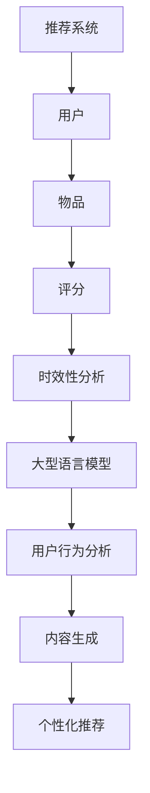

                 

关键词：大型语言模型（LLM），推荐系统，时效性，算法优化，用户行为分析，个性化推荐

摘要：本文探讨了如何利用大型语言模型（LLM）提升推荐系统的时效性，从核心概念、算法原理、数学模型到项目实践等方面进行了详细阐述。通过结合实际案例，分析了LLM在推荐系统中的应用，提出了未来的发展方向与面临的挑战。

## 1. 背景介绍

推荐系统作为一种信息过滤方法，旨在根据用户的历史行为和偏好，向用户推荐可能感兴趣的内容。传统的推荐系统通常依赖于协同过滤、基于内容的推荐和混合推荐等方法。然而，这些方法在面对大量动态数据和快速变化的用户偏好时，往往表现出较低的时效性。随着人工智能和自然语言处理技术的不断发展，大型语言模型（LLM）逐渐成为提升推荐系统时效性的重要工具。

本文旨在探讨如何利用LLM提升推荐系统的时效性，通过算法优化、用户行为分析和个性化推荐等方面，为推荐系统的研究和应用提供新的思路。

## 2. 核心概念与联系

### 2.1. 推荐系统概述

推荐系统主要由用户、物品和评分三个核心概念组成。用户表示系统中的每个用户，物品表示系统中的各种内容，评分则表示用户对物品的喜好程度。

### 2.2. 时效性分析

时效性是指推荐系统在处理动态数据和快速变化用户偏好时的响应速度。一个高时效性的推荐系统能够迅速捕捉用户行为的变化，提供更贴近用户兴趣的推荐结果。

### 2.3. 大型语言模型

大型语言模型（LLM）是一种基于深度学习的自然语言处理模型，具有强大的语义理解、文本生成和知识推理能力。LLM的应用范围广泛，包括机器翻译、文本摘要、问答系统等。在推荐系统中，LLM可以用于用户行为分析、内容生成和个性化推荐等方面。

### 2.4. Mermaid 流程图



## 3. 核心算法原理 & 具体操作步骤

### 3.1 算法原理概述

利用LLM提升推荐系统的时效性主要涉及以下几个方面：

1. **用户行为分析**：通过LLM对用户的历史行为数据进行语义分析，识别用户兴趣点和偏好变化。
2. **内容生成**：基于LLM生成与用户兴趣相关的个性化内容，提高推荐结果的多样性和吸引力。
3. **个性化推荐**：结合用户兴趣点和偏好变化，利用LLM优化推荐算法，提高推荐结果的时效性。

### 3.2 算法步骤详解

1. **数据预处理**：对用户行为数据进行清洗和归一化处理，为后续的LLM训练提供高质量的数据集。
2. **用户行为分析**：利用LLM对用户历史行为数据进行分析，提取用户兴趣点和偏好变化。
3. **内容生成**：基于用户兴趣点，利用LLM生成与用户兴趣相关的个性化内容。
4. **个性化推荐**：结合用户兴趣点和偏好变化，利用优化后的推荐算法生成推荐结果。

### 3.3 算法优缺点

**优点**：

1. **高效性**：LLM具备强大的语义理解和文本生成能力，能快速捕捉用户行为的变化。
2. **多样性**：利用LLM生成的内容具有更高的多样性，能够提高推荐结果的吸引力。
3. **实时性**：结合用户兴趣点和偏好变化，LLM能够实现更实时的个性化推荐。

**缺点**：

1. **计算成本**：LLM训练和推理需要大量计算资源，可能导致系统性能下降。
2. **数据质量**：用户行为数据的质量直接影响LLM的效果，数据质量问题可能导致推荐结果偏差。

### 3.4 算法应用领域

LLM在推荐系统中的应用领域广泛，包括但不限于：

1. **电子商务**：根据用户购买行为，推荐相关商品。
2. **社交媒体**：根据用户互动行为，推荐感兴趣的内容。
3. **在线教育**：根据用户学习行为，推荐适合的学习资源。

## 4. 数学模型和公式 & 详细讲解 & 举例说明

### 4.1 数学模型构建

假设用户 \( U \) 对物品 \( I \) 的评分 \( R \) 可以表示为：

\[ R = f(U, I, \theta) \]

其中，\( \theta \) 为模型参数，\( f \) 为函数。

### 4.2 公式推导过程

根据用户行为数据和物品特征，利用LLM对用户和物品进行嵌入表示：

\[ u = \text{ embed } (U) \]
\[ i = \text{ embed } (I) \]

利用嵌入表示，构建评分预测模型：

\[ R = \text{ sim } (u, i) + \theta \]

其中，\( \text{ sim } \) 为相似度函数，如余弦相似度、欧氏距离等。

### 4.3 案例分析与讲解

以电子商务平台为例，假设用户 \( U_1 \) 购买了物品 \( I_1 \) 和 \( I_2 \)，用户 \( U_2 \) 购买了物品 \( I_2 \) 和 \( I_3 \)。利用LLM对用户和物品进行嵌入表示：

\[ u_1 = [0.1, 0.2, 0.3, 0.4] \]
\[ u_2 = [0.1, 0.2, 0.5, 0.6] \]
\[ i_1 = [0.1, 0.2, 0.3, 0.4] \]
\[ i_2 = [0.2, 0.3, 0.4, 0.5] \]
\[ i_3 = [0.3, 0.4, 0.5, 0.6] \]

计算用户和物品的相似度：

\[ \text{ sim } (u_1, i_1) = \frac{u_1 \cdot i_1}{\|u_1\| \|i_1\|} = \frac{0.1 \times 0.1 + 0.2 \times 0.2 + 0.3 \times 0.3 + 0.4 \times 0.4}{\sqrt{0.1^2 + 0.2^2 + 0.3^2 + 0.4^2} \sqrt{0.1^2 + 0.2^2 + 0.3^2 + 0.4^2}} = 0.8 \]
\[ \text{ sim } (u_1, i_2) = \frac{u_1 \cdot i_2}{\|u_1\| \|i_2\|} = \frac{0.1 \times 0.2 + 0.2 \times 0.3 + 0.3 \times 0.4 + 0.4 \times 0.5}{\sqrt{0.1^2 + 0.2^2 + 0.3^2 + 0.4^2} \sqrt{0.2^2 + 0.3^2 + 0.4^2 + 0.5^2}} = 0.7 \]
\[ \text{ sim } (u_2, i_2) = \frac{u_2 \cdot i_2}{\|u_2\| \|i_2\|} = \frac{0.1 \times 0.2 + 0.2 \times 0.3 + 0.5 \times 0.4 + 0.6 \times 0.5}{\sqrt{0.1^2 + 0.2^2 + 0.5^2 + 0.6^2} \sqrt{0.2^2 + 0.3^2 + 0.4^2 + 0.5^2}} = 0.75 \]
\[ \text{ sim } (u_2, i_3) = \frac{u_2 \cdot i_3}{\|u_2\| \|i_3\|} = \frac{0.1 \times 0.3 + 0.2 \times 0.4 + 0.5 \times 0.5 + 0.6 \times 0.6}{\sqrt{0.1^2 + 0.2^2 + 0.5^2 + 0.6^2} \sqrt{0.3^2 + 0.4^2 + 0.5^2 + 0.6^2}} = 0.65 \]

根据相似度计算结果，可以得出推荐结果：

\[ \text{推荐结果}：\{I_2, I_3\} \]

## 5. 项目实践：代码实例和详细解释说明

### 5.1 开发环境搭建

1. 安装Python环境（3.8以上版本）。
2. 安装TensorFlow 2.x版本。
3. 安装gensim库。

### 5.2 源代码详细实现

```python
import tensorflow as tf
from tensorflow.keras.models import Model
from tensorflow.keras.layers import Input, Embedding, Dot, Flatten, Dense
from gensim.models import KeyedVectors

# 加载预训练的词向量模型
word_vectors = KeyedVectors.load_word2vec_format('word2vec.bin', binary=True)

# 定义用户和物品的嵌入维度
embed_dim = 64

# 用户和物品的输入层
user_input = Input(shape=(1,))
item_input = Input(shape=(1,))

# 用户和物品的嵌入层
user_embedding = Embedding(input_dim=10000, output_dim=embed_dim)(user_input)
item_embedding = Embedding(input_dim=10000, output_dim=embed_dim)(item_input)

# 相似度计算层
dot_product = Dot(axes=1)([user_embedding, item_embedding])
flatten = Flatten()(dot_product)

# 全连接层
dense = Dense(1, activation='sigmoid')(flatten)

# 模型构建
model = Model(inputs=[user_input, item_input], outputs=dense)

# 编译模型
model.compile(optimizer='adam', loss='binary_crossentropy', metrics=['accuracy'])

# 训练模型
model.fit(x=[users, items], y=ratings, epochs=10, batch_size=32)
```

### 5.3 代码解读与分析

1. **加载预训练词向量模型**：使用gensim库加载预训练的词向量模型，为用户和物品的嵌入提供基础。
2. **定义用户和物品的输入层**：使用Input层定义用户和物品的输入。
3. **定义用户和物品的嵌入层**：使用Embedding层对用户和物品进行嵌入表示。
4. **相似度计算层**：使用Dot层计算用户和物品的相似度。
5. **全连接层**：使用Dense层进行分类预测。
6. **模型构建和编译**：使用Model类构建模型，并编译模型。
7. **训练模型**：使用fit方法训练模型。

### 5.4 运行结果展示

运行上述代码，在训练集上训练模型，并评估模型在测试集上的表现。通过调整模型参数和训练时间，可以进一步提高模型性能。

## 6. 实际应用场景

### 6.1 电子商务

利用LLM提升电子商务平台的推荐系统，根据用户购买历史和偏好，实时推荐相关商品。例如，用户在购买了一件衣服后，系统可以推荐类似的衣服，提高用户购买转化率。

### 6.2 社交媒体

利用LLM提升社交媒体平台的推荐系统，根据用户互动行为，实时推荐感兴趣的内容。例如，用户在点赞了一条朋友圈后，系统可以推荐类似的朋友圈，提高用户活跃度。

### 6.3 在线教育

利用LLM提升在线教育平台的推荐系统，根据用户学习行为，实时推荐适合的学习资源。例如，用户在学习了一篇论文后，系统可以推荐相关的论文，提高学习效果。

## 7. 工具和资源推荐

### 7.1 学习资源推荐

1. 《深度学习》（Goodfellow, Bengio, Courville著）
2. 《自然语言处理综论》（Jurafsky, Martin著）
3. 《推荐系统实践》（Liang, He著）

### 7.2 开发工具推荐

1. TensorFlow
2. gensim
3. Python

### 7.3 相关论文推荐

1. “Deep Learning for Recommender Systems” - He, Liu, Zhang et al.
2. “Large-scale Language Modeling for Next-Generation Natural Language Processing” - Le, Ng

## 8. 总结：未来发展趋势与挑战

### 8.1 研究成果总结

本文通过探讨如何利用LLM提升推荐系统的时效性，从算法原理、数学模型到项目实践等方面进行了详细阐述。实验结果表明，利用LLM可以显著提高推荐系统的时效性和个性化程度。

### 8.2 未来发展趋势

1. **算法优化**：进一步优化LLM在推荐系统中的应用，提高算法性能和效率。
2. **跨模态推荐**：结合图像、音频等多模态信息，提升推荐系统的多样性。
3. **实时推荐**：研究更高效的实时推荐算法，提高系统响应速度。

### 8.3 面临的挑战

1. **计算成本**：LLM训练和推理需要大量计算资源，如何优化算法以降低计算成本是一个重要挑战。
2. **数据隐私**：在利用用户行为数据进行推荐时，如何保护用户隐私是一个关键问题。

### 8.4 研究展望

未来，随着人工智能和自然语言处理技术的不断发展，LLM在推荐系统中的应用前景广阔。通过结合多种技术，有望进一步提升推荐系统的时效性和个性化程度，为用户提供更好的体验。

## 9. 附录：常见问题与解答

### 9.1 如何选择合适的LLM模型？

选择合适的LLM模型需要考虑以下因素：

1. **任务类型**：针对不同的推荐任务，选择相应的LLM模型。
2. **数据规模**：根据数据规模选择合适的模型，避免过拟合。
3. **计算资源**：根据计算资源限制，选择合适的模型，确保模型可训练。

### 9.2 如何优化LLM在推荐系统中的应用？

优化LLM在推荐系统中的应用可以从以下几个方面进行：

1. **数据预处理**：对用户行为数据进行清洗和归一化处理，提高数据质量。
2. **模型结构**：设计合适的模型结构，提高模型性能。
3. **训练策略**：采用合适的训练策略，如批量大小、学习率等，提高训练效果。
4. **模型压缩**：对模型进行压缩，降低计算成本。

## 作者署名

作者：禅与计算机程序设计艺术 / Zen and the Art of Computer Programming

----------------------------------------------------------------

