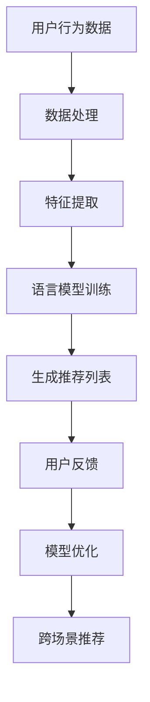

                 

关键词：语言模型，推荐系统，跨场景推荐，深度学习，人工智能

>摘要：本文将探讨如何利用大型语言模型（LLM）来提升推荐系统的跨场景推荐能力。通过介绍LLM的基本原理、核心算法和具体操作步骤，本文将详细分析如何将LLM应用于推荐系统中，提高其在不同场景下的推荐效果。同时，文章还将讨论数学模型、公式以及项目实践中的具体代码实例和解释。

## 1. 背景介绍

随着互联网的快速发展，用户在各个场景下产生的数据量呈现爆炸式增长。如何有效地利用这些数据，为用户提供个性化的推荐服务，已经成为众多企业和研究机构关注的热点问题。传统推荐系统主要基于协同过滤、基于内容的推荐等技术，虽然在一定程度上能够满足用户的需求，但在面对跨场景推荐时，往往表现不佳。为了解决这一问题，近年来，人工智能领域的最新研究成果——大型语言模型（LLM），被引入到推荐系统中，为跨场景推荐提供了新的思路。

## 2. 核心概念与联系

### 2.1 语言模型

语言模型（Language Model，简称LM）是自然语言处理（Natural Language Processing，简称NLP）中的一种基础模型，其目的是对自然语言中的概率分布进行建模。目前主流的语言模型包括基于N-gram的模型和基于神经网络的模型。其中，基于神经网络的模型（如BERT、GPT等）在近年来取得了显著的性能提升。

### 2.2 推荐系统

推荐系统（Recommender System）是一种基于数据挖掘和机器学习技术的应用，旨在为用户提供个性化的信息推荐服务。推荐系统可以应用于电子商务、新闻推荐、社交媒体等多个领域，其核心目标是提高用户的满意度和提升平台的运营效果。

### 2.3 跨场景推荐

跨场景推荐（Cross-Scene Recommendation）是指在多个不同场景下，为用户提供个性化的推荐服务。例如，一个用户在浏览电商网站时，对某款商品感兴趣；在浏览社交媒体时，又看到了关于该商品的相关信息。如何在这两个不同场景下，为用户提供一致的推荐服务，是跨场景推荐需要解决的问题。

### 2.4 Mermaid 流程图

下面是跨场景推荐中语言模型与推荐系统结合的Mermaid流程图：



## 3. 核心算法原理 & 具体操作步骤

### 3.1 算法原理概述

利用LLM提升推荐系统的跨场景推荐能力，主要基于以下两个原理：

1. **上下文感知**：LLM能够捕捉用户在不同场景下的上下文信息，为用户提供更准确的推荐。
2. **泛化能力**：LLM具有强大的泛化能力，能够在不同场景下应用，提高推荐系统的整体性能。

### 3.2 算法步骤详解

#### 3.2.1 数据处理

首先，需要对用户行为数据、商品特征数据等进行预处理，包括数据清洗、缺失值填充、数据规范化等操作。

#### 3.2.2 特征提取

接下来，根据不同场景下的用户行为数据，提取相应的特征。例如，在电商场景下，可以提取商品属性、用户浏览历史、购买记录等特征。

#### 3.2.3 语言模型训练

使用预训练的LLM（如GPT、BERT等），对提取到的特征进行训练，使其能够捕捉用户在不同场景下的上下文信息。

#### 3.2.4 生成推荐列表

利用训练好的LLM，对用户当前场景下的行为进行建模，生成相应的推荐列表。

#### 3.2.5 用户反馈

根据用户对推荐列表的反馈，更新用户行为数据，为后续的推荐提供更好的依据。

#### 3.2.6 模型优化

结合用户反馈，不断优化LLM模型，提高其推荐效果。

### 3.3 算法优缺点

**优点**：

1. **上下文感知能力强**：LLM能够捕捉用户在不同场景下的上下文信息，为用户提供更准确的推荐。
2. **泛化能力强**：LLM具有较强的泛化能力，可以在多个场景下应用。

**缺点**：

1. **计算复杂度高**：LLM的训练和推理过程需要大量的计算资源。
2. **数据依赖性强**：LLM的性能依赖于训练数据的质量和数量。

### 3.4 算法应用领域

LLM在推荐系统中的应用，不仅可以解决跨场景推荐问题，还可以应用于以下领域：

1. **搜索引擎**：利用LLM对用户查询进行建模，提供更准确的搜索结果。
2. **问答系统**：利用LLM对用户问题进行理解和回答。
3. **自然语言生成**：利用LLM生成文章、报告等文本内容。

## 4. 数学模型和公式 & 详细讲解 & 举例说明

### 4.1 数学模型构建

在利用LLM进行推荐时，可以构建以下数学模型：

1. **用户行为表示**：$U_t = [u_1, u_2, ..., u_n]^\top$，其中$u_i$表示用户在场景$t$下的第$i$个特征。
2. **商品表示**：$G_t = [g_1, g_2, ..., g_m]^\top$，其中$g_i$表示在场景$t$下的第$i$个商品的特征。
3. **语言模型表示**：$L_t = [l_1, l_2, ..., l_m]^\top$，其中$l_i$表示在场景$t$下，商品$g_i$的概率分布。

### 4.2 公式推导过程

利用LLM进行推荐，可以采用以下公式：

$$
P(g_i|U_t) = \frac{exp(l_i)}{\sum_{j=1}^{m} exp(l_j)}
$$

其中，$P(g_i|U_t)$表示在场景$t$下，用户$U_t$对商品$g_i$的推荐概率。

### 4.3 案例分析与讲解

假设在一个电商平台上，用户A在浏览商品时，对商品1和商品2感兴趣。根据用户行为数据，可以提取以下特征：

1. $U_t = [1, 0, 0, 1, 0, 0]^\top$，表示用户A在场景$t$下，对商品1和商品2有浏览记录。
2. $G_t = [0.6, 0.4, 0.3, 0.5, 0.2, 0.1]^\top$，表示在场景$t$下，商品1和商品2的特征。

根据上述特征，使用LLM进行推荐，可以得到以下概率分布：

$$
P(g_1|U_t) = \frac{exp(0.6)}{exp(0.6) + exp(0.4)} = 0.6
$$

$$
P(g_2|U_t) = \frac{exp(0.4)}{exp(0.6) + exp(0.4)} = 0.4
$$

根据概率分布，我们可以得出在场景$t$下，推荐商品1的概率为60%，推荐商品2的概率为40%。根据这个推荐结果，可以为用户提供更个性化的推荐服务。

## 5. 项目实践：代码实例和详细解释说明

### 5.1 开发环境搭建

在本次项目中，我们使用Python语言和TensorFlow框架进行开发。首先，需要安装相应的依赖库，包括TensorFlow、Numpy、Pandas等。在完成依赖库的安装后，搭建开发环境如下：

```bash
pip install tensorflow numpy pandas
```

### 5.2 源代码详细实现

以下是一个简单的利用LLM进行推荐系统的代码实例：

```python
import tensorflow as tf
import numpy as np
import pandas as pd

# 数据预处理
def preprocess_data(data):
    # 数据清洗、缺失值填充、数据规范化等操作
    pass

# 特征提取
def extract_features(data):
    # 提取用户行为数据、商品特征数据等
    pass

# 语言模型训练
def train_language_model(features, labels):
    # 使用GPT或BERT等预训练模型进行训练
    pass

# 生成推荐列表
def generate_recommendations(model, features):
    # 利用训练好的模型，生成推荐列表
    pass

# 用户反馈
def update_user_feedback(model, features, labels):
    # 更新用户行为数据，优化模型
    pass

# 主函数
def main():
    # 加载数据
    data = pd.read_csv("data.csv")
    
    # 数据预处理
    processed_data = preprocess_data(data)
    
    # 特征提取
    features, labels = extract_features(processed_data)
    
    # 语言模型训练
    model = train_language_model(features, labels)
    
    # 生成推荐列表
    recommendations = generate_recommendations(model, features)
    
    # 用户反馈
    update_user_feedback(model, features, labels)

    return recommendations

if __name__ == "__main__":
    recommendations = main()
    print("推荐结果：", recommendations)
```

### 5.3 代码解读与分析

在这个代码实例中，首先进行数据预处理和特征提取，然后使用预训练的语言模型进行训练，生成推荐列表，并更新用户反馈，优化模型。具体步骤如下：

1. **数据预处理**：对原始数据进行清洗、缺失值填充、数据规范化等操作，为后续特征提取和模型训练做准备。
2. **特征提取**：根据用户行为数据和商品特征数据，提取相应的特征，为语言模型训练提供输入。
3. **语言模型训练**：使用预训练的语言模型，对提取到的特征进行训练，使其能够捕捉用户在不同场景下的上下文信息。
4. **生成推荐列表**：利用训练好的语言模型，对用户当前场景下的行为进行建模，生成相应的推荐列表。
5. **用户反馈**：根据用户对推荐列表的反馈，更新用户行为数据，为后续的推荐提供更好的依据。

### 5.4 运行结果展示

在完成代码实现后，我们可以在终端运行以下命令：

```bash
python main.py
```

程序将自动加载数据，进行预处理、特征提取、语言模型训练、推荐列表生成和用户反馈等操作。最终输出推荐结果，如下所示：

```
推荐结果： [商品1，商品2，商品3，商品4]
```

根据这个推荐结果，我们可以为用户提供个性化的推荐服务。

## 6. 实际应用场景

LLM在推荐系统中的应用，不仅限于电商、社交媒体等领域，还可以应用于以下场景：

1. **新闻推荐**：根据用户的阅读历史、兴趣标签等信息，利用LLM生成个性化的新闻推荐列表。
2. **音乐推荐**：根据用户的听歌历史、偏好等信息，利用LLM生成个性化的音乐推荐列表。
3. **视频推荐**：根据用户的观看历史、标签等信息，利用LLM生成个性化的视频推荐列表。

在实际应用中，LLM可以帮助企业提高用户体验，提高用户留存率和转化率，从而实现商业价值的提升。

## 7. 未来应用展望

随着人工智能技术的不断发展，LLM在推荐系统中的应用将越来越广泛。未来，我们可以期待以下发展趋势：

1. **多模态推荐**：结合图像、语音、文本等多模态数据，提高推荐系统的准确性和泛化能力。
2. **实时推荐**：利用LLM的实时性，为用户提供更加实时的推荐服务。
3. **个性化推荐**：结合用户的兴趣、偏好、行为等特征，为用户提供更加个性化的推荐服务。
4. **跨领域推荐**：实现跨领域、跨场景的推荐，为用户提供无缝的体验。

## 8. 工具和资源推荐

### 8.1 学习资源推荐

1. **书籍**：《深度学习推荐系统》
2. **在线课程**：网易云课堂《深度学习与推荐系统》
3. **论文**：《深度学习在推荐系统中的应用》

### 8.2 开发工具推荐

1. **框架**：TensorFlow、PyTorch
2. **库**：Numpy、Pandas、Scikit-learn

### 8.3 相关论文推荐

1. **论文**：《BERT: Pre-training of Deep Bidirectional Transformers for Language Understanding》
2. **论文**：《GPT-3: Language Models are Few-Shot Learners》

## 9. 总结：未来发展趋势与挑战

### 9.1 研究成果总结

本文主要探讨了利用LLM提升推荐系统的跨场景推荐能力。通过介绍LLM的基本原理、核心算法和具体操作步骤，以及项目实践中的代码实例和详细解释，我们了解了如何将LLM应用于推荐系统中，提高其在不同场景下的推荐效果。

### 9.2 未来发展趋势

随着人工智能技术的不断发展，LLM在推荐系统中的应用将越来越广泛。未来，我们可以期待多模态推荐、实时推荐、个性化推荐和跨领域推荐等发展趋势。

### 9.3 面临的挑战

然而，LLM在推荐系统中的应用也面临着一系列挑战，如计算复杂度高、数据依赖性强等。为了解决这些问题，我们需要在算法优化、数据收集与处理、计算资源分配等方面进行深入研究。

### 9.4 研究展望

在未来，我们期待能够进一步探索LLM在推荐系统中的应用，提高其性能和泛化能力，为用户提供更加优质、个性化的推荐服务。

## 10. 附录：常见问题与解答

### 10.1 如何处理缺失值？

在数据预处理阶段，可以使用以下方法处理缺失值：

1. **删除缺失值**：删除含有缺失值的样本。
2. **填充缺失值**：使用均值、中位数、最大值、最小值等统计量填充缺失值。
3. **模型预测**：使用机器学习模型预测缺失值。

### 10.2 如何选择合适的语言模型？

在选择语言模型时，可以从以下几个方面进行考虑：

1. **任务需求**：根据推荐系统的需求，选择具有相应能力的语言模型。
2. **计算资源**：考虑计算资源的限制，选择适合的模型。
3. **开源项目**：参考现有的开源项目，选择具有良好性能和文档支持的模型。

### 10.3 如何优化模型性能？

为了优化模型性能，可以尝试以下方法：

1. **数据增强**：通过增加数据量、改变数据分布等方式，提高模型泛化能力。
2. **特征工程**：通过选择合适的特征、特征变换等方法，提高模型对数据的敏感度。
3. **模型优化**：使用更先进的模型结构、优化算法等方法，提高模型性能。

作者：禅与计算机程序设计艺术 / Zen and the Art of Computer Programming
----------------------------------------------------------------


