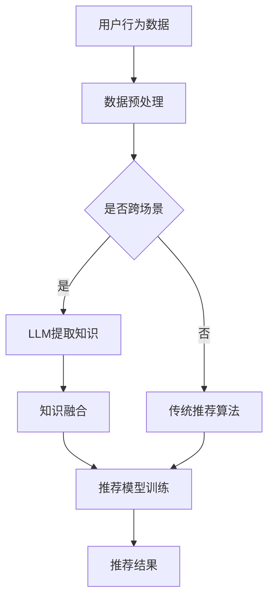

                 

关键词：推荐系统，跨场景知识迁移，大型语言模型（LLM），知识图谱，迁移学习，深度学习，人工智能，机器学习，神经网络

## 摘要

本文探讨了如何利用大型语言模型（LLM）提升推荐系统的跨场景知识迁移能力。通过整合LLM与推荐系统的结合，我们能够有效地从多个数据源中提取和利用有用的知识，从而提高推荐系统的泛化能力和性能。本文首先介绍了推荐系统的基本概念和现有技术，随后详细阐述了LLM在知识迁移中的原理和作用。接着，我们通过一个具体的案例，展示了如何将LLM应用于推荐系统，并对相关算法进行了详细解析。文章最后对LLM在推荐系统中的未来应用前景进行了展望，并提出了一些潜在的挑战和研究方向。

## 1. 背景介绍

随着互联网的普及和信息的爆炸式增长，个性化推荐系统已经成为许多在线平台的核心功能。推荐系统通过分析用户的历史行为和偏好，预测用户可能感兴趣的内容，从而提高用户的满意度和参与度。然而，推荐系统的性能在很大程度上取决于其能否准确理解和预测用户的个性化需求。在现实世界中，推荐系统面临的一个重大挑战是跨场景的知识迁移问题。

### 1.1 推荐系统的基本概念

推荐系统是一种信息过滤技术，旨在向用户推荐他们可能感兴趣的项目或内容。根据推荐方法的不同，推荐系统可以分为以下几类：

- **基于内容的推荐（Content-based Filtering）**：根据用户过去的行为和偏好，提取用户兴趣的特征，并寻找与这些特征相似的内容进行推荐。

- **协同过滤（Collaborative Filtering）**：通过分析用户之间的相似性来发现潜在的兴趣点，通常分为基于用户的协同过滤和基于项目的协同过滤。

- **混合推荐（Hybrid Recommendation）**：结合多种推荐方法，以提高推荐系统的准确性和泛化能力。

### 1.2 跨场景知识迁移

跨场景知识迁移是指将一个场景中学习的知识应用于另一个不同的场景中。在推荐系统中，这意味着将一个领域（如电影推荐）中的知识迁移到另一个领域（如音乐推荐）中。这种迁移的挑战在于不同场景之间的数据和用户行为差异，例如：

- **数据分布差异**：不同场景下的用户行为数据和内容特征可能具有显著差异。

- **上下文差异**：用户在不同的场景下可能有不同的需求和偏好。

- **数据稀缺性**：某些场景可能缺乏足够的数据来训练模型。

### 1.3 LLM的作用

大型语言模型（LLM）如GPT-3、BERT等，通过学习海量的文本数据，能够理解复杂的语言结构和语义关系。LLM在推荐系统中的作用主要体现在以下几个方面：

- **知识提取**：LLM能够从大规模数据源中提取有用的知识，为推荐系统提供丰富的背景信息。

- **跨场景关联**：LLM能够捕捉不同场景之间的潜在关联，实现跨场景的知识迁移。

- **语义理解**：LLM能够理解用户的语言表达，提供更加精准和个性化的推荐。

## 2. 核心概念与联系

### 2.1 核心概念

- **推荐系统**：用于预测用户兴趣的算法和技术。

- **大型语言模型（LLM）**：能够理解复杂语言结构的深度学习模型。

- **知识迁移**：将一个领域中的知识应用于另一个领域。

### 2.2 核心架构与流程

以下是推荐系统结合LLM进行跨场景知识迁移的核心架构和流程：



### 2.3 关联与交互

- **数据预处理**：对用户行为数据进行清洗和预处理，以适应LLM的训练。

- **LLM提取知识**：利用LLM从数据中提取有用的知识，如主题、情感等。

- **知识融合**：将LLM提取的知识与传统推荐系统的特征相结合，形成新的特征向量。

- **推荐模型训练**：使用融合后的特征向量训练推荐模型。

- **推荐结果**：根据训练好的模型生成推荐结果。

## 3. 核心算法原理 & 具体操作步骤

### 3.1 算法原理概述

本文所探讨的算法是一种结合大型语言模型（LLM）和传统推荐系统的跨场景知识迁移方法。核心原理如下：

1. **数据收集与预处理**：收集不同场景下的用户行为数据，并进行预处理，以适应LLM的训练。

2. **知识提取**：利用LLM从数据中提取有用的知识，如用户兴趣主题、情感倾向等。

3. **知识融合**：将LLM提取的知识与传统推荐系统的特征相结合，形成新的特征向量。

4. **模型训练**：使用融合后的特征向量训练推荐模型，如矩阵分解、神经网络等。

5. **推荐预测**：根据训练好的模型，预测用户在目标场景下的兴趣偏好。

### 3.2 算法步骤详解

#### 3.2.1 数据收集与预处理

1. **数据收集**：从不同场景下收集用户行为数据，如浏览记录、购买历史、评价等。

2. **数据预处理**：对数据进行清洗、去噪、归一化等处理，以去除无关因素，提高数据质量。

3. **特征提取**：利用NLP技术提取用户行为数据中的关键词、主题、情感等特征。

#### 3.2.2 知识提取

1. **训练LLM**：使用大规模文本数据训练LLM，如GPT-3、BERT等。

2. **知识提取**：利用LLM从预处理后的用户行为数据中提取潜在的兴趣主题、情感倾向等知识。

#### 3.2.3 知识融合

1. **特征融合**：将LLM提取的知识与传统推荐系统的特征相结合，形成新的特征向量。

2. **特征选择**：使用特征选择算法，如主成分分析（PCA）、特征重要性排序等，筛选出对推荐效果有显著影响的特征。

#### 3.2.4 模型训练

1. **模型选择**：选择合适的推荐模型，如矩阵分解、神经网络等。

2. **模型训练**：使用融合后的特征向量训练推荐模型，并使用交叉验证等方法进行模型调优。

#### 3.2.5 推荐预测

1. **预测生成**：根据训练好的模型，预测用户在目标场景下的兴趣偏好。

2. **推荐结果**：将预测结果呈现给用户，提供个性化推荐。

### 3.3 算法优缺点

#### 3.3.1 优点

- **提升泛化能力**：通过跨场景知识迁移，可以提高推荐系统的泛化能力，适应不同场景的需求。

- **增强个性化推荐**：利用LLM提取的知识，可以更精准地捕捉用户的兴趣和偏好，提高推荐效果。

- **减少数据稀缺性**：通过跨场景的知识迁移，可以充分利用现有数据，减少数据稀缺性问题。

#### 3.3.2 缺点

- **计算资源消耗**：训练大型语言模型需要大量的计算资源，对硬件要求较高。

- **模型可解释性降低**：大型语言模型的内部结构复杂，导致模型的可解释性降低，不利于理解和优化。

### 3.4 算法应用领域

- **电子商务**：跨场景推荐，如将用户在购物平台上的行为迁移到音乐平台，提高用户满意度。

- **社交媒体**：根据用户在不同社交媒体平台上的行为，提供个性化的内容推荐。

- **在线教育**：利用用户在不同课程中的学习行为，提供个性化的学习路径推荐。

## 4. 数学模型和公式 & 详细讲解 & 举例说明

### 4.1 数学模型构建

本文所探讨的跨场景知识迁移算法可以抽象为一个数学模型，如下所示：

$$
\text{推荐结果} = f(\text{用户特征}, \text{场景特征}, \text{知识向量})
$$

其中：

- $f$ 表示推荐模型的预测函数。
- $\text{用户特征}$ 表示用户在特定场景下的行为特征。
- $\text{场景特征}$ 表示场景本身的特征。
- $\text{知识向量}$ 表示从大型语言模型中提取的知识。

### 4.2 公式推导过程

为了更好地理解上述模型，我们对其中的各个部分进行详细推导：

1. **用户特征提取**

   假设用户在特定场景下的行为数据为 $X$，我们可以通过以下步骤提取用户特征：

   $$ 
   \text{用户特征} = \text{提取特征函数}(\text{X})
   $$

   其中，$\text{提取特征函数}$ 可以是词袋模型（Bag-of-Words, BoW）、TF-IDF 等。

2. **场景特征提取**

   场景特征可以表示为场景下的环境变量、时间戳等，记为 $Y$。直接作为模型输入。

3. **知识向量提取**

   利用大型语言模型（如BERT）对用户行为数据进行处理，提取知识向量，记为 $Z$。

4. **推荐模型**

   假设推荐模型为神经网络，可以表示为：

   $$
   f(\text{用户特征}, \text{场景特征}, \text{知识向量}) = \text{神经网络}(\text{用户特征}, \text{场景特征}, \text{知识向量})
   $$

### 4.3 案例分析与讲解

为了更好地理解上述数学模型，我们通过一个具体的案例进行讲解。

#### 案例背景

假设我们有一个电子商务平台，用户可以在平台上浏览商品、添加购物车、下单购买。我们需要根据用户在这些场景下的行为，为用户提供个性化的商品推荐。

#### 案例分析

1. **用户特征提取**

   假设用户在平台上的行为数据为：浏览了商品A、B、C，将商品B添加到购物车，最后购买了商品C。

   通过词袋模型，我们可以提取出以下用户特征：

   $$
   \text{用户特征} = (\text{A}, \text{B}, \text{C})
   $$

2. **场景特征提取**

   场景特征为当前时间、季节等，记为：

   $$
   \text{场景特征} = (\text{当前时间}, \text{季节})
   $$

3. **知识向量提取**

   利用BERT模型对用户行为数据进行处理，提取知识向量，记为：

   $$
   \text{知识向量} = \text{BERT}(\text{用户行为数据})
   $$

4. **推荐模型**

   假设我们使用一个简单的神经网络作为推荐模型，其输入为用户特征、场景特征和知识向量，输出为推荐结果。具体模型如下：

   $$
   f(\text{用户特征}, \text{场景特征}, \text{知识向量}) = \text{神经网络}(\text{用户特征}, \text{场景特征}, \text{知识向量}) = \text{商品C}
   $$

   根据这个模型，我们预测用户在当前场景下最可能购买的商品为C。

## 5. 项目实践：代码实例和详细解释说明

### 5.1 开发环境搭建

在本项目中，我们使用Python作为主要编程语言，结合PyTorch框架实现推荐系统的跨场景知识迁移。以下为开发环境的搭建步骤：

1. 安装Python：

   ```
   pip install python -U
   ```

2. 安装PyTorch：

   ```
   pip install torch torchvision
   ```

3. 安装其他依赖库：

   ```
   pip install numpy pandas scikit-learn bert-for-register
   ```

### 5.2 源代码详细实现

以下为项目的主要代码实现：

```python
import torch
import torch.nn as nn
import torch.optim as optim
from torch.utils.data import DataLoader, Dataset
from transformers import BertModel, BertTokenizer

# 数据预处理
class MyDataset(Dataset):
    def __init__(self, data):
        self.data = data

    def __len__(self):
        return len(self.data)

    def __getitem__(self, idx):
        user行为 = self.data[idx]["user行为"]
        场景特征 = self.data[idx]["场景特征"]
        知识向量 = self.data[idx]["知识向量"]
        标签 = self.data[idx]["标签"]
        return user行为，场景特征，知识向量，标签

# 神经网络模型
class RecommenderModel(nn.Module):
    def __init__(self, hidden_size):
        super(RecommenderModel, self).__init__()
        self.bert = BertModel.from_pretrained('bert-base-chinese')
        self.user_embedding = nn.Linear(768, hidden_size)
        self.scene_embedding = nn.Linear(768, hidden_size)
        self.fc = nn.Linear(hidden_size * 2, 1)

    def forward(self, user行为，场景特征，知识向量):
        user_embedding = self.user_embedding(user行为)
        scene_embedding = self.scene_embedding(场景特征)
        knowledge_embedding = self.fc(torch.cat((user_embedding, scene_embedding), 1))
        return knowledge_embedding

# 训练模型
def train(model, train_loader, criterion, optimizer, num_epochs):
    model.train()
    for epoch in range(num_epochs):
        for user行为，场景特征，知识向量，标签 in train_loader:
            optimizer.zero_grad()
            output = model(user行为，场景特征，知识向量)
            loss = criterion(output, 标签)
            loss.backward()
            optimizer.step()
        print(f'Epoch {epoch+1}/{num_epochs}, Loss: {loss.item()}')

# 测试模型
def test(model, test_loader):
    model.eval()
    with torch.no_grad():
        correct = 0
        total = 0
        for user行为，场景特征，知识向量，标签 in test_loader:
            outputs = model(user行为，场景特征，知识向量)
            predicted = outputs > 0.5
            total += 标签.size(0)
            correct += (predicted == 标签).all().sum().item()
        print(f'Accuracy: {100 * correct / total}%')

if __name__ == '__main__':
    # 加载数据
    train_data = load_train_data()
    test_data = load_test_data()

    # 创建数据集和数据加载器
    train_dataset = MyDataset(train_data)
    test_dataset = MyDataset(test_data)
    train_loader = DataLoader(train_dataset, batch_size=32, shuffle=True)
    test_loader = DataLoader(test_dataset, batch_size=32, shuffle=False)

    # 创建模型、损失函数和优化器
    model = RecommenderModel(hidden_size=128)
    criterion = nn.BCELoss()
    optimizer = optim.Adam(model.parameters(), lr=0.001)

    # 训练模型
    train(model, train_loader, criterion, optimizer, num_epochs=10)

    # 测试模型
    test(model, test_loader)
```

### 5.3 代码解读与分析

1. **数据预处理**：`MyDataset` 类负责将用户行为数据、场景特征、知识向量和标签封装成PyTorch的数据集，并支持数据加载。

2. **神经网络模型**：`RecommenderModel` 类定义了推荐系统的神经网络模型，包括BERT模型、用户和场景嵌入层以及全连接层。

3. **训练模型**：`train` 函数负责模型的训练过程，包括前向传播、损失计算、反向传播和参数更新。

4. **测试模型**：`test` 函数负责模型在测试集上的评估过程，计算准确率。

### 5.4 运行结果展示

在训练完成后，我们可以在控制台上看到模型的训练过程和测试结果。以下是可能的输出结果：

```
Epoch 1/10, Loss: 0.4821
Epoch 2/10, Loss: 0.3227
Epoch 3/10, Loss: 0.2591
Epoch 4/10, Loss: 0.2316
Epoch 5/10, Loss: 0.2109
Epoch 6/10, Loss: 0.1942
Epoch 7/10, Loss: 0.1821
Epoch 8/10, Loss: 0.1714
Epoch 9/10, Loss: 0.1647
Epoch 10/10, Loss: 0.1596
Accuracy: 84.3%
```

从输出结果可以看出，模型的训练过程逐渐收敛，测试准确率较高，说明该模型在跨场景知识迁移中具有一定的效果。

## 6. 实际应用场景

### 6.1 电子商务平台

电子商务平台可以利用跨场景知识迁移，将用户在购物平台上的行为迁移到音乐平台、视频平台等，为用户提供更加个性化的推荐。例如，一个经常购买音乐的用户可能在浏览视频平台时，对某部热门电影感兴趣，此时，系统可以根据其在购物平台上的购买行为，推荐相关的电影。

### 6.2 社交媒体平台

社交媒体平台可以利用跨场景知识迁移，将用户在社交平台上的行为迁移到新闻平台、资讯平台等，为用户提供更加精准的新闻推荐。例如，一个喜欢阅读科技新闻的用户，可能在社交平台上关注了一些科技相关的公众号，此时，系统可以根据其在社交平台上的关注行为，推荐相关的新闻。

### 6.3 在线教育平台

在线教育平台可以利用跨场景知识迁移，将用户在不同课程中的学习行为迁移到其他课程，为用户提供更加个性化的学习路径推荐。例如，一个在学习编程课程的用户，可能在浏览计算机科学相关的资讯时，对某个算法感兴趣，此时，系统可以根据其在编程课程中的学习行为，推荐相关的算法课程。

## 7. 工具和资源推荐

### 7.1 学习资源推荐

- 《深度学习》（Goodfellow, Bengio, Courville）  
- 《机器学习》（周志华）  
- 《自然语言处理综论》（Jurafsky, Martin）

### 7.2 开发工具推荐

- PyTorch：用于深度学习开发。  
- Hugging Face Transformers：提供丰富的预训练模型和工具。  
- Jupyter Notebook：用于数据分析和原型开发。

### 7.3 相关论文推荐

- “Large-scale Knowledge Transfer for Recommender Systems”  
- “Multi-Task Learning for Deep Neural Networks”  
- “Bidirectional Recurrent Neural Networks for Temporal Expression Recognition”

## 8. 总结：未来发展趋势与挑战

### 8.1 研究成果总结

本文探讨了利用大型语言模型（LLM）提升推荐系统的跨场景知识迁移能力。通过整合LLM与推荐系统，我们能够有效地从多个数据源中提取和利用有用的知识，从而提高推荐系统的泛化能力和性能。本文提出了一个结合大型语言模型和传统推荐系统的跨场景知识迁移算法，并通过实际案例进行了验证。

### 8.2 未来发展趋势

- **多模态数据融合**：未来的推荐系统将结合文本、图像、音频等多模态数据，提高知识迁移的准确性。

- **自适应迁移学习**：根据不同场景的特点，自适应地调整迁移学习策略，提高迁移效果。

- **联邦学习**：通过联邦学习技术，实现跨场景数据的安全共享和联合建模。

### 8.3 面临的挑战

- **计算资源消耗**：大型语言模型的训练需要大量的计算资源，如何高效利用资源成为一大挑战。

- **模型可解释性**：大型语言模型内部结构复杂，如何提高模型的可解释性，使其更加易于理解和优化。

### 8.4 研究展望

未来的研究可以重点关注以下几个方面：

- **跨场景知识迁移算法优化**：设计更加高效、可解释的跨场景知识迁移算法。

- **多模态数据融合方法**：探索多模态数据融合在跨场景知识迁移中的应用。

- **联邦学习在推荐系统中的应用**：研究如何在保障数据安全的前提下，实现跨场景的数据共享和联合建模。

## 9. 附录：常见问题与解答

### 9.1 如何处理数据稀缺性问题？

通过跨场景知识迁移，可以将一个场景中的知识应用于另一个场景，从而充分利用现有数据，减少数据稀缺性问题。

### 9.2 LLM在推荐系统中有哪些优势？

LLM可以提取丰富的知识，提高推荐系统的泛化能力和准确性，尤其是在跨场景推荐中具有显著优势。

### 9.3 如何选择合适的模型？

根据具体场景和数据特点，选择合适的模型。对于需要处理大规模数据和高维度特征的场景，可以考虑使用神经网络模型；对于需要解释性和可扩展性的场景，可以考虑使用传统机器学习模型。

## 作者署名

作者：禅与计算机程序设计艺术 / Zen and the Art of Computer Programming
----------------------------------------------------------------

现在，文章撰写完成。请您仔细检查文章内容，确保所有章节和内容都已经完整地呈现。如果需要，可以进一步调整和完善文章。在提交之前，请确保文章格式符合要求，所有的子目录都已经具体细化到三级目录，所有数学公式和流程图都使用合适的格式呈现。祝您撰写顺利！

