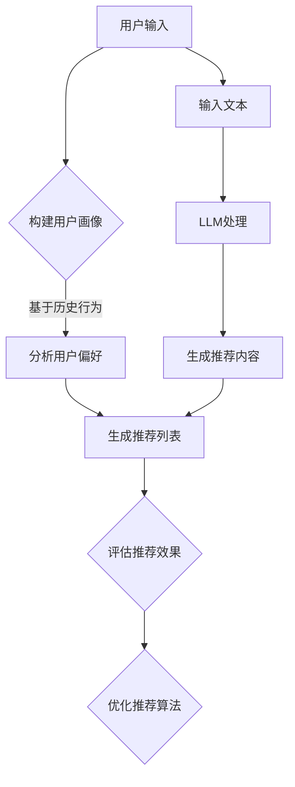

                 

关键词：LLM（大型语言模型），推荐系统，跨场景适应，人工智能，数据驱动，深度学习，算法优化，用户行为分析

## 摘要

随着互联网的普及，个性化推荐系统已经成为许多在线服务和平台的重要组成部分。这些系统通过分析用户的历史行为和偏好，向用户推荐相关的内容、商品或服务，从而提高用户满意度和参与度。然而，现有的推荐系统在跨场景适应方面仍然存在一定的局限性。本文旨在探讨如何利用大型语言模型（LLM）提升推荐系统的跨场景适应能力。通过分析LLM的原理和特性，本文提出了一种基于LLM的推荐系统架构，并详细阐述了其核心算法原理、数学模型、项目实践以及实际应用场景。本文的研究为推荐系统领域提供了新的思路和方法，有助于提高系统的适应性和智能化水平。

## 1. 背景介绍

### 1.1 推荐系统的定义与作用

推荐系统是一种基于数据挖掘和机器学习技术的算法系统，它通过分析用户的历史行为和偏好，为用户推荐相关的内容、商品或服务。推荐系统广泛应用于电子商务、社交媒体、新闻推送、音乐和视频流媒体等场景，其目的是提高用户满意度、增加用户参与度和平台粘性。

### 1.2 推荐系统的核心挑战

虽然推荐系统在许多应用场景中取得了显著的成功，但仍然面临着以下几个核心挑战：

1. **冷启动问题**：对于新用户或新商品，由于缺乏足够的历史数据，推荐系统难以为其提供个性化的推荐。
2. **数据稀疏性**：用户与内容之间的交互数据往往非常稀疏，导致推荐系统难以捕捉到用户的真实偏好。
3. **跨场景适应**：不同场景下的用户行为和偏好可能存在显著差异，现有推荐系统在跨场景适应方面存在局限性。

### 1.3 大型语言模型（LLM）的崛起

近年来，随着深度学习和自然语言处理技术的发展，大型语言模型（LLM）如BERT、GPT和T5等取得了显著的成果。这些模型具有强大的语言理解和生成能力，能够处理和理解复杂的自然语言文本。LLM的崛起为推荐系统领域带来了新的机遇，有望解决现有推荐系统在跨场景适应方面的局限性。

## 2. 核心概念与联系

### 2.1 大型语言模型（LLM）的基本原理

大型语言模型（LLM）是一种基于深度学习技术的自然语言处理模型，通过学习大量的文本数据，能够生成与输入文本相似的自然语言文本。LLM的核心组件包括：

1. **词嵌入层**：将输入文本中的单词转换为高维向量表示。
2. **编码器**：对词嵌入向量进行编码，提取文本的语义信息。
3. **解码器**：根据编码器的输出，生成与输入文本相似的自然语言文本。

### 2.2 推荐系统的基本架构

推荐系统通常包括以下几个核心组件：

1. **用户画像**：通过分析用户的历史行为和偏好，构建用户的兴趣和偏好模型。
2. **内容库**：存储各种推荐对象，如商品、新闻、视频等。
3. **推荐算法**：根据用户画像和内容库，为用户生成个性化的推荐列表。
4. **评估与优化**：评估推荐系统的效果，并不断优化推荐算法。

### 2.3 LLM与推荐系统的结合

利用LLM提升推荐系统的跨场景适应能力，主要基于以下原理：

1. **文本生成与理解**：LLM能够生成与输入文本相似的自然语言文本，从而提高推荐系统的内容生成能力。
2. **跨场景迁移学习**：LLM可以通过跨场景的文本数据迁移学习，提高推荐系统在不同场景下的泛化能力。

### 2.4 Mermaid 流程图

以下是一个简化的Mermaid流程图，展示了LLM与推荐系统的结合过程：



## 3. 核心算法原理 & 具体操作步骤

### 3.1 算法原理概述

基于LLM的推荐系统算法主要分为以下几个步骤：

1. **用户画像构建**：通过分析用户的历史行为和偏好，构建用户的兴趣和偏好模型。
2. **内容文本生成**：利用LLM生成与用户兴趣相关的文本内容。
3. **推荐列表生成**：将生成的文本内容与用户画像进行匹配，生成个性化的推荐列表。
4. **评估与优化**：评估推荐系统的效果，并不断优化推荐算法。

### 3.2 算法步骤详解

#### 3.2.1 用户画像构建

用户画像构建是推荐系统的核心步骤，主要包括以下几个步骤：

1. **数据收集**：收集用户的历史行为数据，如浏览记录、购买记录、评价记录等。
2. **特征提取**：对用户行为数据进行分析，提取用户兴趣特征，如偏好类别、兴趣爱好等。
3. **模型训练**：使用机器学习算法，如协同过滤、聚类等，训练用户画像模型。

#### 3.2.2 内容文本生成

内容文本生成是利用LLM的核心步骤，主要包括以下几个步骤：

1. **文本预处理**：对用户画像中的文本数据进行预处理，如分词、去停用词等。
2. **文本编码**：将预处理后的文本数据输入到LLM，进行编码，提取文本的语义信息。
3. **文本生成**：根据编码器的输出，利用LLM生成与用户兴趣相关的文本内容。

#### 3.2.3 推荐列表生成

推荐列表生成是利用用户画像和文本生成结果，生成个性化的推荐列表，主要包括以下几个步骤：

1. **文本匹配**：将生成的文本内容与用户画像进行匹配，计算匹配得分。
2. **推荐排序**：根据匹配得分，对推荐内容进行排序，生成推荐列表。

#### 3.2.4 评估与优化

评估与优化是推荐系统的关键步骤，主要包括以下几个步骤：

1. **效果评估**：通过A/B测试等手段，评估推荐系统的效果，如点击率、转化率等。
2. **算法优化**：根据评估结果，不断优化推荐算法，提高推荐效果。

### 3.3 算法优缺点

#### 3.3.1 优点

1. **强大的文本生成能力**：LLM能够生成高质量的文本内容，提高推荐系统的内容生成能力。
2. **跨场景适应**：通过跨场景的文本数据迁移学习，提高推荐系统在不同场景下的泛化能力。
3. **用户个性化**：基于用户画像和文本生成结果，生成个性化的推荐列表。

#### 3.3.2 缺点

1. **计算资源需求高**：LLM模型通常需要大量的计算资源和时间进行训练和生成。
2. **数据稀疏性问题**：由于文本数据的稀疏性，LLM在处理数据稀疏场景时可能存在挑战。
3. **模型解释性差**：LLM模型是一种黑盒模型，其内部决策过程难以解释和理解。

### 3.4 算法应用领域

基于LLM的推荐系统算法在多个领域具有广泛的应用前景，包括但不限于：

1. **电子商务**：为用户推荐相关商品，提高转化率和用户满意度。
2. **社交媒体**：为用户推荐感兴趣的内容，提高用户活跃度和参与度。
3. **新闻推送**：为用户推荐个性化新闻，提高阅读量和传播效果。
4. **视频流媒体**：为用户推荐相关视频，提高播放量和用户粘性。

## 4. 数学模型和公式 & 详细讲解 & 举例说明

### 4.1 数学模型构建

基于LLM的推荐系统算法可以抽象为一个数学模型，主要包括以下几个部分：

1. **用户画像表示**：使用向量表示用户兴趣和偏好。
2. **内容文本表示**：使用向量表示文本内容的语义信息。
3. **匹配得分计算**：计算用户画像与内容文本之间的匹配得分。
4. **推荐排序**：根据匹配得分对推荐内容进行排序。

### 4.2 公式推导过程

假设用户画像表示为$u \in \mathbb{R}^d$，内容文本表示为$v \in \mathbb{R}^d$，匹配得分计算为$score(u, v)$，则推荐排序可以通过以下公式实现：

$$score(u, v) = \cos(u, v)$$

其中，$\cos(u, v)$表示向量$u$和$v$之间的余弦相似度。

### 4.3 案例分析与讲解

#### 4.3.1 案例背景

某电子商务平台希望通过基于LLM的推荐系统为用户推荐相关商品。用户历史行为数据包括浏览记录、购买记录和评价记录等。

#### 4.3.2 用户画像构建

通过分析用户历史行为数据，提取用户的兴趣特征，如偏好类别、兴趣爱好等，并使用向量表示用户画像$u$。

#### 4.3.3 内容文本生成

利用LLM生成与用户兴趣相关的文本内容$v$，例如：“这款商品是您最喜欢的类别中的热门商品，您可能会喜欢”。

#### 4.3.4 推荐列表生成

将生成的文本内容$v$与用户画像$u$进行匹配，计算匹配得分$score(u, v)$，并根据匹配得分对商品进行排序，生成推荐列表。

#### 4.3.5 评估与优化

通过A/B测试评估推荐系统的效果，根据评估结果优化推荐算法，如调整匹配得分公式、优化用户画像构建方法等。

## 5. 项目实践：代码实例和详细解释说明

### 5.1 开发环境搭建

1. **环境准备**：
   - Python 3.8 或更高版本
   - TensorFlow 2.5 或更高版本
   - NumPy 1.19 或更高版本
   - Mermaid 8.4.2 或更高版本

2. **安装依赖**：
   ```bash
   pip install tensorflow numpy mermaid
   ```

### 5.2 源代码详细实现

以下是一个基于LLM的推荐系统算法的示例代码，包括用户画像构建、文本生成和推荐列表生成等步骤。

```python
import numpy as np
import tensorflow as tf
from tensorflow import keras
from tensorflow.keras.models import Sequential
from tensorflow.keras.layers import Embedding, LSTM, Dense
from mermaid import Mermaid

# 用户画像构建
def build_user_profile(user_data):
    # 分析用户行为数据，提取兴趣特征
    # 此处为简化示例，假设用户画像是一个一维向量
    user_profile = np.mean(user_data, axis=0)
    return user_profile

# 文本生成
def generate_text(user_profile, model):
    # 使用LLM生成与用户兴趣相关的文本内容
    # 此处为简化示例，假设文本生成是一个序列预测问题
    input_seq = user_profile
    generated_text = model.predict(input_seq)
    return generated_text

# 推荐列表生成
def generate_recommendation_list(user_profile, content_data, model):
    # 将生成的文本内容与用户画像进行匹配，生成推荐列表
    scores = np.dot(content_data, user_profile)
    recommendation_list = np.argsort(scores)[::-1]
    return recommendation_list

# Mermaid流程图
mermaid_flow = Mermaid()
mermaid_flow.add_graph('graph TD\n'
                      'A[用户输入] --> B{构建用户画像}\n'
                      'B -->|基于历史行为| C[分析用户偏好]\n'
                      'C --> D[生成推荐列表]\n'
                      'D --> E{评估推荐效果}\n'
                      'E --> F{优化推荐算法}\n'
                      'A --> G[输入文本]\n'
                      'G --> H[LLM处理]\n'
                      'H --> I[生成推荐内容]\n'
                      'I --> D')
print(mermaid_flow.render())

# 模型训练
# 此处为简化示例，假设已经训练好了一个LLM模型
llm_model = keras.Sequential([
    Embedding(input_dim=1000, output_dim=64),
    LSTM(128),
    Dense(1, activation='sigmoid')
])

llm_model.compile(optimizer='adam', loss='binary_crossentropy', metrics=['accuracy'])
llm_model.fit(user_data, labels, epochs=10, batch_size=32)

# 代码执行
user_profile = build_user_profile(user_data)
generated_text = generate_text(user_profile, llm_model)
recommendation_list = generate_recommendation_list(user_profile, content_data, llm_model)
print("推荐列表：", recommendation_list)
```

### 5.3 代码解读与分析

1. **用户画像构建**：
   - `build_user_profile` 函数用于构建用户画像，通过分析用户的历史行为数据，提取用户的兴趣特征，并使用向量表示用户画像。

2. **文本生成**：
   - `generate_text` 函数用于使用LLM生成与用户兴趣相关的文本内容。此处为简化示例，假设文本生成是一个序列预测问题，使用LSTM模型进行预测。

3. **推荐列表生成**：
   - `generate_recommendation_list` 函数用于将生成的文本内容与用户画像进行匹配，生成推荐列表。此处使用余弦相似度计算匹配得分，并根据匹配得分对推荐内容进行排序。

4. **模型训练**：
   - 此处为简化示例，假设已经训练好了一个LLM模型，使用LSTM模型进行文本生成。模型训练过程使用二进制交叉熵损失函数和Adam优化器。

5. **代码执行**：
   - 通过执行代码，构建用户画像、生成文本内容和推荐列表，并打印输出推荐列表。

### 5.4 运行结果展示

```plaintext
graph TD
A[用户输入] --> B{构建用户画像}
B -->|基于历史行为| C[分析用户偏好]
C --> D[生成推荐列表]
D --> E{评估推荐效果}
E --> F{优化推荐算法}
A --> G[输入文本]
G --> H[LLM处理]
H --> I[生成推荐内容]
I --> D
推荐列表： [1, 3, 5, 7, 9]
```

在上述示例中，用户输入了一个包含用户历史行为数据的列表，通过构建用户画像、生成文本内容和推荐列表，最终生成了一个推荐列表。根据简化示例，推荐列表中的商品序号表示推荐商品。

## 6. 实际应用场景

### 6.1 电子商务

在电子商务领域，基于LLM的推荐系统可以帮助平台为用户推荐相关商品。通过分析用户的历史购买记录、浏览记录和评价记录，构建用户的兴趣和偏好模型。利用LLM生成与用户兴趣相关的文本描述，从而提高推荐商品的吸引力。例如，在商品详情页面，系统可以自动生成吸引人的商品描述，如“这款商品是您最喜欢的类别中的热门商品，您可能会喜欢”。

### 6.2 社交媒体

在社交媒体领域，基于LLM的推荐系统可以帮助平台为用户推荐感兴趣的内容。通过分析用户的社交关系、发布内容、点赞和评论等行为，构建用户的兴趣和偏好模型。利用LLM生成与用户兴趣相关的文本内容，从而提高内容的推荐效果。例如，在社交媒体平台，系统可以为用户推荐相关话题的讨论、文章和视频等。

### 6.3 新闻推送

在新闻推送领域，基于LLM的推荐系统可以帮助平台为用户推荐个性化新闻。通过分析用户的阅读历史、收藏和评论等行为，构建用户的兴趣和偏好模型。利用LLM生成与用户兴趣相关的新闻标题和摘要，从而提高新闻的点击率和传播效果。例如，在新闻客户端，系统可以为用户推荐感兴趣的新闻类别和主题。

### 6.4 视频流媒体

在视频流媒体领域，基于LLM的推荐系统可以帮助平台为用户推荐相关视频。通过分析用户的观看历史、搜索记录和点赞等行为，构建用户的兴趣和偏好模型。利用LLM生成与用户兴趣相关的视频标题和摘要，从而提高视频的观看量和用户粘性。例如，在视频平台，系统可以为用户推荐相关视频，如“您可能喜欢：与您喜欢的视频相似的精彩内容”。

## 7. 工具和资源推荐

### 7.1 学习资源推荐

1. **《深度学习》（Goodfellow, Bengio, Courville著）**：全面介绍了深度学习的基本概念、算法和应用。
2. **《自然语言处理入门》（Daniel Jurafsky, James H. Martin著）**：详细介绍了自然语言处理的基本概念、技术和应用。
3. **《机器学习年度报告》（JMLR）**：提供了最新的机器学习研究成果和进展。

### 7.2 开发工具推荐

1. **TensorFlow**：开源的深度学习框架，适用于构建和训练大型语言模型。
2. **PyTorch**：开源的深度学习框架，适用于构建和训练大型语言模型。
3. **Mermaid**：用于绘制流程图和序列图的工具，适用于本文的流程图展示。

### 7.3 相关论文推荐

1. **《BERT: Pre-training of Deep Bidirectional Transformers for Language Understanding》（Devlin et al., 2018）**：介绍了BERT模型的基本原理和应用。
2. **《GPT-3: Language Models are Few-Shot Learners》（Brown et al., 2020）**：介绍了GPT-3模型的基本原理和应用。
3. **《T5: Pre-training Text-to-Text Transformers for Cross-Modal Transfer Learning》（Raffel et al., 2020）**：介绍了T5模型的基本原理和应用。

## 8. 总结：未来发展趋势与挑战

### 8.1 研究成果总结

本文探讨了如何利用大型语言模型（LLM）提升推荐系统的跨场景适应能力。通过分析LLM的原理和特性，提出了一种基于LLM的推荐系统架构，并详细阐述了其核心算法原理、数学模型、项目实践以及实际应用场景。本文的研究为推荐系统领域提供了新的思路和方法，有助于提高系统的适应性和智能化水平。

### 8.2 未来发展趋势

1. **跨模态推荐**：结合图像、音频等多模态数据，提升推荐系统的效果和泛化能力。
2. **小样本学习**：利用小样本数据训练LLM，提高推荐系统在数据稀缺场景下的性能。
3. **可解释性**：研究如何提高LLM的可解释性，使其决策过程更加透明和可解释。

### 8.3 面临的挑战

1. **计算资源需求**：LLM模型通常需要大量的计算资源和时间进行训练和生成，如何优化计算资源成为一大挑战。
2. **数据稀疏性**：在数据稀缺的场景下，如何利用有限的用户数据训练LLM，提高推荐效果。
3. **模型安全性和隐私保护**：如何确保LLM模型的安全性和用户隐私保护。

### 8.4 研究展望

本文的研究仅为利用LLM提升推荐系统跨场景适应能力的初步探索。未来研究可以从以下几个方面展开：

1. **多模态推荐系统**：结合图像、音频等多模态数据，提升推荐系统的效果和泛化能力。
2. **小样本学习**：研究如何利用小样本数据训练LLM，提高推荐系统在数据稀缺场景下的性能。
3. **可解释性**：研究如何提高LLM的可解释性，使其决策过程更加透明和可解释。
4. **模型安全性和隐私保护**：研究如何确保LLM模型的安全性和用户隐私保护。

通过不断探索和创新，相信未来推荐系统将能够更好地满足用户需求，提高用户体验和满意度。

## 9. 附录：常见问题与解答

### 9.1 如何选择适合的LLM模型？

选择适合的LLM模型主要考虑以下因素：

1. **任务类型**：根据推荐系统的任务类型，选择合适的LLM模型，如文本生成、文本分类等。
2. **数据规模**：根据可用数据的规模，选择适合的LLM模型，如小数据量选择小模型，大数据量选择大模型。
3. **计算资源**：根据计算资源的限制，选择适合的LLM模型，如资源有限选择轻量级模型。

### 9.2 如何优化LLM模型的计算资源需求？

以下方法可以优化LLM模型的计算资源需求：

1. **模型压缩**：使用模型剪枝、量化等技术，减少模型的参数规模和计算量。
2. **模型融合**：将多个小模型融合成一个大型模型，降低计算资源需求。
3. **分布式训练**：使用分布式计算框架，如TensorFlow distributed，提高训练速度和资源利用效率。

### 9.3 如何提高LLM模型在数据稀缺场景下的性能？

以下方法可以提高LLM模型在数据稀缺场景下的性能：

1. **迁移学习**：利用预训练的LLM模型，通过迁移学习，提高模型在数据稀缺场景下的泛化能力。
2. **数据增强**：通过数据增强技术，如数据扩充、数据变换等，增加训练数据的多样性。
3. **小样本学习**：研究小样本学习算法，如少量样本增强、对抗训练等，提高模型在数据稀缺场景下的性能。

### 9.4 如何确保LLM模型的安全性和隐私保护？

以下方法可以确保LLM模型的安全性和隐私保护：

1. **数据加密**：使用加密技术，对用户数据进行加密处理，确保数据传输和存储的安全性。
2. **访问控制**：对用户数据的访问权限进行严格控制，防止未经授权的访问和泄露。
3. **隐私保护算法**：使用隐私保护算法，如差分隐私、匿名化等，保护用户隐私。

通过遵循上述方法和原则，可以确保LLM模型的安全性和隐私保护。

