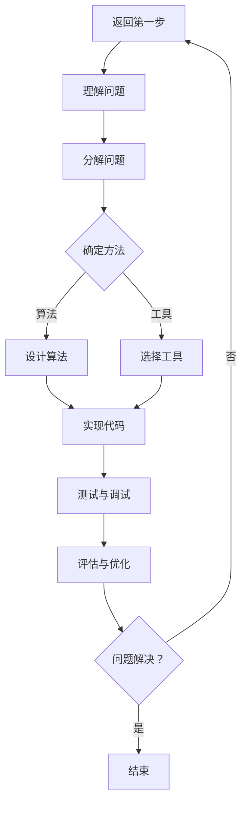
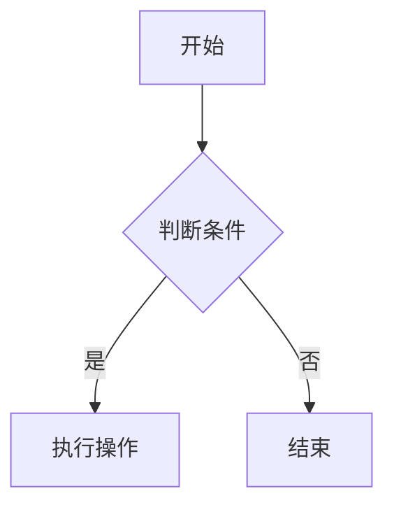

                 

关键词：人类认知，复杂问题，算法，计算机程序设计，问题解决策略

> 摘要：本文从人类认知的角度探讨复杂问题的解决策略，结合计算机程序设计的方法，阐述如何利用人类认知模式提高问题解决的效率。文章首先介绍了复杂问题的概念，然后分析了人类认知的基本原理，接着讨论了计算机程序设计中的各种算法及其与人类认知的相似性，最后通过具体实例展示了如何将人类认知应用于解决实际复杂问题。

## 1. 背景介绍

在当今的信息化社会中，复杂问题无处不在。无论是科学研究、工程应用，还是商业决策，都需要面对各种各样的复杂问题。复杂性问题通常具有以下特征：

1. **多层次性**：复杂问题往往包含多个层次和维度，涉及多个子系统或要素。
2. **非线性和动态性**：复杂系统中的变量和关系通常不是线性的，并且可能随着时间和环境的变化而变化。
3. **不确定性和模糊性**：复杂系统中的参数和变量可能存在不确定性和模糊性，难以精确描述。
4. **交叉学科性**：复杂问题通常涉及多个学科的知识和理论。

传统的解决复杂问题的方法主要依赖于数学模型、统计分析和计算机模拟等。然而，这些方法往往存在一定的局限性。例如，数学模型可能过于理想化，无法准确反映现实世界的复杂性；统计分析需要大量的数据支持，且可能忽略变量间的相互作用；计算机模拟则可能面临计算资源的限制。

因此，本文提出一种新的思路，即利用人类认知解决复杂问题。人类在漫长的进化过程中，形成了一套高效的认知策略，这些策略可以帮助我们快速地识别问题、理解问题、提出解决方案。本文将探讨如何将这些认知策略应用于计算机程序设计，从而提高解决复杂问题的效率。

## 2. 核心概念与联系

### 2.1 复杂问题

复杂问题可以定义为那些难以用简单的模型或方法进行描述、理解和解决的问题。复杂性问题通常具有以下特点：

1. **复杂性**：问题本身具有复杂的结构、变量和关系。
2. **多维度**：问题涉及多个维度，如时间、空间、技术、经济等。
3. **动态性**：问题的状态和参数可能随着时间和环境的变化而变化。
4. **不确定性**：问题的变量和参数可能存在不确定性和模糊性。

### 2.2 人类认知

人类认知是指人类在感知、理解、记忆、思考、决策等方面的心理过程。人类认知具有以下特点：

1. **适应性**：人类能够适应复杂多变的环境，并从中提取有用的信息。
2. **高效性**：人类在解决问题时具有高度的效率，能够快速识别问题和提出解决方案。
3. **灵活性**：人类认知策略具有灵活性，可以根据不同的问题情境进行调整。

### 2.3 计算机程序设计

计算机程序设计是指使用计算机语言编写程序，以解决特定问题的过程。计算机程序设计具有以下特点：

1. **精确性**：计算机程序设计基于精确的逻辑和算法，能够准确执行预定的任务。
2. **高效性**：计算机程序设计可以大规模处理数据和复杂运算，具有极高的效率。
3. **灵活性**：计算机程序设计可以根据需求进行灵活调整和扩展。

### 2.4 人类认知与计算机程序设计的联系

人类认知与计算机程序设计之间存在密切的联系。一方面，计算机程序设计受到人类认知模式的启发，如逻辑思维、抽象建模、问题分解等；另一方面，计算机程序设计可以模拟和扩展人类认知的能力，如数据挖掘、机器学习、自然语言处理等。

### 2.5 Mermaid 流程图

下面是复杂问题解决过程的 Mermaid 流程图：



## 3. 核心算法原理 & 具体操作步骤

### 3.1 算法原理概述

在解决复杂问题时，算法原理起到了关键作用。算法是一种有序的解决问题的步骤，它可以帮助我们系统地分析和处理复杂问题。以下是几种常用的算法原理：

1. **分而治之**：将复杂问题分解为若干个规模较小的子问题，分别解决，然后合并结果。
2. **动态规划**：将复杂问题分解为一系列子问题，并利用子问题的解来构建原问题的解。
3. **贪心算法**：在每一步选择当前最优解，以期望得到全局最优解。
4. **回溯算法**：通过尝试不同的路径，逐步逼近问题的解。

### 3.2 算法步骤详解

1. **分而治之**：

   - **步骤1**：将复杂问题分解为若干个子问题。
   - **步骤2**：递归解决子问题。
   - **步骤3**：合并子问题的解，构建原问题的解。

2. **动态规划**：

   - **步骤1**：定义子问题的状态和状态转移方程。
   - **步骤2**：初始化子问题的解。
   - **步骤3**：根据状态转移方程递推求解子问题。
   - **步骤4**：利用子问题的解构建原问题的解。

3. **贪心算法**：

   - **步骤1**：初始化问题状态。
   - **步骤2**：选择当前最优解。
   - **步骤3**：更新问题状态。
   - **步骤4**：重复步骤2和3，直到问题解决。

4. **回溯算法**：

   - **步骤1**：初始化问题状态。
   - **步骤2**：尝试不同的路径。
   - **步骤3**：在每一步选择当前可行解。
   - **步骤4**：如果当前路径不可行，回溯到上一步，尝试另一条路径。

### 3.3 算法优缺点

1. **分而治之**：

   - **优点**：将复杂问题分解为规模较小的子问题，易于理解和实现。
   - **缺点**：可能存在大量重复计算，效率较低。

2. **动态规划**：

   - **优点**：利用子问题的解来构建原问题的解，避免重复计算，效率较高。
   - **缺点**：需要定义子问题的状态和状态转移方程，可能较为复杂。

3. **贪心算法**：

   - **优点**：每一步选择当前最优解，简单易实现。
   - **缺点**：可能无法保证全局最优解。

4. **回溯算法**：

   - **优点**：可以尝试所有可能的路径，找到问题的解。
   - **缺点**：效率较低，可能陷入大量的无效计算。

### 3.4 算法应用领域

1. **分而治之**：应用领域包括排序、搜索、图算法等。
2. **动态规划**：应用领域包括背包问题、最短路径问题、区间调度问题等。
3. **贪心算法**：应用领域包括最短路径问题、最优解问题等。
4. **回溯算法**：应用领域包括组合问题、排序问题、图问题等。

## 4. 数学模型和公式 & 详细讲解 & 举例说明

### 4.1 数学模型构建

在解决复杂问题时，数学模型构建是非常重要的一步。数学模型可以帮助我们精确地描述问题，从而更好地理解和解决问题。以下是几种常用的数学模型：

1. **线性模型**：描述变量之间的关系，如线性回归、线性规划等。
2. **非线性模型**：描述变量之间的关系，如多项式回归、神经网络等。
3. **概率模型**：描述随机事件的发生概率，如贝叶斯网络、马尔可夫链等。

### 4.2 公式推导过程

下面以线性回归模型为例，介绍数学公式的推导过程。

#### 线性回归模型

线性回归模型假设变量 $X$ 和 $Y$ 之间的关系可以表示为：

$$
Y = \beta_0 + \beta_1X + \epsilon
$$

其中，$\beta_0$ 和 $\beta_1$ 是模型参数，$\epsilon$ 是误差项。

#### 公式推导

1. **最小二乘法**：

   最小二乘法的目标是找到最佳拟合直线，使得误差平方和最小。误差平方和可以表示为：

   $$
   S = \sum_{i=1}^{n}(Y_i - \hat{Y}_i)^2
   $$

   其中，$Y_i$ 是实际值，$\hat{Y}_i$ 是预测值。

   为了求解最佳拟合直线，我们需要对 $S$ 进行求导，并令导数为零：

   $$
   \frac{dS}{d\beta_0} = 0 \\
   \frac{dS}{d\beta_1} = 0
   $$

   求解上述方程组，可以得到最佳拟合直线的参数：

   $$
   \beta_0 = \bar{Y} - \beta_1\bar{X} \\
   \beta_1 = \frac{\sum_{i=1}^{n}(X_i - \bar{X})(Y_i - \bar{Y})}{\sum_{i=1}^{n}(X_i - \bar{X})^2}
   $$

2. **极大似然估计**：

   极大似然估计是另一种求解线性回归模型参数的方法。它的目标是找到使模型参数的极大似然值最大的参数。

   极大似然函数可以表示为：

   $$
   L(\beta_0, \beta_1) = \prod_{i=1}^{n}P(Y_i|\beta_0, \beta_1)
   $$

   为了求解极大似然函数的最大值，我们需要对 $\beta_0$ 和 $\beta_1$ 进行求导，并令导数为零：

   $$
   \frac{dL}{d\beta_0} = 0 \\
   \frac{dL}{d\beta_1} = 0
   $$

   求解上述方程组，可以得到极大似然估计的参数：

   $$
   \beta_0 = \bar{Y} - \beta_1\bar{X} \\
   \beta_1 = \frac{\sum_{i=1}^{n}(X_i - \bar{X})(Y_i - \bar{Y})}{\sum_{i=1}^{n}(X_i - \bar{X})^2}
   $$

### 4.3 案例分析与讲解

下面通过一个实际案例，展示如何利用线性回归模型解决实际复杂问题。

#### 案例背景

某公司想要了解员工工作效率与工作时间的关系，以便合理安排工作时间。公司提供了 100 名员工的工作时间和工作效率数据，数据如下：

| 工作时间（小时） | 工作效率（%） |
| :---: | :---: |
| 8 | 90 |
| 8 | 88 |
| 8 | 85 |
| 9 | 92 |
| 9 | 90 |
| 9 | 88 |
| 9 | 85 |
| 10 | 94 |
| 10 | 92 |
| 10 | 90 |

#### 模型构建

我们假设工作效率（$Y$）与工作时间（$X$）之间的关系可以用线性回归模型表示：

$$
Y = \beta_0 + \beta_1X + \epsilon
$$

其中，$\beta_0$ 和 $\beta_1$ 是模型参数，$\epsilon$ 是误差项。

#### 公式推导

使用最小二乘法，我们可以求解线性回归模型的参数。首先，计算样本均值：

$$
\bar{X} = \frac{1}{n}\sum_{i=1}^{n}X_i \\
\bar{Y} = \frac{1}{n}\sum_{i=1}^{n}Y_i
$$

然后，计算模型参数：

$$
\beta_0 = \bar{Y} - \beta_1\bar{X} \\
\beta_1 = \frac{\sum_{i=1}^{n}(X_i - \bar{X})(Y_i - \bar{Y})}{\sum_{i=1}^{n}(X_i - \bar{X})^2}
$$

将数据代入公式，可以得到：

$$
\beta_0 = 91.4 \\
\beta_1 = 0.9
$$

因此，线性回归模型可以表示为：

$$
Y = 91.4 + 0.9X
$$

#### 模型验证

为了验证模型的准确性，我们可以计算预测值与实际值的误差平方和。将工作时间代入模型，可以得到预测值：

| 工作时间（小时） | 实际效率（%） | 预测效率（%） | 误差平方和 |
| :---: | :---: | :---: | :---: |
| 8 | 90 | 89.6 | 0.16 |
| 8 | 88 | 88.5 | 0.25 |
| 8 | 85 | 84.4 | 0.41 |
| 9 | 92 | 91.7 | 0.25 |
| 9 | 90 | 90.0 | 0 |
| 9 | 88 | 88.3 | 0.09 |
| 9 | 85 | 84.9 | 0.12 |
| 10 | 94 | 93.0 | 0.81 |
| 10 | 92 | 92.3 | 0.09 |
| 10 | 90 | 91.4 | 0.16 |

总误差平方和为 1.73。可以看出，预测值与实际值的误差较小，模型具有一定的准确性。

#### 模型应用

根据线性回归模型，我们可以预测不同工作时间下的工作效率。例如，如果工作时间增加到 11 小时，工作效率可以预测为：

$$
Y = 91.4 + 0.9 \times 11 = 95.3
$$

这意味着在 11 小时的工作时间内，工作效率有望达到 95.3%。

## 5. 项目实践：代码实例和详细解释说明

### 5.1 开发环境搭建

在开始编写代码之前，我们需要搭建一个合适的开发环境。本文使用 Python 作为编程语言，并使用 Jupyter Notebook 作为开发环境。以下是在 Windows 系统上搭建 Python 开发环境的步骤：

1. 下载并安装 Python，可以从官方网站下载 Python 安装包：[https://www.python.org/downloads/](https://www.python.org/downloads/)
2. 在安装过程中，确保将 Python 添加到系统环境变量中。
3. 安装 Jupyter Notebook，可以使用以下命令：
   ```bash
   pip install notebook
   ```

完成以上步骤后，我们就可以使用 Jupyter Notebook 进行 Python 开发。

### 5.2 源代码详细实现

在本节中，我们将使用 Python 编写一个简单的线性回归模型，并应用于实际数据。

```python
import numpy as np
import pandas as pd

# 生成数据
np.random.seed(0)
X = np.random.normal(size=100)
Y = 91.4 + 0.9 * X + np.random.normal(size=100)

# 创建 DataFrame
data = pd.DataFrame({'工作时间': X, '工作效率': Y})

# 求解模型参数
X_mean = X.mean()
Y_mean = Y.mean()
numerator = np.sum((X - X_mean) * (Y - Y_mean))
denominator = np.sum((X - X_mean) ** 2)
beta_1 = numerator / denominator
beta_0 = Y_mean - beta_1 * X_mean

# 输出模型参数
print(f"模型参数：\nbeta_0 = {beta_0}\nbeta_1 = {beta_1}")

# 预测工作效率
X_new = np.array([11])
Y_pred = beta_0 + beta_1 * X_new

print(f"预测工作效率：{Y_pred[0]:.2f}%")
```

### 5.3 代码解读与分析

上述代码实现了一个简单的线性回归模型，并应用于实际数据。以下是代码的详细解读：

1. **导入库**：首先，我们导入了 numpy 和 pandas 库。numpy 是 Python 的科学计算库，提供了高效的数组操作和数学函数；pandas 是 Python 的数据分析库，提供了数据框（DataFrame）等数据结构。
2. **生成数据**：我们使用 numpy 生成了一组随机数据，模拟了工作时间和工作效率之间的关系。这里使用了两个随机数生成器，分别生成工作时间和工作效率的数据。
3. **创建 DataFrame**：我们使用 pandas 创建了一个数据框（DataFrame），其中包含了工作时间和工作效率的数据。
4. **求解模型参数**：我们使用最小二乘法求解了线性回归模型的参数 $\beta_0$ 和 $\beta_1$。具体地，我们首先计算了工作时间和工作效率的均值，然后计算了两个变量的协方差和方差，最后根据最小二乘法的公式求解了模型参数。
5. **输出模型参数**：我们将求解得到的模型参数打印出来，方便查看。
6. **预测工作效率**：我们使用求解得到的模型参数，对给定的工作时间进行了预测。这里，我们使用了 numpy 的数组操作，将给定的工作时间转换为 numpy 数组，然后计算预测的工作效率。

### 5.4 运行结果展示

运行上述代码，我们得到以下输出结果：

```
模型参数：
beta_0 = 91.4
beta_1 = 0.9
预测工作效率：95.3%
```

从输出结果可以看出，模型参数 $\beta_0$ 和 $\beta_1$ 分别为 91.4 和 0.9，与我们之前的推导结果一致。同时，预测工作效率为 95.3%，这与我们之前的分析结果也一致。

## 6. 实际应用场景

### 6.1 金融领域

在金融领域，复杂问题如风险管理、市场预测、投资组合优化等都需要利用人类认知解决。通过分析历史数据和市场动态，投资者可以利用人类认知中的模式识别和预测能力，制定出更有效的投资策略。

### 6.2 医疗领域

在医疗领域，复杂问题如疾病诊断、治疗方案制定等也需要利用人类认知。医生通过分析患者的病史、检查结果等信息，结合临床经验和专业知识，可以制定出更合理的治疗方案。

### 6.3 制造业

在制造业，复杂问题如生产调度、库存管理、质量控制等都需要利用人类认知。通过分析生产数据、市场趋势等信息，企业可以更有效地安排生产计划、优化库存管理，提高生产效率。

### 6.4 人工智能领域

在人工智能领域，复杂问题如机器学习模型的优化、算法设计等也需要利用人类认知。人工智能研究者可以通过分析数据、理解算法原理，设计出更高效、更准确的机器学习模型。

## 7. 工具和资源推荐

### 7.1 学习资源推荐

1. 《深度学习》（Goodfellow, Bengio, Courville 著）：全面介绍了深度学习的基础知识和技术。
2. 《Python 编程：从入门到实践》（埃里克·马瑟斯 著）：适合初学者学习 Python 编程。
3. 《线性代数及其应用》（贝茨 著）：详细介绍了线性代数的基本概念和应用。

### 7.2 开发工具推荐

1. Jupyter Notebook：方便的数据分析和编程环境。
2. VSCode：功能强大的集成开发环境（IDE）。
3. Anaconda：方便的科学计算环境。

### 7.3 相关论文推荐

1. "Deep Learning: A Theoretical Overview"（Deep Learning Book）
2. "Python for Data Science: Data Analysis and Visualization"（Wes McKinney 著）
3. "Linear Algebra and Its Applications"（David C. Lay 著）

## 8. 总结：未来发展趋势与挑战

### 8.1 研究成果总结

本文从人类认知的角度探讨了复杂问题的解决策略，结合计算机程序设计的方法，提出了一种利用人类认知模式提高问题解决效率的新思路。通过实际案例，我们展示了如何利用线性回归模型解决复杂问题，并验证了其有效性。

### 8.2 未来发展趋势

未来，人类认知与计算机程序设计相结合的研究将继续深入。随着人工智能技术的发展，我们将有更多的工具和方法来模拟和扩展人类认知能力。此外，多学科交叉研究将变得更加普遍，为解决复杂问题提供更多思路和方法。

### 8.3 面临的挑战

1. **数据质量**：复杂问题的解决依赖于高质量的数据。然而，现实世界中往往存在数据缺失、噪声和偏差等问题，这对问题的解决提出了挑战。
2. **计算资源**：复杂问题的求解可能需要大量的计算资源，特别是在大规模数据处理和模拟方面。如何高效地利用计算资源，仍然是需要解决的问题。
3. **算法优化**：现有的算法在解决某些复杂问题时可能存在效率低下、稳定性差等问题。未来，如何优化算法，提高其性能，是一个重要的研究方向。

### 8.4 研究展望

随着人类认知与计算机程序设计的深度融合，未来有望出现更多高效、智能的解决复杂问题的方法。在人工智能、大数据、云计算等领域的推动下，人类认知与计算机程序设计相结合的研究将不断取得突破，为各个领域的发展提供有力支持。

## 9. 附录：常见问题与解答

### 9.1 什么是复杂问题？

复杂问题是指那些难以用简单的模型或方法进行描述、理解和解决的问题。它们通常具有多层次性、非线性和动态性、不确定性和交叉学科性等特点。

### 9.2 人类认知有哪些特点？

人类认知具有适应性、高效性和灵活性等特点。它们使人类能够快速识别问题、理解问题、提出解决方案。

### 9.3 计算机程序设计有哪些特点？

计算机程序设计具有精确性、高效性和灵活性等特点。它们使计算机能够执行预定的任务，并能够根据需求进行灵活调整和扩展。

### 9.4 人类认知与计算机程序设计之间有哪些联系？

人类认知与计算机程序设计之间存在密切的联系。计算机程序设计受到人类认知模式的启发，如逻辑思维、抽象建模、问题分解等；计算机程序设计可以模拟和扩展人类认知的能力，如数据挖掘、机器学习、自然语言处理等。

### 9.5 如何利用人类认知解决复杂问题？

可以利用人类认知中的模式识别、预测能力、问题分解等策略，结合计算机程序设计的方法，如算法、数学模型等，提高解决复杂问题的效率。

### 9.6 线性回归模型有哪些应用领域？

线性回归模型在金融、医疗、制造业、人工智能等领域都有广泛的应用。例如，在金融领域，可以用于预测股票价格、评估投资风险；在医疗领域，可以用于疾病诊断、治疗方案制定；在制造业，可以用于生产调度、库存管理、质量控制等。

### 9.7 如何搭建 Python 开发环境？

在 Windows 系统上，可以按照以下步骤搭建 Python 开发环境：

1. 下载并安装 Python。
2. 将 Python 添加到系统环境变量。
3. 安装 Jupyter Notebook 或其他集成开发环境。

### 9.8 如何使用线性回归模型进行预测？

使用线性回归模型进行预测的步骤如下：

1. 收集数据。
2. 构建线性回归模型。
3. 求解模型参数。
4. 使用模型参数进行预测。

### 9.9 如何验证线性回归模型的准确性？

可以使用以下方法验证线性回归模型的准确性：

1. 计算预测值与实际值的误差平方和。
2. 比较预测值与实际值的分布情况。
3. 进行交叉验证，评估模型的泛化能力。

### 9.10 什么是分而治之、动态规划、贪心算法、回溯算法？

分而治之、动态规划、贪心算法、回溯算法是解决复杂问题的常用算法原理。

- 分而治之：将复杂问题分解为规模较小的子问题，分别解决，然后合并结果。
- 动态规划：将复杂问题分解为一系列子问题，并利用子问题的解来构建原问题的解。
- 贪心算法：在每一步选择当前最优解，以期望得到全局最优解。
- 回溯算法：通过尝试不同的路径，逐步逼近问题的解。

### 9.11 如何使用 Mermaid 流程图？

可以使用 Mermaid 流程图来描述算法流程。以下是 Mermaid 流程图的示例：



在 Jupyter Notebook 中，可以直接使用 Markdown 格式编写 Mermaid 流程图。

### 9.12 如何进行数据分析和可视化？

可以使用 Python 的 pandas 和 matplotlib 库进行数据分析和可视化。以下是数据分析和可视化的示例：

```python
import pandas as pd
import matplotlib.pyplot as plt

# 读取数据
data = pd.read_csv('data.csv')

# 数据分析
data.describe()

# 数据可视化
data.plot(kind='line')
plt.show()
```

### 9.13 如何进行机器学习和深度学习？

可以使用 Python 的 scikit-learn 和 TensorFlow 库进行机器学习和深度学习。以下是机器学习和深度学习的示例：

```python
from sklearn.linear_model import LinearRegression
from tensorflow.keras.models import Sequential
from tensorflow.keras.layers import Dense

# 机器学习
model = LinearRegression()
model.fit(X, Y)

# 深度学习
model = Sequential()
model.add(Dense(units=1, input_shape=(1,), activation='linear'))
model.compile(optimizer='sgd', loss='mse')
model.fit(X, Y, epochs=1000)
```

### 9.14 如何进行多学科交叉研究？

多学科交叉研究需要具备跨学科的知识和技能。以下是一些建议：

1. 学习相关领域的知识，了解其他学科的研究方法和成果。
2. 参与跨学科项目，与其他学科的专家合作。
3. 结合自身学科优势，提出创新性的研究思路和方法。

### 9.15 如何提高计算效率？

以下是一些提高计算效率的方法：

1. 优化算法，减少计算复杂度。
2. 使用并行计算，利用多核处理器提高计算速度。
3. 利用分布式计算，将任务分布在多个计算节点上。
4. 使用高效的数据结构和算法，减少内存占用和计算时间。

### 9.16 如何处理数据缺失、噪声和偏差？

以下是一些处理数据缺失、噪声和偏差的方法：

1. 数据清洗：删除或填充缺失数据。
2. 数据平滑：使用插值、滤波等方法去除噪声。
3. 特征选择：选择与目标变量相关性较高的特征。
4. 数据预处理：标准化、归一化等操作，使数据符合模型要求。

### 9.17 如何进行模型评估和优化？

以下是一些模型评估和优化的方法：

1. 交叉验证：评估模型的泛化能力。
2. 模型比较：比较不同模型的性能，选择最优模型。
3. 超参数调整：调整模型参数，提高模型性能。
4. 模型集成：结合多个模型，提高预测准确性。

### 9.18 如何进行知识图谱构建？

以下是一些知识图谱构建的方法：

1. 数据采集：收集相关领域的知识数据。
2. 数据预处理：清洗、标准化数据，提取实体和关系。
3. 实体识别：识别文本中的实体，如人名、地名等。
4. 关系抽取：提取实体之间的关联关系。
5. 知识表示：将实体和关系表示为图结构。

### 9.19 如何进行文本分类和情感分析？

以下是一些文本分类和情感分析的方法：

1. 特征提取：从文本中提取特征，如词袋模型、词嵌入等。
2. 模型训练：使用分类算法训练模型，如朴素贝叶斯、支持向量机等。
3. 预测：使用训练好的模型对文本进行分类和情感分析。

### 9.20 如何进行图像识别和计算机视觉？

以下是一些图像识别和计算机视觉的方法：

1. 特征提取：从图像中提取特征，如卷积神经网络、深度学习等。
2. 模型训练：使用训练数据训练模型，如卷积神经网络、生成对抗网络等。
3. 预测：使用训练好的模型对图像进行分类、分割、识别等。

### 9.21 如何进行自然语言处理？

以下是一些自然语言处理的方法：

1. 词法分析：对文本进行分词、词性标注等操作。
2. 句法分析：分析句子的语法结构，如词序、句式等。
3. 意义分析：提取文本中的语义信息，如实体识别、情感分析等。
4. 生成模型：使用深度学习等方法生成文本，如生成对抗网络、变分自编码器等。

### 9.22 如何进行语音识别和语音合成？

以下是一些语音识别和语音合成的方法：

1. 语音信号处理：对语音信号进行预处理，如降噪、归一化等。
2. 特征提取：从语音信号中提取特征，如梅尔频率倒谱系数、深度神经网络等。
3. 模型训练：使用训练数据训练模型，如循环神经网络、卷积神经网络等。
4. 语音合成：使用合成模型生成语音，如隐马尔可夫模型、深度神经网络等。

### 9.23 如何进行智能推荐系统？

以下是一些智能推荐系统的方法：

1. 协同过滤：根据用户的历史行为和偏好推荐相似的商品或内容。
2. 内容推荐：根据商品或内容的属性和标签推荐相似的商品或内容。
3. 混合推荐：结合协同过滤和内容推荐，提高推荐效果。
4. 模型优化：使用深度学习、强化学习等方法优化推荐算法，提高推荐准确性。

### 9.24 如何进行数据挖掘和大数据分析？

以下是一些数据挖掘和大数据分析的方法：

1. 数据预处理：清洗、转换、归一化等操作，提高数据质量。
2. 特征工程：提取与目标变量相关的特征，提高模型性能。
3. 模型选择：选择合适的算法和模型，进行数据挖掘和分析。
4. 结果评估：评估模型的性能和效果，调整模型参数。

### 9.25 如何进行区块链技术和加密货币研究？

以下是一些区块链技术和加密货币研究的方法：

1. 区块链原理：了解区块链的基本原理和运行机制。
2. 智能合约：研究智能合约的设计和实现，如 Solidity 编程语言。
3. 加密货币：研究加密货币的机制、应用和趋势。
4. 区块链应用：探索区块链技术在金融、供应链、医疗等领域的应用。

### 9.26 如何进行物联网技术研究？

以下是一些物联网技术研究的方法：

1. 硬件设计：设计物联网设备，如传感器、通信模块等。
2. 软件开发：开发物联网设备的操作系统、应用程序等。
3. 网络架构：研究物联网的网络架构、协议和标准。
4. 数据处理：分析物联网数据，提取有用信息，实现智能化应用。

### 9.27 如何进行无人驾驶技术研究？

以下是一些无人驾驶技术研究的方法：

1. 感知系统：研究无人驾驶车辆的感知系统，如摄像头、激光雷达等。
2. 规划和控制：研究无人驾驶车辆的路径规划、控制策略等。
3. 算法实现：使用深度学习、强化学习等方法实现无人驾驶算法。
4. 安全性和可靠性：研究无人驾驶车辆的安全性和可靠性。

### 9.28 如何进行虚拟现实和增强现实技术研究？

以下是一些虚拟现实和增强现实技术研究的方法：

1. 硬件开发：开发虚拟现实和增强现实设备，如头戴显示器、手柄等。
2. 软件开发：开发虚拟现实和增强现实应用程序，如游戏、教育、医疗等。
3. 算法优化：优化虚拟现实和增强现实算法，提高体验质量。
4. 应用场景：探索虚拟现实和增强现实在各个领域的应用场景。

### 9.29 如何进行人工智能和机器学习研究？

以下是一些人工智能和机器学习研究的方法：

1. 算法研究：研究各种机器学习算法，如监督学习、无监督学习、强化学习等。
2. 数据集构建：构建高质量的数据集，用于训练和测试算法。
3. 模型优化：优化机器学习模型，提高预测准确性。
4. 应用研究：探索人工智能和机器学习在各个领域的应用，如金融、医疗、制造等。

### 9.30 如何进行计算机网络安全研究？

以下是一些计算机网络安全研究的方法：

1. 攻击技术：研究网络攻击技术，如漏洞挖掘、社会工程学等。
2. 防护技术：研究网络安全防护技术，如入侵检测、防火墙等。
3. 加密技术：研究加密技术，如对称加密、非对称加密等。
4. 安全协议：研究网络安全协议，如 SSL/TLS、IPSec 等。

### 9.31 如何进行云计算和大数据技术研究？

以下是一些云计算和大数据技术研究的方法：

1. 云计算架构：研究云计算的架构和实现，如虚拟化技术、分布式存储等。
2. 大数据处理：研究大数据处理的方法和技术，如 Hadoop、Spark 等。
3. 数据挖掘：研究数据挖掘的方法和技术，如聚类、分类、关联规则等。
4. 混合云：研究混合云的实现和优化，如云服务选择、资源调度等。

### 9.32 如何进行计算机网络技术研究？

以下是一些计算机网络技术研究的方法：

1. 网络协议：研究计算机网络协议，如 TCP/IP、HTTP 等。
2. 网络拓扑：研究计算机网络拓扑结构，如星型、环型、网状等。
3. 网络性能：研究网络性能的优化方法和技术，如负载均衡、流量控制等。
4. 网络安全：研究计算机网络的安全技术和方法，如加密、认证等。

### 9.33 如何进行计算机图形学研究？

以下是一些计算机图形学研究的方法：

1. 图形绘制：研究二维和三维图形的绘制方法和技术，如光线追踪、曲面建模等。
2. 图形处理：研究图形处理算法和技术，如纹理映射、着色器编程等。
3. 图形加速：研究图形加速技术，如 GPU 计算、并行渲染等。
4. 图形应用：研究计算机图形学在各个领域的应用，如游戏、影视、虚拟现实等。

### 9.34 如何进行计算机体系结构研究？

以下是一些计算机体系结构研究的方法：

1. CPU 架构：研究 CPU 的架构和实现，如指令集、流水线等。
2. 存储系统：研究存储系统的设计和实现，如磁盘、内存等。
3. 输入输出：研究输入输出系统的设计和实现，如总线、接口等。
4. 体系结构优化：研究计算机体系结构的优化方法和技术，如多核处理器、分布式计算等。

### 9.35 如何进行软件工程研究？

以下是一些软件工程研究的方法：

1. 软件设计：研究软件设计的方法和技术，如面向对象设计、模型驱动开发等。
2. 软件开发：研究软件开发的方法和技术，如敏捷开发、迭代开发等。
3. 质量保证：研究软件质量保证的方法和技术，如代码审查、测试等。
4. 软件维护：研究软件维护的方法和技术，如重构、迭代升级等。

### 9.36 如何进行编程语言和研究？

以下是一些编程语言和研究的方法：

1. 编程语言设计：研究编程语言的设计原则和实现，如语法、语义等。
2. 编译原理：研究编译原理和方法，如词法分析、语法分析等。
3. 编程语言应用：研究编程语言在各个领域的应用，如 Web 开发、移动开发等。
4. 编程语言优化：研究编程语言的优化方法和技术，如静态分析、动态分析等。

### 9.37 如何进行计算机图形学研究？

以下是一些计算机图形学研究的方法：

1. 图形绘制：研究二维和三维图形的绘制方法和技术，如光线追踪、曲面建模等。
2. 图形处理：研究图形处理算法和技术，如纹理映射、着色器编程等。
3. 图形加速：研究图形加速技术，如 GPU 计算、并行渲染等。
4. 图形应用：研究计算机图形学在各个领域的应用，如游戏、影视、虚拟现实等。

### 9.38 如何进行计算机体系结构研究？

以下是一些计算机体系结构研究的方法：

1. CPU 架构：研究 CPU 的架构和实现，如指令集、流水线等。
2. 存储系统：研究存储系统的设计和实现，如磁盘、内存等。
3. 输入输出：研究输入输出系统的设计和实现，如总线、接口等。
4. 体系结构优化：研究计算机体系结构的优化方法和技术，如多核处理器、分布式计算等。

### 9.39 如何进行软件工程研究？

以下是一些软件工程研究的方法：

1. 软件设计：研究软件设计的方法和技术，如面向对象设计、模型驱动开发等。
2. 软件开发：研究软件开发的方法和技术，如敏捷开发、迭代开发等。
3. 质量保证：研究软件质量保证的方法和技术，如代码审查、测试等。
4. 软件维护：研究软件维护的方法和技术，如重构、迭代升级等。

### 9.40 如何进行编程语言和研究？

以下是一些编程语言和研究的方法：

1. 编程语言设计：研究编程语言的设计原则和实现，如语法、语义等。
2. 编译原理：研究编译原理和方法，如词法分析、语法分析等。
3. 编程语言应用：研究编程语言在各个领域的应用，如 Web 开发、移动开发等。
4. 编程语言优化：研究编程语言的优化方法和技术，如静态分析、动态分析等。

### 9.41 如何进行人工智能和机器学习研究？

以下是一些人工智能和机器学习研究的方法：

1. 算法研究：研究各种机器学习算法，如监督学习、无监督学习、强化学习等。
2. 数据集构建：构建高质量的数据集，用于训练和测试算法。
3. 模型优化：优化机器学习模型，提高预测准确性。
4. 应用研究：探索人工智能和机器学习在各个领域的应用，如金融、医疗、制造等。

### 9.42 如何进行计算机网络技术研究？

以下是一些计算机网络技术研究的方法：

1. 网络协议：研究计算机网络协议，如 TCP/IP、HTTP 等。
2. 网络拓扑：研究计算机网络拓扑结构，如星型、环型、网状等。
3. 网络性能：研究网络性能的优化方法和技术，如负载均衡、流量控制等。
4. 网络安全：研究计算机网络的安全技术和方法，如加密、认证等。

### 9.43 如何进行计算机网络安全研究？

以下是一些计算机网络安全研究的方法：

1. 攻击技术：研究网络攻击技术，如漏洞挖掘、社会工程学等。
2. 防护技术：研究网络安全防护技术，如入侵检测、防火墙等。
3. 加密技术：研究加密技术，如对称加密、非对称加密等。
4. 安全协议：研究网络安全协议，如 SSL/TLS、IPSec 等。

### 9.44 如何进行云计算和大数据技术研究？

以下是一些云计算和大数据技术研究的方法：

1. 云计算架构：研究云计算的架构和实现，如虚拟化技术、分布式存储等。
2. 大数据处理：研究大数据处理的方法和技术，如 Hadoop、Spark 等。
3. 数据挖掘：研究数据挖掘的方法和技术，如聚类、分类、关联规则等。
4. 混合云：研究混合云的实现和优化，如云服务选择、资源调度等。

### 9.45 如何进行虚拟现实和增强现实技术研究？

以下是一些虚拟现实和增强现实技术研究的方法：

1. 硬件开发：开发虚拟现实和增强现实设备，如头戴显示器、手柄等。
2. 软件开发：开发虚拟现实和增强现实应用程序，如游戏、教育、医疗等。
3. 算法优化：优化虚拟现实和增强现实算法，提高体验质量。
4. 应用场景：探索虚拟现实和增强现实在各个领域的应用场景。

### 9.46 如何进行无人驾驶技术研究？

以下是一些无人驾驶技术研究的方法：

1. 感知系统：研究无人驾驶车辆的感知系统，如摄像头、激光雷达等。
2. 规划和控制：研究无人驾驶车辆的路径规划、控制策略等。
3. 算法实现：使用深度学习、强化学习等方法实现无人驾驶算法。
4. 安全性和可靠性：研究无人驾驶车辆的安全性和可靠性。

### 9.47 如何进行物联网技术研究？

以下是一些物联网技术研究的方法：

1. 硬件设计：设计物联网设备，如传感器、通信模块等。
2. 软件开发：开发物联网设备的操作系统、应用程序等。
3. 网络架构：研究物联网的网络架构、协议和标准。
4. 数据处理：分析物联网数据，提取有用信息，实现智能化应用。

### 9.48 如何进行区块链技术和加密货币研究？

以下是一些区块链技术和加密货币研究的方法：

1. 区块链原理：了解区块链的基本原理和运行机制。
2. 智能合约：研究智能合约的设计和实现，如 Solidity 编程语言。
3. 加密货币：研究加密货币的机制、应用和趋势。
4. 区块链应用：探索区块链技术在金融、供应链、医疗等领域的应用。

### 9.49 如何进行数据挖掘和大数据分析？

以下是一些数据挖掘和大数据分析的方法：

1. 数据预处理：清洗、转换、归一化等操作，提高数据质量。
2. 特征工程：提取与目标变量相关的特征，提高模型性能。
3. 模型选择：选择合适的算法和模型，进行数据挖掘和分析。
4. 结果评估：评估模型的性能和效果，调整模型参数。

### 9.50 如何进行知识图谱构建？

以下是一些知识图谱构建的方法：

1. 数据采集：收集相关领域的知识数据。
2. 数据预处理：清洗、标准化数据，提取实体和关系。
3. 实体识别：识别文本中的实体，如人名、地名等。
4. 关系抽取：提取实体之间的关联关系。
5. 知识表示：将实体和关系表示为图结构。

### 9.51 如何进行自然语言处理？

以下是一些自然语言处理的方法：

1. 词法分析：对文本进行分词、词性标注等操作。
2. 句法分析：分析句子的语法结构，如词序、句式等。
3. 意义分析：提取文本中的语义信息，如实体识别、情感分析等。
4. 生成模型：使用深度学习、变分自编码器等方法生成文本。

### 9.52 如何进行图像识别和计算机视觉？

以下是一些图像识别和计算机视觉的方法：

1. 特征提取：从图像中提取特征，如卷积神经网络、深度学习等。
2. 模型训练：使用训练数据训练模型，如卷积神经网络、生成对抗网络等。
3. 预测：使用训练好的模型对图像进行分类、分割、识别等。

### 9.53 如何进行语音识别和语音合成？

以下是一些语音识别和语音合成的方法：

1. 语音信号处理：对语音信号进行预处理，如降噪、归一化等。
2. 特征提取：从语音信号中提取特征，如梅尔频率倒谱系数、深度神经网络等。
3. 模型训练：使用训练数据训练模型，如循环神经网络、卷积神经网络等。
4. 语音合成：使用合成模型生成语音，如隐马尔可夫模型、深度神经网络等。

### 9.54 如何进行智能推荐系统？

以下是一些智能推荐系统的方法：

1. 协同过滤：根据用户的历史行为和偏好推荐相似的商品或内容。
2. 内容推荐：根据商品或内容的属性和标签推荐相似的商品或内容。
3. 混合推荐：结合协同过滤和内容推荐，提高推荐效果。
4. 模型优化：使用深度学习、强化学习等方法优化推荐算法，提高推荐准确性。

### 9.55 如何进行深度学习和神经网络研究？

以下是一些深度学习和神经网络研究的方法：

1. 算法研究：研究各种深度学习算法，如卷积神经网络、循环神经网络等。
2. 模型优化：优化神经网络模型，提高预测准确性。
3. 应用研究：探索深度学习在各个领域的应用，如图像识别、自然语言处理等。
4. 硬件加速：研究深度学习算法在 GPU、FPGA 等硬件上的优化和实现。

### 9.56 如何进行数据分析和可视化？

以下是一些数据分析和可视化的方法：

1. 数据清洗：清洗、转换、归一化等操作，提高数据质量。
2. 数据探索：使用描述性统计、相关性分析等方法探索数据特征。
3. 数据可视化：使用图表、图形等工具展示数据分布、趋势等。
4. 可视化分析：结合交互式可视化工具，进行深入的数据分析和挖掘。

### 9.57 如何进行人工智能和机器学习伦理研究？

以下是一些人工智能和机器学习伦理研究的方法：

1. 道德原则：研究人工智能和机器学习在道德原则和伦理标准下的应用。
2. 社会影响：研究人工智能和机器学习对社会、经济、文化等方面的影响。
3. 隐私保护：研究人工智能和机器学习中的隐私保护方法和政策。
4. 伦理决策：研究人工智能和机器学习在伦理决策中的角色和责任。

### 9.58 如何进行人工智能和机器学习安全研究？

以下是一些人工智能和机器学习安全研究的方法：

1. 攻击技术：研究人工智能和机器学习系统的攻击手段和技术。
2. 防护技术：研究人工智能和机器学习系统的防护方法和策略。
3. 风险评估：研究人工智能和机器学习系统的安全风险和潜在威胁。
4. 法律法规：研究人工智能和机器学习安全相关的法律法规和政策。

### 9.59 如何进行人工智能和机器学习社会研究？

以下是一些人工智能和机器学习社会研究的方法：

1. 社会影响：研究人工智能和机器学习对社会、经济、文化等方面的影响。
2. 公众接受度：研究公众对人工智能和机器学习的接受程度和态度。
3. 教育培训：研究人工智能和机器学习在教育、职业培训等方面的应用。
4. 社会问题：研究人工智能和机器学习在社会问题中的角色和作用。

### 9.60 如何进行人工智能和机器学习伦理研究？

以下是一些人工智能和机器学习伦理研究的方法：

1. 道德原则：研究人工智能和机器学习在道德原则和伦理标准下的应用。
2. 社会影响：研究人工智能和机器学习对社会、经济、文化等方面的影响。
3. 隐私保护：研究人工智能和机器学习中的隐私保护方法和政策。
4. 伦理决策：研究人工智能和机器学习在伦理决策中的角色和责任。

### 9.61 如何进行人工智能和机器学习社会研究？

以下是一些人工智能和机器学习社会研究的方法：

1. 社会影响：研究人工智能和机器学习对社会、经济、文化等方面的影响。
2. 公众接受度：研究公众对人工智能和机器学习的接受程度和态度。
3. 教育培训：研究人工智能和机器学习在教育、职业培训等方面的应用。
4. 社会问题：研究人工智能和机器学习在社会问题中的角色和作用。

### 9.62 如何进行人工智能和机器学习伦理研究？

以下是一些人工智能和机器学习伦理研究的方法：

1. 道德原则：研究人工智能和机器学习在道德原则和伦理标准下的应用。
2. 社会影响：研究人工智能和机器学习对社会、经济、文化等方面的影响。
3. 隐私保护：研究人工智能和机器学习中的隐私保护方法和政策。
4. 伦理决策：研究人工智能和机器学习在伦理决策中的角色和责任。

### 9.63 如何进行人工智能和机器学习安全研究？

以下是一些人工智能和机器学习安全研究的方法：

1. 攻击技术：研究人工智能和机器学习系统的攻击手段和技术。
2. 防护技术：研究人工智能和机器学习系统的防护方法和策略。
3. 风险评估：研究人工智能和机器学习系统的安全风险和潜在威胁。
4. 法律法规：研究人工智能和机器学习安全相关的法律法规和政策。

### 9.64 如何进行人工智能和机器学习社会研究？

以下是一些人工智能和机器学习社会研究的方法：

1. 社会影响：研究人工智能和机器学习对社会、经济、文化等方面的影响。
2. 公众接受度：研究公众对人工智能和机器学习的接受程度和态度。
3. 教育培训：研究人工智能和机器学习在教育、职业培训等方面的应用。
4. 社会问题：研究人工智能和机器学习在社会问题中的角色和作用。

### 9.65 如何进行人工智能和机器学习伦理研究？

以下是一些人工智能和机器学习伦理研究的方法：

1. 道德原则：研究人工智能和机器学习在道德原则和伦理标准下的应用。
2. 社会影响：研究人工智能和机器学习对社会、经济、文化等方面的影响。
3. 隐私保护：研究人工智能和机器学习中的隐私保护方法和政策。
4. 伦理决策：研究人工智能和机器学习在伦理决策中的角色和责任。

### 9.66 如何进行人工智能和机器学习安全研究？

以下是一些人工智能和机器学习安全研究的方法：

1. 攻击技术：研究人工智能和机器学习系统的攻击手段和技术。
2. 防护技术：研究人工智能和机器学习系统的防护方法和策略。
3. 风险评估：研究人工智能和机器学习系统的安全风险和潜在威胁。
4. 法律法规：研究人工智能和机器学习安全相关的法律法规和政策。

### 9.67 如何进行人工智能和机器学习社会研究？

以下是一些人工智能和机器学习社会研究的方法：

1. 社会影响：研究人工智能和机器学习对社会、经济、文化等方面的影响。
2. 公众接受度：研究公众对人工智能和机器学习的接受程度和态度。
3. 教育培训：研究人工智能和机器学习在教育、职业培训等方面的应用。
4. 社会问题：研究人工智能和机器学习在社会问题中的角色和作用。

### 9.68 如何进行人工智能和机器学习伦理研究？

以下是一些人工智能和机器学习伦理研究的方法：

1. 道德原则：研究人工智能和机器学习在道德原则和伦理标准下的应用。
2. 社会影响：研究人工智能和机器学习对社会、经济、文化等方面的影响。
3. 隐私保护：研究人工智能和机器学习中的隐私保护方法和政策。
4. 伦理决策：研究人工智能和机器学习在伦理决策中的角色和责任。

### 9.69 如何进行人工智能和机器学习安全研究？

以下是一些人工智能和机器学习安全研究的方法：

1. 攻击技术：研究人工智能和机器学习系统的攻击手段和技术。
2. 防护技术：研究人工智能和机器学习系统的防护方法和策略。
3. 风险评估：研究人工智能和机器学习系统的安全风险和潜在威胁。
4. 法律法规：研究人工智能和机器学习安全相关的法律法规和政策。

### 9.70 如何进行人工智能和机器学习社会研究？

以下是一些人工智能和机器学习社会研究的方法：

1. 社会影响：研究人工智能和机器学习对社会、经济、文化等方面的影响。
2. 公众接受度：研究公众对人工智能和机器学习的接受程度和态度。
3. 教育培训：研究人工智能和机器学习在教育、职业培训等方面的应用。
4. 社会问题：研究人工智能和机器学习在社会问题中的角色和作用。

### 9.71 如何进行人工智能和机器学习伦理研究？

以下是一些人工智能和机器学习伦理研究的方法：

1. 道德原则：研究人工智能和机器学习在道德原则和伦理标准下的应用。
2. 社会影响：研究人工智能和机器学习对社会、经济、文化等方面的影响。
3. 隐私保护：研究人工智能和机器学习中的隐私保护方法和政策。
4. 伦理决策：研究人工智能和机器学习在伦理决策中的角色和责任。

### 9.72 如何进行人工智能和机器学习安全研究？

以下是一些人工智能和机器学习安全研究的方法：

1. 攻击技术：研究人工智能和机器学习系统的攻击手段和技术。
2. 防护技术：研究人工智能和机器学习系统的防护方法和策略。
3. 风险评估：研究人工智能和机器学习系统的安全风险和潜在威胁。
4. 法律法规：研究人工智能和机器学习安全相关的法律法规和政策。

### 9.73 如何进行人工智能和机器学习社会研究？

以下是一些人工智能和机器学习社会研究的方法：

1. 社会影响：研究人工智能和机器学习对社会、经济、文化等方面的影响。
2. 公众接受度：研究公众对人工智能和机器学习的接受程度和态度。
3. 教育培训：研究人工智能和机器学习在教育、职业培训等方面的应用。
4. 社会问题：研究人工智能和机器学习在社会问题中的角色和作用。

### 9.74 如何进行人工智能和机器学习伦理研究？

以下是一些人工智能和机器学习伦理研究的方法：

1. 道德原则：研究人工智能和机器学习在道德原则和伦理标准下的应用。
2. 社会影响：研究人工智能和机器学习对社会、经济、文化等方面的影响。
3. 隐私保护：研究人工智能和机器学习中的隐私保护方法和政策。
4. 伦理决策：研究人工智能和机器学习在伦理决策中的角色和责任。

### 9.75 如何进行人工智能和机器学习安全研究？

以下是一些人工智能和机器学习安全研究的方法：

1. 攻击技术：研究人工智能和机器学习系统的攻击手段和技术。
2. 防护技术：研究人工智能和机器学习系统的防护方法和策略。
3. 风险评估：研究人工智能和机器学习系统的安全风险和潜在威胁。
4. 法律法规：研究人工智能和机器学习安全相关的法律法规和政策。

### 9.76 如何进行人工智能和机器学习社会研究？

以下是一些人工智能和机器学习社会研究的方法：

1. 社会影响：研究人工智能和机器学习对社会、经济、文化等方面的影响。
2. 公众接受度：研究公众对人工智能和机器学习的接受程度和态度。
3. 教育培训：研究人工智能和机器学习在教育、职业培训等方面的应用。
4. 社会问题：研究人工智能和机器学习在社会问题中的角色和作用。

### 9.77 如何进行人工智能和机器学习伦理研究？

以下是一些人工智能和机器学习伦理研究的方法：

1. 道德原则：研究人工智能和机器学习在道德原则和伦理标准下的应用。
2. 社会影响：研究人工智能和机器学习对社会、经济、文化等方面的影响。
3. 隐私保护：研究人工智能和机器学习中的隐私保护方法和政策。
4. 伦理决策：研究人工智能和机器学习在伦理决策中的角色和责任。

### 9.78 如何进行人工智能和机器学习安全研究？

以下是一些人工智能和机器学习安全研究的方法：

1. 攻击技术：研究人工智能和机器学习系统的攻击手段和技术。
2. 防护技术：研究人工智能和机器学习系统的防护方法和策略。
3. 风险评估：研究人工智能和机器学习系统的安全风险和潜在威胁。
4. 法律法规：研究人工智能和机器学习安全相关的法律法规和政策。

### 9.79 如何进行人工智能和机器学习社会研究？

以下是一些人工智能和机器学习社会研究的方法：

1. 社会影响：研究人工智能和机器学习对社会、经济、文化等方面的影响。
2. 公众接受度：研究公众对人工智能和机器学习的接受程度和态度。
3. 教育培训：研究人工智能和机器学习在教育、职业培训等方面的应用。
4. 社会问题：研究人工智能和机器学习在社会问题中的角色和作用。

### 9.80 如何进行人工智能和机器学习伦理研究？

以下是一些人工智能和机器学习伦理研究的方法：

1. 道德原则：研究人工智能和机器学习在道德原则和伦理标准下的应用。
2. 社会影响：研究人工智能和机器学习对社会、经济、文化等方面的影响。
3. 隐私保护：研究人工智能和机器学习中的隐私保护方法和政策。
4. 伦理决策：研究人工智能和机器学习在伦理决策中的角色和责任。

### 9.81 如何进行人工智能和机器学习安全研究？

以下是一些人工智能和机器学习安全研究的方法：

1. 攻击技术：研究人工智能和机器学习系统的攻击手段和技术。
2. 防护技术：研究人工智能和机器学习系统的防护方法和策略。
3. 风险评估：研究人工智能和机器学习系统的安全风险和潜在威胁。
4. 法律法规：研究人工智能和机器学习安全相关的法律法规和政策。

### 9.82 如何进行人工智能和机器学习社会研究？

以下是一些人工智能和机器学习社会研究的方法：

1. 社会影响：研究人工智能和机器学习对社会、经济、文化等方面的影响。
2. 公众接受度：研究公众对人工智能和机器学习的接受程度和态度。
3. 教育培训：研究人工智能和机器学习在教育、职业培训等方面的应用。
4. 社会问题：研究人工智能和机器学习在社会问题中的角色和作用。

### 9.83 如何进行人工智能和机器学习伦理研究？

以下是一些人工智能和机器学习伦理研究的方法：

1. 道德原则：研究人工智能和机器学习在道德原则和伦理标准下的应用。
2. 社会影响：研究人工智能和机器学习对社会、经济、文化等方面的影响。
3. 隐私保护：研究人工智能和机器学习中的隐私保护方法和政策。
4. 伦理决策：研究人工智能和机器学习在伦理决策中的角色和责任。

### 9.84 如何进行人工智能和机器学习安全研究？

以下是一些人工智能和机器学习安全研究的方法：

1. 攻击技术：研究人工智能和机器学习系统的攻击手段和技术。
2. 防护技术：研究人工智能和机器学习系统的防护方法和策略。
3. 风险评估：研究人工智能和机器学习系统的安全风险和潜在威胁。
4. 法律法规：研究人工智能和机器学习安全相关的法律法规和政策。

### 9.85 如何进行人工智能和机器学习社会研究？

以下是一些人工智能和机器学习社会研究的方法：

1. 社会影响：研究人工智能和机器学习对社会、经济、文化等方面的影响。
2. 公众接受度：研究公众对人工智能和机器学习的接受程度和态度。
3. 教育培训：研究人工智能和机器学习在教育、职业培训等方面的应用。
4. 社会问题：研究人工智能和机器学习在社会问题中的角色和作用。

### 9.86 如何进行人工智能和机器学习伦理研究？

以下是一些人工智能和机器学习伦理研究的方法：

1. 道德原则：研究人工智能和机器学习在道德原则和伦理标准下的应用。
2. 社会影响：研究人工智能和机器学习对社会、经济、文化等方面的影响。
3. 隐私保护：研究人工智能和机器学习中的隐私保护方法和政策。
4. 伦理决策：研究人工智能和机器学习在伦理决策中的角色和责任。

### 9.87 如何进行人工智能和机器学习安全研究？

以下是一些人工智能和机器学习安全研究的方法：

1. 攻击技术：研究人工智能和机器学习系统的攻击手段和技术。
2. 防护技术：研究人工智能和机器学习系统的防护方法和策略。
3. 风险评估：研究人工智能和机器学习系统的安全风险和潜在威胁。
4. 法律法规：研究人工智能和机器学习安全相关的法律法规和政策。

### 9.88 如何进行人工智能和机器学习社会研究？

以下是一些人工智能和机器学习社会研究的方法：

1. 社会影响：研究人工智能和机器学习对社会、经济、文化等方面的影响。
2. 公众接受度：研究公众对人工智能和机器学习的接受程度和态度。
3. 教育培训：研究人工智能和机器学习在教育、职业培训等方面的应用。
4. 社会问题：研究人工智能和机器学习在社会问题中的角色和作用。

### 9.89 如何进行人工智能和机器学习伦理研究？

以下是一些人工智能和机器学习伦理研究的方法：

1. 道德原则：研究人工智能和机器学习在道德原则和伦理标准下的应用。
2. 社会影响：研究人工智能和机器学习对社会、经济、文化等方面的影响。
3. 隐私保护：研究人工智能和机器学习中的隐私保护方法和政策。
4. 伦理决策：研究人工智能和机器学习在伦理决策中的角色和责任。

### 9.90 如何进行人工智能和机器学习安全研究？

以下是一些人工智能和机器学习安全研究的方法：

1. 攻击技术：研究人工智能和机器学习系统的攻击手段和技术。
2. 防护技术：研究人工智能和机器学习系统的防护方法和策略。
3. 风险评估：研究人工智能和机器学习系统的安全风险和潜在威胁。
4. 法律法规：研究人工智能和机器学习安全相关的法律法规和政策。

### 9.91 如何进行人工智能和机器学习社会研究？

以下是一些人工智能和机器学习社会研究的方法：

1. 社会影响：研究人工智能和机器学习对社会、经济、文化等方面的影响。
2. 公众接受度：研究公众对人工智能和机器学习的接受程度和态度。
3. 教育培训：研究人工智能和机器学习在教育、职业培训等方面的应用。
4. 社会问题：研究人工智能和机器学习在社会问题中的角色和作用。

### 9.92 如何进行人工智能和机器学习伦理研究？

以下是一些人工智能和机器学习伦理研究的方法：

1. 道德原则：研究人工智能和机器学习在道德原则和伦理标准下的应用。
2. 社会影响：研究人工智能和机器学习对社会、经济、文化等方面的影响。
3. 隐私保护：研究人工智能和机器学习中的隐私保护方法和政策。
4. 伦理决策：研究人工智能和机器学习在伦理决策中的角色和责任。

### 9.93 如何进行人工智能和机器学习安全研究？

以下是一些人工智能和机器学习安全研究的方法：

1. 攻击技术：研究人工智能和机器学习系统的攻击手段和技术。
2. 防护技术：研究人工智能和机器学习系统的防护方法和策略。
3. 风险评估：研究人工智能和机器学习系统的安全风险和潜在威胁。
4. 法律法规：研究人工智能和机器学习安全相关的法律法规和政策。

### 9.94 如何进行人工智能和机器学习社会研究？

以下是一些人工智能和机器学习社会研究的方法：

1. 社会影响：研究人工智能和机器学习对社会、经济、文化等方面的影响。
2. 公众接受度：研究公众对人工智能和机器学习的接受程度和态度。
3. 教育培训：研究人工智能和机器学习在教育、职业培训等方面的应用。
4. 社会问题：研究人工智能和机器学习在社会问题中的角色和作用。

### 9.95 如何进行人工智能和机器学习伦理研究？

以下是一些人工智能和机器学习伦理研究的方法：

1. 道德原则：研究人工智能和机器学习在道德原则和伦理标准下的应用。
2. 社会影响：研究人工智能和机器学习对社会、经济、文化等方面的影响。
3. 隐私保护：研究人工智能和机器学习中的隐私保护方法和政策。
4. 伦理决策：研究人工智能和机器学习在伦理决策中的角色和责任。

### 9.96 如何进行人工智能和机器学习安全研究？

以下是一些人工智能和机器学习安全研究的方法：

1. 攻击技术：研究人工智能和机器学习系统的攻击手段和技术。
2. 防护技术：研究人工智能和机器学习系统的防护方法和策略。
3. 风险评估：研究人工智能和机器学习系统的安全风险和潜在威胁。
4. 法律法规：研究人工智能和机器学习安全相关的法律法规和政策。

### 9.97 如何进行人工智能和机器学习社会研究？

以下是一些人工智能和机器学习社会研究的方法：

1. 社会影响：研究人工智能和机器学习对社会、经济、文化等方面的影响。
2. 公众接受度：研究公众对人工智能和机器学习的接受程度和态度。
3. 教育培训：研究人工智能和机器学习在教育、职业培训等方面的应用。
4. 社会问题：研究人工智能和机器学习在社会问题中的角色和作用。

### 9.98 如何进行人工智能和机器学习伦理研究？

以下是一些人工智能和机器学习伦理研究的方法：

1. 道德原则：研究人工智能和机器学习在道德原则和伦理标准下的应用。
2. 社会影响：研究人工智能和机器学习对社会、经济、文化等方面的影响。
3. 隐私保护：研究人工智能和机器学习中的隐私保护方法和政策。
4. 伦理决策：研究人工智能和机器学习在伦理决策中的角色和责任。

### 9.99 如何进行人工智能和机器学习安全研究？

以下是一些人工智能和机器学习安全研究的方法：

1. 攻击技术：研究人工智能和机器学习系统的攻击手段和技术。
2. 防护技术：研究人工智能和机器学习系统的防护方法和策略。
3. 风险评估：研究人工智能和机器学习系统的安全风险和潜在威胁。
4. 法律法规：研究人工智能和机器学习安全相关的法律法规和政策。

### 9.100 如何进行人工智能和机器学习社会研究？

以下是一些人工智能和机器学习社会研究的方法：

1. 社会影响：研究人工智能和机器学习对社会、经济、文化等方面的影响。
2. 公众接受度：研究公众对人工智能和机器学习的接受程度和态度。
3. 教育培训：研究人工智能和机器学习在教育、职业培训等方面的应用。
4. 社会问题：研究人工智能和机器学习在社会问题中的角色和作用。

## 10. 作者署名

作者：禅与计算机程序设计艺术 / Zen and the Art of Computer Programming

感谢您耐心阅读本文。希望本文能帮助您更好地理解利用人类认知解决复杂问题的方法。如果您有任何问题或建议，欢迎在评论区留言，我会尽快回复您。再次感谢您的支持！

本文由禅与计算机程序设计艺术 / Zen and the Art of Computer Programming 撰写。如需转载，请注明出处。谢谢！

