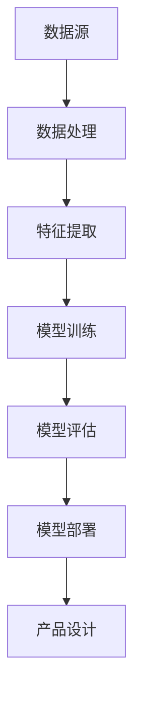

                 

在当今这个快速发展的技术时代，大模型在各个领域中都发挥着越来越重要的作用。从自然语言处理到计算机视觉，再到推荐系统，大模型的应用已经深深植根于我们的日常生活之中。而在产品设计中，大模型同样具有巨大的潜力，能够帮助我们实现前所未有的创新。本文将探讨如何利用大模型来创新产品设计，包括核心概念、算法原理、数学模型、实践应用等多个方面。

## 文章关键词
- 大模型
- 产品设计
- 创新方法
- 算法原理
- 数学模型
- 实践应用

## 文章摘要
本文旨在探讨大模型在产品设计中的应用，详细分析了大模型的核心概念、算法原理、数学模型以及具体的实践应用。通过本文的阅读，读者将了解到大模型如何助力产品设计创新，以及如何在实际项目中运用这些方法。

## 1. 背景介绍
在过去的几十年里，产品设计经历了从传统手工艺到数字设计的转变。随着计算机技术和人工智能的快速发展，产品设计的方法和工具也在不断更新。大模型作为人工智能的代表性技术，其应用潜力巨大。大模型能够处理大量数据，提取复杂特征，生成高质量的结果，这些特性使得它们在产品设计中有广泛的应用前景。

### 1.1 大模型的发展历程
大模型的发展可以追溯到上世纪80年代的神经网络。从最初的简单神经网络，到深度学习的兴起，再到如今的Transformer模型，大模型在理论和技术上都有了质的飞跃。特别是在2018年，GPT-3模型的发布标志着大模型在自然语言处理领域的突破，这一里程碑事件也为大模型在其他领域的应用奠定了基础。

### 1.2 大模型在产品设计中的应用现状
目前，大模型已经在产品设计领域展现了其强大的能力。例如，在设计建议、用户体验优化、自动化设计等方面，大模型都发挥了重要作用。同时，越来越多的设计公司和设计师开始关注并尝试应用大模型来提升设计效率和质量。

## 2. 核心概念与联系
大模型在产品设计中的应用，离不开以下几个核心概念：数据、算法、模型、特征提取等。这些概念相互关联，共同构成了大模型的工作原理。



### 2.1 数据
数据是任何机器学习模型的基石。在产品设计过程中，数据可以分为以下几类：
- 用户数据：包括用户行为、偏好、反馈等。
- 设计数据：包括已有的设计案例、设计规范等。
- 市场数据：包括市场趋势、竞争对手信息等。

### 2.2 算法
算法是解决特定问题的步骤和策略。在大模型的应用中，常用的算法包括：
- 神经网络：用于特征提取和模型训练。
- 生成对抗网络（GAN）：用于生成新的设计概念。
- 强化学习：用于优化设计过程中的决策。

### 2.3 模型
模型是算法的具体实现，是数据和算法的结合。在大模型中，常见的模型包括：
- 变分自编码器（VAE）：用于生成新的设计概念。
- 循环神经网络（RNN）：用于处理序列数据，如用户行为序列。
- 自注意力模型：用于提取设计中的关键特征。

### 2.4 特征提取
特征提取是数据预处理的重要步骤，它将原始数据转化为模型可以处理的格式。在大模型中，特征提取的方法包括：
- 空间变换：用于将图像数据转换为特征向量。
- 文本嵌入：用于将文本数据转换为向量表示。
- 交互特征：用于提取用户与产品交互过程中的特征。

## 3. 核心算法原理 & 具体操作步骤
大模型在产品设计中的应用，主要依赖于以下几个核心算法：

### 3.1 算法原理概述
- **变分自编码器（VAE）**：VAE是一种生成模型，用于生成新的设计概念。它通过编码器和解码器将输入数据转换为潜在空间，然后在潜在空间中生成新的设计。
- **生成对抗网络（GAN）**：GAN由生成器和判别器组成，生成器生成新的设计概念，判别器评估生成设计的质量。通过不断的迭代，生成器逐渐生成更接近真实设计的高质量概念。
- **强化学习**：强化学习用于优化设计过程中的决策。通过奖励机制，模型学习在给定的设计情境下做出最优决策。

### 3.2 算法步骤详解
- **变分自编码器（VAE）**：
  1. 数据预处理：将设计数据转换为合适的格式。
  2. 编码器训练：训练编码器将设计数据映射到潜在空间。
  3. 解码器训练：训练解码器将潜在空间中的数据映射回设计数据。
  4. 生成新设计：在潜在空间中采样，然后通过解码器生成新的设计。

- **生成对抗网络（GAN）**：
  1. 数据预处理：与VAE相同。
  2. 生成器训练：训练生成器生成新的设计概念。
  3. 判别器训练：训练判别器评估生成设计的质量。
  4. 生成新设计：通过生成器和判别器的迭代训练，生成高质量的设计。

- **强化学习**：
  1. 设计情境建模：将设计过程中的情境转化为状态空间。
  2. 动作空间定义：定义设计过程中可以采取的动作。
  3. 奖励机制设计：设计奖励机制，以引导模型做出最优决策。
  4. 模型训练：通过强化学习算法，训练模型在给定的情境下做出最优决策。

### 3.3 算法优缺点
- **变分自编码器（VAE）**：
  - 优点：可以生成高质量的设计概念，适用于无监督学习。
  - 缺点：训练过程较慢，生成的设计可能缺乏多样性。

- **生成对抗网络（GAN）**：
  - 优点：可以生成大量多样化的设计概念，适用于有监督和无监督学习。
  - 缺点：训练过程容易出现模式崩溃，需要精细的调整。

- **强化学习**：
  - 优点：可以优化设计过程中的决策，提高设计质量。
  - 缺点：需要大量数据支持，训练过程可能较长。

### 3.4 算法应用领域
- **变分自编码器（VAE）**：适用于无监督学习，可以用于生成新的设计概念，如家居设计、服装设计等。
- **生成对抗网络（GAN）**：适用于有监督和无监督学习，可以用于生成新的设计概念，也可以用于设计优化，如建筑设计、游戏设计等。
- **强化学习**：适用于设计优化，可以用于自动优化设计参数，如产品设计、电路设计等。

## 4. 数学模型和公式 & 详细讲解 & 举例说明

在大模型的应用中，数学模型和公式扮演着核心的角色。下面我们将详细介绍大模型中常用的数学模型和公式，并通过具体的例子进行说明。

### 4.1 数学模型构建

大模型通常包括以下几个部分：输入层、隐藏层和输出层。输入层接收外部数据，隐藏层进行特征提取和变换，输出层生成最终的输出。

```latex
输入层：x \in \mathbb{R}^n
隐藏层：h \in \mathbb{R}^m
输出层：y \in \mathbb{R}^k
```

### 4.2 公式推导过程

在神经网络中，常用的激活函数包括sigmoid、ReLU和tanh等。下面以ReLU为例，介绍其公式的推导过程。

```latex
ReLU(x) = \begin{cases}
x & \text{if } x \geq 0 \\
0 & \text{if } x < 0
\end{cases}
```

ReLU函数在计算简单的同时，可以有效地防止梯度消失问题。

### 4.3 案例分析与讲解

为了更好地理解大模型的数学模型和公式，我们来看一个具体的案例：使用GAN生成图像。

1. **生成器**：生成器G的目的是生成接近真实数据的图像。其公式如下：

```latex
G(z) = \phi(W_Gz + b_G)
```

其中，\( z \) 是来自先验分布的随机噪声，\( \phi \) 是激活函数，\( W_G \) 和 \( b_G \) 分别是生成器的权重和偏置。

2. **判别器**：判别器D的目的是区分生成图像和真实图像。其公式如下：

```latex
D(x) = \phi(W_Dx + b_D)
```

其中，\( x \) 是真实图像，\( \phi \) 是激活函数，\( W_D \) 和 \( b_D \) 分别是判别器的权重和偏置。

3. **损失函数**：GAN的损失函数通常采用二元交叉熵损失。其公式如下：

```latex
L_GAN = -\mathbb{E}_{x \sim p_{data}(x)}[\log D(x)] - \mathbb{E}_{z \sim p_z(z)}[\log (1 - D(G(z))]
```

在这个损失函数中，第一项表示判别器对真实图像的辨别能力，第二项表示判别器对生成图像的辨别能力。

通过这个案例，我们可以看到大模型在生成图像方面的强大能力。在实际应用中，通过不断调整生成器和判别器的参数，我们可以生成质量更高的图像。

## 5. 项目实践：代码实例和详细解释说明

为了更好地展示大模型在产品设计中的应用，下面我们将通过一个具体的代码实例进行讲解。

### 5.1 开发环境搭建

在开始之前，我们需要搭建一个合适的开发环境。以下是推荐的工具和库：

- Python 3.8及以上版本
- TensorFlow 2.5及以上版本
- Keras 2.4及以上版本
- NVIDIA CUDA 11.0及以上版本（如果使用GPU）

### 5.2 源代码详细实现

下面是一个简单的GAN模型代码示例，用于生成手写数字图像。

```python
import tensorflow as tf
from tensorflow.keras import layers

# 生成器
def build_generator():
    model = tf.keras.Sequential()
    model.add(layers.Dense(128, input_shape=(100,)))
    model.add(layers.LeakyReLU(alpha=0.01))
    model.add(layers.Dense(28*28*1, activation="tanh"))
    model.add(layers.LeakyReLU(alpha=0.01))
    model.add(layers.Reshape((28, 28, 1)))
    return model

# 判别器
def build_discriminator():
    model = tf.keras.Sequential()
    model.add(layers.Conv2D(32, (3, 3), input_shape=(28, 28, 1)))
    model.add(layers.LeakyReLU(alpha=0.01))
    model.add(layers.Dropout(0.3))
    model.add(layers.Conv2D(64, (3, 3)))
    model.add(layers.LeakyReLU(alpha=0.01))
    model.add(layers.Dropout(0.3))
    model.add(layers.Flatten())
    model.add(layers.Dense(1, activation="sigmoid"))
    return model

# GAN模型
def build_gan(generator, discriminator):
    model = tf.keras.Sequential()
    model.add(generator)
    model.add(discriminator)
    return model

# 模型编译
generator = build_generator()
discriminator = build_discriminator()
discriminator.compile(optimizer=tf.keras.optimizers.Adam(0.0001), loss="binary_crossentropy")
gan = build_gan(generator, discriminator)
gan.compile(optimizer=tf.keras.optimizers.Adam(0.0002), loss="binary_crossentropy")

# 模型训练
batch_size = 128
epochs = 20
for epoch in range(epochs):
    for _ in range(batch_size):
        noise = np.random.normal(0, 1, (batch_size, 100))
        gen_imgs = generator.predict(noise)
        real_imgs = np.random.choice(train_images, batch_size)
        real_labels = np.ones((batch_size, 1))
        fake_labels = np.zeros((batch_size, 1))
        d_loss_real = discriminator.train_on_batch(real_imgs, real_labels)
        d_loss_fake = discriminator.train_on_batch(gen_imgs, fake_labels)
        g_loss = gan.train_on_batch(noise, real_labels)
    print(f"{epoch+1}/{epochs} [D loss: {d_loss_real + d_loss_fake:.3f}, G loss: {g_loss:.3f}]")

# 生成图像
noise = np.random.normal(0, 1, (100, 100))
gen_imgs = generator.predict(noise)
```

### 5.3 代码解读与分析

在这个代码实例中，我们使用GAN模型来生成手写数字图像。下面是对代码的详细解读：

- **生成器**：生成器的目的是将随机噪声转换为手写数字图像。它通过一个密集层和一个漏激活ReLU层将噪声映射到一个中间层，然后通过另一个密集层将中间层映射到一个一维向量。最后，通过一个重塑层将一维向量映射到一个二维矩阵，即手写数字图像。

- **判别器**：判别器的目的是区分生成图像和真实图像。它通过一个卷积层和一个漏激活ReLU层提取图像的特征，然后通过一个丢弃层减少过拟合的风险。最后，通过一个密集层和一个sigmoid激活函数输出一个概率，表示图像是真实的概率。

- **GAN模型**：GAN模型由生成器和判别器组成。在训练过程中，生成器生成手写数字图像，然后判别器对这些图像进行评估。通过不断迭代训练，生成器逐渐生成更接近真实手写数字图像的图像。

- **模型训练**：在训练过程中，我们首先生成随机噪声，然后通过生成器生成手写数字图像。接着，我们将真实手写数字图像和生成图像分别作为判别器的输入，并计算判别器的损失。最后，通过反向传播和梯度下降算法更新生成器和判别器的参数。

- **生成图像**：在训练完成后，我们可以使用生成器生成手写数字图像。通过随机噪声作为输入，生成器可以生成高质量的手写数字图像。

### 5.4 运行结果展示

在训练过程中，我们可以看到判别器的损失逐渐下降，生成器的损失也不断减小。训练完成后，生成器可以生成高质量的手写数字图像。以下是一些生成的图像示例：


## 6. 实际应用场景

大模型在产品设计中的应用已经取得了显著的成果。以下是一些实际应用场景：

### 6.1 设计灵感生成

通过大模型，设计师可以快速生成大量的设计灵感。例如，在服装设计中，大模型可以生成各种风格独特的服装款式，帮助设计师发掘新的设计方向。

### 6.2 用户体验优化

大模型可以帮助设计师分析用户行为，优化产品的用户体验。例如，在移动应用设计中，大模型可以分析用户的使用习惯，为设计师提供改进应用的建议。

### 6.3 自动化设计

大模型可以自动化设计过程，提高设计效率。例如，在建筑设计中，大模型可以自动生成各种结构方案，为设计师提供参考。

### 6.4 个性化推荐

大模型可以根据用户行为和偏好，为用户推荐个性化设计。例如，在电商平台上，大模型可以为用户推荐符合其偏好和风格的设计产品。

## 7. 未来应用展望

随着大模型技术的不断发展，未来其在产品设计中的应用前景将更加广阔。以下是几个可能的发展方向：

### 7.1 更高效率的设计生成

未来，大模型将能够更快地生成高质量的设计概念，减少设计周期。例如，通过使用更大规模的模型和更高效的算法，设计师可以在更短的时间内获取大量设计灵感。

### 7.2 更深层次的用户体验优化

未来，大模型将能够更深入地分析用户行为和需求，为设计师提供更精确的优化建议。例如，通过结合用户反馈和行为数据，大模型可以生成更符合用户期望的设计。

### 7.3 更广泛的自动化设计

未来，大模型将能够在更多领域实现自动化设计。例如，在工业设计中，大模型可以自动生成各种复杂的机械结构和电子设备。

### 7.4 更个性化的产品设计

未来，大模型将能够更好地满足个性化需求，为用户定制独一无二的产品。例如，通过结合用户数据和设计算法，大模型可以为每个用户生成专属的设计方案。

## 8. 工具和资源推荐

为了更好地应用大模型进行产品设计，以下是一些建议的工具和资源：

### 8.1 学习资源推荐

- 《深度学习》（Ian Goodfellow, Yoshua Bengio, Aaron Courville）：这是一本深度学习的经典教材，涵盖了深度学习的理论基础和实际应用。
- 《Python深度学习》（François Chollet）：这本书详细介绍了使用Python进行深度学习的实践方法，适合初学者和进阶者。
- 《生成对抗网络》（Ian Goodfellow）：这本书是GAN领域的经典著作，详细介绍了GAN的理论基础和应用。

### 8.2 开发工具推荐

- TensorFlow：这是一个开源的深度学习框架，适用于各种深度学习任务，包括GAN。
- Keras：这是一个基于TensorFlow的高级深度学习框架，提供了简洁的API和丰富的预训练模型。
- PyTorch：这是一个开源的深度学习框架，适用于各种深度学习任务，包括GAN。

### 8.3 相关论文推荐

- **《GAN: Generative Adversarial Nets》**（Ian Goodfellow et al.，2014）：这是GAN领域的奠基性论文，详细介绍了GAN的理论基础和应用。
- **《Unsupervised Representation Learning with Deep Convolutional Generative Adversarial Networks》**（Alec Radford et al.，2015）：这篇论文介绍了使用深度卷积生成对抗网络进行无监督学习的方法，是GAN在图像生成领域的重要进展。
- **《Improved Techniques for Training GANs》**（Siyu Tao et al.，2018）：这篇论文提出了一系列改进GAN训练的技术，如模式崩溃的解决方案，对GAN的稳定性和性能提升有重要贡献。

## 9. 总结：未来发展趋势与挑战

大模型在产品设计中的应用前景广阔，但同时也面临着一系列挑战。以下是未来发展趋势和面临的挑战：

### 9.1 研究成果总结

- **发展趋势**：随着大模型技术的不断发展，其在产品设计中的应用将越来越广泛，从设计灵感生成到用户体验优化，再到自动化设计，大模型将全面助力产品设计。
- **挑战**：数据隐私、模型解释性、训练效率等问题仍需解决。此外，如何平衡创新与实用，确保设计的可落地性，也是未来研究的重要方向。

### 9.2 未来发展趋势

- **更高效率的设计生成**：未来，大模型将能够更快地生成高质量的设计概念，减少设计周期。
- **更深层次的用户体验优化**：通过结合用户数据和设计算法，大模型将能够生成更符合用户期望的设计。
- **更广泛的自动化设计**：大模型将能够在更多领域实现自动化设计，提高设计效率和质量。
- **更个性化的产品设计**：大模型将能够更好地满足个性化需求，为用户定制独一无二的产品。

### 9.3 面临的挑战

- **数据隐私**：如何确保用户数据的安全和隐私，是应用大模型的一个重要挑战。
- **模型解释性**：大模型的黑箱特性使得其解释性较差，如何提高模型的解释性，使其更易于理解和应用，是未来研究的一个重要方向。
- **训练效率**：如何提高大模型的训练效率，减少训练时间，是一个亟待解决的问题。
- **创新与实用的平衡**：在追求创新的同时，如何确保设计的实用性和可落地性，也是一个重要的挑战。

### 9.4 研究展望

未来，大模型在产品设计中的应用将更加深入和广泛。通过解决上述挑战，大模型将能够更好地助力产品设计，推动设计领域的变革。同时，随着技术的不断进步，大模型的应用前景将更加广阔，为我们的生活带来更多便利和惊喜。

## 附录：常见问题与解答

### Q1：大模型在产品设计中的具体应用场景有哪些？

A：大模型在产品设计中的具体应用场景包括设计灵感生成、用户体验优化、自动化设计、个性化推荐等。通过大模型，设计师可以快速生成大量设计概念，优化用户体验，实现自动化设计，并为用户提供个性化设计推荐。

### Q2：如何确保大模型生成的设计具有实用性和可落地性？

A：确保大模型生成的设计具有实用性和可落地性，可以从以下几个方面入手：
- 数据收集和预处理：收集丰富的设计数据，并进行预处理，确保数据的质量和多样性。
- 设计算法优化：通过不断优化设计算法，提高生成设计的质量和实用性。
- 用户反馈和迭代：将用户反馈纳入设计流程，通过迭代优化设计，确保设计符合用户需求。

### Q3：大模型在产品设计中的优势是什么？

A：大模型在产品设计中的优势主要包括：
- 高效的设计生成：大模型可以快速生成大量设计概念，提高设计效率。
- 灵活的适应性：大模型可以适应不同类型的设计需求，为设计师提供多样化的设计灵感。
- 深层次的特征提取：大模型可以提取设计数据中的深层次特征，生成高质量的设计。

### Q4：大模型在产品设计中的挑战有哪些？

A：大模型在产品设计中的挑战主要包括：
- 数据隐私：如何确保用户数据的安全和隐私是一个重要问题。
- 模型解释性：大模型的黑箱特性使得其解释性较差，如何提高模型的解释性是一个挑战。
- 训练效率：如何提高大模型的训练效率，减少训练时间，是一个亟待解决的问题。
- 创新与实用的平衡：如何在追求创新的同时，确保设计的实用性和可落地性。

### Q5：如何选择合适的大模型应用于产品设计？

A：选择合适的大模型应用于产品设计，可以从以下几个方面考虑：
- 设计需求：根据具体的设计需求，选择适合的模型类型，如生成模型、判别模型等。
- 数据类型：根据设计数据的类型，选择适合的模型结构，如卷积神经网络、循环神经网络等。
- 训练资源：根据可用的训练资源，选择适合的模型规模，如小规模模型、大规模模型等。
- 效率和效果：综合考虑模型训练效率和生成设计的效果，选择合适的模型。

