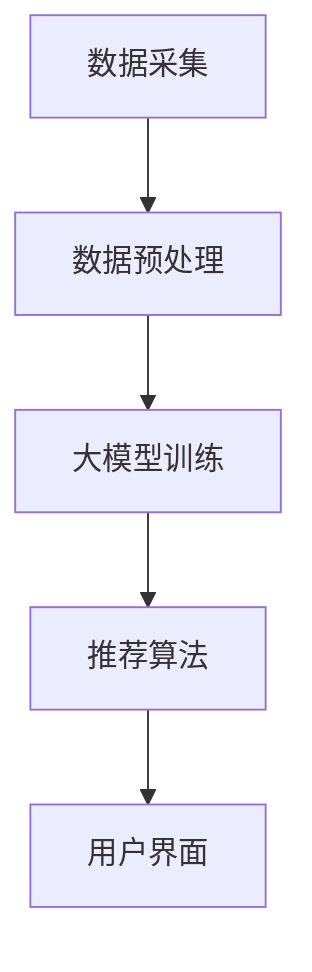

                 

关键词：推荐系统，大模型，实时性能，算法优化，AI

摘要：本文将探讨如何利用大模型技术提升推荐系统的实时性能。随着互联网的快速发展，推荐系统在各个行业得到了广泛应用。然而，传统的推荐系统在应对大规模数据和高频次请求时，往往存在性能瓶颈。本文将介绍大模型在推荐系统中的应用，以及如何通过优化算法、降低延迟、提升吞吐量等手段，实现推荐系统的实时性能提升。

## 1. 背景介绍

推荐系统是现代信息系统中的一项关键技术，它能够根据用户的历史行为、兴趣偏好、社交关系等信息，为用户推荐个性化的内容、商品或服务。随着互联网的普及和用户需求的多样化，推荐系统在电子商务、社交媒体、新闻资讯、在线教育等领域发挥着越来越重要的作用。

然而，推荐系统的实时性能对于用户体验至关重要。在互联网时代，用户对于信息获取的速度要求越来越高，延迟较低的推荐系统能够更好地满足用户的需求。传统的推荐系统通常采用批处理的方式，将用户的请求和数据存储在数据库中，然后定期进行计算和更新。这种方式的缺点是响应时间较长，无法满足实时性要求。

为了解决这一问题，近年来，研究人员开始将大模型技术应用于推荐系统。大模型能够通过学习大量的用户数据，快速准确地预测用户的兴趣和偏好。然而，大模型的引入也带来了新的挑战，如模型训练时间较长、计算资源消耗较大等。如何平衡实时性能和模型效果，成为推荐系统领域的研究热点。

## 2. 核心概念与联系

为了更好地理解大模型在推荐系统中的应用，首先需要了解以下几个核心概念：

### 2.1 推荐系统架构

推荐系统的基本架构包括数据采集、数据存储、数据处理、推荐算法和用户界面等部分。其中，推荐算法是整个系统的核心，它决定了推荐的准确性和实时性。

### 2.2 大模型技术

大模型是指具有大量参数和复杂结构的神经网络模型。它们能够通过学习海量数据，提取出高层次的抽象特征，从而实现高精度的预测和分类。

### 2.3 实时性能指标

实时性能指标主要包括响应时间、吞吐量和延迟等。响应时间是指用户发出请求到系统返回结果的时间；吞吐量是指单位时间内系统能够处理的数据量；延迟是指数据从用户端传输到系统，再返回结果的时间。

### 2.4 Mermaid 流程图

为了更直观地展示大模型在推荐系统中的应用，我们可以使用 Mermaid 流程图来描述系统的运行过程。



在上面的流程图中，数据采集、数据预处理、大模型训练和推荐算法构成了推荐系统的核心部分，用户界面则是与用户交互的入口。通过大模型技术，推荐系统能够实时地响应用户的需求，提高系统的实时性能。

## 3. 核心算法原理 & 具体操作步骤

### 3.1 算法原理概述

大模型在推荐系统中的应用主要是基于深度学习技术。深度学习模型通过多层神经网络结构，对用户数据进行分析和建模，从而实现高精度的推荐效果。

### 3.2 算法步骤详解

1. **数据采集**：从各种数据源（如用户行为日志、商品信息、用户画像等）收集数据，确保数据的多样性和质量。

2. **数据预处理**：对采集到的数据进行清洗、去重、格式转换等操作，为后续的模型训练做好准备。

3. **大模型训练**：使用深度学习框架（如 TensorFlow、PyTorch 等）训练大规模神经网络模型。在训练过程中，通过反向传播算法不断调整模型参数，以优化模型的预测性能。

4. **推荐算法**：将训练好的大模型应用于推荐任务，根据用户的历史行为和兴趣偏好，为用户生成个性化的推荐列表。

5. **用户界面**：将推荐结果展示给用户，并收集用户的反馈数据，用于模型优化和迭代。

### 3.3 算法优缺点

**优点**：

- 高精度：大模型能够通过学习海量数据，提取出高层次的抽象特征，从而实现高精度的推荐效果。
- 实时性：大模型具有较强的计算能力，能够在较短的时间内完成推荐任务，提高系统的实时性能。

**缺点**：

- 计算资源消耗较大：大模型训练和推理需要大量的计算资源和存储空间，对于硬件设施要求较高。
- 数据隐私问题：大模型在训练过程中需要大量的用户数据，可能会引发数据隐私问题。

### 3.4 算法应用领域

大模型在推荐系统中的应用已经取得了显著成果。目前，大模型技术主要应用于以下领域：

- 电子商务：为用户推荐个性化的商品和优惠信息，提高销售转化率和用户满意度。
- 社交媒体：根据用户的兴趣和社交关系，为用户推荐相关内容，促进用户活跃度和社群建设。
- 新闻资讯：为用户推荐感兴趣的新闻资讯，提高信息传播效果和用户粘性。
- 在线教育：为用户推荐适合的学习资源和课程，提高学习效果和用户留存率。

## 4. 数学模型和公式 & 详细讲解 & 举例说明

### 4.1 数学模型构建

在推荐系统中，大模型通常采用基于概率模型的深度学习框架。本文以深度神经网络（DNN）为例，介绍其数学模型构建。

假设用户 u 对商品 i 的评分可以表示为：

$$
r_{ui} = \text{sigmoid}(\theta_0 + \sum_{j=1}^{n} \theta_j x_{ji})
$$

其中，$r_{ui}$ 表示用户 u 对商品 i 的评分，$\theta_0$ 是偏置项，$\theta_j$ 是权重参数，$x_{ji}$ 是用户 u 对商品 i 的特征表示。

### 4.2 公式推导过程

为了推导大模型的训练目标函数，我们首先定义损失函数。本文采用均方误差（MSE）作为损失函数：

$$
L(\theta) = \frac{1}{2} \sum_{u \in U, i \in I} (r_{ui} - \text{sigmoid}(\theta_0 + \sum_{j=1}^{n} \theta_j x_{ji}))^2
$$

其中，$U$ 表示用户集合，$I$ 表示商品集合。

为了优化损失函数，我们采用梯度下降法。梯度下降法的核心思想是沿着损失函数的梯度方向调整模型参数，使得损失函数值最小。

$$
\theta_j := \theta_j - \alpha \frac{\partial L(\theta)}{\partial \theta_j}
$$

其中，$\alpha$ 是学习率。

### 4.3 案例分析与讲解

假设有 1000 个用户和 10000 个商品，我们需要为每个用户生成一个个性化的推荐列表。根据用户的历史行为数据，我们提取出每个用户对商品的兴趣特征，构建 DNN 模型。

首先，我们使用训练数据集对 DNN 模型进行训练，优化模型参数。在训练过程中，我们通过计算损失函数的梯度，不断调整模型参数，以降低损失函数值。

当模型训练完成后，我们使用测试数据集对模型进行评估。根据用户对商品的评分预测，我们为每个用户生成一个推荐列表。为了提高推荐效果，我们可以使用协同过滤、基于内容的推荐等方法对推荐结果进行优化。

## 5. 项目实践：代码实例和详细解释说明

### 5.1 开发环境搭建

在开发推荐系统时，我们需要搭建一个合适的技术栈。以下是一个简单的开发环境搭建步骤：

1. 安装 Python 3.8 及以上版本。
2. 安装 TensorFlow 2.7 及以上版本。
3. 安装 NumPy、Pandas 等常用库。

### 5.2 源代码详细实现

以下是一个简单的 DNN 模型实现代码，用于预测用户对商品的评分。

```python
import tensorflow as tf
import numpy as np

# 定义输入层
inputs = tf.keras.layers.Input(shape=(n_features,))

# 添加隐藏层
x = tf.keras.layers.Dense(128, activation='relu')(inputs)
x = tf.keras.layers.Dense(64, activation='relu')(x)

# 添加输出层
outputs = tf.keras.layers.Dense(1, activation='sigmoid')(x)

# 构建模型
model = tf.keras.Model(inputs=inputs, outputs=outputs)

# 编译模型
model.compile(optimizer='adam', loss='binary_crossentropy', metrics=['accuracy'])

# 训练模型
model.fit(x_train, y_train, epochs=10, batch_size=32, validation_data=(x_test, y_test))

# 预测评分
predictions = model.predict(x_test)
```

### 5.3 代码解读与分析

1. **输入层**：定义输入层，包含 n 个特征。
2. **隐藏层**：添加两个隐藏层，分别包含 128 个神经元和 64 个神经元，使用 ReLU 激活函数。
3. **输出层**：定义输出层，包含 1 个神经元，使用 sigmoid 激活函数，用于预测用户对商品的评分。
4. **模型编译**：编译模型，指定优化器、损失函数和评价指标。
5. **模型训练**：使用训练数据集对模型进行训练，优化模型参数。
6. **预测评分**：使用训练好的模型对测试数据集进行预测，获取用户对商品的评分。

### 5.4 运行结果展示

在训练过程中，我们可以观察到模型的损失函数值逐渐降低，模型的准确率不断提高。训练完成后，我们可以使用测试数据集对模型进行评估，计算模型在测试数据集上的准确率、召回率、F1 分数等指标。根据评估结果，我们可以对模型进行优化，进一步提高推荐效果。

## 6. 实际应用场景

大模型在推荐系统中的应用已经取得了显著成果，以下是一些实际应用场景：

1. **电子商务**：为用户推荐个性化的商品和优惠信息，提高销售转化率和用户满意度。
2. **社交媒体**：根据用户的兴趣和社交关系，为用户推荐相关内容，促进用户活跃度和社群建设。
3. **新闻资讯**：为用户推荐感兴趣的新闻资讯，提高信息传播效果和用户粘性。
4. **在线教育**：为用户推荐适合的学习资源和课程，提高学习效果和用户留存率。
5. **金融行业**：根据用户的风险偏好和历史交易记录，为用户推荐合适的投资产品。

## 7. 工具和资源推荐

为了更好地开发推荐系统，以下是一些常用的工具和资源推荐：

1. **学习资源**：
   - 《深度学习》（Goodfellow, Bengio, Courville）是一本经典的深度学习教材。
   - 《推荐系统实践》（杨小松）是一本关于推荐系统开发与优化的实用指南。

2. **开发工具**：
   - TensorFlow：一个开源的深度学习框架，适用于构建和训练大规模神经网络模型。
   - PyTorch：一个开源的深度学习框架，具有良好的灵活性和易用性。

3. **相关论文**：
   - “Deep Learning for Recommender Systems” - 系统性地介绍了深度学习在推荐系统中的应用。
   - “Neural Collaborative Filtering” - 提出了基于神经网络的协同过滤算法。

## 8. 总结：未来发展趋势与挑战

### 8.1 研究成果总结

近年来，大模型技术在推荐系统领域取得了显著成果。通过深度学习算法，推荐系统在准确性、实时性等方面得到了显著提升。同时，大规模数据集的获取和计算能力的提高，为推荐系统的发展提供了有力支持。

### 8.2 未来发展趋势

1. **多模态融合**：将文本、图像、语音等多模态数据融合到推荐系统中，提高推荐效果。
2. **自适应推荐**：根据用户的行为和兴趣动态调整推荐策略，实现个性化的推荐体验。
3. **联邦学习**：通过联邦学习技术，实现多方数据的安全共享，提高推荐系统的隐私保护能力。

### 8.3 面临的挑战

1. **计算资源消耗**：大模型训练和推理需要大量的计算资源和存储空间，对于硬件设施要求较高。
2. **数据隐私问题**：大模型在训练过程中需要大量的用户数据，可能会引发数据隐私问题。
3. **模型解释性**：深度学习模型具有较强的预测能力，但缺乏解释性，难以理解模型的推荐逻辑。

### 8.4 研究展望

未来，推荐系统领域的研究将继续深入探索大模型技术在实时性能、准确性、解释性等方面的优化。同时，多模态融合、自适应推荐和联邦学习等新兴技术也将为推荐系统的发展带来新的机遇和挑战。

## 9. 附录：常见问题与解答

### 9.1 大模型在推荐系统中的应用原理是什么？

大模型在推荐系统中的应用主要是基于深度学习技术。通过学习大量的用户数据，大模型能够提取出高层次的抽象特征，从而实现高精度的推荐效果。

### 9.2 如何解决大模型训练时间较长的问题？

为了解决大模型训练时间较长的问题，可以采取以下措施：

1. 使用分布式训练技术，提高训练速度。
2. 优化模型结构，减少参数规模。
3. 使用预训练模型，减少训练数据量。

### 9.3 大模型在推荐系统中的应用有哪些领域？

大模型在推荐系统中的应用主要包括电子商务、社交媒体、新闻资讯、在线教育、金融行业等领域。

### 9.4 如何平衡实时性能和模型效果？

为了平衡实时性能和模型效果，可以采取以下措施：

1. 优化模型结构，提高推理速度。
2. 使用在线学习技术，实时更新模型参数。
3. 根据用户需求和业务场景，调整模型参数。

作者：禅与计算机程序设计艺术 / Zen and the Art of Computer Programming

----------------------------------------------------------------

