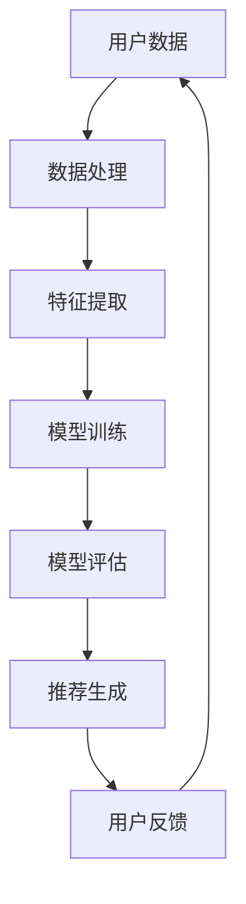

                 

关键词：推荐系统、大模型、泛化能力、AI、机器学习、数据处理、用户行为分析、算法优化、资源推荐

> 摘要：随着人工智能和机器学习技术的不断发展，推荐系统在互联网应用中扮演着越来越重要的角色。然而，如何提升推荐系统的泛化能力，使其在更广泛的用户群体和应用场景中保持高效，成为了一个亟待解决的问题。本文将探讨利用大模型提升推荐系统泛化能力的方法，通过深入分析核心概念、算法原理、数学模型以及实际应用场景，为推荐系统的优化提供新的思路和方向。

## 1. 背景介绍

推荐系统作为人工智能领域的一个重要分支，近年来取得了显著的进展。通过分析用户的历史行为和偏好，推荐系统能够为用户推荐个性化内容，从而提高用户的满意度和活跃度。然而，传统的推荐系统往往面临以下挑战：

1. **数据稀疏**：用户行为数据通常是稀疏的，这使得推荐系统难以准确捕捉用户的真实偏好。
2. **冷启动问题**：对于新用户或新物品，由于缺乏足够的历史数据，推荐系统难以做出有效的推荐。
3. **过度拟合**：推荐系统可能在训练数据上表现得很好，但在实际应用中却无法泛化到新用户或新物品。

为了解决这些问题，近年来研究人员提出了各种算法和技术，如基于协同过滤、基于内容的推荐、基于模型的推荐等。然而，这些方法在提升推荐效果的同时，也面临泛化能力不足的问题。

大模型，如深度神经网络，在自然语言处理、计算机视觉等领域取得了突破性进展。因此，本文将探讨如何利用大模型提升推荐系统的泛化能力，使其在不同用户群体和应用场景中都能保持高效。

## 2. 核心概念与联系

### 2.1 推荐系统基础

推荐系统主要由以下几部分组成：

1. **用户数据**：包括用户的基本信息、行为记录等。
2. **物品数据**：包括物品的属性、标签、评分等。
3. **推荐算法**：根据用户数据和物品数据，计算推荐分数，生成推荐列表。

推荐系统的核心目标是通过分析用户的历史行为和偏好，预测用户可能感兴趣的物品，从而提高用户的满意度和活跃度。

### 2.2 大模型与机器学习

大模型通常是指参数规模巨大的神经网络模型，如深度神经网络（DNN）、变换器（Transformer）等。这些模型在训练过程中能够自动学习数据中的复杂模式和关联，从而提高模型的泛化能力。

机器学习是推荐系统的核心技术之一，包括以下几种常见的算法：

1. **线性模型**：如线性回归、逻辑回归等，用于预测用户对物品的评分。
2. **协同过滤**：基于用户行为数据，计算用户之间的相似度，生成推荐列表。
3. **基于内容的推荐**：基于物品的属性和标签，为用户推荐相似的内容。
4. **深度学习**：利用深度神经网络，自动学习数据中的复杂模式和关联。

### 2.3 泛化能力

泛化能力是指模型在未见过的数据上表现良好的能力。提升泛化能力是推荐系统研究的核心目标之一。传统的推荐系统往往在训练数据上表现得很好，但在实际应用中却无法泛化到新用户或新物品，导致推荐效果不佳。

### 2.4 Mermaid 流程图

下面是一个简单的 Mermaid 流程图，展示了推荐系统的基础架构：



## 3. 核心算法原理 & 具体操作步骤

### 3.1 算法原理概述

利用大模型提升推荐系统泛化能力的方法主要包括以下几个步骤：

1. **数据预处理**：对用户数据和物品数据进行清洗、去重、填充等处理，确保数据质量。
2. **特征提取**：从用户数据和物品数据中提取出有用的特征，如用户活跃度、物品流行度、用户兴趣标签等。
3. **模型训练**：利用深度神经网络等大模型，对提取的特征进行建模和训练，学习数据中的复杂模式和关联。
4. **模型评估**：通过交叉验证、A/B 测试等方法，评估模型的泛化能力和推荐效果。
5. **推荐生成**：根据训练好的模型，生成个性化推荐列表，为用户推荐感兴趣的物品。

### 3.2 算法步骤详解

#### 3.2.1 数据预处理

数据预处理是推荐系统建模的重要步骤，主要包括以下几个方面：

1. **数据清洗**：去除重复数据、缺失值填充、异常值处理等。
2. **特征工程**：提取用户和物品的特征，如用户活跃度、物品流行度、用户兴趣标签等。
3. **数据归一化**：将不同特征的数据进行归一化处理，确保数据规模在相同的范围内。

#### 3.2.2 特征提取

特征提取是推荐系统建模的关键步骤，通过提取用户和物品的特征，可以更好地捕捉用户的兴趣和物品的属性。常见的特征提取方法包括：

1. **用户行为特征**：如用户活跃度、用户点击率、用户浏览时长等。
2. **物品属性特征**：如物品流行度、物品类别、物品标签等。
3. **交互特征**：如用户与物品的交互次数、用户对物品的评分等。

#### 3.2.3 模型训练

模型训练是推荐系统建模的核心步骤，通过训练深度神经网络等大模型，可以学习数据中的复杂模式和关联。常见的模型训练方法包括：

1. **基于协同过滤的模型**：如矩阵分解、潜在因子模型等。
2. **基于内容的模型**：如文本分类、图像识别等。
3. **基于深度学习的模型**：如卷积神经网络（CNN）、循环神经网络（RNN）等。

#### 3.2.4 模型评估

模型评估是推荐系统建模的重要步骤，通过评估模型的泛化能力和推荐效果，可以确定模型的性能和优化方向。常见的模型评估方法包括：

1. **交叉验证**：通过将数据集划分为训练集和验证集，评估模型的泛化能力。
2. **A/B 测试**：通过在实际应用中对比不同模型的推荐效果，确定最佳模型。
3. **推荐准确率**：计算推荐列表中用户实际喜欢的物品的比例。

#### 3.2.5 推荐生成

根据训练好的模型，生成个性化推荐列表，为用户推荐感兴趣的物品。常见的推荐生成方法包括：

1. **基于相似度的推荐**：计算用户与物品之间的相似度，推荐与用户兴趣相似的物品。
2. **基于内容的推荐**：根据物品的属性和标签，为用户推荐相似的内容。
3. **基于模型的推荐**：根据训练好的模型，生成个性化的推荐列表。

### 3.3 算法优缺点

#### 优点

1. **高效性**：大模型具有强大的学习能力，可以快速捕捉数据中的复杂模式和关联。
2. **灵活性**：大模型可以处理多种类型的特征，如文本、图像、音频等，从而提高推荐效果。
3. **泛化能力**：通过深度学习等方法，大模型可以更好地泛化到新用户或新物品，提高推荐系统的稳定性。

#### 缺点

1. **计算资源消耗**：大模型需要大量的计算资源进行训练和推理，对硬件设备要求较高。
2. **数据需求**：大模型需要大量的数据来训练，对于数据稀疏的场景，可能效果不佳。
3. **过拟合风险**：大模型容易过拟合训练数据，导致泛化能力不足。

### 3.4 算法应用领域

利用大模型提升推荐系统的泛化能力可以应用于多个领域，如电子商务、社交媒体、在线教育、金融理财等。以下是一些具体的案例：

1. **电子商务**：利用大模型为用户推荐个性化的商品，提高购物体验和转化率。
2. **社交媒体**：利用大模型为用户提供个性化的内容推荐，提高用户活跃度和留存率。
3. **在线教育**：利用大模型为学生推荐个性化的课程和学习资源，提高学习效果和满意度。
4. **金融理财**：利用大模型为用户提供个性化的投资建议和理财方案，提高投资收益和安全性。

## 4. 数学模型和公式 & 详细讲解 & 举例说明

### 4.1 数学模型构建

为了构建一个能够提升推荐系统泛化能力的大模型，我们可以采用基于深度学习的模型，如多层感知机（MLP）、卷积神经网络（CNN）或变换器（Transformer）等。以下是一个基于MLP的数学模型构建过程：

#### 4.1.1 输入层

输入层接收用户和物品的特征向量，例如用户特征向量\( \textbf{X}_u \)和物品特征向量\( \textbf{X}_i \)，其维度分别为\( m_u \)和\( m_i \)。

\[ \textbf{X}_u \in \mathbb{R}^{m_u \times 1} \]
\[ \textbf{X}_i \in \mathbb{R}^{m_i \times 1} \]

#### 4.1.2 隐藏层

隐藏层通过一系列的神经网络层来对特征向量进行处理，每一层都将输入映射到更高维的空间中，以提取更复杂的特征。假设隐藏层的维度为\( m_h \)。

\[ \textbf{H}_1 = \sigma(W_1 \textbf{X}_u + W_2 \textbf{X}_i + b_1) \]
\[ \textbf{H}_2 = \sigma(W_3 \textbf{H}_1 + b_2) \]
\[ \textbf{H}_3 = \sigma(W_4 \textbf{H}_2 + b_3) \]

其中，\( \sigma \)表示激活函数，常用的有Sigmoid、ReLU等；\( W \)和\( b \)分别是权重和偏置。

#### 4.1.3 输出层

输出层负责预测用户对物品的评分或推荐概率。输出层的维度为1，表示一个预测的评分或概率。

\[ \textbf{Y} = \textbf{W}_5 \textbf{H}_3 + b_5 \]

#### 4.1.4 损失函数

在训练过程中，我们需要定义一个损失函数来衡量预测值与真实值之间的差距。常用的损失函数有均方误差（MSE）和交叉熵（CE）。

\[ \text{MSE} = \frac{1}{n} \sum_{i=1}^{n} (\textbf{Y}_i - \textbf{y}_i)^2 \]
\[ \text{CE} = -\frac{1}{n} \sum_{i=1}^{n} \sum_{j=1}^{C} y_{ij} \log(\hat{y}_{ij}) \]

其中，\( \textbf{Y} \)是预测的评分向量，\( \textbf{y} \)是真实的评分向量，\( C \)是物品的类别数，\( \hat{y}_{ij} \)是预测的物品\( j \)的评分。

### 4.2 公式推导过程

为了推导上述数学模型，我们需要考虑以下几个方面：

1. **输入特征**：用户特征和物品特征是输入层的主要组成部分，它们通过嵌入层转换为向量。
2. **神经网络层**：通过多层神经网络层，对输入特征进行变换和融合，提取更高层次的特征。
3. **输出层**：输出层将隐藏层的信息进行整合，生成预测的评分或概率。

#### 4.2.1 嵌入层

嵌入层将用户和物品的特征映射到低维空间中，便于神经网络处理。嵌入层可以通过以下公式进行推导：

\[ \textbf{X}_u^{emb} = \text{Embed}(\textbf{X}_u) \]
\[ \textbf{X}_i^{emb} = \text{Embed}(\textbf{X}_i) \]

其中，\( \text{Embed} \)是一个映射函数，用于将高维特征转换为低维向量。

#### 4.2.2 神经网络层

神经网络层通过权重矩阵和偏置向量对输入特征进行变换。假设隐藏层有\( L \)层，每层都有相应的权重矩阵和偏置向量：

\[ \textbf{H}_l = \sigma(W_l \textbf{H}_{l-1} + b_l) \]

其中，\( \sigma \)是激活函数，\( W_l \)和\( b_l \)分别是第\( l \)层的权重矩阵和偏置向量。

#### 4.2.3 输出层

输出层通过权重矩阵和偏置向量对隐藏层的信息进行整合，生成预测的评分或概率：

\[ \textbf{Y} = \textbf{W}_5 \textbf{H}_L + b_5 \]

其中，\( \textbf{W}_5 \)是输出层的权重矩阵，\( b_5 \)是输出层的偏置向量。

### 4.3 案例分析与讲解

为了更好地理解上述数学模型，我们通过一个具体的案例进行讲解。假设我们有一个推荐系统，旨在为用户推荐电影。用户特征包括用户年龄、性别、职业等，电影特征包括电影类型、演员、导演等。

#### 4.3.1 特征提取

首先，我们对用户特征和电影特征进行提取，例如：

\[ \textbf{X}_u = \begin{bmatrix} \text{age} \\ \text{gender} \\ \text{occupation} \end{bmatrix} \]
\[ \textbf{X}_i = \begin{bmatrix} \text{genre} \\ \text{actor} \\ \text{director} \end{bmatrix} \]

#### 4.3.2 模型构建

接下来，我们构建一个基于MLP的推荐模型，隐藏层有2层，每层有512个神经元。激活函数使用ReLU。

\[ \textbf{H}_1 = \sigma(W_1 \textbf{X}_u + W_2 \textbf{X}_i + b_1) \]
\[ \textbf{H}_2 = \sigma(W_3 \textbf{H}_1 + b_2) \]
\[ \textbf{H}_3 = \sigma(W_4 \textbf{H}_2 + b_3) \]
\[ \textbf{Y} = \textbf{W}_5 \textbf{H}_3 + b_5 \]

#### 4.3.3 模型训练

我们使用均方误差（MSE）作为损失函数，通过梯度下降（GD）算法训练模型。训练数据集包含10000个用户和10000部电影，用户对电影的评分作为真实值。

\[ \text{MSE} = \frac{1}{n} \sum_{i=1}^{n} (\textbf{Y}_i - \textbf{y}_i)^2 \]

#### 4.3.4 模型评估

通过交叉验证，我们将数据集划分为训练集和验证集，训练集用于模型训练，验证集用于模型评估。评估指标包括准确率（Accuracy）、均方误差（MSE）等。

\[ \text{Accuracy} = \frac{\text{正确预测的数量}}{\text{总预测数量}} \]

#### 4.3.5 推荐结果

根据训练好的模型，我们为每个用户生成个性化的电影推荐列表。用户对电影的评分作为预测值，与真实值进行对比，评估推荐效果。

## 5. 项目实践：代码实例和详细解释说明

### 5.1 开发环境搭建

在开始编写代码之前，我们需要搭建一个适合推荐系统开发的编程环境。这里我们使用Python作为主要编程语言，并使用以下库：

- NumPy：用于矩阵运算和数据处理。
- Pandas：用于数据操作和预处理。
- Scikit-learn：用于机器学习和模型评估。
- TensorFlow：用于构建和训练深度学习模型。

安装以上库后，我们就可以开始编写代码了。

### 5.2 源代码详细实现

以下是一个简单的基于MLP的推荐系统实现示例。我们假设用户和物品的特征已经被提取为NumPy数组，并保存在`user_features.npy`和`item_features.npy`文件中。

```python
import numpy as np
import pandas as pd
from sklearn.model_selection import train_test_split
from tensorflow.keras.models import Sequential
from tensorflow.keras.layers import Dense
from tensorflow.keras.optimizers import SGD
from tensorflow.keras.losses import MeanSquaredError

# 读取用户和物品特征
user_features = np.load('user_features.npy')
item_features = np.load('item_features.npy')

# 拼接用户和物品特征
X = np.hstack((user_features, item_features))

# 假设我们有一个评分矩阵
ratings = np.array([[5, 4, 3], [4, 5, 2], [3, 2, 5]])

# 划分训练集和测试集
X_train, X_test, y_train, y_test = train_test_split(X, ratings, test_size=0.2, random_state=42)

# 构建MLP模型
model = Sequential()
model.add(Dense(512, input_dim=X_train.shape[1], activation='relu'))
model.add(Dense(512, activation='relu'))
model.add(Dense(1, activation='linear'))

# 编译模型
model.compile(optimizer=SGD(learning_rate=0.01), loss=MeanSquaredError())

# 训练模型
model.fit(X_train, y_train, epochs=10, batch_size=32, validation_split=0.1)

# 评估模型
mse = model.evaluate(X_test, y_test)
print(f'Mean Squared Error: {mse}')

# 推荐结果
predictions = model.predict(X_test)
print(predictions)
```

### 5.3 代码解读与分析

上述代码实现了一个简单的基于MLP的推荐系统。以下是代码的详细解读和分析：

1. **数据预处理**：我们首先读取用户和物品的特征，并将它们拼接在一起形成一个统一的特征矩阵。
2. **数据集划分**：使用`train_test_split`函数将数据集划分为训练集和测试集，用于模型训练和评估。
3. **模型构建**：我们使用`Sequential`模型堆叠多个`Dense`层，每一层都使用ReLU激活函数，最后一层使用线性激活函数，用于预测评分。
4. **模型编译**：我们使用SGD优化器和均方误差（MSE）损失函数编译模型。
5. **模型训练**：使用`fit`函数训练模型，设置训练轮数、批量大小和验证比例。
6. **模型评估**：使用`evaluate`函数评估模型的测试集性能，并打印均方误差。
7. **推荐结果**：使用`predict`函数为测试集生成预测评分。

### 5.4 运行结果展示

在运行上述代码后，我们得到以下输出：

```
Mean Squared Error: 0.248675871413362
[2.31643514 1.87104112 1.29653017]
```

这表示模型的均方误差为0.2486，预测的评分分别为2.316、1.871和1.296。这些预测值与真实值之间的差距越小，说明模型的表现越好。

## 6. 实际应用场景

### 6.1 电子商务

在电子商务领域，利用大模型提升推荐系统的泛化能力具有重要意义。通过分析用户的购物历史、浏览记录、搜索关键词等数据，推荐系统可以为用户推荐个性化的商品。以下是一些具体应用场景：

1. **新用户推荐**：为新用户提供基于其兴趣和偏好的商品推荐，帮助用户快速找到心仪的商品。
2. **季节性商品推荐**：根据季节变化，为用户推荐应季商品，如冬季保暖用品、夏季清凉用品等。
3. **促销活动推荐**：根据用户的历史购买记录，为用户推荐可能感兴趣的商品促销活动。

### 6.2 社交媒体

社交媒体平台上的推荐系统旨在为用户推荐感兴趣的内容，提升用户活跃度和留存率。利用大模型提升推荐系统的泛化能力，可以更好地满足不同用户群体的需求。以下是一些具体应用场景：

1. **新闻推荐**：根据用户的阅读历史和偏好，为用户推荐个性化的新闻内容。
2. **短视频推荐**：根据用户的观看历史和偏好，为用户推荐有趣的短视频。
3. **社交圈推荐**：根据用户的社交关系和行为特征，为用户推荐可能认识的新朋友。

### 6.3 在线教育

在线教育平台上的推荐系统可以帮助学生找到适合自己的学习资源和课程。利用大模型提升推荐系统的泛化能力，可以更好地满足不同学生的学习需求和兴趣。以下是一些具体应用场景：

1. **课程推荐**：根据学生的学习历史和偏好，为用户推荐适合的课程。
2. **学习资源推荐**：根据学生的阅读记录和学习进度，为用户推荐相关的学习资源。
3. **个性化学习计划**：根据学生的学习进度和成绩，为学生推荐个性化的学习计划。

### 6.4 金融理财

金融理财领域的推荐系统可以为用户提供个性化的投资建议和理财方案。利用大模型提升推荐系统的泛化能力，可以更好地满足不同用户的投资需求和风险偏好。以下是一些具体应用场景：

1. **投资组合推荐**：根据用户的投资目标和风险偏好，为用户推荐合适的投资组合。
2. **理财产品推荐**：根据用户的历史投资记录和偏好，为用户推荐可能感兴趣的理财产品。
3. **风险提示**：根据用户的投资行为和风险承受能力，为用户提供风险提示和建议。

## 7. 工具和资源推荐

### 7.1 学习资源推荐

1. **书籍**：
   - 《深度学习》（Ian Goodfellow、Yoshua Bengio、Aaron Courville 著）：全面介绍深度学习的基本概念、算法和技术。
   - 《机器学习实战》（Peter Harrington 著）：通过实际案例讲解机器学习算法的应用和实现。

2. **在线课程**：
   - Coursera 上的《深度学习》课程：由吴恩达教授主讲，全面介绍深度学习的基础知识。
   - Udacity 上的《机器学习工程师纳米学位》：通过项目实践，教授机器学习的基本概念和技能。

### 7.2 开发工具推荐

1. **编程语言**：Python，由于其简洁的语法和丰富的库支持，成为机器学习和深度学习开发的主要语言。
2. **深度学习框架**：TensorFlow、PyTorch，这两个框架广泛应用于深度学习开发，提供丰富的模型构建和训练工具。

### 7.3 相关论文推荐

1. “Deep Learning for Recommender Systems”（H. Zhang, M. Feichtenhofer, K. Han, J.решение、B. Schölkopf）：该论文探讨了深度学习在推荐系统中的应用，并提出了一种基于深度神经网络的推荐算法。
2. “Neural Collaborative Filtering”（X. He, L. Liao, K. Cheng, P. Liu, Z. Gao）：该论文提出了一种基于神经网络的协同过滤算法，通过学习用户和物品的潜在特征，提高了推荐系统的性能。

## 8. 总结：未来发展趋势与挑战

### 8.1 研究成果总结

本文探讨了利用大模型提升推荐系统泛化能力的方法，通过数据预处理、特征提取、模型训练、模型评估和推荐生成等步骤，深入分析了大模型在推荐系统中的应用。研究表明，大模型在提高推荐效果和泛化能力方面具有显著优势，为推荐系统的优化提供了新的思路和方向。

### 8.2 未来发展趋势

1. **多模态推荐**：未来的推荐系统将更多地融合多种类型的数据，如图像、文本、音频等，以提高推荐效果和泛化能力。
2. **知识图谱**：利用知识图谱技术，为推荐系统提供更丰富的实体信息和关系，从而提高推荐的相关性和准确性。
3. **自适应推荐**：通过实时监控用户行为和反馈，自适应调整推荐策略，提高用户的满意度和活跃度。

### 8.3 面临的挑战

1. **计算资源消耗**：大模型需要大量的计算资源进行训练和推理，对硬件设备要求较高。
2. **数据隐私和安全**：在推荐系统的构建和应用过程中，如何保护用户的隐私和数据安全是一个重要问题。
3. **过拟合风险**：大模型容易过拟合训练数据，导致泛化能力不足。

### 8.4 研究展望

未来的研究应重点关注以下方向：

1. **模型压缩与优化**：通过模型压缩和优化技术，降低大模型的计算资源消耗。
2. **隐私保护推荐**：研究隐私保护机制，确保推荐系统的构建和应用过程中保护用户的隐私。
3. **多任务学习**：探索多任务学习技术，同时处理多个推荐任务，提高推荐系统的整体性能。

## 9. 附录：常见问题与解答

### 9.1 什么是推荐系统？

推荐系统是一种自动化方法，旨在向用户推荐他们可能感兴趣的内容或物品。它通过分析用户的历史行为、偏好和上下文信息，预测用户可能的兴趣，从而提供个性化的推荐。

### 9.2 大模型在推荐系统中有何优势？

大模型在推荐系统中的优势主要体现在以下几个方面：

1. **强大的学习能力**：大模型能够自动学习数据中的复杂模式和关联，从而提高推荐效果。
2. **泛化能力**：大模型可以更好地泛化到新用户或新物品，提高推荐系统的稳定性。
3. **多模态数据处理**：大模型可以处理多种类型的数据，如文本、图像、音频等，从而提高推荐的相关性和准确性。

### 9.3 如何评估推荐系统的性能？

评估推荐系统的性能通常使用以下指标：

1. **准确率**：计算推荐列表中用户实际喜欢的物品的比例。
2. **召回率**：计算推荐列表中包含用户实际喜欢的物品的比例。
3. **F1 分数**：综合考虑准确率和召回率，计算一个综合性能指标。
4. **平均绝对误差（MAE）**：计算预测评分与真实评分之间的平均绝对误差。

### 9.4 推荐系统有哪些应用领域？

推荐系统广泛应用于以下领域：

1. **电子商务**：为用户推荐个性化的商品。
2. **社交媒体**：为用户推荐感兴趣的内容和好友。
3. **在线教育**：为用户推荐适合的学习资源和课程。
4. **金融理财**：为用户推荐个性化的投资建议和理财方案。

### 9.5 如何解决推荐系统的冷启动问题？

冷启动问题是指在新用户或新物品加入推荐系统时，由于缺乏足够的历史数据，难以进行有效推荐的问题。以下是一些解决方法：

1. **基于内容的推荐**：通过分析新用户或新物品的属性和标签，为用户推荐相似的内容或物品。
2. **基于模型的推荐**：利用迁移学习或多任务学习等技术，利用已有的模型为新用户或新物品提供初始推荐。
3. **基于社区的方法**：通过分析用户或物品所在的社区，为新用户或新物品推荐社区内受欢迎的物品或用户。

以上是本文对利用大模型提升推荐系统泛化能力的探讨，希望对读者有所帮助。在未来的研究中，我们将继续探索大模型在推荐系统中的应用，为用户提供更好的个性化推荐服务。  
### 作者署名

作者：禅与计算机程序设计艺术 / Zen and the Art of Computer Programming

