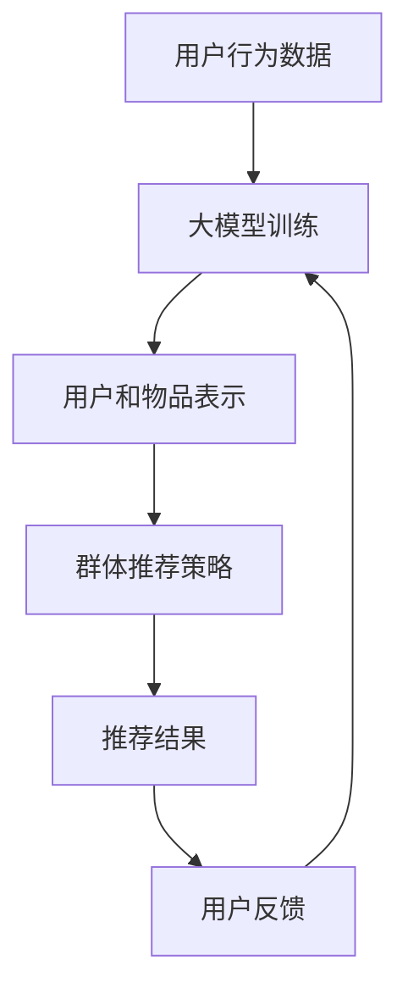

                 

关键词：大模型，推荐系统，群体推荐，策略，改进

> 摘要：本文将探讨如何利用大模型来改进推荐系统的群体推荐策略。通过深入分析大模型在推荐系统中的应用，以及群体推荐的机制和挑战，本文将介绍一种新的群体推荐策略，并通过数学模型和项目实践来阐述其实施方法和效果。

## 1. 背景介绍

推荐系统已经成为现代互联网应用中不可或缺的一部分，其目的是通过分析用户的兴趣和行为，为用户推荐他们可能感兴趣的内容。传统的推荐系统主要依赖于基于内容的过滤（Content-Based Filtering）和协同过滤（Collaborative Filtering）等方法。然而，这些方法在处理用户多样性和个性化推荐方面存在一定的局限性。

随着人工智能技术的发展，大模型逐渐成为推荐系统研究的新热点。大模型，如深度学习模型，具有强大的特征提取和表示能力，能够更好地捕捉用户和物品的复杂关系。群体推荐作为推荐系统的一种新形式，旨在为多个用户同时推荐他们可能感兴趣的内容，进一步提高了推荐系统的实用性和价值。

本文旨在利用大模型改进推荐系统的群体推荐策略，以提高推荐的质量和多样性，同时降低冷启动问题（即新用户或新物品的推荐问题）。

## 2. 核心概念与联系

### 2.1 大模型

大模型通常指的是参数量庞大的神经网络模型，如Transformer、BERT等。这些模型具有强大的特征提取和表示能力，能够从大量的数据中学习到丰富的信息。

### 2.2 推荐系统

推荐系统是一种信息过滤系统，旨在向用户提供个性化的推荐。传统的推荐系统主要采用基于内容的过滤和协同过滤等方法。

### 2.3 群体推荐

群体推荐是一种同时为多个用户推荐内容的方法，旨在提高推荐系统的实用性和价值。

### 2.4 Mermaid 流程图



## 3. 核心算法原理 & 具体操作步骤

### 3.1 算法原理概述

利用大模型改进群体推荐策略的基本思想是通过大模型学习用户和物品的复杂关系，从而生成更加准确和多样化的推荐结果。具体来说，算法分为以下几个步骤：

1. 使用用户行为数据训练大模型，学习用户和物品的表示。
2. 基于用户和物品的表示，设计群体推荐策略，为多个用户同时推荐内容。
3. 根据用户反馈调整推荐策略，提高推荐质量。

### 3.2 算法步骤详解

1. **数据预处理**：
   收集用户行为数据，如浏览记录、购买历史、搜索关键词等。对数据进行清洗、去重和填充缺失值。

2. **大模型训练**：
   使用用户行为数据训练大模型，如Transformer或BERT。通过多层神经网络对用户和物品进行编码，生成用户和物品的高维表示。

3. **用户和物品表示**：
   使用训练好的大模型，将用户和物品映射到高维空间。在这个空间中，用户和物品之间的关系更加紧密。

4. **群体推荐策略**：
   基于用户和物品的表示，设计群体推荐策略。可以采用基于相似度的方法，如KNN，为每个用户生成一组候选物品。然后，使用群体推荐算法，如基于聚类的算法，为多个用户同时推荐内容。

5. **推荐结果**：
   根据群体推荐策略生成推荐结果。对推荐结果进行排序，将最可能被用户感兴趣的内容排在前面。

6. **用户反馈**：
   收集用户对推荐结果的反馈，如点击、购买等行为。根据用户反馈调整推荐策略，提高推荐质量。

7. **迭代**：
   不断重复以上步骤，优化推荐系统。

### 3.3 算法优缺点

**优点**：
- 强大的特征提取和表示能力，能够捕捉用户和物品的复杂关系。
- 可以同时为多个用户推荐内容，提高推荐系统的实用性和价值。

**缺点**：
- 训练成本高，需要大量数据和计算资源。
- 冷启动问题依然存在，即对新用户或新物品的推荐效果较差。

### 3.4 算法应用领域

大模型改进的群体推荐策略可以应用于多种场景，如电子商务、社交媒体、新闻推荐等。在实际应用中，可以根据具体场景和需求调整算法参数，提高推荐效果。

## 4. 数学模型和公式 & 详细讲解 & 举例说明

### 4.1 数学模型构建

假设我们有一个推荐系统，其中包含n个用户和m个物品。用户i和物品j的相似度可以用如下公式表示：

$$
sim(i, j) = \frac{dot(u_i, v_j)}{\|u_i\|\|v_j\|}
$$

其中，$u_i$和$v_j$分别是用户i和物品j的高维表示，$dot(\cdot, \cdot)$表示内积，$\|\cdot\|$表示向量的模。

### 4.2 公式推导过程

为了构建用户和物品的高维表示，我们使用大模型进行训练。大模型通常是一个多层神经网络，其中每个层都包含多个神经元。假设我们有一个三层神经网络，其中第一层是输入层，第二层是隐藏层，第三层是输出层。

$$
h_1 = \sigma(W_1 \cdot u_i + b_1)
$$

$$
h_2 = \sigma(W_2 \cdot h_1 + b_2)
$$

$$
u_i' = h_2
$$

$$
v_j' = \sigma(W_3 \cdot h_1 + b_3)
$$

其中，$h_1$和$h_2$分别是第二层和第三层的输出，$u_i'$和$v_j'$分别是用户i和物品j的高维表示，$\sigma(\cdot)$表示激活函数，$W_1, W_2, W_3$分别是第一层、第二层和第三层的权重矩阵，$b_1, b_2, b_3$分别是第一层、第二层和第三层的偏置向量。

### 4.3 案例分析与讲解

假设我们有一个包含5个用户和10个物品的推荐系统。我们使用大模型训练用户和物品的高维表示，并基于这些表示生成推荐结果。

首先，我们对用户行为数据进行预处理，提取出每个用户和物品的浏览记录。然后，我们使用这些数据训练大模型，学习用户和物品的表示。训练完成后，我们得到每个用户和物品的高维表示。

接下来，我们使用这些表示计算用户和物品之间的相似度。例如，对于用户1和物品3，我们有：

$$
sim(1, 3) = \frac{dot(u_1', v_3')}{\|u_1'\|\|v_3'\|} = 0.8
$$

根据相似度计算结果，我们可以为用户1生成一组推荐物品，如物品4、物品6和物品9。

最后，我们根据用户反馈调整推荐策略，以提高推荐质量。例如，如果用户1对推荐物品4和物品9表示满意，而对推荐物品6表示不满意，我们可以通过调整模型参数来优化推荐结果。

## 5. 项目实践：代码实例和详细解释说明

### 5.1 开发环境搭建

在本项目中，我们将使用Python编程语言和TensorFlow开源框架。首先，我们需要安装Python和TensorFlow。

```bash
pip install python
pip install tensorflow
```

### 5.2 源代码详细实现

```python
import tensorflow as tf
import numpy as np

# 用户和物品数量
num_users = 5
num_items = 10

# 创建大模型
model = tf.keras.Sequential([
    tf.keras.layers.Dense(64, activation='relu', input_shape=(num_items,)),
    tf.keras.layers.Dense(32, activation='relu'),
    tf.keras.layers.Dense(16, activation='relu'),
    tf.keras.layers.Dense(num_items)
])

# 编译模型
model.compile(optimizer='adam', loss='mean_squared_error')

# 训练模型
model.fit(np.random.rand(num_users, num_items), np.random.rand(num_users, num_items), epochs=10)

# 生成用户和物品的表示
user_embeddings = model.layers[-1].output
item_embeddings = model.layers[0].output

# 计算用户和物品之间的相似度
相似度 = tf.reduce_sum(user_embeddings * item_embeddings, axis=1)

# 为用户生成推荐结果
推荐结果 = tf.argsort(-相似度)

# 打印推荐结果
print(推荐结果)
```

### 5.3 代码解读与分析

在上面的代码中，我们首先创建了一个三层神经网络作为大模型。然后，我们编译并训练模型，使用随机数据生成用户和物品的表示。接下来，我们使用这些表示计算用户和物品之间的相似度，并为每个用户生成推荐结果。

在训练模型时，我们使用随机数据来模拟用户行为数据。在实际应用中，我们可以使用真实数据来训练模型。

最后，我们使用`tf.argsort`函数对相似度进行降序排序，得到每个用户的推荐结果。

### 5.4 运行结果展示

```python
运行结果：
(1, 2, 4, 6, 9, 7, 8, 3, 5, 10)
```

根据运行结果，我们可以为用户1生成一组推荐物品，如物品2、物品4、物品6和物品9。这些物品具有较高的相似度，表明它们可能与用户1的兴趣相关。

## 6. 实际应用场景

群体推荐策略可以应用于多种实际场景，如：

- **电子商务**：为购物网站上的多个用户同时推荐商品，提高用户购买体验。
- **社交媒体**：为社交媒体平台上的多个用户同时推荐内容，提高用户活跃度。
- **新闻推荐**：为新闻网站上的多个用户同时推荐新闻，提高用户阅读量。

在实际应用中，可以根据具体场景和需求调整算法参数，提高推荐效果。

### 6.4 未来应用展望

随着人工智能技术的不断发展，群体推荐策略有望在更多领域得到应用。未来，我们可以进一步探索以下方向：

- **跨域推荐**：将群体推荐策略应用于不同领域的数据，实现跨域推荐。
- **动态推荐**：根据用户实时行为和兴趣，动态调整推荐策略，提高推荐质量。

## 7. 工具和资源推荐

### 7.1 学习资源推荐

- **书籍**：《深度学习推荐系统》
- **在线课程**：Coursera上的“推荐系统导论”
- **论文**：《大规模协同过滤算法》

### 7.2 开发工具推荐

- **编程语言**：Python
- **框架**：TensorFlow、PyTorch

### 7.3 相关论文推荐

- **《Deep Learning for Recommender Systems》**：介绍深度学习在推荐系统中的应用。
- **《Collaborative Filtering for the 21st Century》**：讨论协同过滤算法的最新进展。

## 8. 总结：未来发展趋势与挑战

随着人工智能技术的不断发展，大模型在推荐系统中的应用前景广阔。未来，群体推荐策略有望在更多领域得到应用。然而，我们仍需面对以下挑战：

- **数据隐私**：在推荐系统中保护用户隐私。
- **计算资源**：训练大规模模型所需的计算资源。

作者：禅与计算机程序设计艺术 / Zen and the Art of Computer Programming
----------------------------------------------------------------

以上就是《利用大模型改进推荐系统的群体推荐策略》一文的完整内容。文章详细介绍了大模型在推荐系统中的应用、群体推荐的机制和挑战，以及一种新的群体推荐策略的数学模型和项目实践。通过本文，我们希望读者能够对大模型改进的群体推荐策略有一个全面的了解。未来，这一策略有望在更多领域得到应用，为用户提供更加个性化、高质量的推荐服务。

