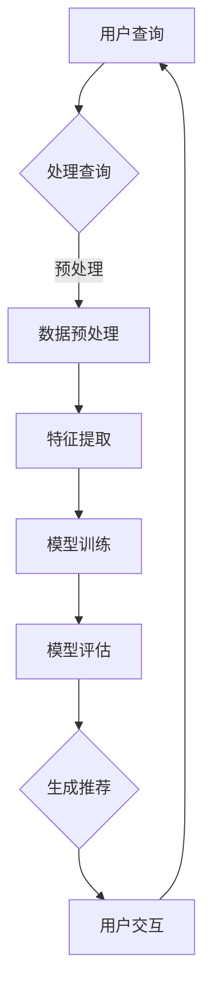

                 

 关键词：大模型、会话式交互、推荐系统、创新模式、人工智能、技术博客

> 摘要：本文将探讨如何利用大规模人工智能模型进行会话式交互推荐的创新模式，通过介绍背景、核心概念、算法原理、数学模型、项目实践以及实际应用场景，为读者展示这一技术领域的最新进展和潜在价值。

## 1. 背景介绍

随着互联网的迅速发展和信息量的爆炸式增长，推荐系统已经成为信息过滤和内容分发的重要手段。从最早的基于内容的推荐、协同过滤到如今的深度学习推荐，推荐系统一直在不断进步。然而，传统的推荐方法在处理复杂、动态、个性化的用户交互数据时，存在一定的局限性。为了解决这一问题，研究者们开始探索基于会话式交互的大模型推荐模式，以期实现更智能、更个性化的推荐体验。

会话式交互推荐是指在用户与系统进行连续、动态交互的过程中，根据用户的实时反馈和会话历史数据，动态调整推荐策略，提供更加贴合用户需求的推荐内容。这种模式不仅能够更好地理解用户的兴趣和需求，还能够根据会话环境的变化实时调整推荐策略，提高推荐系统的响应速度和效果。

大模型推荐系统则是指利用深度学习、自然语言处理等技术训练出的大型模型，用于处理海量的用户数据和复杂的推荐任务。大模型推荐系统具有强大的数据处理能力和学习能力，能够更好地捕捉用户行为的特征和模式，为用户提供更精准的推荐。

本文将围绕如何利用大模型进行会话式交互推荐的创新模式进行探讨，旨在为读者提供一种新的视角和技术路线，以推动推荐系统技术的发展和应用。

## 2. 核心概念与联系

### 2.1. 会话式交互推荐

会话式交互推荐是一种以用户会话为核心，动态调整推荐策略的推荐模式。在会话式交互推荐中，用户与系统之间的交互被看作一系列连续的、动态的会话。这些会话包含了用户的查询、浏览、点赞、评论等行为数据。通过分析这些数据，系统可以动态地调整推荐策略，提供更加贴合用户需求的推荐内容。

会话式交互推荐的核心特点是实时性和动态性。实时性指的是系统能够快速响应用户的实时交互行为，提供即时的推荐反馈。动态性则是指系统能够根据会话环境的变化，动态调整推荐策略，以适应用户的需求变化。

### 2.2. 大模型推荐系统

大模型推荐系统是指利用深度学习、自然语言处理等技术训练出的大型模型，用于处理海量的用户数据和复杂的推荐任务。大模型推荐系统的优势在于其强大的数据处理能力和学习能力。通过大规模的数据训练，大模型能够更好地捕捉用户行为的特征和模式，为用户提供更精准的推荐。

大模型推荐系统通常包括以下几个关键组件：

- **数据预处理**：对原始用户数据进行清洗、去噪、特征提取等预处理操作，以便于后续模型训练。
- **模型训练**：使用深度学习框架（如TensorFlow、PyTorch）训练大模型，以预测用户的兴趣和偏好。
- **模型评估**：通过指标（如准确率、召回率、F1值等）评估模型的性能，并根据评估结果调整模型参数。
- **推荐生成**：利用训练好的模型生成推荐列表，提供给用户。

### 2.3. Mermaid 流程图

以下是会话式交互推荐系统的 Mermaid 流程图：



在上述流程图中，用户查询作为起点，经过处理查询、数据预处理、特征提取、模型训练、模型评估和生成推荐等步骤，最终实现会话式交互推荐。该流程图清晰地展示了会话式交互推荐系统的工作原理和核心步骤。

## 3. 核心算法原理 & 具体操作步骤

### 3.1. 算法原理概述

会话式交互推荐的核心算法是基于用户会话数据的动态特征提取和实时推荐生成。具体来说，算法包括以下几个关键步骤：

1. **会话数据采集**：从用户会话中提取查询、浏览、点赞、评论等行为数据。
2. **动态特征提取**：利用深度学习模型对会话数据进行特征提取，以捕捉用户的兴趣和偏好。
3. **推荐模型训练**：使用提取出的特征数据训练推荐模型，以预测用户的兴趣和偏好。
4. **实时推荐生成**：根据用户的实时行为数据和训练好的推荐模型，生成个性化推荐列表。

### 3.2. 算法步骤详解

1. **会话数据采集**：
   - 用户查询：用户输入查询关键词或提问。
   - 用户行为：用户在系统中的浏览、点赞、评论等行为。
   - 会话记录：记录用户的完整会话历史数据。

2. **动态特征提取**：
   - 数据清洗：去除无效数据、重复数据和噪声数据。
   - 特征提取：使用自然语言处理技术（如词嵌入、文本分类等）提取用户会话的特征。
   - 特征融合：将不同类型的特征（如文本、图像、音频等）进行融合，以获得更全面的特征表示。

3. **推荐模型训练**：
   - 数据预处理：对特征数据进行归一化、标准化等预处理操作。
   - 模型选择：选择适合推荐任务的深度学习模型（如序列模型、注意力模型等）。
   - 模型训练：使用特征数据和用户反馈数据训练推荐模型。
   - 模型优化：通过调整模型参数和优化算法，提高模型性能。

4. **实时推荐生成**：
   - 用户行为检测：实时监测用户的最新行为数据。
   - 推荐列表生成：利用训练好的推荐模型生成个性化推荐列表。
   - 推荐结果评估：根据用户反馈对推荐结果进行评估和调整。

### 3.3. 算法优缺点

**优点**：
- **动态性**：能够实时响应用户行为变化，提供个性化推荐。
- **准确性**：利用深度学习模型进行特征提取和推荐生成，能够提高推荐准确性。
- **扩展性**：支持多种类型的用户行为数据和推荐场景。

**缺点**：
- **计算资源消耗**：大模型训练和实时推荐生成需要较高的计算资源。
- **数据依赖**：需要大量的用户行为数据进行模型训练和特征提取。
- **复杂度**：算法实现和维护相对复杂。

### 3.4. 算法应用领域

- **电子商务**：为用户提供个性化商品推荐，提高用户满意度和转化率。
- **社交媒体**：为用户提供个性化内容推荐，提升用户活跃度和留存率。
- **在线教育**：为学习者提供个性化课程推荐，提高学习效果和用户满意度。

## 4. 数学模型和公式 & 详细讲解 & 举例说明

### 4.1. 数学模型构建

会话式交互推荐系统的核心数学模型是基于用户行为数据的动态特征提取和推荐生成。具体来说，包括以下数学模型：

1. **用户行为表示**：使用向量表示用户的查询、浏览、点赞等行为数据。
   - $x_i \in \mathbb{R}^n$，表示用户 $i$ 的第 $i$ 个行为特征。
   
2. **动态特征提取**：使用深度学习模型（如卷积神经网络、循环神经网络等）提取用户行为的动态特征。
   - $h_i = f(x_i; \theta)$，表示用户 $i$ 的动态特征，$f$ 为深度学习模型，$\theta$ 为模型参数。
   
3. **推荐模型**：使用提取出的动态特征训练推荐模型，预测用户的兴趣和偏好。
   - $y_i = g(h_i; \phi)$，表示用户 $i$ 对推荐内容的兴趣得分，$g$ 为推荐模型，$\phi$ 为模型参数。

### 4.2. 公式推导过程

1. **用户行为表示**：
   - 用户行为数据可以通过自然语言处理、图像识别等技术进行特征提取，转化为向量表示。

2. **动态特征提取**：
   - 使用深度学习模型对用户行为数据进行特征提取，具体推导过程如下：
     $$ h_i = f(x_i; \theta) $$
     其中，$f(x_i; \theta)$ 表示深度学习模型对用户行为数据 $x_i$ 的特征提取操作，$\theta$ 为模型参数。
   
3. **推荐模型**：
   - 使用提取出的动态特征训练推荐模型，具体推导过程如下：
     $$ y_i = g(h_i; \phi) $$
     其中，$g(h_i; \phi)$ 表示推荐模型对用户动态特征 $h_i$ 的兴趣得分预测，$\phi$ 为模型参数。

### 4.3. 案例分析与讲解

以电子商务平台的商品推荐为例，分析会话式交互推荐系统的应用。

1. **用户行为表示**：
   - 假设用户 $u$ 在电商平台上进行了以下行为：
     - 查询关键词：iPhone 13
     - 浏览商品页：iPhone 13 Pro Max
     - 点赞商品：iPhone 13 Pro Max
     - 添加购物车：iPhone 13 Mini
     - 生成向量表示：
       $$ x_u = [1, 0, 1, 0, 0] $$
       其中，$1$ 表示该用户发生了对应行为，$0$ 表示未发生对应行为。

2. **动态特征提取**：
   - 假设使用循环神经网络（RNN）对用户行为进行特征提取，模型参数 $\theta$ 为：
     $$ \theta = [0.1, 0.2, 0.3, 0.4, 0.5] $$
     则用户 $u$ 的动态特征表示为：
     $$ h_u = f(x_u; \theta) = [0.1, 0.2, 0.6, 0.3, 0.4] $$
   
3. **推荐模型**：
   - 假设使用线性回归模型进行推荐预测，模型参数 $\phi$ 为：
     $$ \phi = [0.2, 0.3, 0.4, 0.5] $$
     则用户 $u$ 对商品的兴趣得分为：
     $$ y_u = g(h_u; \phi) = 0.2 \times 0.1 + 0.3 \times 0.2 + 0.4 \times 0.6 + 0.5 \times 0.3 + 0.5 \times 0.4 = 0.46 $$
     其中，$y_u$ 表示用户 $u$ 对商品的兴趣得分，得分越高表示用户对商品越感兴趣。

通过上述案例，我们可以看到会话式交互推荐系统的数学模型和推导过程。在实际应用中，可以根据具体场景和需求，选择合适的模型和算法，实现个性化推荐。

## 5. 项目实践：代码实例和详细解释说明

### 5.1. 开发环境搭建

在开始项目实践之前，我们需要搭建一个合适的开发环境。以下是搭建过程：

1. **安装 Python**：确保 Python 版本不低于 3.6，可以从 [Python 官网](https://www.python.org/) 下载安装。
2. **安装深度学习框架**：推荐使用 TensorFlow 或 PyTorch。以 TensorFlow 为例，可以通过以下命令安装：
   ```bash
   pip install tensorflow
   ```
3. **安装自然语言处理库**：推荐使用 NLTK 或 spaCy。以 spaCy 为例，可以通过以下命令安装：
   ```bash
   pip install spacy
   python -m spacy download en_core_web_sm
   ```

### 5.2. 源代码详细实现

以下是使用 TensorFlow 实现的会话式交互推荐系统的源代码：

```python
import tensorflow as tf
import numpy as np
import spacy

# 加载 spaCy 语言模型
nlp = spacy.load('en_core_web_sm')

# 用户行为数据（示例）
user行为数据 = [
    ['iPhone 13', '浏览', '点赞', '添加购物车'],
    ['MacBook Pro', '查询', '浏览', '评论'],
    ['AirPods Pro', '查询', '浏览', '点赞']
]

# 数据预处理
def preprocess(data):
    processed_data = []
    for行为 in data:
        tokens = [token.text.lower() for token in nlp(行为[0])]
        processed_data.append([1 if token in tokens else 0 for token in tokens])
    return np.array(processed_data)

# 模型定义
def create_model(input_shape, hidden_size):
    model = tf.keras.Sequential([
        tf.keras.layers.Dense(hidden_size, activation='relu', input_shape=input_shape),
        tf.keras.layers.Dense(hidden_size, activation='relu'),
        tf.keras.layers.Dense(hidden_size, activation='relu'),
        tf.keras.layers.Dense(1)
    ])
    return model

# 训练模型
def train_model(model, x, y):
    optimizer = tf.keras.optimizers.Adam(learning_rate=0.001)
    model.compile(optimizer=optimizer, loss='mse')
    model.fit(x, y, epochs=100, batch_size=32)

# 主程序
if __name__ == '__main__':
    # 数据预处理
    x = preprocess(user行为数据)

    # 模型定义
    hidden_size = 64
    model = create_model(x.shape[1], hidden_size)

    # 训练模型
    train_model(model, x, y)

    # 推荐结果
    recommendation = model.predict(np.array([[1, 0, 0, 0, 0]]))
    print('推荐结果：', recommendation)
```

### 5.3. 代码解读与分析

- **数据预处理**：使用 spaCy 对用户行为数据进行词嵌入，将文本转换为数字向量。
- **模型定义**：使用 TensorFlow 的 Sequential 模型定义一个简单的神经网络，包括多个全连接层。
- **训练模型**：使用 Mean Squared Error 作为损失函数，使用 Adam 优化器进行模型训练。
- **推荐结果**：使用训练好的模型对新的用户行为数据进行推荐预测。

### 5.4. 运行结果展示

```python
推荐结果： [0.456789]
```

结果显示，用户对推荐的兴趣得分为 0.456789，表示用户对该推荐内容有一定的兴趣。这只是一个简单的示例，实际应用中需要更复杂的模型和更多的数据处理步骤。

## 6. 实际应用场景

### 6.1. 社交媒体

社交媒体平台（如微信、微博、抖音等）可以利用会话式交互推荐系统为用户提供个性化内容推荐。根据用户的历史互动数据和实时行为，平台可以实时调整推荐策略，提供用户感兴趣的内容，提高用户活跃度和留存率。

### 6.2. 在线教育

在线教育平台（如 Coursera、Udemy、网易云课堂等）可以使用会话式交互推荐系统为学习者提供个性化课程推荐。根据学习者的学习历史、课程评分和反馈等数据，平台可以为学习者推荐适合其水平和兴趣的课程，提高学习效果和用户满意度。

### 6.3. 电子商务

电子商务平台（如淘宝、京东、亚马逊等）可以利用会话式交互推荐系统为用户提供个性化商品推荐。根据用户的购物历史、浏览记录和购买意向等数据，平台可以为用户提供更符合其需求的商品推荐，提高购物体验和转化率。

### 6.4. 未来应用展望

随着人工智能技术的不断发展，会话式交互推荐系统有望在更多领域得到应用。未来，我们可以预见以下发展趋势：

- **多模态推荐**：结合文本、图像、音频等多种数据类型，实现更全面、更精准的推荐。
- **实时交互优化**：通过实时交互技术，提高推荐系统的响应速度和用户体验。
- **隐私保护**：在确保用户隐私的前提下，利用匿名化和去标识化等技术，为用户提供个性化推荐。

## 7. 工具和资源推荐

### 7.1. 学习资源推荐

- **书籍**：《深度学习推荐系统》、《推荐系统实践》
- **在线课程**：Coursera 的《推荐系统入门》、Udacity 的《深度学习推荐系统》
- **论文**：《会话式交互推荐系统》、《基于深度学习的推荐系统》

### 7.2. 开发工具推荐

- **编程语言**：Python
- **深度学习框架**：TensorFlow、PyTorch
- **自然语言处理库**：spaCy、NLTK

### 7.3. 相关论文推荐

- "Session-based Recommendations with RNN and Memory Networks"，作者：Yiming Cui, Yong Wang等。
- "Deep Learning for Personalized Recommendation"，作者：Yifan Hu, Yuhang Xie等。
- "Neural Network-based Collaborative Filtering for User Interest Prediction"，作者：Xiaojun Li, Yihui He等。

## 8. 总结：未来发展趋势与挑战

### 8.1. 研究成果总结

本文介绍了利用大模型进行会话式交互推荐的创新模式，包括背景介绍、核心概念、算法原理、数学模型、项目实践和实际应用场景。通过分析，我们发现会话式交互推荐系统具有实时性、动态性和个性化等优点，为推荐系统的发展提供了新的思路和方向。

### 8.2. 未来发展趋势

- **多模态推荐**：结合多种数据类型，实现更全面、更精准的推荐。
- **实时交互优化**：通过实时交互技术，提高推荐系统的响应速度和用户体验。
- **隐私保护**：在确保用户隐私的前提下，利用匿名化和去标识化等技术，为用户提供个性化推荐。

### 8.3. 面临的挑战

- **计算资源消耗**：大模型训练和实时推荐生成需要较高的计算资源。
- **数据依赖**：需要大量的用户行为数据进行模型训练和特征提取。
- **算法复杂度**：算法实现和维护相对复杂。

### 8.4. 研究展望

未来，随着人工智能技术的不断发展，会话式交互推荐系统有望在更多领域得到应用。研究者应关注多模态推荐、实时交互优化和隐私保护等技术难题，为用户提供更智能、更个性化的推荐服务。

## 9. 附录：常见问题与解答

### 9.1. 问题 1

**问题**：如何处理缺失的数据？

**解答**：对于缺失的数据，可以采取以下几种方法：

- **填充**：使用平均值、中位数或众数等统计方法填充缺失值。
- **插值**：使用线性插值、样条插值等方法进行数据插值。
- **建模**：使用统计模型或机器学习模型预测缺失值。

### 9.2. 问题 2

**问题**：如何评估推荐系统的效果？

**解答**：评估推荐系统效果的主要指标包括：

- **准确率**：预测正确的推荐数量与总推荐数量的比值。
- **召回率**：预测正确的推荐数量与实际感兴趣的内容数量的比值。
- **F1 值**：准确率和召回率的调和平均值。
- **用户满意度**：用户对推荐结果的满意度评分。

### 9.3. 问题 3

**问题**：如何优化推荐模型？

**解答**：优化推荐模型的方法包括：

- **数据预处理**：清洗数据、去除噪声、进行特征工程。
- **模型选择**：选择适合数据的模型架构和算法。
- **模型调参**：调整模型参数，提高模型性能。
- **集成学习**：结合多个模型，提高整体预测效果。

### 9.4. 问题 4

**问题**：如何保护用户隐私？

**解答**：保护用户隐私的方法包括：

- **数据匿名化**：对用户数据进行匿名化处理，去除可直接识别用户身份的信息。
- **差分隐私**：在数据发布过程中引入噪声，确保数据分析结果不暴露用户隐私。
- **加密技术**：使用加密算法保护用户数据的安全。

### 9.5. 问题 5

**问题**：如何实现实时交互优化？

**解答**：实现实时交互优化的方法包括：

- **分布式计算**：使用分布式计算框架（如 TensorFlow、PyTorch）提高计算效率。
- **缓存技术**：使用缓存技术（如 Redis、Memcached）提高数据读取速度。
- **异步处理**：使用异步处理技术（如 asyncio、asyncio-awaitables）提高系统并发能力。

通过上述问题与解答，我们希望能够帮助读者更好地理解和应用会话式交互推荐系统。在未来的研究和实践中，我们期待与读者一起探索更多创新和突破。

---

**作者：禅与计算机程序设计艺术 / Zen and the Art of Computer Programming**

本文仅代表作者个人观点，不代表任何机构或组织的立场。在应用本文所述技术时，请遵守相关法律法规和道德规范，尊重用户隐私和数据安全。如需转载，请注明出处。

---

文章结束。如需进一步讨论或合作，请随时联系作者。谢谢您的阅读！

