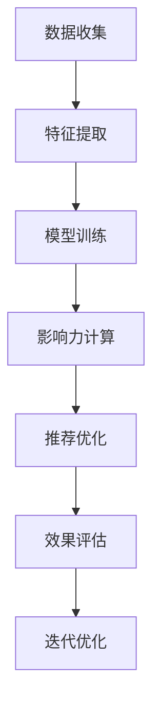

                 

关键词：大模型，用户行为，影响力分析，推荐系统，人工智能

> 摘要：本文探讨了利用大模型进行推荐场景的用户行为影响力分析的方法和策略。通过深入剖析大模型的基本原理和应用场景，详细介绍了用户行为影响力的计算方法和模型，以及如何利用大模型进行高效的用户行为预测和推荐。最后，对大模型在推荐场景中的实际应用进行了分析，并展望了其未来发展趋势和面临的挑战。

## 1. 背景介绍

随着互联网技术的飞速发展，在线推荐系统已成为许多公司和平台的核心竞争力之一。推荐系统能够根据用户的历史行为和偏好，为用户提供个性化的推荐结果，从而提升用户体验和满意度。然而，推荐系统的准确性和效果往往受到数据质量和模型性能的制约。为了解决这些问题，近年来大模型（如深度学习模型、增强学习模型等）在推荐场景中的应用逐渐成为研究的热点。

大模型具有强大的建模能力和数据处理能力，能够从海量数据中挖掘出潜在的模式和规律。通过利用大模型进行用户行为影响力分析，可以更准确地预测用户偏好，提高推荐系统的效果。本文将围绕这一主题，探讨大模型在推荐场景中的应用和策略。

## 2. 核心概念与联系

### 2.1 大模型基本原理

大模型通常是指具有海量参数和神经元的大规模神经网络，如深度神经网络（DNN）、卷积神经网络（CNN）、循环神经网络（RNN）等。这些模型通过多层非线性变换，可以从原始数据中学习到复杂的特征和模式，从而实现高精度的预测和分类。

### 2.2 用户行为影响力分析

用户行为影响力分析旨在识别和量化用户在推荐系统中的影响力，从而为推荐结果提供依据。具体来说，用户行为影响力分析包括以下几个方面的内容：

1. 用户行为数据收集：收集用户在平台上的各种行为数据，如浏览记录、购买记录、评价记录等。
2. 用户行为特征提取：将用户行为数据转化为可用的特征表示，如用户活跃度、用户兴趣、用户满意度等。
3. 用户行为影响力计算：利用大模型和数学模型，计算用户行为对推荐结果的影响程度。
4. 用户行为影响力应用：根据用户行为影响力，优化推荐算法和策略，提高推荐效果。

### 2.3 大模型与用户行为影响力分析的联系

大模型在用户行为影响力分析中发挥着重要作用。首先，大模型能够处理海量用户行为数据，从数据中提取出有用的特征和模式。这些特征和模式有助于提高用户行为影响力计算的准确性和可靠性。其次，大模型具有强大的建模能力，可以构建出复杂的用户行为影响力模型，从而实现高效的用户行为预测和推荐。最后，大模型可以不断迭代和优化，以适应不断变化的用户行为和需求。

### 2.4 Mermaid 流程图

以下是一个简化的 Mermaid 流程图，展示了大模型在用户行为影响力分析中的应用过程：

## 3. 核心算法原理 & 具体操作步骤

### 3.1 算法原理概述

用户行为影响力分析的核心算法通常是基于大模型的深度学习算法。这些算法通过多层非线性变换，将用户行为数据转化为可用的特征表示，进而计算用户行为的影响力。具体来说，核心算法包括以下几个步骤：

1. 数据预处理：对用户行为数据进行分析和处理，包括数据清洗、数据整合、数据降维等。
2. 特征提取：利用大模型，从预处理后的数据中提取出有用的特征，如用户活跃度、用户兴趣等。
3. 模型训练：利用提取出的特征，构建深度学习模型，并通过训练数据对模型进行优化。
4. 影响力计算：利用训练好的模型，对用户行为的影响力进行计算，从而为推荐算法提供依据。
5. 推荐优化：根据用户行为影响力，优化推荐算法和策略，提高推荐效果。

### 3.2 算法步骤详解

#### 3.2.1 数据预处理

数据预处理是用户行为影响力分析的基础。具体步骤如下：

1. 数据清洗：去除重复数据、缺失数据和异常数据，保证数据的质量和一致性。
2. 数据整合：将不同来源和格式的数据整合为一个统一的数据集，方便后续处理。
3. 数据降维：利用主成分分析（PCA）等方法，将高维数据降维为低维数据，减少数据的冗余和噪声。

#### 3.2.2 特征提取

特征提取是用户行为影响力分析的关键。利用大模型，可以从原始数据中提取出丰富的特征表示。具体步骤如下：

1. 数据输入：将预处理后的数据输入到大模型中，作为模型的输入层。
2. 神经网络构建：构建多层神经网络，通过逐层传递和激活函数，将输入数据转化为高层次的抽象特征。
3. 特征提取：将神经网络输出的特征表示提取出来，作为用户行为的特征。

#### 3.2.3 模型训练

模型训练是用户行为影响力分析的核心。利用提取出的特征，构建深度学习模型，并通过训练数据对模型进行优化。具体步骤如下：

1. 模型选择：选择合适的深度学习模型，如卷积神经网络（CNN）、循环神经网络（RNN）等。
2. 模型构建：根据用户行为特征，构建深度学习模型，包括输入层、隐藏层和输出层。
3. 模型训练：利用训练数据，对深度学习模型进行训练，通过反向传播算法和优化算法，不断调整模型参数，使模型性能逐渐提高。

#### 3.2.4 影响力计算

利用训练好的模型，对用户行为的影响力进行计算。具体步骤如下：

1. 用户行为输入：将待分析的

