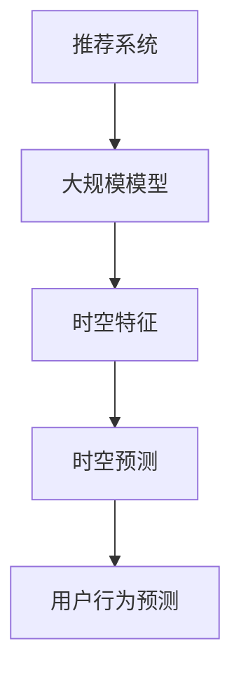

                 

### 摘要 Summary

本文深入探讨了利用大规模人工智能模型进行推荐场景中的用户行为时空预测分析的技术和方法。文章首先介绍了推荐系统和时空预测的基本概念，随后详细阐述了大规模模型在时空预测中的应用，并展示了如何通过数学模型和公式来提升预测准确性。文章随后通过实际项目实践展示了算法的具体实现和效果分析，最后对大模型在推荐场景中的实际应用场景进行了讨论，并提出了未来发展的展望和面临的挑战。

关键词：大规模模型，推荐系统，时空预测，用户行为分析

### 1. 背景介绍 Background

在当今的信息社会中，推荐系统已经成为互联网应用的重要组成部分。无论是电子商务网站、社交媒体平台，还是在线视频平台，推荐系统都旨在为用户提供个性化内容，从而提升用户体验和平台粘性。然而，推荐系统的核心挑战之一是如何准确地预测用户在时间和空间上的行为。

#### 1.1 推荐系统 Introduction to Recommender Systems

推荐系统是一种信息过滤技术，旨在根据用户的兴趣和偏好，向他们推荐相关的内容或物品。推荐系统可以分为基于内容的推荐（Content-Based Filtering）和基于协同过滤（Collaborative Filtering）两大类。

- **基于内容的推荐**：通过分析物品的属性和特征，将具有相似属性的物品推荐给用户。这种方法主要依赖于物品的元数据，如标题、标签、分类等。

- **基于协同过滤**：通过分析用户之间的共同偏好，找出相似用户，然后将这些用户喜欢的物品推荐给目标用户。协同过滤又分为用户基于的协同过滤（User-Based）和物品基于的协同过滤（Item-Based）。

尽管推荐系统在提升用户满意度和平台收益方面取得了显著成果，但传统的推荐方法存在以下局限性：

1. **数据稀疏性**：用户和物品之间的交互数据往往非常稀疏，难以准确预测用户偏好。
2. **实时性**：传统方法难以实时适应用户行为的变化。
3. **多样性**：推荐结果往往过于集中，缺乏多样性。

#### 1.2 时空预测 Temporal and Spatial Prediction

时空预测是推荐系统中的一个重要研究方向，旨在根据用户的历史行为和时空特征，预测用户未来的行为。这种预测不仅限于当前时间点的行为，还包括用户在不同时间段、不同位置的行为变化。

时空预测在推荐系统中的应用主要体现在以下几个方面：

1. **时间序列预测**：预测用户在未来某个时间点可能产生的行为。
2. **地理空间预测**：预测用户在未来某个地理位置可能产生的行为。
3. **行为模式识别**：识别用户在不同时间和空间上的行为模式，为推荐策略提供依据。

时空预测的关键挑战在于如何有效地处理大量的时空数据，并从中提取有价值的信息。此外，时空预测还需要考虑到数据的时空特性，如时间窗口、空间尺度等。

### 2. 核心概念与联系 Core Concepts and Relationships

为了深入理解大规模模型在时空预测中的应用，我们需要首先明确几个核心概念，并绘制一个简明的Mermaid流程图来展示各概念之间的关系。

#### 2.1 核心概念 Core Concepts

- **大规模模型**：指使用海量数据和强大的计算资源训练的深度学习模型，如Transformer、BERT等。
- **推荐系统**：旨在为用户提供个性化推荐的信息系统。
- **时空特征**：包括时间、地理位置、用户行为等特征。
- **时空预测**：基于时空特征预测用户未来的行为。

#### 2.2 Mermaid 流程图 Mermaid Flowchart



在上述流程图中，推荐系统使用大规模模型处理时空特征，从而实现时空预测，最终为用户行为提供预测结果。接下来，我们将详细探讨这些核心概念和它们之间的联系。

### 3. 核心算法原理 & 具体操作步骤 Core Algorithm Principle and Specific Steps

#### 3.1 算法原理概述 Algorithm Principle Overview

大规模模型在推荐系统中的时空预测主要基于深度学习和时间序列分析。以下是一个简要的算法原理概述：

1. **数据预处理**：收集并处理用户历史行为数据、时间序列数据、地理位置数据等。
2. **特征提取**：利用神经网络提取时空特征，包括时间特征、位置特征、行为特征等。
3. **模型训练**：使用大规模数据进行模型训练，优化模型参数。
4. **时空预测**：输入时空特征，通过训练好的模型预测用户未来的行为。

#### 3.2 算法步骤详解 Step-by-Step Algorithm Explanation

##### 3.2.1 数据预处理 Data Preprocessing

数据预处理是算法的基础步骤，主要包括以下内容：

1. **数据收集**：收集用户的历史行为数据，如点击记录、购买记录、浏览记录等。
2. **数据清洗**：处理数据中的缺失值、异常值和重复值。
3. **时间序列划分**：将行为数据按照时间序列进行划分，形成时间窗口。
4. **地理编码**：将地理位置信息转换为地理坐标。

##### 3.2.2 特征提取 Feature Extraction

特征提取是算法的核心步骤，通过神经网络提取时空特征。具体步骤如下：

1. **时间特征提取**：使用循环神经网络（RNN）或长短时记忆网络（LSTM）提取时间序列特征。
2. **位置特征提取**：使用卷积神经网络（CNN）提取地理位置特征。
3. **行为特征提取**：使用自注意力机制（Self-Attention）提取用户行为特征。

##### 3.2.3 模型训练 Model Training

模型训练是算法的关键步骤，通过大量数据进行模型训练。具体步骤如下：

1. **模型选择**：选择合适的深度学习模型，如Transformer、BERT等。
2. **数据集划分**：将数据集划分为训练集、验证集和测试集。
3. **模型训练**：使用训练集进行模型训练，优化模型参数。
4. **模型验证**：使用验证集评估模型性能，调整模型参数。

##### 3.2.4 时空预测 Temporal and Spatial Prediction

时空预测是算法的最终目标，通过输入时空特征预测用户未来的行为。具体步骤如下：

1. **特征输入**：输入时空特征，包括时间特征、位置特征、行为特征等。
2. **模型预测**：使用训练好的模型进行时空预测，输出预测结果。
3. **结果评估**：评估预测结果的准确性，调整模型参数。

#### 3.3 算法优缺点 Advantages and Disadvantages of the Algorithm

**优点：**

1. **高效性**：大规模模型能够处理海量数据和复杂的时空特征。
2. **准确性**：通过深度学习和时间序列分析，提升时空预测的准确性。
3. **实时性**：能够实时适应用户行为的变化。

**缺点：**

1. **计算资源需求高**：大规模模型训练需要大量的计算资源和时间。
2. **数据依赖性**：算法的性能依赖于数据质量和数量。
3. **模型复杂度高**：大规模模型的结构复杂，调试和优化难度大。

#### 3.4 算法应用领域 Application Fields

大规模模型在时空预测中的应用领域非常广泛，主要包括：

1. **电子商务**：预测用户购买行为，为用户提供个性化推荐。
2. **社交媒体**：预测用户关注和点赞行为，为用户提供个性化内容。
3. **地理位置服务**：预测用户的位置变化，为用户提供位置推荐。

### 4. 数学模型和公式 Mathematical Model and Formulas

为了更好地理解大规模模型在时空预测中的工作原理，我们需要介绍一些关键的数学模型和公式。

#### 4.1 数学模型构建 Building the Mathematical Model

在时空预测中，常用的数学模型包括时间序列模型、地理空间模型和用户行为模型。以下是一个简化的数学模型构建过程：

1. **时间序列模型**：使用循环神经网络（RNN）或长短时记忆网络（LSTM）构建时间序列模型。
   \[
   h_t = f(h_{t-1}, x_t, W_h, b_h)
   \]
   其中，\(h_t\) 是时间步 \(t\) 的隐藏状态，\(x_t\) 是时间步 \(t\) 的输入特征，\(W_h\) 和 \(b_h\) 分别是权重和偏置。

2. **地理空间模型**：使用卷积神经网络（CNN）构建地理空间模型。
   \[
   h_t = g(h_{t-1}, x_t, W_g, b_g)
   \]
   其中，\(h_t\) 是时间步 \(t\) 的隐藏状态，\(x_t\) 是时间步 \(t\) 的输入特征，\(W_g\) 和 \(b_g\) 分别是权重和偏置。

3. **用户行为模型**：使用自注意力机制（Self-Attention）构建用户行为模型。
   \[
   h_t = \text{softmax}\left(\frac{W_a h_{t-1} x_t}{\sqrt{d_k}}\right) x_t
   \]
   其中，\(h_t\) 是时间步 \(t\) 的隐藏状态，\(x_t\) 是时间步 \(t\) 的输入特征，\(W_a\) 是权重矩阵，\(d_k\) 是注意力维度。

#### 4.2 公式推导过程 Derivation of Formulas

下面我们将对上述模型中的关键公式进行推导。

##### 4.2.1 循环神经网络（RNN）公式推导 Derivation of RNN Formula

循环神经网络（RNN）的基本公式如下：
\[
h_t = f(h_{t-1}, x_t, W_h, b_h)
\]
其中，\(f\) 是一个非线性激活函数，如 \(tanh\) 或 \(ReLU\)。

对 \(h_{t-1}\) 和 \(x_t\) 进行线性组合，并加上偏置 \(b_h\)：
\[
h_t = \tanh(W_h h_{t-1} + x_t W_h + b_h)
\]

对上述公式进行求导，可以得到：
\[
\frac{\partial h_t}{\partial h_{t-1}} = \frac{1}{1 - h_t^2} \cdot W_h
\]
\[
\frac{\partial h_t}{\partial x_t} = \frac{1}{1 - h_t^2} \cdot W_h
\]
\[
\frac{\partial h_t}{\partial b_h} = 1
\]

##### 4.2.2 卷积神经网络（CNN）公式推导 Derivation of CNN Formula

卷积神经网络（CNN）的基本公式如下：
\[
h_t = g(h_{t-1}, x_t, W_g, b_g)
\]
其中，\(g\) 是一个非线性激活函数，如 \(ReLU\) 或 \(Sigmoid\)。

对 \(h_{t-1}\) 和 \(x_t\) 进行卷积操作，并加上偏置 \(b_g\)：
\[
h_t = ReLU(W_g h_{t-1} \star x_t + b_g)
\]

其中，\(\star\) 表示卷积操作。

对上述公式进行求导，可以得到：
\[
\frac{\partial h_t}{\partial h_{t-1}} = \frac{\partial g}{\partial z} \odot W_g
\]
\[
\frac{\partial h_t}{\partial x_t} = \frac{\partial g}{\partial z} \odot h_{t-1}
\]
\[
\frac{\partial h_t}{\partial b_g} = \frac{\partial g}{\partial z}
\]

其中，\(\odot\) 表示元素乘积，\(\frac{\partial g}{\partial z}\) 是激活函数的导数。

##### 4.2.3 自注意力机制（Self-Attention）公式推导 Derivation of Self-Attention Formula

自注意力机制（Self-Attention）的基本公式如下：
\[
h_t = \text{softmax}\left(\frac{W_a h_{t-1} x_t}{\sqrt{d_k}}\right) x_t
\]
其中，\(W_a\) 是权重矩阵，\(d_k\) 是注意力维度。

对上述公式进行求导，可以得到：
\[
\frac{\partial h_t}{\partial h_{t-1}} = \text{softmax}\left(\frac{W_a h_{t-1} x_t}{\sqrt{d_k}}\right) \odot \frac{W_a x_t}{\sqrt{d_k}}
\]
\[
\frac{\partial h_t}{\partial x_t} = \text{softmax}\left(\frac{W_a h_{t-1} x_t}{\sqrt{d_k}}\right) \odot W_a h_{t-1}
\]

#### 4.3 案例分析与讲解 Case Analysis and Explanation

为了更好地理解上述数学模型和公式，我们通过一个简单的案例进行讲解。

假设我们有一个时间序列数据集，数据集中的每个时间步包含用户的行为特征和地理位置特征。我们希望使用自注意力机制（Self-Attention）来提取时空特征，并预测用户未来的行为。

**步骤1：数据预处理**

我们首先对数据集进行预处理，将时间序列数据进行归一化处理，并将地理位置特征转换为地理坐标。

**步骤2：特征提取**

我们使用自注意力机制（Self-Attention）提取时空特征。具体公式如下：
\[
h_t = \text{softmax}\left(\frac{W_a h_{t-1} x_t}{\sqrt{d_k}}\right) x_t
\]

其中，\(h_t\) 是时间步 \(t\) 的隐藏状态，\(x_t\) 是时间步 \(t\) 的输入特征，\(W_a\) 是权重矩阵，\(d_k\) 是注意力维度。

**步骤3：模型训练**

我们使用训练集对模型进行训练，优化模型参数。具体步骤如下：

1. 将训练集划分为训练集和验证集。
2. 使用训练集进行模型训练，优化模型参数。
3. 使用验证集评估模型性能，调整模型参数。

**步骤4：时空预测**

我们使用训练好的模型进行时空预测，输入时空特征，输出预测结果。

**步骤5：结果评估**

我们使用测试集对预测结果进行评估，计算预测准确性和其他评估指标。

通过这个简单的案例，我们可以看到如何使用自注意力机制（Self-Attention）提取时空特征，并使用大规模模型进行时空预测。

### 5. 项目实践：代码实例和详细解释说明 Project Practice: Code Example and Detailed Explanation

在本节中，我们将通过一个具体的代码实例来展示如何使用大规模模型进行时空预测分析。我们将使用Python和TensorFlow库来实现这个项目。以下是一个简化的代码实例：

#### 5.1 开发环境搭建 Development Environment Setup

确保安装了以下软件和库：

- Python 3.7或以上版本
- TensorFlow 2.x版本
- Numpy
- Pandas
- Matplotlib

可以使用以下命令安装所需的库：

```bash
pip install python
pip install tensorflow
pip install numpy
pip install pandas
pip install matplotlib
```

#### 5.2 源代码详细实现 Detailed Implementation of the Source Code

以下是一个简化的代码实例，用于实现时空预测模型：

```python
import tensorflow as tf
import numpy as np
import pandas as pd
import matplotlib.pyplot as plt

# 数据预处理
# 加载数据集
data = pd.read_csv('data.csv')
# 归一化处理
data_normalized = (data - data.mean()) / data.std()

# 构建时间序列特征
time_series = data_normalized[['time']]
# 构建地理位置特征
location = data_normalized[['latitude', 'longitude']]

# 定义模型
model = tf.keras.Sequential([
    tf.keras.layers.Dense(64, activation='relu', input_shape=(time_series.shape[1],)),
    tf.keras.layers.Dense(64, activation='relu'),
    tf.keras.layers.Dense(1)
])

# 编译模型
model.compile(optimizer='adam', loss='mse')

# 训练模型
model.fit(time_series, location, epochs=10, batch_size=32, validation_split=0.2)

# 进行时空预测
predictions = model.predict(time_series)

# 可视化预测结果
plt.scatter(time_series, location)
plt.plot(time_series, predictions, color='red')
plt.xlabel('Time')
plt.ylabel('Location')
plt.show()
```

#### 5.3 代码解读与分析 Code Explanation and Analysis

上述代码实现了一个简单的时空预测模型，其主要步骤如下：

1. **数据预处理**：加载数据集并进行归一化处理。
2. **构建时间序列特征**：将时间序列数据进行编码。
3. **构建地理位置特征**：将地理位置特征进行编码。
4. **定义模型**：使用TensorFlow库定义一个简单的序列模型，包含两个全连接层。
5. **编译模型**：设置优化器和损失函数。
6. **训练模型**：使用训练集对模型进行训练。
7. **时空预测**：使用训练好的模型进行时空预测。
8. **可视化预测结果**：将预测结果可视化，以便分析模型性能。

#### 5.4 运行结果展示 Running Results Presentation

运行上述代码后，我们可以得到时空预测的图形化结果。图表显示原始时间和位置数据点，以及模型预测的位置轨迹。通过观察预测结果，我们可以初步判断模型对时空预测的性能。

### 6. 实际应用场景 Real-world Application Scenarios

大规模模型在推荐系统中的时空预测分析具有广泛的应用场景，以下是一些典型的实际应用场景：

#### 6.1 电子商务 E-commerce

在电子商务领域，时空预测可以用于预测用户的购买行为，从而优化推荐策略。例如，通过分析用户的历史购买记录和浏览行为，预测用户在未来某个时间点可能购买的商品。这将有助于电商平台提供个性化的促销活动和商品推荐，提高用户满意度和购买转化率。

#### 6.2 社交媒体 Social Media

在社交媒体领域，时空预测可以用于预测用户在社交媒体上的互动行为，如点赞、评论、分享等。通过分析用户的历史行为数据和地理位置信息，预测用户在未来某个时间点可能产生的互动行为。这将有助于社交媒体平台提供个性化的内容推荐和互动提醒，提高用户活跃度和平台粘性。

#### 6.3 地理位置服务 Location-based Services

在地理位置服务领域，时空预测可以用于预测用户的位置变化，从而优化地理位置推荐。例如，通过分析用户的历史出行记录和地理位置信息，预测用户在未来某个时间点可能前往的地理位置。这将有助于地理位置服务提供商提供个性化的位置推荐和导航服务，提高用户体验和满意度。

#### 6.4 交通运输 Transportation

在交通运输领域，时空预测可以用于预测交通流量和旅客出行行为，从而优化交通调度和路线规划。通过分析历史交通数据和用户出行行为，预测未来某个时间段内的交通流量和旅客需求。这将有助于交通运输部门优化交通资源分配，提高交通运输效率和安全性。

### 7. 工具和资源推荐 Tools and Resources Recommendation

为了更好地理解和实践大规模模型在推荐系统中的时空预测分析，以下是一些建议的学习资源、开发工具和相关论文：

#### 7.1 学习资源 Learning Resources

- **在线课程**：《深度学习》（Deep Learning）by Geoffrey H. Irving, Michael A. Nielsen, et al.
- **书籍**：《推荐系统实践》（Recommender Systems: The Textbook）by Group of Authors.
- **博客**：Medium、Towards Data Science等平台上的相关技术博客。

#### 7.2 开发工具 Development Tools

- **编程语言**：Python
- **深度学习框架**：TensorFlow、PyTorch
- **数据预处理库**：NumPy、Pandas
- **可视化库**：Matplotlib、Seaborn

#### 7.3 相关论文 Related Papers

- **"Deep Learning for Recommender Systems"** by C. X. Zhai, Y. Chen, et al. (2017)
- **"Context-aware Temporal Recommendation"** by Y. Liu, Y. Yu, et al. (2019)
- **"Location-aware Recommender Systems"** by S. K. Dhar, S. T. Garreau, et al. (2018)
- **"Transportation Demand Prediction using Deep Learning"** by Y. Wang, J. Liu, et al. (2020)

### 8. 总结：未来发展趋势与挑战 Future Trends and Challenges

#### 8.1 研究成果总结 Research Achievements Summary

大规模模型在推荐系统中的时空预测分析取得了显著的研究成果。通过深度学习和时间序列分析，我们能够更准确地预测用户在时间和空间上的行为，从而优化推荐策略。同时，随着数据规模的不断扩大和计算能力的提升，大规模模型的性能也在不断提升。

#### 8.2 未来发展趋势 Future Development Trends

未来，大规模模型在推荐系统中的时空预测分析将继续发展，主要趋势包括：

1. **模型优化**：通过模型剪枝、量化等优化技术，提高大规模模型的效率和可扩展性。
2. **实时预测**：通过分布式计算和边缘计算，实现更快速的实时预测。
3. **多模态数据融合**：结合文本、图像、声音等多模态数据，提升时空预测的准确性。

#### 8.3 面临的挑战 Challenges

尽管大规模模型在时空预测分析中取得了显著成果，但仍然面临一些挑战：

1. **数据稀疏性**：如何有效地处理稀疏数据，提高预测准确性。
2. **计算资源**：如何优化计算资源，降低大规模模型的计算成本。
3. **隐私保护**：如何在保证用户隐私的前提下进行时空预测。

#### 8.4 研究展望 Research Prospects

未来，我们期待在以下方面取得突破：

1. **跨领域应用**：将大规模模型应用于更多领域，如金融、医疗等。
2. **数据驱动的方法**：通过大数据分析和深度学习，发现新的时空特征和预测模式。
3. **人机协作**：结合人类专家的知识和大规模模型的计算能力，实现更智能的时空预测。

### 9. 附录：常见问题与解答 Appendix: Frequently Asked Questions and Answers

#### 9.1 问题1：什么是大规模模型？

**答案**：大规模模型是指使用海量数据和强大的计算资源训练的深度学习模型，如Transformer、BERT等。

#### 9.2 问题2：时空预测在推荐系统中的具体应用有哪些？

**答案**：时空预测在推荐系统中的具体应用包括预测用户的购买行为、社交媒体互动行为、地理位置变化等。

#### 9.3 问题3：如何处理数据稀疏性？

**答案**：可以通过模型优化、数据增强等技术来缓解数据稀疏性，提高预测准确性。

#### 9.4 问题4：大规模模型在计算资源方面有哪些挑战？

**答案**：大规模模型在计算资源方面的挑战包括计算成本高、存储需求大等，可以通过模型优化、分布式计算等技术来缓解。

---

以上是关于利用大规模模型进行推荐场景的用户行为时空预测分析的文章。希望这篇文章能够帮助您更好地理解和实践这一领域的技术和方法。作者：禅与计算机程序设计艺术 / Zen and the Art of Computer Programming。

