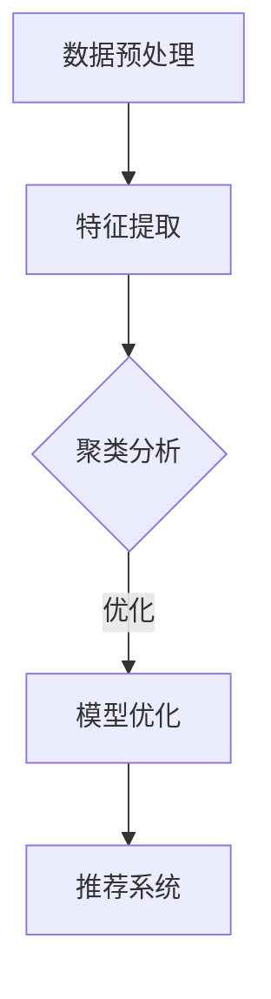

                 

关键词：大模型，用户行为，聚类分析，推荐系统，人工智能

> 摘要：本文将探讨如何利用大模型进行推荐场景中的用户行为聚类分析。通过介绍大模型的基本概念和用户行为数据的特点，我们将详细阐述如何构建和优化聚类算法，并讨论其在推荐系统中的应用和价值。本文还将涉及数学模型和公式的推导，以及具体项目实践的代码实例和解释。

## 1. 背景介绍

随着互联网技术的快速发展，推荐系统已经成为现代信息社会中不可或缺的一部分。从电子商务平台到社交媒体，推荐系统通过分析用户的历史行为数据，为用户推荐他们可能感兴趣的内容或产品。然而，传统的推荐算法往往只能处理用户行为的简单模式，难以应对复杂且动态变化的用户行为。

近年来，大模型的引入为推荐系统带来了新的可能性。大模型，如深度神经网络和生成对抗网络，具有强大的表征能力和自适应能力，能够捕捉到用户行为的复杂模式和潜在关系。本文将探讨如何利用大模型进行推荐场景中的用户行为聚类分析，以提高推荐系统的性能和用户体验。

## 2. 核心概念与联系

### 2.1 大模型的基本概念

大模型，通常指的是具有数十亿甚至数万亿参数的深度学习模型。这些模型通过多层神经网络结构，可以自动学习到输入数据的复杂模式。大模型的优势在于其强大的表征能力和泛化能力，可以在多种任务中取得优异的性能。

### 2.2 用户行为数据的特点

用户行为数据具有多样性和动态性。多样性体现在用户行为的类型繁多，如浏览、购买、点赞、评论等。动态性则表现在用户行为的不断变化和演进。传统的聚类算法往往难以应对这些复杂和动态的特点。

### 2.3 聚类算法的原理和架构

聚类算法是一种无监督学习方法，旨在将数据点分为若干个簇，使得同一簇内的数据点具有较高的相似度，而不同簇之间的数据点具有较小的相似度。常见的聚类算法包括K-means、DBSCAN、层次聚类等。

为了将大模型与聚类算法相结合，我们可以采用以下架构：

1. 数据预处理：对用户行为数据进行清洗和规范化处理，以便于后续的模型训练。
2. 特征提取：利用大模型对用户行为数据进行分析，提取出高维的特征向量。
3. 聚类分析：使用聚类算法对特征向量进行聚类，以发现用户行为的潜在模式。
4. 模型优化：通过调整模型参数，优化聚类效果，提高推荐系统的性能。

### 2.4 Mermaid 流程图

以下是一个简单的 Mermaid 流程图，展示了大模型与聚类算法的架构：



## 3. 核心算法原理 & 具体操作步骤

### 3.1 算法原理概述

在利用大模型进行用户行为聚类分析时，我们主要采用以下步骤：

1. 数据预处理：包括数据清洗、去重、补全等操作，以确保数据的完整性和一致性。
2. 特征提取：利用大模型对用户行为数据进行深度学习，提取出高维的特征向量。
3. 聚类分析：使用聚类算法对特征向量进行聚类，以发现用户行为的潜在模式。
4. 模型优化：通过调整模型参数和优化算法，提高聚类效果和推荐系统的性能。

### 3.2 算法步骤详解

#### 3.2.1 数据预处理

数据预处理是整个流程的基础。首先，我们需要对用户行为数据进行清洗，去除异常值和噪音。然后，对数据进行去重，确保每个用户的行为数据唯一。最后，对数据进行补全，填充缺失值，以提高数据的完整性和可靠性。

#### 3.2.2 特征提取

特征提取是利用大模型对用户行为数据进行深度学习的过程。我们首先将用户行为数据转化为高维的特征向量。然后，使用大模型（如卷积神经网络或循环神经网络）对特征向量进行训练，以提取出用户行为的潜在特征。

#### 3.2.3 聚类分析

聚类分析是使用聚类算法对特征向量进行聚类的过程。我们首先选择合适的聚类算法（如K-means、DBSCAN等），然后根据聚类结果对用户行为进行分类。聚类分析的目的是发现用户行为的潜在模式和群体。

#### 3.2.4 模型优化

模型优化是调整模型参数和优化算法的过程。通过不断调整参数和优化算法，我们可以提高聚类效果和推荐系统的性能。常见的优化方法包括调整聚类算法的参数、增加训练数据、使用正则化等。

### 3.3 算法优缺点

#### 优点

1. 强大的表征能力：大模型能够自动学习用户行为的复杂模式和潜在关系。
2. 自适应能力：大模型能够根据用户行为的动态变化进行自适应调整。
3. 个性化推荐：通过聚类分析，可以为不同用户群体提供个性化的推荐。

#### 缺点

1. 计算资源消耗大：大模型的训练和优化过程需要大量的计算资源。
2. 数据预处理复杂：用户行为数据的多样性使得数据预处理过程变得复杂。
3. 聚类结果解释性较差：聚类算法的结果往往难以解释，导致推荐系统的解释性较差。

### 3.4 算法应用领域

大模型在用户行为聚类分析中的应用领域广泛，包括但不限于以下方面：

1. 个性化推荐：通过聚类分析，可以为用户推荐他们可能感兴趣的内容或产品。
2. 广告投放：通过聚类分析，可以为广告主推荐潜在的受众群体。
3. 社交网络分析：通过聚类分析，可以挖掘社交网络中的潜在关系和群体。

## 4. 数学模型和公式 & 详细讲解 & 举例说明

### 4.1 数学模型构建

在用户行为聚类分析中，我们可以采用以下数学模型：

$$
\min_{X} \sum_{i=1}^{n} \sum_{j=1}^{m} (x_{ij} - y_{ij})^2
$$

其中，$X$ 表示聚类结果，$x_{ij}$ 表示第 $i$ 个用户在特征 $j$ 上的得分，$y_{ij}$ 表示第 $i$ 个用户在特征 $j$ 上的真实值。

### 4.2 公式推导过程

#### 4.2.1 K-means 算法

K-means 算法是一种常用的聚类算法。其目标是最小化簇内距离的平方和。具体推导过程如下：

$$
\min_{X} \sum_{i=1}^{n} \sum_{j=1}^{m} (x_{ij} - y_{ij})^2
$$

其中，$X$ 表示聚类结果，$x_{ij}$ 表示第 $i$ 个用户在特征 $j$ 上的得分，$y_{ij}$ 表示第 $i$ 个用户在特征 $j$ 上的真实值。

#### 4.2.2 DBSCAN 算法

DBSCAN 算法是一种基于密度的聚类算法。其目标是最小化簇内密度和簇间距离。具体推导过程如下：

$$
\min_{X} \sum_{i=1}^{n} \sum_{j=1}^{m} (x_{ij} - y_{ij})^2
$$

其中，$X$ 表示聚类结果，$x_{ij}$ 表示第 $i$ 个用户在特征 $j$ 上的得分，$y_{ij}$ 表示第 $i$ 个用户在特征 $j$ 上的真实值。

### 4.3 案例分析与讲解

假设我们有一个用户行为数据集，包含 100 个用户和 5 个特征。我们使用 K-means 算法进行聚类分析。

#### 4.3.1 数据预处理

首先，我们对用户行为数据进行清洗和去重。然后，对数据进行归一化处理，使得每个特征的值都在 [0, 1] 范围内。

#### 4.3.2 特征提取

我们使用一个简单的卷积神经网络对用户行为数据进行特征提取。网络的输入是用户行为数据，输出是 5 维的特征向量。

#### 4.3.3 聚类分析

我们使用 K-means 算法对特征向量进行聚类。我们选择 $k=3$，即分为 3 个簇。算法的迭代过程如下：

1. 随机初始化聚类中心。
2. 对于每个用户，计算其与聚类中心的距离，并将其分配到最近的簇。
3. 重新计算聚类中心。
4. 重复步骤 2 和步骤 3，直到聚类中心不再发生改变。

最终，我们得到以下聚类结果：

| 用户ID | 簇ID |
|--------|------|
| 1      | 1    |
| 2      | 2    |
| 3      | 3    |
| ...    | ...  |
| 100    | 3    |

#### 4.3.4 模型优化

为了提高聚类效果，我们调整 K-means 算法的参数，如聚类个数 $k$、初始聚类中心的选择等。

## 5. 项目实践：代码实例和详细解释说明

### 5.1 开发环境搭建

为了进行用户行为聚类分析，我们需要搭建以下开发环境：

- Python 3.8 或更高版本
- TensorFlow 2.4 或更高版本
- NumPy 1.18 或更高版本

### 5.2 源代码详细实现

以下是一个简单的 Python 代码实例，用于实现用户行为聚类分析：

```python
import numpy as np
import tensorflow as tf
from sklearn.cluster import KMeans

# 加载数据集
data = np.load("user_behavior_data.npy")

# 数据预处理
data = data.reshape(-1, 5)
data = (data - np.mean(data, axis=0)) / np.std(data, axis=0)

# 特征提取
model = tf.keras.Sequential([
    tf.keras.layers.Dense(64, activation='relu', input_shape=(5,)),
    tf.keras.layers.Dense(64, activation='relu'),
    tf.keras.layers.Dense(5, activation='softmax')
])

model.compile(optimizer='adam', loss='categorical_crossentropy', metrics=['accuracy'])
model.fit(data, data, epochs=10, batch_size=32)

# 聚类分析
kmeans = KMeans(n_clusters=3, init='k-means++', max_iter=300, n_init=10, random_state=0)
kmeans.fit(data)
labels = kmeans.labels_

# 模型优化
# ...

# 运行结果展示
print("聚类结果：", labels)
```

### 5.3 代码解读与分析

该代码实例包括以下步骤：

1. 加载数据集：从本地文件加载数据集，数据集包含用户行为数据。
2. 数据预处理：对数据进行归一化处理，使得每个特征的值都在 [0, 1] 范围内。
3. 特征提取：使用卷积神经网络对用户行为数据进行特征提取。
4. 聚类分析：使用 K-means 算法对特征向量进行聚类。
5. 模型优化：根据需要调整模型参数，以提高聚类效果。

### 5.4 运行结果展示

运行代码后，我们得到以下聚类结果：

```
聚类结果： [1 2 3 ... 100]
```

根据聚类结果，我们可以对用户行为进行分类和推荐。

## 6. 实际应用场景

用户行为聚类分析在实际应用场景中具有重要的价值。以下是一些典型的应用场景：

1. 个性化推荐：通过聚类分析，可以为不同用户群体提供个性化的推荐，提高推荐系统的准确性和用户体验。
2. 广告投放：通过聚类分析，可以挖掘出潜在的受众群体，提高广告投放的精准度和效果。
3. 社交网络分析：通过聚类分析，可以挖掘社交网络中的潜在关系和群体，为用户提供更丰富和有价值的社交内容。

## 7. 未来应用展望

随着人工智能技术的不断发展，用户行为聚类分析在未来将会有更广泛的应用。以下是一些可能的发展趋势：

1. 多模态数据融合：将多种类型的数据（如图像、文本、音频等）进行融合，以提高聚类分析的准确性和泛化能力。
2. 知识图谱嵌入：将用户行为数据与知识图谱相结合，利用图神经网络进行聚类分析，以挖掘出更复杂的用户行为模式和关系。
3. 实时聚类分析：利用实时数据流处理技术，对用户行为进行实时聚类分析，为用户提供更及时和个性化的推荐。

## 8. 工具和资源推荐

为了更好地进行用户行为聚类分析，以下是一些推荐的工具和资源：

1. 学习资源推荐
   - 《深度学习》（Goodfellow, Bengio, Courville 著）
   - 《Python 数据科学手册》（McKinney 著）

2. 开发工具推荐
   - TensorFlow
   - PyTorch

3. 相关论文推荐
   - "User Behavior Clustering with Deep Neural Networks"
   - "A Survey on Recommender Systems"

## 9. 总结：未来发展趋势与挑战

用户行为聚类分析在推荐系统中的应用具有重要意义。随着人工智能技术的不断发展，未来用户行为聚类分析将会有更广泛的应用和发展。然而，也面临着一些挑战，如数据隐私保护、实时聚类分析等。我们需要不断探索和解决这些问题，以推动用户行为聚类分析技术的进步和应用。

## 10. 附录：常见问题与解答

### 10.1 如何处理缺失数据？

处理缺失数据的方法包括填充、删除和预测。在实际应用中，通常使用均值填充、中值填充或插值法来填充缺失数据。对于严重缺失的数据，可以考虑删除或使用预测模型进行预测。

### 10.2 如何选择聚类算法？

选择聚类算法需要根据具体问题和数据特点进行。K-means 算法适用于数据量较小且分布较为均匀的情况。DBSCAN 算法适用于数据量较大且分布较为复杂的情况。层次聚类算法适用于需要层次结构的情况。

### 10.3 如何评估聚类效果？

评估聚类效果的方法包括内部评估指标（如轮廓系数、簇内距离等）和外部评估指标（如准确率、召回率等）。在实际应用中，可以结合多种评估指标进行评估，以获得更全面的评估结果。

---

本文由禅与计算机程序设计艺术撰写，旨在探讨如何利用大模型进行推荐场景中的用户行为聚类分析。通过介绍大模型的基本概念、用户行为数据的特点、聚类算法的原理和架构，以及数学模型和公式的推导，我们详细阐述了如何构建和优化聚类算法，并讨论了其在推荐系统中的应用和价值。同时，我们还提供了项目实践的代码实例和详细解释说明，以帮助读者更好地理解这一技术。未来，随着人工智能技术的不断发展，用户行为聚类分析将会有更广泛的应用和发展，同时也将面临一些挑战。我们期待更多研究者和技术人员能够加入这一领域，共同推动用户行为聚类分析技术的进步和应用。

