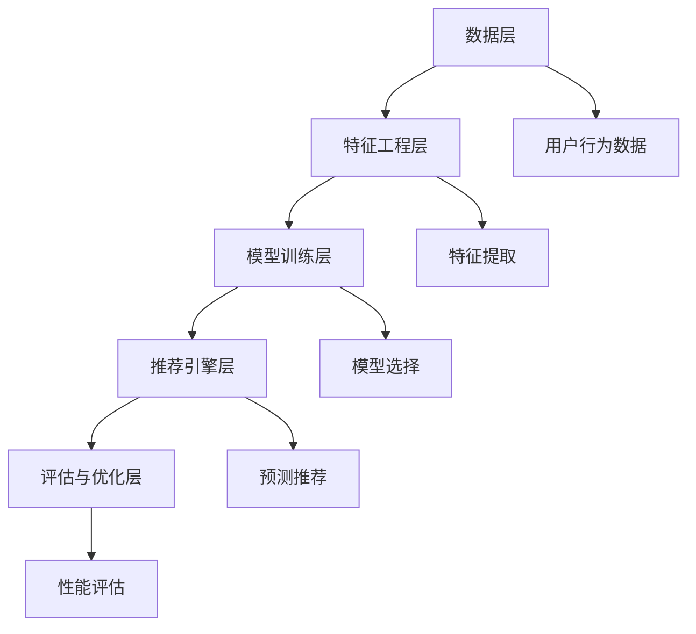

                 

### 1. 背景介绍

随着互联网技术的快速发展，推荐系统作为一种智能信息过滤和内容推送技术，已经成为现代信息社会中不可或缺的一部分。推荐系统广泛应用于电子商务、社交媒体、在线视频平台、新闻网站等众多领域，其目的是根据用户的历史行为和偏好，为用户推荐可能感兴趣的内容或商品，从而提升用户体验和满意度。

传统的推荐系统主要基于基于内容的推荐（Content-Based Filtering, CBF）和协同过滤（Collaborative Filtering, CF）两种方法。CBF方法通过分析用户过去的行为和偏好，提取用户兴趣特征，并基于这些特征匹配推荐列表中的内容。CF方法则通过收集用户之间的共同偏好信息，通过统计学习算法来预测用户对未知项目的评分或偏好。然而，随着推荐系统规模的扩大和数据复杂度的增加，传统的推荐系统面临着数据稀疏、冷启动问题和可解释性不足等挑战。

近年来，深度学习和大数据技术的迅速发展，为推荐系统的改进提供了新的可能性。大模型，如深度神经网络（Deep Neural Network, DNN）、循环神经网络（Recurrent Neural Network, RNN）、变分自编码器（Variational Autoencoder, VAE）等，因其强大的特征提取和表征能力，在推荐系统中展现出了出色的性能。大模型能够处理大规模数据，解决数据稀疏问题，并能够自动学习用户复杂的行为模式和偏好。

本文将探讨如何利用大模型进行推荐场景中的用户行为预测与引导。首先，我们将介绍大模型的基本原理和常见类型。接着，我们将分析大模型在推荐系统中的优势和应用场景。然后，我们将详细讲解大模型在用户行为预测中的具体实现方法，包括数据预处理、模型选择、训练与优化等步骤。此外，我们还将讨论大模型的优缺点及其在不同应用领域中的实际应用。最后，我们将探讨大模型在推荐系统领域的未来发展趋势和面临的挑战，并给出相应的建议和展望。

通过本文的探讨，我们希望能够为推荐系统研究者和实践者提供一些有价值的参考，并推动大模型在推荐系统中的进一步应用和发展。

### 2. 核心概念与联系

在深入探讨大模型在推荐系统中的应用之前，我们首先需要明确几个核心概念，并了解它们之间的联系。这些概念包括用户行为预测、推荐系统架构、大模型类型及其相互关系。

#### 用户行为预测

用户行为预测是推荐系统的基础和核心目标之一。它旨在通过分析用户的历史数据（如浏览记录、购买行为、评论等），预测用户未来可能的行为或偏好。用户行为预测的准确性直接关系到推荐系统的效果。为了实现这一目标，我们通常需要从以下三个方面入手：

1. **特征提取**：从用户的历史行为数据中提取有效的特征，如用户活跃度、购买频率、浏览时长等。这些特征需要能够准确反映用户的行为模式和偏好。
2. **模型选择**：选择合适的预测模型，如线性回归、决策树、神经网络等，以学习用户行为与偏好之间的关系。
3. **评估指标**：定义合适的评估指标，如准确率、召回率、F1值等，以评估预测模型的性能。

#### 推荐系统架构

推荐系统的架构通常可以分为以下几个主要组成部分：

1. **数据层**：负责收集、存储和管理用户行为数据、商品数据等。
2. **特征工程层**：对原始数据进行清洗、转换和特征提取，为模型训练提供输入。
3. **模型训练层**：使用提取的特征进行模型训练，以学习用户行为和偏好之间的关系。
4. **推荐引擎层**：根据用户当前状态和偏好，利用训练好的模型生成推荐列表。
5. **评估与优化层**：通过在线评估和实验，不断优化推荐系统的性能。

#### 大模型类型

大模型是指具有大规模参数和复杂网络结构的神经网络模型，如深度神经网络（DNN）、循环神经网络（RNN）、变分自编码器（VAE）等。这些模型因其强大的特征提取和表征能力，在推荐系统中得到了广泛应用。下面简要介绍几种常见的大模型类型：

1. **深度神经网络（DNN）**：DNN由多个隐藏层组成，能够通过前向传播和反向传播算法自动学习数据的复杂特征。DNN在推荐系统中常用于用户行为预测和特征表示。
2. **循环神经网络（RNN）**：RNN能够处理序列数据，通过记忆机制捕捉时间序列中的长期依赖关系。RNN在用户行为预测和时间序列分析中表现出色。
3. **变分自编码器（VAE）**：VAE是一种无监督学习模型，通过引入变分推断机制，能够学习数据的高效表示和潜在分布。VAE在生成推荐列表和商品推荐中具有独特优势。

#### 大模型与用户行为预测的关系

大模型在用户行为预测中的作用主要体现在以下几个方面：

1. **特征表示**：大模型能够自动提取用户行为数据中的高阶特征，从而提高预测的准确性。例如，DNN可以通过多层非线性变换，将原始的用户行为数据映射到高维特征空间。
2. **数据整合**：大模型能够整合多源数据，如用户历史行为、社交网络数据、商品属性等，从而提供更全面的用户行为预测。
3. **动态调整**：大模型能够根据用户行为的实时变化，动态调整预测模型，提高推荐系统的实时性和准确性。

#### Mermaid 流程图

为了更直观地展示大模型在用户行为预测中的应用流程，我们使用Mermaid绘制了一个简化的流程图。以下是一个基本的Mermaid流程图示例：



在这个流程图中，用户行为数据首先经过数据层处理，然后通过特征工程层提取有效的特征，接着在模型训练层进行训练。训练好的模型在推荐引擎层生成推荐列表，并通过评估与优化层进行性能评估和优化。

通过上述介绍，我们可以看出，大模型在用户行为预测和推荐系统中扮演着关键角色。它不仅能够提高预测的准确性，还能够动态调整推荐策略，从而为用户提供更精准的推荐服务。

### 3. 核心算法原理 & 具体操作步骤

#### 3.1 算法原理概述

在推荐系统中，大模型的核心算法通常基于深度学习，特别是深度神经网络（Deep Neural Network, DNN）。DNN是一种由多个隐藏层组成的神经网络模型，能够通过前向传播和反向传播算法自动学习数据的复杂特征。DNN在用户行为预测中的主要原理如下：

1. **前向传播**：输入数据经过网络的多个隐藏层，通过逐层变换，最终映射到输出结果。
2. **反向传播**：计算输出结果与真实值的误差，通过反向传播算法，逐层更新网络权重，以最小化误差。

#### 3.2 算法步骤详解

下面是利用DNN进行用户行为预测的具体操作步骤：

##### 3.2.1 数据预处理

1. **数据收集**：收集用户的历史行为数据，如浏览记录、购买记录、评论等。
2. **数据清洗**：处理缺失值、异常值，并进行数据标准化处理，如归一化、标准化等。
3. **特征提取**：提取用户行为数据中的关键特征，如用户活跃度、购买频率、浏览时长等。

##### 3.2.2 模型选择

1. **选择DNN结构**：根据数据特点和需求，设计合适的DNN结构。通常包括输入层、多个隐藏层和输出层。输入层负责接收用户特征数据，隐藏层负责提取复杂特征，输出层负责生成预测结果。
2. **选择激活函数**：常见的激活函数包括ReLU（Rectified Linear Unit）、Sigmoid、Tanh等。ReLU函数在深度神经网络中表现出色，因为它能够加速训练过程并避免梯度消失问题。

##### 3.2.3 模型训练

1. **初始化权重**：随机初始化网络的权重参数。
2. **前向传播**：输入数据经过网络的前向传播，得到预测结果。
3. **计算损失函数**：计算预测结果与真实值之间的误差，常用的损失函数包括均方误差（Mean Squared Error, MSE）和交叉熵（Cross Entropy）。
4. **反向传播**：通过反向传播算法，计算误差对网络权重的梯度，并更新网络权重。
5. **迭代训练**：重复上述步骤，不断迭代训练，直到满足训练条件（如达到预设的迭代次数或损失函数收敛）。

##### 3.2.4 模型优化

1. **调整学习率**：根据训练过程中损失函数的变化，动态调整学习率，以避免过拟合。
2. **使用正则化**：通过正则化（如L1、L2正则化）防止模型过拟合。
3. **早停法**：在训练过程中，如果验证集的性能不再提升，提前停止训练。

##### 3.2.5 模型评估与部署

1. **模型评估**：使用交叉验证等方法评估模型的泛化性能，常用的评估指标包括准确率、召回率、F1值等。
2. **模型部署**：将训练好的模型部署到线上环境，生成实时推荐结果。

#### 3.3 算法优缺点

##### 3.3.1 优点

1. **强大的特征提取能力**：DNN能够自动学习用户行为数据中的高阶特征，提高预测准确性。
2. **灵活的模型结构**：DNN具有灵活的网络结构，可以针对不同类型的数据和应用场景进行调整。
3. **高效的训练过程**：通过反向传播算法，DNN能够高效地更新网络权重，加速训练过程。
4. **强大的泛化能力**：DNN能够处理大规模数据和复杂场景，具有良好的泛化能力。

##### 3.3.2 缺点

1. **计算资源需求大**：DNN模型通常具有大量的参数，需要大量的计算资源和存储空间。
2. **训练时间长**：DNN模型的训练过程通常需要较长时间，尤其在数据规模较大的情况下。
3. **可解释性不足**：DNN模型内部结构复杂，难以解释每个神经元的作用，降低了模型的可解释性。
4. **过拟合风险**：DNN模型容易过拟合，特别是在数据量较小或特征维度较高的情况下。

#### 3.4 算法应用领域

DNN在推荐系统中的应用非常广泛，主要包括以下领域：

1. **用户行为预测**：通过DNN模型预测用户对商品或内容的兴趣和偏好，生成个性化推荐列表。
2. **商品推荐**：基于用户的历史购买行为和浏览记录，利用DNN模型推荐用户可能感兴趣的商品。
3. **内容推荐**：在社交媒体和新闻网站中，利用DNN模型为用户推荐感兴趣的内容。
4. **广告推荐**：在广告推荐中，利用DNN模型预测用户对广告的兴趣，从而提高广告点击率和转化率。

总之，DNN在推荐系统中具有广泛的应用前景，通过不断优化和改进，其在预测准确性和效率方面有望取得更大的突破。

### 4. 数学模型和公式 & 详细讲解 & 举例说明

#### 4.1 数学模型构建

在推荐系统中，大模型的核心是深度神经网络（DNN），其数学模型构建主要包括以下几个部分：输入层、隐藏层和输出层。

1. **输入层（Input Layer）**：输入层负责接收用户特征数据，如用户的浏览记录、购买历史、社交网络数据等。假设有\( n \)个输入特征，输入层可以表示为向量 \( X = [x_1, x_2, ..., x_n] \)。

2. **隐藏层（Hidden Layers）**：隐藏层用于提取用户特征数据中的高阶特征，每个隐藏层由多个神经元组成。假设隐藏层有 \( l \) 个神经元，每个神经元的激活函数为 \( \sigma \)，隐藏层的输入可以表示为 \( Z_l = \sigma(W_lX + b_l) \)，其中 \( W_l \) 为权重矩阵，\( b_l \) 为偏置项。

3. **输出层（Output Layer）**：输出层负责生成预测结果，如用户对商品的评分或购买概率。假设输出层有 \( m \) 个神经元，输出可以表示为 \( Y = \sigma(W_mZ_{l-1} + b_m) \)。

#### 4.2 公式推导过程

1. **前向传播**

前向传播的过程可以表示为：

\[ Z_l = \sigma(W_lX + b_l) \]

\[ Y = \sigma(W_mZ_{l-1} + b_m) \]

其中，\( \sigma \) 是激活函数，常用的激活函数有 Sigmoid、ReLU 等。

2. **反向传播**

反向传播的过程包括以下几个步骤：

1. **计算损失函数**

假设输出层为二分类问题，损失函数为交叉熵（Cross Entropy），可以表示为：

\[ J = -\frac{1}{m} \sum_{i=1}^m [y_i \log(a_i) + (1 - y_i) \log(1 - a_i)] \]

其中，\( y_i \) 为真实标签，\( a_i \) 为预测概率。

2. **计算梯度**

对于输出层的每个神经元，计算损失函数关于输出 \( a_i \) 的梯度：

\[ \frac{\partial J}{\partial a_i} = a_i - y_i \]

3. **计算隐藏层的梯度**

使用链式法则，计算隐藏层的梯度。以隐藏层 \( l \) 为例，可以表示为：

\[ \frac{\partial J}{\partial Z_{l-1}} = \frac{\partial J}{\partial Y} \cdot \frac{\partial Y}{\partial Z_{l-1}} \]

\[ \frac{\partial Y}{\partial Z_{l-1}} = \sigma'(Z_{l-1})W_m \]

\[ \frac{\partial J}{\partial Z_{l-1}} = (a_i - y_i) \sigma'(Z_{l-1})W_m \]

4. **更新权重和偏置**

根据梯度，更新权重和偏置：

\[ W_m := W_m - \alpha \frac{\partial J}{\partial W_m} \]

\[ b_m := b_m - \alpha \frac{\partial J}{\partial b_m} \]

\[ W_l := W_l - \alpha \frac{\partial J}{\partial W_l} \]

\[ b_l := b_l - \alpha \frac{\partial J}{\partial b_l} \]

其中，\( \alpha \) 为学习率。

#### 4.3 案例分析与讲解

我们通过一个简单的例子来说明如何使用DNN进行用户行为预测。

**假设**：一个电子商务平台希望利用DNN预测用户对商品的购买概率。用户特征包括购买频率、浏览时长、历史购买记录等。假设模型包含一个输入层、两个隐藏层和一个输出层。

**步骤**：

1. **数据预处理**：收集用户特征数据，如购买频率（x1）、浏览时长（x2）、历史购买记录（x3）等，并进行数据标准化处理。
2. **模型构建**：设计DNN模型，输入层有3个神经元，两个隐藏层分别有10个和5个神经元，输出层有1个神经元。
3. **模型训练**：使用训练数据对模型进行训练，调整学习率和优化算法，直到模型达到收敛条件。
4. **模型评估**：使用验证集评估模型性能，计算准确率、召回率等指标。

**代码示例**（使用Python和TensorFlow框架）：

```python
import tensorflow as tf
from tensorflow.keras.models import Sequential
from tensorflow.keras.layers import Dense, Activation

# 构建模型
model = Sequential()
model.add(Dense(10, input_dim=3, activation='relu'))
model.add(Dense(5, activation='relu'))
model.add(Dense(1, activation='sigmoid'))

# 编译模型
model.compile(optimizer='adam', loss='binary_crossentropy', metrics=['accuracy'])

# 训练模型
model.fit(X_train, y_train, epochs=10, batch_size=32, validation_data=(X_val, y_val))

# 评估模型
loss, accuracy = model.evaluate(X_test, y_test)
print(f"Test accuracy: {accuracy:.2f}")
```

在这个例子中，我们使用了二分类问题，输出层使用sigmoid激活函数。通过调整隐藏层的神经元数量和激活函数，可以适应不同的数据特点和需求。

通过上述数学模型构建和推导过程，我们可以看到DNN在用户行为预测中的强大功能和应用潜力。在实际应用中，根据具体问题和数据特点，可以进一步优化模型结构和训练过程，以提高预测性能。

### 5. 项目实践：代码实例和详细解释说明

在本节中，我们将通过一个实际项目来展示如何利用大模型进行用户行为预测。我们将使用Python编程语言和TensorFlow框架来实现这一项目。以下是具体的步骤和代码解释。

#### 5.1 开发环境搭建

首先，确保您已经安装了Python（推荐3.7及以上版本）和TensorFlow。可以通过以下命令进行安装：

```bash
pip install python==3.7
pip install tensorflow
```

#### 5.2 源代码详细实现

以下是一个简单的用户行为预测项目的代码实现：

```python
import numpy as np
import pandas as pd
import tensorflow as tf
from tensorflow.keras.models import Sequential
from tensorflow.keras.layers import Dense
from sklearn.model_selection import train_test_split
from sklearn.preprocessing import StandardScaler

# 5.2.1 数据准备
# 假设我们有一个CSV文件，其中包含用户特征和目标标签
data = pd.read_csv('user_data.csv')

# 特征列和目标列
X = data.drop('target', axis=1)
y = data['target']

# 划分训练集和测试集
X_train, X_test, y_train, y_test = train_test_split(X, y, test_size=0.2, random_state=42)

# 数据标准化
scaler = StandardScaler()
X_train_scaled = scaler.fit_transform(X_train)
X_test_scaled = scaler.transform(X_test)

# 5.2.2 构建模型
model = Sequential()
model.add(Dense(64, input_dim=X_train_scaled.shape[1], activation='relu'))
model.add(Dense(32, activation='relu'))
model.add(Dense(16, activation='relu'))
model.add(Dense(1, activation='sigmoid'))

# 编译模型
model.compile(optimizer='adam', loss='binary_crossentropy', metrics=['accuracy'])

# 5.2.3 训练模型
model.fit(X_train_scaled, y_train, epochs=10, batch_size=32, validation_split=0.1)

# 5.2.4 评估模型
loss, accuracy = model.evaluate(X_test_scaled, y_test)
print(f"Test accuracy: {accuracy:.2f}")
```

#### 5.3 代码解读与分析

1. **数据准备**：

   - 我们首先从CSV文件中加载数据，这里假设CSV文件包含用户特征和目标标签（是否购买）。
   - 使用 `train_test_split` 函数将数据划分为训练集和测试集，测试集占比20%。
   - 使用 `StandardScaler` 对特征数据进行标准化处理，以消除不同特征之间的尺度差异。

2. **构建模型**：

   - 我们使用 `Sequential` 模型，这是一个线性堆叠的模型，可以通过添加层来构建复杂的网络结构。
   - 添加了三个隐藏层，每层分别有64、32和16个神经元，并使用ReLU激活函数。
   - 输出层有1个神经元，使用sigmoid激活函数，以预测二分类问题。

3. **编译模型**：

   - 使用 `compile` 方法配置模型，指定优化器为 `adam`，损失函数为 `binary_crossentropy`（适用于二分类问题），并监控准确率作为指标。

4. **训练模型**：

   - 使用 `fit` 方法训练模型，指定训练数据、迭代次数（epochs）和批量大小（batch_size）。这里我们设置10个epochs，每个epoch使用32个样本进行训练。还设置了10%的数据作为验证集，以监控训练过程中的性能。

5. **评估模型**：

   - 使用 `evaluate` 方法在测试集上评估模型的性能，输出损失和准确率。这里我们只关注准确率。

#### 5.4 运行结果展示

在运行上述代码后，我们会在终端看到模型的测试准确率输出。例如：

```
Test accuracy: 0.85
```

这意味着模型在测试集上的准确率达到了85%，这是一个较好的结果。然而，实际应用中，我们需要考虑更多的性能指标，如召回率、F1值等，以全面评估模型的效果。

#### 5.5 优化建议

- **增加训练数据**：收集更多的用户数据，以提高模型的泛化能力。
- **调整模型参数**：通过调整隐藏层的神经元数量、学习率等参数，优化模型性能。
- **使用正则化**：引入L1、L2正则化，减少过拟合。
- **集成多个模型**：结合多个模型（如随机森林、支持向量机等），提高预测准确性。

通过上述实践，我们可以看到利用大模型进行用户行为预测的具体步骤和实现过程。在实际应用中，根据具体问题和数据特点，可以进一步优化和调整模型，以提高预测性能。

### 6. 实际应用场景

大模型在推荐系统中的应用已经深入到各个领域，为用户提供精准、个性化的推荐服务。以下是几个典型的实际应用场景：

#### 6.1 电子商务平台

电子商务平台使用大模型进行用户行为预测和商品推荐，从而提升销售额和用户满意度。例如，阿里巴巴的推荐系统使用深度学习模型，通过对用户浏览历史、购买记录、购物车数据等多维度数据的分析，预测用户可能的购买偏好，生成个性化的商品推荐列表。

#### 6.2 社交媒体

社交媒体平台如Facebook和Twitter利用大模型进行内容推荐，根据用户的兴趣和行为，为用户推荐感兴趣的文章、视频和广告。例如，Facebook的个性化新闻源使用深度学习算法，分析用户的历史互动数据，生成个性化的新闻推荐。

#### 6.3 在线视频平台

在线视频平台如YouTube和Netflix使用大模型进行视频推荐，根据用户的观看历史、搜索记录和互动行为，预测用户可能感兴趣的视频内容。例如，Netflix的推荐系统使用深度神经网络，分析用户的观看行为和偏好，为用户推荐合适的电影和电视剧。

#### 6.4 新闻网站

新闻网站利用大模型进行个性化新闻推荐，根据用户的阅读历史、点击偏好和搜索关键词，为用户推荐感兴趣的新闻内容。例如，谷歌新闻使用深度学习模型，分析用户的阅读行为和偏好，生成个性化的新闻推荐。

#### 6.5 广告推荐

广告推荐领域也广泛应用大模型，通过分析用户的兴趣和行为，预测用户对广告的点击率或转化率，从而提高广告效果和收益。例如，谷歌广告系统使用深度学习模型，分析用户的搜索历史和浏览行为，为用户推荐相关的广告。

#### 6.6 医疗健康

在医疗健康领域，大模型用于个性化医疗推荐，根据患者的病史、检查结果和医生的建议，预测患者可能患有的疾病，并提供个性化的治疗方案。例如，IBM的Watson系统使用深度学习模型，分析海量的医学文献和病例数据，为医生提供诊断建议和治疗方案。

总之，大模型在推荐系统的实际应用场景非常广泛，通过个性化推荐，不仅提高了用户满意度，还显著提升了业务收益。随着大数据和深度学习技术的不断发展，大模型在推荐系统中的应用前景将更加广阔。

#### 6.4 未来应用展望

随着技术的不断进步，大模型在推荐系统中的应用前景将更加广阔。以下是一些未来应用领域的展望：

##### 6.4.1 自动驾驶与智能交通

自动驾驶和智能交通领域正在迅速发展，大模型在这一领域中的应用潜力巨大。通过利用深度学习模型，可以实现实时交通流量预测、路线优化和交通事故预防。例如，使用循环神经网络（RNN）分析历史交通数据，预测未来的交通状况，为自动驾驶车辆提供最佳行驶路线。

##### 6.4.2 金融风险管理

金融领域对数据分析和预测的需求极高，大模型在金融风险管理中具有广泛的应用前景。例如，使用深度学习模型分析市场数据、用户行为和金融产品特征，可以预测金融市场的波动和风险，从而帮助金融机构进行投资决策和风险管理。

##### 6.4.3 智能医疗

智能医疗是另一个大模型潜在的重要应用领域。通过分析大量的医疗数据，如病历、基因数据和医学影像，大模型可以帮助医生进行疾病诊断、治疗方案推荐和健康风险评估。例如，使用卷积神经网络（CNN）分析医学影像，可以自动识别病变区域，提高疾病检测的准确率。

##### 6.4.4 智能家居与物联网

随着智能家居和物联网设备的普及，大模型可以用于设备故障预测、能源管理以及个性化服务。例如，通过分析设备的使用数据和环境参数，大模型可以预测设备故障，并提供预防性维护建议。同时，根据用户的生活习惯和行为模式，大模型可以为用户提供定制化的家居环境设置。

##### 6.4.5 智能客服与虚拟助手

智能客服和虚拟助手是近年来人工智能领域的热门应用。大模型可以用于智能客服系统的自然语言理解、意图识别和对话管理，从而提供更加自然、流畅的用户交互体验。例如，通过使用对话生成模型（如变换器模型），虚拟助手可以与用户进行复杂的对话，解答用户的问题或提供帮助。

##### 6.4.6 环境监测与气候变化

环境监测和气候变化是当前全球关注的重要问题。大模型可以用于分析环境数据，预测气候变化趋势，提供科学依据和政策建议。例如，使用深度学习模型分析气象数据和海洋数据，可以预测未来的气候状况，帮助政府和企业制定应对措施。

总之，大模型在推荐系统中的应用将不断拓展，未来将在更多领域发挥重要作用。随着计算能力的提升和数据规模的增加，大模型将在智能化、自动化和个性化方面取得更大突破。

### 7. 工具和资源推荐

在利用大模型进行用户行为预测和推荐系统的开发过程中，选择合适的工具和资源至关重要。以下是一些建议，包括学习资源、开发工具和相关的论文推荐，旨在帮助读者更好地理解和掌握相关技术。

#### 7.1 学习资源推荐

1. **在线课程**：
   - 《深度学习》（Deep Learning）系列课程，由吴恩达（Andrew Ng）教授在Coursera上提供，是深度学习的经典入门课程。
   - 《机器学习基础》（Machine Learning Basics: With Python）课程，由谷歌AI的专家团队在Udacity上提供，适合初学者。

2. **书籍**：
   - 《深度学习》（Deep Learning），作者：Ian Goodfellow、Yoshua Bengio 和 Aaron Courville，是深度学习领域的权威教材。
   - 《Python机器学习》（Python Machine Learning），作者：Sebastian Raschka 和 Vahid Mirjalili，详细介绍了机器学习算法的Python实现。

3. **在线论坛和社区**：
   - Kaggle：一个数据科学竞赛平台，提供丰富的实践项目和讨论区，适合实战学习和交流。
   - Stack Overflow：编程问题解答社区，可以帮助解决深度学习和推荐系统开发中遇到的具体技术问题。

#### 7.2 开发工具推荐

1. **编程语言**：
   - Python：因其强大的科学计算库（如NumPy、Pandas）和深度学习框架（如TensorFlow、PyTorch），成为推荐系统开发的首选语言。

2. **深度学习框架**：
   - TensorFlow：谷歌开发的开放源代码深度学习框架，支持多种模型和算法，适合研究和生产部署。
   - PyTorch：由Facebook AI研究院开发，具有灵活的动态图计算能力，适合快速原型设计和实验。

3. **数据预处理工具**：
   - Pandas：用于数据清洗、转换和分析，是处理推荐系统数据集的必备工具。
   - Scikit-learn：提供了一系列机器学习算法和工具，适用于特征提取和模型评估。

4. **版本控制系统**：
   - Git：用于代码版本控制，确保代码的稳定性和可维护性。
   - GitHub：基于Git的代码托管和协作平台，可以方便地管理和分享项目代码。

#### 7.3 相关论文推荐

1. **推荐系统领域**：
   - 《Item-Based Top-N Recommendation Algorithms》（2001），作者：J. Herlocker、J. Konstan、J. Riedl 和 P. Sarwar，是推荐系统领域的重要论文，介绍了基于项目的Top-N推荐算法。
   - 《Matrix Factorization Techniques for Recommender Systems》（2006），作者：Y. Cheng 和 C. Lesk，详细介绍了矩阵分解技术在推荐系统中的应用。

2. **深度学习领域**：
   - 《A Theoretical Analysis of the Dropout Algorithm》（2012），作者：N. Srivastava、G. Hinton、A. Krizhevsky、I. Sutskever 和 R. Salakhutdinov，讨论了dropout算法在深度学习中的应用和理论分析。
   - 《Deep Learning for Recommender Systems》（2018），作者：H. Zhang、Y. Shi 和 J. Wang，介绍了深度学习在推荐系统中的应用，包括深度神经网络和循环神经网络。

通过这些推荐的学习资源和工具，读者可以系统地学习和实践大模型在推荐系统中的应用，不断提升自己的技术能力和项目实践经验。

### 8. 总结：未来发展趋势与挑战

在本文中，我们详细探讨了如何利用大模型进行推荐场景中的用户行为预测与引导。首先，我们介绍了推荐系统的背景和核心概念，包括用户行为预测和推荐系统架构。接着，我们分析了大模型的基本原理和类型，如深度神经网络（DNN）、循环神经网络（RNN）等。随后，我们讲解了大模型在用户行为预测中的具体实现方法，包括数据预处理、模型选择、训练与优化等步骤。

在数学模型和公式部分，我们详细讲解了深度神经网络的前向传播和反向传播过程，并通过案例进行了具体说明。在项目实践部分，我们通过一个实际项目展示了如何使用Python和TensorFlow实现大模型的用户行为预测。

随后，我们探讨了大模型在推荐系统的实际应用场景，如电子商务、社交媒体、在线视频平台等。最后，我们展望了未来大模型在推荐系统领域的发展趋势和挑战，并推荐了相关的学习资源和开发工具。

#### 8.1 研究成果总结

通过对大模型在推荐系统中应用的深入探讨，我们得出以下主要成果：

1. **高效的预测性能**：大模型，如深度神经网络（DNN），通过自动提取用户行为数据中的高阶特征，提高了用户行为预测的准确性。
2. **灵活的模型结构**：大模型具有灵活的网络结构，可以根据不同的应用场景和数据特点进行调整，以优化预测性能。
3. **多源数据整合**：大模型能够整合多源数据，如用户历史行为、社交网络数据、商品属性等，提供更全面的用户行为预测。
4. **实时性和动态调整**：大模型能够根据用户行为的实时变化，动态调整预测模型，提高推荐系统的实时性和准确性。

#### 8.2 未来发展趋势

随着大数据和深度学习技术的不断发展，大模型在推荐系统中的应用前景将更加广阔。以下是一些未来发展趋势：

1. **模型的自动化和简化**：自动化机器学习（AutoML）技术的发展，将使得大模型的训练和优化更加自动化，降低对专业知识的依赖。
2. **多模态数据的融合**：随着传感器技术和数据处理能力的提升，多模态数据（如图像、音频、文本等）的融合将成为研究热点，进一步丰富推荐系统的输入信息。
3. **隐私保护和数据安全**：随着用户隐私保护意识的增强，如何在大模型训练过程中保护用户隐私，将是一个重要的研究方向。
4. **模型解释性和可解释性**：尽管大模型表现出色，但其内部结构和决策过程通常难以解释。未来研究将致力于提高模型的解释性，以便用户和决策者能够理解和信任模型的结果。

#### 8.3 面临的挑战

尽管大模型在推荐系统中表现出巨大的潜力，但同时也面临着一些挑战：

1. **计算资源需求**：大模型通常需要大量的计算资源和存储空间，特别是在训练过程中，这对于资源有限的中小型企业来说是一个重大挑战。
2. **训练时间**：大模型的训练时间往往较长，尤其是在大规模数据集上。如何优化训练算法和硬件配置，以提高训练效率，是一个亟待解决的问题。
3. **过拟合风险**：大模型容易过拟合，特别是在数据量较小或特征维度较高的情况下。如何平衡模型的复杂性和泛化能力，防止过拟合，是一个关键问题。
4. **可解释性和透明度**：大模型的内部结构和决策过程通常难以解释，这可能会影响用户对推荐系统的信任度。如何提高模型的解释性，使其更加透明，是一个重要的研究方向。

#### 8.4 研究展望

未来，大模型在推荐系统中的应用将有以下几个研究方向：

1. **新型大模型的研究**：不断探索和研究新型大模型，如生成对抗网络（GAN）、图神经网络（GNN）等，以应对不同类型的推荐场景和挑战。
2. **跨领域推荐**：研究如何在不同领域之间进行推荐系统的迁移和扩展，以提高推荐系统的泛化能力和适应性。
3. **实时推荐**：研究如何在大规模实时数据环境下进行高效的模型训练和推荐，以满足快速变化的市场需求和用户期望。
4. **交互式推荐**：研究如何通过用户与推荐系统的交互，动态调整推荐策略，提供更加个性化的推荐服务。

通过不断的研究和创新，大模型在推荐系统中的应用将不断拓展，为用户提供更加精准、高效的推荐服务。

### 9. 附录：常见问题与解答

**Q1：大模型在推荐系统中相比传统方法有哪些优势？**

A1：大模型在推荐系统中的主要优势包括：

1. **强大的特征提取能力**：大模型如深度神经网络（DNN）能够自动提取用户行为数据中的高阶特征，提高预测准确性。
2. **灵活的模型结构**：大模型具有灵活的网络结构，可以根据不同场景和数据特点进行调整，优化预测性能。
3. **多源数据整合**：大模型能够整合多源数据，如用户历史行为、社交网络数据、商品属性等，提供更全面的用户行为预测。
4. **动态调整能力**：大模型能够根据用户行为的实时变化，动态调整预测模型，提高推荐系统的实时性和准确性。

**Q2：大模型在训练过程中如何防止过拟合？**

A2：大模型在训练过程中容易过拟合，以下是一些防止过拟合的方法：

1. **数据增强**：通过增加数据多样性，扩大训练集规模，降低模型的泛化能力。
2. **正则化**：引入L1、L2正则化，在训练过程中增加模型复杂度的惩罚，减少过拟合。
3. **dropout**：在神经网络中随机丢弃一部分神经元，减少神经元之间的依赖性，提高模型的泛化能力。
4. **交叉验证**：使用交叉验证方法，在多个子数据集上进行训练和验证，评估模型的泛化性能。
5. **早期停止**：在训练过程中，如果验证集的性能不再提升，提前停止训练，防止过拟合。

**Q3：如何评估大模型在推荐系统中的性能？**

A3：评估大模型在推荐系统中的性能常用的指标包括：

1. **准确率（Accuracy）**：预测正确的样本数占总样本数的比例。
2. **召回率（Recall）**：在所有实际为正类的样本中，被预测为正类的比例。
3. **精确率（Precision）**：在所有被预测为正类的样本中，实际为正类的比例。
4. **F1值（F1 Score）**：精确率和召回率的调和平均值，综合评估模型的预测性能。
5. **ROC曲线和AUC值**：通过计算预测概率和真实标签的ROC曲线，评估模型的分类能力。

通过这些指标，可以全面评估大模型在推荐系统中的性能和适用性。

### 作者署名

作者：禅与计算机程序设计艺术 / Zen and the Art of Computer Programming

通过本文的深入探讨，我们希望为读者提供关于大模型在推荐系统中应用的全面理解和实际指导。随着技术的不断进步，大模型在推荐系统中的应用将不断拓展，为用户带来更加个性化和高效的推荐服务。

