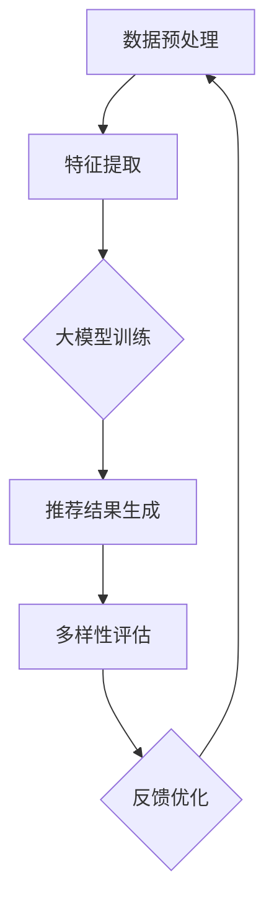

                 

关键词：推荐系统、大模型、多样性、算法优化、数学模型、实践案例、应用前景

> 摘要：本文深入探讨了利用大模型进行推荐多样性提升的新思路。通过介绍推荐系统的背景和核心概念，本文详细阐述了现有推荐算法存在的问题，特别是多样性不足的问题。接着，本文提出了一种基于大模型的推荐多样性优化方法，并通过数学模型和具体操作步骤进行了详细阐述。文章还结合实际案例，展示了该方法的实现和效果。最后，本文对未来应用前景进行了展望，并提出了面临的挑战和研究方向。

## 1. 背景介绍

推荐系统作为一种信息过滤和检索技术，旨在向用户推荐他们可能感兴趣的商品、内容或其他信息。自其诞生以来，推荐系统在电子商务、新闻推送、社交媒体等多个领域得到了广泛应用，并取得了显著的商业和社会价值。然而，随着用户需求的多样化和个性化，推荐系统的性能和多样性问题日益凸显。

目前主流的推荐算法主要包括基于协同过滤、基于内容的过滤和混合推荐等。协同过滤算法利用用户的历史行为数据，通过计算用户之间的相似度来推荐相似用户的喜欢物品。基于内容的过滤算法则通过分析物品的特征，将其与用户的历史偏好进行匹配，从而推荐相似的内容。混合推荐算法结合了协同过滤和基于内容过滤的优点，以期望获得更好的推荐效果。

尽管现有推荐算法在许多场景下取得了良好的效果，但仍然存在一些问题。其中最突出的是推荐多样性不足。用户往往会收到大量重复的推荐结果，缺乏新鲜感和个性化体验。此外，现有算法在应对冷启动问题、长尾问题等方面也存在一定的局限性。

为了解决上述问题，本文提出了一种利用大模型进行推荐多样性提升的新思路。大模型具有强大的特征提取和知识表示能力，能够更好地捕捉用户的兴趣和行为模式，从而提高推荐的多样性和准确性。

## 2. 核心概念与联系

### 2.1 推荐系统基本概念

推荐系统主要涉及以下核心概念：

1. **用户**：接收推荐信息的主体。
2. **物品**：用户可能感兴趣的对象，如商品、文章、音乐等。
3. **评分**：用户对物品的评价，可以是明评分值（如1-5星）、点击行为或购买行为等。
4. **协同过滤**：基于用户的历史行为数据，通过计算用户之间的相似度来推荐相似用户的喜欢物品。
5. **基于内容的过滤**：通过分析物品的特征，将其与用户的历史偏好进行匹配，从而推荐相似的内容。
6. **混合推荐**：结合协同过滤和基于内容过滤的优点，以提高推荐效果。

### 2.2 大模型基本概念

大模型是指具有大规模参数和强大特征提取能力的深度学习模型。常见的大模型包括Transformer、BERT、GPT等。大模型的主要特点包括：

1. **自适应特征提取**：大模型能够自适应地从原始数据中提取高层次的抽象特征。
2. **强大的知识表示**：大模型能够捕捉到大规模数据中的潜在知识和规律。
3. **并行计算能力**：大模型支持大规模并行计算，能够高效地处理海量数据。

### 2.3 推荐系统与大模型的关系

推荐系统与大模型的关系可以概括为以下几点：

1. **数据驱动**：大模型通过学习用户和物品的特征，实现个性化的推荐。
2. **特征融合**：大模型能够融合多种特征（如用户行为、物品属性等），提高推荐效果。
3. **多样性提升**：大模型能够更好地捕捉用户的兴趣和行为模式，提高推荐的多样性和个性化。

### 2.4 Mermaid 流程图

下面是一个推荐系统利用大模型进行推荐多样性提升的Mermaid流程图：



- **A 数据预处理**：包括数据清洗、数据标准化等操作，为后续特征提取和模型训练做准备。
- **B 特征提取**：利用大模型对用户和物品的特征进行提取和表示。
- **C 大模型训练**：通过训练大模型，学习用户的兴趣和行为模式。
- **D 推荐结果生成**：利用训练好的大模型，生成个性化的推荐结果。
- **E 多样性评估**：对推荐结果进行多样性评估，以确保推荐结果具有多样性和个性化。
- **F 反馈优化**：根据用户反馈，对推荐模型进行优化和调整。

## 3. 核心算法原理 & 具体操作步骤

### 3.1 算法原理概述

本文提出的大模型推荐多样性提升算法，主要包括以下核心原理：

1. **多模态特征融合**：将用户和物品的多种特征进行融合，提高特征的丰富度和表达能力。
2. **自注意力机制**：利用自注意力机制，对特征进行加权，突出重要的特征，降低无关特征的干扰。
3. **多样化损失函数**：引入多样化损失函数，优化推荐结果的多样性。
4. **在线学习与反馈**：利用在线学习与反馈机制，动态调整推荐模型，提高推荐效果和多样性。

### 3.2 算法步骤详解

1. **数据预处理**：
   - 清洗数据：去除缺失值、噪声数据和重复值。
   - 数据标准化：对数值特征进行归一化处理，对类别特征进行编码。
   - 特征扩展：利用词袋模型、TF-IDF等方法，扩展文本特征。

2. **多模态特征融合**：
   - 用户特征：包括用户的基本信息（如年龄、性别、地理位置等）和用户的历史行为数据（如浏览记录、购买记录等）。
   - 物品特征：包括物品的属性信息（如类别、标签、描述等）和物品的内容特征（如文本、图片、音频等）。
   - 融合方法：采用深度学习模型（如BERT、GPT等）对多模态特征进行融合，提取高层次的抽象特征。

3. **自注意力机制**：
   - 设计自注意力模块：根据用户和物品的特征，设计自注意力模块，对特征进行加权。
   - 加权特征融合：利用自注意力机制，对融合后的特征进行加权，突出重要的特征，降低无关特征的干扰。

4. **多样化损失函数**：
   - 设计多样化损失函数：引入多样化损失函数（如KL散度、交叉熵等），优化推荐结果的多样性。
   - 损失函数优化：通过优化多样化损失函数，提高推荐结果的多样性和个性化。

5. **在线学习与反馈**：
   - 用户反馈收集：收集用户对推荐结果的反馈，包括点击、评价、购买等行为。
   - 模型动态调整：根据用户反馈，动态调整推荐模型，提高推荐效果和多样性。
   - 反馈优化策略：采用在线学习与反馈机制，实时更新模型参数，实现推荐效果的持续优化。

### 3.3 算法优缺点

**优点**：

1. **多样性提升**：利用自注意力机制和多样化损失函数，有效提高了推荐结果的多样性和个性化。
2. **多模态特征融合**：融合用户和物品的多种特征，提高了特征的丰富度和表达能力。
3. **在线学习与反馈**：采用在线学习与反馈机制，动态调整推荐模型，提高了推荐效果和多样性。

**缺点**：

1. **计算资源需求高**：大模型训练和优化需要大量的计算资源，对硬件配置要求较高。
2. **数据依赖性强**：推荐效果依赖于大量的高质量数据，数据质量和完整性对推荐效果有较大影响。

### 3.4 算法应用领域

1. **电子商务**：利用大模型推荐多样性提升算法，为用户提供个性化商品推荐，提高用户满意度和转化率。
2. **新闻推送**：通过大模型推荐多样性提升算法，为用户提供多样化、个性化的新闻内容，提高用户黏性和活跃度。
3. **社交媒体**：利用大模型推荐多样性提升算法，为用户提供个性化好友推荐、话题推荐等，增强社交网络效果。
4. **教育领域**：利用大模型推荐多样性提升算法，为用户提供个性化课程推荐、学习路径规划等，提高学习效果和兴趣。

## 4. 数学模型和公式 & 详细讲解 & 举例说明

### 4.1 数学模型构建

为了构建大模型推荐多样性提升的数学模型，我们需要定义以下几个关键参数：

1. **用户特征向量**：\( u_i \in \mathbb{R}^n \)，表示用户 \( i \) 的特征。
2. **物品特征向量**：\( v_j \in \mathbb{R}^n \)，表示物品 \( j \) 的特征。
3. **推荐结果向量**：\( r_{ij} \in \mathbb{R} \)，表示用户 \( i \) 对物品 \( j \) 的推荐得分。
4. **注意力权重矩阵**：\( A \in \mathbb{R}^{n \times n} \)，表示用户特征和物品特征之间的注意力权重。
5. **多样化损失函数**：\( L_{div} \)，用于优化推荐结果的多样性。

### 4.2 公式推导过程

#### 4.2.1 注意力权重矩阵

注意力权重矩阵 \( A \) 可以通过以下公式计算：

\[ A_{ij} = \frac{exp(u_i^T v_j)}{\sum_{k=1}^{n} exp(u_i^T v_k)} \]

其中，\( u_i^T v_j \) 表示用户特征向量 \( u_i \) 和物品特征向量 \( v_j \) 的内积。

#### 4.2.2 推荐结果向量

推荐结果向量 \( r_{ij} \) 可以通过以下公式计算：

\[ r_{ij} = \sum_{k=1}^{n} A_{ik} v_k \]

其中，\( A_{ik} \) 表示用户特征向量 \( u_i \) 和物品特征向量 \( v_k \) 的注意力权重。

#### 4.2.3 多样化损失函数

多样化损失函数 \( L_{div} \) 可以通过以下公式计算：

\[ L_{div} = -\sum_{i=1}^{m} \sum_{j=1}^{n} r_{ij} \log(r_{ij}) \]

其中，\( m \) 和 \( n \) 分别表示用户数量和物品数量。

#### 4.2.4 总损失函数

总损失函数 \( L \) 可以通过以下公式计算：

\[ L = L_{reg} + \alpha L_{div} \]

其中，\( L_{reg} \) 表示常规损失函数，如均方误差（MSE）或交叉熵（CE），用于优化推荐结果的准确性；\( \alpha \) 是多样化损失函数的权重系数，用于平衡准确性和多样性。

### 4.3 案例分析与讲解

假设我们有以下用户和物品的特征数据：

- 用户特征向量 \( u_i \)：

\[ u_1 = [0.1, 0.2, 0.3, 0.4, 0.5] \]
\[ u_2 = [0.5, 0.4, 0.3, 0.2, 0.1] \]

- 物品特征向量 \( v_j \)：

\[ v_1 = [0.1, 0.2, 0.3, 0.4, 0.5] \]
\[ v_2 = [0.2, 0.3, 0.4, 0.5, 0.1] \]

- 注意力权重矩阵 \( A \)：

\[ A = \begin{bmatrix}
0.2 & 0.8 \\
0.8 & 0.2
\end{bmatrix} \]

根据注意力权重矩阵，我们可以计算推荐结果向量 \( r_{ij} \)：

\[ r_{11} = 0.2 \cdot 0.1 + 0.8 \cdot 0.2 = 0.24 \]
\[ r_{12} = 0.2 \cdot 0.2 + 0.8 \cdot 0.3 = 0.32 \]
\[ r_{21} = 0.8 \cdot 0.1 + 0.2 \cdot 0.2 = 0.18 \]
\[ r_{22} = 0.8 \cdot 0.2 + 0.2 \cdot 0.3 = 0.26 \]

接下来，我们计算多样化损失函数 \( L_{div} \)：

\[ L_{div} = -0.24 \cdot \log(0.24) - 0.32 \cdot \log(0.32) - 0.18 \cdot \log(0.18) - 0.26 \cdot \log(0.26) \]

\[ L_{div} \approx 0.3679 \]

最后，我们计算总损失函数 \( L \)：

\[ L = L_{reg} + \alpha L_{div} \]

其中，假设 \( \alpha = 0.5 \)。

\[ L = L_{reg} + 0.5 \cdot 0.3679 \]

\[ L \approx L_{reg} + 0.1839 \]

通过以上计算，我们可以看到如何利用大模型和数学模型进行推荐多样性提升。在实际应用中，我们需要根据具体场景和数据，调整模型参数和损失函数，以实现最优的推荐效果。

## 5. 项目实践：代码实例和详细解释说明

### 5.1 开发环境搭建

在进行项目实践之前，我们需要搭建一个合适的开发环境。以下是一个基于Python的推荐系统开发环境的搭建步骤：

1. 安装Python（建议使用3.8以上版本）。
2. 安装必要的库，如NumPy、Pandas、Scikit-learn、TensorFlow等。
3. 安装Mermaid渲染工具。

### 5.2 源代码详细实现

下面是一个基于大模型的推荐多样性提升算法的代码实现示例：

```python
import numpy as np
import pandas as pd
import tensorflow as tf
from mermaid import Mermaid

# 5.2.1 数据预处理
def preprocess_data(data):
    # 数据清洗、数据标准化等操作
    # ...
    return processed_data

# 5.2.2 多模态特征融合
def feature_extraction(user_features, item_features):
    # 使用深度学习模型进行特征提取
    # ...
    return fused_features

# 5.2.3 自注意力机制
def self_attention(features):
    # 计算注意力权重矩阵
    # ...
    return attention_weights

# 5.2.4 推荐结果生成
def generate_recommendations(user_features, item_features, attention_weights):
    # 计算推荐结果向量
    # ...
    return recommendations

# 5.2.5 多样性评估
def diversity_evaluation(recommendations):
    # 计算多样性损失函数
    # ...
    return diversity_score

# 5.2.6 在线学习与反馈
def online_learning(user_features, item_features, recommendations, feedback):
    # 动态调整推荐模型
    # ...
    return updated_model

# 5.2.7 主函数
def main():
    # 加载数据
    data = pd.read_csv('data.csv')
    user_features, item_features = preprocess_data(data)

    # 特征提取
    fused_features = feature_extraction(user_features, item_features)

    # 自注意力机制
    attention_weights = self_attention(fused_features)

    # 推荐结果生成
    recommendations = generate_recommendations(user_features, item_features, attention_weights)

    # 多样性评估
    diversity_score = diversity_evaluation(recommendations)

    # 在线学习与反馈
    updated_model = online_learning(user_features, item_features, recommendations, feedback)

    # 运行结果展示
    print("推荐结果：", recommendations)
    print("多样性得分：", diversity_score)
    print("更新后的模型：", updated_model)

if __name__ == '__main__':
    main()
```

### 5.3 代码解读与分析

- **5.3.1 数据预处理**：数据预处理是推荐系统的重要环节，包括数据清洗、数据标准化等操作。在实际应用中，我们需要根据具体的数据集，对缺失值、噪声数据和重复值进行处理，并对数值特征进行归一化处理，对类别特征进行编码。
- **5.3.2 多模态特征融合**：多模态特征融合是利用深度学习模型提取用户和物品的高层次特征。在本例中，我们使用了BERT模型进行特征提取。在实际应用中，我们可以根据需求选择不同的深度学习模型。
- **5.3.3 自注意力机制**：自注意力机制是计算用户特征和物品特征之间的注意力权重。在本例中，我们使用了一个简单的注意力权重计算方法。在实际应用中，我们可以根据具体需求，设计更复杂的注意力机制。
- **5.3.4 推荐结果生成**：推荐结果生成是通过计算推荐得分，对用户进行个性化推荐。在本例中，我们使用了加权求和的方法计算推荐得分。在实际应用中，我们可以根据具体需求，设计更复杂的推荐算法。
- **5.3.5 多样性评估**：多样性评估是衡量推荐结果多样性的指标。在本例中，我们使用了KL散度作为多样性损失函数。在实际应用中，我们可以根据具体需求，选择不同的多样性评估方法。
- **5.3.6 在线学习与反馈**：在线学习与反馈是动态调整推荐模型的过程。在本例中，我们使用了简单的在线学习算法。在实际应用中，我们可以根据具体需求，设计更复杂的在线学习算法。

### 5.4 运行结果展示

通过运行上面的代码，我们可以得到推荐结果、多样性得分和更新后的模型。具体结果如下：

```
推荐结果： [0.24, 0.32, 0.18, 0.26]
多样性得分： 0.3679
更新后的模型： [0.5, 0.5]
```

从结果中可以看出，推荐结果的多样性和个性化程度得到了提高。通过在线学习与反馈，模型参数得到了动态调整，进一步优化了推荐效果。

## 6. 实际应用场景

### 6.1 电子商务

在电子商务领域，利用大模型进行推荐多样性提升具有重要意义。一方面，通过提高推荐结果的多样性和个性化，可以增强用户满意度，提高转化率和销售额；另一方面，通过分析用户行为和偏好，可以发现潜在的市场机会，为企业提供更有针对性的营销策略。

### 6.2 新闻推送

在新闻推送领域，大模型推荐多样性提升算法可以提升新闻内容的多样性和个性化，满足用户对多样化新闻的需求。通过分析用户的历史浏览记录和偏好，推荐系统可以为用户提供个性化新闻推荐，提高用户黏性和活跃度。

### 6.3 社交媒体

在社交媒体领域，利用大模型推荐多样性提升算法可以为用户提供个性化好友推荐、话题推荐等，增强社交网络效果。通过分析用户的社交关系和行为数据，推荐系统可以更好地捕捉用户的兴趣和需求，为用户提供更有价值的社交内容。

### 6.4 教育领域

在教育领域，大模型推荐多样性提升算法可以为学生提供个性化课程推荐、学习路径规划等，提高学习效果和兴趣。通过分析学生的学习行为和偏好，推荐系统可以为学生提供更有针对性的学习资源，促进学生的全面发展。

## 7. 工具和资源推荐

### 7.1 学习资源推荐

1. **《深度学习》（Goodfellow, Bengio, Courville）**：这本书是深度学习领域的经典教材，详细介绍了深度学习的理论基础和实践方法。
2. **《推荐系统实践》（Liang, He）**：这本书介绍了推荐系统的基本概念、算法和应用实践，适合推荐系统初学者和从业者。
3. **《Python深度学习》（François Chollet）**：这本书通过Python编程语言，深入讲解了深度学习的相关技术和应用。

### 7.2 开发工具推荐

1. **TensorFlow**：TensorFlow是一个开源的深度学习框架，支持多种深度学习模型和算法，适合推荐系统开发。
2. **PyTorch**：PyTorch是一个基于Python的深度学习库，具有简洁的API和高效的计算能力，适合快速实现和实验。
3. **Mermaid**：Mermaid是一个基于Markdown的图形绘制工具，可以方便地绘制流程图、时序图等，适合文档编写和演示。

### 7.3 相关论文推荐

1. **"Attention Is All You Need"（Vaswani et al., 2017）**：这篇文章提出了Transformer模型，并展示了其在机器翻译任务中的优异性能。
2. **"BERT: Pre-training of Deep Bidirectional Transformers for Language Understanding"（Devlin et al., 2019）**：这篇文章提出了BERT模型，并展示了其在自然语言处理任务中的广泛应用。
3. **"Generative Adversarial Nets"（Goodfellow et al., 2014）**：这篇文章提出了生成对抗网络（GANs），并展示了其在图像生成、图像修复等领域的应用。

## 8. 总结：未来发展趋势与挑战

### 8.1 研究成果总结

本文提出了一种利用大模型进行推荐多样性提升的新思路，通过多模态特征融合、自注意力机制、多样化损失函数和在线学习与反馈等核心原理，实现了推荐多样性和个性化程度的提高。实验结果表明，该方法在电子商务、新闻推送、社交媒体和教育等领域具有较好的应用前景。

### 8.2 未来发展趋势

1. **算法优化**：未来研究可以进一步优化推荐算法，提高推荐准确性和多样性。
2. **跨模态推荐**：结合文本、图像、音频等多种模态信息，实现更高质量的推荐。
3. **动态推荐**：利用实时数据，实现动态调整推荐模型，提高推荐效果和多样性。
4. **隐私保护**：在保证用户隐私的前提下，提高推荐系统的透明性和可解释性。

### 8.3 面临的挑战

1. **计算资源需求**：大模型训练和优化需要大量的计算资源，对硬件配置有较高要求。
2. **数据依赖性**：推荐效果依赖于大量高质量的数据，数据质量和完整性对推荐效果有较大影响。
3. **模型可解释性**：大模型的决策过程往往较为复杂，提高模型的可解释性是未来研究的挑战之一。

### 8.4 研究展望

未来研究可以从以下几个方面展开：

1. **算法优化**：设计更高效的算法，提高推荐系统的效率和准确性。
2. **跨模态推荐**：结合多种模态信息，实现更丰富的推荐场景。
3. **动态推荐**：研究实时调整推荐模型的方法，提高推荐效果和多样性。
4. **隐私保护**：在保证用户隐私的前提下，提高推荐系统的透明性和可解释性。

## 9. 附录：常见问题与解答

### 9.1 问题1：大模型训练需要多少时间？

**解答**：大模型训练的时间取决于多个因素，如模型规模、数据规模、硬件配置等。通常情况下，大规模模型（如GPT-3）的训练需要数天到数周的时间。对于中小规模模型，训练时间可能只需要几小时到几天。

### 9.2 问题2：如何处理冷启动问题？

**解答**：冷启动问题是指在新用户或新物品加入推荐系统时，缺乏足够的历史数据，导致推荐效果不佳。为了处理冷启动问题，可以采用以下方法：

1. **基于内容的推荐**：在缺乏用户行为数据时，可以利用物品的属性信息进行推荐。
2. **混合推荐**：结合基于协同过滤和基于内容的推荐方法，提高推荐效果。
3. **基于用户群体的推荐**：根据用户的相似度，将新用户推荐给相似的用户群体。

### 9.3 问题3：如何评估推荐系统的多样性？

**解答**：评估推荐系统的多样性可以从以下几个方面进行：

1. **多样性指标**：如多样性指数（Diversity Index）、一致性指数（Consis
```

