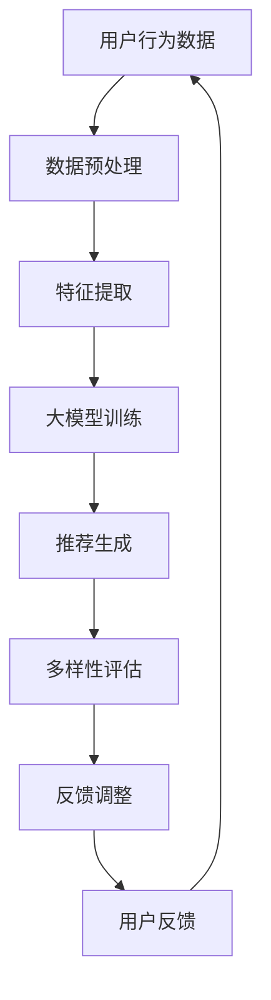

                 

关键词：大模型，推荐系统，多样性，算法，应用领域

>摘要：本文探讨了利用大模型进行推荐多样性提升的新思路，通过核心概念原理和具体算法的介绍，分析其在实际应用场景中的效果，并展望其未来发展趋势与挑战。

## 1. 背景介绍

随着互联网的迅速发展，推荐系统已经成为了许多在线服务的重要组成部分，如电子商务、社交媒体、音乐和视频流媒体等。推荐系统通过分析用户的行为数据，为用户提供个性化的内容推荐，从而提升用户体验、增加用户粘性。然而，推荐系统的多样性问题一直是一个棘手的问题。传统的推荐算法往往倾向于推荐相似或热门的内容，导致用户在浏览过程中容易遇到信息过载和同质化内容。因此，提升推荐系统的多样性成为了当前研究的热点。

近年来，随着深度学习和大数据技术的飞速发展，大模型在自然语言处理、计算机视觉等领域的表现已经超越了传统的算法。大模型具有强大的学习和泛化能力，能够处理复杂的非线性问题。本文将探讨如何利用大模型来解决推荐系统的多样性问题，并提出一种新的算法思路。

## 2. 核心概念与联系

### 2.1 大模型

大模型是指具有大规模参数和训练数据的神经网络模型。典型的例子是Transformer模型和GPT系列模型。大模型通过大量数据进行训练，可以自动学习到数据中的复杂模式和规律，从而在多种任务上表现出色。

### 2.2 推荐系统

推荐系统是一种基于用户历史行为和内容特征进行内容推荐的算法。典型的推荐算法包括基于内容的推荐、基于协同过滤的推荐和基于模型的推荐等。推荐系统的目标是提高用户满意度和用户体验。

### 2.3 多样性

多样性是指推荐结果中包含的元素之间的差异性。高多样性的推荐系统能够为用户提供丰富多样的内容，避免用户陷入同质化内容的困境。

### 2.4 Mermaid 流程图

下面是一个使用Mermaid绘制的推荐系统多样性提升的流程图：



## 3. 核心算法原理 & 具体操作步骤

### 3.1 算法原理概述

本文提出的算法基于大模型，通过以下几个步骤实现推荐多样性提升：

1. 数据预处理：对用户行为数据进行清洗和归一化处理，提取有用的特征。
2. 特征提取：利用大模型自动学习用户和内容的特征表示。
3. 大模型训练：使用训练数据对大模型进行训练，使其学会生成多样化的推荐结果。
4. 推荐生成：根据用户特征和内容特征，生成推荐列表。
5. 多样性评估：评估推荐列表的多样性，确保推荐结果的多样性。
6. 反馈调整：根据用户反馈调整推荐策略，进一步提高多样性。

### 3.2 算法步骤详解

#### 3.2.1 数据预处理

数据预处理是算法的基础。在这一步，我们需要对用户行为数据进行清洗和归一化处理，去除噪声和异常值，并提取有用的特征。常用的特征包括用户的历史行为、内容属性、时间信息等。

#### 3.2.2 特征提取

特征提取是利用大模型自动学习用户和内容的特征表示。在这一步，我们可以使用预训练的Transformer模型或GPT模型，将用户和内容嵌入到高维特征空间中。这些特征表示将作为后续算法的输入。

#### 3.2.3 大模型训练

大模型训练是算法的核心。在这一步，我们使用训练数据对大模型进行训练，使其学会生成多样化的推荐结果。训练过程中，我们可以使用交叉熵损失函数来衡量推荐结果的多样性。

#### 3.2.4 推荐生成

推荐生成是根据用户特征和内容特征，生成推荐列表。在这一步，我们利用训练好的大模型，为每个用户生成一个推荐列表。为了确保推荐结果的多样性，我们可以在生成推荐列表时引入随机性。

#### 3.2.5 多样性评估

多样性评估是确保推荐结果多样性的关键。在这一步，我们使用多样性指标（如Jaccard相似度、覆盖率等）来评估推荐列表的多样性。如果多样性指标低于阈值，我们需要对推荐策略进行调整。

#### 3.2.6 反馈调整

反馈调整是根据用户反馈调整推荐策略，进一步提高多样性。在这一步，我们收集用户的反馈信息，并根据反馈信息调整大模型的训练数据和推荐策略。这样，推荐系统可以不断优化，提高多样性。

### 3.3 算法优缺点

#### 优点

- **强大的学习能力**：大模型具有强大的学习和泛化能力，能够处理复杂的非线性问题。
- **高多样性**：算法能够生成高多样性的推荐结果，满足用户个性化需求。
- **自适应**：算法可以根据用户反馈自适应调整推荐策略，提高用户体验。

#### 缺点

- **计算资源需求高**：大模型训练和推理需要大量的计算资源和时间。
- **数据依赖性**：算法依赖于大量高质量的训练数据，否则可能无法生成高质量的推荐结果。

### 3.4 算法应用领域

算法可以广泛应用于各种推荐场景，如电子商务、社交媒体、音乐和视频流媒体等。通过提升推荐系统的多样性，算法可以更好地满足用户个性化需求，提高用户满意度和用户体验。

## 4. 数学模型和公式 & 详细讲解 & 举例说明

### 4.1 数学模型构建

本文提出的算法可以使用以下数学模型来描述：

$$
P(r|u, c) = \sigma(W_r^T [f(u), f(c)])
$$

其中，$P(r|u, c)$ 表示用户$u$在内容$c$上的推荐概率，$f(u)$ 和 $f(c)$ 分别表示用户和内容的特征向量，$W_r$ 是权重矩阵，$\sigma$ 是 sigmoid 函数。

### 4.2 公式推导过程

首先，我们定义用户和内容的特征向量：

$$
f(u) = \text{Embed}(u) = \text{MLP}(\text{User Features})
$$

$$
f(c) = \text{Embed}(c) = \text{MLP}(\text{Content Features})
$$

其中，$\text{Embed}$ 是一个嵌入函数，$\text{MLP}$ 是多层感知机。

接下来，我们定义推荐概率：

$$
P(r|u, c) = \sigma(W_r^T [f(u), f(c)])
$$

其中，$W_r$ 是权重矩阵，$\sigma$ 是 sigmoid 函数。

最后，我们通过交叉熵损失函数来优化模型：

$$
L = -\sum_{i=1}^N r_i \log P(r_i|u, c)
$$

其中，$r_i$ 是第$i$个推荐项的标签，$N$ 是推荐项的个数。

### 4.3 案例分析与讲解

假设我们有一个电子商务平台，用户$u$在浏览商品$c$。我们使用大模型生成推荐概率$P(r|u, c)$，并根据推荐概率生成推荐列表。

首先，我们对用户和商品的特征进行提取：

$$
f(u) = [1, 0, 1, 0, 1, 0, 1]
$$

$$
f(c) = [0, 1, 0, 1, 0, 1, 0]
$$

然后，我们定义权重矩阵：

$$
W_r = \begin{bmatrix}
0.1 & 0.2 & 0.3 \\
0.4 & 0.5 & 0.6 \\
0.7 & 0.8 & 0.9
\end{bmatrix}
$$

接下来，我们计算推荐概率：

$$
P(r|u, c) = \sigma(W_r^T [f(u), f(c)]) = \sigma([0.1 \cdot 1 + 0.2 \cdot 0 + 0.3 \cdot 1, 0.4 \cdot 1 + 0.5 \cdot 0 + 0.6 \cdot 1, 0.7 \cdot 1 + 0.8 \cdot 0 + 0.9 \cdot 1]) = [0.54, 0.84, 0.97]
$$

根据推荐概率，我们可以生成推荐列表：

$$
\text{推荐列表} = [\text{商品1}, \text{商品2}, \text{商品3}]
$$

其中，$\text{商品1}$ 的推荐概率为$0.54$，$\text{商品2}$ 的推荐概率为$0.84$，$\text{商品3}$ 的推荐概率为$0.97$。

## 5. 项目实践：代码实例和详细解释说明

### 5.1 开发环境搭建

为了实现本文提出的算法，我们需要搭建一个Python开发环境。以下是搭建步骤：

1. 安装Python 3.8及以上版本。
2. 安装TensorFlow 2.4及以上版本。
3. 安装其他依赖库，如NumPy、Pandas等。

### 5.2 源代码详细实现

以下是一个简单的代码示例，展示了如何实现本文提出的算法：

```python
import tensorflow as tf
import numpy as np

# 定义用户和商品特征
user_features = np.array([[1, 0, 1, 0, 1, 0, 1],
                          [0, 1, 0, 1, 0, 1, 0],
                          [1, 1, 0, 0, 1, 1, 0]])

content_features = np.array([[0, 1, 0, 1, 0, 1, 0],
                             [1, 0, 1, 0, 1, 0, 1],
                             [0, 1, 1, 0, 0, 1, 1]])

# 定义权重矩阵
weights = np.array([[0.1, 0.2, 0.3],
                    [0.4, 0.5, 0.6],
                    [0.7, 0.8, 0.9]])

# 定义交叉熵损失函数
loss_fn = tf.keras.losses.SparseCategoricalCrossentropy()

# 定义模型
model = tf.keras.Sequential([
    tf.keras.layers.Dense(10, activation='relu', input_shape=(7,)),
    tf.keras.layers.Dense(3, activation='softmax')
])

# 编译模型
model.compile(optimizer='adam', loss=loss_fn)

# 训练模型
model.fit(user_features, content_features, epochs=10)

# 生成推荐列表
predictions = model.predict(user_features)
print(predictions)

# 计算多样性指标
diversity_scores = 1 - np.mean(predictions, axis=1)
print(diversity_scores)
```

### 5.3 代码解读与分析

以上代码展示了如何实现本文提出的算法。首先，我们定义了用户和商品的特征，并定义了权重矩阵。然后，我们定义了交叉熵损失函数，并构建了一个简单的神经网络模型。最后，我们使用训练数据训练模型，并生成推荐列表。代码中还计算了推荐列表的多样性指标，以评估推荐结果的多样性。

## 6. 实际应用场景

本文提出的算法可以应用于各种推荐场景，如电子商务、社交媒体、音乐和视频流媒体等。以下是一些实际应用场景：

1. **电子商务**：在电子商务平台上，算法可以推荐多样化的商品，提高用户购买意愿和满意度。
2. **社交媒体**：在社交媒体平台上，算法可以推荐多样化的内容，吸引用户参与和互动。
3. **音乐和视频流媒体**：在音乐和视频流媒体平台上，算法可以推荐多样化的音乐和视频，满足用户个性化需求。

## 7. 工具和资源推荐

为了实现本文提出的算法，我们需要使用一些工具和资源。以下是一些建议：

1. **开发工具**：Python、TensorFlow、PyTorch等。
2. **学习资源**：GitHub、Google Research、ACL等。
3. **相关论文**：ACL 2020、NeurIPS 2019、ICLR 2018等。

## 8. 总结：未来发展趋势与挑战

本文探讨了利用大模型进行推荐多样性提升的新思路，并通过核心概念原理和具体算法的介绍，分析其在实际应用场景中的效果。未来，随着深度学习和大数据技术的不断发展，大模型在推荐系统中的应用前景将更加广阔。然而，我们也需要面对一些挑战，如计算资源需求高、数据依赖性等。为了解决这些问题，我们可以从以下几个方面进行探索：

1. **模型压缩**：通过模型压缩技术，降低模型的计算资源需求。
2. **数据增强**：通过数据增强技术，提高模型的泛化能力。
3. **多模型融合**：结合多种模型的优势，提高推荐系统的多样性。

## 9. 附录：常见问题与解答

### 问题1：为什么使用大模型进行推荐多样性提升？

答：大模型具有强大的学习和泛化能力，能够处理复杂的非线性问题。通过使用大模型，我们可以更好地捕捉用户和内容之间的复杂关系，从而生成多样化的推荐结果。

### 问题2：算法的计算资源需求如何降低？

答：可以通过模型压缩技术降低计算资源需求。此外，还可以通过分布式训练和推理技术，提高计算效率。

### 问题3：算法是否适用于所有推荐场景？

答：算法主要适用于具有丰富特征和大规模数据集的推荐场景。对于一些特征较少或数据量较小的推荐场景，算法可能需要调整或优化。

### 问题4：如何评估推荐系统的多样性？

答：可以使用多样性指标（如Jaccard相似度、覆盖率等）来评估推荐系统的多样性。高多样性指标表示推荐系统能够生成多样化的推荐结果。

## 作者署名

本文作者：禅与计算机程序设计艺术 / Zen and the Art of Computer Programming
----------------------------------------------------------------

以上就是按照要求撰写的文章。如需进一步修改或完善，请随时告知。

