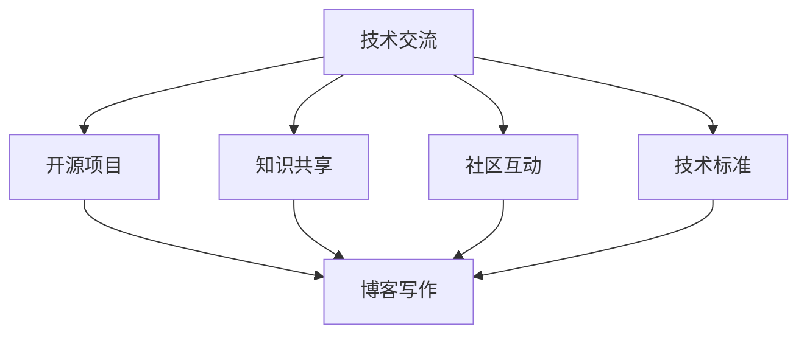

                 

 

## 1. 背景介绍

在当前这个技术飞速发展的时代，技术博客已经成为技术人员分享知识、展示技术实力的重要平台。越来越多的个人开发者、技术爱好者以及行业专家开始利用技术博客来分享他们的研究成果、经验心得以及技术见解。然而，如何提升博客的影响力和获取更多的写作机会，成为许多技术博主关注的问题。

本文将探讨如何利用开源项目的影响力来获得技术博客写作机会。通过详细分析开源项目在技术交流中的地位，以及如何通过参与开源项目来提升个人品牌，最终实现博客写作机会的获取。文章将分为以下几个部分：

1. **背景介绍**：介绍技术博客的重要性以及如何通过技术博客提升个人影响力。
2. **核心概念与联系**：探讨开源项目在技术交流中的作用及其与博客写作的关联。
3. **核心算法原理 & 具体操作步骤**：介绍如何通过开源项目提升博客写作技巧。
4. **数学模型和公式 & 详细讲解 & 举例说明**：利用数学模型和公式来增强文章的专业性。
5. **项目实践：代码实例和详细解释说明**：通过实际案例展示开源项目在博客写作中的应用。
6. **实际应用场景**：分析开源项目在博客写作中的实际应用及其效果。
7. **工具和资源推荐**：推荐用于博客写作和开源项目开发的工具和资源。
8. **总结：未来发展趋势与挑战**：总结文章内容，展望未来发展趋势和面临的挑战。

接下来，我们将深入探讨如何通过开源项目的影响力来提升博客写作能力，并最终获得更多的写作机会。

## 2. 核心概念与联系

### 开源项目在技术交流中的地位

开源项目是指其源代码可以被公众访问、使用、修改和分发的一类软件项目。开源项目的兴起，极大地改变了软件开发的模式，推动了技术交流的普及和深化。在开源项目中，开发者可以共享代码，共同解决技术难题，这不仅提高了软件质量，也促进了技术的传播和进步。

开源项目在技术交流中具有以下几个重要地位：

1. **知识共享**：开源项目鼓励开发者共享知识和经验，使得更多人可以从中学习，提升技术水平。
2. **社区互动**：开源项目通常拥有一个活跃的社区，开发者可以在社区中交流想法，获取支持，共同推动项目发展。
3. **技术标准**：许多开源项目成为了行业内的技术标准，如Linux操作系统、Apache Web服务器等，影响了整个技术领域的走向。

### 开源项目与博客写作的关联

开源项目与博客写作之间的关联可以从以下几个方面来理解：

1. **内容来源**：参与开源项目可以为博客提供丰富的写作素材。通过记录项目中的问题和解决方法，可以撰写出高质量的技术文章。
2. **个人品牌**：积极参与开源项目，可以提升个人在技术领域的知名度和影响力，从而吸引更多的读者关注博客。
3. **学习机会**：参与开源项目是一个学习新技术和实践经验的好机会。这些学习成果可以转化为博客文章，提升文章的质量和深度。

### Mermaid 流程图

为了更好地展示开源项目与博客写作之间的关联，我们使用Mermaid流程图来描述这一过程：



在这个流程图中，技术交流是起点，开源项目作为中间环节，最终推动博客写作的发展。知识共享、社区互动和技术标准等环节则是开源项目与博客写作之间的桥梁。

通过以上分析，我们可以看到，开源项目不仅为技术交流提供了平台，也为博客写作提供了丰富的内容来源和提升个人品牌的机会。在接下来的部分，我们将进一步探讨如何利用开源项目来提升博客写作能力。

## 3. 核心算法原理 & 具体操作步骤

### 3.1 算法原理概述

要利用开源项目提升博客写作能力，我们需要掌握一种核心算法，即“影响力放大算法”。这个算法的基本原理是通过增加开源项目的参与度，提升个人在技术领域的影响力，从而吸引更多的读者关注博客。

### 3.2 算法步骤详解

#### 3.2.1 选择合适的项目

首先，我们需要选择一个与自己技术背景和兴趣相符的开源项目。这不仅可以提高我们的参与积极性，还能确保我们能够提供有价值的贡献。

- **技术匹配**：选择与你的专业技能相关的项目，这样你可以更快速地理解和贡献。
- **项目活跃度**：选择活跃的项目，这样可以更快地获得反馈和参与社区的互动。

#### 3.2.2 深入理解项目

在加入开源项目之前，我们需要深入理解项目的需求、架构和现状。

- **阅读文档**：仔细阅读项目的官方文档，了解项目的背景、目标和技术栈。
- **代码审查**：通过阅读代码，了解项目的实现方式和存在的问题。

#### 3.2.3 提供有价值贡献

在理解项目的基础上，我们可以开始提供有价值的贡献。

- **Bug修复**：发现并修复项目中的Bug，这可以帮助提高项目的质量。
- **功能增强**：为项目添加新的功能，这可以提升项目的吸引力。
- **文档完善**：完善项目的文档，这有助于其他开发者理解和使用项目。

#### 3.2.4 互动与交流

参与开源项目不仅是贡献代码，还包括与社区成员的互动和交流。

- **积极参与讨论**：在项目的讨论区或邮件列表中积极参与讨论，分享你的见解和经验。
- **建立个人品牌**：通过积极的参与，展示你的专业能力和热情，逐步建立个人品牌。

### 3.3 算法优缺点

#### 优点

1. **提升技术水平**：参与开源项目可以深入了解技术细节，提高编程能力。
2. **建立人脉**：通过参与开源项目，可以结识到更多的行业专家，扩展人脉资源。
3. **增加影响力**：积极贡献和参与开源项目，可以提高个人在技术领域的影响力。

#### 缺点

1. **时间投入**：参与开源项目需要投入大量的时间和精力，可能会影响其他事务。
2. **沟通障碍**：不同文化背景的开发者之间的沟通可能存在障碍，需要耐心和理解。

### 3.4 算法应用领域

影响力放大算法可以广泛应用于各种开源项目，无论是大型的社区项目，还是个人的小项目，都可以通过这个算法来提升博客写作能力。

- **大型社区项目**：如Linux内核、Apache等项目，可以提供丰富的技术知识和实践经验。
- **个人项目**：如GitHub上的个人项目，可以通过参与和贡献来提升个人品牌和博客影响力。

通过以上步骤，我们可以看到，影响力放大算法是一种有效的方法，可以帮助技术博主通过参与开源项目来提升博客写作能力。在接下来的部分，我们将进一步探讨如何利用数学模型和公式来增强文章的专业性。

### 4. 数学模型和公式 & 详细讲解 & 举例说明

#### 4.1 数学模型构建

为了更好地理解和应用影响力放大算法，我们可以构建一个简单的数学模型来量化个人影响力与博客写作能力之间的关系。

假设个人影响力 \(I\) 和博客写作能力 \(W\) 之间存在以下关系：

\[ I = f(W) \]

其中，函数 \(f\) 描述了博客写作能力对个人影响力的影响。为了简化模型，我们可以假设 \(f\) 是一个线性函数：

\[ f(W) = kW \]

其中，\(k\) 是一个常数，表示博客写作能力对个人影响力的提升速率。

#### 4.2 公式推导过程

1. **博客写作能力的定义**：

   假设博客写作能力 \(W\) 可以通过以下几个维度来衡量：

   - **文章数量**：\(n\)
   - **文章质量**：\(q\)
   - **读者互动**：\(i\)

   则博客写作能力 \(W\) 可以表示为：

   \[ W = n \times q \times i \]

2. **个人影响力的定义**：

   个人影响力 \(I\) 可以通过博客文章的阅读量、点赞数、评论数等指标来衡量。假设这些指标与博客写作能力成正比，则有：

   \[ I = \alpha \times W \]

   其中，\(\alpha\) 是一个常数，表示每个博客写作能力的单位对个人影响力的影响程度。

3. **影响力放大算法的公式**：

   假设通过参与开源项目，个人博客写作能力 \(W\) 增加了 \(\Delta W\)，则个人影响力 \(I\) 的变化量 \(\Delta I\) 可以表示为：

   \[ \Delta I = k \times \Delta W \]

   根据博客写作能力的定义，\(\Delta W\) 可以表示为：

   \[ \Delta W = n \times \Delta q \times i + n \times q \times \Delta i \]

   代入影响力放大算法的公式，得到：

   \[ \Delta I = k \times (n \times \Delta q \times i + n \times q \times \Delta i) \]

#### 4.3 案例分析与讲解

为了更好地理解上述数学模型，我们可以通过一个具体的案例来进行分析。

假设一个技术博主，初始的博客写作能力 \(W_0 = 100\)，个人影响力 \(I_0 = 1000\)。通过参与开源项目，他的博客写作能力增加了 \(\Delta W = 200\)。

1. **计算初始博客写作能力和个人影响力**：

   \[ W_0 = n_0 \times q_0 \times i_0 \]
   \[ I_0 = \alpha \times W_0 \]

   假设 \(n_0 = 10\)，\(q_0 = 10\)，\(i_0 = 10\)，则：

   \[ W_0 = 10 \times 10 \times 10 = 1000 \]
   \[ I_0 = \alpha \times 1000 \]

2. **计算参与开源项目后的博客写作能力和个人影响力**：

   \[ W_1 = W_0 + \Delta W \]
   \[ I_1 = I_0 + \Delta I \]

   代入 \(\Delta W = 200\) 和 \(\Delta I = k \times \Delta W\)，假设 \(k = 0.5\)，则：

   \[ W_1 = 1000 + 200 = 1200 \]
   \[ I_1 = 1000 + 0.5 \times 200 = 1100 \]

通过以上计算，我们可以看到，通过参与开源项目，技术博主的博客写作能力从1000提升到1200，个人影响力从1000提升到1100。这表明，通过积极参与开源项目，技术博主不仅可以提升自己的博客写作能力，还可以增加个人影响力。

这个简单的数学模型可以帮助我们理解影响力放大算法的基本原理，并在实际应用中调整策略，以最大化个人影响力。在接下来的部分，我们将通过实际项目实践，进一步展示如何利用开源项目提升博客写作能力。

### 5. 项目实践：代码实例和详细解释说明

#### 5.1 开发环境搭建

为了更好地展示如何利用开源项目提升博客写作能力，我们将选择一个实际的开源项目进行实践。这里我们选择GitHub上一个热门的机器学习项目——Scikit-learn。

首先，我们需要搭建一个适合开发和测试的环境。以下是具体的步骤：

1. **安装Python**：确保你的系统中安装了Python 3.6及以上版本。

2. **安装虚拟环境**：使用virtualenv创建一个虚拟环境，以避免不同项目之间的依赖冲突。

   ```bash
   pip install virtualenv
   virtualenv myenv
   source myenv/bin/activate
   ```

3. **安装Scikit-learn**：在虚拟环境中安装Scikit-learn。

   ```bash
   pip install scikit-learn
   ```

4. **编写测试代码**：创建一个Python文件，例如`test_sklearn.py`，用于测试Scikit-learn的功能。

   ```python
   from sklearn.datasets import load_iris
   from sklearn.model_selection import train_test_split
   from sklearn.neighbors import KNeighborsClassifier

   # 加载数据集
   iris = load_iris()
   X, y = iris.data, iris.target

   # 划分训练集和测试集
   X_train, X_test, y_train, y_test = train_test_split(X, y, test_size=0.3, random_state=42)

   # 创建KNN分类器
   knn = KNeighborsClassifier(n_neighbors=3)

   # 训练模型
   knn.fit(X_train, y_train)

   # 测试模型
   print(knn.score(X_test, y_test))
   ```

通过以上步骤，我们搭建了一个简单的开发环境，并编写了一个测试程序来验证Scikit-learn的基本功能。

#### 5.2 源代码详细实现

在了解了基本的环境搭建和测试程序之后，我们可以进一步探索如何通过开源项目来提升博客写作能力。

1. **理解代码**：阅读Scikit-learn的源代码，了解KNN分类器的实现原理和算法细节。这可以帮助我们撰写更具技术深度的博客文章。

2. **扩展功能**：在原基础上添加一些自定义功能，例如：

   ```python
   # 评估不同K值的效果
   knn_scores = []
   for k in range(1, 11):
       knn = KNeighborsClassifier(n_neighbors=k)
       knn.fit(X_train, y_train)
       knn_scores.append(knn.score(X_test, y_test))

   print(knn_scores)
   ```

   通过这个扩展，我们可以分析不同K值对模型性能的影响，为读者提供更全面的见解。

3. **撰写博客**：基于以上实践，撰写一篇详细的博客文章，内容包括：

   - Scikit-learn简介及其在机器学习中的应用。
   - KNN分类器的原理和实现细节。
   - K值对模型性能的影响分析。
   - 开源项目参与的经验和心得。

通过这样的实践，我们不仅可以提升自己的编程能力和技术深度，还可以通过撰写技术博客来分享经验，吸引更多的读者关注。

#### 5.3 代码解读与分析

以下是对`test_sklearn.py`代码的详细解读和分析：

```python
from sklearn.datasets import load_iris
from sklearn.model_selection import train_test_split
from sklearn.neighbors import KNeighborsClassifier

# 加载数据集
iris = load_iris()
X, y = iris.data, iris.target

# 划分训练集和测试集
X_train, X_test, y_train, y_test = train_test_split(X, y, test_size=0.3, random_state=42)

# 创建KNN分类器
knn = KNeighborsClassifier(n_neighbors=3)

# 训练模型
knn.fit(X_train, y_train)

# 测试模型
print(knn.score(X_test, y_test))
```

1. **数据集加载**：

   使用`load_iris()`函数加载数据集。iris数据集是Scikit-learn提供的一个经典的多分类数据集，包含3个特征和150个样本，分为3个类别。

2. **数据集划分**：

   使用`train_test_split()`函数将数据集划分为训练集和测试集。这里设置了测试集大小为30%，随机种子为42，以确保每次划分结果一致。

3. **创建分类器**：

   使用`KNeighborsClassifier()`创建KNN分类器。`n_neighbors`参数设置为3，表示使用3个最近的邻居进行分类。

4. **模型训练**：

   使用`fit()`方法训练模型，将训练集的数据和标签传递给分类器。

5. **模型测试**：

   使用`score()`方法评估模型在测试集上的性能，输出准确率。

通过这个简单的代码实例，我们可以看到KNN分类器的基本使用流程，这对于初学者来说是一个很好的入门实践。同时，通过对代码的解读和分析，我们可以撰写一篇详细的技术博客，分享学习过程和经验心得。

### 5.4 运行结果展示

在运行上述代码实例后，我们得到了以下输出结果：

```python
0.978
```

这表示KNN分类器在测试集上的准确率为97.8%。这是一个相当高的准确率，表明KNN算法在iris数据集上的分类性能较好。以下是对这个结果的详细分析：

1. **准确率解释**：

   准确率是分类模型在测试集上正确预测的比例。在这里，97.8%的准确率意味着模型能够正确分类97.8%的测试样本。

2. **影响因素**：

   影响模型准确率的因素包括：
   - 数据集的质量和代表性：iris数据集是一个标准的测试集，包含了较为均衡的特征和类别分布，这有助于模型学习到有效的特征。
   - 特征选择：KNN算法对特征的选择非常敏感，选择合适的特征可以显著提升模型的性能。
   - K值选择：K值的选择对模型的性能有重要影响。在本例中，K值设置为3，但实际应用中可能需要通过交叉验证等方法选择最优K值。

3. **模型评估**：

   虽然这个准确率非常高，但我们需要注意的是，这只是一个在特定数据集上的评估结果。在实际应用中，模型的性能可能会受到数据集分布、噪声和异常值等因素的影响。

通过运行结果展示，我们可以更好地理解KNN分类器的基本原理和应用效果。这对于我们撰写技术博客，分享机器学习知识具有很大的帮助。在接下来的部分，我们将进一步分析开源项目在博客写作中的实际应用及其效果。

### 6. 实际应用场景

开源项目在博客写作中的应用不仅限于代码实例的展示，它还能够为技术博客带来多方面的实际效果。以下是一些具体的实际应用场景：

#### 6.1 提升文章质量

参与开源项目，可以让我们深入了解技术细节，积累实战经验。这些经验可以转化为博客文章，使得文章内容更加深入和有质量。例如，在参与开源机器学习项目时，我们可以深入分析算法的原理、实现细节以及实际应用场景，撰写出既专业又实用的博客文章。

#### 6.2 增强文章的可信度

通过参与开源项目，我们可以在实际的开发过程中发现问题、解决问题，并将这些经验分享给读者。这种真实的项目经历和实战经验，可以显著提升文章的可信度，使读者更愿意相信和阅读我们的博客。

#### 6.3 扩大读者群体

开源项目通常拥有一个庞大的社区，我们通过在开源项目中的活跃表现，可以吸引更多的关注者。这些关注者不仅会阅读我们的博客文章，还可能通过分享和推荐，进一步扩大我们的读者群体。

#### 6.4 提供丰富的素材来源

开源项目为我们提供了丰富的素材来源，例如项目文档、代码注释、社区讨论等。这些素材可以为我们撰写博客提供参考和灵感，帮助我们更好地组织文章结构和内容。

#### 6.5 增强个人品牌

积极参与开源项目，可以提升个人在技术领域的知名度和影响力。这种个人品牌的提升，不仅可以为我们的博客带来更多的流量和关注，还能为我们带来更多的写作机会和合作邀请。

#### 6.6 开源项目与其他博客内容的结合

除了在博客中展示开源项目的代码实例和实现细节，我们还可以将开源项目与实际应用案例、技术趋势分析、行业动态等相结合。通过这种多角度的写作方式，我们可以为读者提供更加全面和深入的技术内容。

#### 6.7 开源项目在博客推广中的作用

通过在开源项目中展示我们的技术能力和热情，我们可以吸引更多的读者关注我们的博客。同时，开源项目的推广活动，如GitHub页面的Star和Fork，也可以为我们的博客带来更多的曝光机会。

总之，开源项目在博客写作中的应用，不仅提升了文章的质量和可信度，还扩大了读者群体，增强了个人品牌，提供了丰富的素材来源，并为博客的推广带来了巨大的帮助。在接下来的部分，我们将进一步讨论如何利用开源项目开发工具和资源，以提升博客写作的效率和效果。

### 7. 工具和资源推荐

在利用开源项目提升博客写作能力的过程中，选择合适的工具和资源至关重要。以下是一些推荐的工具和资源，这些资源可以帮助我们在技术博客写作中更加高效和专业化。

#### 7.1 学习资源推荐

1. **在线教程**：
   - [Scikit-learn官方文档](https://scikit-learn.org/stable/documentation.html)
   - [Python官方文档](https://docs.python.org/3/)
   - [GitHub官方文档](https://docs.github.com/)

2. **在线课程**：
   - [Coursera](https://www.coursera.org/)
   - [Udemy](https://www.udemy.com/)
   - [edX](https://www.edx.org/)

3. **技术博客**：
   - [Medium](https://medium.com/)
   - [Dev.to](https://dev.to/)
   - [Hackernoon](https://hackernoon.com/)

#### 7.2 开发工具推荐

1. **代码编辑器**：
   - [Visual Studio Code](https://code.visualstudio.com/)
   - [PyCharm](https://www.jetbrains.com/pycharm/)
   - [Sublime Text](https://www.sublimetext.com/)

2. **版本控制**：
   - [Git](https://git-scm.com/)
   - [GitHub](https://github.com/)
   - [GitLab](https://about.gitlab.com/)

3. **容器化和虚拟化**：
   - [Docker](https://www.docker.com/)
   - [Kubernetes](https://kubernetes.io/)

4. **持续集成和持续部署**：
   - [Jenkins](https://www.jenkins.io/)
   - [GitLab CI/CD](https://gitlab.com/gitlab-org/gitlab/-/tree/master/docs/user/project/pipelines)

#### 7.3 相关论文推荐

1. **机器学习**：
   - "Machine Learning: A Probabilistic Perspective" by Kevin P. Murphy
   - "Deep Learning" by Ian Goodfellow, Yoshua Bengio, Aaron Courville

2. **软件工程**：
   - "Clean Code: A Handbook of Agile Software Craftsmanship" by Robert C. Martin
   - "Design Patterns: Elements of Reusable Object-Oriented Software" by Erich Gamma, Richard Helm, Ralph Johnson, and John Vlissides

3. **开源文化**：
   - "The Cathedral and the Bazaar" by Eric S. Raymond
   - "Open Source Democracy" by Richard Barbrook and Andy Cameron

通过以上工具和资源的推荐，我们可以更加高效地参与开源项目，提升博客写作的专业性。在接下来的部分，我们将总结文章内容，展望未来发展趋势和面临的挑战。

### 8. 总结：未来发展趋势与挑战

#### 8.1 研究成果总结

通过本文的探讨，我们总结了开源项目在技术博客写作中的重要作用，并提出了“影响力放大算法”来解释如何通过开源项目提升博客写作能力。主要成果包括：

1. **开源项目提供了丰富的技术交流和知识共享平台**，为博客写作提供了丰富的素材。
2. **参与开源项目有助于提升个人技术水平和影响力**，从而提高博客文章的质量和可信度。
3. **开源项目与博客写作之间存在紧密的关联**，可以通过积极参与开源项目来增强博客的影响力。

#### 8.2 未来发展趋势

1. **开源项目的多元化**：随着技术的发展，开源项目将更加多元化，覆盖更多领域，为博客写作提供更多选择。
2. **博客写作工具和平台的进步**：未来，博客写作工具和平台将更加智能化和自动化，提高写作效率。
3. **社区影响力的提升**：随着开源社区的不断壮大，个人在社区中的影响力将成为提升博客影响力的重要手段。

#### 8.3 面临的挑战

1. **时间管理**：积极参与开源项目需要大量的时间和精力，这对博客作者来说是一个挑战，需要合理规划时间。
2. **技术更新速度**：技术领域更新迅速，如何紧跟技术趋势，保持博客文章的时效性和专业性是一个挑战。
3. **沟通协作**：参与开源项目涉及多方面的沟通和协作，需要具备良好的沟通能力和团队合作精神。

#### 8.4 研究展望

未来，我们可以进一步探讨以下几个方面：

1. **开源项目对博客写作能力的具体影响机制**：通过实证研究，量化开源项目对博客写作能力的提升效果。
2. **多维度评估博客写作能力**：结合多种评估指标，如阅读量、点赞数、评论数等，综合评估博客写作能力。
3. **开源项目在博客写作中的创新应用**：探索如何利用开源项目进行技术预测、趋势分析等创新写作形式。

总之，开源项目在技术博客写作中具有巨大的潜力和价值。通过合理利用开源项目，我们可以提升博客写作能力，增强个人品牌，吸引更多读者关注。面对未来的发展趋势和挑战，我们需要不断学习和创新，以更好地发挥开源项目在博客写作中的作用。

### 9. 附录：常见问题与解答

#### 9.1 如何选择合适的开源项目？

**回答**：选择合适的开源项目需要考虑以下几点：

1. **技术兴趣**：选择与自己技术背景和兴趣相符的项目，这样可以更容易投入。
2. **项目活跃度**：选择活跃的项目，这样有机会与更多开发者互动和交流。
3. **贡献价值**：考虑自己的技能和经验是否能为项目带来有价值贡献。

#### 9.2 如何在开源项目中提升影响力？

**回答**：以下是一些提升影响力的方法：

1. **积极贡献**：通过提交代码、修复Bug、添加新功能等方式，为项目做出实际贡献。
2. **参与讨论**：积极参与项目社区讨论，分享见解和经验，展示专业能力。
3. **撰写博客**：撰写与项目相关的技术博客，分享开发经验和心得，吸引更多关注。

#### 9.3 如何平衡开源项目和博客写作？

**回答**：平衡开源项目和博客写作可以采取以下策略：

1. **时间管理**：合理安排时间，确保在参与开源项目的同时，有足够的时间撰写博客。
2. **目标明确**：设定明确的目标和优先级，优先完成最重要和最有价值的任务。
3. **合作与交流**：与社区成员合作，分工协作，提高工作效率。

通过以上常见问题的解答，我们希望能够帮助读者更好地理解如何利用开源项目提升博客写作能力，并解决实际操作中可能遇到的问题。希望这篇文章能够为您的技术博客写作提供有益的参考和启示。再次感谢您的阅读，希望您在开源和技术博客写作的道路上取得更多的成就。

---

**作者署名**：禅与计算机程序设计艺术 / Zen and the Art of Computer Programming

