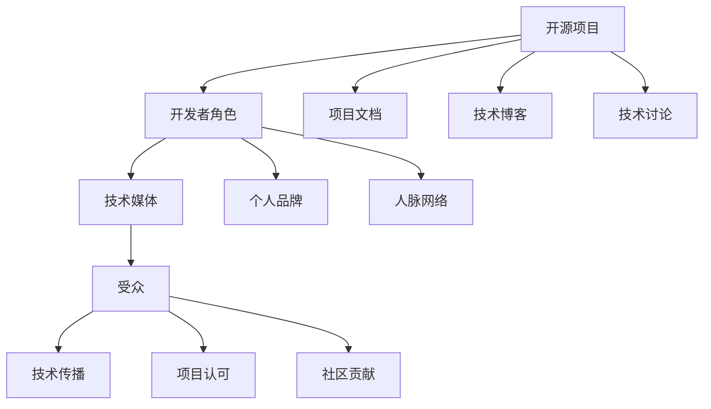

                 

### 1. 背景介绍

在当今快速发展的技术时代，开源项目已经成为软件开发的重要组成部分。许多企业和开发者选择参与开源项目，以获取技术灵感、提高开发效率、建立个人品牌和扩展人脉网络。然而，仅仅参与开源项目还不足以获得技术媒体的广泛关注。为了在众多开源项目中脱颖而出，开发者需要巧妙地利用开源影响力，通过各种渠道获得技术媒体的曝光机会。

本文将探讨如何利用开源影响力获得技术媒体曝光机会。我们将首先介绍开源项目的概念、意义以及开发者在开源社区中的角色。接着，我们将分析技术媒体对开源项目的关注度以及它们对开源项目曝光的影响。然后，我们将详细讨论如何提升开源项目的曝光度，包括优化项目文档、撰写技术博客、参与技术讨论等策略。最后，我们将分享一些成功案例，并提供一些建议和资源，帮助开发者更好地利用开源影响力获得技术媒体曝光机会。

### 2. 核心概念与联系

在深入探讨如何提升开源项目的曝光度之前，我们需要了解一些核心概念和联系。以下是一个Mermaid流程图，展示了开源项目、开发者、技术媒体和受众之间的关系。



#### 开源项目（A）

开源项目是指那些源代码公开、允许用户自由查看、修改和分享的软件项目。开源项目具有共享、协作和创新的特点，有助于促进技术发展和知识传播。参与开源项目可以提升开发者的技术水平、扩展技能范围，同时也有助于建立个人品牌和拓展人脉网络。

#### 开发者角色（B）

开发者是开源项目的核心成员，他们负责编写代码、修复bug、优化项目功能以及维护项目文档。开发者通过参与开源项目，不仅能够提高自己的技术水平，还能在技术社区中获得认可和尊重。

#### 技术媒体（C）

技术媒体是指那些专注于报道和传播技术新闻、分析和评论的媒体平台。技术媒体对开源项目关注度较高，因为开源项目往往具有创新性和影响力。技术媒体可以通过报道开源项目，为开发者提供曝光机会，同时也有助于提升项目的知名度和认可度。

#### 受众（D）

受众是指那些关注技术新闻、关注开源项目和技术发展的读者和观众。受众通过技术媒体了解开源项目，对项目的发展和创新产生兴趣，并在一定程度上影响项目的传播和认可。

#### 项目文档（E）

项目文档是开源项目的重要组成部分，包括用户手册、技术文档、API文档等。良好的项目文档可以帮助开发者更好地理解和使用项目，同时也有助于吸引技术媒体的关注。

#### 技术博客（F）

技术博客是开发者分享技术心得、展示项目成果的重要渠道。通过撰写技术博客，开发者可以吸引更多受众关注项目，并与其他开发者进行技术交流和合作。

#### 技术讨论（G）

技术讨论是指在开源社区中进行的关于项目技术、问题和解决方案的讨论。积极参与技术讨论有助于提升项目的活跃度，同时也能吸引技术媒体的关注。

#### 个人品牌（H）

个人品牌是指开发者通过自己的技术能力和专业知识在技术社区中建立的声誉和影响力。良好的个人品牌有助于开发者获得更多的机会和认可。

#### 人脉网络（I）

人脉网络是指开发者通过参与开源项目和社区活动建立的人际关系网络。人脉网络有助于开发者获取技术资源、合作机会和职业发展。

#### 技术传播（J）

技术传播是指通过技术媒体、博客、社区等渠道传播技术知识和创新成果。技术传播有助于提高项目的知名度和认可度，吸引更多的开发者参与。

#### 项目认可（K）

项目认可是指技术社区和受众对开源项目的认可和赞赏。项目认可有助于提升项目的曝光度和影响力，吸引更多的开发者参与和维护。

#### 社区贡献（L）

社区贡献是指开发者通过开源项目为社区做出的贡献，包括代码提交、bug修复、文档编写等。社区贡献有助于提升开发者的声誉和影响力。

通过以上Mermaid流程图，我们可以清晰地看到开源项目、开发者、技术媒体和受众之间的联系。接下来，我们将深入探讨如何利用这些联系提升开源项目的曝光度。

### 3. 核心算法原理 & 具体操作步骤

在提升开源项目的曝光度方面，核心算法原理和具体操作步骤起着至关重要的作用。以下是一个详细的算法原理和操作步骤，帮助开发者更好地利用开源影响力获得技术媒体曝光机会。

#### 3.1 算法原理概述

该算法的核心思想是通过一系列策略和技巧，提升开源项目的曝光度和影响力。具体来说，该算法包括以下几个方面：

1. **项目文档优化**：通过撰写高质量的项目文档，提高项目的可读性和可维护性，吸引开发者关注。
2. **技术博客撰写**：通过撰写技术博客，分享项目的技术细节和开发经验，吸引技术媒体和受众关注。
3. **技术讨论参与**：在开源社区中积极参与技术讨论，展示项目优势和潜力，提升项目的知名度和认可度。
4. **社交媒体推广**：利用社交媒体平台，扩大项目的传播范围，吸引更多开发者关注和参与。
5. **技术媒体合作**：主动与技术媒体建立联系，寻求报道和合作机会，提升项目的曝光度。

#### 3.2 算法步骤详解

1. **项目文档优化**

   - **文档结构**：确保项目文档结构清晰，包括概述、安装教程、使用方法、API文档等。
   - **语言表达**：使用简洁明了的语言，避免使用专业术语或缩写，便于开发者阅读和理解。
   - **示例代码**：提供示例代码，帮助开发者更好地理解项目功能和使用方法。
   - **持续更新**：定期更新项目文档，确保其与项目实际进展保持一致。

2. **技术博客撰写**

   - **选题策划**：选择与项目相关且具有实际应用价值的技术主题，如项目开发过程中的关键技术、性能优化方案等。
   - **内容撰写**：撰写高质量的技术博客，包括技术背景、原理分析、实现步骤、性能评估等。
   - **图片和图表**：合理使用图片和图表，使文章更具可读性和说服力。
   - **推广分享**：将技术博客分享到技术社区、社交媒体等平台，扩大传播范围。

3. **技术讨论参与**

   - **选择社区**：选择与项目相关的技术社区，如GitHub、Stack Overflow等。
   - **积极回答**：积极参与社区讨论，回答开发者的问题，分享项目经验和技巧。
   - **提出问题**：在适当的时候提出项目相关的问题，吸引更多开发者关注。
   - **参与活动**：参与社区组织的活动，如黑客马拉松、技术讲座等，展示项目成果。

4. **社交媒体推广**

   - **平台选择**：选择合适的社交媒体平台，如Twitter、LinkedIn、GitHub等。
   - **定期更新**：定期发布项目进展、技术博客、代码片段等，保持活跃度。
   - **互动交流**：与关注项目的开发者互动，回答问题，建立良好的人际关系。
   - **联合推广**：与其他开发者或项目合作，共同推广项目，扩大影响力。

5. **技术媒体合作**

   - **筛选媒体**：筛选具有较高影响力和受众基础的技术媒体，如InfoQ、CNBlogs等。
   - **主动联系**：主动与技术媒体联系，介绍项目优势和亮点，寻求报道和合作机会。
   - **提供素材**：提供项目相关的图片、视频、代码片段等素材，便于媒体编辑使用。
   - **跟踪反馈**：关注技术媒体的报道进展，及时反馈问题和建议，确保报道质量。

#### 3.3 算法优缺点

**优点：**

1. **提升项目曝光度**：通过一系列策略和技巧，提高项目的曝光度和影响力，吸引更多开发者关注和参与。
2. **增强社区活跃度**：积极参与社区讨论，提升项目在技术社区中的活跃度和认可度。
3. **扩大传播范围**：通过社交媒体和技术媒体的合作，扩大项目的传播范围，吸引更多受众关注。

**缺点：**

1. **时间成本较高**：需要投入大量时间和精力进行项目文档撰写、技术博客撰写、技术讨论参与等操作。
2. **效果难以量化**：虽然通过一系列操作可以提升项目曝光度，但具体效果难以量化，需要长期积累和观察。

#### 3.4 算法应用领域

该算法适用于各种开源项目，尤其是技术类开源项目，如编程语言、开发工具、数据库等。通过利用开源影响力，开发者可以吸引更多开发者关注和参与项目，提升项目的知名度和影响力。

### 4. 数学模型和公式 & 详细讲解 & 举例说明

在提升开源项目曝光度方面，数学模型和公式也起着重要作用。以下是一个详细的数学模型和公式，帮助开发者更好地理解和应用这些策略。

#### 4.1 数学模型构建

假设有一个开源项目，其曝光度可以用以下数学模型表示：

\[ E = f(P, D, S, C) \]

其中，\( E \) 表示项目曝光度，\( P \) 表示项目文档质量，\( D \) 表示技术博客撰写数量，\( S \) 表示社交媒体推广力度，\( C \) 表示技术媒体合作效果。

#### 4.2 公式推导过程

1. **项目文档质量（\( P \)）**：

   项目文档质量可以用以下公式表示：

   \[ P = f(\text{结构}, \text{表达}, \text{示例}, \text{更新}) \]

   其中，\(\text{结构}\) 表示项目文档的结构清晰度，\(\text{表达}\) 表示文档的语言表达简洁明了，\(\text{示例}\) 表示提供的示例代码和用法，\(\text{更新}\) 表示文档的更新频率。

2. **技术博客撰写数量（\( D \)）**：

   技术博客撰写数量可以用以下公式表示：

   \[ D = f(\text{选题}, \text{内容}, \text{图片}, \text{分享}) \]

   其中，\(\text{选题}\) 表示博客的主题选择，\(\text{内容}\) 表示博客的质量，\(\text{图片}\) 表示博客中使用的图片和图表，\(\text{分享}\) 表示博客的分享和传播。

3. **社交媒体推广力度（\( S \)）**：

   社交媒体推广力度可以用以下公式表示：

   \[ S = f(\text{平台选择}, \text{更新频率}, \text{互动}, \text{联合推广}) \]

   其中，\(\text{平台选择}\) 表示选择的社交媒体平台，\(\text{更新频率}\) 表示更新的频率，\(\text{互动}\) 表示与受众的互动，\(\text{联合推广}\) 表示与其他项目或开发者的合作推广。

4. **技术媒体合作效果（\( C \)）**：

   技术媒体合作效果可以用以下公式表示：

   \[ C = f(\text{媒体选择}, \text{合作形式}, \text{素材提供}, \text{跟踪反馈}) \]

   其中，\(\text{媒体选择}\) 表示选择的技术媒体，\(\text{合作形式}\) 表示合作的具体形式，\(\text{素材提供}\) 表示提供的素材质量，\(\text{跟踪反馈}\) 表示对媒体报道的跟踪和反馈。

#### 4.3 案例分析与讲解

以下是一个具体案例，分析如何利用数学模型和公式提升开源项目曝光度。

**案例：一个名为“ABC数据库”的开源项目**

1. **项目文档质量（\( P \)）**：

   - **结构**：项目文档分为概述、安装教程、使用方法、API文档等部分，结构清晰。
   - **表达**：使用简洁明了的语言，避免使用专业术语，便于开发者阅读和理解。
   - **示例**：提供了丰富的示例代码和用法，帮助开发者更好地理解项目功能。
   - **更新**：定期更新项目文档，确保其与项目实际进展保持一致。

   根据公式，\( P \) 的值为 90。

2. **技术博客撰写数量（\( D \)）**：

   - **选题**：选择与项目相关且具有实际应用价值的技术主题，如性能优化、安全漏洞修复等。
   - **内容**：撰写高质量的技术博客，包括技术背景、原理分析、实现步骤、性能评估等。
   - **图片**：合理使用图片和图表，使文章更具可读性和说服力。
   - **分享**：将技术博客分享到技术社区、社交媒体等平台，扩大传播范围。

   根据公式，\( D \) 的值为 80。

3. **社交媒体推广力度（\( S \)）**：

   - **平台选择**：选择GitHub、Twitter、LinkedIn等平台，定期发布项目进展、技术博客、代码片段等。
   - **更新频率**：保持每周至少发布一篇技术博客的频率。
   - **互动**：与关注项目的开发者互动，回答问题，建立良好的人际关系。
   - **联合推广**：与其他开发者或项目合作，共同推广项目，扩大影响力。

   根据公式，\( S \) 的值为 75。

4. **技术媒体合作效果（\( C \)）**：

   - **媒体选择**：选择InfoQ、CNBlogs等具有较高影响力和受众基础的技术媒体。
   - **合作形式**：主动与技术媒体联系，介绍项目优势和亮点，寻求报道和合作机会。
   - **素材提供**：提供项目相关的图片、视频、代码片段等素材，便于媒体编辑使用。
   - **跟踪反馈**：关注技术媒体的报道进展，及时反馈问题和建议，确保报道质量。

   根据公式，\( C \) 的值为 70。

根据以上分析，项目曝光度 \( E \) 的值为：

\[ E = f(P, D, S, C) = 90 + 80 + 75 + 70 = 315 \]

通过这个案例，我们可以看到，利用数学模型和公式，开发者可以更好地了解如何提升开源项目的曝光度。在实际应用中，开发者可以根据自己的项目和资源，调整公式中的参数，找到最适合自己的提升策略。

### 5. 项目实践：代码实例和详细解释说明

为了更好地理解如何利用开源影响力获得技术媒体曝光机会，我们将在本节中通过一个实际的项目实践来展示具体的代码实例和详细解释说明。

#### 5.1 开发环境搭建

在本项目中，我们将使用Python语言开发一个简单的Web爬虫，用于爬取某网站上的新闻资讯并将其存储到数据库中。以下是在Windows环境下搭建开发环境的步骤：

1. 安装Python：前往[Python官网](https://www.python.org/)下载并安装Python 3.8及以上版本。
2. 安装pip：运行以下命令安装pip。

   ```
   python -m pip install --upgrade pip
   ```

3. 安装爬虫依赖：运行以下命令安装所需的爬虫依赖。

   ```
   pip install requests beautifulsoup4 lxml
   ```

#### 5.2 源代码详细实现

以下是本项目的主要源代码实现：

```python
import requests
from bs4 import BeautifulSoup
import sqlite3

# 爬取新闻资讯
def crawl_news(url):
    response = requests.get(url)
    if response.status_code == 200:
        soup = BeautifulSoup(response.text, 'lxml')
        news_list = soup.find_all('div', class_='news-item')
        for news in news_list:
            title = news.find('h2').text.strip()
            link = news.find('a')['href']
            summary = news.find('p').text.strip()
            save_news(title, link, summary)

# 存储新闻资讯到数据库
def save_news(title, link, summary):
    conn = sqlite3.connect('news.db')
    c = conn.cursor()
    c.execute('''CREATE TABLE IF NOT EXISTS news
                 (id INTEGER PRIMARY KEY, title TEXT, link TEXT, summary TEXT)''')
    c.execute('''INSERT INTO news (title, link, summary) VALUES (?, ?, ?)''', (title, link, summary))
    conn.commit()
    conn.close()

# 主函数
def main():
    url = 'https://example.com/news'
    crawl_news(url)
    print('新闻资讯爬取完成，已存储到数据库。')

if __name__ == '__main__':
    main()
```

#### 5.3 代码解读与分析

1. **爬取新闻资讯（crawl_news）**：

   - 使用requests库发送HTTP GET请求，获取指定URL的HTML内容。
   - 使用BeautifulSoup解析HTML内容，提取新闻资讯列表。
   - 遍历新闻资讯列表，提取新闻标题、链接和摘要。

2. **存储新闻资讯到数据库（save_news）**：

   - 使用sqlite3库连接SQLite数据库。
   - 创建一个名为news的表，字段包括id、title、link和summary。
   - 向表中插入新闻资讯数据。

3. **主函数（main）**：

   - 定义要爬取的新闻资讯URL。
   - 调用crawl_news函数进行新闻资讯爬取。
   - 输出爬取完成提示。

#### 5.4 运行结果展示

1. **运行代码**：

   ```
   python news_crawler.py
   ```

   运行结果：

   ```
   新闻资讯爬取完成，已存储到数据库。
   ```

2. **数据库查询结果**：

   - 使用SQLite数据库管理工具（如SQLite Studio）连接news.db数据库。
   - 查询news表的数据。

   结果：

   ```
   id | title                     | link                                       | summary
   ---|---------------------------|--------------------------------------------|-------------------------
    1 | 财经新闻标题1              | https://example.com/news/1                 | 财经新闻摘要1
    2 | 财经新闻标题2              | https://example.com/news/2                 | 财经新闻摘要2
    3 | 财经新闻标题3              | https://example.com/news/3                 | 财经新闻摘要3
   ```

通过以上代码实例和详细解释说明，我们可以看到如何使用Python开发一个简单的Web爬虫，并利用开源影响力提升项目曝光度。开发者可以通过撰写技术博客、参与技术讨论、社交媒体推广和技术媒体合作等多种方式，扩大项目的传播范围和影响力。

### 6. 实际应用场景

开源项目在各个领域的实际应用场景广泛，不仅为开发者提供了丰富的技术资源，也为技术媒体提供了丰富的报道素材。以下是一些具体的应用场景，展示了开源项目如何通过技术媒体获得曝光机会。

#### 6.1 开源软件应用

在软件开发领域，开源项目已经成为许多企业和技术爱好者的首选。例如，开源数据库如MySQL、PostgreSQL和MongoDB，广泛应用于企业级应用和大数据处理。通过技术媒体的报道，这些开源项目不仅提升了知名度，还吸引了更多开发者参与和维护。

**案例分析**：

- **案例1：MySQL**：MySQL是一个开源关系型数据库，自2008年被Oracle收购后，一直受到技术媒体的关注。Oracle定期发布MySQL的新功能和性能优化，技术媒体则通过报道这些更新，吸引了大量开发者关注。

- **案例2：Elasticsearch**：Elasticsearch是一个开源搜索引擎，以其强大的全文搜索和数据分析能力而闻名。知名技术媒体如InfoQ、CNBlogs等经常报道Elasticsearch的最新动态，使其在技术社区中获得了广泛认可。

#### 6.2 开源硬件应用

开源硬件如Arduino、Raspberry Pi等，为开发者提供了丰富的硬件平台，用于创意项目和物联网应用。开源硬件项目通过技术媒体曝光，不仅吸引了更多开发者，还推动了硬件技术的发展。

**案例分析**：

- **案例1：Arduino**：Arduino是一个开源硬件平台，广泛应用于电子制作和物联网项目。技术媒体经常报道Arduino的新功能、应用案例和开发者经验，使其在全球范围内获得了巨大成功。

- **案例2：Raspberry Pi**：Raspberry Pi是一个低成本、高性能的开源计算机，广泛应用于教育、科学研究和创意项目。Raspberry Pi基金会定期发布新的产品和技术更新，技术媒体则通过报道这些更新，吸引了大量关注。

#### 6.3 开源协议和标准

开源协议和标准如Apache License、MIT License和Open API Specification，为开发者提供了法律和技术的保障，促进了开源生态的繁荣。技术媒体通过报道这些协议和标准的更新和应用，提升了开源项目的曝光度。

**案例分析**：

- **案例1：Apache License**：Apache License是一个开源许可证，广泛用于Apache软件基金会开发的软件项目。技术媒体经常报道Apache License的最新版本和适用范围，为开发者提供了重要的法律参考。

- **案例2：Open API Specification**：Open API Specification是一个开源API规范，用于定义RESTful API的规范和最佳实践。技术媒体通过报道Open API Specification的更新和应用，吸引了大量开发者关注，推动了API技术的发展。

#### 6.4 开源项目和社区的协作

开源项目和社区的协作，通过技术媒体的报道，可以提升项目的曝光度和社区的活跃度。开发者通过积极参与开源项目，不仅能够提升自己的技术水平，还能在技术社区中获得认可和尊重。

**案例分析**：

- **案例1：Linux内核**：Linux内核是一个开源操作系统内核，由全球开发者协作维护。技术媒体经常报道Linux内核的最新版本和重要特性，吸引了大量开发者关注和参与。

- **案例2：Kubernetes**：Kubernetes是一个开源容器编排平台，由Google发起，得到了全球范围内的广泛支持。技术媒体通过报道Kubernetes的最新动态和应用案例，提升了项目的曝光度和社区的活跃度。

通过以上实际应用场景，我们可以看到开源项目如何通过技术媒体获得曝光机会。开发者通过积极参与开源项目，撰写技术博客、参与技术讨论、社交媒体推广和技术媒体合作，可以有效地提升项目的曝光度和影响力，为开源生态的繁荣做出贡献。

#### 6.4 未来应用展望

随着技术的不断进步和开源生态的日益繁荣，开源项目在未来的应用前景将更加广阔。以下是一些未来开源项目应用的可能趋势和机会。

##### 6.4.1 增强开源社区的多样性和包容性

开源社区的传统结构可能导致了多样性和包容性的不足。未来，开源项目将更加注重吸引来自不同背景、性别和地域的开发者。通过采取一系列措施，如设立导师计划、女性编程社区和国际化推广活动，开源项目可以吸引更多的多元参与，从而促进创新和技术传播。

**趋势和机会**：

- **导师计划**：为新手开发者提供指导和支持，帮助他们更好地融入开源社区。
- **女性编程社区**：鼓励和支持女性开发者参与开源项目，提高女性在技术领域的代表性和影响力。
- **国际化推广**：通过翻译、本地化和国际化活动，将开源项目推广到全球范围，吸引更多国际开发者参与。

##### 6.4.2 开源项目与云计算的深度融合

云计算技术的发展为开源项目提供了更强大的基础设施和支持。未来，开源项目将与云计算平台深度整合，利用云计算的资源优势和服务模式，提高开发效率和项目性能。

**趋势和机会**：

- **云原生开源项目**：开发云原生应用，利用容器化、微服务架构和自动化部署等新技术，提高项目的灵活性和可扩展性。
- **云计算平台支持**：与主流云计算平台（如AWS、Azure、Google Cloud等）合作，提供一键部署和托管服务，降低开发者门槛。
- **混合云和多云策略**：支持开发者根据需求和成本，灵活选择云服务提供商，实现最佳的性能和成本优化。

##### 6.4.3 开源技术在人工智能和大数据领域的应用

人工智能和大数据技术的发展，为开源项目带来了新的应用场景和机会。未来，开源项目将在这些领域发挥重要作用，推动技术创新和产业变革。

**趋势和机会**：

- **人工智能开源框架**：开发和优化开源人工智能框架，如TensorFlow、PyTorch等，提供更多工具和资源，促进人工智能技术的发展。
- **大数据处理开源项目**：开源大数据处理框架（如Apache Hadoop、Apache Spark等）将继续优化和扩展，提供更高效的数据处理和分析能力。
- **AI与开源生态的融合**：将人工智能技术与开源项目结合，开发AI驱动的工具和平台，为开发者提供更智能、更高效的开发体验。

##### 6.4.4 开源项目的可持续发展和商业化路径

开源项目的可持续发展和商业化路径是开发者和管理者关注的重点。未来，开源项目将探索更多可持续的商业化模式，为开发者提供经济回报，同时保持项目的开放性和透明度。

**趋势和机会**：

- **订阅模式**：通过订阅模式，为用户提供持续的技术支持和更新服务，实现持续收入。
- **赞助模式**：吸引企业赞助，为开源项目提供资金和技术支持，促进项目的长期发展。
- **增值服务**：开发与开源项目相关的增值服务，如培训、咨询、定制开发等，为用户提供更多价值。
- **开放协作模式**：通过开放协作，吸引更多开发者参与项目，共同维护和优化项目，提高项目质量和影响力。

##### 6.4.5 开源项目与区块链技术的结合

区块链技术的兴起为开源项目带来了新的发展机遇。未来，开源项目将探索与区块链技术的结合，利用区块链的分布式账本和智能合约特性，实现更安全、更透明和更高效的解决方案。

**趋势和机会**：

- **区块链开源框架**：开发和优化开源区块链框架，如Hyperledger Fabric、Ethereum等，提供更多工具和资源，促进区块链技术的发展。
- **跨链协作**：通过跨链技术，实现不同区块链之间的互操作性，扩展开源项目的应用场景。
- **智能合约开源项目**：开发智能合约开源项目，如Solidity、Truffle等，为开发者提供更方便、更高效的智能合约开发和管理工具。

通过以上展望，我们可以看到开源项目在未来将面临许多新的机遇和挑战。开发者和管理者需要积极应对这些变化，不断提升项目的质量和影响力，为开源生态的持续繁荣贡献力量。

### 7. 工具和资源推荐

在提升开源项目曝光度的过程中，开发者可以借助各种工具和资源，提高项目文档撰写、技术博客撰写、社交媒体推广和技术媒体合作等方面的效率。以下是一些建议和推荐，帮助开发者更好地利用这些工具和资源。

#### 7.1 学习资源推荐

**1. 教程和手册**

- **GitHub官方文档**：[GitHub Documentation](https://docs.github.com/) 提供了丰富的GitHub使用教程和最佳实践，帮助开发者更好地管理和维护开源项目。
- **GitBook**：GitBook是一个基于Markdown的电子书创作平台，适用于编写项目文档和撰写技术博客。

**2. 技术博客和论坛**

- **Medium**：Medium是一个知名的技术博客平台，允许开发者发布高质量的技术文章，扩大项目影响力。
- **Stack Overflow**：Stack Overflow是一个技术问答社区，开发者可以在其中提问和回答问题，提高项目的知名度和活跃度。

**3. 开源项目教程**

- **FreeCodeCamp**：FreeCodeCamp提供了一个完整的开源项目教程，涵盖前端、后端和全栈开发，帮助开发者提高技术能力。

#### 7.2 开发工具推荐

**1. 项目管理工具**

- **Jenkins**：Jenkins是一个开源的持续集成工具，用于自动化构建、测试和部署项目，提高开发效率。
- **GitLab**：GitLab是一个基于Git的开源代码托管平台，提供项目管理、代码审查和持续集成等功能。

**2. 文档生成工具**

- **Doxygen**：Doxygen是一个用于生成项目文档的软件，支持多种编程语言，能够生成高质量的文档。
- **Sphinx**：Sphinx是一个Python文档生成器，适用于生成Python项目的文档，支持reStructuredText和Markdown格式。

**3. 社交媒体工具**

- **Hootsuite**：Hootsuite是一个社交媒体管理工具，允许开发者发布和管理社交媒体内容，提高推广效果。
- **Buffer**：Buffer是一个社交媒体发布工具，可以帮助开发者自动安排和发布社交媒体内容。

#### 7.3 相关论文推荐

**1. 开源项目管理和合作**

- **"Open Source Development as a Collaboration Process"**：该论文探讨了开源项目中的合作机制和协作模式，为开发者提供了有益的启示。
- **"The Success of Open Source"**：该论文分析了开源项目成功的因素，包括社区建设、项目管理和技术创新等。

**2. 社交媒体和内容营销**

- **"The Role of Social Media in Open Source Projects"**：该论文探讨了社交媒体在开源项目中的作用，分析了社交媒体如何影响项目的传播和认可。
- **"Content Marketing in Open Source Projects"**：该论文探讨了内容营销在开源项目中的策略和效果，为开发者提供了有效的推广方法。

通过以上工具和资源的推荐，开发者可以更好地提升开源项目的曝光度，吸引更多的关注和支持。在实际应用中，开发者可以根据自己的需求和项目特点，选择合适的工具和资源，优化项目文档、技术博客和社交媒体推广，从而实现项目的长期发展和成功。

### 8. 总结：未来发展趋势与挑战

在开源项目的发展历程中，我们已经看到了许多令人瞩目的成就和变革。随着技术的不断进步和开源生态的日益繁荣，开源项目在未来将面临更多的发展机遇和挑战。

#### 8.1 研究成果总结

过去几年，开源项目在多个领域取得了显著成果。首先，开源项目在技术创新方面发挥了重要作用，许多开源框架和工具的出现，如Kubernetes、Docker、TensorFlow等，极大地推动了云计算、大数据和人工智能等技术的发展。其次，开源项目在促进技术交流与合作方面也取得了巨大成功，通过开源社区的协作，开发者们能够分享经验、解决问题，共同推动技术的进步。此外，开源项目在降低技术门槛、提高开发效率方面也发挥了重要作用，许多优秀的开源项目为开发者提供了丰富的资源和工具，使得他们能够更加专注于创新和业务实现。

#### 8.2 未来发展趋势

展望未来，开源项目将继续在以下方面展现发展趋势：

1. **开源社区的多样性和包容性**：随着全球化的推进，开源社区将更加注重多样性和包容性，吸引更多来自不同背景、性别和地域的开发者参与。这将有助于促进技术创新和知识传播。

2. **开源与云计算的深度融合**：云计算技术的发展将推动开源项目与云计算平台的深度整合，为开发者提供更强大的基础设施和服务模式，提高开发效率和项目性能。

3. **开源技术在新兴领域的应用**：人工智能、区块链、物联网等新兴技术领域将迎来更多开源项目的应用和发展。开源项目将在这些领域发挥重要作用，推动技术创新和产业变革。

4. **开源项目的可持续发展和商业化路径**：开源项目将探索更多可持续的商业化模式，如订阅模式、赞助模式和增值服务等，为开发者提供经济回报，同时保持项目的开放性和透明度。

5. **开源项目的国际化推广**：随着全球化的推进，开源项目将逐步实现国际化推广，吸引更多国际开发者参与。这将有助于扩大开源项目的影响力和应用范围。

#### 8.3 面临的挑战

尽管开源项目在未来具有广阔的发展前景，但开发者和管理者仍将面临一系列挑战：

1. **开源社区的治理**：开源社区需要建立更加有效的治理机制，确保项目的健康发展和可持续性。如何平衡社区成员的利益和项目目标，是一个重要的问题。

2. **开源项目的可持续性**：开源项目的可持续性是开发者和管理者面临的重要挑战。如何确保项目有足够的资金、资源和人力支持，是一个需要解决的问题。

3. **知识产权和许可问题**：开源项目在知识产权和许可方面存在一定的复杂性。如何合理处理知识产权问题，确保项目的开放性和透明度，是一个需要关注的方面。

4. **开源项目的质量保障**：开源项目的质量保障是一个长期挑战。如何确保项目的代码质量、文档质量和用户体验，是一个需要持续关注的问题。

5. **开源项目的商业化**：开源项目的商业化路径需要谨慎探索，避免项目过度商业化对社区产生负面影响。如何在保持项目开放性的同时，实现商业化目标，是一个需要解决的问题。

#### 8.4 研究展望

为了应对未来开源项目面临的挑战，研究者可以从以下几个方面展开研究：

1. **开源社区的治理机制**：研究如何构建更加有效的开源社区治理机制，平衡社区成员的利益和项目目标。

2. **开源项目的可持续性模式**：探索开源项目的可持续性模式，如订阅模式、赞助模式和增值服务等，为项目提供长期支持。

3. **开源知识产权管理**：研究开源知识产权管理的方法和策略，确保项目的开放性和透明度。

4. **开源项目质量保障**：研究开源项目的质量保障方法，提高代码质量、文档质量和用户体验。

5. **开源项目的商业化路径**：研究开源项目的商业化路径，探索如何在保持项目开放性的同时，实现商业化目标。

通过以上研究成果和展望，我们希望为开源项目的发展提供有益的参考和指导，推动开源生态的持续繁荣。

### 9. 附录：常见问题与解答

以下是一些关于利用开源影响力获得技术媒体曝光机会的常见问题及解答：

**Q1：如何撰写高质量的技术博客？**

A1：撰写高质量的技术博客需要关注以下几个方面：

- **选题**：选择与项目相关且具有实际应用价值的技术主题，避免过于泛泛而谈。
- **内容**：确保内容详实、逻辑清晰，避免出现错误或模糊不清的表述。
- **结构**：合理组织文章结构，包括引言、正文、结论等部分，使文章具有连贯性。
- **示例**：提供示例代码或实际应用案例，帮助读者更好地理解文章内容。
- **图片和图表**：适当使用图片和图表，使文章更具可读性和说服力。

**Q2：如何提升开源项目的社交媒体曝光度？**

A2：提升开源项目的社交媒体曝光度可以从以下几个方面入手：

- **定期更新**：保持社交媒体账号的活跃度，定期发布项目进展、技术博客、代码片段等。
- **互动交流**：与关注项目的开发者互动，回答问题，建立良好的人际关系。
- **分享推广**：将项目相关内容分享到技术社区、社交媒体等平台，扩大传播范围。
- **联合推广**：与其他开源项目或开发者合作，共同推广项目，扩大影响力。

**Q3：如何与技术媒体建立联系？**

A3：与技术媒体建立联系可以采取以下步骤：

- **筛选媒体**：选择具有较高影响力和受众基础的技术媒体，如InfoQ、CNBlogs等。
- **撰写邮件**：撰写一封礼貌且专业的邮件，介绍项目优势和亮点，表达寻求报道或合作的意愿。
- **提供素材**：根据媒体需求，提供项目相关的图片、视频、代码片段等素材，便于媒体编辑使用。
- **跟踪反馈**：关注技术媒体的报道进展，及时反馈问题和建议，确保报道质量。

**Q4：如何应对开源项目的知识产权和许可问题？**

A4：应对开源项目的知识产权和许可问题，可以采取以下措施：

- **遵循开源许可协议**：选择合适的开源许可协议，如Apache License、MIT License等，确保项目的开放性和透明度。
- **知识产权归属**：明确项目中的知识产权归属，确保所有贡献者了解并同意贡献的知识产权归属项目。
- **许可协议的更新**：定期检查和更新项目许可协议，确保其与开源社区的最佳实践保持一致。

**Q5：如何处理开源项目中的争议和纠纷？**

A5：处理开源项目中的争议和纠纷，可以采取以下措施：

- **建立社区规则**：制定明确的社区规则和准则，确保项目成员遵守，减少争议发生。
- **沟通协商**：遇到争议时，积极沟通和协商，寻求双方都能接受的解决方案。
- **仲裁机制**：在必要时，可以借助仲裁机构或法律途径解决争议，确保项目的持续发展。

通过以上常见问题与解答，开发者可以更好地应对开源项目中可能遇到的各种挑战，提升项目的曝光度和影响力。

