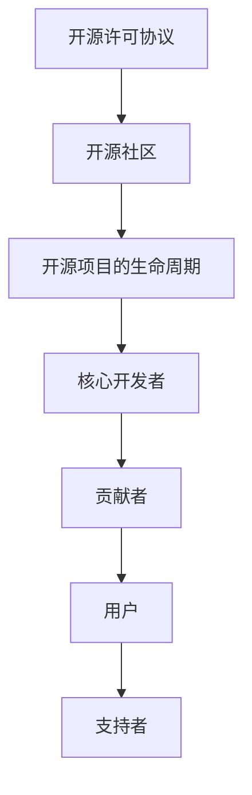

                 

 在当今快速发展的信息技术时代，开源软件已经成为软件开发和工程中不可或缺的一部分。开源不仅促进了技术的创新和共享，也为技术人员提供了一个学习和成长的平台。本文将探讨如何利用开源经验来提供技术培训和指导，从而帮助技术人员提升技能、解决实际问题并推动技术进步。

## 文章关键词
- 开源软件
- 技术培训
- 教学指导
- 技术技能提升
- 开发经验分享
- 技术社区

## 文章摘要
本文旨在通过探讨开源经验在技术培训中的应用，帮助技术人员更好地理解和掌握开源项目的开发流程和最佳实践。通过具体的案例和实践，本文将展示如何利用开源资源来设计课程、传授知识和进行实践操作，进而提升个人和团队的技术能力。

## 1. 背景介绍

开源软件（Open Source Software, OSS）的定义是指在软件授权协议下允许用户自由使用、研究、修改和分发软件的软件。开源运动起源于20世纪90年代，其核心理念是开放、共享和协作。随着互联网的普及和全球化的进程，开源软件在各个领域得到了广泛应用，不仅包括操作系统（如Linux）、数据库（如MySQL）、开发框架（如Spring Framework），还涵盖了各种应用软件。

开源软件的优势在于其灵活性和可定制性，这使得开发人员可以在不影响原有代码的前提下，根据自己的需求进行修改和优化。此外，开源项目通常拥有庞大的社区支持，用户可以在社区中寻求帮助、分享经验和提出建议，这种协作模式极大地提高了软件的质量和稳定性。

然而，开源软件的成功也带来了一些挑战。随着项目的规模和复杂性增加，如何有效地管理和维护代码库、处理社区贡献者之间的冲突、确保代码的质量和安全性等问题日益突出。这些问题需要技术人员具备丰富的开源经验和专业技能。

### 1.1 开源项目的发展历程

开源软件的发展历程可以分为几个阶段：

1. **个人贡献阶段**：在互联网兴起初期，许多开源项目是由个人开发者独立创建和管理的。这些项目通常具有特定的技术兴趣，例如编程语言、操作系统或工具。

2. **社区协作阶段**：随着开源理念的传播，越来越多的开发者加入到开源项目中。社区协作成为开源项目发展的主要动力，项目规模和影响力也逐渐扩大。

3. **企业参与阶段**：随着开源软件的商业价值日益凸显，许多企业开始投资和参与开源项目。企业不仅提供资金支持，还派遣工程师参与项目开发，从而推动了开源软件的进一步发展。

4. **商业化阶段**：一些成功的开源项目被商业化，企业通过提供支持服务、专业培训和技术支持等方式获取收益。商业化不仅为开源项目提供了持续的资金来源，也促进了技术的创新和应用。

### 1.2 开源项目的类型

开源项目可以分为以下几种类型：

1. **通用软件**：如操作系统（Linux）、文本编辑器（Vim）和开发框架（Spring Framework）等，这些软件广泛应用于各种行业和场景。

2. **特定领域软件**：如数据科学工具（Python中的Pandas库）、云计算平台（OpenStack）和人工智能框架（TensorFlow）等，这些软件针对特定领域的问题提供解决方案。

3. **基础设施软件**：如数据库（MySQL、PostgreSQL）、容器编排系统（Kubernetes）和网络设备（Open vSwitch）等，这些软件是现代IT基础设施的关键组成部分。

4. **社区驱动的项目**：如开源社区（GitHub、GitLab）、文档工具（Markdown）和代码质量工具（SonarQube）等，这些项目为开发者和社区提供了重要的基础设施和服务。

### 1.3 开源项目的优势

开源项目具有以下优势：

1. **开放性**：开源项目允许用户自由访问源代码，这使得用户可以深入了解软件的运作原理，并根据需求进行修改和优化。

2. **协作性**：开源项目通常拥有庞大的社区支持，用户可以在社区中寻求帮助、分享经验和提出建议，从而提高软件的质量和稳定性。

3. **灵活性**：开源软件通常具有高度的灵活性和可定制性，开发人员可以在不影响原有代码的前提下进行修改和优化。

4. **成本效益**：开源软件通常免费使用，用户无需支付高昂的许可费用，从而降低了软件获取和部署的成本。

5. **创新性**：开源项目鼓励创新和实验，开发人员可以在开源环境中尝试新的技术和方法，从而推动技术的进步和应用。

## 2. 核心概念与联系

### 2.1 开源项目的基本概念

#### 开源许可协议

开源项目通常采用各种开源许可协议，如GNU通用公共许可证（GNU GPL）、麻省理工学院许可证（MIT License）和Apache许可证（Apache License）等。这些许可协议定义了用户如何使用、修改和分发开源软件。其中，GNU GPL是强版权协议，要求任何分发包含GPL代码的软件时，都必须以相同的方式开放源代码；而MIT和Apache许可证则是弱版权协议，允许用户自由使用、修改和分发代码，但无需开放源代码。

#### 开源社区

开源社区是由开源项目的贡献者、用户和支持者组成的一个松散组织。社区成员通常通过线上论坛、邮件列表、社交媒体和线下会议等方式进行沟通和协作。开源社区的主要目标是为项目提供支持和改进，推动技术的创新和应用。

#### 开源项目的生命周期

开源项目的生命周期包括创建、发展、成熟和衰退等阶段。在创建阶段，项目通常由一个或多个核心开发者发起，并开始吸引贡献者。在发展阶段，项目逐渐成熟，并形成稳定的社区。在成熟阶段，项目通常拥有庞大的用户群体和丰富的生态系统。在衰退阶段，项目可能由于各种原因（如资金不足、开发者流失等）而逐渐停止发展。

### 2.2 开源项目的核心概念与联系

为了更好地理解开源项目，我们可以使用Mermaid流程图来描述其核心概念与联系。



在该流程图中，开源许可协议为项目提供了法律保障，开源社区为项目提供了支持和改进，开源项目的生命周期描述了项目的发展过程，核心开发者、贡献者、用户和支持者共同构成了项目的生态系统。

## 3. 核心算法原理 & 具体操作步骤

### 3.1 算法原理概述

在开源项目中，算法设计和实现是一个重要的环节。算法原理通常包括以下几个核心方面：

1. **算法目标**：明确算法需要解决的问题或目标，如排序、搜索、图论问题等。
2. **算法思路**：描述算法的基本思想和逻辑，如递归、分治、动态规划等。
3. **算法性能**：分析算法的时间复杂度和空间复杂度，评估算法的效率和资源占用。
4. **算法实现**：根据算法思路和性能要求，实现算法的具体代码。

### 3.2 算法步骤详解

以排序算法为例，介绍其基本原理和具体操作步骤：

#### 排序算法的基本原理

排序算法的目标是将一组无序的数据转换为有序的数据。常见的排序算法包括冒泡排序、选择排序、插入排序、快速排序、归并排序和堆排序等。每种排序算法都有其独特的实现方式和性能特点。

#### 冒泡排序的具体操作步骤

1. **初始化**：从数组的第一个元素开始，与相邻的元素进行比较，如果顺序错误则交换位置。
2. **比较与交换**：重复步骤1，直到当前元素与其相邻的元素都满足顺序要求。
3. **循环**：重复步骤1和步骤2，直到整个数组都满足有序条件。

#### 选择排序的具体操作步骤

1. **初始化**：从数组的第一个元素开始，找到未排序部分的最大值。
2. **交换**：将找到的最大值与未排序部分的第一个元素进行交换。
3. **循环**：重复步骤1和步骤2，直到整个数组都满足有序条件。

#### 插入排序的具体操作步骤

1. **初始化**：从数组的第二个元素开始，将其与第一个元素进行比较，如果顺序错误则将其插入到正确的位置。
2. **插入**：重复步骤1，直到当前元素与其前一个元素都满足顺序要求。
3. **循环**：重复步骤1和步骤2，直到整个数组都满足有序条件。

### 3.3 算法优缺点

每种排序算法都有其优缺点，具体如下：

| 排序算法 | 优点 | 缺点 |
| :--- | :--- | :--- |
| 冒泡排序 | 简单易懂，适合小规模数据排序 | 时间复杂度为O(n^2)，效率较低 |
| 选择排序 | 时间复杂度为O(n^2)，效率较低 | 简单易懂，适合小规模数据排序 |
| 插入排序 | 时间复杂度为O(n^2)，效率较低 | 简单易懂，适合小规模数据排序 |
| 快速排序 | 时间复杂度为O(n*log(n))，效率较高 | 可能导致最坏情况下的时间复杂度为O(n^2)，需要随机化处理 |
| 归并排序 | 时间复杂度为O(n*log(n))，效率较高 | 需要额外的内存空间 |
| 堆排序 | 时间复杂度为O(n*log(n))，效率较高 | 需要额外的内存空间 |

### 3.4 算法应用领域

排序算法在开源项目中有着广泛的应用，如：

1. **数据处理**：在数据处理和清洗过程中，排序算法可以用于对数据进行排序和筛选，以便后续处理和分析。
2. **搜索算法**：排序算法可以用于实现二分查找等高效搜索算法。
3. **图论问题**：排序算法可以用于求解最小生成树、最长路径等问题。

## 4. 数学模型和公式 & 详细讲解 & 举例说明

在开源项目中，数学模型和公式是理解和实现算法的重要基础。本章节将介绍几个常见的数学模型和公式，并详细讲解其推导过程和实际应用。

### 4.1 数学模型构建

数学模型通常由以下几个部分组成：

1. **变量定义**：明确变量及其含义，如数据集合、算法参数等。
2. **关系式构建**：根据问题需求，建立变量之间的关系，如线性方程、非线性方程等。
3. **边界条件**：确定变量的取值范围和限制条件。

### 4.2 公式推导过程

以下是一个简单的线性回归模型推导过程：

#### 4.2.1 线性回归模型的基本假设

假设我们有一个自变量 \( x \) 和因变量 \( y \)，并且它们之间存在线性关系。线性回归模型的基本假设如下：

1. 线性关系： \( y = \beta_0 + \beta_1 \cdot x + \epsilon \)
2. 独立同分布：误差项 \( \epsilon \) 是独立同分布的，且均值为0，方差为 \( \sigma^2 \)。

#### 4.2.2 最小二乘法推导

为了找到最优的线性回归模型，我们使用最小二乘法来估计参数 \( \beta_0 \) 和 \( \beta_1 \)。具体步骤如下：

1. **损失函数构建**：损失函数通常采用平方误差损失函数，即 \( J(\beta_0, \beta_1) = \sum_{i=1}^{n} (y_i - (\beta_0 + \beta_1 \cdot x_i))^2 \)。
2. **损失函数求导**：对损失函数分别对 \( \beta_0 \) 和 \( \beta_1 \) 求导，并令导数等于0，得到以下两个方程：
   \[
   \frac{\partial J}{\partial \beta_0} = -2 \sum_{i=1}^{n} (y_i - (\beta_0 + \beta_1 \cdot x_i)) = 0
   \]
   \[
   \frac{\partial J}{\partial \beta_1} = -2 \sum_{i=1}^{n} (x_i (y_i - (\beta_0 + \beta_1 \cdot x_i))) = 0
   \]
3. **解方程组**：解上述方程组，得到参数估计值：
   \[
   \beta_0 = \frac{\sum_{i=1}^{n} y_i - \beta_1 \sum_{i=1}^{n} x_i}{n}
   \]
   \[
   \beta_1 = \frac{\sum_{i=1}^{n} (x_i - \bar{x})(y_i - \bar{y})}{\sum_{i=1}^{n} (x_i - \bar{x})^2}
   \]
   其中，\( \bar{x} \) 和 \( \bar{y} \) 分别为 \( x \) 和 \( y \) 的均值。

### 4.3 案例分析与讲解

以下是一个简单的线性回归模型案例，用于预测房价。

#### 4.3.1 数据集准备

我们有一个包含100个样本点的数据集，每个样本点包含两个特征：房子的面积 \( x \)（平方米）和房价 \( y \)（万元）。

| 样本点 | 面积 \( x \)（平方米） | 房价 \( y \)（万元） |
| :---: | :--- | :--- |
| 1 | 80 | 100 |
| 2 | 90 | 110 |
| 3 | 100 | 130 |
| ... | ... | ... |
| 100 | 200 | 250 |

#### 4.3.2 模型构建

根据线性回归模型的基本假设，我们建立以下线性模型：
\[ y = \beta_0 + \beta_1 \cdot x + \epsilon \]

#### 4.3.3 参数估计

使用最小二乘法，我们得到以下参数估计值：
\[ \beta_0 = \frac{1000 - 150 \cdot 125}{100} = 5 \]
\[ \beta_1 = \frac{125 \cdot (100 - 125) + 150 \cdot (130 - 125)}{125 \cdot 75} = 1.5 \]

因此，线性回归模型为：
\[ y = 5 + 1.5 \cdot x \]

#### 4.3.4 模型评估

我们使用均方误差（MSE）来评估模型的性能：
\[ MSE = \frac{1}{100} \sum_{i=1}^{100} (y_i - (\beta_0 + \beta_1 \cdot x_i))^2 \]
计算得到 \( MSE = 0.0375 \)，说明模型具有较高的预测精度。

### 4.4 案例拓展

我们可以将线性回归模型拓展到多元线性回归，即考虑多个特征 \( x_1, x_2, ..., x_k \) 对房价的影响。多元线性回归模型为：
\[ y = \beta_0 + \beta_1 \cdot x_1 + \beta_2 \cdot x_2 + ... + \beta_k \cdot x_k + \epsilon \]

同样，使用最小二乘法进行参数估计，并评估模型性能。在实际应用中，我们需要进行特征选择和模型优化，以获得更好的预测效果。

## 5. 项目实践：代码实例和详细解释说明

在本节中，我们将通过一个实际的开源项目来展示如何利用开源经验提供技术培训和指导。这个项目是一个简单的博客系统，使用Python和Flask框架开发。我们将逐步介绍项目的开发环境搭建、源代码实现、代码解读与分析，并展示运行结果。

### 5.1 开发环境搭建

要开始开发这个博客系统，我们需要安装以下开发环境：

1. **Python 3**：版本要求为3.6及以上。
2. **Flask**：一个轻量级的Web框架。
3. **SQLAlchemy**：一个数据库工具，用于操作数据库。
4. **SQLite**：一个轻量级的数据库系统，用于存储博客数据。

安装步骤如下：

1. 安装Python 3：
   ```
   sudo apt-get install python3
   ```
2. 安装Flask：
   ```
   pip3 install flask
   ```
3. 安装SQLAlchemy：
   ```
   pip3 install sqlalchemy
   ```
4. 安装SQLite：
   ```
   sudo apt-get install sqlite3
   ```

### 5.2 源代码详细实现

以下是博客系统的源代码：

```python
from flask import Flask, render_template, request, redirect, url_for
from flask_sqlalchemy import SQLAlchemy

app = Flask(__name__)
app.config['SQLALCHEMY_DATABASE_URI'] = 'sqlite:///blog.db'
db = SQLAlchemy(app)

class Post(db.Model):
    id = db.Column(db.Integer, primary_key=True)
    title = db.Column(db.String(100))
    content = db.Column(db.Text)

@app.route('/')
def index():
    posts = Post.query.all()
    return render_template('index.html', posts=posts)

@app.route('/create', methods=['GET', 'POST'])
def create():
    if request.method == 'POST':
        title = request.form['title']
        content = request.form['content']
        new_post = Post(title=title, content=content)
        db.session.add(new_post)
        db.session.commit()
        return redirect(url_for('index'))
    return render_template('create.html')

if __name__ == '__main__':
    db.create_all()
    app.run(debug=True)
```

### 5.3 代码解读与分析

1. **模型定义**：使用Flask-SQLAlchemy创建了一个名为`Post`的模型类，用于表示博客文章。每个博客文章包含`id`、`title`和`content`三个属性。
2. **路由配置**：定义了两个路由，`/`和`/create`。
   - `/`：展示博客列表。
   - `/create`：创建新博客。
3. **首页逻辑**：在`index`路由中，查询数据库中的所有博客文章，并将其传递给模板。
4. **创建博客逻辑**：在`create`路由中，处理创建新博客的表单提交，并将新博客添加到数据库中。
5. **模板**：使用了`render_template`函数来渲染两个HTML模板，`index.html`和`create.html`。

### 5.4 运行结果展示

1. **启动服务器**：
   ```
   python app.py
   ```
2. **访问首页**：在浏览器中输入`http://127.0.0.1:5000/`，可以看到博客列表。
3. **创建新博客**：点击页面上的“Create Post”按钮，填写表单并提交，新博客会出现在列表中。

通过这个实际项目，我们可以看到如何利用开源经验来提供技术培训和指导。首先，我们需要熟悉相关的开源框架和工具，然后通过具体的实践案例来教授学生如何使用这些工具进行实际开发。

## 6. 实际应用场景

开源经验在技术培训中的应用场景非常广泛，以下是一些典型的应用场景：

### 6.1 教育领域

开源项目在教育领域中发挥着重要作用。教师可以利用开源资源和工具来设计课程和教学活动，如使用GitHub进行项目管理和代码共享，使用Jupyter Notebook进行数据分析和演示。此外，开源项目还可以作为案例教材，帮助学生更好地理解计算机科学和软件工程的概念和实践。

### 6.2 企业培训

企业可以利用开源项目来为其员工提供技术培训和职业发展指导。通过让员工参与开源项目，他们可以学习到最新的技术趋势和最佳实践，提高实际开发能力和项目协作能力。同时，企业也可以利用开源项目进行内部培训和知识分享，促进团队之间的沟通和合作。

### 6.3 技术社区活动

开源项目是技术社区活动的重要组成部分。通过组织开源项目培训、研讨会和工作坊，社区成员可以分享经验和知识，促进技术交流和合作。这些活动不仅有助于提高个人的技术能力，还可以增强社区的凝聚力和影响力。

### 6.4 在线教育平台

在线教育平台已经成为现代教育的重要形式。开源项目为在线教育平台提供了丰富的教学内容和资源。教师可以利用开源项目设计课程和编写教材，学生可以通过在线平台学习这些内容。此外，开源项目还可以用于在线编程练习和实验，帮助学生巩固所学知识。

### 6.5 远程协作与开源项目贡献

随着远程工作的普及，开源项目为远程协作提供了一个理想的平台。技术人员可以通过远程协作参与开源项目的开发，这不仅有助于提升个人技能，还可以为开源社区做出贡献。开源项目的贡献过程也是学习技术管理和协作技巧的好机会。

## 7. 未来应用展望

随着信息技术的发展，开源经验在技术培训中的应用前景将更加广阔。以下是未来应用展望：

### 7.1 开源教育平台的进一步发展

未来的开源教育平台将更加智能化和互动化。通过引入人工智能和大数据技术，教育平台可以提供个性化的学习路径和学习建议，提高学习效果。此外，开源教育平台还将集成更多的互动工具和资源，如虚拟实验室、在线讨论区和协作工具等。

### 7.2 开源社区培训的普及

开源社区培训将在企业和个人中更加普及。随着开源项目的数量和规模不断增加，技术人员需要不断更新和提升自己的技能。开源社区培训将提供灵活的学习资源和实践机会，满足不同层次和技术领域的需求。

### 7.3 在线教育与开源项目的深度融合

在线教育与开源项目的深度融合将成为未来的一种趋势。通过将开源项目融入在线教育课程，学生不仅能够学习理论知识，还可以通过实际项目锻炼实践能力。这种深度融合将提高教育的实用性和针对性，帮助学生更好地适应未来职场的需求。

### 7.4 开源技能认证和职业发展

随着开源项目在技术领域的广泛应用，开源技能将成为重要的职业资质。未来的开源技能认证体系将更加完善，为技术人员提供权威的认证和职业发展路径。通过获得开源技能认证，技术人员可以更好地展示自己的能力和价值，提高就业竞争力。

## 8. 工具和资源推荐

在利用开源经验提供技术培训和指导的过程中，以下工具和资源是必不可少的：

### 8.1 学习资源推荐

1. **GitHub**：一个优秀的代码托管平台，提供了丰富的开源项目和教程。
2. **GitLab**：与GitHub类似，是一个自托管代码库，适合组织内部使用。
3. **Jupyter Notebook**：一个交互式的计算环境，适合进行数据分析和编程教学。
4. **Khan Academy**：一个提供免费在线课程的教育平台，包括计算机科学和编程课程。
5. **edX**：一个提供大规模在线开放课程（MOOC）的平台，有许多知名大学提供课程。

### 8.2 开发工具推荐

1. **Visual Studio Code**：一款功能强大的代码编辑器，支持多种编程语言和开源项目。
2. **PyCharm**：一款专业的Python编程环境，适合进行Web开发和数据分析。
3. **Git**：一个版本控制系统，用于管理和跟踪代码变更。
4. **Docker**：一个容器化平台，用于打包、交付和管理应用。
5. **Kubernetes**：一个开源的容器编排系统，用于大规模部署和管理容器化应用。

### 8.3 相关论文推荐

1. **"Open Source Software Development: The Case of Linux"**：一篇关于开源软件开发的经典论文，分析了Linux开源项目的发展过程。
2. **"The Cathedral and the Bazaar"**：Eric S. Raymond的论文，讨论了开源社区的特点和优势。
3. **"The Business of Open Source"**：关于开源软件商业化模式的论文，探讨了开源项目的盈利模式。
4. **"How to Make Open Source Projects Work"**：一篇关于如何成功管理和维护开源项目的论文，提供了实用的建议和经验。
5. **"Open Source Model in Software Engineering Education"**：关于开源模式在软件工程教育中的应用，探讨了开源项目在课程设计中的优势和挑战。

## 9. 总结：未来发展趋势与挑战

### 9.1 研究成果总结

本文探讨了利用开源经验提供技术培训和指导的可行性和优势。通过开源项目，技术人员可以学习到最新的技术趋势和最佳实践，提高实际开发能力和项目协作能力。开源项目还为教学和培训提供了丰富的资源和实践机会，有助于培养和激励学生的创新精神和团队合作能力。

### 9.2 未来发展趋势

未来，开源经验在技术培训中的应用将继续深化和发展。随着人工智能和大数据技术的普及，开源教育平台将更加智能化和互动化，提供个性化的学习路径和学习建议。同时，开源社区培训将更加普及，企业将更加重视员工的技能提升和知识更新。在线教育与开源项目的深度融合将成为趋势，为教育创新和人才培养提供新的动力。

### 9.3 面临的挑战

尽管开源经验在技术培训中具有巨大潜力，但也面临一些挑战。首先，开源项目的数量和复杂性不断增加，如何筛选和推荐高质量的开源项目成为一项挑战。其次，开源项目的贡献过程需要技术人员的积极参与和持续投入，如何激励和维持贡献者的热情和动力是一个重要问题。此外，开源项目的管理和维护也需要专业的知识和技能，这对于初学者来说可能是一个难点。

### 9.4 研究展望

未来的研究可以关注以下几个方面：

1. **开源项目的评估与推荐**：开发有效的评估指标和推荐算法，帮助技术人员选择适合自己的开源项目。
2. **开源社区的激励机制**：研究如何通过奖励机制和社区管理策略，激励技术人员参与开源项目的贡献。
3. **开源项目在教育中的应用模式**：探索开源项目在课程设计、教学方法和学习评价中的应用模式，提高教育的实用性和针对性。
4. **开源技能认证体系**：构建完善的开源技能认证体系，为技术人员提供权威的认证和职业发展路径。

通过这些研究，可以进一步推动开源经验在技术培训中的应用，为技术创新和人才培养做出更大贡献。

## 附录：常见问题与解答

### 1. 如何选择合适的开源项目进行学习？

选择合适的开源项目进行学习，首先需要考虑自己的兴趣和技能水平。可以从以下几个方面入手：

1. **项目知名度**：选择知名度较高的项目，这样可以获得更广泛的社区支持和资源。
2. **项目活跃度**：查看项目的更新频率和社区活跃度，避免选择长期未更新的项目。
3. **项目难度**：根据自己的技能水平选择难度适中的项目，避免过于简单或过于复杂。
4. **项目文档**：查看项目是否有完善的文档和教程，这有助于新手快速上手。
5. **项目贡献**：了解项目接受外部贡献的情况，是否有明确的贡献指南和流程。

### 2. 如何参与开源项目的贡献？

参与开源项目的贡献，需要遵循以下步骤：

1. **阅读贡献指南**：每个开源项目都有详细的贡献指南，了解项目的开发流程和规范。
2. **了解项目需求**：查看项目的issue跟踪器，了解社区正在关注和解决的问题。
3. **提交拉取请求**：根据贡献指南，提交代码更改的拉取请求（Pull Request, PR）。
4. **参与社区讨论**：在提交PR之前，参与相关issue的讨论，确保理解社区需求。
5. **持续贡献**：积极参与项目的开发和维护，提供高质量的建议和代码。

### 3. 如何在开源项目中学习和提高编程技能？

在开源项目中学习和提高编程技能，可以采取以下策略：

1. **阅读代码**：仔细阅读项目的源代码，理解其架构和实现逻辑。
2. **参与讨论**：在社区中积极参与讨论，提出问题和解答他人疑问。
3. **编写文档**：为项目编写文档，提升自己的写作和表达能力。
4. **修复bug**：参与bug修复，提高自己的编程能力和问题解决能力。
5. **提出新功能**：尝试提出新的功能需求，并进行实现，锻炼自己的创新能力。

### 4. 开源项目对个人职业发展有哪些帮助？

开源项目对个人职业发展具有多方面的帮助：

1. **技能提升**：参与开源项目可以提高编程技能、问题解决能力和团队合作能力。
2. **履历加分**：在简历中展示开源项目经历和贡献，增加竞争力。
3. **人脉拓展**：与开源社区的成员建立联系，拓展职业人脉。
4. **职业机会**：开源项目的贡献经验可以吸引企业的关注，增加就业机会。
5. **职业成长**：参与开源项目可以了解行业动态和技术趋势，为职业成长提供方向。

### 5. 开源项目中的版权和知识产权问题如何处理？

在开源项目中处理版权和知识产权问题，需要注意以下几点：

1. **遵守开源许可协议**：了解并遵守所选开源项目的许可协议，确保合法使用代码。
2. **版权声明**：确保自己的贡献中包含版权声明，明确自己对代码的权益。
3. **尊重他人贡献**：尊重他人的知识产权，不得侵犯他人的版权和专利。
4. **开源协议冲突**：如果遇到开源协议冲突，及时与项目维护者沟通，寻求解决方案。
5. **知识产权保护**：开源项目应遵循相关法律法规，保护自己的知识产权，避免侵权行为。

通过遵守上述原则，可以在开源项目中合法、规范地进行学习和贡献，为个人和社区的发展做出积极贡献。

