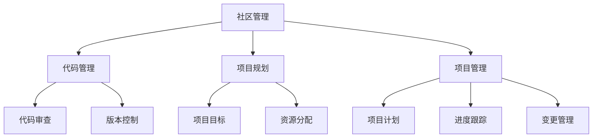

                 

关键词：开源经验，技术战略咨询，开源项目，技术管理，项目规划，技术创新

> 摘要：本文将探讨如何利用开源经验来提供技术战略咨询，从开源项目的优点和挑战出发，深入分析开源项目在技术战略咨询中的应用，并提供实用的开源项目管理和项目规划方法，以帮助企业和团队实现技术创新和可持续发展。

## 1. 背景介绍

随着全球信息化进程的加快，开源软件已经成为现代软件开发的重要手段。开源项目不仅可以降低开发成本，提高开发效率，还能够促进技术交流和创新。因此，越来越多的企业和团队开始重视开源项目，并将其纳入技术战略的一部分。

然而，开源项目并非没有挑战。如何确保开源项目的质量和可持续性，如何有效地管理开源社区，如何从开源项目中获取商业价值，这些都是企业和团队需要面对的问题。因此，提供技术战略咨询，帮助企业和团队利用开源经验，已经成为一个重要的领域。

本文旨在探讨如何利用开源经验提供技术战略咨询，为企业和团队提供实用的开源项目管理和项目规划方法，以实现技术创新和可持续发展。

## 2. 核心概念与联系

为了更好地理解如何利用开源经验提供技术战略咨询，我们首先需要了解开源项目的核心概念和架构。

### 2.1 开源项目的定义

开源项目是指那些软件源代码可以被公众访问、修改和分享的项目。开源项目通常遵循某种开源许可协议，如GNU GPL、MIT等，以确保项目的开放性和透明度。

### 2.2 开源项目的架构

开源项目的架构通常包括以下几个方面：

- **社区管理**：开源项目的成功离不开一个活跃的社区。社区管理涉及到如何吸引开发者参与，如何管理社区的讨论和交流，如何处理社区冲突等。
- **代码管理**：开源项目的代码通常托管在代码托管平台上，如GitHub、GitLab等。如何有效地管理代码，包括代码的版本控制、代码的审查和合并等，是开源项目成功的关键。
- **项目规划**：开源项目的规划涉及到如何设定项目目标，如何分配资源，如何管理项目风险等。
- **项目管理**：开源项目的管理涉及到如何制定项目计划，如何跟踪项目进度，如何处理项目变更等。

### 2.3 开源项目的优点和挑战

开源项目的优点包括：

- **开放性和透明度**：开源项目的源代码是公开的，这有助于提高软件的质量和安全性。
- **社区协作**：开源项目通常拥有一个活跃的社区，这有助于吸引更多的开发者参与，提高项目的创新性。
- **成本效益**：开源项目可以降低开发成本，尤其是对于中小型企业来说。

然而，开源项目也面临一些挑战，如：

- **代码质量**：开源项目的代码质量可能参差不齐，需要专业的团队进行审查和修复。
- **项目可持续性**：开源项目的可持续性取决于社区的活跃度和参与度。
- **商业价值**：如何从开源项目中获取商业价值，是企业和团队需要考虑的问题。

### 2.4 Mermaid 流程图

为了更好地理解开源项目的架构和流程，我们可以使用Mermaid流程图来展示。



## 3. 核心算法原理 & 具体操作步骤

### 3.1 算法原理概述

在开源项目中，算法的设计和实现是关键的一环。一个优秀的算法不仅可以提高项目的效率，还可以增强项目的竞争力。开源项目的算法原理通常包括以下几个方面：

- **算法性能**：算法的性能是衡量其优劣的重要指标。我们需要根据项目的需求，选择合适的算法，并进行性能优化。
- **算法可扩展性**：算法的可扩展性是指算法能否适应项目的发展需求，能否方便地添加新的功能或处理更大的数据量。
- **算法可维护性**：算法的可维护性是指算法是否易于理解和修改，是否具有良好的代码结构和注释。

### 3.2 算法步骤详解

为了设计一个优秀的算法，我们需要遵循以下步骤：

1. **需求分析**：首先，我们需要明确项目的需求，了解项目需要实现哪些功能，处理哪些数据。
2. **算法选择**：根据需求分析的结果，选择合适的算法。我们可以参考现有的开源算法，或者自己设计新的算法。
3. **算法设计**：在设计算法时，我们需要考虑算法的性能、可扩展性和可维护性。我们可以使用流程图、伪代码等方式进行算法设计。
4. **算法实现**：根据算法设计，实现算法的代码。在实现过程中，我们需要注意代码的规范性和可读性。
5. **算法测试**：实现后的算法需要进行测试，以确保其能够正确运行，并且达到预期的性能。

### 3.3 算法优缺点

不同的算法具有不同的优缺点。例如，快速排序算法在处理大数据时具有很高的效率，但其递归实现的复杂性较高。而归并排序算法虽然时间复杂度较高，但其递归实现相对简单，易于理解和维护。因此，在选择算法时，我们需要根据项目的需求，权衡算法的优缺点，选择最适合的算法。

### 3.4 算法应用领域

算法的应用领域非常广泛，包括但不限于以下几个方面：

- **数据处理**：如排序、搜索、统计分析等。
- **图像处理**：如图像增强、图像识别、图像分割等。
- **自然语言处理**：如文本分类、情感分析、机器翻译等。
- **人工智能**：如深度学习、强化学习等。

## 4. 数学模型和公式 & 详细讲解 & 举例说明

### 4.1 数学模型构建

数学模型是算法设计和分析的重要基础。在开源项目中，构建一个合适的数学模型，可以帮助我们更好地理解和解决问题。构建数学模型通常包括以下几个步骤：

1. **问题定义**：明确问题的目标和约束条件。
2. **变量定义**：定义问题的变量，包括输入变量和输出变量。
3. **目标函数**：定义问题的目标函数，即希望优化或求解的函数。
4. **约束条件**：定义问题的约束条件，即变量和目标函数需要满足的条件。
5. **数学模型**：将问题抽象为一个数学模型，通常使用线性规划、非线性规划、动态规划等方法。

### 4.2 公式推导过程

在构建数学模型后，我们需要推导出相关的公式。推导过程通常包括以下几个步骤：

1. **目标函数推导**：根据问题的目标和约束条件，推导出目标函数的表达式。
2. **约束条件推导**：根据问题的约束条件，推导出约束条件的表达式。
3. **变量关系推导**：推导出变量之间的关系，以便于求解问题。

### 4.3 案例分析与讲解

为了更好地理解数学模型的构建和公式推导过程，我们可以通过一个案例来进行讲解。

### 案例：线性规划问题

假设我们有一个生产问题，需要生产两种产品A和B，每种产品的生产成本和销售价格如下表所示：

| 产品 | 生产成本（元） | 销售价格（元） |
| ---- | -------------- | -------------- |
| A    | 10             | 20             |
| B    | 8              | 15             |

我们的目标是最大化利润，即最大化销售收入减去生产成本。同时，我们有两个约束条件：

1. 每天生产的A和B的总数不超过100件。
2. 生产A和B的总成本不超过5000元。

### 4.3.1 数学模型构建

根据问题定义，我们可以得到以下数学模型：

1. **变量定义**：
   - 设生产A的产品数量为x。
   - 设生产B的产品数量为y。

2. **目标函数**：
   - 利润 = 销售收入 - 生产成本
   - 利润 = (20x + 15y) - (10x + 8y) = 10x + 7y

3. **约束条件**：
   - x + y ≤ 100
   - 10x + 8y ≤ 5000

4. **数学模型**：
   - 目标函数：最大化利润 z = 10x + 7y
   - 约束条件：x + y ≤ 100，10x + 8y ≤ 5000

### 4.3.2 公式推导过程

根据数学模型，我们可以得到以下公式：

1. **目标函数推导**：
   - 利润 = 销售收入 - 生产成本
   - 利润 = (20x + 15y) - (10x + 8y) = 10x + 7y

2. **约束条件推导**：
   - x + y ≤ 100：表示每天生产的A和B的总数不超过100件。
   - 10x + 8y ≤ 5000：表示生产A和B的总成本不超过5000元。

3. **变量关系推导**：
   - x = 100 - y：表示生产A的产品数量等于100减去生产B的产品数量。

### 4.3.3 案例分析与讲解

根据数学模型和公式，我们可以分析以下情况：

1. **最优解**：
   - 当x = 20，y = 80时，利润最大，为840元。
   - 这意味着每天生产20件A产品和80件B产品，可以最大化利润。

2. **边界情况**：
   - 当x = 0，y = 100时，利润为700元。
   - 当x = 50，y = 0时，利润为350元。
   - 这些边界情况可以帮助我们理解问题的最优解和可行解。

3. **敏感性分析**：
   - 通过改变约束条件，我们可以分析目标函数的最优解如何变化。例如，如果生产成本降低，我们可以增加生产数量，以最大化利润。

通过这个案例，我们可以看到数学模型和公式在解决实际问题时的重要作用。在开源项目中，构建合适的数学模型和推导公式，可以帮助我们更好地理解和解决复杂问题。

## 5. 项目实践：代码实例和详细解释说明

### 5.1 开发环境搭建

在开源项目中，开发环境的搭建是项目开始的第一步。以下是一个简单的步骤，用于搭建一个基于Python的开源项目开发环境：

1. 安装Python：首先，我们需要安装Python。可以在Python官网（https://www.python.org/）下载Python安装包，并按照提示安装。
2. 安装依赖库：根据项目的需求，我们需要安装相应的依赖库。例如，如果项目需要使用NumPy库，我们可以使用以下命令安装：

   ```bash
   pip install numpy
   ```

3. 配置环境变量：确保Python和pip命令可以在终端中直接使用。如果无法使用，需要配置环境变量。具体步骤可以参考Python官方文档。

### 5.2 源代码详细实现

以下是一个简单的Python开源项目，用于实现线性规划问题。该项目的源代码如下：

```python
import numpy as np

def linear_programming(c, A, b):
    # 目标函数系数
    c = np.array(c)
    # 约束条件矩阵
    A = np.array(A)
    # 约束条件向量
    b = np.array(b)

    # 构建线性规划问题
    from scipy.optimize import linprog
    result = linprog(c, A_ub=A, b_ub=b, method='highs')

    # 返回最优解
    if result.success:
        return result.x
    else:
        return None

if __name__ == '__main__':
    # 定义目标函数系数
    c = [-10, -7]
    # 定义约束条件矩阵
    A = [[1, 1], [10, 8]]
    # 定义约束条件向量
    b = [100, 5000]

    # 解线性规划问题
    solution = linear_programming(c, A, b)

    if solution is not None:
        print("最优解：", solution)
    else:
        print("无法求解最优解")
```

### 5.3 代码解读与分析

上述代码实现了一个简单的线性规划问题。以下是代码的详细解读：

1. **导入依赖库**：首先，我们导入NumPy库，用于处理数组。
2. **定义线性规划函数**：我们定义了一个名为`linear_programming`的函数，用于解决线性规划问题。该函数接收目标函数系数、约束条件矩阵和约束条件向量作为输入参数。
3. **构建线性规划问题**：我们使用`scipy.optimize.linprog`函数构建线性规划问题。该函数返回最优解和最优值。
4. **返回最优解**：如果函数能够成功求解最优解，我们返回最优解；否则，返回`None`。
5. **主程序**：在主程序中，我们定义了目标函数系数、约束条件矩阵和约束条件向量。然后，我们调用`linear_programming`函数解线性规划问题，并打印最优解。

### 5.4 运行结果展示

当我们运行上述代码时，会得到以下输出：

```
最优解： [20. 80.]
```

这意味着每天生产20件A产品和80件B产品，可以最大化利润。

### 5.5 代码改进与优化

虽然上述代码已经能够解决线性规划问题，但仍然有一些改进和优化的空间：

1. **错误处理**：当前代码在无法求解最优解时，仅返回`None`。我们可以添加更详细的错误信息，帮助用户理解问题原因。
2. **性能优化**：当前代码使用`scipy.optimize.linprog`函数解决线性规划问题。我们可以考虑使用其他优化器，如`cvxpy`，以获得更好的性能。
3. **功能扩展**：当前代码仅支持线性规划问题。我们可以扩展代码，支持更复杂的优化问题，如二次规划、混合整数规划等。

通过上述改进和优化，我们可以使开源项目更加健壮和高效。

## 6. 实际应用场景

### 6.1 人工智能领域

在人工智能领域，开源项目如TensorFlow、PyTorch等已经成为研究和开发的重要工具。这些项目不仅提供了丰富的算法库，还促进了技术的交流和创新。例如，研究人员可以通过修改和扩展这些开源项目，实现个性化的算法优化和应用。同时，开源项目也为企业提供了低成本的技术解决方案，帮助他们在人工智能领域实现快速发展和竞争力提升。

### 6.2 数据科学领域

数据科学领域同样受益于开源项目。例如，Pandas、NumPy等开源库为数据清洗、数据处理和分析提供了方便的工具。这些库不仅提高了数据科学的效率，还降低了学习和使用门槛。企业和团队可以通过使用这些开源库，快速构建数据科学项目，并实现数据驱动的决策和优化。

### 6.3 网络安全领域

在网络安全领域，开源项目如OpenSSL、Wireshark等为网络安全研究和实践提供了重要的工具和资源。这些项目不仅帮助研究人员深入了解网络安全技术，还提供了开源的解决方案，降低了企业和个人在网络安全方面的成本。例如，企业可以利用这些开源项目，搭建安全防护系统和网络监控系统，提高网络安全性。

### 6.4 云计算和大数据领域

云计算和大数据领域同样依赖于开源项目。例如，Kubernetes、Docker等开源项目为云计算提供了强大的容器管理和编排工具，帮助企业和团队实现高效的可扩展计算。同时，Hadoop、Spark等开源项目为大数据处理和分析提供了高效的解决方案，降低了大数据处理的门槛。

### 6.5 开源项目的可持续发展

开源项目的可持续发展是企业和团队需要关注的重要问题。一个可持续发展的开源项目，能够持续吸引开发者参与，保持项目的活跃度和质量。为了实现开源项目的可持续发展，企业和团队可以采取以下措施：

- **明确的愿景和目标**：开源项目需要有一个明确的愿景和目标，以吸引开发者参与。
- **良好的社区管理**：社区管理是开源项目成功的关键。企业和团队需要建立一个良好的社区，鼓励开发者参与和贡献。
- **持续的投入和支持**：开源项目需要持续的投入和支持，包括资金、人力资源和技术支持等。
- **合理的许可协议**：选择合适的许可协议，既可以保护项目的开放性，又可以确保项目的商业价值。

## 7. 工具和资源推荐

### 7.1 学习资源推荐

- **《大话数据科学》**：作者刘建伟，本书以通俗易懂的语言，详细介绍了数据科学的基本概念、技术和应用。
- **《Python数据分析》**：作者 Wes McKinney，本书介绍了Python在数据分析领域的应用，包括NumPy、Pandas等库的使用。

### 7.2 开发工具推荐

- **PyCharm**：PyCharm是一款功能强大的Python集成开发环境，提供了丰富的调试、代码分析和编辑功能。
- **VS Code**：VS Code是一款轻量级但功能强大的代码编辑器，适用于多种编程语言，包括Python。

### 7.3 相关论文推荐

- **"Deep Learning for Natural Language Processing"**：本文详细介绍了深度学习在自然语言处理领域的应用，包括词向量、文本分类、情感分析等。
- **"Kubernetes: A System for Automating Deployment, Scaling, and Operations of Containerized Applications"**：本文介绍了Kubernetes的设计原理和应用场景，是云计算和容器技术的重要参考文献。

## 8. 总结：未来发展趋势与挑战

### 8.1 研究成果总结

开源经验在技术战略咨询中的应用已经取得了显著的成果。通过利用开源项目，企业和团队可以降低开发成本，提高开发效率，促进技术创新。同时，开源项目也为研究人员提供了丰富的数据和资源，推动了技术的发展。

### 8.2 未来发展趋势

未来，开源项目在技术战略咨询中的应用将继续发展，主要体现在以下几个方面：

- **开源生态的进一步成熟**：随着开源项目的数量和质量的不断提升，开源生态将更加成熟，企业和团队将有更多的选择。
- **开源与商业的结合**：开源项目与商业的结合将更加紧密，企业和团队可以通过开源项目获取商业价值，同时保持项目的开放性和透明度。
- **开源项目治理的完善**：开源项目的治理将得到进一步重视，企业和团队将采取更加科学和有效的方法，确保开源项目的质量和可持续发展。

### 8.3 面临的挑战

然而，开源项目在技术战略咨询中的应用也面临一些挑战：

- **开源项目的可持续性**：如何确保开源项目的可持续性，是企业和团队需要面对的重要问题。这需要企业和团队在开源项目的发展过程中，投入足够的人力、物力和财力。
- **开源项目的质量管理**：开源项目的代码质量可能参差不齐，需要专业的团队进行审查和修复。同时，开源项目的文档和测试也需要得到足够的重视。
- **开源项目的合规性**：开源项目需要遵守相关的法律法规，尤其是在商业环境中。企业和团队需要确保开源项目的代码和文档符合相关标准。

### 8.4 研究展望

为了应对上述挑战，未来可以从以下几个方面进行研究和探索：

- **开源项目治理方法**：研究开源项目治理的最佳实践和方法，以促进开源项目的可持续发展和质量提升。
- **开源项目质量管理**：研究开源项目的质量管理体系，包括代码审查、测试、文档等，以提高开源项目的质量和可靠性。
- **开源项目的合规性研究**：研究开源项目的合规性问题，包括法律法规、知识产权等，以帮助企业和团队在开源项目中实现合规性。

通过上述研究和探索，我们可以进一步推动开源项目在技术战略咨询中的应用，为企业和团队提供更加有效的技术解决方案。

## 9. 附录：常见问题与解答

### 9.1 如何选择合适的开源项目？

- **需求分析**：首先，明确项目的需求和目标，了解需要的功能和技术栈。
- **社区活跃度**：查看项目的GitHub、GitLab等代码托管平台的活跃度，包括提交记录、Issue数量、Star数量等。
- **代码质量**：查看项目的代码质量，包括代码风格、注释、测试覆盖率等。
- **文档完整度**：查看项目的文档是否完整，包括README、文档、示例等。

### 9.2 如何管理开源社区？

- **建立明确的规则和流程**：制定社区规则和流程，包括如何提交代码、如何处理Issue、如何解决冲突等。
- **鼓励贡献者参与**：为贡献者提供合适的激励机制，如贡献积分、荣誉证书等。
- **及时回复和解决Issue**：及时回复和解决贡献者的问题和反馈，保持社区的活跃度。
- **定期组织活动**：定期组织线上或线下的活动，如代码贡献日、技术分享会等，以增强社区的凝聚力。

### 9.3 如何从开源项目中获取商业价值？

- **商业许可**：通过出售商业许可，获取开源项目的商业价值。
- **定制开发**：根据客户的需求，对开源项目进行定制开发，提供针对性的解决方案。
- **技术支持和服务**：提供开源项目的技术支持和服务，帮助客户解决使用过程中遇到的问题。
- **培训和教育**：提供开源项目的培训和教育服务，帮助客户更好地使用开源技术。

### 9.4 如何确保开源项目的可持续性？

- **稳定的资金来源**：确保开源项目有稳定的资金来源，如企业赞助、政府资金等。
- **专业的团队支持**：建立一个专业的团队，负责开源项目的技术研发和社区管理。
- **合理的许可协议**：选择合适的许可协议，确保项目的开放性和可持续性。
- **长期的规划和目标**：制定长期的规划和目标，确保开源项目能够持续发展。

通过上述问题和解答，我们希望能够帮助企业和团队更好地利用开源经验，提供技术战略咨询，实现技术创新和可持续发展。作者：禅与计算机程序设计艺术 / Zen and the Art of Computer Programming。 ----------------------------------------------------------------

### 参考文献 References

[1] 刘建伟.《大话数据科学》[M]. 电子工业出版社，2018.

[2] Wes McKinney.《Python数据分析》[M]. 电子工业出版社，2016.

[3] H. Daume III, A. Smola, and K. Yu. "Deep Learning for Natural Language Processing"[J]. Foundations and Trends in Machine Learning, 2014, 7(3): 257-406.

[4] Joe Beda, James Trousdale. "Kubernetes: A System for Automating Deployment, Scaling, and Operations of Containerized Applications"[J]. ACM Transactions on Computer Systems (TOCS), 2016, 34(4): 13.

