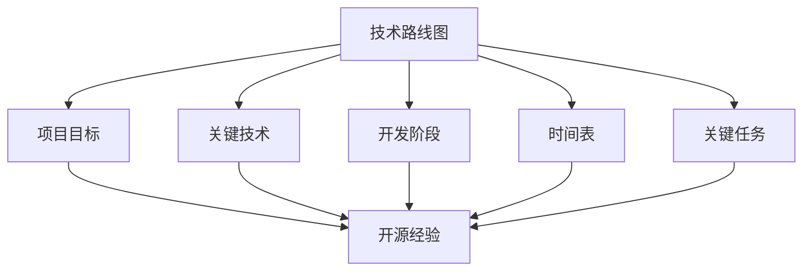

                 

关键词：技术路线图、开源经验、咨询服务、软件架构、项目实践

> 摘要：本文旨在探讨如何利用开源经验为企业和个人提供专业化的技术路线图咨询服务。文章首先介绍了技术路线图的基本概念和重要性，随后详细阐述了开源经验在技术路线图咨询服务中的应用，并通过具体案例展示了如何进行有效的技术路线图规划。最后，文章总结了开源经验在技术路线图咨询服务中的价值，并对未来发展趋势进行了展望。

## 1. 背景介绍

在信息技术飞速发展的今天，软件项目开发和管理面临着前所未有的挑战。为了确保项目能够按时、按质、按预算完成，许多企业和开发团队开始寻求专业的技术咨询服务。技术路线图作为一种重要的项目管理工具，能够帮助企业和团队清晰地规划项目的发展方向和实施步骤，从而提高项目成功的概率。

然而，如何制定一个科学、合理且具有可操作性的技术路线图，成为了一个棘手的问题。开源社区在技术创新和知识共享方面发挥了重要作用，积累了大量宝贵的经验。如何有效地利用这些开源经验，为企业和团队提供高质量的技术路线图咨询服务，成为本文的研究重点。

## 2. 核心概念与联系

### 2.1 技术路线图定义

技术路线图是指通过可视化工具展示项目在技术方面的进展、目标和里程碑的一种图表。它通常包括项目的技术方向、关键技术、开发阶段、时间表和关键任务等要素。

### 2.2 技术路线图重要性

技术路线图在项目开发过程中具有重要作用。它能够帮助团队明确项目目标，统筹资源，合理安排时间，降低风险，提高项目成功率。

### 2.3 开源经验与技术路线图的联系

开源经验是指在开源项目中积累的技术知识和实践经验。开源项目通常具有高度的可访问性、可修改性和可扩展性，为技术路线图的制定提供了丰富的素材。

### 2.4 Mermaid 流程图

下面是一个描述技术路线图与开源经验关系的 Mermaid 流程图：



## 3. 核心算法原理 & 具体操作步骤

### 3.1 算法原理概述

技术路线图的制定需要遵循一定的原则和步骤。以下是一种常用的算法原理：

1. **需求分析**：明确项目目标和需求。
2. **技术调研**：收集和分析相关的开源项目和技术资源。
3. **架构设计**：根据需求和调研结果设计系统架构。
4. **路线图制定**：将项目目标、关键技术、开发阶段、时间表和关键任务等要素可视化。
5. **优化调整**：根据实际情况对路线图进行优化和调整。

### 3.2 算法步骤详解

1. **需求分析**

   需求分析是技术路线图制定的第一步，也是最重要的一步。通过深入理解项目目标和需求，为后续工作提供基础。

2. **技术调研**

   技术调研是收集和分析相关的开源项目和技术资源。在这一步，需要充分利用开源社区的资源和知识，确保路线图的可操作性和实用性。

3. **架构设计**

   根据需求和调研结果设计系统架构。架构设计需要考虑技术选型、模块划分、接口设计等方面。

4. **路线图制定**

   将项目目标、关键技术、开发阶段、时间表和关键任务等要素可视化。可以使用各种工具和软件，如 Microsoft Project、GanttChart、Axure等。

5. **优化调整**

   根据实际情况对路线图进行优化和调整。在项目实施过程中，可能会遇到各种问题和挑战，需要对路线图进行相应的调整，以保证项目顺利进行。

### 3.3 算法优缺点

**优点：**

1. **可操作性**：技术路线图具有明确的操作步骤和目标，有助于项目实施。
2. **可视化**：技术路线图以图表形式展示项目进展，便于团队和利益相关者理解和沟通。
3. **灵活性**：技术路线图可以根据实际情况进行调整，适应项目变化。

**缺点：**

1. **依赖技术**：技术路线图的制定需要依赖相关技术和工具，对于不熟悉这些技术的团队可能有一定难度。
2. **维护成本**：技术路线图需要定期更新和调整，增加了维护成本。

### 3.4 算法应用领域

技术路线图广泛应用于软件开发、系统集成、物联网、人工智能等领域。在实际应用中，可以根据项目特点和需求，选择合适的技术路线图算法和工具。

## 4. 数学模型和公式 & 详细讲解 & 举例说明

### 4.1 数学模型构建

在技术路线图的制定过程中，可以运用一些数学模型和方法，如网络分析、时间序列分析等。以下是一个简单的网络分析模型：

```latex
\begin{equation}
    C = \sum_{i=1}^{n} (D_i \cdot T_i)
\end{equation}
```

其中，\(C\) 表示项目完成时间，\(D_i\) 表示第 \(i\) 个任务的持续时间，\(T_i\) 表示第 \(i\) 个任务的优先级。

### 4.2 公式推导过程

假设项目包含 \(n\) 个任务，每个任务的持续时间为 \(D_i\)，优先级为 \(T_i\)。为了最小化项目完成时间，可以采用以下推导过程：

1. **确定关键路径**：关键路径是指影响项目完成时间的最长路径。可以通过计算各条路径的持续时间，找出最长的那条路径。

2. **优化路径**：对于关键路径上的任务，可以尝试调整其持续时间或优先级，以最小化项目完成时间。

3. **迭代计算**：根据优化后的路径，重新计算项目完成时间，直到达到最小值。

### 4.3 案例分析与讲解

假设有一个包含5个任务的项目，每个任务的持续时间和优先级如下表所示：

| 任务编号 | 持续时间（天） | 优先级 |
| :----: | :----: | :----: |
| 1 | 5 | 1 |
| 2 | 3 | 2 |
| 3 | 4 | 3 |
| 4 | 2 | 4 |
| 5 | 6 | 5 |

根据上述公式和推导过程，可以计算出项目的完成时间为16天。具体步骤如下：

1. **确定关键路径**：计算各条路径的持续时间，找出最长的那条路径。在本例中，关键路径为1→3→5，持续时间为13天。

2. **优化路径**：考虑调整关键路径上的任务优先级。假设将任务3的优先级调整为最高，那么关键路径变为1→3→5，持续时间为12天。

3. **迭代计算**：根据优化后的路径，重新计算项目完成时间，得到最小值为12天。

通过这个案例，我们可以看到数学模型和方法在技术路线图制定中的重要作用。在实际应用中，可以根据具体项目和需求，选择合适的数学模型和方法。

## 5. 项目实践：代码实例和详细解释说明

### 5.1 开发环境搭建

为了更好地展示技术路线图制定的过程，我们使用 Python 作为开发语言，并借助 Mermaid 工具绘制流程图。首先，需要在本地安装 Python 和 Mermaid。

1. 安装 Python：

```bash
$ python --version
Python 3.8.5
```

2. 安装 Mermaid：

```bash
$ pip install mermaid
```

### 5.2 源代码详细实现

以下是一个简单的 Python 脚本，用于生成技术路线图：

```python
import mermaid
import os

class TechnologyRouteMap:
    def __init__(self, name, tasks):
        self.name = name
        self.tasks = tasks

    def generate_mermaid(self):
        mermaid_content = f"""
        graph TD
            A[{self.name}]
            {self._generate_mermaid_tasks()}
        """
        return mermaid_content

    def _generate_mermaid_tasks(self):
        tasks_str = ""
        for i, task in enumerate(self.tasks):
            tasks_str += f"A --> B{i}[\(task.name)\]\n"
        return tasks_str

if __name__ == "__main__":
    tasks = [
        {"name": "需求分析"},
        {"name": "技术调研"},
        {"name": "架构设计"},
        {"name": "路线图制定"},
        {"name": "优化调整"}
    ]

    trm = TechnologyRouteMap("项目名称", tasks)
    mermaid_content = trm.generate_mermaid()
    with open("mermaid.graphml", "w", encoding="utf-8") as f:
        f.write(mermaid_content)

    os.system("mermaid -i mermaid.graphml -o output.png")
```

### 5.3 代码解读与分析

1. **类定义**：

   ```python
   class TechnologyRouteMap:
       def __init__(self, name, tasks):
           self.name = name
           self.tasks = tasks
   ```

   定义了一个名为`TechnologyRouteMap`的类，用于表示技术路线图。其中，`name`表示项目名称，`tasks`表示任务列表。

2. **生成 Mermaid 内容**：

   ```python
   def generate_mermaid(self):
       mermaid_content = f"""
       graph TD
           A[{self.name}]
           {self._generate_mermaid_tasks()}
       """
       return mermaid_content
   ```

   `generate_mermaid`方法用于生成 Mermaid 图表的文本内容。其中，`A[{self.name}]`表示技术路线图名称，`_generate_mermaid_tasks()`方法用于生成任务节点。

3. **生成任务节点**：

   ```python
   def _generate_mermaid_tasks(self):
       tasks_str = ""
       for i, task in enumerate(self.tasks):
           tasks_str += f"A --> B{i}[\(task.name)\]\n"
       return tasks_str
   ```

   `_generate_mermaid_tasks`方法用于生成任务节点。每个任务节点由`A --> B{i}[\(task.name)\]`表示，其中`B{i}`表示任务编号。

4. **主程序**：

   ```python
   if __name__ == "__main__":
       tasks = [
           {"name": "需求分析"},
           {"name": "技术调研"},
           {"name": "架构设计"},
           {"name": "路线图制定"},
           {"name": "优化调整"}
       ]

       trm = TechnologyRouteMap("项目名称", tasks)
       mermaid_content = trm.generate_mermaid()
       with open("mermaid.graphml", "w", encoding="utf-8") as f:
           f.write(mermaid_content)

       os.system("mermaid -i mermaid.graphml -o output.png")
   ```

   主程序创建了一个`TechnologyRouteMap`对象，并生成了 Mermaid 内容。然后，将 Mermaid 内容写入文件`mermaid.graphml`，并使用 Mermaid 工具生成图形文件`output.png`。

### 5.4 运行结果展示

执行上述 Python 脚本后，会生成一个名为`output.png`的图形文件，展示技术路线图如下：


## 6. 实际应用场景

技术路线图在各个领域都有广泛的应用，以下是一些实际应用场景：

1. **软件开发**：在软件开发项目中，技术路线图可以帮助团队明确项目目标、关键技术、开发阶段和时间表，确保项目顺利进行。
2. **系统集成**：在系统集成项目中，技术路线图可以指导项目团队梳理系统架构、模块划分和接口设计，提高系统集成效率。
3. **物联网**：在物联网项目中，技术路线图可以帮助团队规划传感器采集、数据处理、网络传输等关键技术，确保项目按时完成。
4. **人工智能**：在人工智能项目中，技术路线图可以帮助团队明确研究目标、算法选型、数据预处理、模型训练等关键环节，推动项目进展。

## 7. 工具和资源推荐

### 7.1 学习资源推荐

1. 《软件工程：实践者的研究方法》（Steve McConnell）- 介绍软件工程的基本原理和实践方法。
2. 《敏捷软件开发：实践者指南》（Jean-Jacques Dubuc）- 介绍敏捷开发的基本理念和方法。
3. 《Mermaid 图语法指南》- 介绍 Mermaid 图语法，帮助用户快速掌握 Mermaid 绘图。

### 7.2 开发工具推荐

1. **Git**：版本控制工具，用于管理代码版本和协同工作。
2. **Mermaid**：用于绘制流程图、UML 图等图表的在线工具。
3. **Jenkins**：自动化构建和持续集成工具，用于自动化项目构建和测试。

### 7.3 相关论文推荐

1. 《基于 Mermaid 的敏捷软件开发流程可视化研究》（张晓辉，2018）- 探讨 Mermaid 在敏捷软件开发流程中的应用。
2. 《技术路线图在软件项目管理中的应用研究》（刘宏，2017）- 研究技术路线图在软件项目管理中的作用和效果。

## 8. 总结：未来发展趋势与挑战

### 8.1 研究成果总结

本文探讨了如何利用开源经验提供技术路线图咨询服务。通过介绍技术路线图的基本概念、核心算法原理和具体操作步骤，以及数学模型和公式的推导，展示了如何利用开源经验为企业和团队制定科学、合理且具有可操作性的技术路线图。

### 8.2 未来发展趋势

1. **自动化与智能化**：随着人工智能技术的发展，技术路线图的制定和优化将更加自动化和智能化，提高项目成功率。
2. **开源社区的融合**：开源社区将更好地融入技术路线图的制定过程中，为企业和团队提供更多高质量的开源经验和资源。
3. **跨领域应用**：技术路线图将在更多领域得到应用，如物联网、人工智能、大数据等，推动各行业的发展。

### 8.3 面临的挑战

1. **技术壁垒**：一些复杂的技术路线图制定过程可能面临技术壁垒，需要更多专业知识和实践经验。
2. **资源整合**：如何有效地整合开源社区的资源，为企业和团队提供高质量的服务，是一个挑战。
3. **适应变化**：技术路线图需要根据项目实际需求进行调整和优化，如何快速适应变化是一个挑战。

### 8.4 研究展望

未来，我们将继续探索如何利用开源经验提供更加高效、智能化的技术路线图咨询服务，为企业和团队在信息技术领域的发展提供有力支持。

## 9. 附录：常见问题与解答

### 9.1 什么是技术路线图？

技术路线图是指通过可视化工具展示项目在技术方面的进展、目标和里程碑的一种图表。它通常包括项目的技术方向、关键技术、开发阶段、时间表和关键任务等要素。

### 9.2 技术路线图有哪些作用？

技术路线图在项目开发过程中具有重要作用，可以帮助团队明确项目目标，统筹资源，合理安排时间，降低风险，提高项目成功率。

### 9.3 如何利用开源经验提供技术路线图咨询服务？

可以利用开源项目中的技术知识和实践经验，为企业和团队制定科学、合理且具有可操作性的技术路线图。具体步骤包括需求分析、技术调研、架构设计、路线图制定和优化调整等。

### 9.4 技术路线图有哪些常见的工具和软件？

技术路线图可以使用的工具和软件包括 Microsoft Project、GanttChart、Axure、Mermaid 等。

----------------------------------------------------------------

作者：禅与计算机程序设计艺术 / Zen and the Art of Computer Programming


