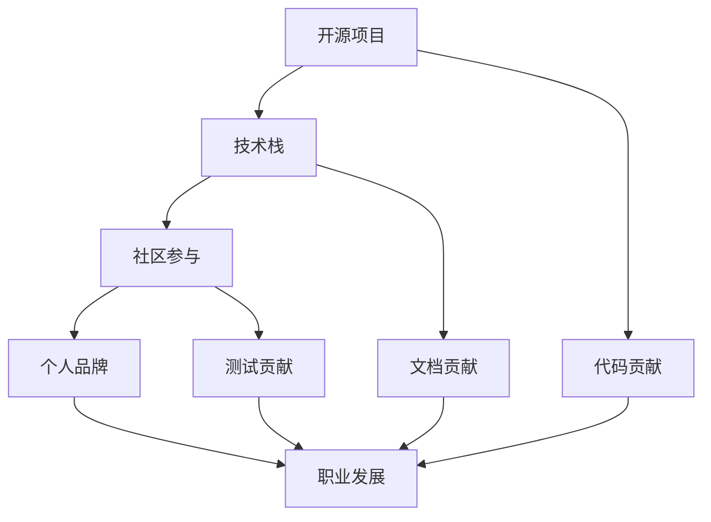

                 

关键词：开源贡献，职业发展，技术社区，个人品牌，技能提升

> 摘要：本文将探讨如何通过开源贡献提升职业发展。我们将从开源社区的重要性、参与开源的贡献类型、如何选择项目、贡献的最佳实践，以及开源贡献对职业发展的影响等方面进行深入分析，旨在为技术专业人士提供切实可行的建议和指导。

## 1. 背景介绍

开源软件运动始于20世纪90年代，由自由软件和开放源代码的理念推动。随着互联网的发展，开源软件逐渐成为软件开发的主要模式之一。现如今，许多大型企业和组织都在使用开源软件，例如Linux操作系统、Apache Web服务器、MySQL数据库等。同时，越来越多的开发者和企业参与到开源项目中，这不仅有助于推动技术的进步，也为个人和团队的职业发展提供了广阔的平台。

在开源社区中，每个人都有机会通过贡献代码、文档、测试等来参与项目，并从中学习、成长。对于技术专业人士来说，开源贡献不仅是一种技术实践，更是一种职业发展的策略。本文将围绕这一主题展开讨论，旨在帮助读者了解如何通过开源贡献来实现职业发展的目标。

### 1.1 开源社区的现状

据GitHub的报告，全球约有6800万人使用GitHub，这个平台已经成为开源社区的核心。在GitHub上，有超过5400万个开源项目，涵盖了各种编程语言和领域。这不仅展示了开源项目的多样性，也反映了开源社区的活力。

此外，开源社区不仅仅是一个技术交流的平台，它还培养了大量的合作精神和互助文化。许多开源项目的成功离不开社区成员的共同努力，这种协作精神对技术专业人士的职业发展具有重要意义。

### 1.2 开源贡献的类型

开源贡献的形式多种多样，包括但不限于以下几种：

1. **代码贡献**：这是最常见的贡献形式，通过提交代码修复bug、添加新功能或优化代码来贡献项目。
2. **文档贡献**：撰写或完善项目的文档，帮助其他开发者更好地理解和使用项目。
3. **测试贡献**：编写和执行测试用例，确保项目的质量和稳定性。
4. **设计贡献**：参与项目的架构设计，提供专业的意见和建议。
5. **翻译贡献**：翻译项目的文档或代码，使得项目能够被全球的开发者使用。
6. **社区贡献**：参与社区讨论，帮助解决问题，组织活动等。

通过这些形式的贡献，技术专业人士可以在开源社区中积累丰富的经验，提升自己的技能，同时建立自己的个人品牌。

## 2. 核心概念与联系

在深入讨论如何通过开源贡献提升职业发展之前，我们需要理解一些核心概念，包括开源项目、技术栈、社区参与等。以下是一个简单的Mermaid流程图，展示了这些概念之间的联系。



### 2.1 开源项目

开源项目是指那些发布源代码，允许用户自由查看、修改和分发软件的项目。开源项目通常具有以下特点：

1. **开源协议**：例如GPL、MIT、Apache等，这些协议规定了用户如何使用和分发代码。
2. **贡献指南**：项目通常会有贡献指南，详细说明了如何参与项目，包括代码贡献、文档贡献等。
3. **版本控制系统**：如Git，用于管理代码的版本和历史。
4. **代码库**：通常托管在诸如GitHub、GitLab等平台上。

### 2.2 技术栈

技术栈是指一个项目中使用的技术、工具和框架的集合。技术栈的选择通常取决于项目的需求和团队的技能。在开源项目中，技术栈的多样性使得开发者可以接触到各种编程语言、框架和工具，从而拓宽自己的技术视野。

### 2.3 社区参与

社区参与是开源项目的核心，它包括但不限于：

1. **代码贡献**：提交代码、修复bug、添加新功能等。
2. **文档贡献**：撰写或更新项目的文档。
3. **测试贡献**：编写和执行测试用例。
4. **社区讨论**：在论坛、邮件列表、聊天室等平台参与讨论，帮助解决问题。

通过积极参与社区，开发者可以与志同道合的人交流，学习新技术，提升自己的技能。

### 2.4 个人品牌

个人品牌是指个人在公众眼中的形象和声誉。在开源社区中，个人品牌通常通过以下方式建立：

1. **技术博客**：撰写高质量的技术博客，分享自己的见解和经验。
2. **GitHub账号**：维护一个完善的GitHub账号，展示自己的代码贡献和项目。
3. **演讲与会议**：参加技术会议，发表演讲，展示自己的专业能力。

一个强大的个人品牌可以吸引更多的机会，如招聘、合作项目等。

### 2.5 职业发展

职业发展是指个人在职业生涯中的成长和进步。通过开源贡献，开发者可以：

1. **提升技能**：通过参与不同的开源项目，学习新的技术和工具。
2. **建立人脉**：与业内专家和同行建立联系，拓宽职业网络。
3. **增加曝光度**：通过开源贡献和社区活动，提高自己在行业中的知名度。

以上这些都有助于职业发展，特别是在求职和职业晋升方面。

## 3. 核心算法原理 & 具体操作步骤

在开源贡献中，算法原理的理解和实现是关键的一环。以下我们将介绍如何通过具体的操作步骤参与开源项目的算法贡献。

### 3.1 算法原理概述

算法原理是指解决特定问题的一系列操作步骤和规则。在开源项目中，常见的算法原理包括排序算法、搜索算法、图算法等。每种算法都有其独特的原理和实现方式。

### 3.2 算法步骤详解

以下是参与开源项目算法贡献的具体步骤：

1. **了解项目需求**：首先，要仔细阅读项目的文档，了解项目的需求和目标。这有助于你确定自己可以贡献的算法类型。
2. **选择算法**：根据项目的需求和自己的专长，选择一个适合的算法。例如，如果项目需要一个排序算法，你可以选择快速排序、归并排序等。
3. **算法实现**：实现所选算法，确保代码的正确性和效率。在实现过程中，要遵循项目的编程规范，确保代码的可读性和可维护性。
4. **代码审查**：在提交代码之前，进行代码审查，检查代码的语法错误、逻辑错误等。
5. **提交代码**：通过项目的版本控制系统（如Git）提交代码，并填写详细的提交说明，以便其他开发者了解你的改动。
6. **处理反馈**：根据其他开发者的反馈，修改和完善你的代码，直至通过代码审查。

### 3.3 算法优缺点

每种算法都有其优缺点。以下是一些常见算法的优缺点：

1. **快速排序**：优点是平均时间复杂度为\(O(n \log n)\)，且效率较高；缺点是空间复杂度较高，为\(O(\log n)\)。
2. **归并排序**：优点是时间复杂度为\(O(n \log n)\)，且稳定性好；缺点是空间复杂度为\(O(n)\)，且效率相对较低。
3. **二分查找**：优点是时间复杂度为\(O(\log n)\)，且效率高；缺点是需要有序的数据集合，且在数据量较大时容易出现缓存失效问题。

### 3.4 算法应用领域

算法的应用领域非常广泛，包括但不限于以下几种：

1. **数据处理**：如排序、搜索等算法，常用于处理大规模数据。
2. **网络算法**：如路由算法、网络流算法等，用于优化网络性能。
3. **机器学习**：如支持向量机、决策树等算法，用于训练和预测模型。

通过参与开源项目的算法贡献，开发者可以深入了解各种算法的原理和应用，提升自己的技术水平。

## 4. 数学模型和公式 & 详细讲解 & 举例说明

在开源项目中，数学模型和公式的运用是非常常见的。以下我们将介绍如何构建数学模型，推导公式，并通过实例进行说明。

### 4.1 数学模型构建

数学模型是一种描述现实世界问题抽象化的数学结构。构建数学模型通常需要以下几个步骤：

1. **明确问题背景**：首先，要明确问题的背景和目标，这有助于你确定需要哪些变量和参数。
2. **定义变量和参数**：根据问题的背景，定义变量和参数，确保它们有明确的物理或数学意义。
3. **建立关系式**：通过变量和参数之间的关系式，建立数学模型。这通常涉及到函数、方程等数学工具。

### 4.2 公式推导过程

在构建数学模型后，我们需要推导出相关的公式。以下是一个简单的例子：

假设我们有一个线性模型，其公式为：

\[ y = ax + b \]

其中，\( y \) 是因变量，\( x \) 是自变量，\( a \) 和 \( b \) 是参数。

要推导这个公式，我们可以使用最小二乘法。具体步骤如下：

1. **收集数据**：首先，我们需要收集一些数据点，例如 \((x_1, y_1), (x_2, y_2), ..., (x_n, y_n)\)。
2. **计算均值**：计算自变量和因变量的均值，即：

\[ \bar{x} = \frac{1}{n} \sum_{i=1}^{n} x_i \]
\[ \bar{y} = \frac{1}{n} \sum_{i=1}^{n} y_i \]

3. **计算协方差和方差**：计算自变量和因变量的协方差和方差，即：

\[ cov(x, y) = \frac{1}{n-1} \sum_{i=1}^{n} (x_i - \bar{x})(y_i - \bar{y}) \]
\[ var(x) = \frac{1}{n-1} \sum_{i=1}^{n} (x_i - \bar{x})^2 \]

4. **计算斜率 \( a \) 和截距 \( b \)**：

\[ a = \frac{cov(x, y)}{var(x)} \]
\[ b = \bar{y} - a\bar{x} \]

这样，我们就推导出了线性模型的公式。

### 4.3 案例分析与讲解

以下是一个使用线性模型进行房价预测的案例：

假设我们有以下数据：

| \( x \) | \( y \) |
| ------ | ------ |
| 1000   | 150000 |
| 2000   | 300000 |
| 3000   | 450000 |
| 4000   | 600000 |
| 5000   | 750000 |

要使用线性模型预测一个面积为 3000 平方英尺的房子价格，我们可以按照以下步骤操作：

1. **收集数据**：我们已经有了上述数据。
2. **计算均值**：

\[ \bar{x} = \frac{1}{5} (1000 + 2000 + 3000 + 4000 + 5000) = 3000 \]
\[ \bar{y} = \frac{1}{5} (150000 + 300000 + 450000 + 600000 + 750000) = 450000 \]

3. **计算协方差和方差**：

\[ cov(x, y) = \frac{1}{4} (200000 + 100000 + 0 + (-100000) + (-250000)) = -250000 \]
\[ var(x) = \frac{1}{4} (1000000 + 400000 + 0 + 400000 + 1000000) = 3000000 \]

4. **计算斜率 \( a \) 和截距 \( b \)**：

\[ a = \frac{-250000}{-3000000} = \frac{1}{12} \]
\[ b = 450000 - \frac{1}{12} \times 3000 = 412500 \]

因此，线性模型的公式为：

\[ y = \frac{1}{12} x + 412500 \]

要预测面积为 3000 平方英尺的房子价格，我们将 \( x = 3000 \) 代入公式：

\[ y = \frac{1}{12} \times 3000 + 412500 = 525000 \]

因此，预测面积为 3000 平方英尺的房子价格为 525000 美元。

这个案例展示了如何使用线性模型进行简单预测。在实际应用中，我们可能需要使用更复杂的模型，如多项式回归、神经网络等，以获得更准确的预测结果。

通过这个案例，我们可以看到数学模型和公式在开源项目中的应用。掌握这些工具，有助于我们更好地理解和参与开源项目。

## 5. 项目实践：代码实例和详细解释说明

在开源项目中，代码实践是提升技能和经验的关键环节。以下我们将通过一个具体的开源项目实例，详细解释代码的编写、实现以及相关的分析。

### 5.1 开发环境搭建

在开始编写代码之前，我们需要搭建一个适合开发的环境。以下是一个基于Python的简单开源项目，我们将使用Git和GitHub来管理代码。

1. **安装Git**：在终端中运行以下命令安装Git：

```bash
sudo apt-get install git
```

2. **安装Python**：确保你的系统中安装了Python 3，可以通过以下命令检查：

```bash
python3 --version
```

3. **创建虚拟环境**：为了隔离项目依赖，我们创建一个虚拟环境：

```bash
python3 -m venv venv
source venv/bin/activate
```

4. **安装依赖**：在虚拟环境中安装项目的依赖：

```bash
pip install -r requirements.txt
```

### 5.2 源代码详细实现

以下是一个简单的Python代码实例，用于实现一个简单的计算器功能。

```python
# calculator.py

def add(a, b):
    """返回两个数的和"""
    return a + b

def subtract(a, b):
    """返回两个数的差"""
    return a - b

def multiply(a, b):
    """返回两个数的积"""
    return a * b

def divide(a, b):
    """返回两个数的商，如果除数为0，则返回None"""
    if b == 0:
        return None
    return a / b

def main():
    """计算器主程序"""
    print("欢迎使用简易计算器！")
    while True:
        print("\n请选择操作：")
        print("1. 加法")
        print("2. 减法")
        print("3. 乘法")
        print("4. 除法")
        print("5. 退出")
        choice = input("输入选项（1-5）：")
        
        if choice == '5':
            print("感谢使用，再见！")
            break
        
        if choice not in ['1', '2', '3', '4']:
            print("无效输入，请重新输入。")
            continue
        
        a = float(input("输入第一个数："))
        b = float(input("输入第二个数："))
        
        if choice == '1':
            print(f"{a} + {b} = {add(a, b)}")
        elif choice == '2':
            print(f"{a} - {b} = {subtract(a, b)}")
        elif choice == '3':
            print(f"{a} * {b} = {multiply(a, b)}")
        elif choice == '4':
            result = divide(a, b)
            if result is None:
                print("除数不能为0。")
            else:
                print(f"{a} / {b} = {result}")

if __name__ == "__main__":
    main()
```

### 5.3 代码解读与分析

1. **函数定义**：代码中定义了四个函数，分别是`add`、`subtract`、`multiply`和`divide`。这些函数实现了基本的算术运算。

2. **输入处理**：`main`函数通过循环不断接收用户的输入，并调用相应的函数执行计算。

3. **异常处理**：在`divide`函数中，我们添加了异常处理，确保当除数为0时不会抛出异常。

4. **用户交互**：`main`函数提供了清晰的用户交互界面，使操作变得简单易懂。

### 5.4 运行结果展示

以下是运行计算器的示例结果：

```bash
欢迎使用简易计算器！

请选择操作：
1. 加法
2. 减法
3. 乘法
4. 除法
5. 退出
输入选项（1-5）：1
输入第一个数：10
输入第二个数：20
10 + 20 = 30

请选择操作：
2
输入第一个数：20
输入第二个数：10
20 - 10 = 10

请选择操作：
3
输入第一个数：5
输入第二个数：3
5 * 3 = 15

请选择操作：
4
输入第一个数：10
输入第二个数：0
除数不能为0。

请选择操作：
5
```

通过这个实例，我们可以看到如何使用Python实现一个简单的计算器。通过开源项目的实践，开发者可以不断提升自己的编程技能，同时积累宝贵的经验。

## 6. 实际应用场景

开源贡献不仅仅是一种技术实践，它在许多实际应用场景中发挥着重要作用。以下是一些具体的实际应用场景：

### 6.1 企业开发

许多企业依赖于开源技术来构建其产品和服务。例如，一些互联网公司使用开源框架和库来快速开发应用，如使用Spring Boot进行Java后端开发，使用React或Vue.js进行前端开发。通过参与这些开源项目，开发者可以深入了解其内部工作机制，从而更好地应用于企业开发。

### 6.2 研究项目

在学术研究领域，开源项目是推动科技进步的重要力量。许多研究项目会发布开源代码，以便其他研究者可以复现和扩展他们的工作。例如，在机器学习领域，许多研究论文会附带开源代码和数据集，以便其他研究者可以验证和改进这些算法。

### 6.3 个人项目

对于个人开发者来说，开源贡献是一个展示自己技能和创意的平台。通过开源项目，个人开发者可以吸引潜在雇主和合作伙伴，同时提升自己的知名度和影响力。例如，许多开发者通过GitHub上的项目展示自己的编程能力和项目经验，从而获得更好的工作机会。

### 6.4 社区协作

开源社区是一个高度协作的环境，社区成员可以共同解决问题，合作开发新的功能。例如，许多开源项目都会定期举办代码贡献日，鼓励社区成员共同参与项目开发。通过这种协作，开发者可以学习到不同的观点和技能，从而提升自己的综合素质。

### 6.5 用户体验优化

在开源项目中，用户体验的优化是一个重要方面。开发者可以通过改善文档、优化代码和界面，提升项目的用户体验。例如，一些开源项目的用户界面可能不够友好，通过贡献改进的界面设计和功能，可以大大提升用户的使用体验。

### 6.6 技术标准制定

开源项目在技术标准的制定中发挥着重要作用。通过开源社区的讨论和协作，可以制定出更加开放和灵活的技术标准。例如，HTML、CSS和JavaScript等Web技术标准都是在开源社区中逐步形成和完善的。

通过这些实际应用场景，我们可以看到开源贡献在推动技术进步、促进知识共享和提升个人职业发展中的重要作用。开源社区为技术专业人士提供了一个广阔的舞台，让他们可以在这个舞台上展示自己的才华，实现自己的职业目标。

### 6.7 未来应用展望

随着技术的不断进步和开源社区的日益壮大，开源贡献在未来将具有更加广泛和深远的应用前景。以下是几个可能的趋势和展望：

#### 6.7.1 自动化贡献

未来的开源贡献可能会更加自动化。例如，通过智能合约和区块链技术，开发者可以自动执行代码审核、版本控制和许可管理等任务。这不仅提高了开源项目的效率，也减少了人为错误的风险。

#### 6.7.2 增量贡献

增量贡献是指开发者可以在项目中的任何阶段做出贡献，而不是等待完整的项目完成。这种模式鼓励了更多的参与者参与到开源项目中，特别是在项目初期，增量的代码贡献可以帮助项目快速成长和稳定。

#### 6.7.3 人工智能与开源

人工智能技术的发展将使开源贡献更加智能化。例如，自动化代码生成和优化工具可以帮助开发者更高效地编写代码，同时智能审核系统可以自动检测代码中的潜在问题，提高代码质量。

#### 6.7.4 跨领域合作

未来，开源社区将进一步加强跨领域的合作。不同的领域和行业之间的协作将促进技术的融合和创新。例如，医疗、金融和制造业等行业的开发者可以共同贡献技术，开发出更先进的应用和服务。

#### 6.7.5 开源教育

随着开源的重要性日益凸显，开源教育也将成为一个重要领域。许多高校和教育机构已经开始将开源项目作为教学内容，培养新一代的开发者。通过开源教育，学生可以更早地接触和实践开源技术，提高自己的技能。

#### 6.7.6 社会责任

开源社区将更加注重社会责任。越来越多的开源项目将致力于解决全球性问题，如气候变化、医疗健康、贫困等。通过开源贡献，开发者不仅可以实现个人职业发展，还可以为社会的进步贡献力量。

总的来说，未来开源贡献将在技术进步、知识共享和职业发展等方面发挥更加重要的作用。随着新技术的涌现和开源社区的不断发展，开源贡献将继续成为技术专业人士不可或缺的一部分。

### 7. 工具和资源推荐

为了更有效地参与开源贡献，掌握一些工具和资源是至关重要的。以下是一些建议：

#### 7.1 学习资源推荐

1. **GitHub**：GitHub是最流行的开源代码托管平台，提供了丰富的教程和文档。
2. **GitLab**：GitLab是企业级Git托管服务，适用于大型项目和企业级管理。
3. **Stack Overflow**：一个庞大的开发者社区，提供了大量的编程问题和解决方案。
4. **Medium**：一个内容平台，许多开发者在此分享技术见解和经验。
5. **鸟哥的Linux私房菜**：一本经典的Linux入门书籍，适合初学者。

#### 7.2 开发工具推荐

1. **Visual Studio Code**：一款功能强大的跨平台代码编辑器，适用于多种编程语言。
2. **PyCharm**：一款流行的Python集成开发环境，提供了丰富的功能和插件。
3. **Jenkins**：一个开源的持续集成工具，用于自动化构建和测试。
4. **Docker**：一个容器化平台，用于打包和分发应用程序。
5. **Jupyter Notebook**：一个交互式的计算环境，适用于数据科学和机器学习。

#### 7.3 相关论文推荐

1. **"Open Source Software Development: Community-Based and Gendered Perspectives"**：探讨了开源软件开发的社区和性别因素。
2. **"The Case for Open Source"**：阐述了开源软件的优点和其在商业领域的应用。
3. **"The Cathedral and the Bazaar"**：关于开源软件开发模式的重要论文。
4. **"Understanding Open Source Software Development"**：对开源软件开发过程的深入分析。

通过使用这些工具和资源，开发者可以更有效地参与开源贡献，提升自己的技能和经验。

### 8. 总结：未来发展趋势与挑战

开源贡献在推动技术进步和职业发展中起着至关重要的作用。随着开源社区的日益成熟，开源贡献的未来发展趋势和面临的挑战也越来越显著。

#### 8.1 研究成果总结

过去的研究表明，开源项目在技术创新和知识共享方面具有显著优势。例如，开源项目通常具有更高的代码质量、更快的迭代速度和更广泛的用户反馈。这些优势不仅促进了技术的快速发展，也为个人和团队提供了丰富的学习和发展机会。

此外，开源社区中的协作和互助文化也促进了知识共享和技术传承。通过参与开源项目，开发者可以接触到各种复杂问题和解决方案，从而提升自己的技术水平和解决问题的能力。

#### 8.2 未来发展趋势

未来，开源贡献将继续向更智能、更协作和更开放的方向发展。以下是一些可能的发展趋势：

1. **自动化贡献**：随着人工智能和机器学习技术的发展，开源贡献可能会更加自动化。智能审核系统、自动化代码生成和优化工具将帮助开发者更高效地参与开源项目。
2. **增量贡献**：增量贡献模式将鼓励更多开发者参与开源项目，特别是在项目初期，增量的代码贡献可以帮助项目快速成长和稳定。
3. **跨领域合作**：开源社区将进一步加强跨领域的合作，不同领域和行业的开发者将共同贡献技术，推动技术的融合和创新。
4. **开源教育**：开源教育将成为重要趋势，越来越多的教育机构和高校将开源项目作为教学内容，培养新一代的开发者。
5. **社会责任**：开源社区将更加关注社会责任，越来越多的开源项目将致力于解决全球性问题，如气候变化、医疗健康、贫困等。

#### 8.3 面临的挑战

尽管开源贡献具有众多优势，但仍然面临着一些挑战：

1. **代码质量和安全性**：随着开源项目的规模和复杂度增加，确保代码质量和安全性变得越来越重要。开发者需要投入更多的时间和精力来审查和修复代码中的潜在问题。
2. **知识产权问题**：开源项目通常依赖于各种许可协议，开发者需要熟悉这些协议，并确保自己的贡献不会侵犯他人的知识产权。
3. **项目管理和维护**：大型开源项目通常需要更多的管理和维护工作，这要求项目领导者具备优秀的项目管理能力和沟通能力。
4. **时间管理**：参与开源项目可能会占用开发者大量的时间和精力，因此需要良好的时间管理技能，以确保项目和个人发展之间的平衡。
5. **社区文化**：开源社区中存在着各种文化差异和观点冲突，如何维护一个健康、和谐的社区氛围是开发者需要面对的挑战之一。

#### 8.4 研究展望

未来的研究可以从以下几个方面展开：

1. **开源贡献的模式和影响因素**：深入探讨影响开发者参与开源贡献的各种因素，如个人动机、项目特点、社区文化等，以更好地理解开源贡献的行为模式。
2. **开源项目的可持续性**：研究如何确保开源项目的长期可持续性，包括资金支持、社区管理等方面。
3. **开源教育和培训**：开发更有效的开源教育和培训方法，帮助更多开发者理解和参与开源项目。
4. **开源社区的多样性**：促进开源社区的多样性，减少性别、文化和地理差异，使开源社区更加包容和开放。

通过不断的研究和实践，开源贡献将在未来继续发挥重要作用，推动技术的进步和个人的职业发展。

### 9. 附录：常见问题与解答

在参与开源贡献的过程中，开发者可能会遇到各种问题。以下是一些常见问题及其解答：

#### 9.1 如何选择开源项目？

选择开源项目时，可以考虑以下因素：

1. **兴趣和专长**：选择与自己兴趣和专长相关的项目，这样更容易保持动力和投入更多精力。
2. **项目活跃度**：查看项目的GitHub仓库更新记录，确保项目是活跃的，有足够的社区支持。
3. **贡献指南**：优秀的开源项目通常会有详细的贡献指南，这有助于你了解如何参与项目。
4. **代码质量**：阅读项目的代码，评估代码的质量和架构，确保这是一个值得参与的项目。

#### 9.2 如何确保代码质量？

确保代码质量可以从以下几个方面入手：

1. **编码规范**：遵循项目的编码规范，确保代码的可读性和一致性。
2. **代码审查**：提交代码前，请其他开发者进行代码审查，发现问题并及时修改。
3. **测试**：编写和执行测试用例，确保代码的正确性和稳定性。
4. **静态代码分析**：使用静态代码分析工具，如SonarQube，检查代码中的潜在问题。

#### 9.3 如何处理代码审查反馈？

处理代码审查反馈时，可以采取以下策略：

1. **认真阅读反馈**：仔细阅读审查者的反馈，理解他们的意见和建议。
2. **及时回复**：及时回复审查者，表达自己的观点和修改方案。
3. **合理解释**：对于一些有争议的修改，提供合理的解释和依据。
4. **持续改进**：根据反馈不断改进代码，提高代码质量。

#### 9.4 如何管理开源项目的进度？

管理开源项目进度时，可以采用以下方法：

1. **制定计划**：制定详细的项目计划和里程碑，确保项目按计划推进。
2. **任务分配**：合理分配任务，确保每个参与者都能在自己的专长领域发挥最大的作用。
3. **持续沟通**：定期组织会议和讨论，确保项目成员之间的沟通和信息共享。
4. **跟踪进度**：使用项目管理工具，如JIRA或Trello，跟踪项目的进度和任务状态。

通过解决这些常见问题，开发者可以更加顺利地参与开源贡献，提升自己的技能和经验。希望这些解答能够为你的开源之旅提供帮助。

---

### 结论

开源贡献是一种既能提升个人技能，又能推动技术进步的有效途径。通过参与开源项目，开发者不仅可以学习到新的技术和工具，还能建立自己的个人品牌，拓展职业发展机会。本文详细介绍了如何通过开源贡献提升职业发展的各个方面，包括开源社区的重要性、贡献类型、项目选择、最佳实践以及开源贡献对职业发展的影响。希望读者能够通过本文的指导，积极参与开源贡献，实现自己的职业发展目标。

最后，感谢阅读本文，希望它能为你带来启发和帮助。如果你在开源贡献的过程中遇到任何问题，欢迎在社区中提问和交流，共同推动开源技术的发展。

---

**作者：禅与计算机程序设计艺术 / Zen and the Art of Computer Programming**

