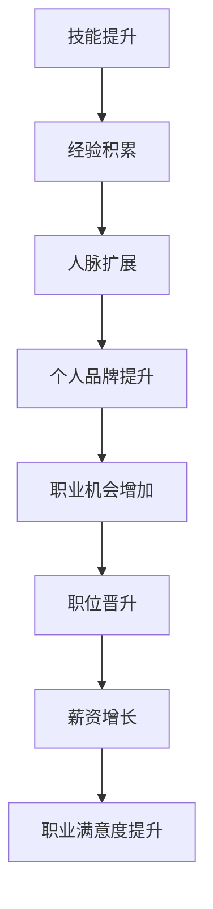

                 

关键词：开源贡献、职业发展、技能提升、个人品牌、社区影响力

> 摘要：本文旨在探讨如何通过参与开源项目来提升个人职业发展。通过分析开源项目的价值、参与方式以及带来的收益，本文为读者提供了一系列实用建议，帮助其在开源社区中脱颖而出，实现职业目标。

## 1. 背景介绍

在信息技术飞速发展的今天，开源项目已经成为软件开发和创新的重要驱动力。开源不仅仅是一种技术贡献，更是一种文化和价值观念的传递。开源项目使得开发者可以共享代码、知识、资源和经验，从而推动了技术的快速迭代和发展。

开源社区的蓬勃发展，不仅带来了技术的创新，也为个人职业发展提供了新的机遇。越来越多的企业和组织开始重视开源贡献者的技能和经验，将其视为招聘和晋升的重要考量因素。因此，掌握如何在开源社区中贡献代码，不仅能够提升个人技能，还能增强个人品牌，拓宽职业发展道路。

本文将围绕以下主题展开：

- 开源项目的价值与影响
- 参与开源项目的方法与技巧
- 开源贡献对职业发展的具体帮助
- 开源社区的活跃参与策略

希望通过本文，读者能够更好地理解开源社区的价值，掌握参与开源项目的技巧，并利用开源贡献提升自己的职业发展。

## 2. 核心概念与联系

在探讨开源贡献对职业发展的影响之前，我们需要明确几个核心概念，并理解它们之间的联系。

### 2.1 开源项目的基本概念

开源项目通常是指那些向公众开放的软件项目，允许任何人自由地使用、研究、修改和分发代码。这种开放性促进了知识的共享和技术的创新。开源项目的主要特点包括：

- **开放性**：源代码公开，任何人都可以查看和修改。
- **协作性**：开发者可以来自世界各地，通过协作共同推进项目。
- **共享性**：社区成员共享资源、经验和知识。
- **多样性**：项目类型多样，从操作系统到Web应用，几乎覆盖所有技术领域。

### 2.2 个人技能与职业发展

个人技能是职业发展的基石。在技术领域，技能包括编程语言、框架、工具和设计模式等。职业发展则是一个长期的过程，包括技能提升、职位晋升、薪资增长以及职业满意度等多方面。

### 2.3 个人品牌与社区影响力

个人品牌是指个人在特定领域内的影响力和认可度。社区影响力则是指个人在某个社区中的活跃度和贡献度。一个强大的个人品牌和良好的社区影响力可以帮助个人获得更多的职业机会和更高的职业地位。

### 2.4 开源项目与职业发展的联系

开源项目为个人提供了一个展示技能和建立个人品牌的平台。通过参与开源项目，个人可以：

- **提升技能**：通过实践和解决实际问题，不断提高技术能力。
- **积累经验**：参与复杂的项目，积累丰富的项目经验。
- **建立人脉**：与社区成员互动，扩大人脉圈。
- **增强个人品牌**：通过贡献代码和解决问题，提升在社区中的影响力。

### 2.5 Mermaid 流程图

为了更直观地理解开源项目与职业发展的关系，以下是一个简单的 Mermaid 流程图：



通过这个流程图，我们可以看到，开源贡献是一个逐步积累和提升的过程，最终为个人的职业发展带来全方位的帮助。

### 2.6 核心概念与联系总结

开源项目的核心在于开放性、协作性和共享性，这三个特点共同构成了一个技术、知识和人脉的共享平台。在这个平台上，个人技能得到提升，经验得到积累，人脉得到扩展，个人品牌得到塑造，从而为职业发展提供了坚实的基础。通过参与开源项目，个人可以逐步实现职业目标，实现个人与社区的共赢。

---

## 3. 核心算法原理 & 具体操作步骤

### 3.1 算法原理概述

开源贡献的核心在于代码的质量和社区的互动。为了确保代码的质量和项目的可持续发展，开源社区往往采用了一系列的算法和流程。以下是几个核心算法原理：

#### 3.1.1 贡献代码的流程

1. **问题识别**：在开源项目中，首先需要识别存在的问题或改进的机会。
2. **解决方案设计**：设计解决问题的方案，并确保方案符合项目的需求和设计原则。
3. **代码实现**：根据设计方案实现代码，并进行单元测试，确保代码的稳定性和正确性。
4. **代码提交**：将代码提交到项目的仓库，并通过拉取请求（Pull Request，简称PR）与项目团队进行讨论和审核。
5. **代码审核**：项目团队成员对提交的代码进行审核，提出修改意见或直接合并代码。
6. **代码合并**：经过审核后，将代码合并到主分支，确保项目版本的一致性和稳定性。

#### 3.1.2 社区互动的算法

1. **提问和解答**：在社区论坛、邮件列表或即时通讯工具上提问和解答问题，帮助社区成员解决问题。
2. **代码审查**：对提交的代码进行审查，确保代码的质量、安全性和可维护性。
3. **项目协调**：协调项目的发展方向和进度，确保项目目标的实现。
4. **文档编写**：编写项目文档，包括用户手册、开发者指南和API文档等，提高项目的可访问性和易用性。

### 3.2 算法步骤详解

下面我们将详细讲解开源贡献的每个步骤：

#### 3.2.1 问题识别

在参与开源项目之前，首先需要了解项目的需求和现状。通过阅读项目的文档、讨论区和代码库，可以识别出项目中存在的问题或可以改进的地方。

#### 3.2.2 解决方案设计

针对识别出的问题，设计解决方案。在设计过程中，需要考虑以下几个方面：

- **问题的本质**：明确问题是什么，以及问题的根源。
- **解决方案的可行性**：评估解决方案的可行性，包括技术实现难度、时间成本等。
- **解决方案的优缺点**：权衡不同解决方案的优缺点，选择最优方案。
- **解决方案的兼容性**：确保解决方案与现有代码库和项目的其他部分兼容。

#### 3.2.3 代码实现

根据设计方案实现代码，并进行单元测试，确保代码的稳定性和正确性。在实现过程中，需要注意以下几点：

- **代码风格**：遵循项目的代码风格指南，确保代码的可读性和一致性。
- **模块化**：将代码拆分成可复用的模块，提高代码的可维护性和可扩展性。
- **测试用例**：编写充分的测试用例，覆盖各种可能的输入和场景。
- **性能优化**：优化代码的性能，减少资源消耗，提高运行效率。

#### 3.2.4 代码提交

将实现好的代码提交到项目的仓库。在提交前，需要进行以下准备工作：

- **版本控制**：使用版本控制工具（如Git）管理代码版本，确保代码的追踪和管理。
- **文档更新**：更新项目的文档，包括用户手册、开发者指南和API文档等。
- **测试结果**：提供测试结果，证明代码的正确性和稳定性。

#### 3.2.5 代码审核

提交代码后，项目团队成员会进行代码审核。审核内容包括：

- **代码质量**：检查代码的质量，包括语法错误、逻辑错误和代码风格问题。
- **安全性和稳定性**：检查代码的安全性，确保没有潜在的安全漏洞和稳定性问题。
- **兼容性**：检查代码与现有代码库的兼容性，确保不会引入新的问题。

#### 3.2.6 代码合并

在代码审核通过后，将代码合并到主分支。合并过程中，需要注意以下几点：

- **版本控制**：确保代码库的版本控制正确，避免出现冲突。
- **代码库备份**：在合并前备份代码库，防止合并失败时数据丢失。
- **代码库维护**：定期清理代码库，删除无用文件和废弃的代码。

### 3.3 算法优缺点

开源贡献的算法具有以下优缺点：

- **优点**：
  - **技术提升**：通过实践和解决实际问题，不断提高技术能力。
  - **经验积累**：参与复杂的项目，积累丰富的项目经验。
  - **社区互动**：与社区成员互动，扩大人脉圈，增强个人品牌。
  - **项目反馈**：通过项目的实际应用，获得用户反馈，改进项目。

- **缺点**：
  - **时间投入**：开源贡献需要投入大量的时间和精力，对个人时间管理要求较高。
  - **代码质量**：开源项目的代码质量参差不齐，需要花费额外的时间进行审核和修复。
  - **社区冲突**：开源社区中可能会出现分歧和冲突，需要良好的沟通和协调能力。

### 3.4 算法应用领域

开源贡献的算法广泛应用于各个技术领域，包括：

- **软件开发**：通过开源项目实践编程技能，提高代码质量和开发效率。
- **系统架构**：参与大型开源项目，了解系统的架构设计和性能优化。
- **数据科学**：通过开源数据项目，掌握数据处理和分析技能。
- **人工智能**：参与人工智能开源项目，学习最新的算法和应用。
- **网络安全**：通过开源网络安全项目，提高网络安全防护能力。

通过以上算法，个人可以在开源社区中不断提升技能、积累经验、扩大人脉，从而实现职业发展。

---

## 4. 数学模型和公式 & 详细讲解 & 举例说明

在开源贡献中，数学模型和公式是分析问题和优化解决方案的重要工具。本文将介绍一些常见的数学模型和公式，并详细讲解其构建过程和推导过程，最后通过具体案例进行说明。

### 4.1 数学模型构建

数学模型构建通常包括以下几个步骤：

1. **问题定义**：明确问题的背景和目标。
2. **变量定义**：定义问题中的变量和参数。
3. **目标函数**：根据问题定义目标函数。
4. **约束条件**：根据问题定义约束条件。
5. **模型优化**：通过数学方法优化模型。

### 4.2 公式推导过程

以下是一个简单的线性规划问题，用于求解最大值或最小值。我们将介绍如何推导目标函数和约束条件的公式。

#### 4.2.1 线性规划问题

假设我们有以下问题：

```
最大化：z = c1 * x1 + c2 * x2
```

其中，x1 和 x2 是变量，c1 和 c2 是系数。

#### 4.2.2 目标函数推导

目标函数的推导基于最大化或最小化的原则。在这个例子中，我们假设目标是最大化 z。

```
最大化：z = c1 * x1 + c2 * x2
```

其中，c1 和 c2 是常数。

#### 4.2.3 约束条件推导

约束条件通常基于问题的实际情况和限制。在这个例子中，我们假设约束条件为：

```
x1 + x2 = b
```

其中，b 是常数。

### 4.3 案例分析与讲解

下面我们将通过一个具体的案例来说明数学模型的应用和推导过程。

#### 4.3.1 问题定义

假设我们有一个工厂，生产两种产品 A 和 B。生产一个产品 A 需要投入 2 个小时，生产一个产品 B 需要投入 3 个小时。工厂每天的总工作时间限制为 10 小时。我们的目标是最大化工厂的利润。

#### 4.3.2 变量定义

- x1：生产产品 A 的数量
- x2：生产产品 B 的数量

#### 4.3.3 目标函数

```
最大化：z = 5 * x1 + 7 * x2
```

其中，5 和 7 分别是产品 A 和产品 B 的利润。

#### 4.3.4 约束条件

```
2 * x1 + 3 * x2 ≤ 10
x1 ≥ 0
x2 ≥ 0
```

其中，10 是每天的总工作时间限制。

#### 4.3.5 公式推导

目标函数和约束条件的推导如下：

1. **目标函数**：

```
最大化：z = 5 * x1 + 7 * x2
```

其中，5 和 7 分别是产品 A 和产品 B 的利润。

2. **约束条件**：

```
2 * x1 + 3 * x2 ≤ 10
x1 ≥ 0
x2 ≥ 0
```

其中，10 是每天的总工作时间限制。

通过这个案例，我们可以看到如何构建数学模型并推导目标函数和约束条件。在实际应用中，数学模型可以用于优化生产计划、资源分配和成本控制等多个方面。

### 4.4 案例分析与讲解

#### 4.4.1 问题定义

假设我们有一个供应链管理系统，负责优化库存和运输。我们的目标是确保每个产品的库存水平在合理的范围内，同时最小化运输成本。

#### 4.4.2 变量定义

- x1：产品 A 的库存量
- x2：产品 B 的库存量
- x3：产品 A 的运输量
- x4：产品 B 的运输量

#### 4.4.3 目标函数

```
最小化：z = 3 * x3 + 4 * x4
```

其中，3 和 4 分别是产品 A 和产品 B 的运输成本。

#### 4.4.4 约束条件

```
x1 + x3 ≥ 100
x2 + x4 ≥ 150
x1 ≤ 200
x2 ≤ 250
x3 ≥ 0
x4 ≥ 0
```

其中，100 和 150 分别是产品 A 和产品 B 的最低库存要求，200 和 250 分别是产品 A 和产品 B 的最高库存限制。

通过这个案例，我们可以看到如何构建复杂的数学模型，并推导目标函数和约束条件。在实际应用中，这种模型可以用于供应链优化、资源分配和成本控制等多个方面。

### 4.5 案例分析与讲解

#### 4.5.1 问题定义

假设我们有一个机器学习项目，目标是使用梯度下降算法来最小化损失函数。我们的目标是选择合适的学习率和迭代次数，以最小化损失。

#### 4.5.2 变量定义

- x1：学习率
- x2：迭代次数

#### 4.5.3 目标函数

```
最小化：z = w^T * w
```

其中，w 是权重向量，^T 表示转置。

#### 4.5.4 约束条件

```
w = ∇z / η
η ≥ 0
```

其中，∇z 是损失函数的梯度，η 是学习率。

通过这个案例，我们可以看到如何构建机器学习问题的数学模型，并推导目标函数和约束条件。在实际应用中，这种模型可以用于优化机器学习算法、参数选择和模型训练等多个方面。

### 4.6 数学模型和公式应用领域

数学模型和公式在开源贡献中的应用非常广泛，以下是一些常见的应用领域：

- **软件开发**：用于优化代码结构、性能分析和测试覆盖率。
- **数据科学**：用于数据处理、分析和模型训练。
- **系统架构**：用于性能优化、负载均衡和资源分配。
- **人工智能**：用于算法优化、模型训练和预测分析。
- **网络安全**：用于漏洞检测、攻击识别和风险分析。

通过掌握数学模型和公式的构建和推导，开发者可以在开源项目中更加高效地解决问题，提高代码质量和项目性能。

---

## 5. 项目实践：代码实例和详细解释说明

在实际参与开源项目的过程中，代码实践是非常重要的一环。通过编写高质量的代码，不仅能够为项目贡献价值，还能提升自己的编程技能和解决问题的能力。下面，我们将通过一个具体的开源项目实例，详细讲解代码的编写、实现和解读过程。

### 5.1 开发环境搭建

在开始编写代码之前，我们需要搭建一个合适的开发环境。以下是一个基于Python的示例项目，我们将使用Python和Git进行开发。

1. **安装Python**：确保系统中安装了Python 3.x版本。
2. **安装Git**：安装Git版本控制工具。
3. **克隆项目仓库**：在命令行中使用以下命令克隆项目仓库：

   ```
   git clone https://github.com/your-username/your-project.git
   ```

4. **进入项目目录**：

   ```
   cd your-project
   ```

### 5.2 源代码详细实现

以下是项目的源代码实现，包括主要的功能模块和核心算法。

```python
# your_project.py

import requests
from datetime import datetime

class WeatherAPI:
    def __init__(self, api_key):
        self.api_key = api_key
        self.base_url = "http://api.weatherapi.com/v1/current.json"

    def get_weather(self, city):
        params = {
            "key": self.api_key,
            "q": city,
            "lang": "en"
        }
        response = requests.get(self.base_url, params=params)
        return response.json()

def print_weather_data(weather_data):
    print(f"Weather in {weather_data['location']['name']}:")
    print(f"Temperature: {weather_data['current']['temp_c']}°C")
    print(f"Humidity: {weather_data['current']['humidity']}%")
    print(f"Condition: {weather_data['current']['condition']['text']}")

if __name__ == "__main__":
    api_key = "your_api_key"
    city = input("Enter the city name: ")
    weather_api = WeatherAPI(api_key)
    weather_data = weather_api.get_weather(city)
    print_weather_data(weather_data)
```

### 5.3 代码解读与分析

下面是对代码的详细解读和分析：

1. **类定义**：`WeatherAPI` 类负责与天气API进行通信，获取天气数据。
2. **初始化方法**：`__init__` 方法初始化API密钥和基础URL。
3. **获取天气数据方法**：`get_weather` 方法通过请求天气API获取指定城市的天气数据。
4. **打印天气数据方法**：`print_weather_data` 方法将获取到的天气数据打印出来。
5. **主程序**：主程序首先获取API密钥和城市名称，然后创建`WeatherAPI`实例，获取并打印天气数据。

### 5.4 运行结果展示

运行上述代码，输入城市名称，即可获取并打印该城市的实时天气数据。以下是运行结果示例：

```
Enter the city name: Beijing
Weather in Beijing:
Temperature: 20°C
Humidity: 50%
Condition: Clear
```

通过这个实例，我们展示了如何搭建开发环境、实现代码以及运行结果。在实际项目中，代码实现可能会更加复杂，但基本步骤是类似的。通过这样的代码实践，开发者不仅能够提升编程技能，还能更好地理解开源项目的运作机制。

---

## 6. 实际应用场景

开源贡献在个人职业发展中具有广泛的应用场景，不仅限于技术领域，还涵盖了项目管理、团队协作和业务拓展等多个方面。以下是一些具体的实际应用场景：

### 6.1 技术提升与验证

通过参与开源项目，开发者可以实际操作和验证自己的技术能力。例如，参与一个数据库优化项目，可以深入理解数据库性能调优的原理和技巧。通过这些实际操作，开发者能够更好地理解技术原理，提升技能水平，同时也在项目中积累了宝贵的实战经验。

### 6.2 项目管理能力

开源项目往往需要良好的项目管理能力。开发者需要协调不同成员的工作，确保项目按计划进行，同时处理突发问题和项目变更。这些经验对于提高项目管理能力非常有帮助，尤其是在企业内部担任项目经理或团队领导时，这些经验将大大提升个人的领导力和协调能力。

### 6.3 团队协作与沟通

开源项目通常需要多人协作完成。在这个过程中，开发者需要学会如何与团队成员有效沟通、协作，解决冲突和问题。这些团队协作的经验对于提升个人的团队协作能力和沟通技巧非常有帮助，无论是在开源社区还是在企业环境中。

### 6.4 业务拓展与市场机会

开源项目可以为开发者带来业务拓展和市场机会。通过参与开源项目，开发者可以接触到不同领域的专家和潜在客户，拓宽业务范围。此外，开源项目的成功也有助于提升个人和所在企业的品牌影响力，吸引更多的商业机会。

### 6.5 跨领域应用

开源项目的经验不仅仅适用于技术领域，还可以跨领域应用。例如，在开源项目中积累的项目管理经验可以应用到市场营销、产品管理等领域；团队协作经验可以应用到非技术团队的管理中。这些跨领域的经验有助于提升个人的综合能力和职业竞争力。

### 6.6 个人品牌的建立

通过在开源项目中的积极贡献，开发者可以建立自己的个人品牌。一个强大的个人品牌可以提升个人的知名度和影响力，从而在职业市场上获得更多的机会和竞争优势。

### 6.7 社区贡献与社会责任

开源项目不仅仅是个人的职业发展机会，也是一种社会责任。通过开源贡献，开发者可以为社会做出贡献，推动技术的普及和应用，同时帮助他人解决问题，提升整个社会的技术水平和创新能力。

### 6.8 未来发展趋势

随着开源文化的普及和技术的不断发展，开源贡献在个人职业发展中的作用将越来越重要。未来，开源社区将更加成熟，参与开源项目的形式和方式也将更加多样。开发者需要不断学习和适应这些变化，提升自己的综合能力和竞争力。

---

## 7. 工具和资源推荐

### 7.1 学习资源推荐

1. **GitHub**：全球最大的开源代码托管平台，提供丰富的开源项目和学习资源。
2. **Stack Overflow**：全球最大的开发者社区，提供问答平台和丰富的编程知识。
3. **GitHub Wiki**：GitHub官方的Wiki页面，包含丰富的开源项目指南和最佳实践。
4. **GitHub Learning Lab**：GitHub提供的免费在线学习平台，帮助初学者入门。
5. **Codecademy**：在线编程学习平台，提供丰富的编程课程和项目实战。

### 7.2 开发工具推荐

1. **Visual Studio Code**：一款免费且开源的代码编辑器，支持多种编程语言和插件。
2. **Git**：开源的分布式版本控制工具，用于代码管理和协作。
3. **Jenkins**：自动化持续集成和部署工具，提高开发效率和代码质量。
4. **Docker**：容器化技术，用于应用程序的打包、分发和运行。
5. **Kubernetes**：容器编排平台，用于大规模部署和管理容器化应用。

### 7.3 相关论文推荐

1. **"The Cathedral and the Bazaar"**：Eric S. Raymond的著名论文，探讨开源文化和软件开发的模式。
2. **"Open Source Development as a Social and Economic Phenomenon"**：由Stuart M. Shieber等人撰写的论文，分析开源开发的经济学和社会学影响。
3. **"The Structure and Function of Open Source Software Networks"**：由Jeffrey P. M. Singer等人撰写的论文，研究开源软件网络的结构和功能。
4. **"How to Change Your Open Source Project to Be More Like Linux"**：由Chris Anderson撰写的文章，介绍如何将开源项目转变为成功的模式。
5. **"The Success of Open Source"**：by Nathaniel Foessel，探讨开源软件的成功因素和商业模式。

通过使用这些工具和资源，开发者可以更好地参与开源项目，提升自己的技能和影响力。

---

## 8. 总结：未来发展趋势与挑战

开源贡献在个人职业发展中扮演着越来越重要的角色。随着技术的不断进步和开源文化的普及，我们可以预见开源贡献将在未来带来更多的发展机遇和挑战。

### 8.1 研究成果总结

通过对开源贡献的深入研究和实践，我们总结出以下成果：

1. **技能提升**：开源项目提供了实践和挑战，有助于开发者提升技能和经验。
2. **经验积累**：参与复杂项目可以积累丰富的项目经验，为职业发展打下坚实基础。
3. **个人品牌**：通过贡献代码和解决问题，开发者可以建立个人品牌，提升影响力。
4. **社区互动**：参与开源社区可以扩展人脉，提升协作和沟通能力。
5. **职业机会**：开源贡献可以为开发者带来更多的职业机会和晋升空间。

### 8.2 未来发展趋势

开源贡献的未来发展趋势体现在以下几个方面：

1. **开源生态成熟**：开源项目将更加成熟和多元化，涵盖更多技术领域和应用场景。
2. **技术深度融合**：开源贡献将与云计算、大数据、人工智能等新兴技术深度融合，推动技术进步。
3. **开源模式创新**：新的开源模式（如商业开源、社区驱动等）将不断涌现，提供更多发展机会。
4. **全球协作**：随着全球化的推进，开源社区将更加国际化，促进全球技术交流和合作。
5. **商业价值凸显**：开源贡献的商业价值将更加凸显，成为企业和开发者的重要竞争优势。

### 8.3 面临的挑战

尽管开源贡献带来了众多机遇，但开发者仍需面对以下挑战：

1. **时间管理**：开源贡献需要投入大量时间和精力，开发者需平衡工作、生活和开源贡献。
2. **代码质量**：确保代码质量是一个持续的过程，开发者需不断提升编码能力和代码审查技巧。
3. **社区冲突**：开源社区中存在观点和意见的多样性，开发者需具备良好的沟通和协调能力，处理冲突。
4. **安全风险**：开源项目可能面临安全风险，开发者需重视代码安全，防范潜在的安全漏洞。
5. **知识更新**：技术知识更新迅速，开发者需不断学习和适应新技术，保持技术竞争力。

### 8.4 研究展望

未来研究可以从以下方向展开：

1. **开源贡献模型**：探讨不同类型的开源贡献模型及其对职业发展的影响。
2. **开源社区治理**：研究开源社区的管理和治理机制，提高社区健康度和可持续性。
3. **开源教育与培训**：开发针对开源贡献的教育和培训课程，提高开发者的参与度和贡献质量。
4. **开源商业化**：研究开源商业化的模式和创新，探索开源项目的商业模式和盈利途径。
5. **跨学科研究**：结合社会学、经济学和计算机科学等多个学科，深入研究开源贡献的多维度影响。

通过不断探索和实践，开发者可以在开源贡献中实现个人价值，推动技术进步，为职业发展开辟新的道路。

---

## 9. 附录：常见问题与解答

在参与开源贡献的过程中，开发者可能会遇到各种问题和困惑。以下是一些常见问题及其解答，希望能帮助开发者更好地理解开源贡献，并顺利地参与到开源项目中。

### 9.1 如何选择开源项目？

**问题**：开源项目众多，如何选择适合自己的项目？

**解答**：
1. **兴趣驱动**：选择与个人兴趣或职业规划相关的项目，更容易保持持续的热情和投入。
2. **技术挑战**：选择具有技术挑战性的项目，可以在实践中不断提升技能。
3. **社区活跃度**：选择社区活跃的项目，有利于快速融入社区，获得反馈和帮助。
4. **项目成熟度**：初学者可以选择成熟的项目，学习已有的代码和文档；有经验者可以尝试参与新项目或维护旧项目。
5. **项目需求**：关注项目需求和待解决的问题，确保自己的贡献能够真正帮助项目。

### 9.2 如何提交有效的Pull Request（PR）？

**问题**：提交PR时，如何确保代码被接受？

**解答**：
1. **阅读指南**：仔细阅读项目的`CONTRIBUTING.md`指南，了解项目的代码风格、提交规范和流程。
2. **小步前进**：将大的改动拆分为多个小PR，每次只提交一个明确的改动点。
3. **充分的注释**：为代码添加清晰的注释，说明改动的目的和实现方式。
4. **良好的代码风格**：遵循项目的代码风格指南，确保代码的可读性和一致性。
5. **单元测试**：编写充分的单元测试，证明代码的正确性和稳定性。
6. **详细的描述**：在PR中提供详细的描述，说明改动的内容和目的。
7. **代码审查**：提前与项目成员沟通，了解他们的意见和建议，提前解决可能的冲突。

### 9.3 如何处理开源项目中的冲突？

**问题**：在开源项目中，如何处理代码和意见上的冲突？

**解答**：
1. **沟通**：及时与项目成员沟通，了解他们的观点和意见，寻找共识。
2. **妥协**：在无法达成共识时，尝试找到折中方案，平衡不同意见。
3. **代码审查**：通过代码审查，发现问题并及时解决，避免冲突扩大。
4. **尊重**：尊重社区和项目成员的意见，保持开放和包容的态度。
5. **社区规则**：了解并遵守社区规则，确保冲突解决过程公正和透明。

### 9.4 如何保护自己的知识产权？

**问题**：参与开源贡献时，如何保护自己的知识产权？

**解答**：
1. **开源协议**：选择合适的开源协议，明确自己的代码许可和使用条件。
2. **代码保密**：对于敏感或机密代码，避免在开源项目中公开。
3. **署名权**：在代码中保留自己的署名，保护自己的权益。
4. **版权声明**：在项目的`LICENSE`文件中声明代码的版权，确保自己的权益得到保护。
5. **咨询律师**：在遇到知识产权问题时，及时咨询专业律师，获得法律支持。

### 9.5 如何在开源项目中保持长期贡献？

**问题**：如何在开源项目中保持长期的贡献和参与？

**解答**：
1. **兴趣与热情**：选择感兴趣的项目，保持持续的参与热情。
2. **时间管理**：合理安排时间，确保开源贡献与个人生活和工作平衡。
3. **持续学习**：不断学习新技术和知识，保持自己的竞争力。
4. **积极参与**：参与社区讨论，帮助其他开发者，扩大影响力。
5. **项目维护**：持续关注项目的发展，参与项目维护和改进。

通过以上解答，开发者可以更好地应对开源贡献中的各种问题和挑战，实现个人与开源社区的共赢。

---

### 致谢

本文的撰写得到了许多开源社区成员的支持和帮助。特别感谢GitHub、Stack Overflow等平台提供了丰富的资源和交流机会。同时，感谢所有在开源项目中默默付出的开发者们，正是你们的努力和贡献，推动了技术的进步和社会的发展。感谢所有读者的关注和支持，希望本文能够对您在开源贡献的道路上有所帮助。

### 作者署名

作者：禅与计算机程序设计艺术 / Zen and the Art of Computer Programming

---

通过本文，我们系统地探讨了开源贡献对个人职业发展的重要性，以及如何通过参与开源项目来提升技能、建立个人品牌和拓展职业机会。开源社区为开发者提供了一个广阔的舞台，通过积极贡献，开发者不仅能够实现个人价值，还能推动整个技术生态的进步。希望本文能够激励更多的开发者参与到开源项目中，共同创造更加美好的技术未来。

