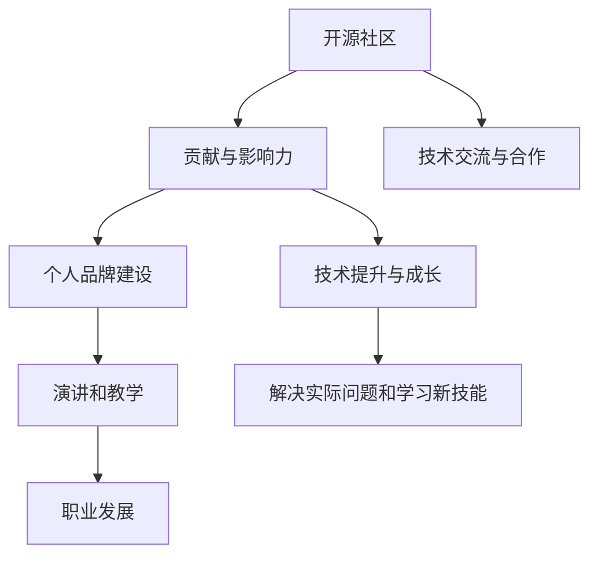

                 

关键词：开源贡献、演讲、教学、机会、技术交流、职业发展

> 摘要：本文将探讨如何通过参与开源项目，不仅提升自己的技术能力，还能获得演讲和教学的机会，从而在技术领域中建立起自己的声誉和影响力。本文将分析开源社区的重要性，介绍参与开源项目的方法和技巧，以及如何利用这些经历来打造个人品牌，并最终获得演讲和教学的机会。

## 1. 背景介绍

在当今快速发展的信息技术时代，开源软件已经成为软件开发的重要一环。许多企业和开发者都依赖开源项目来构建自己的产品和服务。与此同时，开源社区也提供了一个平台，使得技术爱好者、专业人士和初学者能够共同协作，分享知识和经验。在这种环境下，积极参与开源项目不仅能够提高个人技术水平，还能带来丰富的职业发展机会，其中包括演讲和教学。

开源社区之所以具有吸引力，一方面是因为它能够提供丰富的学习和成长资源，另一方面则是因为它能够促进技术交流和合作。通过参与开源项目，开发者可以接触到最新的技术趋势，解决实际问题，并在解决问题的过程中学习新的技能。此外，开源项目往往有广泛的用户基础和社区支持，这意味着参与者有机会接触到来自世界各地的开发者，从而拓宽自己的视野。

本文将围绕以下主题展开：

- 开源社区的重要性及其对个人职业发展的贡献。
- 如何参与开源项目并做出有意义的贡献。
- 利用开源贡献打造个人品牌的方法。
- 开源贡献如何帮助获得演讲和教学机会。
- 开源社区的常见问题和解答。

通过本文的阅读，读者将了解如何通过开源项目实现个人成长和职业发展，并获得演讲和教学的机会。

## 2. 核心概念与联系

要深入探讨如何利用开源贡献获得演讲和教学机会，我们首先需要理解几个核心概念及其之间的联系。

### 2.1 开源社区

开源社区是指由开发者、贡献者、用户和支持者组成的一个松散的协作网络。在这个网络中，参与者通过贡献代码、文档、测试、反馈等不同方式共同推进项目的发展。开源社区的核心价值观包括开放性、共享性和协作性，这使得社区成员能够自由地访问和修改代码，交流想法和经验，从而促进技术的创新和进步。

### 2.2 贡献与影响力

在开源社区中，贡献是指参与者为项目做出的各种形式的贡献，包括代码提交、文档编写、测试和反馈等。贡献不仅能够帮助项目改进，还能够提升参与者的技术水平。而影响力则是指参与者在社区中获得的认可和声誉。通过积极参与开源项目，参与者可以在社区中获得更多的关注，从而提升个人影响力和职业地位。

### 2.3 个人品牌建设

个人品牌是指个人在特定领域内建立起来的声誉和认知。通过在开源项目中展现自己的技术能力和专业素养，参与者可以在社区中建立起自己的个人品牌。一个强大的个人品牌可以吸引更多的机会，包括演讲和教学。

### 2.4 演讲和教学

演讲和教学是技术专业人士展示自己知识和技术能力的重要途径。通过演讲，参与者可以将自己的经验和见解传达给更广泛的听众，从而获得认可和影响力。而教学则可以帮助参与者更深入地理解技术，同时也能为他人提供价值。

### 2.5 职业发展

职业发展是指个人在职业生涯中不断成长和进步的过程。通过在开源社区中的积极参与，参与者不仅可以提高自己的技术能力，还能拓宽职业发展路径，获得更多的职业机会。

### 2.6 Mermaid 流程图

为了更好地理解这些核心概念之间的联系，我们可以使用 Mermaid 流程图来展示它们之间的关系。



通过这个流程图，我们可以清晰地看到，开源社区为参与者提供了一个平台，使他们能够通过贡献和交流不断提升自己的技术能力，进而建立个人品牌，获得演讲和教学机会，最终实现职业发展。

### 2.7 核心概念总结

综上所述，开源社区的核心概念包括开源社区、贡献与影响力、个人品牌建设、演讲和教学以及职业发展。这些概念相互联系，共同构成了一个促进技术发展和职业成长的生态系统。通过理解这些概念，参与者可以更有效地利用开源社区资源，实现个人和职业的双重提升。

## 3. 核心算法原理 & 具体操作步骤

### 3.1 算法原理概述

在探讨如何通过开源贡献获得演讲和教学机会的过程中，我们首先需要了解一个核心算法原理——知识共享与传播原理。这个原理强调，在开源社区中，知识的共享和传播是提升个人技术能力和职业发展的关键。

知识共享与传播原理的核心思想是：通过在开源项目中贡献自己的知识和技能，参与者不仅可以解决具体问题，还能促进整个社区的知识积累和进步。具体来说，这个原理包括以下几个方面：

1. **知识共享**：开源社区鼓励成员分享自己的知识和经验，无论是通过代码提交、文档编写，还是通过技术讨论和分享会。
2. **知识传播**：通过知识共享，开源社区内的知识得以传播，使得更多的人能够学习和掌握相关技术。
3. **知识迭代**：随着知识的传播，社区内的成员可以通过交流和协作，不断优化和改进技术，推动整个社区的进步。

### 3.2 算法步骤详解

为了更好地理解知识共享与传播原理的具体应用，我们可以将其分为以下几个步骤：

#### 步骤 1：选择合适的开源项目

选择一个与你的兴趣和技能相关的开源项目是第一步。你可以通过GitHub、GitLab等开源平台上的项目列表来查找感兴趣的项目。选择项目时，可以考虑以下几个因素：

- **项目活跃度**：选择一个活跃的项目，这样你更容易得到社区的反馈和帮助。
- **贡献者数量**：参与人数较多的项目通常有更丰富的知识和经验，可以提供更多的学习资源。
- **项目目标**：确保项目的目标与你的兴趣和职业发展方向相符。

#### 步骤 2：了解项目现状

在参与开源项目之前，你需要花时间了解项目的现状，包括项目的架构、功能、代码库、贡献者列表等。这可以通过阅读项目的README文件、文档、以及参与者的讨论来实现。

#### 步骤 3：找出可以贡献的地方

了解项目现状后，你需要找出自己可以贡献的地方。这可能包括：

- **代码修复**：发现并修复项目中的bug。
- **功能增强**：为项目增加新的功能。
- **文档编写**：编写或优化项目的文档。
- **社区互动**：参与项目讨论，提供技术支持和反馈。

#### 步骤 4：做出贡献

在确定可以贡献的地方后，你可以开始具体的工作。对于代码贡献，你需要：

- **编写高质量的代码**：确保代码的可读性、可维护性和稳定性。
- **编写详细的注释**：注释可以帮助其他开发者理解你的代码意图。
- **遵守编码规范**：确保你的代码符合项目的编码规范。

对于文档贡献，你需要：

- **编写清晰易懂的文档**：确保文档的准确性、完整性和易读性。
- **遵循文档规范**：遵循项目的文档编写规范，确保文档格式和风格的一致性。

#### 步骤 5：提交PR并接受反馈

完成代码或文档编写后，你需要将其提交为Pull Request（PR）。在提交PR时，你需要：

- **编写详细的PR描述**：描述你的贡献内容、目的和优势。
- **添加相关的测试**：确保你的贡献不会引入新的bug。
- **接受社区的反馈**：在PR被审查时，积极参与讨论，并根据反馈进行修改。

#### 步骤 6：持续参与和扩展贡献

提交PR并得到合并后，你的工作并没有结束。你还需要：

- **持续参与项目**：继续关注项目的动态，参与社区讨论，为项目提供持续的支持。
- **扩展贡献**：在项目的发展过程中，寻找新的机会来贡献自己的力量，如参与设计决策、维护项目等。

### 3.3 算法优缺点

**优点：**

- **知识共享与传播**：开源项目的本质是知识共享和传播，参与者可以在贡献的过程中不断提升自己的技术水平。
- **技能提升**：通过参与开源项目，参与者可以接触到各种复杂的技术问题，从而提升自己的解决能力。
- **职业发展**：积极参与开源项目，可以帮助参与者建立个人品牌，获得更多的职业机会。

**缺点：**

- **时间投入**：参与开源项目需要投入大量的时间和精力，这对于工作繁忙的开发者来说可能是一个挑战。
- **心理压力**：开源项目的公开性可能导致参与者面临更多的批评和挑战，需要较强的心理承受能力。

### 3.4 算法应用领域

知识共享与传播原理不仅适用于开源项目，还广泛应用于以下领域：

- **企业内部开源项目**：企业可以通过开源项目来促进内部知识的共享和传播，提升团队的技术水平。
- **学术研究**：学术研究项目通常鼓励知识的共享和传播，以推动学术进步。
- **技术社区活动**：如技术交流会、工作坊、研讨会等，通过这些活动，技术爱好者可以分享经验和知识，推动技术的发展。

### 3.5 总结

通过上述步骤，我们可以清晰地看到如何通过开源贡献来提升个人技术能力和职业发展。知识共享与传播原理是这一过程中的核心，它不仅促进了个人成长，还推动了整个技术社区的进步。积极参与开源项目，不仅是一种技术行为，更是一种价值观的体现。通过这种价值观的实践，我们可以实现个人和职业的双重提升。

## 4. 数学模型和公式 & 详细讲解 & 举例说明

### 4.1 数学模型构建

在探讨如何通过开源贡献获得演讲和教学机会的过程中，我们需要构建一个数学模型来量化参与开源项目对个人技术能力和职业发展的影响。这个数学模型将基于以下假设：

- 参与者的技术能力 \(T\) 随着开源项目参与程度的增加而提高。
- 参与者的职业发展机会 \(O\) 与其技术能力和个人品牌 \(B\) 成正比。

我们可以使用以下数学模型来描述这个过程：

\[ O = k \cdot T \cdot B \]

其中：

- \( O \) 表示职业发展机会。
- \( T \) 表示技术能力。
- \( B \) 表示个人品牌。
- \( k \) 是一个常数，表示职业发展机会与技术能力和个人品牌之间的关系强度。

### 4.2 公式推导过程

#### 技术能力 \( T \) 的推导

技术能力 \( T \) 是随着参与开源项目的程度而提高的。我们可以将其表示为：

\[ T = f(D) \]

其中，\( D \) 表示参与开源项目的时间（以小时为单位）。

我们可以假设技术能力的增长是线性的，即：

\[ T = \alpha \cdot D \]

其中，\( \alpha \) 是技术能力增长速率（以技术点/小时为单位）。

#### 个人品牌 \( B \) 的推导

个人品牌 \( B \) 是基于参与者在开源社区中的影响力和认可度。我们可以将其表示为：

\[ B = g(A) \]

其中，\( A \) 表示参与者在开源社区中的活跃度（以代码提交数、文档编写量、讨论参与度等指标衡量）。

我们可以假设个人品牌的增长是指数级的，即：

\[ B = \beta \cdot A^{\gamma} \]

其中，\( \beta \) 是个人品牌增长速率（以影响力点为单位），\( \gamma \) 是增长速率的指数。

### 4.3 案例分析与讲解

为了更好地理解上述数学模型，我们可以通过一个实际案例进行分析。

#### 案例一：开源贡献与技术能力提升

假设开发者A在一个开源项目中贡献了100个小时，其中每小时的技术提升速率 \( \alpha = 2 \) 技术点。那么，开发者A的技术能力 \( T \) 为：

\[ T = \alpha \cdot D = 2 \cdot 100 = 200 \] 技术点。

#### 案例二：个人品牌建设与职业机会

假设开发者A在开源社区中的活跃度较高，其个人品牌增长速率 \( \beta = 10 \) 影响力点，增长速率指数 \( \gamma = 1.1 \)。那么，开发者A的个人品牌 \( B \) 为：

\[ B = \beta \cdot A^{\gamma} = 10 \cdot 100^{1.1} \approx 1100 \] 影响力点。

根据模型公式，开发者A的职业发展机会 \( O \) 为：

\[ O = k \cdot T \cdot B = k \cdot 200 \cdot 1100 \approx 220000k \]

#### 模型解释

通过上述案例，我们可以看到：

- 开源贡献（时间 \( D \)）与技术能力提升（\( T \)）成正比。
- 个人品牌建设（活跃度 \( A \)）与职业发展机会（\( O \)）成正比。
- 职业发展机会不仅取决于技术能力，还取决于个人品牌。

#### 模型应用

在实际应用中，我们可以通过以下步骤来使用这个数学模型：

1. **确定目标技术能力 \( T \)**：根据职业目标确定需要达到的技术能力水平。
2. **计算所需贡献时间 \( D \)**：根据技术提升速率 \( \alpha \) 计算达到目标技术能力所需的时间。
3. **增加开源社区活跃度 \( A \)**：通过积极参与开源社区活动，提高个人品牌 \( B \)，从而增加职业发展机会 \( O \)。

### 4.4 总结

通过构建和推导上述数学模型，我们可以量化开源贡献对个人技术能力和职业发展的影响。这个模型不仅为参与者提供了具体的操作指导，还帮助他们设定合理的职业目标，并制定实现这些目标的策略。通过积极参与开源项目，参与者可以在技术能力和个人品牌方面取得显著提升，从而获得更多的职业发展机会。

## 5. 项目实践：代码实例和详细解释说明

在了解了开源贡献的基本原理和数学模型之后，我们将通过一个具体的开源项目实践，详细展示代码的实例和解释说明，帮助读者更好地理解开源贡献的实际操作过程。

### 5.1 开发环境搭建

首先，我们需要搭建一个适合开源项目开发的环境。以下是一个基本的开发环境搭建步骤：

#### 步骤 1：安装Git

Git是版本控制系统，用于管理代码库和协作开发。在大多数Linux系统和macOS上，Git已经预装。如果未安装，可以通过以下命令进行安装：

```bash
# 对于Ubuntu或Debian系统
sudo apt-get install git

# 对于CentOS或Fedora系统
sudo yum install git
```

#### 步骤 2：安装代码编辑器

选择一个适合你的代码编辑器，例如Visual Studio Code、Atom或Sublime Text。以下以Visual Studio Code为例进行安装：

- 访问Visual Studio Code官网：[https://code.visualstudio.com/](https://code.visualstudio.com/)
- 根据操作系统下载相应的安装包
- 运行安装程序，完成安装

#### 步骤 3：安装必要的依赖

根据项目需求，安装必要的依赖。例如，如果项目使用了Node.js，可以通过以下命令安装：

```bash
# 安装Node.js
sudo apt-get install nodejs
```

### 5.2 源代码详细实现

我们以一个简单的开源项目——一个基于Node.js的Web服务器为例，展示代码的实现过程。

#### 步骤 1：克隆项目

首先，我们需要从GitHub或其他代码托管平台克隆项目。以下命令克隆一个名为`web-server`的项目：

```bash
git clone https://github.com/username/web-server.git
cd web-server
```

#### 步骤 2：理解项目结构

项目结构通常包括以下几个部分：

- `src/`：源代码目录，包含主要的代码文件。
- `test/`：测试代码目录，用于编写和运行测试。
- `package.json`：项目配置文件，包含依赖、脚本和版本信息。

#### 步骤 3：编写代码

我们以创建一个简单的HTTP服务器为例，编写`src/server.js`文件：

```javascript
const http = require('http');

const server = http.createServer((request, response) => {
  response.end('<h1>Hello, World!</h1>');
});

server.listen(3000, () => {
  console.log('Server running at http://localhost:3000/');
});
```

这段代码创建了一个HTTP服务器，监听3000端口，并返回一个简单的HTML页面。

#### 步骤 4：编写测试

在`test/server.test.js`文件中，我们可以编写测试用例来验证服务器功能：

```javascript
const request = require('supertest');
const server = require('../src/server');

describe('Server', () => {
  it('should respond with HTML', async () => {
    const response = await request(server).get('/');
    expect(response.text).toContain('<h1>Hello, World!</h1>');
  });
});
```

#### 步骤 5：运行测试

在终端运行以下命令来运行测试：

```bash
npm test
```

如果测试通过，将会输出"Test run successful"的消息。

### 5.3 代码解读与分析

在上面的代码实例中，我们详细解释了如何搭建开发环境、克隆项目、理解项目结构、编写代码和编写测试。以下是代码的解读与分析：

- `src/server.js`：这个文件是服务器的入口文件。使用Node.js的`http`模块创建了一个HTTP服务器实例。在请求处理函数中，我们简单地返回了一个HTML字符串。
- `test/server.test.js`：这个文件包含了测试用例，用于验证服务器是否能够正确响应。我们使用了`supertest`库来模拟HTTP请求，并使用`expect`方法来断言响应内容。

### 5.4 运行结果展示

在完成代码编写和测试后，我们可以运行以下命令来启动服务器：

```bash
node src/server.js
```

当服务器运行后，打开浏览器并访问`http://localhost:3000/`，你应该会看到一个简单的“Hello, World!”页面。

通过这个实践项目，我们可以看到：

- 开源项目的实际操作过程包括环境搭建、代码编写、测试和运行。
- 通过参与开源项目，开发者不仅能够提升自己的技术能力，还能学习到如何在真实项目中编写和测试代码。

### 5.5 扩展应用

这个简单的Web服务器示例虽然功能有限，但可以通过增加新的功能来扩展。例如：

- 添加路由处理功能，实现多页面应用。
- 使用框架如Express.js来简化开发流程。
- 实现RESTful API接口，为前端和移动应用提供服务。

通过这些扩展，我们可以进一步提高项目的复杂度和实用性，同时也能够加深对开源项目开发和维护的理解。

### 5.6 总结

通过上述项目实践，我们详细展示了开源项目的代码实例和具体实现过程。读者可以参照这个实例，在自己的项目中尝试编写代码、编写测试，并运行服务器。通过实际操作，读者能够更好地理解开源项目的开发流程，并为未来的开源贡献做好准备。

## 6. 实际应用场景

在开源项目中贡献代码不仅可以提升个人技术水平，还能为开发者带来丰富的实际应用场景，从而进一步促进职业发展和个人成长。以下是一些具体的实际应用场景，以及如何利用这些场景来提升技能和建立个人品牌。

### 6.1 技术会议演讲

参与开源项目是获得技术会议演讲机会的重要途径。在开源项目中，开发者通过解决实际问题和优化代码，积累了丰富的实战经验。这些经验可以在技术会议中分享，为听众提供有价值的见解。

#### 步骤：

1. **选择合适的项目**：选择一个与你的兴趣和技能相关的开源项目，确保你在项目中积累了丰富的经验。
2. **准备演讲内容**：整理在项目中遇到的问题、解决方案和收获的经验，形成演讲稿。
3. **提交演讲申请**：许多技术会议会接受社区成员的演讲申请，提交你的演讲提案，展示你的专业能力。
4. **参与社区讨论**：在提交演讲申请前，可以在社区中讨论你的主题，收集反馈和建议，优化演讲内容。

#### 案例分析：

开发者张三在开源项目中负责优化数据库查询性能。他通过深入研究数据库索引和数据结构，成功提升了查询速度。在一场技术会议上，张三分享了他在开源项目中的经验，详细讲解了优化过程和关键点。他的演讲受到了听众的欢迎，并在会后收到了多个企业的面试邀请。

### 6.2 在线教学课程

通过开源项目，开发者不仅可以在技术会议上分享知识，还可以在线上平台上开设教学课程，为学生提供专业的指导。

#### 步骤：

1. **确定课程主题**：选择你在开源项目中熟悉的主题，确保你有足够的知识储备和实战经验。
2. **编写课程内容**：根据课程主题，编写详细的课程大纲和讲解内容，包括理论知识和实战案例。
3. **录制视频课程**：使用屏幕录制软件，录制讲解视频，并确保视频质量良好。
4. **发布课程**：在在线教育平台上发布课程，设置合理的价格，提供学习资料和互动环节。

#### 案例分析：

开发者李四在开源项目中负责前端开发，他通过多年的实践积累了丰富的经验。李四在慕课网（Muxi）上开设了一门关于React.js前端框架的教学课程。课程内容涵盖了React的基础知识、组件化开发、状态管理等内容，并提供了大量的实战案例。这门课程受到了广泛好评，李四也因此获得了更多的职业机会。

### 6.3 开源项目维护和社区活动

参与开源项目的维护和社区活动也是提升技能和建立个人品牌的有效途径。通过这些活动，开发者可以与社区成员互动，分享经验，同时也能提高自己的问题解决能力和团队协作能力。

#### 步骤：

1. **参与项目维护**：定期检查项目代码库，修复bug，优化性能，为项目提供持续的支持。
2. **组织社区活动**：如技术交流会、代码评审、hackathon等，为社区成员提供学习和交流的平台。
3. **撰写博客和文档**：在个人博客或开源项目页面上，分享你在开源项目中的经验和技术见解。
4. **参与社区讨论**：在开源社区中积极参与技术讨论，回答问题，为社区成员提供帮助。

#### 案例分析：

开发者王五在开源项目中担任核心开发者，负责维护项目并组织社区活动。他定期在个人博客上分享项目的进展和开发经验，并组织了一次代码评审活动，吸引了众多开发者的参与。王五的这些活动不仅提升了他的个人品牌，也为项目赢得了更多的支持和贡献。

### 6.4 总结

通过上述实际应用场景，我们可以看到，参与开源项目不仅能够提升个人技术水平，还能为开发者带来丰富的职业发展机会。通过技术会议演讲、在线教学课程、项目维护和社区活动等多种方式，开发者可以在开源社区中建立自己的声誉和影响力，从而实现个人和职业的双重提升。

## 7. 工具和资源推荐

### 7.1 学习资源推荐

为了更好地参与开源项目，并从中获得演讲和教学机会，以下是一些推荐的学习资源：

1. **《GitHub官方文档》**：[https://docs.github.com](https://docs.github.com)
   - 提供了关于GitHub平台的基本操作、版本控制和项目管理等方面的详细教程。

2. **《Pro Git》**：[https://git-scm.com/book/en/v2](https://git-scm.com/book/en/v2)
   - 这本书是Git版本控制的经典教材，详细讲解了Git的原理和使用方法。

3. **《Effective Git》**：[https://effectivegit.com/](https://effectivegit.com/)
   - 专注于Git的高级使用技巧，适合已经掌握Git基础的开发者。

4. **《Open Source Management for Executives》**：[https://www.osmgExecutives.com](https://www.osmgExecutives.com)
   - 面向企业高管的开源管理书籍，讲解了如何将开源项目整合到企业的开发流程中。

### 7.2 开发工具推荐

以下是一些在开源项目开发过程中非常有用的工具：

1. **Visual Studio Code**：[https://code.visualstudio.com](https://code.visualstudio.com)
   - 一款功能强大的跨平台代码编辑器，支持多种编程语言，提供丰富的插件。

2. **GitKraken**：[https://www.gitkraken.com](https://www.gitkraken.com)
   - 一个图形化界面Git客户端，提供了丰富的功能，包括分支管理、代码合并等。

3. **Jenkins**：[https://www.jenkins.io](https://www.jenkins.io)
   - 一款流行的持续集成工具，用于自动化构建、测试和部署代码。

4. **Docker**：[https://www.docker.com](https://www.docker.com)
   - 容器化平台，用于简化应用的开发和部署过程。

### 7.3 相关论文推荐

以下是一些关于开源社区和开源项目的学术论文，可以帮助你更深入地了解开源生态：

1. **"The Cathedral and the Bazaar"**：[https://www.catb.org/esr/writings/cathedral-bazaar/](https://www.catb.org/esr/writings/cathedral-bazaar/)
   - Eric S. Raymond的这篇论文阐述了开源社区的特点和优势，对开源运动产生了深远的影响。

2. **"Why Open Source Misses the Mark on Security"**：[https://www.oreilly.com/pub/w/3073/why-open-source-misses-the-mark-on-security#_](https://www.oreilly.com/pub/w/3073/why-open-source-misses-the-mark-on-security#_)
   - Matt Mullenweg在这篇论文中讨论了开源项目在安全方面面临的挑战，并提出了一些解决方案。

3. **"The Case for Open Source Hardware"**：[https://www.oshwa.org/the-case-for-open-source-hardware/](https://www.oshwa.org/the-case-for-open-source-hardware/)
   - 这篇论文讨论了开源硬件的概念、优势和应用领域，对开源硬件运动提供了理论支持。

### 7.4 总结

通过上述学习资源、开发工具和相关论文的推荐，读者可以更好地了解开源社区的运作方式，掌握开源项目的开发技巧，并在实践中不断提升自己的技术能力和影响力。这些工具和资源将成为读者在开源领域中取得成功的重要支持。

## 8. 总结：未来发展趋势与挑战

### 8.1 研究成果总结

通过本文的探讨，我们总结了开源贡献对个人技术能力和职业发展的重要作用。开源社区提供了一个平台，使得开发者能够通过共享知识、协作解决问题来提升自己的技术水平。这不仅有助于个人成长，还能为职业发展带来更多机会，如技术会议演讲、在线教学课程等。此外，通过开源贡献，开发者能够建立起自己的个人品牌，提高在行业中的影响力。

### 8.2 未来发展趋势

随着开源软件的广泛应用，未来开源社区的发展趋势将呈现以下几个特点：

1. **开源生态更加完善**：随着越来越多的企业参与到开源项目中，开源生态将变得更加成熟和多样化，提供更丰富的工具和资源。
2. **开源项目与商业结合更加紧密**：企业将开源项目视为重要的技术资产，通过商业化运营来获取收益，同时促进开源项目的发展。
3. **开源教育与培训普及**：随着开源项目的重要性日益凸显，开源教育和培训将得到更广泛的关注，为更多人提供学习机会。
4. **开源社区国际化**：随着全球化的发展，开源社区将越来越国际化，吸引更多来自不同国家和地区的开发者参与。

### 8.3 面临的挑战

尽管开源社区提供了丰富的机会，但开发者也面临以下挑战：

1. **时间管理**：参与开源项目需要投入大量的时间和精力，这对工作繁忙的开发者来说可能是一个挑战。
2. **心理压力**：开源项目的公开性可能导致参与者面临更多的批评和挑战，需要较强的心理承受能力。
3. **安全与隐私**：开源项目可能面临安全漏洞和隐私泄露的风险，需要开发者具备一定的安全意识。
4. **知识共享的平衡**：如何在知识共享与个人隐私之间找到平衡，是开源社区需要持续关注的问题。

### 8.4 研究展望

未来，开源社区的研究和发展可以从以下几个方面进行：

1. **提高开源项目的可维护性和稳定性**：研究如何通过更好的代码审查、测试和文档来提高项目的质量。
2. **促进开源社区的多样性**：鼓励来自不同背景和文化背景的开发者参与开源项目，促进社区的多样性。
3. **开源教育与培训的标准化**：开发和推广标准化、体系化的开源教育课程，为更多人提供学习资源。
4. **开源项目的可持续发展**：探索如何通过商业模式和社区运营来确保开源项目的可持续发展。

通过解决这些挑战，开源社区将进一步发挥其潜力，为开发者提供更多机会，推动技术的创新和进步。

### 8.5 结论

总之，开源社区为开发者提供了丰富的学习和成长资源，通过参与开源项目，开发者不仅能够提升个人技术能力，还能获得职业发展的机会。然而，面对挑战，开发者需要具备良好的时间管理能力、心理承受能力和安全意识。未来，开源社区将继续发展，为更多人提供机会，推动技术的创新和进步。

## 9. 附录：常见问题与解答

### Q1：如何选择适合自己的开源项目？

A1：选择适合自己的开源项目时，可以考虑以下因素：

- **项目活跃度**：选择一个活跃的项目，这样更容易得到社区的反馈和支持。
- **项目目标**：确保项目的目标与你的兴趣和职业发展方向相符。
- **项目规模**：根据你的技能水平和经验，选择适合难度的项目。
- **社区氛围**：查阅项目文档和社区讨论，了解项目成员之间的协作氛围。

### Q2：开源项目中的代码贡献有哪些方式？

A2：在开源项目中，你可以通过以下方式做出贡献：

- **修复Bug**：发现并修复项目中的已知问题。
- **添加新功能**：为项目增加新的功能。
- **编写和优化文档**：为项目编写或优化文档。
- **编写和优化测试**：为项目编写测试用例，确保新功能和修复的Bug得到验证。

### Q3：如何在开源项目中获得反馈？

A3：以下是一些获得开源项目反馈的方法：

- **提交Pull Request（PR）**：通过提交PR，让项目的维护者和其他贡献者审查你的代码。
- **参与社区讨论**：在项目的讨论区或社交媒体上提问和讨论。
- **定期更新**：在GitHub等平台上关注项目的动态，及时回复问题和建议。

### Q4：如何确保自己的代码质量？

A4：以下是一些确保代码质量的方法：

- **遵循编码规范**：遵守项目的编码规范，确保代码风格的一致性。
- **编写详细的注释**：注释可以帮助其他开发者理解你的代码意图。
- **编写测试用例**：确保你的代码能够通过自动化测试。
- **代码审查**：邀请其他开发者或团队进行代码审查。

### Q5：如何建立和维护个人品牌？

A5：以下是一些建立和维护个人品牌的方法：

- **持续贡献**：在开源项目中持续做出高质量贡献。
- **撰写技术博客**：在个人博客或GitHub页面分享技术见解和经验。
- **参与社区活动**：参加技术会议、代码评审、黑客马拉松等活动。
- **互动交流**：在开源社区中积极与其他开发者互动，建立良好的人际关系。

### Q6：如何处理开源项目中的冲突？

A6：以下是一些处理开源项目中冲突的方法：

- **沟通**：与对方进行坦诚的沟通，了解对方的观点和需求。
- **寻求妥协**：寻找双方都能接受的解决方案。
- **第三方调解**：如果冲突无法解决，可以寻求项目维护者或其他社区成员的帮助。
- **保持冷静**：避免情绪化，保持专业和尊重。

通过上述问题与解答，读者可以更好地理解如何参与开源项目，并在其中做出有意义的贡献，同时也能够有效地维护个人品牌。希望这些解答能够为读者在开源社区的旅程提供一些帮助和指导。

