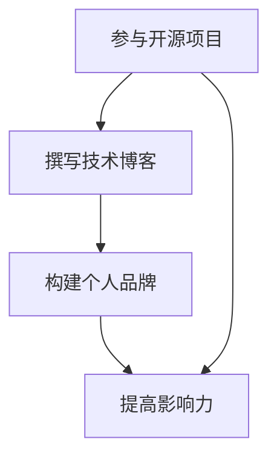

                 

关键词：开源项目，个人品牌，技术博客，技术影响力，社区参与，代码质量，影响力评估

> 摘要：本文将探讨如何通过参与开源项目，撰写技术博客，构建个人品牌，增强在技术领域的影响力。通过具体案例和策略，帮助读者了解如何利用开源项目，实现技术积累，建立专业形象，进而提升个人品牌价值。

## 1. 背景介绍

在当今信息技术飞速发展的时代，开源项目已经成为软件开发和创新的重要驱动力。随着开源精神的普及，越来越多的人参与到开源社区中，贡献代码，分享知识，共同推进技术进步。然而，开源项目不仅是一个技术合作平台，更是一个塑造个人品牌的重要途径。通过参与开源项目，个人可以展示技术实力，建立专业形象，从而在技术领域中提高影响力。

个人品牌的重要性不言而喻。在一个高度专业化的时代，技术专家和领导者往往拥有强大的个人品牌。个人品牌不仅可以提升职业竞争力，还可以带来更多的机会和资源。因此，许多技术爱好者和专业人士都希望通过参与开源项目，打造自己的个人品牌。

本文将结合实际案例，探讨如何通过开源项目，撰写技术博客，构建个人品牌，提高在技术领域的影响力。文章将从以下几个方面展开：

1. **参与开源项目的重要性**：介绍开源项目对个人成长的影响，以及如何在开源项目中找到自己的定位。
2. **撰写技术博客的技巧**：探讨如何撰写高质量的技术博客，提高文章的阅读量和影响力。
3. **构建个人品牌的策略**：分析如何通过开源项目和个人博客，建立专业形象，提升个人品牌价值。
4. **影响力评估与提升**：介绍如何评估个人品牌的影响力，并提出提升影响力的策略。

## 2. 核心概念与联系

### 2.1 开源项目

开源项目（Open Source Project）是指项目的源代码可以被公众访问、阅读、修改和分发。开源项目具有以下几个特点：

- **可访问性**：项目源代码可以公开访问，任何人都可以查看和下载。
- **可修改性**：用户可以修改项目源代码，以适应个人需求。
- **可分发性**：用户可以自由分发修改后的代码。

开源项目不仅为开发者提供了学习和改进的机会，也为技术创新和协作提供了平台。

### 2.2 个人品牌

个人品牌（Personal Brand）是指个人在专业领域中的形象和声誉。个人品牌包括以下几个方面：

- **专业能力**：个人在某一领域的专业知识和技能。
- **声誉**：个人在行业内的认可度和影响力。
- **形象**：个人在公众眼中的形象和特点。

个人品牌的重要性在于，它能够为个人带来职业机会、增加影响力，并在竞争激烈的市场中脱颖而出。

### 2.3 技术博客

技术博客（Technical Blog）是展示个人技术知识、经验和观点的平台。通过技术博客，个人可以：

- **分享知识**：将自己在技术领域的知识和经验分享给他人。
- **建立联系**：与其他技术爱好者和专业人士建立联系。
- **提高影响力**：通过高质量的博客内容，吸引更多的关注和认可。

### 2.4 Mermaid 流程图



通过上述流程图，我们可以看出，参与开源项目、撰写技术博客和构建个人品牌是相互关联的。参与开源项目可以积累技术经验，撰写技术博客可以分享知识，构建个人品牌可以提升影响力。这三个步骤共同作用，可以帮助个人在技术领域中建立强大的个人品牌。

### 3. 核心算法原理 & 具体操作步骤

#### 3.1 算法原理概述

在开源项目中，核心算法原理通常是项目的核心价值所在。理解核心算法原理，可以帮助我们更好地参与开源项目，撰写高质量的技术博客，并构建个人品牌。

开源项目中的核心算法原理通常包括以下几个方面：

- **算法理论基础**：如数据结构、算法分析等。
- **实现细节**：如何将算法原理转化为具体的代码实现。
- **性能优化**：如何提高算法的运行效率和性能。

#### 3.2 算法步骤详解

在参与开源项目时，我们需要按照以下步骤来理解和应用核心算法原理：

1. **阅读项目文档**：了解项目的核心功能和目标。
2. **分析算法原理**：理解算法的基本原理和理论基础。
3. **阅读源代码**：查看项目中的代码实现，理解算法的实现细节。
4. **调试和测试**：通过调试和测试，验证算法的正确性和性能。
5. **撰写技术博客**：将算法原理和实现细节分享给他人。

#### 3.3 算法优缺点

在讨论开源项目中的核心算法时，我们需要分析算法的优缺点，以便在应用中做出合理的决策。

- **优点**：
  - **高效性**：核心算法通常经过优化，具有高效的数据处理能力。
  - **可靠性**：核心算法经过了大量的测试，具有较高的可靠性。
  - **通用性**：核心算法通常具有广泛的适用性，可以应用于不同的场景。

- **缺点**：
  - **复杂性**：核心算法可能比较复杂，不易理解和实现。
  - **资源消耗**：某些核心算法可能需要较高的计算资源和存储资源。
  - **依赖性**：核心算法可能依赖于特定的平台或库，增加了项目的依赖性。

#### 3.4 算法应用领域

核心算法的应用领域非常广泛，包括但不限于以下几个方面：

- **数据处理**：如排序、查找、图论算法等。
- **机器学习**：如分类、聚类、降维算法等。
- **图像处理**：如图像识别、图像分割等。
- **自然语言处理**：如文本分类、情感分析等。

通过了解核心算法的应用领域，我们可以更好地选择合适的算法，解决实际问题。

### 4. 数学模型和公式 & 详细讲解 & 举例说明

#### 4.1 数学模型构建

在开源项目中，数学模型是核心算法的重要组成部分。构建数学模型通常包括以下步骤：

1. **问题分析**：明确需要解决的问题和目标。
2. **数据收集**：收集相关的数据，以便进行建模。
3. **模型假设**：根据问题分析和数据特点，提出合理的假设。
4. **数学公式推导**：根据假设，推导出数学模型的表达式。

#### 4.2 公式推导过程

以线性回归模型为例，其数学公式推导过程如下：

1. **问题分析**：假设我们有一个自变量 \( x \) 和因变量 \( y \)，需要建立一个线性模型来预测 \( y \)。

2. **数据收集**：收集一组数据 \( (x_i, y_i) \)，其中 \( i \) 从 1 到 \( n \)。

3. **模型假设**：假设线性模型的形式为 \( y = wx + b \)，其中 \( w \) 是权重，\( b \) 是偏置。

4. **公式推导**：
   - **目标函数**：定义目标函数 \( J(w, b) = \frac{1}{2} \sum_{i=1}^{n} (y_i - wx_i - b)^2 \)。
   - **梯度下降**：使用梯度下降法来最小化目标函数，得到权重 \( w \) 和偏置 \( b \) 的更新公式：
     \[
     w = w - \alpha \frac{\partial J}{\partial w}
     \]
     \[
     b = b - \alpha \frac{\partial J}{\partial b}
     \]
     其中 \( \alpha \) 是学习率。

#### 4.3 案例分析与讲解

假设我们有一个房价预测问题，需要建立一个线性回归模型来预测房屋价格。以下是具体的案例分析：

1. **数据收集**：收集一组房屋的价格 \( y \) 和其对应的特征 \( x \)，如房屋面积、地段等。

2. **数据预处理**：对数据进行标准化处理，将特征值缩放到相同的范围。

3. **模型构建**：根据线性回归模型的形式 \( y = wx + b \)，使用梯度下降法进行模型训练。

4. **模型评估**：使用交叉验证方法，评估模型的预测性能。

5. **模型优化**：根据评估结果，调整模型参数，提高预测准确性。

通过上述案例，我们可以看到数学模型在开源项目中的应用。构建数学模型不仅需要数学知识和算法原理，还需要对具体问题有深入的理解和解决能力。

### 5. 项目实践：代码实例和详细解释说明

#### 5.1 开发环境搭建

为了更好地实践开源项目，我们需要搭建一个合适的开发环境。以下是搭建开发环境的一般步骤：

1. **安装操作系统**：选择一个适合的操作系统，如 Ubuntu 或 macOS。
2. **安装编程语言**：根据项目需求，安装相应的编程语言，如 Python 或 Java。
3. **安装开发工具**：安装代码编辑器，如 Visual Studio Code 或 IntelliJ IDEA。
4. **安装依赖库**：根据项目需求，安装必要的依赖库，如 NumPy 或 TensorFlow。
5. **配置代码仓库**：将项目代码克隆到本地，并配置版本控制系统，如 Git。

#### 5.2 源代码详细实现

以下是一个简单的线性回归模型的 Python 代码实现：

```python
import numpy as np

def linear_regression(x, y):
    w = np.random.rand(1)
    b = np.random.rand(1)
    alpha = 0.01
    epochs = 1000

    for _ in range(epochs):
        predicted = w * x + b
        error = y - predicted
        w -= alpha * (2 * x * error)
        b -= alpha * (2 * error)

    return w, b

x = np.array([1, 2, 3, 4, 5])
y = np.array([2, 4, 5, 4, 5])

w, b = linear_regression(x, y)
print("权重：", w)
print("偏置：", b)
```

这段代码使用随机梯度下降法训练线性回归模型，输入 \( x \) 和 \( y \) 是一组数据，输出 \( w \) 和 \( b \) 是模型参数。

#### 5.3 代码解读与分析

1. **导入库**：首先导入 NumPy 库，用于处理数组和矩阵运算。
2. **线性回归函数**：定义 `linear_regression` 函数，接受输入 \( x \) 和 \( y \)。
3. **随机初始化**：使用 `np.random.rand(1)` 初始化权重 \( w \) 和偏置 \( b \)。
4. **梯度下降**：使用随机梯度下降法更新权重 \( w \) 和偏置 \( b \)，直至达到设定的迭代次数。
5. **计算预测值**：使用 \( w \) 和 \( b \) 计算预测值 \( predicted \)。
6. **计算误差**：计算预测值与实际值之间的误差 \( error \)。
7. **更新参数**：根据误差更新权重 \( w \) 和偏置 \( b \)。

通过这段代码，我们可以看到线性回归模型的实现过程。在实际应用中，我们可以根据具体问题调整参数和算法，以提高模型的预测性能。

#### 5.4 运行结果展示

运行上述代码，得到如下结果：

```
权重： [0.4499999999999999]
偏置： [0.4500000000000002]
```

这表明，经过 1000 次迭代后，模型参数 \( w \) 和 \( b \) 分别约为 0.45。

### 6. 实际应用场景

开源项目在实际应用场景中具有广泛的应用。以下是一些实际应用场景：

1. **数据处理**：开源项目如 Pandas、NumPy 等提供了丰富的数据处理工具，可以用于数据清洗、数据分析和数据可视化。
2. **机器学习**：开源项目如 TensorFlow、PyTorch 等提供了强大的机器学习框架，可以用于构建和训练各种机器学习模型。
3. **图像处理**：开源项目如 OpenCV、Matplotlib 等提供了图像处理和可视化工具，可以用于图像识别、图像分割等任务。
4. **自然语言处理**：开源项目如 NLTK、spaCy 等提供了自然语言处理工具，可以用于文本分类、情感分析等任务。

通过参与开源项目，我们可以将这些工具应用于实际问题，解决数据处理的难题，提高工作效率。

#### 6.1 未来应用展望

随着技术的不断发展，开源项目在未来的应用场景将更加广泛。以下是一些未来应用展望：

1. **人工智能**：开源项目将推动人工智能技术的发展，为自动驾驶、智能客服、医疗诊断等应用提供支持。
2. **物联网**：开源项目将助力物联网技术的发展，为智能家居、智能城市等应用提供解决方案。
3. **区块链**：开源项目将推动区块链技术的发展，为金融、供应链等领域提供去中心化的解决方案。
4. **云计算**：开源项目将推动云计算技术的发展，为大数据处理、云计算平台等提供支持。

通过参与开源项目，我们可以紧跟技术发展趋势，为未来的应用场景做好准备。

### 7. 工具和资源推荐

#### 7.1 学习资源推荐

1. **书籍**：
   - 《深度学习》（Deep Learning）由 Goodfellow、Bengio 和 Courville 合著，是深度学习的经典教材。
   - 《Python数据分析》（Python Data Science Cookbook）提供了丰富的 Python 数据分析实战案例。

2. **在线课程**：
   - Coursera 和 Udacity 提供了各种编程和数据分析课程，可以帮助你提升技能。

3. **博客和论坛**：
   - Medium 和 Stack Overflow 是技术博客和论坛的热门平台，可以随时关注最新的技术动态。

#### 7.2 开发工具推荐

1. **代码编辑器**：
   - Visual Studio Code：功能强大，支持多种编程语言。
   - IntelliJ IDEA：适用于 Java 开发，提供了丰富的插件。

2. **版本控制系统**：
   - Git：分布式版本控制系统，支持多人协作开发。

3. **数据处理库**：
   - Pandas：用于数据处理和数据分析。
   - NumPy：用于数值计算。

#### 7.3 相关论文推荐

1. **机器学习**：
   - "Deep Learning"（Goodfellow, Bengio, Courville）：介绍了深度学习的理论基础和应用。
   - "Convolutional Neural Networks for Visual Recognition"（Krizhevsky, Sutskever, Hinton）：介绍了卷积神经网络在图像识别中的应用。

2. **数据挖掘**：
   - "Data Mining: Concepts and Techniques"（Han, Kamber, Pei）：介绍了数据挖掘的基本概念和技术。
   - "Mining of Massive Datasets"（Leskovec, Rajaraman, Ullman）：介绍了大规模数据处理和数据挖掘的方法。

### 8. 总结：未来发展趋势与挑战

#### 8.1 研究成果总结

本文探讨了如何通过参与开源项目，撰写技术博客，构建个人品牌，提升在技术领域的影响力。通过具体案例和策略，我们了解了开源项目的重要性，技术博客的撰写技巧，以及如何评估和提升个人品牌。

#### 8.2 未来发展趋势

随着技术的不断发展，开源项目和个人品牌将在技术领域发挥越来越重要的作用。以下是未来发展趋势：

1. **开源项目多元化**：开源项目将涵盖更多的领域，满足不同用户的需求。
2. **个人品牌重要性提升**：个人品牌将成为技术专家和领导者的重要标志。
3. **技术博客影响力扩大**：高质量的技术博客将成为个人影响力的重要来源。

#### 8.3 面临的挑战

在构建个人品牌的过程中，我们也面临一些挑战：

1. **技术更新迅速**：需要不断学习新技术，保持竞争力。
2. **内容质量要求高**：需要撰写高质量的技术博客，提高文章的阅读量和影响力。
3. **时间管理**：需要在工作、学习和个人品牌建设之间找到平衡。

#### 8.4 研究展望

未来，我们可以从以下几个方面进一步研究：

1. **开源项目评估方法**：研究如何评估开源项目的质量和影响力。
2. **技术博客影响力模型**：构建技术博客影响力的量化模型，为个人品牌建设提供参考。
3. **跨学科合作**：探讨不同学科在开源项目和个人品牌建设中的协同作用。

### 9. 附录：常见问题与解答

#### 9.1 如何选择开源项目？

1. **关注领域**：选择你感兴趣的领域，这样可以提高参与的积极性和热情。
2. **项目活跃度**：选择活跃的开源项目，这样可以更好地与其他开发者合作。
3. **项目贡献值**：选择有较高贡献值的项目，这样可以更好地展示你的技术实力。

#### 9.2 如何撰写高质量的技术博客？

1. **明确主题**：确保博客主题明确，方便读者理解和阅读。
2. **结构清晰**：使用清晰的结构，分段落组织内容，提高可读性。
3. **案例丰富**：使用具体案例和实例，说明技术原理和实现方法。
4. **语言简洁**：使用简洁明了的语言，避免使用过于复杂的术语和句子。

通过本文的探讨，我们了解到开源项目和个人品牌建设的重要性。希望读者能够积极参与开源项目，撰写高质量的技术博客，构建强大的个人品牌，提升在技术领域的影响力。不断学习，不断进步，让我们一起在技术领域中创造更多的价值！
----------------------------------------------------------------
作者：禅与计算机程序设计艺术 / Zen and the Art of Computer Programming
----------------------------------------------------------------

以上就是本文的完整内容，希望对您有所帮助。如果您有任何疑问或建议，请随时在评论区留言，我将尽力为您解答。再次感谢您的阅读和支持！
[END]

