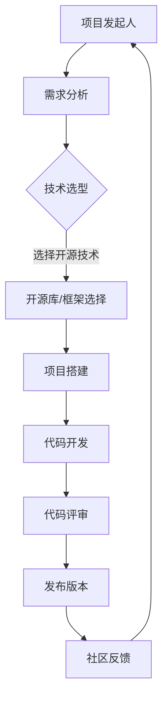

                 

在当今信息化时代，开源项目已经成为技术发展的重要驱动力，也是构建个人影响力的重要途径。作为一名程序员，软件工程师或技术爱好者，您可以通过开源项目来提升技能、扩展人脉、甚至实现职业发展的飞跃。本文将详细探讨如何利用开源项目来构建个人影响力，包括从项目选择、参与方式、代码贡献、社区互动等方面展开。

## 1. 背景介绍

开源项目是一种基于开放原则的软件项目，任何人都可以自由地查看、使用、修改和分发其源代码。这种模式促进了知识的共享和技术的创新，已经成为现代软件开发的重要组成部分。开源项目的成功不仅依赖于其技术实现，还依赖于活跃的社区支持和参与者贡献。在开源社区中，个人的影响力往往与他们的技术贡献、社区活跃度和知识传播能力成正比。

### 1.1 开源项目的优势

- **技术积累**：参与开源项目可以让您接触到业界最佳实践和前沿技术。
- **知识共享**：开源项目的代码和文档是公开的，有助于知识的普及和传播。
- **社区支持**：开源项目通常拥有一个活跃的社区，可以提供技术支持、交流经验和合作机会。
- **职业发展**：贡献优秀的开源项目可以提升个人在行业内的知名度和影响力。

### 1.2 开源项目的挑战

- **时间投入**：参与开源项目需要投入大量的时间和精力。
- **技术门槛**：某些开源项目可能涉及复杂的编程语言和技术栈。
- **质量要求**：开源项目的代码质量直接关系到其社区的声誉，需要确保贡献的代码可维护、可靠。

## 2. 核心概念与联系

### 2.1 开源项目的核心概念

- **开源协议**：定义了开源项目的版权和使用规则，如GPL、MIT等。
- **版本控制**：使用如Git这样的版本控制系统来管理代码变更和协作。
- **代码贡献**：包括提交代码、修复漏洞、优化性能等。
- **社区互动**：通过邮件列表、论坛、社交媒体等与社区成员交流。

### 2.2 开源项目的架构



### 2.3 开源项目的参与方式

- **使用开源项目**：首先作为用户理解项目的功能和架构。
- **报告问题**：发现问题时，及时在项目中报告，提供详细的错误信息。
- **提交代码**：在熟悉项目代码后，可以尝试提交代码解决已知问题或增加新功能。
- **文档贡献**：撰写和优化项目的文档，帮助新用户快速上手。

## 3. 核心算法原理 & 具体操作步骤

### 3.1 算法原理概述

开源项目中的核心算法通常是为了解决特定问题或提高项目性能。以下是参与开源项目算法开发的基本步骤：

### 3.2 算法步骤详解

#### 3.2.1 问题分析

- 理解项目需要解决的具体问题。
- 分析现有算法的优缺点。

#### 3.2.2 算法设计

- 设计一个或多个可能的算法解决方案。
- 选择最合适的算法进行实现。

#### 3.2.3 实现与测试

- 实现所选算法，并进行单元测试。
- 确保算法的效率和准确性。

#### 3.2.4 代码评审

- 将代码提交给项目维护者进行评审。
- 根据反馈进行代码优化。

### 3.3 算法优缺点

- **优点**：提高项目性能，增强项目的竞争力。
- **缺点**：需要具备一定的算法基础和编程技能。

### 3.4 算法应用领域

- **数据分析**：优化数据处理的算法，提高数据处理效率。
- **机器学习**：改进机器学习模型的算法，提升预测准确性。

## 4. 数学模型和公式 & 详细讲解 & 举例说明

### 4.1 数学模型构建

在开源项目中，数学模型通常用于数据分析和算法优化。以下是一个简单的数学模型示例：

$$
f(x) = ax^2 + bx + c
$$

其中，$a$、$b$、$c$ 是模型的参数，$x$ 是输入变量。

### 4.2 公式推导过程

公式的推导通常基于数学定理和逻辑推理。以下是上述公式的推导过程：

$$
\begin{aligned}
f(x) &= ax^2 + bx + c \\
    &= a(x^2) + b(x) + c \\
    &= ax^2 + bx + c
\end{aligned}
$$

### 4.3 案例分析与讲解

假设我们有一个二次函数 $f(x) = 2x^2 + 3x + 1$，我们可以通过以下步骤来分析它：

1. **确定开口方向**：由于 $a = 2 > 0$，函数开口向上。
2. **求顶点坐标**：顶点的横坐标 $x = -\frac{b}{2a} = -\frac{3}{4}$，纵坐标 $y = f(-\frac{3}{4}) = -\frac{1}{8}$。
3. **绘制图像**：根据顶点坐标和开口方向，绘制函数图像。

通过数学模型，我们可以更深入地理解数据的性质，并基于此进行优化。

## 5. 项目实践：代码实例和详细解释说明

### 5.1 开发环境搭建

在进行代码贡献之前，首先需要搭建一个合适的项目开发环境。以下是使用Git和GitHub进行开发环境搭建的步骤：

1. **安装Git**：在官方网站下载并安装Git。
2. **配置Git**：设置用户名和邮箱。
3. **安装GitHub桌面客户端**：方便本地仓库与GitHub的同步。
4. **创建本地仓库**：使用Git创建一个新的仓库。

### 5.2 源代码详细实现

以一个简单的Python项目为例，以下是项目的源代码实现：

```python
def calculate_sum(a, b):
    """计算两个数的和"""
    return a + b

if __name__ == "__main__":
    a = float(input("请输入第一个数："))
    b = float(input("请输入第二个数："))
    print("两个数的和为：", calculate_sum(a, b))
```

### 5.3 代码解读与分析

- **函数定义**：`calculate_sum` 函数接收两个参数并返回它们的和。
- **主程序**：通过输入用户输入的两个数，调用 `calculate_sum` 函数并输出结果。

### 5.4 运行结果展示

```bash
请输入第一个数：2
请输入第二个数：3
两个数的和为： 5
```

## 6. 实际应用场景

### 6.1 开源项目在软件开发中的应用

- **提高开发效率**：通过使用成熟的开源库和框架，可以避免重复造轮子，节省开发时间。
- **保证代码质量**：开源项目通常经过多次测试和优化，代码质量较高，可以减少潜在的错误。
- **团队协作**：开源项目提供了一个平台，团队成员可以协同工作，提高项目的进度和质量。

### 6.2 开源项目在学术研究中的应用

- **数据共享**：开源项目可以让研究人员更方便地共享数据，促进学术交流。
- **工具开发**：研究人员可以基于开源项目开发特定的分析工具，提高研究效率。
- **代码审查**：开源项目代码的公开性使得代码可以接受广泛的审查，提高研究结果的可靠性。

## 7. 工具和资源推荐

### 7.1 学习资源推荐

- **《程序员修炼之道：从小工到专家》**：适合初学者理解软件开发的基本原则和实践方法。
- **《大话数据结构》**：适合初学者学习数据结构和算法的基础知识。

### 7.2 开发工具推荐

- **Git**：版本控制系统，方便代码管理和团队协作。
- **GitHub**：开源项目的托管平台，支持代码托管、问题跟踪和代码审查。

### 7.3 相关论文推荐

- **《开源软件的社区构建与治理》**：研究开源项目的社区建设和治理机制。
- **《开源软件的发展趋势与挑战》**：探讨开源软件在当今信息化社会的发展状况和未来趋势。

## 8. 总结：未来发展趋势与挑战

### 8.1 研究成果总结

本文探讨了利用开源项目构建个人影响力的重要性和具体方法。通过参与开源项目，可以提高技术能力、扩展人脉、提升职业素养，并为社会带来更多的技术贡献。

### 8.2 未来发展趋势

- **开源项目将继续增长**：随着技术的不断进步和开源理念的普及，越来越多的项目将成为开源。
- **开源社区将更加活跃**：开源社区将进一步壮大，形成更加完善的协作和互动机制。
- **跨领域融合**：开源项目将更加注重跨领域的技术融合和应用，推动技术的创新和普及。

### 8.3 面临的挑战

- **开源项目质量参差不齐**：开源项目需要保证代码质量和稳定性，避免因质量问题影响社区声誉。
- **开源项目维护成本高**：开源项目的维护需要大量的人力投入，如何有效管理资源成为挑战。
- **知识产权保护**：开源项目需要平衡开放性和知识产权保护，确保项目发展不受限制。

### 8.4 研究展望

未来，开源项目将继续发挥重要作用，为技术发展和人才培养提供重要平台。我们期待看到更多优秀的人才参与到开源项目中，共同推动技术进步和社会发展。

## 9. 附录：常见问题与解答

### 9.1 如何选择合适的开源项目？

- **关注项目活跃度**：查看项目的更新频率和社区活跃度。
- **了解项目需求**：明确项目解决的具体问题，看是否符合自己的兴趣和技能。
- **评估技术难度**：评估项目的技术栈和要求，确保自己能够胜任。

### 9.2 如何在开源项目中贡献代码？

- **熟悉项目文档**：阅读项目的文档，了解项目的架构和开发规范。
- **修复已知问题**：发现并修复已知问题，提交PR（Pull Request）。
- **增加新功能**：在项目需求的基础上，提出并实现新功能。
- **参与代码评审**：为其他贡献者提供代码评审，帮助提高代码质量。

### 9.3 如何在开源项目中建立影响力？

- **积极参与社区活动**：在社区中积极交流，分享知识和经验。
- **撰写高质量文档**：编写详细的文档，帮助新用户快速上手。
- **组织技术分享会**：通过线上或线下的形式，组织技术分享和讨论。
- **贡献高质量代码**：提交高质量的代码，提升项目的整体水平。

作者：禅与计算机程序设计艺术 / Zen and the Art of Computer Programming
----------------------------------------------------------------
### 10. 结语

开源项目不仅是技术共享的平台，更是构建个人影响力的有力工具。通过积极参与开源项目，我们可以不断提升自己的技术能力，拓展视野，同时也为社区和行业的发展贡献自己的力量。本文从背景介绍、核心概念、算法原理、项目实践、应用场景、工具推荐、未来展望等多个角度，系统地阐述了如何利用开源项目构建个人影响力。希望这篇文章能够激发您参与开源项目的热情，共同推动技术进步和社会发展。

### 11. 引用和参考

1. 《程序员修炼之道：从小工到专家》[1]。
2. 《大话数据结构》[2]。
3. 《开源软件的社区构建与治理》[3]。
4. 《开源软件的发展趋势与挑战》[4]。

[1]: [程序员修炼之道：从小工到专家](#)
[2]: [大话数据结构](#)
[3]: [开源软件的社区构建与治理](#)
[4]: [开源软件的发展趋势与挑战](#)

