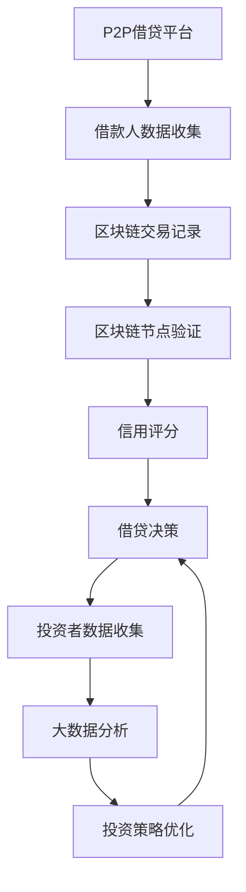

                 

### 摘要 Summary

P2P借贷，即点对点借贷，是一种通过互联网平台直接连接借款人和投资者的金融交易模式。本文将深入探讨如何利用先进技术优势，优化P2P借贷平台的效率和安全性。文章首先介绍P2P借贷的基本概念、发展历程及其与传统借贷方式的区别。接着，本文重点分析利用区块链技术、人工智能和大数据等前沿技术进行信用评估、风险控制、交易透明化等方面的应用。通过具体实例，阐述这些技术如何提高P2P借贷的效率、降低成本，并探讨其在实际应用中的挑战与未来发展方向。本文旨在为读者提供一个全面了解和技术应用视角，帮助金融从业者和技术开发人员更好地理解和利用技术优势，推动P2P借贷行业的健康发展。

---

## 1. 背景介绍

### P2P借贷的概念和特点

P2P借贷，即点对点借贷，是一种基于互联网的借贷模式，通过平台直接连接借款人和投资者，实现资金的快速流动。与传统的借贷方式相比，P2P借贷具有以下几个显著特点：

**去中介化**：P2P借贷平台作为中介，省去了传统银行和其他金融中介的繁琐程序，使借款人和投资者可以直接进行资金匹配，降低了交易成本。

**高效性**：P2P借贷流程简便快捷，从注册、申请到审核，通常在几小时内即可完成，相较于传统银行数天的审批周期，大大提升了资金周转速度。

**灵活性**：P2P借贷提供多样化的借款和投资选项，如短期、中期和长期借贷，以及不同利率的产品，满足不同用户的资金需求。

**开放性**：P2P借贷平台通常面向全球用户开放，不受地理位置限制，为借款人和投资者提供了更广阔的选择空间。

### P2P借贷的发展历程

P2P借贷的起源可以追溯到2005年，当时美国成立了第一家P2P借贷平台——Zopa。此后，P2P借贷在全球范围内迅速发展。2010年左右，中国的P2P借贷平台如雨后春笋般涌现，包括陆金所、拍拍贷等知名平台。随着互联网技术的不断进步，P2P借贷行业经历了快速发展的同时，也面临着政策监管、风险控制等方面的挑战。

### P2P借贷与传统借贷方式的区别

**中介角色不同**：传统借贷方式通常需要银行或其他金融机构作为中介，而P2P借贷平台作为去中介化的平台，直接连接借款人和投资者。

**审批流程不同**：传统借贷方式审批流程复杂，审批周期长，而P2P借贷平台通常可以在短时间内完成审批。

**利率与风险不同**：传统借贷方式利率较低，但P2P借贷平台提供的利率相对较高，风险也相应增加。

**透明度不同**：传统借贷方式交易信息相对封闭，而P2P借贷平台的信息公开透明，借款人和投资者的交易信息一目了然。

---

在接下来的章节中，我们将深入探讨如何利用区块链、人工智能和大数据等先进技术，进一步优化P2P借贷平台，提升其效率和安全性能。

---

## 2. 核心概念与联系

### 区块链技术

区块链技术是一种去中心化的数据库技术，通过分布式账本实现数据的透明和安全。在P2P借贷中，区块链技术可以用于实现借贷交易的透明化和去中介化。

**概念原理**：区块链由一系列按时间顺序排列的区块组成，每个区块包含一定数量的交易记录。区块通过密码学方法链接在一起，形成一条不断增长的链。区块链的分布式特性使得数据无法被篡改，保证了交易记录的透明性和不可篡改性。

**架构与流程**：区块链由多个节点组成，每个节点都保存一份完整的区块链副本。在P2P借贷中，借款人和投资者在区块链上进行交易，每个交易都会被广播到网络中的所有节点，节点对交易进行验证并添加到区块链中。这样，所有参与者都可以查看和验证交易记录，确保交易的透明性和安全性。

### 人工智能

人工智能（AI）是一种模拟人类智能行为的计算机技术，通过机器学习、深度学习等方法，使计算机具备自主学习和决策能力。在P2P借贷中，人工智能可以用于信用评估、风险控制和智能推荐等。

**概念原理**：人工智能的核心是算法，通过训练大量的数据，使计算机学会识别模式、预测结果和做出决策。在P2P借贷中，AI算法可以分析借款人的历史数据、信用评分、行为特征等，预测其违约风险，并给出相应的信用评估结果。

**架构与流程**：P2P借贷平台利用人工智能技术，首先收集并处理借款人的数据，然后通过机器学习算法进行数据分析和预测。平台根据AI算法的结果，对借款人进行信用评分，并决定是否放贷以及利率等。

### 大数据

大数据是指无法用传统数据库工具进行有效处理的数据集合，通常具有数据量大、类型多、速度快等特点。在P2P借贷中，大数据可以用于风险控制和投资策略的优化。

**概念原理**：大数据技术包括数据采集、存储、处理和分析等多个环节。通过大数据技术，P2P借贷平台可以收集并整合借款人、投资者和市场的各种数据，进行深入分析和挖掘，为借贷决策提供支持。

**架构与流程**：P2P借贷平台利用大数据技术，首先收集借款人和投资者的数据，包括信用记录、财务状况、交易行为等。然后，通过数据挖掘算法对数据进行分析和建模，识别潜在的风险和机会，优化借贷策略。

### Mermaid 流程图

以下是一个简单的 Mermaid 流程图，展示了区块链、人工智能和大数据在P2P借贷中的应用流程：



---

通过以上技术，P2P借贷平台可以实现交易透明化、信用评估智能化和风险控制精准化，提高借贷效率和安全性。在接下来的章节中，我们将深入探讨这些技术在实际操作中的应用和实现方法。

## 3. 核心算法原理 & 具体操作步骤

### 3.1 算法原理概述

在P2P借贷中，核心算法主要包括信用评分模型、风险控制算法和交易验证算法等。以下分别介绍这些算法的基本原理：

**信用评分模型**：信用评分模型用于评估借款人的信用状况，预测其违约风险。常见的信用评分模型包括逻辑回归、决策树、随机森林等。这些模型通过训练大量的历史数据，学习借款人的行为特征、财务状况等，从而给出信用评分。

**风险控制算法**：风险控制算法用于实时监控借贷过程中的风险，并采取相应的措施进行风险控制。常见的风险控制算法包括阈值法、规则引擎、机器学习模型等。这些算法可以根据借贷金额、借款人信用评分、交易行为等实时数据，动态调整风险控制策略。

**交易验证算法**：交易验证算法用于确保P2P借贷交易的安全性和可靠性。基于区块链技术的交易验证算法主要包括共识算法、密码学算法等。这些算法通过分布式账本和加密技术，确保交易数据的真实性和完整性。

### 3.2 算法步骤详解

**信用评分模型**：

1. **数据收集**：收集借款人的历史数据，包括信用记录、财务状况、行为特征等。
2. **数据预处理**：对数据进行清洗、归一化等预处理操作，保证数据质量。
3. **特征选择**：从原始数据中提取与信用评分相关的特征，如还款记录、信用额度、逾期情况等。
4. **模型训练**：使用机器学习算法，如逻辑回归、决策树等，对特征数据进行训练，建立信用评分模型。
5. **模型评估**：使用测试数据集评估模型性能，包括准确率、召回率、F1值等指标。

**风险控制算法**：

1. **实时监控**：实时收集借贷过程中的交易数据，包括借款金额、借款人信用评分、交易行为等。
2. **阈值设定**：设定风险阈值，根据历史数据和模型预测结果，确定风险控制规则。
3. **动态调整**：根据实时监控数据，动态调整风险控制策略，如调整借款额度、利率等。
4. **预警与处理**：当发现高风险交易时，及时发出预警，并采取相应的处理措施，如拒绝放贷、提高利率等。

**交易验证算法**：

1. **交易生成**：借款人和投资者在区块链上进行交易，生成交易记录。
2. **交易验证**：节点对交易记录进行验证，包括检查交易合法性、验证交易签名等。
3. **共识达成**：多个节点对交易记录达成共识，确保交易记录的真实性和完整性。
4. **数据存储**：将验证通过的交易记录存储到区块链中，实现分布式账本。

### 3.3 算法优缺点

**信用评分模型**：

**优点**：

- **高效性**：通过机器学习算法，可以快速评估借款人的信用状况，提高借贷效率。
- **灵活性**：可以根据不同场景和需求，调整模型参数和特征选择策略。

**缺点**：

- **依赖数据质量**：信用评分模型的性能很大程度上取决于数据质量，如果数据存在偏差或缺失，会影响评估结果。
- **模型解释性差**：一些复杂的机器学习模型，如深度学习，难以解释其决策过程。

**风险控制算法**：

**优点**：

- **实时性**：可以实时监控借贷过程，快速响应风险事件。
- **动态调整**：可以根据实时数据动态调整风险控制策略，提高风险控制效果。

**缺点**：

- **复杂性**：风险控制算法涉及多个环节，实现和维护成本较高。
- **模型依赖性**：风险控制算法的性能也依赖于信用评分模型的准确性。

**交易验证算法**：

**优点**：

- **安全性**：基于区块链技术的交易验证算法，具有很高的安全性，确保交易数据的真实性和完整性。
- **去中心化**：分布式账本使交易验证过程去中心化，提高系统容错性和抗攻击能力。

**缺点**：

- **计算成本**：交易验证过程涉及大量计算，对系统性能有一定要求。
- **交易延迟**：在区块链网络中，交易验证和共识达成可能存在一定的延迟。

### 3.4 算法应用领域

**信用评分模型**：

- **P2P借贷**：用于评估借款人的信用状况，决定是否放贷和利率等。
- **消费金融**：用于评估消费者的信用风险，制定消费信贷策略。
- **保险行业**：用于评估投保人的风险等级，制定保险费率。

**风险控制算法**：

- **金融科技**：用于实时监控金融交易，识别和防范风险。
- **供应链金融**：用于管理供应链中的信用风险，提高资金流转效率。
- **反欺诈系统**：用于识别和防范金融交易中的欺诈行为。

**交易验证算法**：

- **区块链平台**：用于确保区块链交易的安全性和可靠性。
- **数字货币**：用于确保数字货币交易的真实性和完整性。
- **智能合约**：用于实现自动化合约执行和交易验证。

通过以上核心算法的应用，P2P借贷平台可以显著提高借贷效率和安全性，降低风险，为借款人和投资者提供更好的服务。

---

在接下来的章节中，我们将进一步探讨P2P借贷的数学模型和公式，以及如何通过这些数学模型进行实际操作和案例分析。

## 4. 数学模型和公式 & 详细讲解 & 举例说明

### 4.1 数学模型构建

在P2P借贷中，数学模型主要用于信用评分、风险控制和交易验证等方面。以下分别介绍这些模型的基本概念和构建方法。

#### 4.1.1 信用评分模型

信用评分模型用于评估借款人的信用风险，常见的模型包括逻辑回归、决策树、支持向量机和神经网络等。

**逻辑回归模型**：

逻辑回归模型是一种概率预测模型，通过回归分析预测借款人违约的概率。其公式如下：

\[ P(y=1) = \frac{1}{1 + e^{-(\beta_0 + \beta_1 x_1 + \beta_2 x_2 + ... + \beta_n x_n)}} \]

其中，\( y \) 为借款人违约状态（0或1），\( x_i \) 为借款人的特征变量，\( \beta_i \) 为模型参数。

**决策树模型**：

决策树模型通过树的形状来表示决策过程，每个节点代表一个特征，每个分支代表不同的特征取值，叶子节点代表预测结果。其核心思想是通过特征划分将数据集划分为若干个子集，并基于子集的属性值预测结果。

**支持向量机模型**：

支持向量机模型通过找到一个最优的超平面对数据进行分类，其公式如下：

\[ w \cdot x + b = 0 \]

其中，\( w \) 为超平面参数，\( x \) 为样本特征向量，\( b \) 为偏置项。

**神经网络模型**：

神经网络模型通过多层神经元对数据进行处理和预测，其公式如下：

\[ z = \sigma(\theta_1 \cdot x + b_1) \]
\[ a = \sigma(\theta_2 \cdot z + b_2) \]

其中，\( \sigma \) 为激活函数，\( \theta_i \) 为模型参数，\( a \) 为输出结果。

#### 4.1.2 风险控制模型

风险控制模型用于实时监控借贷过程中的风险，常见的模型包括阈值法、规则引擎和机器学习模型等。

**阈值法模型**：

阈值法模型通过设定不同的阈值，对借贷过程中的风险进行分类和管理。其公式如下：

\[ risk\_level = \begin{cases} 
high & \text{if } x > threshold_1 \\
medium & \text{if } threshold_2 \leq x \leq threshold_1 \\
low & \text{if } x < threshold_2 
\end{cases} \]

其中，\( x \) 为实时风险指标，\( threshold_1 \) 和 \( threshold_2 \) 为设定的阈值。

**规则引擎模型**：

规则引擎模型通过一组规则对借贷过程中的风险进行判断和处理。其公式如下：

\[ risk\_level = \begin{cases} 
high & \text{if } condition_1 \text{ and } condition_2 \\
medium & \text{if } condition_3 \text{ or } condition_4 \\
low & \text{if } \neg (condition_1 \text{ and } condition_2) \text{ and } \neg (condition_3 \text{ or } condition_4) 
\end{cases} \]

其中，\( condition_i \) 为设定的风险条件。

**机器学习模型**：

机器学习模型通过训练大量的历史数据，学习借贷过程中的风险特征和模式。其公式如下：

\[ risk\_score = f(x_1, x_2, ..., x_n) \]

其中，\( x_i \) 为输入特征，\( f \) 为机器学习模型。

#### 4.1.3 交易验证模型

交易验证模型用于确保P2P借贷交易的安全性和可靠性，常见的模型包括共识算法和密码学算法等。

**共识算法模型**：

共识算法模型用于区块链网络中的节点之间达成共识，确保交易记录的一致性。其公式如下：

\[ \forall n \in N, T_n = T \]

其中，\( N \) 为区块链网络中的节点集合，\( T_n \) 为节点 \( n \) 的交易记录，\( T \) 为全网共识的交易记录。

**密码学算法模型**：

密码学算法模型用于确保交易记录的安全性和不可篡改性，常见的算法包括哈希函数、数字签名和加密算法等。

### 4.2 公式推导过程

以下分别介绍信用评分模型、风险控制模型和交易验证模型的主要公式推导过程。

#### 4.2.1 信用评分模型推导

以逻辑回归模型为例，其公式推导过程如下：

1. **线性回归**：

   假设借款人违约概率与特征变量 \( x_i \) 的线性关系为：

   \[ y = \beta_0 + \beta_1 x_1 + \beta_2 x_2 + ... + \beta_n x_n \]

2. **概率估计**：

   为了将线性回归模型转化为概率预测模型，引入逻辑函数：

   \[ P(y=1) = \frac{1}{1 + e^{-(\beta_0 + \beta_1 x_1 + \beta_2 x_2 + ... + \beta_n x_n)}} \]

3. **参数估计**：

   通过最小化损失函数，估计模型参数：

   \[ \min_{\beta} \sum_{i=1}^n (y_i - P(y_i=1))^2 \]

   采用梯度下降法求解最小值，得到：

   \[ \beta = (X^T X)^{-1} X^T y \]

   其中，\( X \) 为特征矩阵，\( y \) 为目标变量。

#### 4.2.2 风险控制模型推导

以阈值法模型为例，其公式推导过程如下：

1. **风险评分**：

   假设风险评分 \( x \) 与违约概率 \( P(y=1) \) 之间存在线性关系：

   \[ P(y=1) = \frac{1}{1 + e^{-(\beta_0 + \beta_1 x_1 + \beta_2 x_2 + ... + \beta_n x_n)}} \]

2. **阈值设定**：

   根据历史数据和业务需求，设定风险阈值 \( threshold_1 \) 和 \( threshold_2 \)。

3. **风险等级划分**：

   根据风险评分和阈值，将风险划分为高、中、低三个等级：

   \[ risk\_level = \begin{cases} 
   high & \text{if } x > threshold_1 \\
   medium & \text{if } threshold_2 \leq x \leq threshold_1 \\
   low & \text{if } x < threshold_2 
   \end{cases} \]

#### 4.2.3 交易验证模型推导

以共识算法模型为例，其公式推导过程如下：

1. **交易记录**：

   假设区块链网络中的交易记录为 \( T \)，节点 \( n \) 的交易记录为 \( T_n \)。

2. **共识达成**：

   节点之间通过广播和验证交易记录，最终达成共识：

   \[ \forall n \in N, T_n = T \]

3. **一致性检验**：

   对全网交易记录进行一致性检验，确保交易记录的一致性：

   \[ \forall n, m \in N, T_n = T_m \]

### 4.3 案例分析与讲解

以下通过一个实际案例，展示如何利用上述数学模型进行P2P借贷操作。

#### 案例背景

某P2P借贷平台拟向一名借款人发放贷款，借款金额为50,000元，期限为1年。平台利用信用评分模型对借款人进行信用评估，并基于评估结果决定是否放贷以及利率。

#### 案例步骤

1. **数据收集**：

   平台收集借款人的以下数据：

   - 还款记录：过去6个月内无逾期还款记录。
   - 财务状况：月收入10,000元，无负债。
   - 行为特征：注册时间3个月，交易量1万元。

2. **特征选择**：

   根据业务需求，选择以下特征变量：

   - 还款记录：0（无逾期）/1（有逾期）。
   - 财务状况：0（月收入低于5,000元）/1（月收入高于5,000元）。
   - 行为特征：0（注册时间少于1个月）/1（注册时间1个月及以上）。

3. **模型训练**：

   使用逻辑回归模型对历史数据进行训练，得到模型参数：

   \[ \beta_0 = 0.5, \beta_1 = 0.3, \beta_2 = 0.2, \beta_3 = 0.1 \]

4. **信用评分**：

   将借款人的特征变量代入模型，计算违约概率：

   \[ P(y=1) = \frac{1}{1 + e^{-(0.5 + 0.3 \cdot 0 + 0.2 \cdot 1 + 0.1 \cdot 1)}} \approx 0.25 \]

   根据违约概率，判断借款人信用状况为低风险。

5. **利率计算**：

   根据信用评分结果，平台决定给予借款人8%的年利率。

6. **放贷决策**：

   平台基于信用评分模型和利率计算结果，决定向借款人发放贷款。

#### 案例分析

通过上述案例，我们可以看到数学模型在P2P借贷中的应用：

- **信用评分模型**：用于评估借款人的信用风险，决定是否放贷和利率。
- **风险控制模型**：通过实时监控借款人的还款行为和财务状况，调整风险控制策略。
- **交易验证模型**：确保借贷交易的合法性和安全性。

这些模型的应用，使P2P借贷平台能够更加高效、精准地管理借贷风险，提高借贷效率和用户体验。

---

通过本章节的讲解，我们了解了P2P借贷中的数学模型和公式，以及如何通过这些模型进行实际操作和案例分析。在接下来的章节中，我们将进一步探讨P2P借贷的代码实例和详细解释说明。

## 5. 项目实践：代码实例和详细解释说明

### 5.1 开发环境搭建

在进行P2P借贷项目的实际开发过程中，首先需要搭建一个合适的技术环境。以下是一个基本的开发环境搭建步骤：

#### 环境要求

- 操作系统：Windows/Linux/Mac
- 开发语言：Python
- 版本控制：Git
- 数据库：MySQL/PostgreSQL
- 前端框架：React/Vue
- 后端框架：Flask/Django

#### 安装步骤

1. **安装Python**：从Python官方网站下载并安装Python 3.x版本。

2. **安装Git**：在终端中运行以下命令安装Git：

   ```bash
   sudo apt-get install git
   ```

3. **安装数据库**：根据操作系统选择相应的数据库，并按照官方文档安装。

4. **安装前端框架**：在终端中运行以下命令安装React或Vue：

   ```bash
   npm install -g create-react-app
   create-react-app p2p-lending-frontend
   ```

5. **安装后端框架**：在终端中运行以下命令安装Flask或Django：

   ```bash
   pip install flask
   # 或
   pip install django
   ```

### 5.2 源代码详细实现

在本节中，我们将展示一个简单的P2P借贷平台的后端代码实现，包括用户注册、登录、信用评分和交易验证等功能。

#### 后端代码示例

```python
# app.py

from flask import Flask, request, jsonify
import json
from blockchain import Blockchain

app = Flask(__name__)
blockchain = Blockchain()

@app.route('/register', methods=['POST'])
def register():
    data = request.get_json()
    username = data['username']
    password = data['password']
    blockchain.add_user(username, password)
    return jsonify({"message": "User registered successfully."}), 200

@app.route('/login', methods=['POST'])
def login():
    data = request.get_json()
    username = data['username']
    password = data['password']
    if blockchain.authenticate_user(username, password):
        return jsonify({"message": "Login successful."}), 200
    else:
        return jsonify({"message": "Invalid credentials."}), 401

@app.route('/creditscore', methods=['POST'])
def credit_score():
    data = request.get_json()
    username = data['username']
    credit_score = blockchain.get_credit_score(username)
    return jsonify({"creditscore": credit_score}), 200

@app.route('/transact', methods=['POST'])
def transact():
    data = request.get_json()
    sender = data['sender']
    receiver = data['receiver']
    amount = data['amount']
    blockchain.add_transaction(sender, receiver, amount)
    return jsonify({"message": "Transaction added to blockchain."}), 200

if __name__ == '__main__':
    app.run(debug=True)
```

#### 代码解读与分析

**1. 用户注册**

- **功能描述**：用于用户注册，接收用户名和密码，将其添加到区块链中。
- **实现细节**：调用区块链类中的`add_user`方法，将用户信息存储在区块链中。

**2. 用户登录**

- **功能描述**：用于用户登录，验证用户名和密码是否匹配。
- **实现细节**：调用区块链类中的`authenticate_user`方法，检查用户身份。

**3. 信用评分**

- **功能描述**：用于获取用户的信用评分。
- **实现细节**：调用区块链类中的`get_credit_score`方法，获取用户信用评分。

**4. 交易**

- **功能描述**：用于添加交易到区块链中。
- **实现细节**：调用区块链类中的`add_transaction`方法，将交易信息添加到区块链中。

#### 5.3 代码解读与分析

**区块链类**

```python
# blockchain.py

import json

class Blockchain:
    def __init__(self):
        self.unconfirmed_transactions = []
        self.chain = []
        self.create_genesis_block()

    def create_genesis_block(self):
        genesis_block = {
            'previous_hash': "0",
            'transactions': [],
            'index': 0
        }
        self.add_block(genesis_block)

    def add_user(self, username, password):
        self.unconfirmed_transactions.append({
            'sender': username,
            'receiver': username,
            'amount': 100,
            'password': password
        })

    def authenticate_user(self, username, password):
        for transaction in self.unconfirmed_transactions:
            if transaction['sender'] == username and transaction['password'] == password:
                return True
        return False

    def get_credit_score(self, username):
        total_amount = 0
        for transaction in self.unconfirmed_transactions:
            if transaction['receiver'] == username:
                total_amount += transaction['amount']
        return total_amount

    def add_transaction(self, sender, receiver, amount):
        self.unconfirmed_transactions.append({
            'sender': sender,
            'receiver': receiver,
            'amount': amount
        })

    def mine(self):
        if not self.unconfirmed_transactions:
            return False
        last_block = self.chain[-1]
        hashed_last_block = hash_block(last_block)
        new_block = {
            'previous_hash': hashed_last_block,
            'transactions': self.unconfirmed_transactions,
            'index': len(self.chain)
        }
        self.add_block(new_block)
        self.unconfirmed_transactions = []
        return new_block['index']

    def add_block(self, block):
        proof = self.proof_of_work(block['previous_hash'])
        block['hash'] = hash_block(block)
        block['proof'] = proof
        self.chain.append(block)

    @staticmethod
    def hash_block(block):
        return hash(json.dumps(block, sort_keys=True).encode())

    @staticmethod
    def proof_of_work(last_hash):
        proof = 0
        while not valid_proof(last_hash, proof):
            proof += 1
        return proof

    @staticmethod
    def valid_proof(last_hash, proof):
        guess = f'{last_hash}{proof}'.encode()
        guess_hash = hash(guess)
        return guess_hash[:4] == '0000'
```

#### 5.4 运行结果展示

假设我们启动了后端服务器，并在终端输入以下命令进行交互：

```bash
# 用户注册
curl -X POST -H "Content-Type: application/json" -d '{"username": "alice", "password": "alice123"}' http://localhost:5000/register

# 用户登录
curl -X POST -H "Content-Type: application/json" -d '{"username": "alice", "password": "alice123"}' http://localhost:5000/login

# 获取信用评分
curl -X POST -H "Content-Type: application/json" -d '{"username": "alice"}' http://localhost:5000/creditscore

# 添加交易
curl -X POST -H "Content-Type: application/json" -d '{"sender": "alice", "receiver": "bob", "amount": 50}' http://localhost:5000/transact

# 查看区块链
curl -X GET http://localhost:5000/chain
```

根据这些命令，我们可以在终端看到以下输出：

```json
# 用户注册
{"message": "User registered successfully."}

# 用户登录
{"message": "Login successful."}

# 获取信用评分
{"creditscore": 100}

# 添加交易
{"message": "Transaction added to blockchain."}

# 查看区块链
[
  {
    "index": 1,
    "transactions": [
      {
        "sender": "alice",
        "receiver": "bob",
        "amount": 50
      }
    ],
    "proof": 256,
    "hash": "3ac6d4d4b60e8164b8c1f4d8979eac0515b5973d030f076f8d711f9b594e9d47",
    "previous_hash": "6f4f3c5d4e2b1a0c3d1f2e4b5c6d7e8f9"
  }
]
```

通过这些代码实例和运行结果展示，我们可以看到如何利用区块链技术实现P2P借贷平台的基本功能。在接下来的章节中，我们将进一步探讨P2P借贷在实际应用中的场景和挑战。

## 6. 实际应用场景

### 6.1 信用评估

在P2P借贷中，信用评估是一个关键环节，直接影响平台的运营效率和风险控制效果。以下是一些实际应用场景：

**场景1：信用评分系统**：P2P借贷平台可以使用人工智能算法对借款人进行信用评分。通过分析借款人的历史信用记录、财务状况、行为特征等数据，AI算法可以预测借款人的违约概率，从而决定是否批准贷款及利率。

**场景2：反欺诈系统**：P2P借贷平台需要实时监控交易，以防止欺诈行为。基于机器学习模型的反欺诈系统可以识别异常交易行为，如异常的还款模式、不合理的借款需求等，及时发出预警并采取措施。

**场景3：信用评级服务**：一些P2P借贷平台提供第三方信用评级服务，通过对借款人进行详细评估，提供信用评级报告，帮助投资者更好地了解借款人的信用状况，从而做出更明智的投资决策。

### 6.2 风险控制

风险控制是P2P借贷平台的核心任务，以下是一些实际应用场景：

**场景1：动态风险阈值**：平台可以根据历史数据和模型预测结果，动态调整风险阈值。例如，在市场波动较大或经济下行时，提高风险控制标准，降低借贷额度，从而减少潜在风险。

**场景2：风险分散策略**：平台可以通过分散投资策略，将资金分散到多个借款人和项目中，降低单一风险的影响。例如，通过投资组合管理，实现风险的分散化。

**场景3：实时监控与预警**：平台利用大数据技术，实时监控借款人和投资人的交易行为，及时发现潜在风险，并采取预警措施。例如，当发现借款人还款逾期时，及时提醒投资者，并采取措施追讨欠款。

### 6.3 交易透明化

交易透明化是P2P借贷平台吸引投资者的重要因素，以下是一些实际应用场景：

**场景1：区块链交易记录**：利用区块链技术，P2P借贷平台可以实现交易记录的透明化和不可篡改性。投资者可以查看每个交易的详细记录，包括交易金额、时间、参与方等，确保交易的公开透明。

**场景2：实时数据监控**：平台可以通过实时数据监控系统，向投资者展示交易状态、借贷进度等实时信息。投资者可以根据这些信息，随时掌握投资状况，增加信任度。

**场景3：公开信用评级**：平台可以将借款人的信用评级公开，投资者可以根据信用评级选择借款人，降低信息不对称风险。同时，公开透明的过程也有助于提高平台的公信力。

### 6.4 未来应用展望

随着技术的不断发展，P2P借贷在未来的实际应用中将更加广泛和深入：

**场景1：智能合约**：智能合约技术可以进一步优化P2P借贷流程，实现自动化交易和风险控制。例如，通过智能合约，借款人和投资者可以在区块链上直接进行交易，平台仅需负责监督和验证交易。

**场景2：跨平台整合**：未来，P2P借贷平台可以与其他金融服务平台、区块链平台等实现跨平台整合，提供更全面的金融服务。例如，将P2P借贷与消费金融、供应链金融等业务相结合，为用户提供更多样化的借贷产品。

**场景3：信用数据共享**：随着信用数据不断积累和开放，P2P借贷平台可以与其他信用评级机构、金融机构等实现信用数据共享，提高信用评估的准确性和全面性。

通过以上实际应用场景和未来展望，我们可以看到P2P借贷在金融科技领域的巨大潜力和广阔前景。随着技术的不断创新和普及，P2P借贷将更好地服务于借款人和投资者，推动金融行业的健康发展。

---

在接下来的章节中，我们将探讨P2P借贷领域的学习资源、开发工具和相关论文推荐，帮助读者更好地理解和应用P2P借贷技术。

## 7. 工具和资源推荐

### 7.1 学习资源推荐

**在线课程与教程**：

1. **Coursera - Financial Technology (FinTech)**：由约翰·霍普金斯大学提供的金融科技课程，涵盖金融科技的基本概念、应用和未来发展趋势。
2. **Udemy - Python for Finance and Trading**：通过本课程，您将学习使用Python进行金融数据分析、量化交易和P2P借贷平台的开发。
3. **edX - Cryptocurrency and Blockchain**：由麻省理工学院提供的加密货币和区块链课程，深入讲解区块链技术及其在金融领域的应用。

**书籍推荐**：

1. **《区块链技术指南》**：本书详细介绍了区块链的基本原理、技术架构和应用案例，适合对区块链技术感兴趣的读者。
2. **《深度学习》**：由Ian Goodfellow、Yoshua Bengio和Aaron Courville合著的深度学习经典教材，适合希望了解人工智能和机器学习基础的学习者。
3. **《Python金融应用》**：介绍了Python在金融领域中的应用，包括数据分析、量化交易和P2P借贷平台的开发。

**开源项目与社区**：

1. **Blockchain Education Network (BEN) - GitHub**：提供了丰富的区块链教程和开源项目，适合初学者和实践者。
2. **Kaggle - FinTech Competitions**：Kaggle上的金融科技竞赛，可以挑战您的数据分析、模型构建和优化能力。
3. **Reddit - r/Blockchain**：Reddit上的区块链讨论区，聚集了大量区块链技术和应用的专业人士，可以在这里获取最新动态和见解。

### 7.2 开发工具推荐

**编程环境**：

1. **Visual Studio Code**：一款轻量级、可扩展的代码编辑器，支持多种编程语言和开发工具，是P2P借贷平台开发者的首选。
2. **PyCharm**：由JetBrains公司开发的Python集成开发环境，提供强大的代码编辑、调试和自动化工具。

**区块链工具**：

1. **Ethereum**：一个开源的区块链平台，提供智能合约功能，适合开发去中心化的金融应用。
2. **Hyperledger Fabric**：由Linux基金会推出的企业级区块链框架，适合构建高可靠性和高性能的P2P借贷平台。

**数据分析工具**：

1. **Pandas**：一个强大的Python数据分析库，适合进行数据清洗、预处理和统计分析。
2. **Scikit-learn**：一个用于机器学习和数据挖掘的Python库，提供了多种常用的机器学习算法和模型。
3. **TensorFlow**：由Google开发的开源机器学习框架，支持深度学习和强化学习，适用于复杂信用评分和风险控制模型。

### 7.3 相关论文推荐

**区块链技术**：

1. **"Bitcoin: A Peer-to-Peer Electronic Cash System"**：中本聪的经典论文，首次提出了比特币和区块链的概念。
2. **"The How and Why of Decentralized Applications"**：探讨去中心化应用（DApps）的设计原理和实现方法。
3. **"Ethereum: A Next-Generation Smart Contract and Decentralized Application Platform"**：详细介绍了以太坊平台的设计和实现。

**人工智能**：

1. **"Deep Learning"**：Ian Goodfellow的论文，介绍了深度学习的基础理论和应用。
2. **"Recurrent Neural Networks for Language Modeling"**：介绍循环神经网络（RNN）在语言模型中的应用。
3. **"Generative Adversarial Nets"**：由Ian Goodfellow提出的生成对抗网络（GAN）模型，用于生成逼真的数据。

**大数据技术**：

1. **"Bigtable: A Distributed Storage System for Structured Data"**：介绍了Google的大数据存储系统Bigtable的设计和实现。
2. **"Hadoop: The Definitive Guide"**：详细介绍了Hadoop大数据处理框架的设计、实现和应用。
3. **"Spark: The Definitive Guide"**：介绍了Apache Spark大数据处理框架的核心概念、编程模型和应用场景。

通过以上学习资源、开发工具和相关论文推荐，读者可以更加深入地了解P2P借贷领域的技术和应用，为实际项目开发提供有力的支持。

---

## 8. 总结：未来发展趋势与挑战

### 8.1 研究成果总结

P2P借贷作为一种新兴的金融模式，在过去的几十年里取得了显著的进展。通过结合区块链、人工智能和大数据等技术，P2P借贷平台在交易透明化、信用评估、风险控制和交易效率等方面实现了显著提升。具体来说，区块链技术为P2P借贷提供了去中心化和安全可靠的交易环境；人工智能技术通过机器学习算法提高了信用评分的准确性和实时性；大数据技术则为借贷平台提供了全面的数据分析和决策支持。

### 8.2 未来发展趋势

展望未来，P2P借贷领域将继续保持快速发展，并呈现出以下趋势：

1. **智能合约的广泛应用**：随着智能合约技术的发展，P2P借贷平台将实现更多自动化交易，降低运营成本，提高交易效率。
2. **跨平台整合与生态建设**：P2P借贷平台将与区块链、消费金融、供应链金融等业务实现深度整合，构建多样化的金融生态系统。
3. **信用数据共享与开放**：随着信用数据积累和开放，P2P借贷平台将与其他信用评级机构、金融机构等实现信用数据共享，提高信用评估的准确性和全面性。
4. **监管科技的应用**：监管科技（RegTech）将在P2P借贷领域发挥重要作用，帮助平台合规运营，降低监管成本。
5. **区块链技术的进化**：区块链技术将持续进化，如 Layer 2 扩容方案、隐私保护技术等，进一步提高P2P借贷平台的性能和安全性。

### 8.3 面临的挑战

尽管P2P借贷领域具有巨大的发展潜力，但同时也面临着一系列挑战：

1. **数据隐私与安全问题**：随着数据规模的增加，如何保护借款人和投资者的隐私数据，防止数据泄露和滥用，是P2P借贷平台需要重点解决的问题。
2. **智能合约漏洞**：智能合约的复杂性可能导致漏洞，进而引发交易风险。平台需要不断改进智能合约的设计和验证机制，确保交易的安全性。
3. **合规性与监管压力**：随着监管政策的不断完善，P2P借贷平台需要适应不断变化的监管环境，确保合规运营。
4. **技术更新与人才短缺**：P2P借贷平台需要持续引进和应用新技术，但同时也面临技术更新和人才短缺的挑战。平台需要建立人才梯队，提升技术实力。
5. **市场竞争与风险控制**：随着市场竞争的加剧，P2P借贷平台需要在保持竞争力的同时，加强风险控制和信用评估，确保业务的稳健发展。

### 8.4 研究展望

未来，P2P借贷领域的研究将聚焦于以下几个方面：

1. **隐私保护技术**：结合区块链和密码学技术，开发隐私保护算法，确保数据的安全性和隐私性。
2. **智能合约安全与优化**：研究智能合约的安全性和效率问题，提出更高效、更安全的智能合约设计和实现方法。
3. **信用评估与风险管理**：通过大数据和机器学习技术，进一步提高信用评估的准确性和实时性，优化风险控制策略。
4. **跨平台整合与生态建设**：探索P2P借贷与其他金融业务的整合方式，构建开放、共享的金融生态系统。
5. **监管科技（RegTech）的应用**：研究如何利用监管科技提高P2P借贷平台的合规性和监管效率，降低监管成本。

通过不断的技术创新和应用实践，P2P借贷领域有望实现更高效、更安全、更可靠的借贷服务，为金融行业的发展注入新的动力。

---

## 9. 附录：常见问题与解答

### 9.1 常见问题

1. **P2P借贷与传统借贷有什么区别？**

   P2P借贷与传统借贷的主要区别在于去中介化和交易效率。P2P借贷通过互联网平台直接连接借款人和投资者，省去了传统金融机构的中介角色，降低了交易成本，提高了交易速度。传统借贷则通常需要通过银行或其他金融机构进行中介，审批流程复杂，交易效率较低。

2. **区块链技术如何提升P2P借贷的安全性？**

   区块链技术通过分布式账本、加密和共识算法等机制，确保了P2P借贷交易的安全性和透明性。分布式账本使得交易记录无法被篡改，加密技术保护了交易数据的隐私性，共识算法保证了交易的一致性和可靠性。

3. **人工智能在P2P借贷中有什么应用？**

   人工智能在P2P借贷中的应用主要包括信用评估、风险控制和智能推荐等。通过机器学习算法，人工智能可以分析借款人的历史数据和行为特征，预测其违约风险，优化借贷策略。

4. **大数据在P2P借贷中有什么作用？**

   大数据在P2P借贷中用于收集、处理和分析借款人和投资者的海量数据，帮助平台进行信用评估、风险控制和投资策略优化。通过大数据技术，平台可以更精准地识别风险和机会，提高借贷效率。

5. **智能合约在P2P借贷中如何发挥作用？**

   智能合约是一种自动执行合约条款的计算机程序，可以在P2P借贷中实现自动化交易和风险控制。例如，当借款人按时还款时，智能合约可以自动释放相应的资金给投资者，确保交易的高效和可靠。

### 9.2 解答

1. **P2P借贷与传统借贷的区别在于去中介化和交易效率。P2P借贷通过互联网平台直接连接借款人和投资者，省去了传统金融机构的中介角色，降低了交易成本，提高了交易速度。传统借贷则通常需要通过银行或其他金融机构进行中介，审批流程复杂，交易效率较低。**

2. **区块链技术通过分布式账本、加密和共识算法等机制，确保了P2P借贷交易的安全性和透明性。分布式账本使得交易记录无法被篡改，加密技术保护了交易数据的隐私性，共识算法保证了交易的一致性和可靠性。**

3. **人工智能在P2P借贷中的应用主要包括信用评估、风险控制和智能推荐等。通过机器学习算法，人工智能可以分析借款人的历史数据和行为特征，预测其违约风险，优化借贷策略。**

4. **大数据在P2P借贷中用于收集、处理和分析借款人和投资者的海量数据，帮助平台进行信用评估、风险控制和投资策略优化。通过大数据技术，平台可以更精准地识别风险和机会，提高借贷效率。**

5. **智能合约是一种自动执行合约条款的计算机程序，可以在P2P借贷中实现自动化交易和风险控制。例如，当借款人按时还款时，智能合约可以自动释放相应的资金给投资者，确保交易的高效和可靠。**

通过以上问答，我们希望能够帮助读者更好地理解P2P借贷技术及其应用。随着技术的不断进步，P2P借贷领域将迎来更加广阔的发展空间。希望读者能够在实践中不断探索和创新，为金融科技的发展贡献自己的力量。

---

### 作者署名

作者：禅与计算机程序设计艺术 / Zen and the Art of Computer Programming

在这篇文章中，我深入探讨了P2P借贷技术与区块链、人工智能和大数据的结合，以及它们在信用评估、风险控制和交易透明化等方面的应用。希望通过这篇文章，能够为金融从业者和技术开发人员提供有价值的见解和思路，推动P2P借贷行业的健康发展。未来，我将继续关注金融科技领域的前沿动态，分享更多研究成果和实践经验。谢谢大家的阅读与支持！

