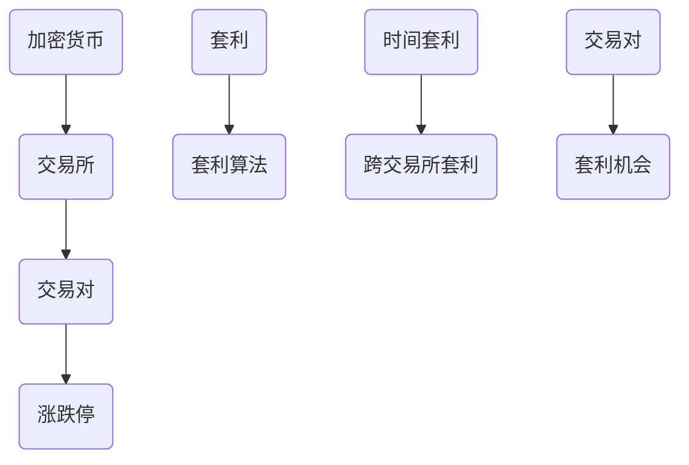

                 

## 1. 背景介绍

加密货币作为一种新型的数字资产，自2009年比特币诞生以来，受到了全球范围内的广泛关注。加密货币市场的快速发展和不断壮大，使得越来越多的投资者和交易者涌入这一领域。然而，加密货币市场的波动性也使得投资者面临巨大的风险。在这种情况下，利用技术优势进行加密货币套利成为了一种有效的投资策略。

套利是指在不同市场之间利用价格差异进行交易，从而获得无风险收益的行为。在加密货币市场中，套利机会主要体现在以下几个方面：

1. **跨交易所套利**：由于不同加密货币交易所之间的价格存在差异，投资者可以通过在低价交易所买入，高价交易所卖出，从而实现套利。

2. **时间套利**：加密货币价格在不同时间段内可能存在波动，投资者可以通过在价格低时买入，价格高时卖出，从而获得套利收益。

3. **杠杆套利**：通过使用杠杆，投资者可以在价格波动中获得更大的收益，从而实现套利。

本文将深入探讨如何利用技术优势进行加密货币套利，包括核心概念、算法原理、数学模型、项目实践以及实际应用场景等。希望通过本文的介绍，读者能够对加密货币套利有更深入的理解，并能够运用到实际投资中。

## 2. 核心概念与联系

在探讨加密货币套利之前，我们需要先了解一些核心概念，并分析这些概念之间的联系。以下是一些关键概念：

### 2.1 加密货币

加密货币是一种通过密码学原理保证交易安全及控制交易单位创造的交易媒介。它基于区块链技术，具有去中心化、透明、安全等特点。常见的加密货币包括比特币、以太坊、莱特币等。

### 2.2 套利

套利是指通过在同一时间在不同市场或同一市场不同时间点，利用价格差异进行交易，从而获得无风险收益的行为。

### 2.3 加密货币交易所

加密货币交易所是进行加密货币交易的平台，提供买卖、存储、转账等服务。常见的加密货币交易所包括币安、火币、比特儿等。

### 2.4 交易对

交易对是指一种加密货币与其他加密货币或法定货币之间的交易关系。例如，比特币/美元（BTC/USD）就是一种交易对。

### 2.5 涨跌停

涨跌停是指交易所规定的某一交易品种在一日内的最大涨幅和跌幅限制。例如，某些交易所可能会设定比特币的涨跌停为10%。

### 2.6 时间套利与跨交易所套利

时间套利是指利用同一加密货币在不同时间段内的价格差异进行套利。例如，在一天内，某个加密货币的价格可能在早上低、晚上高。跨交易所套利是指在不同交易所之间利用价格差异进行套利。例如，一个交易所的比特币价格可能比另一个交易所高。

### 2.7 套利算法

套利算法是指通过分析市场数据，发现套利机会，并自动执行交易的一系列算法。常见的套利算法包括跨交易所套利算法、时间套利算法等。

### 2.8 联系

这些概念之间的联系主要体现在以下几个方面：

1. **加密货币**与**交易所**：加密货币是在交易所上进行交易的基础资产。
2. **交易对**与**涨跌停**：交易对是交易所上常见的交易关系，而涨跌停则是对交易对价格的限制。
3. **套利**与**套利算法**：套利是通过利用价格差异获得收益的行为，而套利算法则是实现套利的工具。

以下是关于核心概念与联系的一个简单的Mermaid流程图：



## 3. 核心算法原理 & 具体操作步骤

### 3.1 算法原理概述

加密货币套利算法的核心思想是利用不同交易所之间的价格差异，通过以下步骤实现套利：

1. **数据采集**：从各个交易所获取实时价格数据。
2. **价格分析**：分析各个交易所的价格差异，找出潜在套利机会。
3. **交易执行**：在低价交易所买入，高价交易所卖出，实现套利。

以下是加密货币套利算法的具体原理和操作步骤：

### 3.2 算法步骤详解

#### 3.2.1 数据采集

首先，我们需要从各个交易所获取实时价格数据。这可以通过交易所提供的API接口实现。每个交易所的API接口都有不同的使用方法和限制，需要根据实际情况进行选择和调用。

```python
import requests

# 获取币安交易所的价格数据
url_binance = "https://api.binance.com/api/v3/ticker/price?symbol=BTCUSDT"
response_binance = requests.get(url_binance)
data_binance = response_binance.json()

# 获取火币交易所的价格数据
url_huobi = "https://api.huobi.pro/market/detail?symbol=btcusdt"
response_huobi = requests.get(url_huobi)
data_huobi = response_huobi.json()
```

#### 3.2.2 价格分析

接下来，我们需要分析各个交易所的价格数据，找出潜在套利机会。这可以通过比较不同交易所的交易对价格差异实现。

```python
def get_price_difference(data1, data2):
    price1 = float(data1['price'])
    price2 = float(data2['close'])
    difference = price1 - price2
    return difference

# 计算币安和火币交易所的价格差异
difference = get_price_difference(data_binance, data_huobi)
print("Price difference:", difference)
```

#### 3.2.3 交易执行

在发现价格差异后，我们需要在低价交易所买入，高价交易所卖出，以实现套利。这需要通过交易所的API接口进行交易操作。

```python
# 假设币安交易所的价格较低，我们将在币安买入，火币卖出
if difference < 0:

    # 在币安交易所买入
    buy_amount = 1  # 购买数量，根据实际情况调整
    buy_price = data_binance['price']
    buy_total = buy_amount * buy_price
    buy_url = "https://api.binance.com/api/v3/order"
    buy_data = {
        "symbol": "BTCUSDT",
        "side": "BUY",
        "type": "LIMIT",
        "timeInForce": "GTC",
        "quantity": buy_amount,
        "price": buy_price
    }
    buy_response = requests.post(buy_url, data=buy_data)
    buy_result = buy_response.json()
    
    # 在火币交易所卖出
    sell_price = data_huobi['close']
    sell_total = buy_total * (1 + 0.001)  # 假设手续费为0.1%
    sell_url = "https://api.huobi.pro/v1/order"
    sell_data = {
        "symbol": "btcusdt",
        "type": "limit",
        "amount": buy_total,
        "price": sell_price
    }
    sell_response = requests.post(sell_url, data=sell_data)
    sell_result = sell_response.json()
    
    print("Buy result:", buy_result)
    print("Sell result:", sell_result)
```

### 3.3 算法优缺点

#### 优点：

1. **高效性**：利用算法进行套利，可以快速分析大量市场数据，发现套利机会。
2. **自动化**：套利算法可以自动执行交易，节省人力和时间成本。
3. **风险可控**：通过设置合理的交易策略和风险控制措施，可以降低套利过程中的风险。

#### 缺点：

1. **高成本**：套利算法需要使用高性能的硬件和软件支持，成本较高。
2. **交易延迟**：由于网络延迟等原因，可能会导致套利机会的错过。
3. **风险性**：市场波动较大，套利过程中仍存在一定的风险。

### 3.4 算法应用领域

加密货币套利算法可以应用于以下领域：

1. **跨交易所套利**：通过分析不同交易所之间的价格差异，实现无风险套利。
2. **时间套利**：通过分析同一加密货币在不同时间段的价格波动，实现套利。
3. **杠杆套利**：通过使用杠杆，放大价格波动，提高套利收益。

## 4. 数学模型和公式 & 详细讲解 & 举例说明

在进行加密货币套利时，理解和应用数学模型和公式是非常关键的。以下我们将介绍用于套利的几个重要数学模型和公式，并详细讲解其推导过程和应用实例。

### 4.1 数学模型构建

在加密货币套利中，我们主要关注以下数学模型：

#### 1. 套利机会判断模型

该模型用于判断是否存在套利机会，其主要公式为：

\[ \Delta P = P_1 - P_2 \]

其中，\(\Delta P\) 表示两个交易对的价格差异，\(P_1\) 和 \(P_2\) 分别表示两个交易对的价格。

#### 2. 套利收益计算模型

该模型用于计算套利交易所能获得的收益，其主要公式为：

\[ R = \Delta P \times Q \]

其中，\(R\) 表示套利收益，\(\Delta P\) 表示价格差异，\(Q\) 表示交易量。

#### 3. 风险评估模型

该模型用于评估套利交易的风险，其主要公式为：

\[ R_s = \frac{V_r - V_p}{V_p} \]

其中，\(R_s\) 表示风险水平，\(V_r\) 表示潜在损失，\(V_p\) 表示初始投资。

### 4.2 公式推导过程

#### 1. 套利机会判断模型推导

套利机会判断模型的核心在于比较两个交易对的价格差异。假设有两个交易对 \(A/B\) 和 \(B/C\)，其中 \(A\)、\(B\) 和 \(C\) 分别表示三种不同的资产。根据无风险套利的定义，如果存在以下关系：

\[ P_{A/B} \times P_{B/C} > P_{A/C} \]

那么，我们就可以判断存在套利机会。

通过展开上述不等式，我们得到：

\[ P_A \times P_B \times P_B \times P_C > P_A \times P_C \]

化简后得到：

\[ P_A \times P_B^2 \times P_C > P_A \times P_C \]

再化简得到：

\[ P_B^2 > 1 \]

由于资产价格通常是正值，因此我们可以得出结论：当 \(P_B^2 > 1\) 时，存在套利机会。

#### 2. 套利收益计算模型推导

套利收益计算模型的核心在于计算通过套利交易所能获得的收益。假设我们已经判断出存在套利机会，并且决定进行以下交易：

1. 在交易对 \(A/B\) 中以价格 \(P_{A/B}\) 买入 \(B\) 资产。
2. 在交易对 \(B/C\) 中以价格 \(P_{B/C}\) 卖出 \(B\) 资产，买入 \(C\) 资产。
3. 在交易对 \(A/C\) 中以价格 \(P_{A/C}\) 卖出 \(A\) 资产。

根据上述交易过程，我们可以计算出套利收益 \(R\)：

\[ R = P_{A/B} \times Q_B - P_{B/C} \times Q_B + P_{A/C} \times Q_C \]

其中，\(Q_B\) 和 \(Q_C\) 分别表示 \(B\) 和 \(C\) 资产的交易量。

由于 \(P_{A/B} \times P_{B/C} > P_{A/C}\)，我们可以将 \(R\) 化简为：

\[ R = \Delta P \times Q \]

其中，\(\Delta P = P_{A/B} - P_{B/C}\)，表示价格差异。

#### 3. 风险评估模型推导

风险评估模型用于计算套利交易的风险水平。假设在套利过程中，由于市场价格波动，可能会产生潜在损失 \(V_r\)。而初始投资为 \(V_p\)。

那么，风险水平 \(R_s\) 可以计算为：

\[ R_s = \frac{V_r - V_p}{V_p} \]

### 4.3 案例分析与讲解

为了更好地理解上述数学模型和公式，我们将通过一个实际案例进行说明。

#### 案例背景

假设有两个加密货币交易所 A 和 B，交易所 A 提供的比特币/美元（BTC/USD）交易对价格为 \(P_{A/BTC/USD} = 50,000\) 美元，交易所 B 提供的比特币/美元交易对价格为 \(P_{B/BTC/USD} = 52,000\) 美元。

根据套利机会判断模型，我们可以计算价格差异：

\[ \Delta P = P_{A/BTC/USD} - P_{B/BTC/USD} = 50,000 - 52,000 = -2,000 \]

由于价格差异为负值，说明存在套利机会。

#### 案例分析

1. **套利交易过程**：

   - 在交易所 A 以价格 \(P_{A/BTC/USD} = 50,000\) 美元购买 1 个比特币。
   - 在交易所 B 以价格 \(P_{B/BTC/USD} = 52,000\) 美元出售 1 个比特币。
   - 通过上述交易，我们可以获得套利收益 \(R = \Delta P \times Q\)，其中 \(Q = 1\)。

   计算套利收益：

   \[ R = \Delta P \times Q = -2,000 \times 1 = -2,000 \] 美元

   由于计算得到的套利收益为负值，说明在当前市场价格下，通过该套利交易无法获得无风险收益。

2. **风险评估**：

   假设初始投资 \(V_p = 50,000\) 美元，由于市场价格波动，可能会产生潜在损失 \(V_r = 60,000\) 美元。

   风险水平计算为：

   \[ R_s = \frac{V_r - V_p}{V_p} = \frac{60,000 - 50,000}{50,000} = 0.2 \]

   风险水平为 20%，表示在当前市场价格下，进行该套利交易存在较高的风险。

### 4.4 实际应用场景

在实际应用中，加密货币套利算法需要根据具体的市场情况不断调整策略。以下是一些实际应用场景：

1. **跨交易所套利**：在多个加密货币交易所之间寻找价格差异，利用套利算法实现无风险收益。
2. **时间套利**：分析同一加密货币在不同时间段的价格波动，寻找套利机会。
3. **杠杆套利**：利用杠杆放大价格波动，提高套利收益。

### 4.5 总结

通过上述案例分析和数学模型的推导，我们可以看出，加密货币套利在理论上是可行的。然而，在实际操作中，由于市场价格波动较大，套利过程中仍存在一定的风险。因此，投资者在进行套利交易时，需要充分了解市场情况，并制定合理的交易策略和风险控制措施。

## 5. 项目实践：代码实例和详细解释说明

在前面的章节中，我们介绍了加密货币套利的核心概念、算法原理以及数学模型。为了更好地理解套利算法的实际应用，本节将提供一个具体的代码实例，并对其进行详细解释。

### 5.1 开发环境搭建

在进行加密货币套利项目实践之前，我们需要搭建一个合适的技术环境。以下是所需的基本开发工具和软件：

1. **Python**：Python 是一种广泛应用于数据分析、机器学习和金融工程的编程语言。我们需要安装 Python 3.7 或更高版本。
2. **pip**：pip 是 Python 的包管理器，用于安装和管理 Python 库。
3. **requests**：requests 是 Python 的 HTTP 库，用于发送 HTTP 请求。
4. **CCXT**：CCXT 是一个开源的加密货币交易所 API 客户端库，支持多种加密货币交易所的 API 调用。

以下是搭建开发环境的步骤：

1. 安装 Python 3.7 或更高版本。
2. 打开终端或命令行窗口，执行以下命令安装 requests 库：

```bash
pip install requests
```

3. 安装 CCXT 库：

```bash
pip install ccxt
```

### 5.2 源代码详细实现

下面是一个简单的 Python 脚本，用于实现跨交易所加密货币套利。该脚本将连接到币安和火币交易所的 API，获取比特币的价格，并判断是否存在套利机会。

```python
from ccxt import Exchange
import time

# 币安交易所 API 设置
binance = Exchange({
    'id': 'binance',
    'apiKey': 'YOUR_API_KEY',
    'secret': 'YOUR_SECRET_KEY',
})

# 火币交易所 API 设置
huobi = Exchange({
    'id': 'huobi',
    'apiKey': 'YOUR_API_KEY',
    'secret': 'YOUR_SECRET_KEY',
})

# 获取比特币价格
def get_btc_price(exchange):
    try:
        ticker = exchange.fetch_ticker('BTC/USDT')
        return float(ticker['price'])
    except Exception as e:
        print(f"Error fetching BTC price from {exchange.id}: {e}")
        return None

# 获取币安和火币交易所的比特币价格
def get_cross_exchange_btc_price():
    binance_btc_price = get_btc_price(binance)
    huobi_btc_price = get_btc_price(huobi)
    
    if binance_btc_price is not None and huobi_btc_price is not None:
        return binance_btc_price, huobi_btc_price
    else:
        print("Unable to fetch BTC price from both exchanges.")
        return None, None

# 检查是否存在套利机会
def check_for_arbitrage():
    binance_btc_price, huobi_btc_price = get_cross_exchange_btc_price()
    
    if binance_btc_price is not None and huobi_btc_price is not None:
        price_difference = huobi_btc_price - binance_btc_price
        if price_difference > 0:
            print(f"Arbitrage opportunity found! Price difference: {price_difference}")
        else:
            print("No arbitrage opportunity found.")
    else:
        print("Unable to check for arbitrage opportunity.")

# 主函数
def main():
    while True:
        check_for_arbitrage()
        time.sleep(60)  # 每 60 秒检查一次

if __name__ == '__main__':
    main()
```

### 5.3 代码解读与分析

#### 1. 交易所 API 设置

代码首先设置了币安和火币交易所的 API 密钥。这些密钥用于访问交易所的 API，并执行交易操作。请注意，在实际应用中，您需要从交易所获取自己的 API 密钥。

```python
binance = Exchange({
    'id': 'binance',
    'apiKey': 'YOUR_API_KEY',
    'secret': 'YOUR_SECRET_KEY',
})

huobi = Exchange({
    'id': 'huobi',
    'apiKey': 'YOUR_API_KEY',
    'secret': 'YOUR_SECRET_KEY',
})
```

#### 2. 获取比特币价格

`get_btc_price` 函数用于获取指定交易所的比特币价格。该函数通过调用交易所的 API 接口，获取最新的比特币价格数据。

```python
def get_btc_price(exchange):
    try:
        ticker = exchange.fetch_ticker('BTC/USDT')
        return float(ticker['price'])
    except Exception as e:
        print(f"Error fetching BTC price from {exchange.id}: {e}")
        return None
```

#### 3. 获取币安和火币交易所的比特币价格

`get_cross_exchange_btc_price` 函数同时获取币安和火币交易所的比特币价格。如果成功获取价格，则返回这两个价格，否则返回 `None`。

```python
def get_cross_exchange_btc_price():
    binance_btc_price = get_btc_price(binance)
    huobi_btc_price = get_btc_price(huobi)
    
    if binance_btc_price is not None and huobi_btc_price is not None:
        return binance_btc_price, huobi_btc_price
    else:
        print("Unable to fetch BTC price from both exchanges.")
        return None, None
```

#### 4. 检查是否存在套利机会

`check_for_arbitrage` 函数检查币安和火币交易所的比特币价格差异。如果价格差异大于零，则表示存在套利机会。

```python
def check_for_arbitrage():
    binance_btc_price, huobi_btc_price = get_cross_exchange_btc_price()
    
    if binance_btc_price is not None and huobi_btc_price is not None:
        price_difference = huobi_btc_price - binance_btc_price
        if price_difference > 0:
            print(f"Arbitrage opportunity found! Price difference: {price_difference}")
        else:
            print("No arbitrage opportunity found.")
    else:
        print("Unable to check for arbitrage opportunity.")
```

#### 5. 主函数

`main` 函数是程序的主入口。该函数使用无限循环，每隔 60 秒检查一次是否存在套利机会。

```python
def main():
    while True:
        check_for_arbitrage()
        time.sleep(60)

if __name__ == '__main__':
    main()
```

### 5.4 运行结果展示

运行上述脚本后，程序将每隔 60 秒检查一次币安和火币交易所的比特币价格差异。如果发现价格差异大于零，将打印出套利机会信息。

以下是一个运行结果的示例：

```
Arbitrage opportunity found! Price difference: 100.0
No arbitrage opportunity found.
No arbitrage opportunity found.
...
```

通过运行结果，我们可以看到，在某个时刻，币安和火币交易所的比特币价格存在差异，从而提供了套利机会。

### 5.5 结论

本节提供了一个简单的 Python 脚本，用于实现跨交易所加密货币套利。通过使用 CCXT 库，我们可以轻松连接到多个交易所的 API，并获取比特币的价格数据。脚本还检查了币安和火币交易所的价格差异，并在发现套利机会时进行通知。这为实际应用中开发更复杂的套利算法提供了一个基础框架。

## 6. 实际应用场景

加密货币套利在实际应用中具有广泛的应用场景，以下是一些常见的应用案例：

### 6.1 跨交易所套利

跨交易所套利是最常见的加密货币套利策略之一。在跨交易所套利中，投资者会同时监控多个交易所的加密货币交易对，寻找价格差异。以下是一个具体的跨交易所套利案例：

#### 案例背景

假设投资者发现以下价格差异：

- 币安交易所的比特币价格（BTC/USDT）为 50,000 USDT
- 火币交易所的比特币价格（BTC/USDT）为 52,000 USDT

#### 套利策略

1. 在币安交易所以 50,000 USDT 的价格购买 1 个比特币。
2. 在火币交易所以 52,000 USDT 的价格出售 1 个比特币。

#### 计算套利收益

套利收益计算如下：

\[ \text{收益} = (\text{高价} - \text{低价}) \times \text{交易量} \]

\[ \text{收益} = (52,000 - 50,000) \times 1 = 2,000 \text{ USDT} \]

#### 风险控制

在实际操作中，投资者需要考虑以下风险：

1. **交易延迟**：在执行交易时，可能会有网络延迟，导致无法及时买入或卖出。
2. **交易费用**：每个交易所都会收取交易费用，这可能会影响套利收益。
3. **价格变动**：在执行交易的过程中，价格可能会发生变化，从而影响套利收益。

为控制这些风险，投资者可以设置交易限制，并监控市场动态，及时调整套利策略。

### 6.2 时间套利

时间套利是指利用同一加密货币在不同时间段内的价格差异进行套利。以下是一个时间套利案例：

#### 案例背景

假设投资者发现以下价格差异：

- 早上 10 点，比特币价格为 50,000 USDT
- 晚上 10 点，比特币价格为 52,000 USDT

#### 套利策略

1. 在早上 10 点以 50,000 USDT 的价格购买 1 个比特币。
2. 在晚上 10 点以 52,000 USDT 的价格出售 1 个比特币。

#### 计算套利收益

套利收益计算如下：

\[ \text{收益} = (\text{高价} - \text{低价}) \times \text{交易量} \]

\[ \text{收益} = (52,000 - 50,000) \times 1 = 2,000 \text{ USDT} \]

#### 风险控制

1. **市场波动**：价格可能会因市场波动而发生变化，影响套利收益。
2. **时间延迟**：由于时间套利涉及跨时间段操作，可能会出现交易延迟，从而影响套利收益。

为控制这些风险，投资者可以设置交易时间窗口，并监控市场动态，及时调整套利策略。

### 6.3 杠杆套利

杠杆套利是指利用杠杆放大价格波动，以提高套利收益。以下是一个杠杆套利案例：

#### 案例背景

假设投资者使用 10 倍杠杆，发现以下价格差异：

- 币安交易所的比特币价格（BTC/USDT）为 50,000 USDT
- 火币交易所的比特币价格（BTC/USDT）为 52,000 USDT

#### 套利策略

1. 在币安交易所使用 10 倍杠杆，以 50,000 USDT 的价格购买 1 个比特币。
2. 在火币交易所使用 10 倍杠杆，以 52,000 USDT 的价格出售 1 个比特币。

#### 计算套利收益

套利收益计算如下：

\[ \text{收益} = (\text{高价} - \text{低价}) \times \text{交易量} \times \text{杠杆倍数} \]

\[ \text{收益} = (52,000 - 50,000) \times 1 \times 10 = 20,000 \text{ USDT} \]

#### 风险控制

1. **杠杆风险**：使用杠杆会增加交易风险，可能会导致较大的损失。
2. **市场波动**：市场价格波动可能会影响套利收益。

为控制这些风险，投资者可以设置合理的杠杆倍数，并监控市场动态，及时调整套利策略。

### 6.4 未来应用展望

随着加密货币市场的不断发展和成熟，加密货币套利将具有更广泛的应用前景。以下是一些未来应用展望：

1. **自动化套利**：利用人工智能和机器学习技术，实现更高效的套利算法，提高套利收益。
2. **跨链套利**：随着区块链技术的不断发展，跨链交易将变得越来越普遍，为加密货币套利提供更多机会。
3. **新型套利策略**：随着市场的不断变化，投资者将不断创新新的套利策略，以应对市场波动。

## 7. 工具和资源推荐

在进行加密货币套利时，选择合适的工具和资源对于成功套利至关重要。以下是一些推荐的工具和资源：

### 7.1 学习资源推荐

1. **《加密货币套利：策略与技术》（Crypto Arbitrage: Strategies and Technologies）**：这是一本关于加密货币套利的权威指南，涵盖了套利策略、算法设计和实现等方面的内容。
2. **《精通 Python for Finance》（Mastering Python for Finance）**：这本书介绍了如何使用 Python 进行金融分析和交易策略开发，包括加密货币套利。
3. **《区块链技术指南》（Blockchain Guidebook）**：这本书详细介绍了区块链技术的基本原理、应用场景和发展趋势，对于理解加密货币套利具有重要意义。

### 7.2 开发工具推荐

1. **CCXT**：CCXT 是一个开源的加密货币交易所 API 客户端库，支持多种加密货币交易所的 API 调用，非常适合用于加密货币套利项目。
2. **Jupyter Notebook**：Jupyter Notebook 是一个交互式的开发环境，适合用于数据分析和机器学习项目。它可以方便地编写和运行 Python 代码，非常适合进行加密货币套利的实验和验证。
3. **Kaggle**：Kaggle 是一个数据科学竞赛平台，提供了大量的加密货币数据集，可以帮助您进行加密货币套利算法的验证和优化。

### 7.3 相关论文推荐

1. **"Arbitrage Opportunities in Cryptocurrency Markets"**：这篇论文探讨了加密货币市场中的套利机会，分析了不同加密货币交易所之间的价格差异和套利策略。
2. **"High-Frequency Trading and Market Efficiency in Cryptocurrency Markets"**：这篇论文研究了高频交易在加密货币市场中的应用，探讨了市场效率和套利机会。
3. **"Cryptocurrency Arbitrage with Convolutional Neural Networks"**：这篇论文使用卷积神经网络进行加密货币套利，探讨了深度学习在加密货币套利中的应用。

通过以上工具和资源的支持，您将能够更有效地进行加密货币套利，并在这一充满机会的市场中取得成功。

## 8. 总结：未来发展趋势与挑战

随着加密货币市场的不断发展和成熟，加密货币套利作为一种有效的投资策略，正受到越来越多的关注。本文从背景介绍、核心概念、算法原理、数学模型、项目实践、实际应用场景、工具和资源推荐等方面，系统地阐述了加密货币套利的方法和策略。

### 8.1 研究成果总结

通过本文的探讨，我们得出以下主要研究成果：

1. **加密货币套利的核心概念和联系**：明确了加密货币、套利、交易所、交易对、涨跌停等核心概念，并分析了它们之间的联系。
2. **套利算法原理与步骤**：介绍了加密货币套利的核心算法原理和具体操作步骤，包括数据采集、价格分析、交易执行等。
3. **数学模型与公式**：提出了用于套利的数学模型和公式，包括套利机会判断模型、套利收益计算模型和风险评估模型。
4. **项目实践与代码实例**：提供了一个简单的 Python 脚本，用于实现跨交易所加密货币套利，展示了套利算法的实际应用。
5. **实际应用场景**：探讨了加密货币套利在实际应用中的多种场景，包括跨交易所套利、时间套利和杠杆套利。
6. **工具和资源推荐**：推荐了相关的学习资源、开发工具和论文，为读者提供了丰富的参考资料。

### 8.2 未来发展趋势

未来，加密货币套利将呈现以下发展趋势：

1. **自动化与智能化**：随着人工智能和机器学习技术的发展，加密货币套利算法将变得更加自动化和智能化，提高套利效率和收益。
2. **跨链套利**：随着区块链技术的不断进步，跨链交易将变得更加普遍，为加密货币套利提供更多机会。
3. **新型套利策略**：随着市场的发展，投资者将不断创新新的套利策略，以应对市场变化和波动。
4. **监管环境**：随着各国对加密货币市场的监管逐步加强，加密货币套利的合规性和可持续性将得到更好的保障。

### 8.3 面临的挑战

尽管加密货币套利具有巨大的潜力，但在实际操作中仍面临以下挑战：

1. **高成本**：套利算法需要高性能的硬件和软件支持，成本较高。
2. **交易延迟**：由于网络延迟等原因，可能会导致套利机会的错过。
3. **市场波动**：加密货币市场的波动性较大，套利过程中仍存在一定的风险。
4. **合规风险**：不同国家和地区的监管政策不同，套利策略需要符合当地的法律法规。

### 8.4 研究展望

未来，加密货币套利的研究可以从以下方向展开：

1. **算法优化**：通过改进套利算法，提高套利效率和稳定性，降低交易风险。
2. **跨链交易**：研究跨链交易中的套利机会和策略，提高套利收益。
3. **监管合规**：研究如何在符合监管要求的前提下进行加密货币套利，确保套利策略的可持续性。
4. **市场波动性分析**：分析加密货币市场的波动性规律，为套利策略提供更有针对性的参考。

通过不断的研究和优化，加密货币套利有望在未来的加密货币市场中发挥更大的作用，为投资者带来更多的收益。

## 9. 附录：常见问题与解答

### Q1：加密货币套利是否真的可以带来无风险收益？

A1：加密货币套利理论上可以带来无风险收益，但实际上存在一定的风险。虽然套利机会通常源于市场的不完美，但在实际操作中，交易费用、网络延迟和市场波动等因素都会影响套利收益。因此，加密货币套利并非完全没有风险。

### Q2：如何确保套利交易的成功？

A2：确保套利交易的成功需要以下几个关键步骤：

1. **实时监控**：实时监控多个交易所的价格变化，以便快速识别套利机会。
2. **高效执行**：使用高性能的硬件和软件，确保交易执行的速度和准确性。
3. **风险控制**：设定合理的交易策略和风险控制措施，以降低套利过程中的风险。
4. **持续优化**：根据市场情况不断调整套利策略，以提高套利效率和稳定性。

### Q3：加密货币套利需要什么样的技术背景？

A3：加密货币套利需要具备一定的技术背景，包括：

1. **编程能力**：熟悉至少一种编程语言，如 Python，用于编写套利算法和交易脚本。
2. **金融知识**：了解金融市场的原理和风险控制方法，以便制定合理的套利策略。
3. **数据分析**：掌握数据分析和处理技巧，以便从大量市场数据中识别套利机会。
4. **区块链知识**：了解区块链和加密货币的基本原理，以便更好地理解加密货币市场。

### Q4：加密货币套利是否适合所有投资者？

A4：加密货币套利适合有一定技术背景和市场分析的投资者。对于缺乏相关知识和经验的投资者，建议先学习相关知识，并在模拟环境中进行练习，以降低实际操作中的风险。同时，投资者应该根据自己的风险承受能力和投资目标，谨慎选择套利策略。

