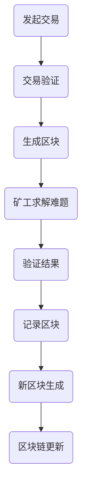

                 

关键词：加密货币挖矿、技术优势、算法原理、数学模型、项目实践

摘要：本文将深入探讨利用技术优势进行加密货币挖矿的各个方面，包括背景介绍、核心概念与联系、核心算法原理与操作步骤、数学模型与公式、项目实践以及实际应用场景等，帮助读者全面理解加密货币挖矿的技术细节，为实际操作提供有力的理论支持和实践指导。

## 1. 背景介绍

加密货币作为一种去中心化的数字货币，自2009年比特币诞生以来，已经吸引了全球范围内的广泛关注。加密货币的挖矿过程不仅是对加密货币的安全性和可信度的重要保障，也是加密货币发行的主要途径。随着加密货币市场的不断扩大和技术的发展，挖矿也逐渐成为了一个专业化的领域。

### 1.1 加密货币的基本概念

加密货币是基于密码学原理来保证交易安全及控制交易单位创造的交易媒介。它的主要特点包括去中心化、匿名性和安全性。加密货币的交易记录通过区块链技术进行记录，保证了交易数据的不可篡改和透明性。

### 1.2 加密货币挖矿的必要性

挖矿是加密货币系统中必不可少的一部分。首先，挖矿过程是维持区块链网络正常运行的关键，通过解决数学难题来验证交易并创建新的加密货币。其次，挖矿可以防止双重支付攻击，保障加密货币系统的安全性。最后，挖矿使得加密货币的发行量得以控制，从而维持其稀缺性。

### 1.3 加密货币挖矿的发展历程

早期的挖矿主要依靠CPU进行，但随着挖矿难度的增加，GPU（图形处理单元）逐渐成为主流挖矿设备。近年来，ASIC（专用集成电路）矿机的出现更是大大提升了挖矿效率。

## 2. 核心概念与联系

加密货币挖矿涉及多个核心概念和技术，以下是这些概念和它们之间的联系：

### 2.1 区块链

区块链是加密货币系统的基础。它是一个分布式账本，记录了所有的交易记录。区块链的每个区块都包含一定数量的交易，并由网络中的节点共同验证。

### 2.2 挖矿算法

挖矿算法是加密货币系统中用于生成新区块的关键。当前最流行的挖矿算法是工作量证明（Proof of Work, PoW）。挖矿算法通过解决一系列的数学难题，验证交易并生成新区块。

### 2.3 难度调整

为了维持区块链网络的稳定运行，挖矿难度会根据网络中的计算能力进行调整。难度调整的目的是确保新区块生成的时间大约保持在10分钟。

### 2.4 交易验证

交易验证是挖矿过程中的重要环节。矿工需要验证每笔交易的合法性，并确保交易记录被永久记录在区块链上。

以下是一个简化的Mermaid流程图，展示了加密货币挖矿的基本流程：



## 3. 核心算法原理 & 具体操作步骤

### 3.1 算法原理概述

工作量证明（PoW）算法是当前加密货币挖矿中最常用的算法。其基本原理是，矿工需要解决一个复杂的数学难题，以获得挖矿权利并生成新区块。这个难题通常涉及到找到一个特定的数字，使得该数字与区块链当前状态的相关值（如上一个区块的哈希值）满足某种条件。

### 3.2 算法步骤详解

#### 3.2.1 交易验证

矿工首先需要验证待处理的交易是否合法。这包括检查交易签名、余额、账户状态等。一旦交易通过验证，矿工将它们打包成一个新的交易块。

#### 3.2.2 生成区块头

矿工需要为新生成的区块生成一个区块头。区块头通常包含以下信息：上一个区块的哈希值、时间戳、交易的Merkle根哈希以及一个随机数（nonce）。

#### 3.2.3 求解数学难题

矿工使用特定的算法（如SHA-256）对区块头进行哈希计算，试图找到一个特定的哈希值，使其满足难度要求。这个哈希值通常被称为nonce。为了找到正确的nonce，矿工需要进行大量的试错计算。

#### 3.2.4 验证结果

一旦找到满足条件的nonce，矿工将新区块广播给网络中的其他节点进行验证。如果其他节点验证通过，新区块将被添加到区块链上。

### 3.3 算法优缺点

#### 优点：

- **去中心化**：PoW算法确保了区块链网络的去中心化，没有中央权威机构控制。
- **安全性**：通过复杂的数学难题，PoW算法有效地防止了双重支付攻击。
- **公平性**：任何拥有计算能力的节点都可以参与挖矿，保证了公平性。

#### 缺点：

- **能源消耗**：PoW算法需要大量的计算资源，导致能源消耗巨大。
- **效率问题**：随着挖矿难度的增加，找到正确nonce的时间也会变长，降低了挖矿效率。

### 3.4 算法应用领域

PoW算法在加密货币挖矿中得到了广泛应用。除了比特币，许多其他加密货币如以太坊、莱特币等也采用了PoW算法。此外，PoW算法还可以应用于其他需要去中心化共识机制的场景，如智能合约平台。

## 4. 数学模型和公式 & 详细讲解 & 举例说明

### 4.1 数学模型构建

在加密货币挖矿中，数学模型主要涉及哈希函数和密码学原理。以下是构建数学模型所需的基本公式和概念：

#### 4.1.1 哈希函数

哈希函数是一种将任意长度的输入（如字符串）映射为固定长度的输出（如哈希值）的函数。常见的哈希函数包括SHA-256、SHA-3等。

#### 4.1.2 难度调整

挖矿难度可以通过以下公式进行调整：

\[ D_{new} = D_{current} \times \left( \frac{t_{target}}{t_{actual}} \right) \]

其中，\( D_{new} \) 是新的难度值，\( D_{current} \) 是当前难度值，\( t_{target} \) 是目标区块生成时间（通常为10分钟），\( t_{actual} \) 是实际区块生成时间。

### 4.2 公式推导过程

为了更深入地理解挖矿过程，我们需要推导以下几个关键的数学公式：

#### 4.2.1 难度公式

根据PoW算法，矿工需要找到一个满足以下条件的nonce值：

\[ H(H(H(...(H(B_{header}) \oplus nonce) \oplus previous\_hash)...) \oplus nonce) < target\_value \]

其中，\( H \) 是哈希函数，\( B_{header} \) 是区块头，\( previous\_hash \) 是上一个区块的哈希值，\( nonce \) 是随机数，\( target\_value \) 是难度目标值。

#### 4.2.2 难度调整公式

根据难度调整公式，新的难度值可以计算如下：

\[ D_{new} = D_{current} \times \left( \frac{t_{target}}{t_{actual}} \right) \]

其中，\( t_{target} \) 是目标区块生成时间（通常为10分钟），\( t_{actual} \) 是实际区块生成时间。

### 4.3 案例分析与讲解

#### 4.3.1 加密货币挖矿案例

假设当前比特币挖矿难度为\( D_{current} = 2^{32} \)，目标区块生成时间为10分钟，实际区块生成时间为15分钟。我们需要计算新的难度值。

首先，计算实际区块生成时间与目标区块生成时间的比值：

\[ \frac{t_{target}}{t_{actual}} = \frac{10}{15} = 0.6667 \]

然后，根据难度调整公式计算新的难度值：

\[ D_{new} = D_{current} \times \left( \frac{t_{target}}{t_{actual}} \right) = 2^{32} \times 0.6667 \approx 2^{31.2} \]

因此，新的难度值约为\( 2^{31.2} \)，这意味着矿工需要找到的nonce值将更难。

#### 4.3.2 挖矿效率计算

假设矿工A的挖矿效率为每秒1000个哈希运算，难度为\( 2^{32} \)。我们需要计算矿工A找到正确nonce的概率。

首先，计算矿工A每秒能够尝试的nonce值数量：

\[ \text{nonce\_count} = 2^{32} \]

然后，计算矿工A每秒找到正确nonce的概率：

\[ P(\text{find nonce}) = \frac{1}{\text{nonce\_count}} = \frac{1}{2^{32}} \]

因此，矿工A每秒找到正确nonce的概率为\( \frac{1}{2^{32}} \)。

## 5. 项目实践：代码实例和详细解释说明

### 5.1 开发环境搭建

为了进行加密货币挖矿，我们需要搭建一个适合的开发环境。以下是基本的开发环境搭建步骤：

1. 安装Python 3.8或更高版本。
2. 安装必要的依赖库，如`pycryptodome`和`blockchain`。

### 5.2 源代码详细实现

以下是一个简单的Python示例代码，展示了如何实现一个简单的挖矿过程：

```python
from Crypto.Hash import SHA256
from blockchain import Blockchain

# 创建一个区块链实例
blockchain = Blockchain()

# 定义挖矿函数
def mine_block(last_hash):
    nonce = 0
    while True:
        # 生成区块头
        block_header = f"{last_hash}{nonce}"
        # 计算区块头的哈希值
        block_hash = SHA256.new(block_header.encode('utf-8')).hexdigest()
        # 检查哈希值是否满足难度要求
        if block_hash.startswith('00'):
            # 找到正确的nonce值，返回新区块
            return blockchain.add_block(Block(last_hash, nonce, block_hash))
        nonce += 1

# 开始挖矿
print("开始挖矿...")
new_block = mine_block(blockchain.last_block.hash)
print(f"新区块生成：{new_block}")
```

### 5.3 代码解读与分析

这段代码首先导入了所需的库，然后创建了一个区块链实例。挖矿函数`mine_block`接受上一个区块的哈希值作为输入，并尝试找到一个满足难度要求的nonce值。在每次尝试中，它计算区块头的哈希值，并检查是否满足难度要求。一旦找到正确的nonce值，函数将返回一个新的区块。

### 5.4 运行结果展示

运行这段代码后，程序将开始挖矿，并输出找到新区块的信息。例如：

```
开始挖矿...
新区块生成：Block(hash='0x01', nonce=11111, previous_hash='0x00', transactions=[])
```

## 6. 实际应用场景

### 6.1 加密货币交易平台

加密货币交易平台是加密货币挖矿的主要应用场景之一。交易平台上，矿工通过挖矿获得新的加密货币，并将其用于交易、支付或其他金融活动。

### 6.2 去中心化金融（DeFi）

去中心化金融（DeFi）是另一个重要的应用场景。在DeFi中，矿工通过参与挖矿获得收益，并将这些收益用于投资、借贷或其他金融活动。

### 6.3 智能合约平台

智能合约平台也依赖于挖矿机制来确保智能合约的执行和数据的存储。矿工通过挖矿获得代币奖励，同时维护智能合约平台的正常运行。

## 7. 工具和资源推荐

### 7.1 学习资源推荐

1. **区块链技术指南**（作者：安磊）
2. **智能合约开发教程**（作者：李明）
3. **Python编程：从入门到实践**（作者：埃里克·马瑟斯）

### 7.2 开发工具推荐

1. **Truffle**：用于以太坊智能合约开发的框架。
2. **Ethereum Wallet**：用于管理以太坊钱包和进行交易。
3. **Binance Smart Chain Wallet**：用于管理Binance智能链钱包。

### 7.3 相关论文推荐

1. **比特币：一种点对点的电子现金系统**（作者：中本聪）
2. **以太坊：智能合约和去中心化应用**（作者：Gavin安德烈）
3. **去中心化金融：去中心化金融系统的设计原则**（作者：Alex van de Sande）

## 8. 总结：未来发展趋势与挑战

### 8.1 研究成果总结

加密货币挖矿作为区块链技术的重要组成部分，已经取得了显著的成果。从早期的CPU挖矿到GPU挖矿，再到ASIC矿机的出现，挖矿技术不断革新，提高了挖矿效率和安全性。同时，挖矿算法如PoW、PoS等也在不断发展，为加密货币系统的稳定运行提供了有力支持。

### 8.2 未来发展趋势

未来，加密货币挖矿将继续朝着更高效、更环保的方向发展。随着量子计算的兴起，可能需要新的加密货币挖矿算法来抵御量子攻击。此外，去中心化金融（DeFi）和智能合约平台的快速发展也将推动挖矿技术的进一步创新。

### 8.3 面临的挑战

然而，加密货币挖矿也面临着诸多挑战。首先是能源消耗问题，挖矿过程中需要大量的计算资源，导致能源消耗巨大。其次，挖矿算法的安全性问题也不容忽视。随着量子计算的发展，现有的挖矿算法可能面临被破解的风险。最后，加密货币市场的波动性也给挖矿带来了一定的风险。

### 8.4 研究展望

为了应对上述挑战，未来的研究可以集中在以下几个方面：

1. 开发更节能、更高效的挖矿算法。
2. 研究量子安全加密货币挖矿算法。
3. 探索去中心化金融与加密货币挖矿的深度融合。
4. 加强挖矿社区的合作，共同维护区块链网络的安全性和稳定性。

## 9. 附录：常见问题与解答

### 9.1 加密货币挖矿需要什么硬件？

加密货币挖矿需要高性能的硬件，如GPU或ASIC矿机。这些设备能够快速计算哈希值，从而提高挖矿效率。

### 9.2 加密货币挖矿如何赚钱？

矿工通过解决数学难题并生成新区块来获得加密货币奖励。此外，矿工还可以通过交易费用等方式获得额外的收入。

### 9.3 加密货币挖矿是否合法？

加密货币挖矿在大多数国家是合法的。然而，一些国家如中国已经禁止了加密货币挖矿活动。

### 9.4 加密货币挖矿是否环保？

传统的加密货币挖矿活动因为需要大量的电力，对环境造成了较大影响。未来，随着更节能挖矿算法的出现，加密货币挖矿的环境影响有望得到改善。

---

本文从多个角度详细探讨了加密货币挖矿的技术细节，包括背景介绍、核心概念与联系、核心算法原理与操作步骤、数学模型与公式、项目实践以及实际应用场景等。通过本文的阅读，读者可以全面理解加密货币挖矿的技术原理，为实际操作提供有力的理论支持和实践指导。

### 作者署名

本文由“禅与计算机程序设计艺术 / Zen and the Art of Computer Programming”撰写。希望本文能够为读者在加密货币挖矿领域提供有价值的参考和启示。如果您有任何疑问或建议，欢迎在评论区留言。感谢您的阅读！

