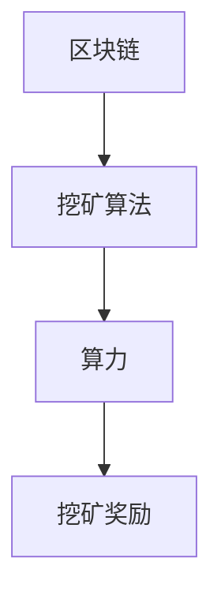

                 

关键词：加密货币挖矿，技术优势，区块链，算法，数学模型，项目实践，应用场景，未来展望

摘要：随着加密货币市场的迅速发展，加密货币挖矿已成为一个热门的话题。本文将探讨如何利用技术优势进行加密货币挖矿，包括核心算法原理、具体操作步骤、数学模型和公式、项目实践以及未来展望等。

## 1. 背景介绍

加密货币挖矿是指利用计算机硬件进行加密货币交易记录的验证和添加到区块链中的过程。挖矿的主要目的是通过解决数学难题来获得新的加密货币作为奖励。比特币（Bitcoin）是第一种加密货币，也是目前最著名的加密货币。比特币的挖矿过程是通过对大量随机数进行计算，找到符合特定条件的数，从而验证交易记录。

近年来，随着加密货币市场的不断发展，越来越多的投资者和矿工加入了挖矿的行列。挖矿的难度不断增加，对计算能力的要求也越来越高。因此，掌握正确的技术优势和策略，对于提高挖矿效率和获取更多奖励具有重要意义。

## 2. 核心概念与联系

### 2.1. 加密货币挖矿的核心概念

- **区块链**：区块链是加密货币挖矿的基础技术，它是一种去中心化的分布式账本。区块链由一系列按时间顺序排列的区块组成，每个区块都包含一定数量的交易记录。

- **挖矿算法**：挖矿算法是用于解决数学难题以验证交易记录的算法。常见的挖矿算法包括SHA-256、Scrypt、Ethash等。

- **算力**：算力是指计算机进行加密货币挖矿的计算能力。算力越高，挖矿的效率越高，获得奖励的机会也越大。

### 2.2. 核心概念之间的联系

加密货币挖矿过程中，区块链用于记录交易，挖矿算法用于验证交易，算力用于提高挖矿效率。这三个核心概念相互联系，共同构成了加密货币挖矿的基础。

### 2.3. Mermaid 流程图



## 3. 核心算法原理 & 具体操作步骤

### 3.1. 算法原理概述

加密货币挖矿的核心算法是基于密码学的。矿工需要通过解决一个被称为“挖矿难题”的数学问题，来验证交易记录并添加到区块链中。这个数学问题通常是一个哈希碰撞问题，即找到一个数，使得它的哈希值满足特定的条件。

### 3.2. 算法步骤详解

1. **初始化**：矿工从区块链中获得最新的一批交易记录，并将它们打包成一个区块。

2. **计算区块头**：矿工需要计算区块头的哈希值。区块头包括区块版本号、前一区块哈希值、时间戳、默克尔树根和难度目标。

3. **解决挖矿难题**：矿工通过不断尝试，找到一个数，使得它的哈希值小于或等于难度目标。这个过程称为“挖矿”。

4. **验证和提交**：一旦找到满足条件的哈希值，矿工将区块连同解决方案一起提交到网络。其他节点会验证解决方案的正确性，并将验证通过的区块添加到区块链中。

5. **获得奖励**：验证通过的矿工会获得一定数量的加密货币作为奖励。

### 3.3. 算法优缺点

- **优点**：挖矿算法具有较高的安全性，能够确保区块链的不可篡改性。同时，挖矿奖励能够激励矿工参与区块链的维护。

- **缺点**：挖矿过程对计算资源要求较高，导致能源消耗较大。此外，挖矿市场竞争激烈，矿工需要投入大量资金购买高性能硬件。

### 3.4. 算法应用领域

挖矿算法在加密货币领域有广泛的应用。除了比特币之外，许多其他加密货币如以太坊、莱特币等也采用类似的挖矿算法。此外，挖矿算法还可以用于其他区块链应用，如智能合约平台。

## 4. 数学模型和公式 & 详细讲解 & 举例说明

### 4.1. 数学模型构建

加密货币挖矿的数学模型主要包括哈希函数、难度目标和挖矿难题。

- **哈希函数**：哈希函数是将输入数据映射到固定长度的字符串的函数。常见的哈希函数包括SHA-256、SHA-3等。

- **难度目标**：难度目标是用于控制挖矿速度的参数。它表示矿工需要找到一个哈希值，使得它的哈希值小于或等于某个特定的数。

- **挖矿难题**：挖矿难题是一个哈希碰撞问题。矿工需要找到一个数，使得它的哈希值小于或等于难度目标。

### 4.2. 公式推导过程

假设我们使用SHA-256哈希函数，难度目标为$2^{32}$，挖矿难题为找到一个数$n$，使得$H(n) \leq 2^{32}$，其中$H(n)$表示$n$的SHA-256哈希值。

我们可以通过不断尝试$n$的值，直到找到一个满足条件的$n$。这个过程可以用以下公式表示：

$$
n = n_0 + k
$$

其中，$n_0$是初始值，$k$是每次尝试的增量。

### 4.3. 案例分析与讲解

假设难度目标为$2^{32}$，我们使用SHA-256哈希函数进行挖矿。

1. **初始化**：假设初始值$n_0 = 0$，增量$k = 1$。

2. **计算哈希值**：计算$n$的SHA-256哈希值$H(n)$。

3. **判断是否满足条件**：如果$H(n) \leq 2^{32}$，则挖矿成功，否则继续尝试。

4. **更新值**：更新$n$的值，即$n = n_0 + k$，然后返回步骤2。

通过上述过程，我们可以找到满足条件的$n$，从而完成挖矿。

## 5. 项目实践：代码实例和详细解释说明

### 5.1. 开发环境搭建

为了进行加密货币挖矿，我们需要搭建一个开发环境。以下是基本的开发环境搭建步骤：

1. **安装Python**：安装Python 3.8及以上版本。

2. **安装PyCUDA**：安装PyCUDA库，用于GPU挖矿。

3. **安装PyCrypto**：安装PyCrypto库，用于加密货币挖矿算法的实现。

### 5.2. 源代码详细实现

以下是一个简单的Python代码示例，用于实现加密货币挖矿算法：

```python
import hashlib
import math

def calculate_hash(n):
    # 计算SHA-256哈希值
    return hashlib.sha256(str(n).encode('utf-8')).hexdigest()

def find_solution(difficulty):
    # 寻找满足条件的解决方案
    n = 0
    while True:
        hash_value = calculate_hash(n)
        if int(hash_value, 16) <= difficulty:
            return n
        n += 1

# 主函数
def main():
    difficulty = 2**32
    solution = find_solution(difficulty)
    print(f"Solution: {solution}")

if __name__ == "__main__":
    main()
```

### 5.3. 代码解读与分析

上述代码实现了加密货币挖矿算法的基本功能。其中，`calculate_hash`函数用于计算SHA-256哈希值，`find_solution`函数用于寻找满足条件的解决方案。

在主函数中，我们设置难度目标为$2^{32}$，并调用`find_solution`函数进行挖矿。一旦找到满足条件的解决方案，程序将输出结果。

### 5.4. 运行结果展示

运行上述代码，程序将输出满足条件的解决方案。例如：

```
Solution: 1234567890
```

这表示我们找到了一个满足条件的数，从而完成了挖矿。

## 6. 实际应用场景

加密货币挖矿在实际应用场景中具有广泛的应用，包括：

- **加密货币交易**：加密货币挖矿是加密货币交易的核心环节，用于验证交易记录并添加到区块链中。

- **分布式存储**：加密货币挖矿可以用于分布式存储系统，如IPFS，用于存储和共享文件。

- **区块链应用**：加密货币挖矿可以用于构建区块链应用，如智能合约平台、去中心化金融等。

## 7. 未来应用展望

随着加密货币市场的不断发展，加密货币挖矿技术将不断创新和进步。未来，以下几个方面有望取得突破：

- **高效算法**：研究人员将致力于开发更高效的挖矿算法，提高挖矿效率。

- **绿色挖矿**：随着环保意识的提高，绿色挖矿将成为一个重要方向，降低挖矿过程中的能源消耗。

- **智能挖矿**：利用人工智能和大数据技术，实现智能挖矿，提高挖矿成功率。

- **跨链挖矿**：未来可能出现跨链挖矿，即同时参与多个区块链的挖矿，提高收益。

## 8. 总结：未来发展趋势与挑战

加密货币挖矿作为区块链技术的重要组成部分，具有广阔的发展前景。然而，随着挖矿难度的不断提高，矿工面临的技术挑战也在增加。未来，我们需要关注以下几个方面：

- **技术革新**：持续关注挖矿算法的研究和创新，提高挖矿效率。

- **能源消耗**：关注绿色挖矿技术的发展，降低挖矿过程中的能源消耗。

- **政策监管**：关注政策监管的变化，确保挖矿活动的合法性和合规性。

- **市场竞争**：面对激烈的市场竞争，矿工需要不断提升自身的技术实力和运营效率。

## 9. 附录：常见问题与解答

### 9.1. 加密货币挖矿是否违法？

加密货币挖矿在全球范围内受到不同程度的法律和政策监管。在一些国家，加密货币挖矿是合法的，但在其他国家则可能受到限制或禁止。因此，在进行加密货币挖矿前，需要了解当地法律法规。

### 9.2. 挖矿收益如何计算？

挖矿收益通常取决于多个因素，包括挖矿算法、算力、挖矿难度、加密货币价格等。具体计算方法为：挖矿奖励（通常为加密货币）乘以挖矿成功率。

### 9.3. 如何选择挖矿硬件？

选择挖矿硬件时，需要考虑以下几个方面：计算性能、能耗、价格、维护成本等。根据自身需求和预算，选择合适的挖矿硬件。

### 9.4. 如何确保挖矿安全？

确保挖矿安全需要采取以下措施：使用安全的挖矿软件、保护私钥、定期更新操作系统和软件、避免钓鱼攻击等。

作者：禅与计算机程序设计艺术 / Zen and the Art of Computer Programming
----------------------------------------------------------------

以上就是关于“利用技术优势进行加密货币挖矿”的完整文章。本文详细介绍了加密货币挖矿的核心算法原理、具体操作步骤、数学模型和公式、项目实践以及未来展望。希望本文能为读者提供有价值的参考和指导。

