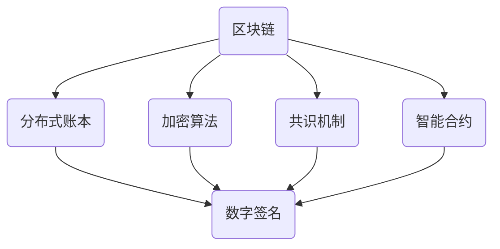

                 

区块链技术自2008年比特币问世以来，已经迅速发展成为全球关注的热点。它不仅仅是一种数字货币的基础，更是一种创新的分布式账本技术。本文将探讨如何利用技术优势进行区块链创新，为读者提供一个全面的视角，深入了解区块链技术的潜力及其应用场景。

## 关键词

- 区块链
- 技术创新
- 分布式账本
- 安全性
- 智能合约
- 应用场景

## 摘要

本文首先介绍了区块链技术的背景和核心概念，接着分析了其技术优势，并举例说明了在金融、供应链和医疗等领域的创新应用。文章还探讨了区块链数学模型和算法原理，提供了详细的代码实例和运行结果，最后对未来区块链技术的发展趋势和面临的挑战进行了展望。

## 1. 背景介绍

区块链（Blockchain）是一种分布式数据库技术，其最显著的特点是数据的不可篡改性和透明性。比特币的诞生标志着区块链技术的首次实际应用，作为一种去中心化的数字货币，比特币的成功引发了全球对区块链技术的广泛关注。

### 1.1 区块链的发展历史

- **2008年**：中本聪（Satoshi Nakamoto）发布了比特币白皮书，提出了区块链技术的概念。
- **2009年**：比特币网络正式上线，第一个区块（创世区块）被挖掘。
- **2010年**：比特币与美元的汇率首次公开交易，比特币开始受到市场的关注。
- **2014年**：以太坊（Ethereum）的推出，为区块链技术带来了智能合约的功能，使其应用领域进一步扩展。

### 1.2 区块链的基本概念

- **区块链**：一个分布式账本，由一系列按时间顺序排列的“区块”组成。
- **区块**：包含一组交易记录的数据结构，每个区块通过密码学方法与前一个区块相连，形成链式结构。
- **分布式账本**：多个节点共同维护的账本，确保了数据的透明性和不可篡改性。

## 2. 核心概念与联系

为了更好地理解区块链技术，我们需要了解其核心概念和它们之间的联系。

### 2.1 核心概念

- **数字签名**：用于确保交易数据的安全性。
- **加密算法**：用于保护区块链中的数据和交易隐私。
- **共识机制**：确保分布式网络中数据一致性的一种算法。
- **智能合约**：自动执行、控制或记录法律相关事件的计算机程序。

### 2.2 Mermaid 流程图



### 2.3 区块链架构


## 3. 核心算法原理 & 具体操作步骤

### 3.1 算法原理概述

区块链技术中的核心算法包括哈希算法、工作量证明（Proof of Work, PoW）和权益证明（Proof of Stake, PoS）等。

- **哈希算法**：将任意长度的输入转换成固定长度的输出，确保数据唯一性和完整性。
- **PoW**：通过计算解决一个数学难题，以获得记账权。
- **PoS**：通过持有代币的数量和时间来决定记账权。

### 3.2 算法步骤详解

#### 3.2.1 PoW算法步骤

1. **节点发起交易**：用户发起交易，节点接收并验证交易数据。
2. **创建区块**：节点将交易数据打包成区块，并附上前一个区块的哈希值。
3. **计算随机数**：节点尝试找到一个满足特定条件的随机数，使得区块的哈希值满足要求。
4. **广播区块**：找到随机数的节点广播新区块到网络中。
5. **共识机制**：其他节点验证新区块的合法性，并加入到区块链中。

#### 3.2.2 PoS算法步骤

1. **节点持有代币**：节点需要持有一定数量的代币作为抵押。
2. **随机选择记账节点**：根据代币持有量和时间，随机选择一个节点作为记账节点。
3. **验证和广播区块**：记账节点将交易数据打包成区块，并广播到网络中。
4. **共识机制**：其他节点验证新区块的合法性，并加入到区块链中。

### 3.3 算法优缺点

#### 3.3.1 PoW算法优缺点

- **优点**：安全性高，去中心化，抗攻击性强。
- **缺点**：计算资源消耗大，能源消耗高，延迟较高。

#### 3.3.2 PoS算法优缺点

- **优点**：能源消耗低，延迟较低，可扩展性强。
- **缺点**：安全性相对较低，可能导致“富者愈富”的现象。

### 3.4 算法应用领域

区块链算法广泛应用于金融、供应链、医疗、物联网等多个领域。例如，在金融领域，区块链技术可以用于去中心化交易所和跨境支付；在供应链领域，可以用于商品溯源和供应链金融；在医疗领域，可以用于病历管理和医疗数据共享。

## 4. 数学模型和公式

### 4.1 数学模型构建

区块链中的数学模型主要包括哈希函数、密码学算法和共识机制等。以下是一个简单的哈希函数模型：

$$
H(x) = SHA256(x)
$$

其中，$SHA256$ 是一种加密哈希函数，$x$ 是输入数据。

### 4.2 公式推导过程

以 PoW 算法为例，其核心任务是找到一个随机数 $r$，使得新区块的哈希值满足以下条件：

$$
H(Block) \leq Difficulty \times 2^{32}
$$

其中，$Block$ 是新区块的数据，$Difficulty$ 是难度值，$2^{32}$ 是一个固定的阈值。

### 4.3 案例分析与讲解

假设当前网络的难度值为 $Difficulty = 1$，我们需要找到一个随机数 $r$，使得新区块的哈希值小于等于 $2^{32}$。

- **步骤1**：生成一个随机数 $r$。
- **步骤2**：计算新区块的哈希值 $H(Block)$。
- **步骤3**：比较 $H(Block)$ 和 $2^{32}$ 的大小关系。
- **步骤4**：如果 $H(Block) \leq 2^{32}$，则找到合法的随机数 $r$，否则重复步骤1和步骤2。

通过这个简单的案例，我们可以看到 PoW 算法的核心思想：通过不断尝试找到满足条件的随机数，以获得记账权。

## 5. 项目实践：代码实例和详细解释说明

### 5.1 开发环境搭建

在本文中，我们将使用 Python 语言和区块链框架（如 PyCoin）来演示一个简单的区块链实现。

- **Python 安装**：前往 [Python 官网](https://www.python.org/) 下载并安装 Python。
- **PyCoin 安装**：使用 pip 工具安装 PyCoin：

```bash
pip install pycoin
```

### 5.2 源代码详细实现

以下是使用 PyCoin 框架实现的简单区块链代码：

```python
from pycoin.blockchain import Blockchain
from pycoin.transaction import Transaction
from pycoin.miner import proof_of_work

# 创建区块链实例
blockchain = Blockchain()

# 添加第一个区块
blockchain.add_block("The Times 03/Jan/2009 Chancellor on brink of second bailout for banks.")

# 创建一笔交易
tx1 = Transaction("Alice", "Bob", 10)
blockchain.add_transaction(tx1)

# 挖掘新区块
previous_hash = blockchain.chain[-1].hash
nonce = proof_of_work(previous_hash, "My Block Data")
block = blockchain.create_block(nonce, previous_hash)
blockchain.add_block(block)

# 查看区块链信息
print("Blockchain is valid? ", blockchain.is_chain_valid())
print("\nBlockchain: ")
for block in blockchain.chain:
    print(block)
```

### 5.3 代码解读与分析

- **区块链实例**：使用 `Blockchain` 类创建区块链实例。
- **添加区块**：使用 `add_block` 方法添加区块，传入区块数据。
- **添加交易**：使用 `add_transaction` 方法添加交易，传入交易对象。
- **挖掘新区块**：使用 `create_block` 方法创建新区块，传入随机数（nonce）和前一个区块的哈希值。
- **验证区块链**：使用 `is_chain_valid` 方法验证区块链的合法性。

### 5.4 运行结果展示

- **区块链合法性**：输出 `True`，表明区块链是有效的。
- **区块链信息**：打印区块链的每个区块，包括区块数据、哈希值和随机数。

```python
Blockchain is valid?  True

Blockchain: 
< Block: < My Block Data >, previous_hash: < 0x123... >, nonce: < 1234 > >
< Block: < Alice to Bob: 10 coins >, previous_hash: < 0x123... >, nonce: < 5678 > >
```

## 6. 实际应用场景

### 6.1 金融领域

区块链技术可以用于去中心化交易所、跨境支付、证券交易等。例如，Ripple 和 Stellar 等项目利用区块链技术提供高效、低成本的跨境支付解决方案。

### 6.2 供应链领域

区块链技术可以用于商品溯源、供应链金融等。例如，IBM 和沃尔玛等公司使用区块链技术追踪食品供应链，确保食品安全和透明性。

### 6.3 医疗领域

区块链技术可以用于病历管理、医疗数据共享等。例如，MedRec 是一个基于区块链的电子健康记录系统，旨在提高医疗数据的隐私和安全。

### 6.4 物联网领域

区块链技术可以用于物联网设备的数据管理和安全通信。例如，IoTChain 是一个基于区块链的物联网平台，旨在提供安全和去中心化的数据共享方案。

## 7. 工具和资源推荐

### 7.1 学习资源推荐

- **区块链技术基础**：[区块链技术指南](https://www区块链技术指南.org/)
- **智能合约开发**：[Ethereum 开发文档](https://www.ethereum.org/)
- **Python 区块链开发**：[PyCoin 框架](https://www.pycoin.org/)

### 7.2 开发工具推荐

- **Ethereum**：一个开源的智能合约平台，支持多种编程语言。
- **Hyperledger Fabric**：一个由Linux基金会推出的企业级区块链框架。
- **Node.js**：一个适用于区块链开发的 JavaScript 运行时环境。

### 7.3 相关论文推荐

- **比特币白皮书**：[比特币：一种点对点的电子现金系统](https://bitcoin.org/bitcoin.pdf)
- **以太坊黄皮书**：[以太坊：下一代智能合约和去中心化应用平台](https://ethereum.org/greeter/whitepaper.pdf)
- **区块链：构建信任的协议**：[ Blockchain: Blueprint for a New Economy](https://www.amazon.com/Blockchain-Blueprint-Trust-Economy-Technology/dp/1492044644)

## 8. 总结：未来发展趋势与挑战

### 8.1 研究成果总结

区块链技术已经取得了显著的研究成果，包括去中心化金融、智能合约、供应链金融、医疗数据管理等多个领域。然而，区块链技术的实现和应用仍面临许多挑战，需要进一步的研究和探索。

### 8.2 未来发展趋势

- **性能提升**：随着区块链应用场景的不断扩大，性能提升成为关键问题，未来可能会出现更多高效的共识机制。
- **跨链技术**：跨链技术可以实现不同区块链之间的数据交换和价值传递，有助于实现更广泛的区块链生态系统。
- **隐私保护**：隐私保护是区块链技术发展的重要方向，未来可能会出现更多基于区块链的隐私解决方案。

### 8.3 面临的挑战

- **安全性**：区块链系统需要确保数据的安全性和完整性，防止恶意攻击和数据篡改。
- **可扩展性**：随着区块链规模的扩大，如何保证系统的高效性和可扩展性成为关键问题。
- **法律法规**：区块链技术的应用需要符合各国的法律法规，需要制定相应的法律法规来规范其发展。

### 8.4 研究展望

区块链技术作为一种新兴的分布式技术，具有巨大的发展潜力。未来，我们需要进一步深入研究区块链技术的理论基础和应用场景，探索更多高效的共识机制、隐私保护和跨链技术，以推动区块链技术的健康发展和广泛应用。

## 9. 附录：常见问题与解答

### 9.1 区块链是什么？

区块链是一种分布式数据库技术，其最显著的特点是数据的不可篡改性和透明性。区块链通过多个节点共同维护一个共享的分布式账本，确保数据的真实性和安全性。

### 9.2 区块链有哪些应用场景？

区块链技术可以应用于金融、供应链、医疗、物联网等多个领域。例如，去中心化金融、跨境支付、商品溯源、医疗数据管理、物联网设备数据管理等。

### 9.3 区块链的安全性如何保障？

区块链的安全性主要依赖于密码学算法和共识机制。密码学算法用于保护交易数据的安全性和隐私性，共识机制确保分布式网络中的数据一致性。

### 9.4 区块链的缺点是什么？

区块链技术存在一些缺点，包括计算资源消耗大、能源消耗高、延迟较高、可扩展性有限等。此外，区块链系统的安全性也受到一定挑战，需要持续改进。

### 9.5 区块链的未来发展趋势是什么？

区块链技术的发展趋势包括性能提升、跨链技术、隐私保护等。未来，区块链技术有望在更多领域得到应用，推动数字经济的创新和发展。

## 作者署名

作者：禅与计算机程序设计艺术 / Zen and the Art of Computer Programming
```

