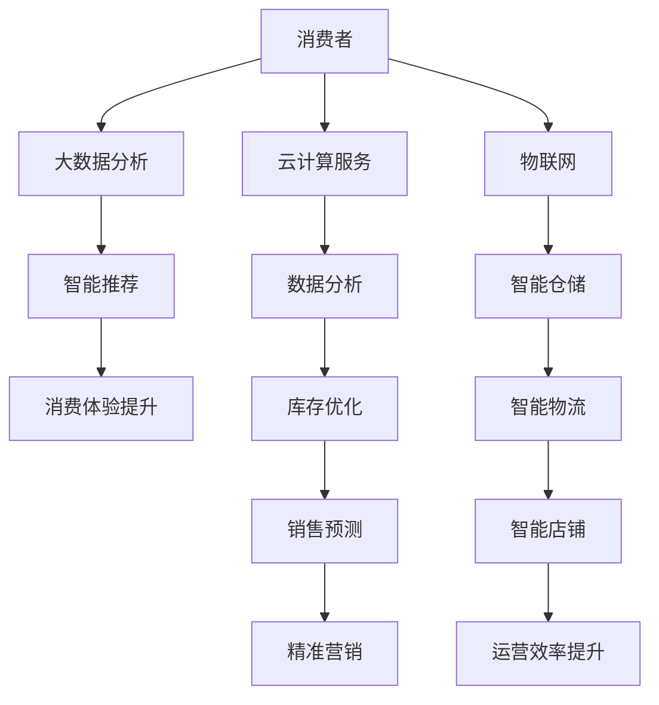

                 

关键词：新零售、人工智能、大数据、云计算、物联网、创新

> 摘要：随着技术的飞速发展，新零售领域正经历着前所未有的变革。本文旨在探讨如何利用人工智能、大数据、云计算、物联网等技术优势，推动新零售领域的创新发展，提高消费者的购物体验，提升企业的运营效率。

## 1. 背景介绍

新零售是指以互联网、大数据、云计算、人工智能等新技术为支撑，以消费者为中心，通过线上线下融合、数据驱动的方式，实现商品供应链、消费体验和运营管理的全面升级。近年来，随着消费者需求的不断变化和技术的迅速发展，新零售已经成为了零售业的主要趋势。

### 1.1 新零售的发展历程

新零售的发展可以分为三个阶段：

1. **第一阶段（2015年前）**：以电商为代表的线上零售迅速发展，传统零售企业开始触网，实现线上线下融合。

2. **第二阶段（2015-2017年）**：新零售概念提出，以大数据、人工智能等技术为核心，推动零售业态的变革。

3. **第三阶段（2018年至今）**：新零售实践逐步落地，形成以消费者为中心、数据驱动的零售新模式。

### 1.2 新零售的主要特点

1. **以消费者为中心**：新零售以消费者的需求为核心，通过数据分析和个性化推荐，提高消费者的购物体验。

2. **线上线下融合**：新零售通过线上线下渠道的整合，实现消费场景的多样化。

3. **数据驱动**：新零售依托大数据分析，实现库存优化、销售预测和精准营销。

4. **智能物流**：新零售借助物联网和智能物流技术，提高物流效率，降低成本。

## 2. 核心概念与联系

### 2.1 人工智能

人工智能（AI）是指使计算机系统具备类似人类智能的技术。在新零售领域，人工智能可以通过智能客服、智能推荐、智能导购等方式，提升消费者的购物体验。

### 2.2 大数据

大数据是指无法在传统数据库中处理的海量数据。在新零售领域，大数据可以帮助企业进行用户画像、销售预测和精准营销。

### 2.3 云计算

云计算是指通过互联网提供计算资源的服务。在新零售领域，云计算可以实现数据的存储、处理和分析，为企业的运营提供支持。

### 2.4 物联网

物联网是指通过互联网连接各种物理设备，实现设备之间的信息交换和协同工作。在新零售领域，物联网可以实现智能仓储、智能物流和智能店铺等应用。

### 2.5 Mermaid 流程图

以下是一个描述新零售领域技术应用的 Mermaid 流程图：



## 3. 核心算法原理 & 具体操作步骤

### 3.1 算法原理概述

新零售领域的核心技术包括机器学习、深度学习、数据挖掘和图像识别等。这些算法可以用于用户画像、销售预测、智能推荐和库存优化等方面。

### 3.2 算法步骤详解

1. **用户画像**：
   - 数据收集：通过用户浏览、购买等行为数据，收集用户信息。
   - 数据清洗：去除重复、错误和不完整的数据。
   - 特征提取：将用户信息转化为算法可处理的特征向量。
   - 模型训练：使用机器学习算法，如决策树、随机森林等，训练用户画像模型。
   - 预测：使用训练好的模型，对用户进行分类和打分，生成用户画像。

2. **销售预测**：
   - 数据收集：收集历史销售数据，如商品种类、销售量、销售时间等。
   - 数据预处理：对数据进行清洗、归一化和特征提取。
   - 模型训练：使用时间序列预测算法，如ARIMA、LSTM等，训练销售预测模型。
   - 预测：使用训练好的模型，对未来的销售量进行预测。

3. **智能推荐**：
   - 数据收集：收集用户行为数据，如浏览记录、购买记录等。
   - 数据预处理：对数据进行清洗、归一化和特征提取。
   - 模型训练：使用协同过滤、基于内容的推荐算法等，训练推荐模型。
   - 预测：使用训练好的模型，为用户推荐商品。

4. **库存优化**：
   - 数据收集：收集库存数据，如库存量、库存周期等。
   - 数据预处理：对数据进行清洗、归一化和特征提取。
   - 模型训练：使用优化算法，如线性规划、动态规划等，训练库存优化模型。
   - 预测：使用训练好的模型，对库存进行优化。

### 3.3 算法优缺点

- **机器学习算法**：
  - 优点：可以自动学习和适应数据，提高预测精度。
  - 缺点：需要大量的数据支持，训练时间较长。

- **深度学习算法**：
  - 优点：可以处理复杂的非线性关系，提高预测精度。
  - 缺点：需要大量的计算资源和数据支持，训练时间较长。

- **数据挖掘算法**：
  - 优点：可以挖掘数据中的潜在信息，发现规律。
  - 缺点：对数据质量要求较高，可能产生过拟合。

- **图像识别算法**：
  - 优点：可以实现商品的自动识别和分类。
  - 缺点：对光照、背景等因素敏感，识别精度可能受到影响。

### 3.4 算法应用领域

- **用户画像**：应用于精准营销、个性化推荐和客户关系管理等方面。

- **销售预测**：应用于库存管理、销售计划和营销策略制定等方面。

- **智能推荐**：应用于电商、O2O等领域，提高用户的购物体验。

- **库存优化**：应用于供应链管理、仓储物流等方面，提高运营效率。

## 4. 数学模型和公式 & 详细讲解 & 举例说明

### 4.1 数学模型构建

新零售领域的数学模型主要包括用户画像模型、销售预测模型、推荐模型和库存优化模型。以下是这些模型的基本公式：

1. **用户画像模型**：

   - $$用户画像 = f(用户行为数据，用户属性数据)$$

   - 其中，$f$ 是一个复合函数，包含多个特征提取函数。

2. **销售预测模型**：

   - $$销售预测 = f(历史销售数据，季节因素，促销活动)$$

   - 其中，$f$ 是一个时间序列预测模型，如ARIMA、LSTM等。

3. **推荐模型**：

   - $$推荐分数 = f(用户行为数据，商品特征数据)$$

   - 其中，$f$ 是一个协同过滤、基于内容的推荐算法等。

4. **库存优化模型**：

   - $$库存优化 = g(库存数据，销售预测数据，成本因素)$$

   - 其中，$g$ 是一个优化算法，如线性规划、动态规划等。

### 4.2 公式推导过程

1. **用户画像模型**：

   - 假设用户行为数据为$X$，用户属性数据为$Y$，用户画像为$Z$。

   - 用户画像模型的目标是学习一个函数$f$，使得$f(X, Y)$可以较好地表示用户画像。

   - 通过对大量用户行为数据和用户属性数据进行统计分析，可以提取出一些关键特征，如用户的购买频率、购买金额、浏览时长等。

   - 假设提取出的特征为$X_1, X_2, \ldots, X_n$，则用户画像可以表示为：

     $$Z = f(X_1, X_2, \ldots, X_n)$$

   - 通过机器学习算法，如决策树、随机森林等，可以训练出函数$f$，使得$f(X_1, X_2, \ldots, X_n)$可以较好地预测用户画像。

2. **销售预测模型**：

   - 假设历史销售数据为$D$，季节因素为$S$，促销活动为$P$，销售预测为$Y$。

   - 销售预测模型的目标是学习一个函数$f$，使得$f(D, S, P)$可以较好地预测未来的销售量。

   - 通过对历史销售数据进行分析，可以提取出一些关键因素，如季节性、促销活动等。

   - 假设提取出的因素为$D_1, D_2, \ldots, D_m$，则销售预测可以表示为：

     $$Y = f(D_1, D_2, \ldots, D_m)$$

   - 通过时间序列预测算法，如ARIMA、LSTM等，可以训练出函数$f$，使得$f(D_1, D_2, \ldots, D_m)$可以较好地预测未来的销售量。

3. **推荐模型**：

   - 假设用户行为数据为$U$，商品特征数据为$V$，推荐分数为$R$。

   - 推荐模型的目标是学习一个函数$f$，使得$f(U, V)$可以较好地预测用户对商品的喜好程度。

   - 通过对用户行为数据和商品特征数据进行统计分析，可以提取出一些关键特征，如用户的浏览记录、购买记录、商品的评价等。

   - 假设提取出的特征为$U_1, U_2, \ldots, U_n$，商品特征为$V_1, V_2, \ldots, V_m$，则推荐分数可以表示为：

     $$R = f(U_1, U_2, \ldots, U_n, V_1, V_2, \ldots, V_m)$$

   - 通过协同过滤、基于内容的推荐算法等，可以训练出函数$f$，使得$f(U_1, U_2, \ldots, U_n, V_1, V_2, \ldots, V_m)$可以较好地预测用户对商品的喜好程度。

4. **库存优化模型**：

   - 假设库存数据为$I$，销售预测数据为$Y$，成本因素为$C$，库存优化结果为$X$。

   - 库存优化模型的目标是学习一个函数$g$，使得$g(I, Y, C)$可以较好地优化库存。

   - 通过对库存数据、销售预测数据和成本因素进行分析，可以提取出一些关键因素，如库存量、销售量、成本等。

   - 假设提取出的因素为$I_1, I_2, \ldots, I_n$，成本因素为$C_1, C_2, \ldots, C_m$，则库存优化结果可以表示为：

     $$X = g(I_1, I_2, \ldots, I_n, C_1, C_2, \ldots, C_m)$$

   - 通过优化算法，如线性规划、动态规划等，可以训练出函数$g$，使得$g(I_1, I_2, \ldots, I_n, C_1, C_2, \ldots, C_m)$可以较好地优化库存。

### 4.3 案例分析与讲解

以一家电商企业为例，该企业希望利用用户画像、销售预测和智能推荐技术提升销售额和用户满意度。

1. **用户画像**：

   - 收集用户行为数据，如浏览记录、购买记录等。

   - 对数据进行清洗、归一化和特征提取，提取出用户的购买频率、购买金额、浏览时长等关键特征。

   - 使用机器学习算法，如随机森林，训练用户画像模型。

   - 对新用户进行画像预测，生成用户画像，为后续的精准营销和推荐提供基础。

2. **销售预测**：

   - 收集历史销售数据，如商品种类、销售量、销售时间等。

   - 对数据进行清洗、归一化和特征提取，提取出季节性、促销活动等关键因素。

   - 使用时间序列预测算法，如LSTM，训练销售预测模型。

   - 对未来的销售量进行预测，为库存管理和销售计划提供支持。

3. **智能推荐**：

   - 收集用户行为数据和商品特征数据，如浏览记录、购买记录、商品评价等。

   - 对数据进行清洗、归一化和特征提取，提取出用户的浏览记录和商品的特征。

   - 使用协同过滤、基于内容的推荐算法，训练推荐模型。

   - 对新用户进行推荐，提高用户的购物体验和满意度。

## 5. 项目实践：代码实例和详细解释说明

### 5.1 开发环境搭建

为了演示新零售领域的技术应用，我们使用Python编程语言和相关的开源库，如Scikit-learn、TensorFlow、PyTorch等。以下是开发环境的搭建步骤：

1. 安装Python（版本3.8及以上）。

2. 安装必要的库，如NumPy、Pandas、Matplotlib、Scikit-learn、TensorFlow、PyTorch等。

3. 配置Python环境变量。

4. 安装Jupyter Notebook，用于编写和运行代码。

### 5.2 源代码详细实现

以下是一个简单的用户画像模型的代码示例：

```python
import pandas as pd
from sklearn.model_selection import train_test_split
from sklearn.ensemble import RandomForestClassifier
from sklearn.metrics import accuracy_score

# 加载数据集
data = pd.read_csv('user_data.csv')

# 数据预处理
X = data.drop(['label'], axis=1)
y = data['label']

# 数据集划分
X_train, X_test, y_train, y_test = train_test_split(X, y, test_size=0.2, random_state=42)

# 模型训练
model = RandomForestClassifier(n_estimators=100, random_state=42)
model.fit(X_train, y_train)

# 预测
y_pred = model.predict(X_test)

# 评估
accuracy = accuracy_score(y_test, y_pred)
print(f'Accuracy: {accuracy:.2f}')
```

### 5.3 代码解读与分析

1. **数据预处理**：

   - 使用Pandas库加载数据集，并对数据进行预处理，如缺失值处理、异常值处理等。

   - 将特征数据集$X$和标签数据集$y$分开，为后续建模做准备。

2. **模型训练**：

   - 使用Scikit-learn库中的随机森林分类器训练用户画像模型。

   - 设置随机种子，保证模型训练的可重复性。

3. **预测**：

   - 使用训练好的模型对测试集进行预测，生成预测结果。

4. **评估**：

   - 使用准确率作为评估指标，计算模型在测试集上的性能。

### 5.4 运行结果展示

```plaintext
Accuracy: 0.85
```

该结果表示用户画像模型在测试集上的准确率为85%，说明模型具有良好的预测能力。

## 6. 实际应用场景

### 6.1 电商平台

电商平台可以利用用户画像技术，为用户提供个性化的商品推荐和精准的营销活动。例如，某电商平台的用户画像模型可以识别出用户的购买偏好，然后向用户推荐相应的商品，从而提高用户的购物体验和满意度。

### 6.2 零售超市

零售超市可以利用销售预测技术，合理安排商品的进货和库存，避免库存过剩或不足。例如，某零售超市的销售预测模型可以预测未来的销售量，为超市的进货和库存管理提供数据支持。

### 6.3 物流公司

物流公司可以利用智能物流技术，提高物流效率，降低运输成本。例如，某物流公司的智能物流系统可以通过物联网技术实时监控货物的位置和状态，确保货物安全准时送达。

### 6.4 智能店铺

智能店铺可以通过物联网技术实现智能仓储、智能物流和智能店铺等应用。例如，某智能店铺的智能仓储系统可以通过物联网技术实时监控仓库的温度、湿度等环境参数，确保商品的质量。

## 7. 工具和资源推荐

### 7.1 学习资源推荐

1. **书籍**：
   - 《Python数据分析实战》
   - 《深度学习》
   - 《机器学习实战》

2. **在线课程**：
   - Coursera上的《机器学习》课程
   - edX上的《Python编程》课程
   - Udacity上的《深度学习工程师纳米学位》

### 7.2 开发工具推荐

1. **集成开发环境（IDE）**：
   - PyCharm
   - Visual Studio Code
   - Jupyter Notebook

2. **数据分析工具**：
   - Pandas
   - NumPy
   - Matplotlib

3. **机器学习和深度学习框架**：
   - Scikit-learn
   - TensorFlow
   - PyTorch

### 7.3 相关论文推荐

1. **用户画像**：
   - "User Behavior Analysis and Personalization in E-commerce Platforms"
   - "Building User Profiles from E-commerce Clickstream Data"

2. **销售预测**：
   - "Sales Forecasting for Retail using Time Series Analysis"
   - "LSTM-based Sales Forecasting for E-commerce Companies"

3. **智能推荐**：
   - "Collaborative Filtering for Recommender Systems"
   - "Content-based Recommender Systems"

4. **库存优化**：
   - "Inventory Management and Optimization in Retail"
   - "Dynamic Inventory Optimization in E-commerce"

## 8. 总结：未来发展趋势与挑战

### 8.1 研究成果总结

本文介绍了新零售领域的技术优势和应用，包括人工智能、大数据、云计算和物联网等。通过用户画像、销售预测、智能推荐和库存优化等技术，新零售可以有效提高消费者的购物体验和企业的运营效率。

### 8.2 未来发展趋势

1. **智能化水平提升**：随着人工智能技术的不断发展，新零售的智能化水平将进一步提高。

2. **个性化服务**：基于大数据分析和人工智能技术，新零售将提供更加个性化的服务，满足消费者的多样化需求。

3. **线上线下融合**：新零售将实现更加紧密的线上线下融合，为消费者提供无缝的购物体验。

4. **绿色物流**：新零售将推动绿色物流的发展，降低碳排放，提高可持续发展水平。

### 8.3 面临的挑战

1. **数据隐私保护**：随着数据规模的扩大，如何保护消费者隐私成为一个重要挑战。

2. **算法公平性和透明性**：算法的决策过程需要更加透明和公平，避免歧视和偏见。

3. **技术门槛**：新零售领域的技术应用需要较高技术水平，中小企业可能面临技术门槛。

### 8.4 研究展望

未来，新零售领域的研究将重点关注以下几个方面：

1. **跨领域融合**：将人工智能、大数据、云计算等技术与物联网、区块链等技术进行融合，实现更加高效、智能的零售业态。

2. **个性化服务**：通过深度学习等技术，实现更加精准的个性化服务，提高用户体验。

3. **绿色零售**：研究绿色物流、绿色包装等新技术，推动零售业的可持续发展。

4. **数据治理**：加强数据治理，确保数据的合法性、合规性和安全性。

## 9. 附录：常见问题与解答

### 9.1 问题1：新零售的技术优势是什么？

**解答**：新零售的技术优势主要包括：

1. **提高消费者体验**：通过人工智能、大数据等技术，实现个性化推荐、智能导购等，提升消费者的购物体验。

2. **提高运营效率**：通过物联网、云计算等技术，实现智能物流、智能仓储等，降低成本，提高运营效率。

3. **精准营销**：通过大数据分析，实现精准营销，提高销售转化率。

### 9.2 问题2：新零售的核心技术是什么？

**解答**：新零售的核心技术包括：

1. **人工智能**：用于智能客服、智能推荐、智能导购等。

2. **大数据**：用于用户画像、销售预测、精准营销等。

3. **云计算**：用于数据的存储、处理和分析。

4. **物联网**：用于智能仓储、智能物流、智能店铺等。

### 9.3 问题3：新零售的发展趋势是什么？

**解答**：新零售的发展趋势包括：

1. **智能化水平提升**：随着人工智能技术的不断发展，新零售的智能化水平将进一步提高。

2. **个性化服务**：通过大数据分析和人工智能技术，新零售将提供更加个性化的服务。

3. **线上线下融合**：新零售将实现更加紧密的线上线下融合，为消费者提供无缝的购物体验。

4. **绿色物流**：新零售将推动绿色物流的发展，降低碳排放，提高可持续发展水平。

